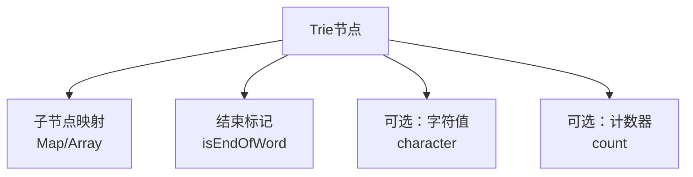
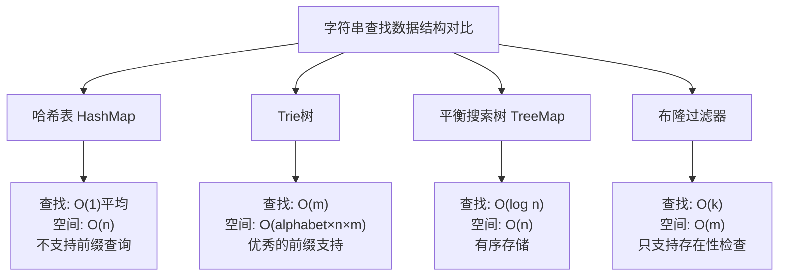

## 引言

在字符串处理的算法世界中，Trie树（也称为前缀树或字典树）是一个优雅而强大的数据结构。它以其独特的存储方式和高效的查找性能，在文本处理、自动补全、拼写检查等众多应用场景中发挥着重要作用。

## 什么是Trie树？

Trie树是一种树形数据结构，主要用于高效地存储和检索字符串数据集中的键。它的名字来源于单词"retrieval"（检索），但通常读作"try"。

### Trie树的核心特点

1. **公共前缀共享**：具有相同前缀的字符串在树中共享路径
2. **根节点为空**：根节点不包含字符，代表空字符串
3. **边存储字符**：从根到任意节点的路径代表一个字符串
4. **标记结束**：通过标记位区分完整单词和前缀

### 基本结构可视化

```
        root
       /  |  \
      a   b   c
     /   / \   \
    n   a   e  a
   /   /   /  / \
  d  t h  t  r  t
     |     |  |
     e     a  e
           |
           r
```

这个Trie树存储了单词：and, bat, bear, beat, cat, care, cater

## Trie树的详细原理

### 节点结构设计

每个Trie节点通常包含以下组件：



### ASCII艺术展示存储过程

假设我们要插入单词"cat", "car", "card":

```
插入 "cat":
    root
     |
     c
     |
     a
     |
     t*

插入 "car":
    root
     |
     c
     |
     a
    / \
   t*  r*

插入 "card":
    root
     |
     c
     |
     a
    / \
   t*  r
       |
       d*
```

其中 `*` 表示该节点是一个完整单词的结束。

## 完整的Java实现

### 基础Trie树实现

```java
public class Trie {

    // Trie节点内部类
    private static class TrieNode {
        private TrieNode[] children;
        private boolean isEndOfWord;
        private int wordCount; // 存储以此节点结尾的单词数量

        public TrieNode() {
            children = new TrieNode[26]; // 假设只存储小写字母
            isEndOfWord = false;
            wordCount = 0;
        }
    }

    private TrieNode root;

    public Trie() {
        root = new TrieNode();
    }

    /**
     * 插入单词到Trie树中
     * 时间复杂度: O(m) 其中m是单词长度
     * 空间复杂度: O(ALPHABET_SIZE * N * M) 最坏情况
     */
    public void insert(String word) {
        if (word == null || word.isEmpty()) {
            return;
        }

        TrieNode current = root;

        for (char c : word.toCharArray()) {
            int index = c - 'a';

            // 验证字符范围
            if (index < 0 || index >= 26) {
                throw new IllegalArgumentException("只支持小写字母a-z");
            }

            if (current.children[index] == null) {
                current.children[index] = new TrieNode();
            }
            current = current.children[index];
        }

        current.isEndOfWord = true;
        current.wordCount++;
    }

    /**
     * 搜索单词是否存在
     * 时间复杂度: O(m) 其中m是单词长度
     * 空间复杂度: O(1)
     */
    public boolean search(String word) {
        TrieNode node = searchNode(word);
        return node != null && node.isEndOfWord;
    }

    /**
     * 检查是否存在以给定前缀开头的单词
     * 时间复杂度: O(m) 其中m是前缀长度
     */
    public boolean startsWith(String prefix) {
        return searchNode(prefix) != null;
    }

    /**
     * 辅助方法：搜索节点
     */
    private TrieNode searchNode(String word) {
        if (word == null) {
            return null;
        }

        TrieNode current = root;

        for (char c : word.toCharArray()) {
            int index = c - 'a';

            if (index < 0 || index >= 26 || current.children[index] == null) {
                return null;
            }
            current = current.children[index];
        }

        return current;
    }

    /**
     * 删除单词
     * 时间复杂度: O(m) 其中m是单词长度
     */
    public boolean delete(String word) {
        return deleteHelper(root, word, 0);
    }

    private boolean deleteHelper(TrieNode current, String word, int index) {
        if (index == word.length()) {
            // 到达单词末尾
            if (!current.isEndOfWord) {
                return false; // 单词不存在
            }
            current.isEndOfWord = false;
            current.wordCount--;

            // 如果当前节点没有子节点，可以删除
            return !hasChildren(current);
        }

        char c = word.charAt(index);
        int charIndex = c - 'a';
        TrieNode node = current.children[charIndex];

        if (node == null) {
            return false; // 单词不存在
        }

        boolean shouldDeleteChild = deleteHelper(node, word, index + 1);

        if (shouldDeleteChild) {
            current.children[charIndex] = null;

            // 如果当前节点不是单词结尾且没有其他子节点，返回true
            return !current.isEndOfWord && !hasChildren(current);
        }

        return false;
    }

    /**
     * 检查节点是否有子节点
     */
    private boolean hasChildren(TrieNode node) {
        for (TrieNode child : node.children) {
            if (child != null) {
                return true;
            }
        }
        return false;
    }

    /**
     * 获取所有以给定前缀开头的单词
     */
    public List<String> getAllWordsWithPrefix(String prefix) {
        List<String> result = new ArrayList<>();
        TrieNode prefixNode = searchNode(prefix);

        if (prefixNode != null) {
            getAllWordsFromNode(prefixNode, prefix, result);
        }

        return result;
    }

    private void getAllWordsFromNode(TrieNode node, String prefix, List<String> result) {
        if (node.isEndOfWord) {
            result.add(prefix);
        }

        for (int i = 0; i < 26; i++) {
            if (node.children[i] != null) {
                char nextChar = (char) ('a' + i);
                getAllWordsFromNode(node.children[i], prefix + nextChar, result);
            }
        }
    }

    /**
     * 统计Trie树中的单词总数
     */
    public int countWords() {
        return countWordsFromNode(root);
    }

    private int countWordsFromNode(TrieNode node) {
        int count = 0;

        if (node.isEndOfWord) {
            count += node.wordCount;
        }

        for (TrieNode child : node.children) {
            if (child != null) {
                count += countWordsFromNode(child);
            }
        }

        return count;
    }
}
```

### 高级功能实现

#### 1. 通配符搜索

```java
/**
 * 支持通配符'.'的搜索功能
 * '.' 可以匹配任意单个字符
 */
public boolean searchWithWildcard(String word) {
    return searchWildcardHelper(root, word, 0);
}

private boolean searchWildcardHelper(TrieNode node, String word, int index) {
    if (index == word.length()) {
        return node.isEndOfWord;
    }

    char c = word.charAt(index);

    if (c == '.') {
        // 通配符，尝试所有可能的字符
        for (TrieNode child : node.children) {
            if (child != null && searchWildcardHelper(child, word, index + 1)) {
                return true;
            }
        }
        return false;
    } else {
        // 普通字符
        int charIndex = c - 'a';
        if (charIndex < 0 || charIndex >= 26 || node.children[charIndex] == null) {
            return false;
        }
        return searchWildcardHelper(node.children[charIndex], word, index + 1);
    }
}
```

#### 2. 最短唯一前缀

```java
/**
 * 找到每个单词的最短唯一前缀
 */
public Map<String, String> findShortestUniquePrefixes(List<String> words) {
    Map<String, String> result = new HashMap<>();

    // 首先插入所有单词
    for (String word : words) {
        insert(word);
    }

    // 为每个单词找最短唯一前缀
    for (String word : words) {
        String prefix = findShortestUniquePrefix(word);
        result.put(word, prefix);
    }

    return result;
}

private String findShortestUniquePrefix(String word) {
    TrieNode current = root;
    StringBuilder prefix = new StringBuilder();

    for (char c : word.toCharArray()) {
        prefix.append(c);
        current = current.children[c - 'a'];

        // 如果当前节点只有一个子节点路径通向目标单词，则这是最短前缀
        if (countPathsFromNode(current) == 1) {
            break;
        }
    }

    return prefix.toString();
}

private int countPathsFromNode(TrieNode node) {
    int count = 0;
    if (node.isEndOfWord) count++;

    for (TrieNode child : node.children) {
        if (child != null) {
            count += countPathsFromNode(child);
        }
    }

    return count;
}
```

#### 3. 压缩Trie（Patricia Tree）

```java
/**
 * 压缩Trie节点 - 将单链路径压缩为一个节点
 */
public static class CompressedTrieNode {
    private Map<String, CompressedTrieNode> children;
    private boolean isEndOfWord;
    private String edgeLabel; // 边上的字符串标签

    public CompressedTrieNode() {
        children = new HashMap<>();
        isEndOfWord = false;
        edgeLabel = "";
    }
}

public class CompressedTrie {
    private CompressedTrieNode root;

    public CompressedTrie() {
        root = new CompressedTrieNode();
    }

    public void insert(String word) {
        insertHelper(root, word, 0);
    }

    private void insertHelper(CompressedTrieNode node, String word, int startIndex) {
        if (startIndex == word.length()) {
            node.isEndOfWord = true;
            return;
        }

        String suffix = word.substring(startIndex);

        // 寻找匹配的边
        for (Map.Entry<String, CompressedTrieNode> entry : node.children.entrySet()) {
            String edgeLabel = entry.getKey();
            CompressedTrieNode child = entry.getValue();

            int commonPrefixLength = getCommonPrefixLength(suffix, edgeLabel);

            if (commonPrefixLength > 0) {
                if (commonPrefixLength == edgeLabel.length()) {
                    // 完全匹配边标签，继续递归
                    insertHelper(child, word, startIndex + commonPrefixLength);
                    return;
                } else {
                    // 部分匹配，需要分裂节点
                    splitNode(node, edgeLabel, child, commonPrefixLength);
                    insertHelper(node, word, startIndex);
                    return;
                }
            }
        }

        // 没有找到匹配的边，创建新的子节点
        CompressedTrieNode newChild = new CompressedTrieNode();
        newChild.isEndOfWord = true;
        node.children.put(suffix, newChild);
    }

    private int getCommonPrefixLength(String str1, String str2) {
        int length = Math.min(str1.length(), str2.length());
        int i = 0;
        while (i < length && str1.charAt(i) == str2.charAt(i)) {
            i++;
        }
        return i;
    }

    private void splitNode(CompressedTrieNode parent, String edgeLabel,
                          CompressedTrieNode child, int splitPoint) {
        // 创建新的中间节点
        CompressedTrieNode middleNode = new CompressedTrieNode();

        // 更新边标签
        String commonPrefix = edgeLabel.substring(0, splitPoint);
        String remainingSuffix = edgeLabel.substring(splitPoint);

        // 重新连接节点
        parent.children.remove(edgeLabel);
        parent.children.put(commonPrefix, middleNode);
        middleNode.children.put(remainingSuffix, child);
    }
}
```

## 实际应用场景

### 1. 自动补全系统

```java
public class AutoCompleteSystem {
    private Trie trie;
    private Map<String, Integer> wordFrequency;

    public AutoCompleteSystem() {
        trie = new Trie();
        wordFrequency = new HashMap<>();
    }

    public void addWord(String word, int frequency) {
        trie.insert(word);
        wordFrequency.put(word, wordFrequency.getOrDefault(word, 0) + frequency);
    }

    public List<String> getSuggestions(String prefix, int maxSuggestions) {
        List<String> allMatches = trie.getAllWordsWithPrefix(prefix);

        // 按频率排序
        return allMatches.stream()
                .sorted((a, b) -> wordFrequency.getOrDefault(b, 0) -
                                 wordFrequency.getOrDefault(a, 0))
                .limit(maxSuggestions)
                .collect(Collectors.toList());
    }
}
```

### 2. 拼写检查器

```java
public class SpellChecker {
    private Trie dictionary;

    public SpellChecker(List<String> words) {
        dictionary = new Trie();
        for (String word : words) {
            dictionary.insert(word.toLowerCase());
        }
    }

    public boolean isCorrect(String word) {
        return dictionary.search(word.toLowerCase());
    }

    public List<String> getSuggestions(String word) {
        List<String> suggestions = new ArrayList<>();

        // 1. 检查单字符删除
        suggestions.addAll(getSuggestionsByDeletion(word));

        // 2. 检查单字符插入
        suggestions.addAll(getSuggestionsByInsertion(word));

        // 3. 检查单字符替换
        suggestions.addAll(getSuggestionsBySubstitution(word));

        // 4. 检查相邻字符交换
        suggestions.addAll(getSuggestionsByTransposition(word));

        return suggestions.stream().distinct().collect(Collectors.toList());
    }

    private List<String> getSuggestionsByDeletion(String word) {
        List<String> suggestions = new ArrayList<>();
        for (int i = 0; i < word.length(); i++) {
            String candidate = word.substring(0, i) + word.substring(i + 1);
            if (dictionary.search(candidate)) {
                suggestions.add(candidate);
            }
        }
        return suggestions;
    }

    private List<String> getSuggestionsByInsertion(String word) {
        List<String> suggestions = new ArrayList<>();
        for (int i = 0; i <= word.length(); i++) {
            for (char c = 'a'; c <= 'z'; c++) {
                String candidate = word.substring(0, i) + c + word.substring(i);
                if (dictionary.search(candidate)) {
                    suggestions.add(candidate);
                }
            }
        }
        return suggestions;
    }

    private List<String> getSuggestionsBySubstitution(String word) {
        List<String> suggestions = new ArrayList<>();
        for (int i = 0; i < word.length(); i++) {
            for (char c = 'a'; c <= 'z'; c++) {
                if (c != word.charAt(i)) {
                    String candidate = word.substring(0, i) + c + word.substring(i + 1);
                    if (dictionary.search(candidate)) {
                        suggestions.add(candidate);
                    }
                }
            }
        }
        return suggestions;
    }

    private List<String> getSuggestionsByTransposition(String word) {
        List<String> suggestions = new ArrayList<>();
        for (int i = 0; i < word.length() - 1; i++) {
            char[] chars = word.toCharArray();
            char temp = chars[i];
            chars[i] = chars[i + 1];
            chars[i + 1] = temp;
            String candidate = new String(chars);
            if (dictionary.search(candidate)) {
                suggestions.add(candidate);
            }
        }
        return suggestions;
    }
}
```

### 3. IP路由表

```java
public class IPRoutingTable {

    static class IPTrieNode {
        IPTrieNode[] children = new IPTrieNode[2]; // 0和1
        String gateway; // 网关地址
        boolean isValidRoute;
    }

    private IPTrieNode root;

    public IPRoutingTable() {
        root = new IPTrieNode();
    }

    public void addRoute(String ipPrefix, String gateway) {
        IPTrieNode current = root;

        for (char bit : ipPrefix.toCharArray()) {
            if (bit != '0' && bit != '1') {
                throw new IllegalArgumentException("IP前缀只能包含0和1");
            }

            int index = bit - '0';
            if (current.children[index] == null) {
                current.children[index] = new IPTrieNode();
            }
            current = current.children[index];
        }

        current.isValidRoute = true;
        current.gateway = gateway;
    }

    public String findGateway(String ipAddress) {
        IPTrieNode current = root;
        String lastValidGateway = null;

        for (char bit : ipAddress.toCharArray()) {
            int index = bit - '0';

            if (current.children[index] == null) {
                break;
            }

            current = current.children[index];

            if (current.isValidRoute) {
                lastValidGateway = current.gateway;
            }
        }

        return lastValidGateway; // 最长前缀匹配
    }
}
```

## 性能分析与优化

### 时间复杂度分析

| 操作 | 时间复杂度 | 说明 |
|------|------------|------|
| 插入 | O(m) | m为字符串长度 |
| 查找 | O(m) | m为字符串长度 |
| 删除 | O(m) | m为字符串长度 |
| 前缀搜索 | O(p + n) | p为前缀长度，n为匹配结果数 |

### 空间复杂度分析

```
最坏情况空间复杂度: O(ALPHABET_SIZE × N × M)
- ALPHABET_SIZE: 字符集大小
- N: 字符串数量
- M: 平均字符串长度

最好情况（高度共享前缀）: O(总字符数)
```

### 内存优化策略

#### 1. 数组vs映射权衡

```java
// 选择1: 固定大小数组（适合小字符集）
TrieNode[] children = new TrieNode[26]; // 快速访问，但可能浪费空间

// 选择2: HashMap（适合大字符集或稀疏数据）
Map<Character, TrieNode> children = new HashMap<>(); // 节省空间，但访问稍慢

// 选择3: 自适应策略
private static class AdaptiveTrieNode {
    private Object children; // 可以是数组或Map
    private boolean useArray;
    private int childCount;

    private void addChild(char c, TrieNode node) {
        if (!useArray && childCount >= ARRAY_THRESHOLD) {
            convertToArray();
        }
        // 添加逻辑...
    }
}
```

#### 2. 双数组Trie（Double Array Trie）

```java
public class DoubleArrayTrie {
    private int[] base;  // base数组
    private int[] check; // check数组
    private boolean[] leaf; // 叶子节点标记

    // 双数组Trie可以显著减少内存使用
    // 状态转移: base[s] + c = t, check[t] = s
    // 其中s是当前状态，c是输入字符，t是目标状态
}
```

### Trie树与其他数据结构对比



### 性能基准测试代码

```java
public class TriePerformanceTest {

    public static void main(String[] args) {
        List<String> testWords = generateTestWords(100000);

        // 测试Trie
        long start = System.nanoTime();
        Trie trie = new Trie();
        for (String word : testWords) {
            trie.insert(word);
        }
        long trieInsertTime = System.nanoTime() - start;

        // 测试HashMap
        start = System.nanoTime();
        Set<String> hashSet = new HashSet<>();
        for (String word : testWords) {
            hashSet.add(word);
        }
        long hashInsertTime = System.nanoTime() - start;

        System.out.println("Trie插入时间: " + trieInsertTime / 1_000_000 + "ms");
        System.out.println("HashMap插入时间: " + hashInsertTime / 1_000_000 + "ms");

        // 测试查找性能
        List<String> searchWords = testWords.subList(0, 1000);

        start = System.nanoTime();
        for (String word : searchWords) {
            trie.search(word);
        }
        long trieSearchTime = System.nanoTime() - start;

        start = System.nanoTime();
        for (String word : searchWords) {
            hashSet.contains(word);
        }
        long hashSearchTime = System.nanoTime() - start;

        System.out.println("Trie查找时间: " + trieSearchTime / 1_000_000 + "ms");
        System.out.println("HashMap查找时间: " + hashSearchTime / 1_000_000 + "ms");

        // 测试前缀查询（Trie独有优势）
        start = System.nanoTime();
        for (int i = 0; i < 100; i++) {
            trie.getAllWordsWithPrefix("test");
        }
        long prefixSearchTime = System.nanoTime() - start;

        System.out.println("前缀查询时间: " + prefixSearchTime / 1_000_000 + "ms");
    }

    private static List<String> generateTestWords(int count) {
        List<String> words = new ArrayList<>();
        Random random = new Random();

        for (int i = 0; i < count; i++) {
            StringBuilder word = new StringBuilder();
            int length = random.nextInt(10) + 3; // 3-12字符长度

            for (int j = 0; j < length; j++) {
                word.append((char) ('a' + random.nextInt(26)));
            }
            words.add(word.toString());
        }

        return words;
    }
}
```

## 高级应用实例

### 1. 单词游戏解算器

```java
public class WordGameSolver {
    private Trie dictionary;

    public WordGameSolver(List<String> words) {
        dictionary = new Trie();
        for (String word : words) {
            dictionary.insert(word.toLowerCase());
        }
    }

    /**
     * 找出给定字母可以组成的所有单词
     */
    public List<String> findWords(char[] availableLetters) {
        List<String> result = new ArrayList<>();
        boolean[] used = new boolean[availableLetters.length];

        findWordsHelper(dictionary.root, availableLetters, used,
                       new StringBuilder(), result);

        return result;
    }

    private void findWordsHelper(TrieNode node, char[] letters,
                               boolean[] used, StringBuilder currentWord,
                               List<String> result) {
        if (node.isEndOfWord && currentWord.length() > 0) {
            result.add(currentWord.toString());
        }

        for (int i = 0; i < letters.length; i++) {
            if (!used[i]) {
                char c = letters[i];
                int index = c - 'a';

                if (index >= 0 && index < 26 && node.children[index] != null) {
                    used[i] = true;
                    currentWord.append(c);

                    findWordsHelper(node.children[index], letters, used,
                                  currentWord, result);

                    currentWord.deleteCharAt(currentWord.length() - 1);
                    used[i] = false;
                }
            }
        }
    }
}
```

### 2. 文本处理与分词

```java
public class TextProcessor {
    private Trie wordTrie;

    public TextProcessor(Set<String> vocabulary) {
        wordTrie = new Trie();
        for (String word : vocabulary) {
            wordTrie.insert(word.toLowerCase());
        }
    }

    /**
     * 使用最大匹配算法进行分词
     */
    public List<String> segmentText(String text) {
        List<String> segments = new ArrayList<>();
        int i = 0;

        while (i < text.length()) {
            String longestMatch = findLongestMatch(text, i);

            if (longestMatch != null) {
                segments.add(longestMatch);
                i += longestMatch.length();
            } else {
                // 未知字符，跳过
                i++;
            }
        }

        return segments;
    }

    private String findLongestMatch(String text, int start) {
        String longestMatch = null;
        TrieNode current = wordTrie.root;

        for (int i = start; i < text.length(); i++) {
            char c = Character.toLowerCase(text.charAt(i));
            int index = c - 'a';

            if (index < 0 || index >= 26 || current.children[index] == null) {
                break;
            }

            current = current.children[index];

            if (current.isEndOfWord) {
                longestMatch = text.substring(start, i + 1);
            }
        }

        return longestMatch;
    }
}
```

## 实战练习题

### 练习1：实现支持通配符的搜索

```java
/**
 * 扩展Trie类，支持'?'（匹配单个字符）和'*'（匹配零个或多个字符）
 */
public boolean searchWithAdvancedWildcard(String pattern) {
    return searchAdvancedWildcardHelper(root, pattern, 0);
}

private boolean searchAdvancedWildcardHelper(TrieNode node, String pattern, int index) {
    if (index == pattern.length()) {
        return node.isEndOfWord;
    }

    char c = pattern.charAt(index);

    if (c == '*') {
        // '*' 可以匹配零个或多个字符
        // 尝试匹配零个字符（跳过'*'）
        if (searchAdvancedWildcardHelper(node, pattern, index + 1)) {
            return true;
        }

        // 尝试匹配一个或多个字符
        for (TrieNode child : node.children) {
            if (child != null && searchAdvancedWildcardHelper(child, pattern, index)) {
                return true;
            }
        }
        return false;
    } else if (c == '?') {
        // '?' 匹配任意单个字符
        for (TrieNode child : node.children) {
            if (child != null && searchAdvancedWildcardHelper(child, pattern, index + 1)) {
                return true;
            }
        }
        return false;
    } else {
        // 普通字符
        int charIndex = c - 'a';
        if (charIndex < 0 || charIndex >= 26 || node.children[charIndex] == null) {
            return false;
        }
        return searchAdvancedWildcardHelper(node.children[charIndex], pattern, index + 1);
    }
}
```

### 练习2：最长公共前缀

```java
/**
 * 找到Trie中所有单词的最长公共前缀
 */
public String findLongestCommonPrefix() {
    StringBuilder prefix = new StringBuilder();
    TrieNode current = root;

    while (true) {
        // 如果当前节点是单词结尾，停止
        if (current.isEndOfWord) {
            break;
        }

        // 计算子节点数量
        int childCount = 0;
        TrieNode nextNode = null;
        char nextChar = 0;

        for (int i = 0; i < 26; i++) {
            if (current.children[i] != null) {
                childCount++;
                nextNode = current.children[i];
                nextChar = (char) ('a' + i);
            }
        }

        // 如果有多个子节点，停止
        if (childCount != 1) {
            break;
        }

        prefix.append(nextChar);
        current = nextNode;
    }

    return prefix.toString();
}
```

## 总结

Trie树作为一种专门针对字符串操作优化的数据结构，在现代软件系统中扮演着重要角色。它的核心优势在于：

### 主要优点

1. **前缀匹配优秀**：天然支持前缀查询，是其他数据结构难以比拟的
2. **查找效率稳定**：时间复杂度只依赖于字符串长度，不受数据集大小影响
3. **有序性**：隐式维护字典序，便于排序输出
4. **公共前缀压缩**：相同前缀只存储一份，节省空间

### 适用场景

- **搜索引擎**：自动补全、拼写纠错
- **IP路由**：最长前缀匹配
- **生物信息学**：DNA序列分析
- **编译器**：关键字识别、符号表
- **游戏开发**：单词游戏、文本匹配

### 性能特点

- 查找速度稳定，不受数据量影响
- 空间复杂度较高，但可通过压缩优化
- 非常适合前缀相关的查询操作
- 在某些场景下比哈希表更优秀

通过深入理解Trie树的原理和实现，我们能够在面对字符串处理问题时选择最合适的解决方案，编写出高效且优雅的代码。

Trie树的美妙之处在于它将复杂的字符串操作转化为简单的树遍历，体现了算法设计中"化繁为简"的精神。掌握Trie树，不仅能够解决实际的工程问题，更能帮助我们培养良好的算法思维。