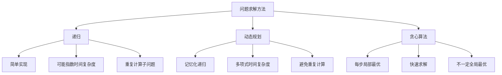
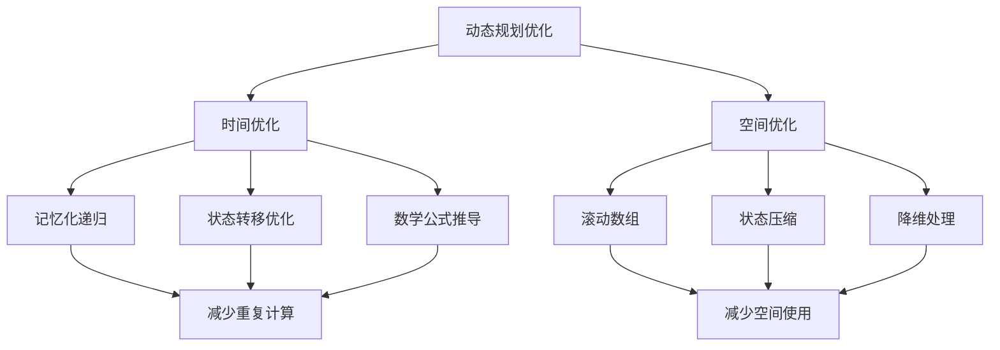

## 引言

动态规划（Dynamic Programming，简称DP）是计算机科学中一种重要的算法设计技术，它通过把原问题分解为相对简单的子问题的方式求解复杂问题。这种方法既不是简单的递归，也不是贪心算法，而是一种"记忆化"的递归思想。

在这篇文章中，我们将深入探讨动态规划的核心思想、解题技巧以及在实际开发中的应用。

## 1. 动态规划的核心思想

### 1.1 什么是动态规划

动态规划是一种通过把原问题分解为相对简单的子问题，并保存子问题的解来避免重复计算，从而提高算法效率的方法。它的核心思想可以用一句话概括：

> **"大事化小，小事化了，记住过程，避免重复"**

### 1.2 动态规划的基本要素

动态规划问题必须满足两个重要性质：

1. **最优子结构（Optimal Substructure）**：问题的最优解包含子问题的最优解
2. **重叠子问题（Overlapping Subproblems）**：递归算法反复求解相同的子问题

### 1.3 动态规划 vs 递归 vs 贪心



## 2. 生活中的动态规划

### 2.1 爬楼梯问题

假设你要爬一个n阶的楼梯，每次可以爬1阶或2阶，有多少种不同的爬法？

```java
public class ClimbingStairs {
    /**
     * 爬楼梯问题 - 动态规划解法
     * 状态转移方程: dp[i] = dp[i-1] + dp[i-2]
     * 时间复杂度: O(n), 空间复杂度: O(1)
     */
    public int climbStairs(int n) {
        if (n <= 2) return n;

        int prev2 = 1; // dp[i-2]
        int prev1 = 2; // dp[i-1]
        int current = 0;

        for (int i = 3; i <= n; i++) {
            current = prev1 + prev2; // dp[i] = dp[i-1] + dp[i-2]
            prev2 = prev1;
            prev1 = current;
        }

        return current;
    }

    /**
     * 递归解法（会超时）
     * 时间复杂度: O(2^n), 空间复杂度: O(n)
     */
    public int climbStairsRecursive(int n) {
        if (n <= 2) return n;
        return climbStairsRecursive(n - 1) + climbStairsRecursive(n - 2);
    }

    /**
     * 记忆化递归
     * 时间复杂度: O(n), 空间复杂度: O(n)
     */
    public int climbStairsMemo(int n) {
        int[] memo = new int[n + 1];
        return climbStairsHelper(n, memo);
    }

    private int climbStairsHelper(int n, int[] memo) {
        if (n <= 2) return n;
        if (memo[n] != 0) return memo[n];

        memo[n] = climbStairsHelper(n - 1, memo) + climbStairsHelper(n - 2, memo);
        return memo[n];
    }
}
```

状态转移图：

```mermaid
flowchart LR
    A[f(1)=1] --> C[f(3)=3]
    B[f(2)=2] --> C
    C --> E[f(5)=8]
    D[f(4)=5] --> E
    C --> D
    B --> D
```

### 2.2 零钱兑换问题

给定不同面额的硬币和一个总金额，计算凑成总金额所需的最少硬币个数。

```java
public class CoinChange {
    /**
     * 零钱兑换 - 动态规划解法
     * 状态定义: dp[i] 表示凑成金额i所需的最少硬币数
     * 状态转移: dp[i] = min(dp[i], dp[i-coin] + 1)
     * 时间复杂度: O(amount * coins.length)
     */
    public int coinChange(int[] coins, int amount) {
        if (amount == 0) return 0;

        // dp[i] 表示凑成金额i所需的最少硬币数
        int[] dp = new int[amount + 1];
        Arrays.fill(dp, amount + 1); // 初始化为不可能的大值
        dp[0] = 0; // 凑成0元需要0个硬币

        // 遍历所有金额
        for (int i = 1; i <= amount; i++) {
            // 尝试每一种硬币
            for (int coin : coins) {
                if (i >= coin) {
                    // 状态转移方程
                    dp[i] = Math.min(dp[i], dp[i - coin] + 1);
                }
            }
        }

        return dp[amount] > amount ? -1 : dp[amount];
    }

    /**
     * 零钱兑换II - 计算组合数
     * 状态定义: dp[i] 表示凑成金额i的方案数
     * 状态转移: dp[i] += dp[i - coin]
     */
    public int change(int amount, int[] coins) {
        int[] dp = new int[amount + 1];
        dp[0] = 1; // 凑成0元有1种方案（不选任何硬币）

        // 先遍历硬币，再遍历金额（避免重复计算）
        for (int coin : coins) {
            for (int i = coin; i <= amount; i++) {
                dp[i] += dp[i - coin];
            }
        }

        return dp[amount];
    }
}
```

### 2.3 背包问题

#### 0-1背包问题

```java
public class Knapsack {
    /**
     * 0-1背包问题
     * 状态定义: dp[i][j] 表示前i件物品放入容量为j的背包能获得的最大价值
     * 状态转移: dp[i][j] = max(dp[i-1][j], dp[i-1][j-weight[i]] + value[i])
     */
    public int knapsack01(int[] weights, int[] values, int capacity) {
        int n = weights.length;
        // dp[i][j] 表示前i件物品，背包容量为j时的最大价值
        int[][] dp = new int[n + 1][capacity + 1];

        for (int i = 1; i <= n; i++) {
            for (int j = 1; j <= capacity; j++) {
                // 不选择第i件物品
                dp[i][j] = dp[i - 1][j];

                // 如果能选择第i件物品，比较选择和不选择的价值
                if (j >= weights[i - 1]) {
                    dp[i][j] = Math.max(dp[i][j],
                        dp[i - 1][j - weights[i - 1]] + values[i - 1]);
                }
            }
        }

        return dp[n][capacity];
    }

    /**
     * 0-1背包问题 - 空间优化版本
     * 使用一维数组，从后往前更新
     */
    public int knapsack01Optimized(int[] weights, int[] values, int capacity) {
        int[] dp = new int[capacity + 1];

        for (int i = 0; i < weights.length; i++) {
            // 从后往前遍历，避免重复使用同一物品
            for (int j = capacity; j >= weights[i]; j--) {
                dp[j] = Math.max(dp[j], dp[j - weights[i]] + values[i]);
            }
        }

        return dp[capacity];
    }

    /**
     * 完全背包问题
     * 每件物品可以使用无限次
     */
    public int knapsackComplete(int[] weights, int[] values, int capacity) {
        int[] dp = new int[capacity + 1];

        for (int i = 0; i < weights.length; i++) {
            // 从前往后遍历，允许重复使用同一物品
            for (int j = weights[i]; j <= capacity; j++) {
                dp[j] = Math.max(dp[j], dp[j - weights[i]] + values[i]);
            }
        }

        return dp[capacity];
    }
}
```

背包问题状态转移图：

```mermaid
graph TD
    A[物品i] --> B{背包剩余容量 >= 物品重量?}
    B -->|Yes| C[选择物品i]
    B -->|No| D[不选择物品i]
    C --> E[dp[i][j] = max(不选, 选择)]
    D --> F[dp[i][j] = dp[i-1][j]]
    E --> G[下一个物品]
    F --> G
```

## 3. 经典动态规划问题

### 3.1 斐波那契数列

```java
public class Fibonacci {
    /**
     * 斐波那契数列 - 标准动态规划
     * 状态转移: F(n) = F(n-1) + F(n-2)
     */
    public int fib(int n) {
        if (n <= 1) return n;

        int prev2 = 0, prev1 = 1;
        int current = 0;

        for (int i = 2; i <= n; i++) {
            current = prev1 + prev2;
            prev2 = prev1;
            prev1 = current;
        }

        return current;
    }

    /**
     * 矩阵快速幂解法
     * 时间复杂度: O(log n)
     */
    public int fibMatrix(int n) {
        if (n <= 1) return n;

        int[][] base = {{1, 1}, {1, 0}};
        int[][] result = matrixPower(base, n - 1);

        return result[0][0];
    }

    private int[][] matrixPower(int[][] matrix, int n) {
        int[][] result = {{1, 0}, {0, 1}}; // 单位矩阵

        while (n > 0) {
            if ((n & 1) == 1) {
                result = multiplyMatrix(result, matrix);
            }
            matrix = multiplyMatrix(matrix, matrix);
            n >>= 1;
        }

        return result;
    }

    private int[][] multiplyMatrix(int[][] a, int[][] b) {
        return new int[][]{
            {a[0][0] * b[0][0] + a[0][1] * b[1][0], a[0][0] * b[0][1] + a[0][1] * b[1][1]},
            {a[1][0] * b[0][0] + a[1][1] * b[1][0], a[1][0] * b[0][1] + a[1][1] * b[1][1]}
        };
    }
}
```

### 3.2 最长公共子序列（LCS）

```java
public class LongestCommonSubsequence {
    /**
     * 最长公共子序列
     * 状态定义: dp[i][j] 表示text1[0...i-1]和text2[0...j-1]的LCS长度
     * 状态转移:
     * - 如果 text1[i-1] == text2[j-1]: dp[i][j] = dp[i-1][j-1] + 1
     * - 否则: dp[i][j] = max(dp[i-1][j], dp[i][j-1])
     */
    public int longestCommonSubsequence(String text1, String text2) {
        int m = text1.length(), n = text2.length();
        int[][] dp = new int[m + 1][n + 1];

        for (int i = 1; i <= m; i++) {
            for (int j = 1; j <= n; j++) {
                if (text1.charAt(i - 1) == text2.charAt(j - 1)) {
                    dp[i][j] = dp[i - 1][j - 1] + 1;
                } else {
                    dp[i][j] = Math.max(dp[i - 1][j], dp[i][j - 1]);
                }
            }
        }

        return dp[m][n];
    }

    /**
     * 构造最长公共子序列
     */
    public String buildLCS(String text1, String text2) {
        int m = text1.length(), n = text2.length();
        int[][] dp = new int[m + 1][n + 1];

        // 填充DP表
        for (int i = 1; i <= m; i++) {
            for (int j = 1; j <= n; j++) {
                if (text1.charAt(i - 1) == text2.charAt(j - 1)) {
                    dp[i][j] = dp[i - 1][j - 1] + 1;
                } else {
                    dp[i][j] = Math.max(dp[i - 1][j], dp[i][j - 1]);
                }
            }
        }

        // 回溯构造LCS
        StringBuilder lcs = new StringBuilder();
        int i = m, j = n;

        while (i > 0 && j > 0) {
            if (text1.charAt(i - 1) == text2.charAt(j - 1)) {
                lcs.append(text1.charAt(i - 1));
                i--;
                j--;
            } else if (dp[i - 1][j] > dp[i][j - 1]) {
                i--;
            } else {
                j--;
            }
        }

        return lcs.reverse().toString();
    }
}
```

### 3.3 最长递增子序列（LIS）

```java
public class LongestIncreasingSubsequence {
    /**
     * 最长递增子序列 - 动态规划解法
     * 时间复杂度: O(n²)
     */
    public int lengthOfLIS(int[] nums) {
        if (nums.length == 0) return 0;

        int[] dp = new int[nums.length];
        Arrays.fill(dp, 1); // 每个元素自身构成长度为1的递增子序列

        int maxLength = 1;

        for (int i = 1; i < nums.length; i++) {
            for (int j = 0; j < i; j++) {
                if (nums[i] > nums[j]) {
                    dp[i] = Math.max(dp[i], dp[j] + 1);
                }
            }
            maxLength = Math.max(maxLength, dp[i]);
        }

        return maxLength;
    }

    /**
     * 最长递增子序列 - 二分查找优化
     * 时间复杂度: O(n log n)
     */
    public int lengthOfLISOptimized(int[] nums) {
        if (nums.length == 0) return 0;

        // tails[i] 表示长度为i+1的递增子序列的最小尾部元素
        int[] tails = new int[nums.length];
        int size = 0;

        for (int num : nums) {
            // 二分查找第一个大于等于num的位置
            int left = 0, right = size;
            while (left < right) {
                int mid = left + (right - left) / 2;
                if (tails[mid] < num) {
                    left = mid + 1;
                } else {
                    right = mid;
                }
            }

            tails[left] = num;
            if (left == size) size++; // 新的更长的递增子序列
        }

        return size;
    }

    /**
     * 构造一个最长递增子序列
     */
    public List<Integer> buildLIS(int[] nums) {
        if (nums.length == 0) return new ArrayList<>();

        int[] dp = new int[nums.length];
        int[] parent = new int[nums.length];
        Arrays.fill(dp, 1);
        Arrays.fill(parent, -1);

        int maxLength = 1;
        int maxIndex = 0;

        for (int i = 1; i < nums.length; i++) {
            for (int j = 0; j < i; j++) {
                if (nums[i] > nums[j] && dp[j] + 1 > dp[i]) {
                    dp[i] = dp[j] + 1;
                    parent[i] = j;
                }
            }
            if (dp[i] > maxLength) {
                maxLength = dp[i];
                maxIndex = i;
            }
        }

        // 回溯构造LIS
        List<Integer> result = new ArrayList<>();
        int current = maxIndex;
        while (current != -1) {
            result.add(nums[current]);
            current = parent[current];
        }

        Collections.reverse(result);
        return result;
    }
}
```

### 3.4 编辑距离

```java
public class EditDistance {
    /**
     * 编辑距离（Levenshtein距离）
     * 状态定义: dp[i][j] 表示word1[0...i-1]转换为word2[0...j-1]的最小操作数
     * 状态转移:
     * - 如果 word1[i-1] == word2[j-1]: dp[i][j] = dp[i-1][j-1]
     * - 否则: dp[i][j] = 1 + min(dp[i-1][j], dp[i][j-1], dp[i-1][j-1])
     */
    public int minDistance(String word1, String word2) {
        int m = word1.length(), n = word2.length();
        int[][] dp = new int[m + 1][n + 1];

        // 初始化边界条件
        for (int i = 0; i <= m; i++) dp[i][0] = i; // 删除所有字符
        for (int j = 0; j <= n; j++) dp[0][j] = j; // 插入所有字符

        for (int i = 1; i <= m; i++) {
            for (int j = 1; j <= n; j++) {
                if (word1.charAt(i - 1) == word2.charAt(j - 1)) {
                    dp[i][j] = dp[i - 1][j - 1]; // 字符相同，不需要操作
                } else {
                    dp[i][j] = 1 + Math.min(
                        Math.min(dp[i - 1][j],      // 删除
                                dp[i][j - 1]),      // 插入
                        dp[i - 1][j - 1]           // 替换
                    );
                }
            }
        }

        return dp[m][n];
    }

    /**
     * 空间优化版本
     * 只使用两行空间
     */
    public int minDistanceOptimized(String word1, String word2) {
        int m = word1.length(), n = word2.length();
        int[] prev = new int[n + 1];
        int[] curr = new int[n + 1];

        // 初始化第一行
        for (int j = 0; j <= n; j++) prev[j] = j;

        for (int i = 1; i <= m; i++) {
            curr[0] = i;
            for (int j = 1; j <= n; j++) {
                if (word1.charAt(i - 1) == word2.charAt(j - 1)) {
                    curr[j] = prev[j - 1];
                } else {
                    curr[j] = 1 + Math.min(
                        Math.min(prev[j], curr[j - 1]),
                        prev[j - 1]
                    );
                }
            }
            // 交换数组
            int[] temp = prev;
            prev = curr;
            curr = temp;
        }

        return prev[n];
    }
}
```

编辑距离状态转移图：

```mermaid
graph TD
    A[dp[i][j]] --> B{word1[i-1] == word2[j-1]?}
    B -->|Yes| C[dp[i-1][j-1]]
    B -->|No| D[1 + min of three operations]
    D --> E[删除: dp[i-1][j]]
    D --> F[插入: dp[i][j-1]]
    D --> G[替换: dp[i-1][j-1]]
```

## 4. 优化技巧

### 4.1 空间优化

#### 滚动数组

```java
public class SpaceOptimization {
    /**
     * 最大子数组和 - Kadane算法
     * 空间复杂度: O(1)
     */
    public int maxSubArray(int[] nums) {
        int maxSoFar = nums[0];
        int maxEndingHere = nums[0];

        for (int i = 1; i < nums.length; i++) {
            maxEndingHere = Math.max(nums[i], maxEndingHere + nums[i]);
            maxSoFar = Math.max(maxSoFar, maxEndingHere);
        }

        return maxSoFar;
    }

    /**
     * 不同路径问题 - 空间优化
     * 从二维数组优化到一维数组
     */
    public int uniquePaths(int m, int n) {
        int[] dp = new int[n];
        Arrays.fill(dp, 1); // 第一行都是1

        for (int i = 1; i < m; i++) {
            for (int j = 1; j < n; j++) {
                dp[j] += dp[j - 1]; // dp[j] = dp[j] + dp[j-1]
            }
        }

        return dp[n - 1];
    }
}
```

### 4.2 状态压缩

```java
public class StateCompression {
    /**
     * 旅行商问题 - 状态压缩DP
     * 使用位掩码表示访问过的城市集合
     */
    public int tsp(int[][] dist) {
        int n = dist.length;
        int[][] dp = new int[1 << n][n];

        // 初始化
        for (int[] row : dp) Arrays.fill(row, Integer.MAX_VALUE);
        dp[1][0] = 0; // 从城市0开始，只访问城市0

        for (int mask = 1; mask < (1 << n); mask++) {
            for (int u = 0; u < n; u++) {
                if ((mask & (1 << u)) == 0 || dp[mask][u] == Integer.MAX_VALUE) {
                    continue;
                }

                for (int v = 0; v < n; v++) {
                    if (mask & (1 << v)) continue;

                    int newMask = mask | (1 << v);
                    dp[newMask][v] = Math.min(dp[newMask][v],
                                            dp[mask][u] + dist[u][v]);
                }
            }
        }

        int result = Integer.MAX_VALUE;
        for (int i = 1; i < n; i++) {
            if (dp[(1 << n) - 1][i] != Integer.MAX_VALUE) {
                result = Math.min(result, dp[(1 << n) - 1][i] + dist[i][0]);
            }
        }

        return result;
    }
}
```

## 5. 不同类型的动态规划

### 5.1 线性DP

```java
public class LinearDP {
    /**
     * 房屋偷盗问题
     * 状态转移: dp[i] = max(dp[i-1], dp[i-2] + nums[i])
     */
    public int rob(int[] nums) {
        if (nums.length == 0) return 0;
        if (nums.length == 1) return nums[0];

        int prev2 = nums[0];
        int prev1 = Math.max(nums[0], nums[1]);

        for (int i = 2; i < nums.length; i++) {
            int current = Math.max(prev1, prev2 + nums[i]);
            prev2 = prev1;
            prev1 = current;
        }

        return prev1;
    }

    /**
     * 环形房屋偷盗
     * 分两种情况：包含第一个房子 或 包含最后一个房子
     */
    public int robCircular(int[] nums) {
        if (nums.length == 1) return nums[0];
        if (nums.length == 2) return Math.max(nums[0], nums[1]);

        // 情况1: 偷第一个房子，不能偷最后一个
        int case1 = robHelper(nums, 0, nums.length - 2);
        // 情况2: 不偷第一个房子，可以偷最后一个
        int case2 = robHelper(nums, 1, nums.length - 1);

        return Math.max(case1, case2);
    }

    private int robHelper(int[] nums, int start, int end) {
        int prev2 = 0, prev1 = 0;

        for (int i = start; i <= end; i++) {
            int current = Math.max(prev1, prev2 + nums[i]);
            prev2 = prev1;
            prev1 = current;
        }

        return prev1;
    }
}
```

### 5.2 区间DP

```java
public class IntervalDP {
    /**
     * 矩阵链乘法
     * 状态定义: dp[i][j] 表示矩阵Ai到Aj相乘的最小代价
     * 状态转移: dp[i][j] = min(dp[i][k] + dp[k+1][j] + p[i-1]*p[k]*p[j])
     */
    public int matrixChainOrder(int[] p) {
        int n = p.length - 1; // 矩阵个数
        int[][] dp = new int[n + 1][n + 1];

        // l是链的长度
        for (int l = 2; l <= n; l++) {
            for (int i = 1; i <= n - l + 1; i++) {
                int j = i + l - 1;
                dp[i][j] = Integer.MAX_VALUE;

                for (int k = i; k <= j - 1; k++) {
                    int cost = dp[i][k] + dp[k + 1][j] +
                              p[i - 1] * p[k] * p[j];
                    dp[i][j] = Math.min(dp[i][j], cost);
                }
            }
        }

        return dp[1][n];
    }

    /**
     * 回文子串
     * 状态定义: dp[i][j] 表示s[i..j]是否为回文
     */
    public int countSubstrings(String s) {
        int n = s.length();
        boolean[][] dp = new boolean[n][n];
        int count = 0;

        // 单个字符都是回文
        for (int i = 0; i < n; i++) {
            dp[i][i] = true;
            count++;
        }

        // 长度为2的子串
        for (int i = 0; i < n - 1; i++) {
            if (s.charAt(i) == s.charAt(i + 1)) {
                dp[i][i + 1] = true;
                count++;
            }
        }

        // 长度大于2的子串
        for (int len = 3; len <= n; len++) {
            for (int i = 0; i <= n - len; i++) {
                int j = i + len - 1;
                if (s.charAt(i) == s.charAt(j) && dp[i + 1][j - 1]) {
                    dp[i][j] = true;
                    count++;
                }
            }
        }

        return count;
    }
}
```

### 5.3 树形DP

```java
public class TreeDP {
    /**
     * 二叉树中的最大路径和
     */
    private int maxSum = Integer.MIN_VALUE;

    public int maxPathSum(TreeNode root) {
        maxGain(root);
        return maxSum;
    }

    private int maxGain(TreeNode node) {
        if (node == null) return 0;

        // 递归计算左右子树的最大贡献值
        // 只有在最大贡献值大于0时，才会选取对应子树
        int leftGain = Math.max(maxGain(node.left), 0);
        int rightGain = Math.max(maxGain(node.right), 0);

        // 节点的最大路径和取决于该节点的值与该节点的左右子树的最大贡献值
        int priceNewpath = node.val + leftGain + rightGain;

        // 更新答案
        maxSum = Math.max(maxSum, priceNewpath);

        // 返回节点的最大贡献值
        return node.val + Math.max(leftGain, rightGain);
    }

    /**
     * 打家劫舍III - 树形DP
     * 对于每个节点，计算偷和不偷的最大收益
     */
    public int robTree(TreeNode root) {
        int[] result = robHelper(root);
        return Math.max(result[0], result[1]);
    }

    // 返回数组[不偷当前节点的最大收益, 偷当前节点的最大收益]
    private int[] robHelper(TreeNode node) {
        if (node == null) return new int[]{0, 0};

        int[] left = robHelper(node.left);
        int[] right = robHelper(node.right);

        // 不偷当前节点，左右子树可偷可不偷
        int notRob = Math.max(left[0], left[1]) + Math.max(right[0], right[1]);

        // 偷当前节点，左右子树都不能偷
        int rob = node.val + left[0] + right[0];

        return new int[]{notRob, rob};
    }
}
```

### 5.4 数位DP

```java
public class DigitDP {
    /**
     * 计算小于等于n的数中包含数字d的个数
     */
    public int countDigitOne(int n) {
        return countDigit(n, 1);
    }

    private int countDigit(int n, int digit) {
        if (n <= 0) return 0;

        String s = String.valueOf(n);
        int len = s.length();
        int[] memo = new int[len];
        Arrays.fill(memo, -1);

        return dfs(s, 0, 0, true, true, digit, memo);
    }

    private int dfs(String s, int pos, int count, boolean isLimit,
                   boolean isNum, int digit, int[] memo) {
        if (pos == s.length()) {
            return isNum ? count : 0;
        }

        if (!isLimit && isNum && memo[pos] != -1) {
            return memo[pos];
        }

        int result = 0;

        // 可以不选数字（前导零）
        if (!isNum) {
            result += dfs(s, pos + 1, count, false, false, digit, memo);
        }

        // 选择数字
        int start = isNum ? 0 : 1;
        int end = isLimit ? s.charAt(pos) - '0' : 9;

        for (int i = start; i <= end; i++) {
            int newCount = count + (i == digit ? 1 : 0);
            result += dfs(s, pos + 1, newCount,
                         isLimit && i == end, true, digit, memo);
        }

        if (!isLimit && isNum) {
            memo[pos] = result;
        }

        return result;
    }
}
```

## 6. 实际应用场景

### 6.1 算法竞赛

动态规划是算法竞赛中的核心内容，常见题型包括：

1. **经典DP问题**：最长公共子序列、最长递增子序列、编辑距离等
2. **背包问题变种**：多重背包、分组背包、依赖背包等
3. **区间DP**：石子合并、括号匹配等
4. **状态压缩DP**：旅行商问题、集合DP等
5. **概率DP**：期望、概率计算等

### 6.2 实际开发场景

```java
public class PracticalApplications {
    /**
     * 股票买卖问题 - 最多k次交易
     * 在实际金融系统中的应用
     */
    public int maxProfit(int k, int[] prices) {
        int n = prices.length;
        if (n <= 1 || k == 0) return 0;

        // 如果k >= n/2，相当于无限次交易
        if (k >= n / 2) {
            return maxProfitUnlimited(prices);
        }

        // dp[i][j][0] 表示第i天，最多j次交易，不持股的最大利润
        // dp[i][j][1] 表示第i天，最多j次交易，持股的最大利润
        int[][][] dp = new int[n][k + 1][2];

        // 初始化
        for (int j = 0; j <= k; j++) {
            dp[0][j][0] = 0;
            dp[0][j][1] = -prices[0];
        }

        for (int i = 1; i < n; i++) {
            for (int j = 1; j <= k; j++) {
                dp[i][j][0] = Math.max(dp[i - 1][j][0],
                                     dp[i - 1][j][1] + prices[i]);
                dp[i][j][1] = Math.max(dp[i - 1][j][1],
                                     dp[i - 1][j - 1][0] - prices[i]);
            }
        }

        return dp[n - 1][k][0];
    }

    private int maxProfitUnlimited(int[] prices) {
        int profit = 0;
        for (int i = 1; i < prices.length; i++) {
            if (prices[i] > prices[i - 1]) {
                profit += prices[i] - prices[i - 1];
            }
        }
        return profit;
    }

    /**
     * 任务调度优化
     * 在项目管理系统中的应用
     */
    public int minDifficulty(int[] jobDifficulty, int d) {
        int n = jobDifficulty.length;
        if (n < d) return -1;

        // dp[i][j] 表示前i个任务分j天完成的最小难度
        int[][] dp = new int[n + 1][d + 1];

        for (int[] row : dp) Arrays.fill(row, Integer.MAX_VALUE);
        dp[0][0] = 0;

        for (int i = 1; i <= n; i++) {
            for (int j = 1; j <= Math.min(i, d); j++) {
                int maxDifficulty = 0;
                for (int k = i - 1; k >= j - 1; k--) {
                    maxDifficulty = Math.max(maxDifficulty, jobDifficulty[k]);
                    if (dp[k][j - 1] != Integer.MAX_VALUE) {
                        dp[i][j] = Math.min(dp[i][j], dp[k][j - 1] + maxDifficulty);
                    }
                }
            }
        }

        return dp[n][d];
    }
}
```

### 6.3 优化问题

```java
public class OptimizationProblems {
    /**
     * 资源分配优化
     * 在云计算资源分配中的应用
     */
    public int minimumTotal(List<List<Integer>> triangle) {
        int n = triangle.size();
        int[] dp = new int[n];

        // 初始化最后一行
        for (int i = 0; i < n; i++) {
            dp[i] = triangle.get(n - 1).get(i);
        }

        // 从倒数第二行开始向上计算
        for (int i = n - 2; i >= 0; i--) {
            for (int j = 0; j <= i; j++) {
                dp[j] = triangle.get(i).get(j) + Math.min(dp[j], dp[j + 1]);
            }
        }

        return dp[0];
    }

    /**
     * 缓存策略优化
     * LRU缓存的空间效率分析
     */
    public int minCostClimbingStairs(int[] cost) {
        int n = cost.length;
        int prev2 = cost[0];
        int prev1 = cost[1];

        for (int i = 2; i < n; i++) {
            int current = cost[i] + Math.min(prev1, prev2);
            prev2 = prev1;
            prev1 = current;
        }

        return Math.min(prev1, prev2);
    }
}
```

## 7. 常见模式和解题策略

### 7.1 动态规划解题框架

```java
public class DPFramework {
    /**
     * 动态规划解题模板
     */
    public int dpTemplate(int[] input) {
        // 1. 确定状态定义
        // dp[i] 表示...
        int n = input.length;
        int[] dp = new int[n];

        // 2. 确定初始状态
        dp[0] = input[0]; // 根据具体问题设定

        // 3. 确定状态转移方程
        for (int i = 1; i < n; i++) {
            // dp[i] = f(dp[i-1], dp[i-2], ..., input[i])
            dp[i] = Math.max(dp[i - 1], input[i]); // 示例
        }

        // 4. 确定返回值
        return dp[n - 1];
    }
}
```

### 7.2 常见状态转移方程

1. **线性递推**：`dp[i] = dp[i-1] + dp[i-2]`（斐波那契类型）
2. **最值问题**：`dp[i] = max/min(dp[i-1], dp[i-2] + nums[i])`
3. **计数问题**：`dp[i] += dp[i-1]`（累加所有可能）
4. **字符串匹配**：`dp[i][j] = dp[i-1][j-1] + 1`（字符相等时）
5. **区间问题**：`dp[i][j] = min(dp[i][k] + dp[k+1][j])`（区间分割）

### 7.3 优化策略总结



## 8. 总结与提升

### 8.1 学习路径建议

1. **基础阶段**：
   - 掌握递归思想
   - 理解重叠子问题和最优子结构
   - 练习经典问题（斐波那契、爬楼梯）

2. **进阶阶段**：
   - 掌握各种类型的DP（线性、区间、树形等）
   - 学习空间优化技巧
   - 练习中等难度题目

3. **高级阶段**：
   - 掌握状态压缩DP
   - 学习数位DP和概率DP
   - 能够设计复杂的状态转移方程

### 8.2 刷题建议

```java
public class PracticeProblems {
    // 基础练习题目
    private static final String[] BASIC_PROBLEMS = {
        "70. 爬楼梯",
        "198. 打家劫舍",
        "322. 零钱兑换",
        "300. 最长递增子序列",
        "1143. 最长公共子序列"
    };

    // 进阶练习题目
    private static final String[] ADVANCED_PROBLEMS = {
        "72. 编辑距离",
        "5. 最长回文子串",
        "416. 分割等和子集",
        "494. 目标和",
        "474. 一和零"
    };

    // 困难练习题目
    private static final String[] HARD_PROBLEMS = {
        "312. 戳气球",
        "887. 鸡蛋掉落",
        "1235. 规划兼职工作",
        "1473. 粉刷房子III",
        "1542. 找出最长的超赞子字符串"
    };
}
```

### 8.3 面试要点

在技术面试中，动态规划题目的考查重点：

1. **思路分析**：能否正确识别DP问题并分析子问题结构
2. **状态设计**：能否设计合理的状态表示
3. **转移方程**：能否推导正确的状态转移方程
4. **边界处理**：能否正确处理初始条件和边界情况
5. **优化能力**：能否进行空间或时间复杂度的优化
6. **代码实现**：能否写出bug-free的代码

### 8.4 常见陷阱

1. **状态定义不清**：没有明确状态的含义
2. **转移方程错误**：逻辑关系理解有误
3. **初始化问题**：边界条件设置不当
4. **空间浪费**：没有进行必要的空间优化
5. **时间超限**：选择了低效的算法

动态规划是算法设计中的重要思想，掌握好DP不仅能帮助我们解决复杂的算法问题，更能培养我们分析问题、分解问题的能力。通过大量的练习和思考，相信你一定能够熟练掌握这一重要的算法思想。

---

**参考资料：**
- 《算法导论》- Thomas H. Cormen
- 《程序员面试金典》- Gayle Laakmann McDowell
- LeetCode 动态规划专题
- 《挑战程序设计竞赛》- 秋叶拓哉

希望这篇文章能帮助你更好地理解和应用动态规划算法！