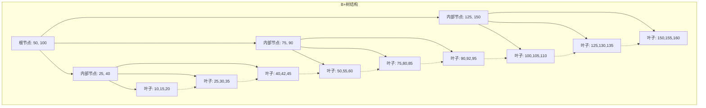

## 🎯 什么是数据库索引？

### 概念图解
```mermaid
graph TD
    A[数据表 Table] --> B[索引结构 Index]
    B --> C[B+树索引]
    B --> D[哈希索引]
    B --> E[位图索引]
    B --> F[全文索引]

    G[查询请求] --> H[索引查找 O(log n)]
    H --> I[数据定位]
    I --> J[快速返回结果]

    K[无索引查询] --> L[全表扫描 O(n)]
    L --> M[逐行检查]
    M --> N[性能瓶颈]

    style H fill:#bbf,stroke:#333,stroke-width:2px
    style J fill:#bbf,stroke:#333,stroke-width:2px
    style N fill:#fbb,stroke:#333,stroke-width:2px
```

### 生活中的例子
数据库索引就像书籍的目录或图书馆的索引卡片系统：

```
📚 图书馆查找书籍:
无索引: 逐个书架翻找，从A区找到Z区
有索引: 查看索引卡片，直接定位到具体书架位置

🏢 电话簿查找联系人:
无索引: 从第一页翻到最后一页寻找姓名
有索引: 按首字母分类，快速定位到相关页面

🔍 搜索引擎工作原理:
Google: 建立网页倒排索引，根据关键词快速定位相关页面
百度: 预先处理网页内容，建立词汇到页面的映射关系
```

### 核心思想
数据库索引的核心在于：**以空间换时间，通过额外的数据结构来加速数据查找，将O(n)的线性搜索优化为O(log n)的对数搜索**。

## 🌳 索引类型深度解析

### 1. B+树索引 - 关系数据库的主力军

#### 原理介绍
B+树是一种多路平衡查找树，特点是所有叶子节点在同一层，并且包含完整的数据记录。



#### Java实现
```java
/**
 * B+树索引实现
 */
public class BPlusTreeIndex<K extends Comparable<K>, V> {
    private static final int DEFAULT_ORDER = 4; // B+树的阶数

    private Node<K, V> root;
    private int order;

    public BPlusTreeIndex() {
        this(DEFAULT_ORDER);
    }

    public BPlusTreeIndex(int order) {
        this.order = order;
        this.root = new LeafNode<>();
    }

    /**
     * 抽象节点类
     */
    abstract static class Node<K extends Comparable<K>, V> {
        List<K> keys;
        boolean isLeaf;

        Node(boolean isLeaf) {
            this.keys = new ArrayList<>();
            this.isLeaf = isLeaf;
        }

        abstract boolean isFull(int order);
        abstract Node<K, V> split(int order);
        abstract K getFirstKey();
    }

    /**
     * 内部节点实现
     */
    static class InternalNode<K extends Comparable<K>, V> extends Node<K, V> {
        List<Node<K, V>> children;

        InternalNode() {
            super(false);
            this.children = new ArrayList<>();
        }

        @Override
        boolean isFull(int order) {
            return keys.size() >= order - 1;
        }

        @Override
        Node<K, V> split(int order) {
            int mid = keys.size() / 2;

            InternalNode<K, V> newNode = new InternalNode<>();
            newNode.keys.addAll(keys.subList(mid + 1, keys.size()));
            newNode.children.addAll(children.subList(mid + 1, children.size()));

            keys.subList(mid, keys.size()).clear();
            children.subList(mid + 1, children.size()).clear();

            return newNode;
        }

        @Override
        K getFirstKey() {
            return keys.isEmpty() ? null : keys.get(0);
        }

        /**
         * 插入子节点
         */
        void insertChild(K key, Node<K, V> child) {
            int pos = Collections.binarySearch(keys, key);
            if (pos < 0) {
                pos = -pos - 1;
            }

            keys.add(pos, key);
            children.add(pos + 1, child);
        }
    }

    /**
     * 叶子节点实现
     */
    static class LeafNode<K extends Comparable<K>, V> extends Node<K, V> {
        List<V> values;
        LeafNode<K, V> next; // 叶子节点链表，支持范围查询

        LeafNode() {
            super(true);
            this.values = new ArrayList<>();
        }

        @Override
        boolean isFull(int order) {
            return keys.size() >= order;
        }

        @Override
        Node<K, V> split(int order) {
            int mid = keys.size() / 2;

            LeafNode<K, V> newNode = new LeafNode<>();
            newNode.keys.addAll(keys.subList(mid, keys.size()));
            newNode.values.addAll(values.subList(mid, values.size()));

            // 更新链表指针
            newNode.next = this.next;
            this.next = newNode;

            keys.subList(mid, keys.size()).clear();
            values.subList(mid, values.size()).clear();

            return newNode;
        }

        @Override
        K getFirstKey() {
            return keys.isEmpty() ? null : keys.get(0);
        }

        /**
         * 插入键值对
         */
        void insert(K key, V value) {
            int pos = Collections.binarySearch(keys, key);
            if (pos >= 0) {
                // 键已存在，更新值
                values.set(pos, value);
            } else {
                // 插入新键值对
                pos = -pos - 1;
                keys.add(pos, key);
                values.add(pos, value);
            }
        }

        /**
         * 查找值
         */
        V find(K key) {
            int pos = Collections.binarySearch(keys, key);
            return pos >= 0 ? values.get(pos) : null;
        }
    }

    /**
     * 插入操作
     */
    public void insert(K key, V value) {
        InsertResult<K, V> result = insertInternal(root, key, value);

        if (result.newChild != null) {
            // 根节点分裂，创建新根
            InternalNode<K, V> newRoot = new InternalNode<>();
            newRoot.keys.add(result.promotedKey);
            newRoot.children.add(root);
            newRoot.children.add(result.newChild);
            root = newRoot;
        }
    }

    private InsertResult<K, V> insertInternal(Node<K, V> node, K key, V value) {
        if (node.isLeaf) {
            LeafNode<K, V> leaf = (LeafNode<K, V>) node;
            leaf.insert(key, value);

            if (leaf.isFull(order)) {
                Node<K, V> newLeaf = leaf.split(order);
                return new InsertResult<>(newLeaf.getFirstKey(), newLeaf);
            }

            return new InsertResult<>(null, null);
        } else {
            InternalNode<K, V> internal = (InternalNode<K, V>) node;
            int childIndex = findChildIndex(internal, key);

            InsertResult<K, V> result = insertInternal(
                internal.children.get(childIndex), key, value);

            if (result.newChild != null) {
                internal.insertChild(result.promotedKey, result.newChild);

                if (internal.isFull(order)) {
                    Node<K, V> newInternal = internal.split(order);
                    K promotedKey = internal.keys.remove(internal.keys.size() - 1);
                    return new InsertResult<>(promotedKey, newInternal);
                }
            }

            return new InsertResult<>(null, null);
        }
    }

    private int findChildIndex(InternalNode<K, V> node, K key) {
        int pos = Collections.binarySearch(node.keys, key);
        return pos >= 0 ? pos + 1 : -pos - 1;
    }

    /**
     * 查找操作
     */
    public V search(K key) {
        return searchInternal(root, key);
    }

    private V searchInternal(Node<K, V> node, K key) {
        if (node.isLeaf) {
            LeafNode<K, V> leaf = (LeafNode<K, V>) node;
            return leaf.find(key);
        } else {
            InternalNode<K, V> internal = (InternalNode<K, V>) node;
            int childIndex = findChildIndex(internal, key);
            return searchInternal(internal.children.get(childIndex), key);
        }
    }

    /**
     * 范围查询 - B+树的优势
     */
    public List<V> rangeQuery(K startKey, K endKey) {
        List<V> results = new ArrayList<>();
        LeafNode<K, V> current = findLeafNode(startKey);

        while (current != null) {
            for (int i = 0; i < current.keys.size(); i++) {
                K key = current.keys.get(i);
                if (key.compareTo(startKey) >= 0 && key.compareTo(endKey) <= 0) {
                    results.add(current.values.get(i));
                } else if (key.compareTo(endKey) > 0) {
                    return results;
                }
            }
            current = current.next;
        }

        return results;
    }

    private LeafNode<K, V> findLeafNode(K key) {
        Node<K, V> current = root;

        while (!current.isLeaf) {
            InternalNode<K, V> internal = (InternalNode<K, V>) current;
            int childIndex = findChildIndex(internal, key);
            current = internal.children.get(childIndex);
        }

        return (LeafNode<K, V>) current;
    }

    /**
     * 插入结果辅助类
     */
    static class InsertResult<K, V> {
        final K promotedKey;
        final Node<K, V> newChild;

        InsertResult(K promotedKey, Node<K, V> newChild) {
            this.promotedKey = promotedKey;
            this.newChild = newChild;
        }
    }
}
```

#### B+树的优势分析
```java
/**
 * B+树性能分析工具
 */
public class BPlusTreePerformanceAnalyzer {

    /**
     * 计算B+树的高度
     */
    public static int calculateHeight(int totalRecords, int order) {
        // 叶子节点平均存储 order/2 个记录
        int leafCapacity = order / 2;
        int leafNodes = (int) Math.ceil((double) totalRecords / leafCapacity);

        // 内部节点平均有 order/2 个子节点
        int internalFanout = order / 2;

        int height = 1; // 叶子层
        int currentLevelNodes = leafNodes;

        while (currentLevelNodes > 1) {
            currentLevelNodes = (int) Math.ceil((double) currentLevelNodes / internalFanout);
            height++;
        }

        return height;
    }

    /**
     * 估算查询性能
     */
    public static QueryPerformance estimatePerformance(int totalRecords, int order) {
        int height = calculateHeight(totalRecords, order);
        int diskReads = height; // 每层一次磁盘读取

        // 假设每次磁盘读取耗时10ms
        long queryTimeMs = diskReads * 10;

        return new QueryPerformance(height, diskReads, queryTimeMs);
    }

    public static class QueryPerformance {
        public final int treeHeight;
        public final int diskReads;
        public final long estimatedTimeMs;

        public QueryPerformance(int height, int diskReads, long timeMs) {
            this.treeHeight = height;
            this.diskReads = diskReads;
            this.estimatedTimeMs = timeMs;
        }

        @Override
        public String toString() {
            return String.format("树高度: %d, 磁盘读取次数: %d, 预估查询时间: %dms",
                treeHeight, diskReads, estimatedTimeMs);
        }
    }
}
```

### 2. 哈希索引 - 等值查询的极速选择

#### 原理介绍
哈希索引通过哈希函数将键映射到固定位置，实现O(1)的平均查询时间复杂度。

```java
/**
 * 哈希索引实现（支持动态扩容）
 */
public class HashIndex<K, V> {
    private static final int DEFAULT_INITIAL_CAPACITY = 16;
    private static final double DEFAULT_LOAD_FACTOR = 0.75;

    private Entry<K, V>[] table;
    private int size;
    private int threshold;
    private double loadFactor;

    @SuppressWarnings("unchecked")
    public HashIndex() {
        this.loadFactor = DEFAULT_LOAD_FACTOR;
        this.table = new Entry[DEFAULT_INITIAL_CAPACITY];
        this.threshold = (int) (DEFAULT_INITIAL_CAPACITY * loadFactor);
    }

    /**
     * 哈希表条目
     */
    static class Entry<K, V> {
        final K key;
        V value;
        Entry<K, V> next; // 链式解决冲突

        Entry(K key, V value, Entry<K, V> next) {
            this.key = key;
            this.value = value;
            this.next = next;
        }
    }

    /**
     * 哈希函数
     */
    private int hash(K key) {
        if (key == null) return 0;
        int h = key.hashCode();
        // 扰动函数，减少冲突
        h ^= (h >>> 16);
        return h & (table.length - 1);
    }

    /**
     * 插入操作
     */
    public V put(K key, V value) {
        if (size >= threshold) {
            resize();
        }

        return putInternal(key, value, table);
    }

    private V putInternal(K key, V value, Entry<K, V>[] targetTable) {
        int index = hash(key);
        Entry<K, V> entry = targetTable[index];

        // 查找是否已存在
        while (entry != null) {
            if (Objects.equals(entry.key, key)) {
                V oldValue = entry.value;
                entry.value = value;
                return oldValue;
            }
            entry = entry.next;
        }

        // 插入新条目
        targetTable[index] = new Entry<>(key, value, targetTable[index]);
        size++;
        return null;
    }

    /**
     * 查询操作 - O(1)平均时间复杂度
     */
    public V get(K key) {
        int index = hash(key);
        Entry<K, V> entry = table[index];

        while (entry != null) {
            if (Objects.equals(entry.key, key)) {
                return entry.value;
            }
            entry = entry.next;
        }

        return null;
    }

    /**
     * 动态扩容
     */
    @SuppressWarnings("unchecked")
    private void resize() {
        Entry<K, V>[] oldTable = table;
        int newCapacity = oldTable.length * 2;

        table = new Entry[newCapacity];
        threshold = (int) (newCapacity * loadFactor);
        size = 0;

        // 重新哈希所有条目
        for (Entry<K, V> entry : oldTable) {
            while (entry != null) {
                Entry<K, V> next = entry.next;
                putInternal(entry.key, entry.value, table);
                entry = next;
            }
        }
    }

    /**
     * 删除操作
     */
    public V remove(K key) {
        int index = hash(key);
        Entry<K, V> entry = table[index];
        Entry<K, V> prev = null;

        while (entry != null) {
            if (Objects.equals(entry.key, key)) {
                if (prev == null) {
                    table[index] = entry.next;
                } else {
                    prev.next = entry.next;
                }
                size--;
                return entry.value;
            }
            prev = entry;
            entry = entry.next;
        }

        return null;
    }

    /**
     * 获取负载因子
     */
    public double getLoadFactor() {
        return (double) size / table.length;
    }

    /**
     * 获取冲突统计信息
     */
    public ConflictStatistics getConflictStatistics() {
        int emptyBuckets = 0;
        int maxChainLength = 0;
        int totalChainLength = 0;

        for (Entry<K, V> entry : table) {
            if (entry == null) {
                emptyBuckets++;
            } else {
                int chainLength = 0;
                Entry<K, V> current = entry;
                while (current != null) {
                    chainLength++;
                    current = current.next;
                }
                maxChainLength = Math.max(maxChainLength, chainLength);
                totalChainLength += chainLength;
            }
        }

        double avgChainLength = totalChainLength / (double) (table.length - emptyBuckets);
        return new ConflictStatistics(emptyBuckets, maxChainLength, avgChainLength);
    }

    public static class ConflictStatistics {
        public final int emptyBuckets;
        public final int maxChainLength;
        public final double avgChainLength;

        public ConflictStatistics(int emptyBuckets, int maxChainLength, double avgChainLength) {
            this.emptyBuckets = emptyBuckets;
            this.maxChainLength = maxChainLength;
            this.avgChainLength = avgChainLength;
        }

        @Override
        public String toString() {
            return String.format("空桶数: %d, 最大链长: %d, 平均链长: %.2f",
                emptyBuckets, maxChainLength, avgChainLength);
        }
    }
}
```

### 3. 位图索引 - 低基数数据的高效选择

#### 原理与实现
```java
/**
 * 位图索引实现
 * 适用于性别、状态等低基数字段
 */
public class BitmapIndex {
    private final Map<String, BitSet> bitmaps;
    private int totalRecords;

    public BitmapIndex() {
        this.bitmaps = new HashMap<>();
        this.totalRecords = 0;
    }

    /**
     * 添加记录
     */
    public void addRecord(int recordId, String value) {
        BitSet bitmap = bitmaps.computeIfAbsent(value, k -> new BitSet());
        bitmap.set(recordId);
        totalRecords = Math.max(totalRecords, recordId + 1);
    }

    /**
     * 等值查询
     */
    public BitSet query(String value) {
        return bitmaps.getOrDefault(value, new BitSet());
    }

    /**
     * AND查询 - 多条件交集
     */
    public BitSet andQuery(String... values) {
        BitSet result = new BitSet();
        result.set(0, totalRecords); // 初始化为全1

        for (String value : values) {
            BitSet bitmap = bitmaps.get(value);
            if (bitmap != null) {
                result.and(bitmap);
            } else {
                result.clear(); // 如果某个值不存在，结果为空
                break;
            }
        }

        return result;
    }

    /**
     * OR查询 - 多条件并集
     */
    public BitSet orQuery(String... values) {
        BitSet result = new BitSet();

        for (String value : values) {
            BitSet bitmap = bitmaps.get(value);
            if (bitmap != null) {
                result.or(bitmap);
            }
        }

        return result;
    }

    /**
     * NOT查询 - 条件取反
     */
    public BitSet notQuery(String value) {
        BitSet bitmap = bitmaps.get(value);
        if (bitmap == null) {
            BitSet result = new BitSet();
            result.set(0, totalRecords);
            return result;
        }

        BitSet result = (BitSet) bitmap.clone();
        result.flip(0, totalRecords);
        return result;
    }

    /**
     * 复杂查询示例：(gender='M' AND status='active') OR age_group='young'
     */
    public BitSet complexQuery() {
        BitSet maleActive = andQuery("gender:M", "status:active");
        BitSet young = query("age_group:young");

        BitSet result = (BitSet) maleActive.clone();
        result.or(young);

        return result;
    }

    /**
     * 统计信息
     */
    public IndexStatistics getStatistics() {
        int totalBitmaps = bitmaps.size();
        long totalBits = bitmaps.values().stream()
            .mapToLong(bitmap -> bitmap.cardinality())
            .sum();

        double compressionRatio = (double) totalBits / (totalBitmaps * totalRecords);

        return new IndexStatistics(totalBitmaps, totalBits, compressionRatio);
    }

    public static class IndexStatistics {
        public final int totalBitmaps;
        public final long totalSetBits;
        public final double compressionRatio;

        public IndexStatistics(int totalBitmaps, long totalSetBits, double compressionRatio) {
            this.totalBitmaps = totalBitmaps;
            this.totalSetBits = totalSetBits;
            this.compressionRatio = compressionRatio;
        }

        @Override
        public String toString() {
            return String.format("位图数量: %d, 设置位总数: %d, 压缩比: %.2f",
                totalBitmaps, totalSetBits, compressionRatio);
        }
    }
}
```

### 4. 全文索引 - 文本搜索的利器

#### 倒排索引实现
```java
/**
 * 倒排索引实现 - 全文搜索核心
 */
public class InvertedIndex {
    private final Map<String, PostingsList> index;
    private final Map<Integer, DocumentInfo> documents;
    private final TextAnalyzer analyzer;

    public InvertedIndex() {
        this.index = new HashMap<>();
        this.documents = new HashMap<>();
        this.analyzer = new TextAnalyzer();
    }

    /**
     * 文档信息
     */
    static class DocumentInfo {
        final int docId;
        final String title;
        final String content;
        final int totalWords;

        DocumentInfo(int docId, String title, String content, int totalWords) {
            this.docId = docId;
            this.title = title;
            this.content = content;
            this.totalWords = totalWords;
        }
    }

    /**
     * 倒排链表
     */
    static class PostingsList {
        private final List<Posting> postings;

        PostingsList() {
            this.postings = new ArrayList<>();
        }

        void addPosting(int docId, int frequency, List<Integer> positions) {
            postings.add(new Posting(docId, frequency, positions));
        }

        List<Posting> getPostings() {
            return postings;
        }

        int getDocumentFrequency() {
            return postings.size();
        }
    }

    /**
     * 倒排记录
     */
    static class Posting {
        final int docId;
        final int termFrequency;
        final List<Integer> positions; // 词在文档中的位置

        Posting(int docId, int frequency, List<Integer> positions) {
            this.docId = docId;
            this.termFrequency = frequency;
            this.positions = new ArrayList<>(positions);
        }
    }

    /**
     * 文本分析器
     */
    static class TextAnalyzer {
        private final Set<String> stopWords;

        TextAnalyzer() {
            this.stopWords = Set.of("的", "了", "在", "是", "和", "与", "或", "但是", "然而");
        }

        List<String> analyze(String text) {
            return Arrays.stream(text.toLowerCase().split("[\\s\\p{Punct}]+"))
                .filter(word -> !word.isEmpty() && !stopWords.contains(word))
                .collect(Collectors.toList());
        }
    }

    /**
     * 添加文档
     */
    public void addDocument(int docId, String title, String content) {
        List<String> words = analyzer.analyze(title + " " + content);
        documents.put(docId, new DocumentInfo(docId, title, content, words.size()));

        // 统计词频和位置
        Map<String, List<Integer>> wordPositions = new HashMap<>();
        for (int i = 0; i < words.size(); i++) {
            String word = words.get(i);
            wordPositions.computeIfAbsent(word, k -> new ArrayList<>()).add(i);
        }

        // 更新倒排索引
        for (Map.Entry<String, List<Integer>> entry : wordPositions.entrySet()) {
            String term = entry.getKey();
            List<Integer> positions = entry.getValue();

            PostingsList postingsList = index.computeIfAbsent(term, k -> new PostingsList());
            postingsList.addPosting(docId, positions.size(), positions);
        }
    }

    /**
     * 单词查询
     */
    public List<Posting> search(String term) {
        PostingsList postingsList = index.get(term.toLowerCase());
        return postingsList != null ? postingsList.getPostings() : Collections.emptyList();
    }

    /**
     * 短语查询 - 查找连续词组
     */
    public List<Integer> phraseSearch(String phrase) {
        List<String> words = analyzer.analyze(phrase);
        if (words.size() < 2) {
            return search(words.get(0)).stream()
                .map(posting -> posting.docId)
                .collect(Collectors.toList());
        }

        // 获取所有词的倒排列表
        List<List<Posting>> allPostings = words.stream()
            .map(this::search)
            .collect(Collectors.toList());

        // 找到包含所有词的文档
        Set<Integer> candidateDocs = new HashSet<>();
        if (!allPostings.isEmpty()) {
            candidateDocs.addAll(allPostings.get(0).stream()
                .map(posting -> posting.docId)
                .collect(Collectors.toSet()));

            for (int i = 1; i < allPostings.size(); i++) {
                Set<Integer> currentDocs = allPostings.get(i).stream()
                    .map(posting -> posting.docId)
                    .collect(Collectors.toSet());
                candidateDocs.retainAll(currentDocs);
            }
        }

        // 验证短语的连续性
        List<Integer> results = new ArrayList<>();
        for (Integer docId : candidateDocs) {
            if (containsPhrase(docId, words, allPostings)) {
                results.add(docId);
            }
        }

        return results;
    }

    private boolean containsPhrase(int docId, List<String> words, List<List<Posting>> allPostings) {
        // 获取每个词在指定文档中的位置
        List<List<Integer>> wordPositions = new ArrayList<>();
        for (List<Posting> postings : allPostings) {
            List<Integer> positions = postings.stream()
                .filter(posting -> posting.docId == docId)
                .flatMap(posting -> posting.positions.stream())
                .sorted()
                .collect(Collectors.toList());
            wordPositions.add(positions);
        }

        // 检查是否存在连续的词组
        List<Integer> firstWordPositions = wordPositions.get(0);
        for (Integer startPos : firstWordPositions) {
            boolean isPhrase = true;
            for (int i = 1; i < words.size(); i++) {
                int expectedPos = startPos + i;
                if (!wordPositions.get(i).contains(expectedPos)) {
                    isPhrase = false;
                    break;
                }
            }
            if (isPhrase) {
                return true;
            }
        }

        return false;
    }

    /**
     * TF-IDF评分计算
     */
    public List<ScoredDocument> searchWithScore(String query) {
        List<String> queryTerms = analyzer.analyze(query);
        Map<Integer, Double> docScores = new HashMap<>();

        for (String term : queryTerms) {
            List<Posting> postings = search(term);
            if (postings.isEmpty()) continue;

            double idf = Math.log((double) documents.size() / postings.size());

            for (Posting posting : postings) {
                DocumentInfo doc = documents.get(posting.docId);
                double tf = (double) posting.termFrequency / doc.totalWords;
                double score = tf * idf;

                docScores.merge(posting.docId, score, Double::sum);
            }
        }

        return docScores.entrySet().stream()
            .map(entry -> new ScoredDocument(entry.getKey(), entry.getValue()))
            .sorted((a, b) -> Double.compare(b.score, a.score))
            .collect(Collectors.toList());
    }

    static class ScoredDocument {
        final int docId;
        final double score;

        ScoredDocument(int docId, double score) {
            this.docId = docId;
            this.score = score;
        }

        @Override
        public String toString() {
            return String.format("Doc %d (score: %.3f)", docId, score);
        }
    }
}
```

## 🚀 索引优化策略

### 1. 复合索引设计原则

```java
/**
 * 复合索引优化器
 */
public class CompositeIndexOptimizer {

    /**
     * 索引字段信息
     */
    static class IndexField {
        final String name;
        final int cardinality; // 基数（不重复值的数量）
        final double selectivity; // 选择性（不重复值/总行数）
        final int queryFrequency; // 查询频率

        IndexField(String name, int cardinality, double selectivity, int queryFrequency) {
            this.name = name;
            this.cardinality = cardinality;
            this.selectivity = selectivity;
            this.queryFrequency = queryFrequency;
        }
    }

    /**
     * 复合索引字段排序优化
     * 原则：选择性高的字段放在前面
     */
    public List<IndexField> optimizeFieldOrder(List<IndexField> fields) {
        return fields.stream()
            .sorted((a, b) -> {
                // 1. 选择性高的优先
                int selectivityCmp = Double.compare(b.selectivity, a.selectivity);
                if (selectivityCmp != 0) return selectivityCmp;

                // 2. 查询频率高的优先
                int frequencyCmp = Integer.compare(b.queryFrequency, a.queryFrequency);
                if (frequencyCmp != 0) return frequencyCmp;

                // 3. 基数大的优先
                return Integer.compare(b.cardinality, a.cardinality);
            })
            .collect(Collectors.toList());
    }

    /**
     * 分析查询模式，推荐索引策略
     */
    public List<IndexRecommendation> analyzeQueryPatterns(List<QueryPattern> patterns) {
        Map<Set<String>, QueryStats> fieldCombinations = new HashMap<>();

        // 统计字段组合的查询频率
        for (QueryPattern pattern : patterns) {
            Set<String> fields = new HashSet<>(pattern.whereFields);
            QueryStats stats = fieldCombinations.computeIfAbsent(fields, k -> new QueryStats());
            stats.frequency += pattern.frequency;
            stats.avgExecutionTime += pattern.avgExecutionTimeMs;
        }

        // 生成索引推荐
        return fieldCombinations.entrySet().stream()
            .filter(entry -> entry.getValue().frequency > 10) // 频率阈值
            .map(entry -> new IndexRecommendation(
                new ArrayList<>(entry.getKey()),
                entry.getValue(),
                calculateIndexBenefit(entry.getValue())
            ))
            .sorted((a, b) -> Double.compare(b.benefit, a.benefit))
            .collect(Collectors.toList());
    }

    private double calculateIndexBenefit(QueryStats stats) {
        // 索引收益 = 查询频率 * 平均执行时间改善
        double timeImprovement = Math.log(stats.avgExecutionTime); // 假设对数级别改善
        return stats.frequency * timeImprovement;
    }

    static class QueryPattern {
        final List<String> whereFields;
        final List<String> orderByFields;
        final int frequency;
        final double avgExecutionTimeMs;

        QueryPattern(List<String> whereFields, List<String> orderByFields,
                    int frequency, double avgExecutionTimeMs) {
            this.whereFields = whereFields;
            this.orderByFields = orderByFields;
            this.frequency = frequency;
            this.avgExecutionTimeMs = avgExecutionTimeMs;
        }
    }

    static class QueryStats {
        int frequency = 0;
        double avgExecutionTime = 0;
    }

    static class IndexRecommendation {
        final List<String> fields;
        final QueryStats stats;
        final double benefit;

        IndexRecommendation(List<String> fields, QueryStats stats, double benefit) {
            this.fields = fields;
            this.stats = stats;
            this.benefit = benefit;
        }

        @Override
        public String toString() {
            return String.format("推荐索引: %s, 查询频率: %d, 预期收益: %.2f",
                String.join(", ", fields), stats.frequency, benefit);
        }
    }
}
```

### 2. 覆盖索引策略

```java
/**
 * 覆盖索引分析器
 * 覆盖索引包含查询所需的所有列，避免回表操作
 */
public class CoveringIndexAnalyzer {

    static class Query {
        final List<String> selectFields;
        final List<String> whereFields;
        final List<String> orderByFields;
        final int executionFrequency;

        Query(List<String> selectFields, List<String> whereFields,
              List<String> orderByFields, int frequency) {
            this.selectFields = selectFields;
            this.whereFields = whereFields;
            this.orderByFields = orderByFields;
            this.executionFrequency = frequency;
        }
    }

    static class CoveringIndex {
        final List<String> keyFields;      // 索引键字段
        final List<String> includeFields;  // 包含字段（叶子节点存储）
        final Set<Query> coveredQueries;
        final double spaceCost;

        CoveringIndex(List<String> keyFields, List<String> includeFields,
                     Set<Query> coveredQueries, double spaceCost) {
            this.keyFields = keyFields;
            this.includeFields = includeFields;
            this.coveredQueries = coveredQueries;
            this.spaceCost = spaceCost;
        }

        public double calculateBenefit() {
            return coveredQueries.stream()
                .mapToDouble(q -> q.executionFrequency * estimateTimeImprovement(q))
                .sum() / spaceCost;
        }

        private double estimateTimeImprovement(Query query) {
            // 避免回表操作的时间收益
            int avoidedLookups = query.selectFields.size();
            return avoidedLookups * 5.0; // 假设每次回表耗时5ms
        }
    }

    /**
     * 分析并推荐覆盖索引
     */
    public List<CoveringIndex> recommendCoveringIndexes(List<Query> queries,
                                                       Map<String, FieldMetadata> fieldMetadata) {
        Map<Set<String>, Set<Query>> keyFieldGroups = groupQueriesByWhereFields(queries);
        List<CoveringIndex> recommendations = new ArrayList<>();

        for (Map.Entry<Set<String>, Set<Query>> entry : keyFieldGroups.entrySet()) {
            Set<String> keyFields = entry.getKey();
            Set<Query> relatedQueries = entry.getValue();

            // 收集所有相关查询需要的字段
            Set<String> allRequiredFields = relatedQueries.stream()
                .flatMap(q -> q.selectFields.stream())
                .collect(Collectors.toSet());

            // 移除已包含在键字段中的字段
            Set<String> includeFields = new HashSet<>(allRequiredFields);
            includeFields.removeAll(keyFields);

            if (!includeFields.isEmpty()) {
                // 计算存储成本
                double spaceCost = calculateSpaceCost(keyFields, includeFields, fieldMetadata);

                CoveringIndex coveringIndex = new CoveringIndex(
                    new ArrayList<>(keyFields),
                    new ArrayList<>(includeFields),
                    relatedQueries,
                    spaceCost
                );

                recommendations.add(coveringIndex);
            }
        }

        return recommendations.stream()
            .filter(index -> index.calculateBenefit() > 1.0) // 收益阈值
            .sorted((a, b) -> Double.compare(b.calculateBenefit(), a.calculateBenefit()))
            .collect(Collectors.toList());
    }

    private Map<Set<String>, Set<Query>> groupQueriesByWhereFields(List<Query> queries) {
        Map<Set<String>, Set<Query>> groups = new HashMap<>();

        for (Query query : queries) {
            Set<String> whereFields = new HashSet<>(query.whereFields);
            groups.computeIfAbsent(whereFields, k -> new HashSet<>()).add(query);
        }

        return groups;
    }

    private double calculateSpaceCost(Set<String> keyFields, Set<String> includeFields,
                                    Map<String, FieldMetadata> fieldMetadata) {
        double keyFieldsCost = keyFields.stream()
            .mapToDouble(field -> fieldMetadata.get(field).avgSize)
            .sum();

        double includeFieldsCost = includeFields.stream()
            .mapToDouble(field -> fieldMetadata.get(field).avgSize)
            .sum();

        return keyFieldsCost + includeFieldsCost;
    }

    static class FieldMetadata {
        final String name;
        final String type;
        final double avgSize; // 平均字节大小
        final int cardinality;

        FieldMetadata(String name, String type, double avgSize, int cardinality) {
            this.name = name;
            this.type = type;
            this.avgSize = avgSize;
            this.cardinality = cardinality;
        }
    }
}
```

## 📊 索引性能分析与监控

### 1. 索引使用统计

```java
/**
 * 索引性能监控器
 */
public class IndexPerformanceMonitor {
    private final Map<String, IndexStatistics> indexStats;
    private final List<QueryExecution> queryExecutions;

    public IndexPerformanceMonitor() {
        this.indexStats = new ConcurrentHashMap<>();
        this.queryExecutions = new CopyOnWriteArrayList<>();
    }

    static class IndexStatistics {
        final String indexName;
        final AtomicLong accessCount = new AtomicLong(0);
        final AtomicLong updateCount = new AtomicLong(0);
        final AtomicDouble avgAccessTime = new AtomicDouble(0.0);
        final AtomicInteger size = new AtomicInteger(0);

        IndexStatistics(String indexName) {
            this.indexName = indexName;
        }

        void recordAccess(double timeMs) {
            long count = accessCount.incrementAndGet();
            avgAccessTime.updateAndGet(current -> (current * (count - 1) + timeMs) / count);
        }

        void recordUpdate() {
            updateCount.incrementAndGet();
        }

        void updateSize(int newSize) {
            size.set(newSize);
        }

        public double getEfficiency() {
            long accesses = accessCount.get();
            long updates = updateCount.get();
            return accesses == 0 ? 0 : (double) accesses / (accesses + updates);
        }
    }

    static class QueryExecution {
        final String sql;
        final List<String> usedIndexes;
        final double executionTimeMs;
        final long timestamp;
        final int rowsExamined;
        final int rowsReturned;

        QueryExecution(String sql, List<String> usedIndexes, double executionTimeMs,
                      int rowsExamined, int rowsReturned) {
            this.sql = sql;
            this.usedIndexes = usedIndexes;
            this.executionTimeMs = executionTimeMs;
            this.timestamp = System.currentTimeMillis();
            this.rowsExamined = rowsExamined;
            this.rowsReturned = rowsReturned;
        }

        public double getSelectivity() {
            return rowsExamined == 0 ? 1.0 : (double) rowsReturned / rowsExamined;
        }
    }

    /**
     * 记录查询执行
     */
    public void recordQueryExecution(String sql, List<String> usedIndexes,
                                   double executionTime, int rowsExamined, int rowsReturned) {
        QueryExecution execution = new QueryExecution(sql, usedIndexes,
            executionTime, rowsExamined, rowsReturned);
        queryExecutions.add(execution);

        // 更新索引访问统计
        for (String indexName : usedIndexes) {
            IndexStatistics stats = indexStats.computeIfAbsent(indexName, IndexStatistics::new);
            stats.recordAccess(executionTime);
        }
    }

    /**
     * 生成性能报告
     */
    public IndexPerformanceReport generateReport() {
        Map<String, IndexAnalysis> indexAnalyses = new HashMap<>();

        for (IndexStatistics stats : indexStats.values()) {
            List<QueryExecution> relatedQueries = queryExecutions.stream()
                .filter(q -> q.usedIndexes.contains(stats.indexName))
                .collect(Collectors.toList());

            IndexAnalysis analysis = new IndexAnalysis(
                stats.indexName,
                stats.accessCount.get(),
                stats.avgAccessTime.get(),
                stats.getEfficiency(),
                calculateIndexSelectivity(relatedQueries),
                findSlowQueries(relatedQueries)
            );

            indexAnalyses.put(stats.indexName, analysis);
        }

        return new IndexPerformanceReport(indexAnalyses, findUnusedIndexes(),
            findMissingIndexOpportunities());
    }

    private double calculateIndexSelectivity(List<QueryExecution> queries) {
        return queries.stream()
            .mapToDouble(QueryExecution::getSelectivity)
            .average()
            .orElse(0.0);
    }

    private List<QueryExecution> findSlowQueries(List<QueryExecution> queries) {
        return queries.stream()
            .filter(q -> q.executionTimeMs > 1000) // 超过1秒的查询
            .sorted((a, b) -> Double.compare(b.executionTimeMs, a.executionTimeMs))
            .limit(10)
            .collect(Collectors.toList());
    }

    private List<String> findUnusedIndexes() {
        return indexStats.values().stream()
            .filter(stats -> stats.accessCount.get() == 0)
            .map(stats -> stats.indexName)
            .collect(Collectors.toList());
    }

    private List<String> findMissingIndexOpportunities() {
        // 分析频繁的全表扫描查询
        return queryExecutions.stream()
            .filter(q -> q.usedIndexes.isEmpty() && q.executionTimeMs > 500)
            .map(q -> "建议为查询添加索引: " + q.sql.substring(0, Math.min(q.sql.length(), 100)))
            .distinct()
            .collect(Collectors.toList());
    }

    static class IndexAnalysis {
        final String indexName;
        final long accessCount;
        final double avgAccessTime;
        final double efficiency;
        final double selectivity;
        final List<QueryExecution> slowQueries;

        IndexAnalysis(String indexName, long accessCount, double avgAccessTime,
                     double efficiency, double selectivity, List<QueryExecution> slowQueries) {
            this.indexName = indexName;
            this.accessCount = accessCount;
            this.avgAccessTime = avgAccessTime;
            this.efficiency = efficiency;
            this.selectivity = selectivity;
            this.slowQueries = slowQueries;
        }

        public String getRecommendation() {
            if (efficiency < 0.1) {
                return "索引使用效率低，考虑删除";
            } else if (selectivity < 0.01) {
                return "索引选择性差，考虑优化字段组合";
            } else if (avgAccessTime > 100) {
                return "索引访问时间长，检查索引结构";
            } else {
                return "索引运行正常";
            }
        }
    }

    static class IndexPerformanceReport {
        final Map<String, IndexAnalysis> indexAnalyses;
        final List<String> unusedIndexes;
        final List<String> missingIndexOpportunities;

        IndexPerformanceReport(Map<String, IndexAnalysis> indexAnalyses,
                             List<String> unusedIndexes, List<String> missingIndexOpportunities) {
            this.indexAnalyses = indexAnalyses;
            this.unusedIndexes = unusedIndexes;
            this.missingIndexOpportunities = missingIndexOpportunities;
        }

        @Override
        public String toString() {
            StringBuilder sb = new StringBuilder();
            sb.append("=== 索引性能报告 ===\n\n");

            sb.append("索引分析:\n");
            indexAnalyses.forEach((name, analysis) -> {
                sb.append(String.format("- %s: 访问%d次, 平均%.2fms, 效率%.2f, 建议: %s\n",
                    name, analysis.accessCount, analysis.avgAccessTime,
                    analysis.efficiency, analysis.getRecommendation()));
            });

            sb.append("\n未使用的索引:\n");
            unusedIndexes.forEach(index -> sb.append("- ").append(index).append("\n"));

            sb.append("\n缺失索引机会:\n");
            missingIndexOpportunities.forEach(opportunity ->
                sb.append("- ").append(opportunity).append("\n"));

            return sb.toString();
        }
    }
}
```

## 🔬 高级索引技术

### 1. LSM-Tree索引（Log-Structured Merge Tree）

LSM-Tree特别适用于写多读少的场景，被广泛应用于NoSQL数据库如Cassandra、HBase等。

```java
/**
 * LSM-Tree索引实现
 * 优势：写入性能优异，适合大数据量场景
 */
public class LSMTreeIndex<K extends Comparable<K>, V> {
    private final int memTableSize;
    private final int maxLevels;

    private volatile MemTable<K, V> activeMemTable;
    private final Queue<SSTable<K, V>> level0SSTables;
    private final List<List<SSTable<K, V>>> levels;

    public LSMTreeIndex(int memTableSize, int maxLevels) {
        this.memTableSize = memTableSize;
        this.maxLevels = maxLevels;
        this.activeMemTable = new MemTable<>(memTableSize);
        this.level0SSTables = new ConcurrentLinkedQueue<>();
        this.levels = new ArrayList<>();

        for (int i = 0; i < maxLevels; i++) {
            levels.add(new ArrayList<>());
        }
    }

    /**
     * 内存表 - 使用跳表实现
     */
    static class MemTable<K extends Comparable<K>, V> {
        private final ConcurrentSkipListMap<K, V> data;
        private final AtomicInteger size;
        private final int capacity;

        MemTable(int capacity) {
            this.data = new ConcurrentSkipListMap<>();
            this.size = new AtomicInteger(0);
            this.capacity = capacity;
        }

        boolean put(K key, V value) {
            V oldValue = data.put(key, value);
            if (oldValue == null) {
                size.incrementAndGet();
            }
            return size.get() >= capacity;
        }

        V get(K key) {
            return data.get(key);
        }

        NavigableMap<K, V> getData() {
            return data;
        }

        boolean isFull() {
            return size.get() >= capacity;
        }

        int size() {
            return size.get();
        }
    }

    /**
     * SSTable (Sorted String Table) - 持久化存储
     */
    static class SSTable<K extends Comparable<K>, V> {
        private final List<Entry<K, V>> data;
        private final K minKey;
        private final K maxKey;
        private final long timestamp;

        SSTable(NavigableMap<K, V> memTableData) {
            this.data = new ArrayList<>();
            this.timestamp = System.currentTimeMillis();

            for (Map.Entry<K, V> entry : memTableData.entrySet()) {
                data.add(new Entry<>(entry.getKey(), entry.getValue()));
            }

            this.minKey = data.isEmpty() ? null : data.get(0).key;
            this.maxKey = data.isEmpty() ? null : data.get(data.size() - 1).key;
        }

        V get(K key) {
            // 二分查找
            int left = 0, right = data.size() - 1;

            while (left <= right) {
                int mid = left + (right - left) / 2;
                int cmp = data.get(mid).key.compareTo(key);

                if (cmp == 0) {
                    return data.get(mid).value;
                } else if (cmp < 0) {
                    left = mid + 1;
                } else {
                    right = mid - 1;
                }
            }

            return null;
        }

        List<Entry<K, V>> rangeQuery(K startKey, K endKey) {
            List<Entry<K, V>> result = new ArrayList<>();

            for (Entry<K, V> entry : data) {
                if (entry.key.compareTo(startKey) >= 0 && entry.key.compareTo(endKey) <= 0) {
                    result.add(entry);
                }
            }

            return result;
        }

        boolean overlaps(K startKey, K endKey) {
            return !(maxKey.compareTo(startKey) < 0 || minKey.compareTo(endKey) > 0);
        }

        static class Entry<K, V> {
            final K key;
            final V value;

            Entry(K key, V value) {
                this.key = key;
                this.value = value;
            }
        }
    }

    /**
     * 写入操作 - 始终写入内存表
     */
    public void put(K key, V value) {
        boolean needFlush = activeMemTable.put(key, value);

        if (needFlush) {
            flushMemTable();
        }
    }

    /**
     * 刷新内存表到磁盘
     */
    private synchronized void flushMemTable() {
        if (activeMemTable.size() == 0) return;

        // 创建新的SSTable
        SSTable<K, V> newSSTable = new SSTable<>(activeMemTable.getData());
        level0SSTables.offer(newSSTable);

        // 创建新的内存表
        activeMemTable = new MemTable<>(memTableSize);

        // 检查是否需要压缩
        scheduleCompaction();
    }

    /**
     * 读取操作 - 按层级查找
     */
    public V get(K key) {
        // 1. 查找内存表
        V value = activeMemTable.get(key);
        if (value != null) return value;

        // 2. 查找Level 0的SSTable（按时间戳倒序）
        List<SSTable<K, V>> level0List = new ArrayList<>(level0SSTables);
        level0List.sort((a, b) -> Long.compare(b.timestamp, a.timestamp));

        for (SSTable<K, V> ssTable : level0List) {
            value = ssTable.get(key);
            if (value != null) return value;
        }

        // 3. 查找其他层级
        for (List<SSTable<K, V>> level : levels) {
            for (SSTable<K, V> ssTable : level) {
                value = ssTable.get(key);
                if (value != null) return value;
            }
        }

        return null;
    }

    /**
     * 范围查询
     */
    public List<SSTable.Entry<K, V>> rangeQuery(K startKey, K endKey) {
        List<SSTable.Entry<K, V>> results = new ArrayList<>();
        Set<K> seenKeys = new HashSet<>();

        // 查找内存表
        NavigableMap<K, V> memData = activeMemTable.getData();
        for (Map.Entry<K, V> entry : memData.subMap(startKey, true, endKey, true).entrySet()) {
            results.add(new SSTable.Entry<>(entry.getKey(), entry.getValue()));
            seenKeys.add(entry.getKey());
        }

        // 查找SSTable
        for (SSTable<K, V> ssTable : level0SSTables) {
            if (ssTable.overlaps(startKey, endKey)) {
                List<SSTable.Entry<K, V>> tableResults = ssTable.rangeQuery(startKey, endKey);
                for (SSTable.Entry<K, V> entry : tableResults) {
                    if (!seenKeys.contains(entry.key)) {
                        results.add(entry);
                        seenKeys.add(entry.key);
                    }
                }
            }
        }

        // 排序结果
        results.sort((a, b) -> a.key.compareTo(b.key));
        return results;
    }

    /**
     * 压缩调度 - 简化版本
     */
    private void scheduleCompaction() {
        // Level 0压缩：当SSTable数量超过阈值时触发
        if (level0SSTables.size() > 4) {
            compactLevel0();
        }

        // 其他层级压缩
        for (int level = 0; level < levels.size() - 1; level++) {
            if (levels.get(level).size() > Math.pow(10, level + 1)) {
                compactLevel(level);
            }
        }
    }

    private void compactLevel0() {
        // 简化实现：将所有Level 0的SSTable合并到Level 1
        List<SSTable<K, V>> toCompact = new ArrayList<>(level0SSTables);
        level0SSTables.clear();

        if (!toCompact.isEmpty()) {
            SSTable<K, V> merged = mergeSSTablesSorted(toCompact);
            levels.get(0).add(merged);
        }
    }

    private void compactLevel(int level) {
        // 简化实现：选择部分SSTable进行合并
        List<SSTable<K, V>> levelTables = levels.get(level);
        if (levelTables.size() > 2) {
            List<SSTable<K, V>> toMerge = levelTables.subList(0, 2);
            SSTable<K, V> merged = mergeSSTablesSorted(new ArrayList<>(toMerge));

            toMerge.clear();
            levels.get(level + 1).add(merged);
        }
    }

    private SSTable<K, V> mergeSSTablesSorted(List<SSTable<K, V>> sstables) {
        Map<K, V> mergedData = new TreeMap<>();

        // 合并所有SSTable的数据，新数据覆盖旧数据
        for (SSTable<K, V> ssTable : sstables) {
            for (SSTable.Entry<K, V> entry : ssTable.data) {
                mergedData.put(entry.key, entry.value);
            }
        }

        return new SSTable<>(mergedData);
    }
}
```

### 2. 自适应索引选择

```java
/**
 * 自适应索引选择器
 * 根据查询模式动态选择最优索引策略
 */
public class AdaptiveIndexSelector {
    private final Map<String, IndexPerformanceMetrics> indexMetrics;
    private final QueryPatternAnalyzer patternAnalyzer;

    public AdaptiveIndexSelector() {
        this.indexMetrics = new ConcurrentHashMap<>();
        this.patternAnalyzer = new QueryPatternAnalyzer();
    }

    static class IndexPerformanceMetrics {
        final AtomicLong totalQueries = new AtomicLong(0);
        final AtomicDouble avgResponseTime = new AtomicDouble(0.0);
        final AtomicDouble avgSelectivity = new AtomicDouble(0.0);
        final Map<QueryType, Long> queryTypeCount = new ConcurrentHashMap<>();

        void recordQuery(QueryType type, double responseTime, double selectivity) {
            long count = totalQueries.incrementAndGet();

            // 更新平均响应时间
            avgResponseTime.updateAndGet(current ->
                (current * (count - 1) + responseTime) / count);

            // 更新平均选择性
            avgSelectivity.updateAndGet(current ->
                (current * (count - 1) + selectivity) / count);

            // 更新查询类型计数
            queryTypeCount.merge(type, 1L, Long::sum);
        }

        double getScoreForQueryType(QueryType type) {
            long typeCount = queryTypeCount.getOrDefault(type, 0L);
            double typeRatio = (double) typeCount / totalQueries.get();

            // 综合考虑响应时间、选择性和查询类型匹配度
            double timeScore = Math.max(0, 1 - avgResponseTime.get() / 1000); // 标准化到0-1
            double selectivityScore = avgSelectivity.get();
            double typeMatchScore = typeRatio;

            return (timeScore * 0.4 + selectivityScore * 0.3 + typeMatchScore * 0.3);
        }
    }

    enum QueryType {
        POINT_QUERY,     // 点查询
        RANGE_QUERY,     // 范围查询
        FULL_TEXT_QUERY, // 全文搜索
        AGGREGATION,     // 聚合查询
        JOIN_QUERY       // 连接查询
    }

    enum IndexType {
        BTREE("B+树索引", Set.of(QueryType.POINT_QUERY, QueryType.RANGE_QUERY)),
        HASH("哈希索引", Set.of(QueryType.POINT_QUERY)),
        BITMAP("位图索引", Set.of(QueryType.AGGREGATION, QueryType.JOIN_QUERY)),
        FULLTEXT("全文索引", Set.of(QueryType.FULL_TEXT_QUERY)),
        LSM("LSM-Tree索引", Set.of(QueryType.POINT_QUERY, QueryType.RANGE_QUERY));

        final String name;
        final Set<QueryType> supportedTypes;

        IndexType(String name, Set<QueryType> supportedTypes) {
            this.name = name;
            this.supportedTypes = supportedTypes;
        }
    }

    /**
     * 为字段推荐最优索引类型
     */
    public IndexType recommendIndexType(String fieldName, QueryType primaryQueryType,
                                      FieldCharacteristics characteristics) {
        Map<IndexType, Double> scores = new HashMap<>();

        for (IndexType indexType : IndexType.values()) {
            if (!indexType.supportedTypes.contains(primaryQueryType)) {
                continue; // 不支持的查询类型
            }

            double score = calculateIndexScore(indexType, primaryQueryType, characteristics);

            // 考虑历史性能
            IndexPerformanceMetrics metrics = indexMetrics.get(fieldName + "_" + indexType);
            if (metrics != null) {
                score *= metrics.getScoreForQueryType(primaryQueryType);
            }

            scores.put(indexType, score);
        }

        return scores.entrySet().stream()
            .max(Map.Entry.comparingByValue())
            .map(Map.Entry::getKey)
            .orElse(IndexType.BTREE); // 默认B+树
    }

    private double calculateIndexScore(IndexType indexType, QueryType queryType,
                                     FieldCharacteristics characteristics) {
        double score = 1.0;

        switch (indexType) {
            case BTREE:
                // B+树适合中高基数字段和范围查询
                if (characteristics.cardinality > 1000) score += 0.3;
                if (queryType == QueryType.RANGE_QUERY) score += 0.4;
                if (characteristics.updateFrequency < 0.1) score += 0.2; // 读多写少
                break;

            case HASH:
                // 哈希索引适合高基数字段和等值查询
                if (characteristics.cardinality > 10000) score += 0.5;
                if (queryType == QueryType.POINT_QUERY) score += 0.4;
                if (characteristics.updateFrequency < 0.05) score += 0.1; // 更新频率低
                break;

            case BITMAP:
                // 位图索引适合低基数字段
                if (characteristics.cardinality < 100) score += 0.6;
                if (queryType == QueryType.AGGREGATION) score += 0.3;
                break;

            case FULLTEXT:
                // 全文索引适合文本字段
                if (characteristics.dataType.equals("TEXT")) score += 0.8;
                break;

            case LSM:
                // LSM适合高写入负载
                if (characteristics.updateFrequency > 0.3) score += 0.5;
                if (characteristics.dataSize > 1000000) score += 0.3; // 大数据量
                break;
        }

        return score;
    }

    /**
     * 字段特征
     */
    static class FieldCharacteristics {
        final String fieldName;
        final String dataType;
        final int cardinality;        // 基数（不重复值数量）
        final double updateFrequency; // 更新频率 (0-1)
        final long dataSize;          // 数据总大小
        final double avgQueryTime;    // 平均查询时间

        FieldCharacteristics(String fieldName, String dataType, int cardinality,
                           double updateFrequency, long dataSize, double avgQueryTime) {
            this.fieldName = fieldName;
            this.dataType = dataType;
            this.cardinality = cardinality;
            this.updateFrequency = updateFrequency;
            this.dataSize = dataSize;
            this.avgQueryTime = avgQueryTime;
        }
    }

    /**
     * 查询模式分析器
     */
    static class QueryPatternAnalyzer {
        private final Map<String, QueryPattern> patterns = new ConcurrentHashMap<>();

        static class QueryPattern {
            final AtomicInteger frequency = new AtomicInteger(0);
            final Map<QueryType, Integer> typeDistribution = new ConcurrentHashMap<>();
            final AtomicDouble avgSelectivity = new AtomicDouble(0.0);

            void recordQuery(QueryType type, double selectivity) {
                int count = frequency.incrementAndGet();
                typeDistribution.merge(type, 1, Integer::sum);
                avgSelectivity.updateAndGet(current ->
                    (current * (count - 1) + selectivity) / count);
            }

            QueryType getPrimaryQueryType() {
                return typeDistribution.entrySet().stream()
                    .max(Map.Entry.comparingByValue())
                    .map(Map.Entry::getKey)
                    .orElse(QueryType.POINT_QUERY);
            }
        }

        void recordQuery(String fieldName, QueryType type, double selectivity) {
            QueryPattern pattern = patterns.computeIfAbsent(fieldName, k -> new QueryPattern());
            pattern.recordQuery(type, selectivity);
        }

        QueryPattern getPattern(String fieldName) {
            return patterns.get(fieldName);
        }
    }

    /**
     * 动态索引重建建议
     */
    public List<IndexRecommendation> analyzeAndRecommend(List<FieldCharacteristics> fields) {
        List<IndexRecommendation> recommendations = new ArrayList<>();

        for (FieldCharacteristics field : fields) {
            QueryPatternAnalyzer.QueryPattern pattern = patternAnalyzer.getPattern(field.fieldName);
            if (pattern == null) continue;

            QueryType primaryType = pattern.getPrimaryQueryType();
            IndexType recommendedType = recommendIndexType(field.fieldName, primaryType, field);

            // 计算预期改善
            double currentPerformance = field.avgQueryTime;
            double expectedImprovement = estimatePerformanceImprovement(
                recommendedType, primaryType, field);

            if (expectedImprovement > 0.2) { // 至少20%的改善
                recommendations.add(new IndexRecommendation(
                    field.fieldName,
                    recommendedType,
                    primaryType,
                    expectedImprovement,
                    pattern.frequency.get()
                ));
            }
        }

        return recommendations.stream()
            .sorted((a, b) -> Double.compare(b.expectedImprovement * b.queryFrequency,
                                           a.expectedImprovement * a.queryFrequency))
            .collect(Collectors.toList());
    }

    private double estimatePerformanceImprovement(IndexType indexType, QueryType queryType,
                                                FieldCharacteristics characteristics) {
        // 简化的性能改善估算
        double baseImprovement = 0.0;

        switch (indexType) {
            case HASH:
                if (queryType == QueryType.POINT_QUERY) baseImprovement = 0.5;
                break;
            case BTREE:
                if (queryType == QueryType.RANGE_QUERY) baseImprovement = 0.4;
                else if (queryType == QueryType.POINT_QUERY) baseImprovement = 0.3;
                break;
            case BITMAP:
                if (queryType == QueryType.AGGREGATION) baseImprovement = 0.6;
                break;
            case LSM:
                if (characteristics.updateFrequency > 0.3) baseImprovement = 0.4;
                break;
        }

        // 根据数据特征调整
        if (characteristics.cardinality > 100000) baseImprovement *= 1.2;
        if (characteristics.dataSize > 10000000) baseImprovement *= 1.1;

        return Math.min(baseImprovement, 0.8); // 最大改善80%
    }

    static class IndexRecommendation {
        final String fieldName;
        final IndexType recommendedType;
        final QueryType primaryQueryType;
        final double expectedImprovement;
        final int queryFrequency;

        IndexRecommendation(String fieldName, IndexType recommendedType,
                          QueryType primaryQueryType, double expectedImprovement, int queryFrequency) {
            this.fieldName = fieldName;
            this.recommendedType = recommendedType;
            this.primaryQueryType = primaryQueryType;
            this.expectedImprovement = expectedImprovement;
            this.queryFrequency = queryFrequency;
        }

        @Override
        public String toString() {
            return String.format("字段 %s: 推荐 %s (主要查询: %s, 预期改善: %.1f%%, 查询频率: %d)",
                fieldName, recommendedType.name, primaryQueryType,
                expectedImprovement * 100, queryFrequency);
        }
    }
}
```

## 🎯 实际应用案例

### MySQL索引优化实战

```java
/**
 * MySQL索引优化实战案例
 */
public class MySQLIndexOptimizer {

    /**
     * 电商订单表索引设计案例
     */
    public void demonstrateECommerceIndexing() {
        /*
        表结构：
        CREATE TABLE orders (
            id BIGINT PRIMARY KEY AUTO_INCREMENT,
            user_id BIGINT NOT NULL,
            product_id BIGINT NOT NULL,
            order_status VARCHAR(20) NOT NULL,
            order_amount DECIMAL(10,2) NOT NULL,
            created_at TIMESTAMP NOT NULL,
            updated_at TIMESTAMP NOT NULL,
            INDEX idx_user_status (user_id, order_status),
            INDEX idx_created_at (created_at),
            INDEX idx_product_amount (product_id, order_amount)
        );
        */

        System.out.println("=== 电商订单表索引设计分析 ===");

        // 常见查询模式分析
        analyzeQueryPattern("用户订单查询",
            "SELECT * FROM orders WHERE user_id = ? AND order_status = 'PAID'",
            "复合索引 idx_user_status (user_id, order_status) - 完美匹配");

        analyzeQueryPattern("时间范围订单统计",
            "SELECT COUNT(*) FROM orders WHERE created_at BETWEEN ? AND ?",
            "单字段索引 idx_created_at - 范围查询优化");

        analyzeQueryPattern("产品销售分析",
            "SELECT product_id, SUM(order_amount) FROM orders WHERE product_id IN (?,?,?) GROUP BY product_id",
            "复合索引 idx_product_amount - 覆盖索引，避免回表");

        // 索引选择性分析
        calculateIndexSelectivity();
    }

    private void analyzeQueryPattern(String queryName, String sql, String indexStrategy) {
        System.out.println(String.format("查询: %s", queryName));
        System.out.println(String.format("SQL: %s", sql));
        System.out.println(String.format("索引策略: %s", indexStrategy));
        System.out.println("---");
    }

    private void calculateIndexSelectivity() {
        System.out.println("索引选择性分析:");

        // 假设数据统计
        int totalRecords = 1000000;

        Map<String, Integer> fieldCardinality = Map.of(
            "user_id", 50000,        // 5万用户
            "product_id", 10000,     // 1万商品
            "order_status", 5,       // 5种状态
            "created_at", 365000     // 按天计算的时间戳
        );

        fieldCardinality.forEach((field, cardinality) -> {
            double selectivity = (double) cardinality / totalRecords;
            String recommendation = getSelectivityRecommendation(selectivity);

            System.out.println(String.format("%s: 基数=%d, 选择性=%.4f, %s",
                field, cardinality, selectivity, recommendation));
        });
    }

    private String getSelectivityRecommendation(double selectivity) {
        if (selectivity > 0.1) {
            return "高选择性，适合单独建索引";
        } else if (selectivity > 0.01) {
            return "中等选择性，可考虑复合索引";
        } else {
            return "低选择性，建议作为复合索引的后续字段";
        }
    }
}
```

### 搜索引擎索引架构

```java
/**
 * 搜索引擎索引架构示例
 * 基于倒排索引的文档检索系统
 */
public class SearchEngineIndexArchitecture {
    private final InvertedIndex invertedIndex;
    private final ForwardIndex forwardIndex;
    private final RankingAlgorithm rankingAlgorithm;

    public SearchEngineIndexArchitecture() {
        this.invertedIndex = new InvertedIndex();
        this.forwardIndex = new ForwardIndex();
        this.rankingAlgorithm = new RankingAlgorithm();
    }

    /**
     * 正排索引 - 文档ID到内容的映射
     */
    static class ForwardIndex {
        private final Map<Integer, DocumentContent> documents = new ConcurrentHashMap<>();

        static class DocumentContent {
            final String url;
            final String title;
            final String content;
            final List<String> terms;
            final Map<String, Integer> termFrequency;
            final double pageRank;

            DocumentContent(String url, String title, String content,
                          List<String> terms, double pageRank) {
                this.url = url;
                this.title = title;
                this.content = content;
                this.terms = terms;
                this.pageRank = pageRank;

                // 计算词频
                this.termFrequency = new HashMap<>();
                terms.forEach(term -> termFrequency.merge(term, 1, Integer::sum));
            }
        }

        void addDocument(int docId, String url, String title, String content, double pageRank) {
            // 简化的文本处理
            List<String> terms = Arrays.stream(content.toLowerCase().split("\\s+"))
                .filter(term -> term.length() > 2)
                .collect(Collectors.toList());

            DocumentContent doc = new DocumentContent(url, title, content, terms, pageRank);
            documents.put(docId, doc);
        }

        DocumentContent getDocument(int docId) {
            return documents.get(docId);
        }
    }

    /**
     * 排序算法 - 结合TF-IDF和PageRank
     */
    static class RankingAlgorithm {

        double calculateRelevanceScore(String query, ForwardIndex.DocumentContent doc,
                                     InvertedIndex.PostingsList postingsList) {
            List<String> queryTerms = Arrays.asList(query.toLowerCase().split("\\s+"));
            double score = 0.0;

            for (String term : queryTerms) {
                if (doc.termFrequency.containsKey(term)) {
                    // TF-IDF计算
                    double tf = (double) doc.termFrequency.get(term) / doc.terms.size();
                    double idf = Math.log(1000.0 / postingsList.getDocumentFrequency()); // 假设1000个文档
                    double tfidf = tf * idf;

                    // 标题匹配加权
                    if (doc.title.toLowerCase().contains(term)) {
                        tfidf *= 2.0;
                    }

                    score += tfidf;
                }
            }

            // 结合PageRank
            return score * (0.7 + 0.3 * doc.pageRank);
        }
    }

    /**
     * 搜索查询处理
     */
    public List<SearchResult> search(String query, int limit) {
        List<String> queryTerms = Arrays.asList(query.toLowerCase().split("\\s+"));
        Map<Integer, Double> docScores = new HashMap<>();

        // 获取所有相关文档
        Set<Integer> candidateDocs = new HashSet<>();
        for (String term : queryTerms) {
            List<InvertedIndex.Posting> postings = invertedIndex.search(term);
            candidateDocs.addAll(postings.stream()
                .map(posting -> posting.docId)
                .collect(Collectors.toSet()));
        }

        // 计算相关性分数
        for (Integer docId : candidateDocs) {
            ForwardIndex.DocumentContent doc = forwardIndex.getDocument(docId);
            if (doc != null) {
                InvertedIndex.PostingsList postingsList = new InvertedIndex.PostingsList();
                double score = rankingAlgorithm.calculateRelevanceScore(query, doc, postingsList);
                docScores.put(docId, score);
            }
        }

        // 排序并返回结果
        return docScores.entrySet().stream()
            .sorted((a, b) -> Double.compare(b.getValue(), a.getValue()))
            .limit(limit)
            .map(entry -> {
                ForwardIndex.DocumentContent doc = forwardIndex.getDocument(entry.getKey());
                return new SearchResult(entry.getKey(), doc.url, doc.title,
                    doc.content.substring(0, Math.min(doc.content.length(), 200)),
                    entry.getValue());
            })
            .collect(Collectors.toList());
    }

    static class SearchResult {
        final int docId;
        final String url;
        final String title;
        final String snippet;
        final double relevanceScore;

        SearchResult(int docId, String url, String title, String snippet, double relevanceScore) {
            this.docId = docId;
            this.url = url;
            this.title = title;
            this.snippet = snippet;
            this.relevanceScore = relevanceScore;
        }

        @Override
        public String toString() {
            return String.format("[%.3f] %s\n%s\n%s...",
                relevanceScore, title, url, snippet);
        }
    }
}
```

## 📈 性能测试与基准测试

```java
/**
 * 索引性能基准测试
 */
public class IndexBenchmark {

    public static void main(String[] args) {
        IndexBenchmark benchmark = new IndexBenchmark();
        benchmark.runComprehensiveBenchmark();
    }

    public void runComprehensiveBenchmark() {
        System.out.println("=== 索引性能基准测试 ===\n");

        // 测试不同数据规模下的性能
        int[] dataSizes = {1000, 10000, 100000, 1000000};

        for (int size : dataSizes) {
            System.out.println(String.format("数据规模: %d 条记录", size));
            System.out.println("---");

            benchmarkBTreeIndex(size);
            benchmarkHashIndex(size);
            benchmarkLSMTreeIndex(size);

            System.out.println();
        }
    }

    private void benchmarkBTreeIndex(int dataSize) {
        BPlusTreeIndex<Integer, String> btreeIndex = new BPlusTreeIndex<>();

        // 插入性能测试
        long startTime = System.nanoTime();
        for (int i = 0; i < dataSize; i++) {
            btreeIndex.insert(i, "value_" + i);
        }
        long insertTime = System.nanoTime() - startTime;

        // 查询性能测试
        startTime = System.nanoTime();
        for (int i = 0; i < 1000; i++) {
            int randomKey = (int) (Math.random() * dataSize);
            btreeIndex.search(randomKey);
        }
        long queryTime = System.nanoTime() - startTime;

        // 范围查询测试
        startTime = System.nanoTime();
        for (int i = 0; i < 100; i++) {
            int start = (int) (Math.random() * (dataSize - 1000));
            btreeIndex.rangeQuery(start, start + 1000);
        }
        long rangeQueryTime = System.nanoTime() - startTime;

        System.out.println(String.format("B+树索引 - 插入: %.2fms, 点查询: %.3fms/次, 范围查询: %.2fms/次",
            insertTime / 1_000_000.0,
            queryTime / 1_000_000.0 / 1000,
            rangeQueryTime / 1_000_000.0 / 100));
    }

    private void benchmarkHashIndex(int dataSize) {
        HashIndex<Integer, String> hashIndex = new HashIndex<>();

        // 插入性能测试
        long startTime = System.nanoTime();
        for (int i = 0; i < dataSize; i++) {
            hashIndex.put(i, "value_" + i);
        }
        long insertTime = System.nanoTime() - startTime;

        // 查询性能测试
        startTime = System.nanoTime();
        for (int i = 0; i < 1000; i++) {
            int randomKey = (int) (Math.random() * dataSize);
            hashIndex.get(randomKey);
        }
        long queryTime = System.nanoTime() - startTime;

        System.out.println(String.format("哈希索引 - 插入: %.2fms, 点查询: %.3fms/次",
            insertTime / 1_000_000.0,
            queryTime / 1_000_000.0 / 1000));
    }

    private void benchmarkLSMTreeIndex(int dataSize) {
        LSMTreeIndex<Integer, String> lsmIndex = new LSMTreeIndex<>(1000, 5);

        // 插入性能测试（LSM的强项）
        long startTime = System.nanoTime();
        for (int i = 0; i < dataSize; i++) {
            lsmIndex.put(i, "value_" + i);
        }
        long insertTime = System.nanoTime() - startTime;

        // 查询性能测试
        startTime = System.nanoTime();
        for (int i = 0; i < 1000; i++) {
            int randomKey = (int) (Math.random() * dataSize);
            lsmIndex.get(randomKey);
        }
        long queryTime = System.nanoTime() - startTime;

        System.out.println(String.format("LSM-Tree索引 - 插入: %.2fms, 点查询: %.3fms/次",
            insertTime / 1_000_000.0,
            queryTime / 1_000_000.0 / 1000));
    }
}
```

## 🎉 总结

数据库索引是现代数据库系统的核心技术，通过本文的深入分析，我们可以得出以下关键要点：

### 核心概念回顾
- **索引本质**：以空间换时间的数据结构优化
- **时间复杂度**：从O(n)线性搜索优化到O(log n)对数搜索
- **空间代价**：额外存储开销与维护成本

### 索引类型选择指南
```
🌳 B+树索引：通用性最强，适合大多数OLTP场景
📊 哈希索引：等值查询之王，适合高并发点查询
🎯 位图索引：低基数字段专家，适合OLAP分析
📚 全文索引：文本搜索必备，适合内容检索系统
🚀 LSM-Tree：写密集场景优选，适合大数据平台
```

### 优化策略要点
- **复合索引设计**：高选择性字段优先原则
- **覆盖索引策略**：减少回表操作，提升查询效率
- **索引维护**：定期分析使用情况，清理无效索引
- **自适应调整**：根据查询模式动态优化索引策略

### 实际应用建议
- **MySQL场景**：优先考虑B+树复合索引，合理设计字段顺序
- **NoSQL场景**：LSM-Tree适合写多读少，哈希索引适合KV存储
- **搜索引擎**：倒排索引+正排索引组合，TF-IDF+PageRank排序
- **大数据分析**：位图索引支持复杂条件筛选，列式存储优化

数据库索引技术仍在不断发展，从传统的B+树到现代的LSM-Tree，从单机索引到分布式索引，理解其核心原理和适用场景是每个开发者必备的技能。通过合理的索引设计和优化，我们可以让数据库查询性能提升数个数量级，为应用程序提供强大的数据支撑能力。