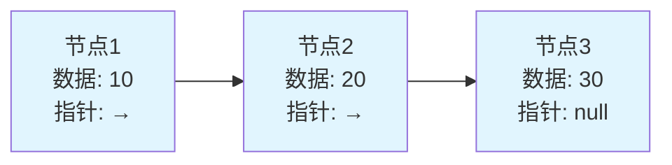
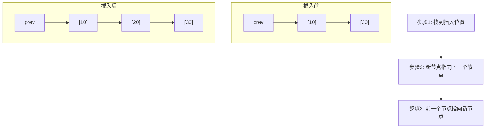

## 🔗 引言：什么是链表？

想象一下，你正在参加一个寻宝游戏。每个宝藏点都有一张纸条，上面写着下一个宝藏点的位置。你必须按照这些线索，一个接一个地找到所有的宝藏。这就是链表的基本思想！

**链表（Linked List）**是一种线性数据结构，其中的元素（节点）在内存中不是连续存储的。每个节点包含两部分：**数据域**和**指针域**，指针域存储着下一个节点的地址。



## 🏗️ 链表的基本结构

### 节点设计

每个链表节点就像火车的一节车厢，既承载货物（数据），又通过连接器连接下一节车厢（指针）。

```java
/**
 * 链表节点类
 * 就像火车车厢，包含货物(data)和连接器(next)
 */
public class ListNode {
    int val;           // 数据域：存储节点的值
    ListNode next;     // 指针域：指向下一个节点

    // 构造函数
    public ListNode() {}

    public ListNode(int val) {
        this.val = val;
    }

    public ListNode(int val, ListNode next) {
        this.val = val;
        this.next = next;
    }

    @Override
    public String toString() {
        return "Node(" + val + ")";
    }
}
```

### 链表类设计

```java
/**
 * 单向链表实现
 * 就像一条单行道，只能从头到尾单向通行
 */
public class LinkedList {
    private ListNode head;  // 头节点，链表的入口
    private int size;       // 链表大小

    public LinkedList() {
        this.head = null;
        this.size = 0;
    }

    /**
     * 获取链表大小
     */
    public int size() {
        return size;
    }

    /**
     * 判断链表是否为空
     */
    public boolean isEmpty() {
        return head == null;
    }
}
```

## 🎯 链表的基本操作

### 1. 在头部插入节点

就像在火车前面加挂一节新车厢，新车厢成为火车头。

```java
/**
 * 在链表头部插入新节点
 * 时间复杂度：O(1)
 *
 * 操作步骤：
 * 1. 创建新节点
 * 2. 新节点指向原头节点
 * 3. 更新头指针到新节点
 */
public void addFirst(int val) {
    ListNode newNode = new ListNode(val);
    newNode.next = head;  // 新节点指向原头节点
    head = newNode;       // 头指针指向新节点
    size++;

    System.out.println("在头部插入: " + val);
}
```

**图解过程：**
```
插入前：  Head -> [10] -> [20] -> [30] -> null
插入5：   Head -> [5] -> [10] -> [20] -> [30] -> null
```

### 2. 在尾部插入节点

就像在火车末尾加挂一节车厢，需要走到火车尾部进行连接。

```java
/**
 * 在链表尾部插入新节点
 * 时间复杂度：O(n) - 需要遍历到尾部
 */
public void addLast(int val) {
    ListNode newNode = new ListNode(val);

    // 如果链表为空，新节点就是头节点
    if (head == null) {
        head = newNode;
        size++;
        return;
    }

    // 找到最后一个节点
    ListNode current = head;
    while (current.next != null) {
        current = current.next;
    }

    // 连接新节点
    current.next = newNode;
    size++;

    System.out.println("在尾部插入: " + val);
}
```

### 3. 在指定位置插入节点

就像在火车的某两节车厢之间插入新车厢，需要先断开连接，再重新连接。

```java
/**
 * 在指定位置插入节点
 * 时间复杂度：O(n)
 *
 * @param index 插入位置（从0开始）
 * @param val   插入的值
 */
public void add(int index, int val) {
    // 边界检查
    if (index < 0 || index > size) {
        throw new IndexOutOfBoundsException("Index: " + index + ", Size: " + size);
    }

    // 在头部插入
    if (index == 0) {
        addFirst(val);
        return;
    }

    // 在中间或尾部插入
    ListNode newNode = new ListNode(val);
    ListNode prev = head;

    // 找到插入位置的前一个节点
    for (int i = 0; i < index - 1; i++) {
        prev = prev.next;
    }

    // 插入新节点
    newNode.next = prev.next;
    prev.next = newNode;
    size++;

    System.out.println("在位置 " + index + " 插入: " + val);
}
```

**图解插入过程：**


### 4. 删除节点

删除节点就像从火车中移除一节车厢，需要重新连接断开的部分。

```java
/**
 * 删除指定位置的节点
 * 时间复杂度：O(n)
 */
public int remove(int index) {
    // 边界检查
    if (index < 0 || index >= size) {
        throw new IndexOutOfBoundsException("Index: " + index + ", Size: " + size);
    }

    // 删除头节点
    if (index == 0) {
        int val = head.val;
        head = head.next;
        size--;
        System.out.println("删除头节点: " + val);
        return val;
    }

    // 找到要删除节点的前一个节点
    ListNode prev = head;
    for (int i = 0; i < index - 1; i++) {
        prev = prev.next;
    }

    // 执行删除操作
    ListNode nodeToDelete = prev.next;
    int val = nodeToDelete.val;
    prev.next = nodeToDelete.next;
    size--;

    System.out.println("删除位置 " + index + " 的节点: " + val);
    return val;
}

/**
 * 删除指定值的节点（删除第一个匹配的）
 * 时间复杂度：O(n)
 */
public boolean removeByValue(int val) {
    // 删除头节点
    if (head != null && head.val == val) {
        head = head.next;
        size--;
        System.out.println("删除值为 " + val + " 的节点");
        return true;
    }

    // 在链表中查找并删除
    ListNode current = head;
    while (current != null && current.next != null) {
        if (current.next.val == val) {
            current.next = current.next.next;
            size--;
            System.out.println("删除值为 " + val + " 的节点");
            return true;
        }
        current = current.next;
    }

    System.out.println("未找到值为 " + val + " 的节点");
    return false;
}
```

### 5. 查找操作

```java
/**
 * 获取指定位置的节点值
 * 时间复杂度：O(n)
 */
public int get(int index) {
    if (index < 0 || index >= size) {
        throw new IndexOutOfBoundsException("Index: " + index + ", Size: " + size);
    }

    ListNode current = head;
    for (int i = 0; i < index; i++) {
        current = current.next;
    }

    return current.val;
}

/**
 * 查找指定值的索引
 * 时间复杂度：O(n)
 */
public int indexOf(int val) {
    ListNode current = head;
    int index = 0;

    while (current != null) {
        if (current.val == val) {
            return index;
        }
        current = current.next;
        index++;
    }

    return -1; // 未找到
}

/**
 * 判断链表是否包含指定值
 */
public boolean contains(int val) {
    return indexOf(val) != -1;
}
```

### 6. 遍历和显示

```java
/**
 * 打印链表
 * 时间复杂度：O(n)
 */
public void display() {
    if (head == null) {
        System.out.println("链表为空");
        return;
    }

    StringBuilder sb = new StringBuilder();
    ListNode current = head;

    while (current != null) {
        sb.append(current.val);
        if (current.next != null) {
            sb.append(" -> ");
        }
        current = current.next;
    }
    sb.append(" -> null");

    System.out.println("链表内容: " + sb.toString());
}

/**
 * 转换为数组
 */
public int[] toArray() {
    int[] array = new int[size];
    ListNode current = head;
    int index = 0;

    while (current != null) {
        array[index++] = current.val;
        current = current.next;
    }

    return array;
}
```

## 🔄 特殊类型的链表

### 1. 双向链表

双向链表就像双向车道，每个节点既知道前面的节点，也知道后面的节点。

```java
/**
 * 双向链表节点
 */
class DoublyListNode {
    int val;
    DoublyListNode prev;  // 指向前一个节点
    DoublyListNode next;  // 指向后一个节点

    public DoublyListNode(int val) {
        this.val = val;
    }
}

/**
 * 双向链表实现
 */
public class DoublyLinkedList {
    private DoublyListNode head;
    private DoublyListNode tail;
    private int size;

    /**
     * 在头部插入节点
     * 时间复杂度：O(1)
     */
    public void addFirst(int val) {
        DoublyListNode newNode = new DoublyListNode(val);

        if (head == null) {
            head = tail = newNode;
        } else {
            newNode.next = head;
            head.prev = newNode;
            head = newNode;
        }
        size++;
    }

    /**
     * 在尾部插入节点
     * 时间复杂度：O(1) - 有tail指针
     */
    public void addLast(int val) {
        DoublyListNode newNode = new DoublyListNode(val);

        if (tail == null) {
            head = tail = newNode;
        } else {
            tail.next = newNode;
            newNode.prev = tail;
            tail = newNode;
        }
        size++;
    }

    /**
     * 从头到尾遍历
     */
    public void displayForward() {
        DoublyListNode current = head;
        StringBuilder sb = new StringBuilder("正向: ");

        while (current != null) {
            sb.append(current.val);
            if (current.next != null) sb.append(" <-> ");
            current = current.next;
        }

        System.out.println(sb.toString());
    }

    /**
     * 从尾到头遍历
     */
    public void displayBackward() {
        DoublyListNode current = tail;
        StringBuilder sb = new StringBuilder("反向: ");

        while (current != null) {
            sb.append(current.val);
            if (current.prev != null) sb.append(" <-> ");
            current = current.prev;
        }

        System.out.println(sb.toString());
    }
}
```

### 2. 循环链表

循环链表就像一个环形跑道，最后一个节点连接回第一个节点。

```java
/**
 * 循环链表实现
 */
public class CircularLinkedList {
    private ListNode head;
    private int size;

    /**
     * 插入节点到循环链表
     */
    public void add(int val) {
        ListNode newNode = new ListNode(val);

        if (head == null) {
            head = newNode;
            newNode.next = head; // 指向自己形成环
        } else {
            // 找到最后一个节点
            ListNode current = head;
            while (current.next != head) {
                current = current.next;
            }

            // 插入新节点
            current.next = newNode;
            newNode.next = head;
        }
        size++;
    }

    /**
     * 遍历循环链表
     */
    public void display() {
        if (head == null) {
            System.out.println("循环链表为空");
            return;
        }

        ListNode current = head;
        StringBuilder sb = new StringBuilder("循环链表: ");

        do {
            sb.append(current.val);
            current = current.next;
            if (current != head) sb.append(" -> ");
        } while (current != head);

        sb.append(" -> [回到头部]");
        System.out.println(sb.toString());
    }
}
```

## 🎮 实战案例：约瑟夫问题

约瑟夫问题是一个著名的数学问题，非常适合用循环链表解决。

**问题描述：** N个人站成一圈，从第1个人开始报数，每报到第K个人就让其出圈，然后从下一个人开始重新报数，直到所有人都出圈。求最后出圈的人的编号。

```java
/**
 * 约瑟夫问题求解器
 */
public class JosephusRing {

    /**
     * 解决约瑟夫问题
     * @param n 总人数
     * @param k 报数间隔
     * @return 最后剩余的人的编号
     */
    public static int josephus(int n, int k) {
        // 创建循环链表
        ListNode head = new ListNode(1);
        ListNode current = head;

        // 构建环形链表，编号1到n
        for (int i = 2; i <= n; i++) {
            current.next = new ListNode(i);
            current = current.next;
        }
        current.next = head; // 形成环

        System.out.println("初始圆圈: ");
        displayCircle(head, n);

        // 开始约瑟夫游戏
        ListNode prev = current; // 指向最后一个节点
        current = head;          // 从第一个人开始

        while (current.next != current) { // 当只剩一个人时停止
            // 报数到第k个人
            for (int i = 1; i < k; i++) {
                prev = current;
                current = current.next;
            }

            System.out.println("出圈的人: " + current.val);

            // 移除当前节点
            prev.next = current.next;
            current = current.next;
        }

        int survivor = current.val;
        System.out.println("最后剩余的人: " + survivor);
        return survivor;
    }

    /**
     * 显示圆圈中的人
     */
    private static void displayCircle(ListNode head, int count) {
        ListNode current = head;
        StringBuilder sb = new StringBuilder();

        for (int i = 0; i < count; i++) {
            sb.append(current.val);
            if (i < count - 1) sb.append(" -> ");
            current = current.next;
        }
        sb.append(" -> [环形]");

        System.out.println(sb.toString());
    }

    /**
     * 递归解法（数学公式）
     * 时间复杂度：O(n)
     * 空间复杂度：O(n)
     */
    public static int josephusRecursive(int n, int k) {
        if (n == 1) {
            return 0; // 编号从0开始
        }
        return (josephusRecursive(n - 1, k) + k) % n;
    }

    /**
     * 迭代解法（优化版）
     * 时间复杂度：O(n)
     * 空间复杂度：O(1)
     */
    public static int josephusOptimized(int n, int k) {
        int result = 0;
        for (int i = 2; i <= n; i++) {
            result = (result + k) % i;
        }
        return result + 1; // 转换为1开始的编号
    }
}
```

## 🔍 链表高级技巧

### 1. 快慢指针检测环

```java
/**
 * 链表环检测工具类
 */
public class LinkedListCycleDetector {

    /**
     * 检测链表是否有环（弗洛伊德判环算法）
     * 时间复杂度：O(n)
     * 空间复杂度：O(1)
     */
    public static boolean hasCycle(ListNode head) {
        if (head == null || head.next == null) {
            return false;
        }

        ListNode slow = head;      // 慢指针，每次走一步
        ListNode fast = head.next; // 快指针，每次走两步

        while (fast != null && fast.next != null) {
            if (slow == fast) {
                return true; // 快慢指针相遇，存在环
            }
            slow = slow.next;
            fast = fast.next.next;
        }

        return false;
    }

    /**
     * 找到环的起始位置
     */
    public static ListNode detectCycleStart(ListNode head) {
        if (!hasCycle(head)) {
            return null;
        }

        ListNode slow = head;
        ListNode fast = head;

        // 第一阶段：找到相遇点
        do {
            slow = slow.next;
            fast = fast.next.next;
        } while (slow != fast);

        // 第二阶段：找到环的起始点
        slow = head;
        while (slow != fast) {
            slow = slow.next;
            fast = fast.next;
        }

        return slow;
    }
}
```

### 2. 链表反转

```java
/**
 * 链表反转工具类
 */
public class LinkedListReverser {

    /**
     * 迭代方式反转链表
     * 时间复杂度：O(n)
     * 空间复杂度：O(1)
     */
    public static ListNode reverseIterative(ListNode head) {
        ListNode prev = null;
        ListNode current = head;

        while (current != null) {
            ListNode next = current.next; // 保存下一个节点
            current.next = prev;          // 反转指针
            prev = current;               // 移动prev
            current = next;               // 移动current
        }

        return prev; // prev成为新的头节点
    }

    /**
     * 递归方式反转链表
     * 时间复杂度：O(n)
     * 空间复杂度：O(n)
     */
    public static ListNode reverseRecursive(ListNode head) {
        // 基础情况
        if (head == null || head.next == null) {
            return head;
        }

        // 递归反转剩余部分
        ListNode newHead = reverseRecursive(head.next);

        // 反转当前连接
        head.next.next = head;
        head.next = null;

        return newHead;
    }
}
```

### 3. 合并两个有序链表

```java
/**
 * 合并有序链表
 * 时间复杂度：O(m + n)
 * 空间复杂度：O(1)
 */
public static ListNode mergeTwoSortedLists(ListNode l1, ListNode l2) {
    ListNode dummy = new ListNode(-1); // 哨兵节点
    ListNode current = dummy;

    while (l1 != null && l2 != null) {
        if (l1.val <= l2.val) {
            current.next = l1;
            l1 = l1.next;
        } else {
            current.next = l2;
            l2 = l2.next;
        }
        current = current.next;
    }

    // 连接剩余节点
    current.next = (l1 != null) ? l1 : l2;

    return dummy.next;
}
```

## 📊 性能分析与对比

### 时间复杂度对比

| 操作 | 数组 | 链表 | 说明 |
|------|------|------|------|
| 访问元素 | O(1) | O(n) | 数组支持随机访问，链表需要遍历 |
| 插入头部 | O(n) | O(1) | 数组需要移动元素，链表直接插入 |
| 插入尾部 | O(1) | O(n) | 数组直接插入，链表需要遍历到尾部 |
| 插入中间 | O(n) | O(n) | 都需要找到位置后操作 |
| 删除头部 | O(n) | O(1) | 数组需要移动元素，链表直接删除 |
| 删除尾部 | O(1) | O(n) | 数组直接删除，链表需要遍历 |
| 查找元素 | O(n) | O(n) | 都需要遍历查找 |

### 空间复杂度分析

- **数组：** 额外空间 O(1)，元素紧密存储
- **链表：** 每个节点额外存储指针，空间开销约 50%

### 使用场景推荐

**选择链表的情况：**
- 频繁在头部插入/删除元素
- 不知道数据总量，需要动态扩容
- 不需要随机访问元素
- 内存不连续，需要灵活分配

**选择数组的情况：**
- 需要频繁随机访问元素
- 内存敏感，希望减少空间开销
- 更好的缓存局部性
- 频繁在尾部操作

## 🧪 完整测试示例

```java
/**
 * 链表功能测试类
 */
public class LinkedListTest {
    public static void main(String[] args) {
        System.out.println("=== 链表功能测试 ===");

        // 创建链表并测试基本操作
        LinkedList list = new LinkedList();

        System.out.println("\n1. 测试插入操作:");
        list.addFirst(10);
        list.addFirst(5);
        list.addLast(20);
        list.addLast(30);
        list.add(2, 15);
        list.display();

        System.out.println("\n2. 测试查找操作:");
        System.out.println("位置2的元素: " + list.get(2));
        System.out.println("值15的位置: " + list.indexOf(15));
        System.out.println("是否包含20: " + list.contains(20));

        System.out.println("\n3. 测试删除操作:");
        list.remove(0);
        list.removeByValue(30);
        list.display();

        System.out.println("\n4. 测试双向链表:");
        DoublyLinkedList dList = new DoublyLinkedList();
        dList.addFirst(1);
        dList.addLast(2);
        dList.addLast(3);
        dList.displayForward();
        dList.displayBackward();

        System.out.println("\n5. 测试循环链表:");
        CircularLinkedList cList = new CircularLinkedList();
        cList.add(1);
        cList.add(2);
        cList.add(3);
        cList.display();

        System.out.println("\n6. 测试约瑟夫问题:");
        System.out.println("10个人，每3个出圈:");
        JosephusRing.josephus(10, 3);

        System.out.println("\n7. 测试链表反转:");
        ListNode head = new ListNode(1);
        head.next = new ListNode(2);
        head.next.next = new ListNode(3);
        head.next.next.next = new ListNode(4);

        System.out.print("反转前: ");
        printList(head);

        ListNode reversed = LinkedListReverser.reverseIterative(head);
        System.out.print("反转后: ");
        printList(reversed);
    }

    private static void printList(ListNode head) {
        ListNode current = head;
        StringBuilder sb = new StringBuilder();

        while (current != null) {
            sb.append(current.val);
            if (current.next != null) sb.append(" -> ");
            current = current.next;
        }
        sb.append(" -> null");

        System.out.println(sb.toString());
    }
}
```

## 🎯 总结

链表是一种灵活的线性数据结构，虽然在随机访问方面不如数组，但在动态插入和删除操作上有着独特的优势：

### 核心特点
1. **动态大小：** 运行时可以动态调整大小
2. **高效插入/删除：** 在已知位置的插入/删除为 O(1)
3. **内存灵活：** 不需要连续内存空间
4. **指针开销：** 每个节点需要额外的指针存储空间

### 实际应用
- **操作系统：** 进程调度、内存管理
- **编译器：** 符号表、语法树
- **数据库：** 索引结构
- **图形处理：** 邻接表表示图

### 学习建议
1. 熟练掌握基本的插入、删除、查找操作
2. 理解各种链表变体的特点和适用场景
3. 练习常见的链表算法题（反转、合并、环检测等）
4. 了解链表在实际系统中的应用

链表作为最基础的动态数据结构，是后续学习栈、队列、图等复杂数据结构的重要基础。掌握链表的思想和技巧，将为你的算法学习之路奠定坚实的基础！

---

*下一篇：《数据结构入门教程：队列详解与Java实现》*