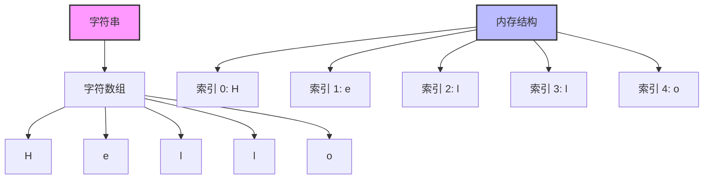
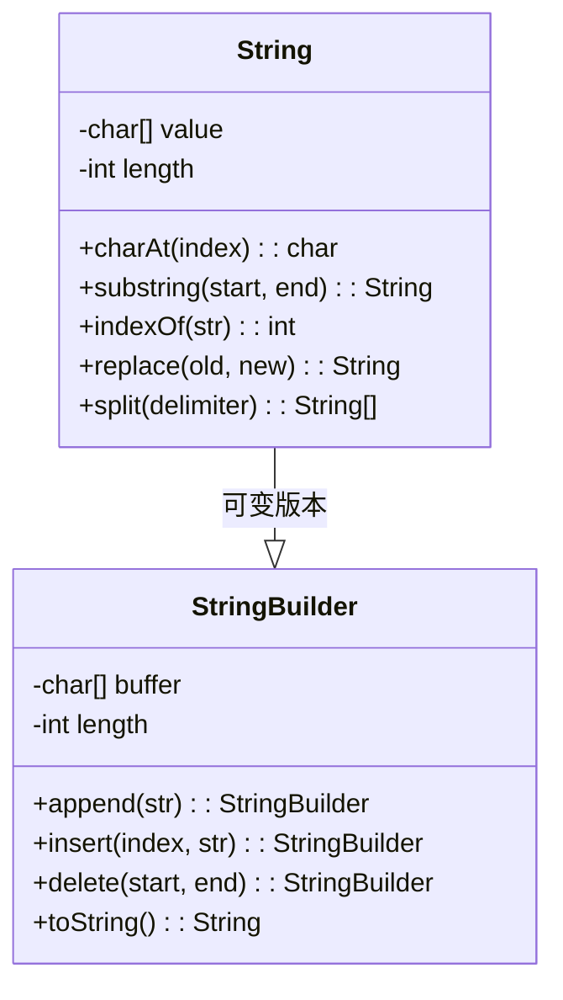

## 🎯 什么是字符串？

### 概念图解


### 生活中的例子
字符串就像一串珠子，每颗珠子都是一个字符，按照特定顺序排列：

```
📿 珠子链条: "Hello World"
┌─┬─┬─┬─┬─┬─┬─┬─┬─┬─┬──┐
│H│e│l│l│o│ │W│o│r│l│d │
└─┴─┴─┴─┴─┴─┴─┴─┴─┴─┴──┘
 0 1 2 3 4 5 6 7 8 9 10  ← 索引位置

📚 书本文字: 每个字符都有固定位置
📱 手机短信: 160个字符的限制
💻 编程代码: 变量名、注释都是字符串
```

### 问题背景
在程序中，我们经常需要处理文本：
- 📝 用户输入的姓名、密码
- 📄 文件内容的读取和处理
- 🌐 网页内容的解析
- 📊 数据的格式化输出
- 🔍 文本搜索和替换

## 🧠 设计思想

### 字符串的本质


### 内存结构对比
```
不可变字符串 (String):
┌─────────────────────────┐
│  "Hello"                │ ← 原始字符串
└─────────────────────────┘
           │
           ▼ 修改操作
┌─────────────────────────┐
│  "Hello World"          │ ← 新字符串对象
└─────────────────────────┘

可变字符串 (StringBuilder):
┌─────────────────────────┐
│  H│e│l│l│o│ │ │ │ │ │   │ ← 缓冲区
└─────────────────────────┘
          ↑
      直接修改
```

### 核心特性
1. **不可变性** - String对象一旦创建就不能修改
2. **索引访问** - 通过下标快速访问任意字符
3. **顺序存储** - 字符按顺序连续存储
4. **Unicode支持** - 支持全球各种语言字符

## 💻 基础操作实现

### 1. 字符串创建和基本操作

```java
/**
 * 字符串基本操作演示
 */
public class StringBasics {

    public static void main(String[] args) {
        // 1. 创建字符串
        String str1 = "Hello";           // 字面量方式
        String str2 = new String("World"); // 构造函数方式
        char[] chars = {'J', 'a', 'v', 'a'};
        String str3 = new String(chars);  // 字符数组方式

        // 2. 基本属性
        System.out.println("长度: " + str1.length());           // 5
        System.out.println("是否为空: " + str1.isEmpty());       // false
        System.out.println("第2个字符: " + str1.charAt(1));      // 'e'

        // 3. 字符串连接
        String result = str1 + " " + str2;  // "Hello World"
        String result2 = str1.concat(" ").concat(str2);

        // 4. 字符串比较
        System.out.println("相等: " + str1.equals("Hello"));     // true
        System.out.println("忽略大小写: " + str1.equalsIgnoreCase("hello")); // true
        System.out.println("比较大小: " + str1.compareTo("Hi"));  // 负数

        // 5. 查找操作
        String text = "Hello World Hello";
        System.out.println("首次出现: " + text.indexOf("Hello"));     // 0
        System.out.println("最后出现: " + text.lastIndexOf("Hello")); // 12
        System.out.println("是否包含: " + text.contains("World"));     // true

        // 6. 子字符串
        System.out.println("子串: " + text.substring(6, 11));    // "World"
        System.out.println("前缀: " + text.startsWith("Hello")); // true
        System.out.println("后缀: " + text.endsWith("Hello"));   // true
    }
}
```

### 2. 字符串修改操作

```java
/**
 * 字符串修改操作
 * 注意：String是不可变的，所有修改都会创建新对象
 */
public class StringModification {

    public static void main(String[] args) {
        String original = "  Hello World  ";

        // 1. 大小写转换
        System.out.println("大写: " + original.toUpperCase());
        System.out.println("小写: " + original.toLowerCase());

        // 2. 去除空格
        System.out.println("去空格: '" + original.trim() + "'");

        // 3. 替换操作
        String text = "Java is great, Java is powerful";
        System.out.println("替换: " + text.replace("Java", "Python"));
        System.out.println("替换首个: " + text.replaceFirst("Java", "Python"));
        System.out.println("正则替换: " + text.replaceAll("\\b\\w{4}\\b", "****"));

        // 4. 分割操作
        String csv = "apple,banana,orange,grape";
        String[] fruits = csv.split(",");
        for (String fruit : fruits) {
            System.out.println("水果: " + fruit);
        }

        // 5. 格式化字符串
        String name = "张三";
        int age = 25;
        double salary = 5000.50;
        String info = String.format("姓名: %s, 年龄: %d, 工资: %.2f", name, age, salary);
        System.out.println(info);
    }
}
```

### 3. 高效字符串构建 - StringBuilder

```java
/**
 * StringBuilder演示 - 用于频繁修改字符串
 */
public class StringBuilderDemo {

    public static void main(String[] args) {
        // 1. 基本操作
        StringBuilder sb = new StringBuilder("Hello");

        sb.append(" World");           // 追加
        sb.insert(5, ",");            // 插入
        sb.delete(5, 6);              // 删除
        sb.replace(6, 11, "Java");     // 替换
        sb.reverse();                 // 反转

        System.out.println("结果: " + sb.toString());

        // 2. 性能对比演示
        performanceComparison();

        // 3. 构建复杂字符串
        StringBuilder html = new StringBuilder();
        html.append("<html>\n")
            .append("<head><title>测试页面</title></head>\n")
            .append("<body>\n")
            .append("<h1>欢迎使用StringBuilder</h1>\n")
            .append("<p>这是一个演示页面</p>\n")
            .append("</body>\n")
            .append("</html>");

        System.out.println("HTML:\n" + html.toString());
    }

    /**
     * 性能对比：String vs StringBuilder
     */
    public static void performanceComparison() {
        int iterations = 10000;

        // String拼接（效率低）
        long start = System.currentTimeMillis();
        String str = "";
        for (int i = 0; i < iterations; i++) {
            str += "a";  // 每次都创建新对象
        }
        long stringTime = System.currentTimeMillis() - start;

        // StringBuilder拼接（效率高）
        start = System.currentTimeMillis();
        StringBuilder sb = new StringBuilder();
        for (int i = 0; i < iterations; i++) {
            sb.append("a");  // 在原有缓冲区上修改
        }
        String sbResult = sb.toString();
        long sbTime = System.currentTimeMillis() - start;

        System.out.println("String拼接时间: " + stringTime + "ms");
        System.out.println("StringBuilder拼接时间: " + sbTime + "ms");
        System.out.println("性能提升: " + (stringTime / (double) sbTime) + "倍");
    }
}
```

## 🔍 字符串算法

### 1. 字符串匹配算法

```java
/**
 * 字符串匹配算法
 */
public class StringMatching {

    /**
     * 暴力匹配算法
     * 时间复杂度: O(n*m)
     */
    public static int bruteForceSearch(String text, String pattern) {
        int n = text.length();
        int m = pattern.length();

        for (int i = 0; i <= n - m; i++) {
            int j;
            for (j = 0; j < m; j++) {
                if (text.charAt(i + j) != pattern.charAt(j)) {
                    break;
                }
            }
            if (j == m) {
                return i;  // 找到匹配
            }
        }
        return -1;  // 未找到
    }

    /**
     * KMP算法（Knuth-Morris-Pratt）
     * 时间复杂度: O(n+m)
     */
    public static int kmpSearch(String text, String pattern) {
        int[] lps = buildLPSArray(pattern);
        int i = 0; // text的索引
        int j = 0; // pattern的索引

        while (i < text.length()) {
            if (text.charAt(i) == pattern.charAt(j)) {
                i++;
                j++;
            }

            if (j == pattern.length()) {
                return i - j;  // 找到匹配
            } else if (i < text.length() && text.charAt(i) != pattern.charAt(j)) {
                if (j != 0) {
                    j = lps[j - 1];
                } else {
                    i++;
                }
            }
        }
        return -1;
    }

    /**
     * 构建LPS（Longest Prefix Suffix）数组
     */
    private static int[] buildLPSArray(String pattern) {
        int m = pattern.length();
        int[] lps = new int[m];
        int len = 0;
        int i = 1;

        while (i < m) {
            if (pattern.charAt(i) == pattern.charAt(len)) {
                len++;
                lps[i] = len;
                i++;
            } else {
                if (len != 0) {
                    len = lps[len - 1];
                } else {
                    lps[i] = 0;
                    i++;
                }
            }
        }
        return lps;
    }

    public static void main(String[] args) {
        String text = "ABABDABACDABABCABCABCABCABC";
        String pattern = "ABABCABCABCABC";

        System.out.println("文本: " + text);
        System.out.println("模式: " + pattern);

        int result1 = bruteForceSearch(text, pattern);
        int result2 = kmpSearch(text, pattern);

        System.out.println("暴力匹配结果: " + result1);
        System.out.println("KMP匹配结果: " + result2);
    }
}
```

### 2. 字符串处理算法

```java
/**
 * 实用字符串处理算法
 */
public class StringAlgorithms {

    /**
     * 判断是否为回文字符串
     */
    public static boolean isPalindrome(String str) {
        if (str == null || str.length() <= 1) return true;

        str = str.toLowerCase().replaceAll("[^a-z0-9]", "");
        int left = 0, right = str.length() - 1;

        while (left < right) {
            if (str.charAt(left) != str.charAt(right)) {
                return false;
            }
            left++;
            right--;
        }
        return true;
    }

    /**
     * 字符串反转
     */
    public static String reverse(String str) {
        if (str == null || str.length() <= 1) return str;

        StringBuilder sb = new StringBuilder();
        for (int i = str.length() - 1; i >= 0; i--) {
            sb.append(str.charAt(i));
        }
        return sb.toString();
    }

    /**
     * 最长公共子序列
     */
    public static String longestCommonSubsequence(String text1, String text2) {
        int m = text1.length(), n = text2.length();
        int[][] dp = new int[m + 1][n + 1];

        // 填充DP表
        for (int i = 1; i <= m; i++) {
            for (int j = 1; j <= n; j++) {
                if (text1.charAt(i - 1) == text2.charAt(j - 1)) {
                    dp[i][j] = dp[i - 1][j - 1] + 1;
                } else {
                    dp[i][j] = Math.max(dp[i - 1][j], dp[i][j - 1]);
                }
            }
        }

        // 构建结果字符串
        StringBuilder lcs = new StringBuilder();
        int i = m, j = n;
        while (i > 0 && j > 0) {
            if (text1.charAt(i - 1) == text2.charAt(j - 1)) {
                lcs.insert(0, text1.charAt(i - 1));
                i--;
                j--;
            } else if (dp[i - 1][j] > dp[i][j - 1]) {
                i--;
            } else {
                j--;
            }
        }

        return lcs.toString();
    }

    /**
     * 字符统计
     */
    public static void characterStatistics(String text) {
        Map<Character, Integer> charCount = new HashMap<>();

        for (char c : text.toCharArray()) {
            charCount.put(c, charCount.getOrDefault(c, 0) + 1);
        }

        System.out.println("字符统计:");
        charCount.entrySet().stream()
                .sorted(Map.Entry.<Character, Integer>comparingByValue().reversed())
                .forEach(entry ->
                    System.out.println("'" + entry.getKey() + "': " + entry.getValue()));
    }

    public static void main(String[] args) {
        // 测试回文
        System.out.println("是否回文:");
        System.out.println("'racecar': " + isPalindrome("racecar"));
        System.out.println("'A man a plan a canal Panama': " +
                          isPalindrome("A man a plan a canal Panama"));

        // 测试反转
        System.out.println("\n字符串反转:");
        System.out.println("'Hello World' -> '" + reverse("Hello World") + "'");

        // 测试最长公共子序列
        System.out.println("\n最长公共子序列:");
        String lcs = longestCommonSubsequence("ABCDGH", "AEDFHR");
        System.out.println("'ABCDGH' 和 'AEDFHR' 的LCS: '" + lcs + "'");

        // 字符统计
        System.out.println("\n字符统计:");
        characterStatistics("Hello World! How are you?");
    }
}
```

## 📊 性能分析

### 时间复杂度对比表
```
操作                    String      StringBuilder
═══════════════════════════════════════════════════
创建                    O(1)        O(1)
访问字符                O(1)        O(1)
长度获取                O(1)        O(1)
连接操作                O(n)        O(1) 均摊
插入操作                O(n)        O(n)
删除操作                O(n)        O(n)
查找操作                O(n)        O(n)
子串操作                O(n)        O(n)
```

### 空间复杂度
```
数据结构                空间复杂度    说明
═══════════════════════════════════════════
String                  O(n)        不可变，每次修改创建新对象
StringBuilder           O(n)        可变缓冲区，容量不足时扩展
StringBuffer            O(n)        线程安全版本的StringBuilder
```

## 🎯 实际应用场景

### 1. 文本处理系统
```java
/**
 * 简单的文本处理系统
 */
public class TextProcessor {

    /**
     * 文本清理：去除多余空格、标点符号等
     */
    public String cleanText(String text) {
        return text.trim()
                  .replaceAll("\\s+", " ")           // 多个空格合并为一个
                  .replaceAll("[^\\w\\s]", "")       // 移除标点符号
                  .toLowerCase();                     // 转为小写
    }

    /**
     * 词频统计
     */
    public Map<String, Integer> wordFrequency(String text) {
        Map<String, Integer> wordCount = new HashMap<>();
        String[] words = cleanText(text).split("\\s+");

        for (String word : words) {
            if (!word.isEmpty()) {
                wordCount.put(word, wordCount.getOrDefault(word, 0) + 1);
            }
        }

        return wordCount;
    }

    /**
     * 文本摘要（简单版本）
     */
    public String generateSummary(String text, int maxLength) {
        String[] sentences = text.split("[.!?]+");
        StringBuilder summary = new StringBuilder();

        for (String sentence : sentences) {
            sentence = sentence.trim();
            if (summary.length() + sentence.length() <= maxLength) {
                summary.append(sentence).append(".");
            } else {
                break;
            }
        }

        return summary.toString();
    }
}
```

## ✅ 优缺点总结

### 优点
- ✅ **简单易用** - 直观的API，容易理解
- ✅ **不可变性** - 线程安全，避免意外修改
- ✅ **内存优化** - 字符串常量池减少内存占用
- ✅ **丰富操作** - 提供大量内置方法
- ✅ **通用性强** - 几乎所有程序都需要字符串

### 缺点
- ❌ **性能问题** - 频繁修改时创建大量临时对象
- ❌ **内存占用** - 大量字符串操作可能导致内存泄漏
- ❌ **编码复杂** - 处理Unicode、多语言时较复杂

### 最佳实践
1. **选择合适的类型**
   - 不频繁修改 → String
   - 频繁修改 → StringBuilder
   - 多线程环境 → StringBuffer

2. **性能优化**
   - 避免在循环中使用String连接
   - 预估StringBuilder的初始容量
   - 使用String.intern()避免重复字符串

3. **内存管理**
   - 及时释放大字符串的引用
   - 使用substring时注意内存泄漏
   - 合理使用字符串常量池

## 🧠 记忆技巧

### 核心概念记忆
> **"字符数组，顺序存储，索引访问，不可修改"**

### 操作分类记忆
```
创建: 字面量、构造函数、字符数组
查询: length、charAt、indexOf、contains
判断: equals、startsWith、endsWith、isEmpty
修改: concat、replace、toUpperCase、trim
转换: split、substring、toCharArray、toString
```

### 性能记忆口诀
> **"频繁修改用Builder，偶尔操作用String"**

---

通过本文的学习，相信你已经全面掌握了字符串这一基础但重要的数据结构。字符串是程序设计的基石，熟练掌握它的各种操作和算法，将为你后续学习更复杂的数据结构打下坚实基础！