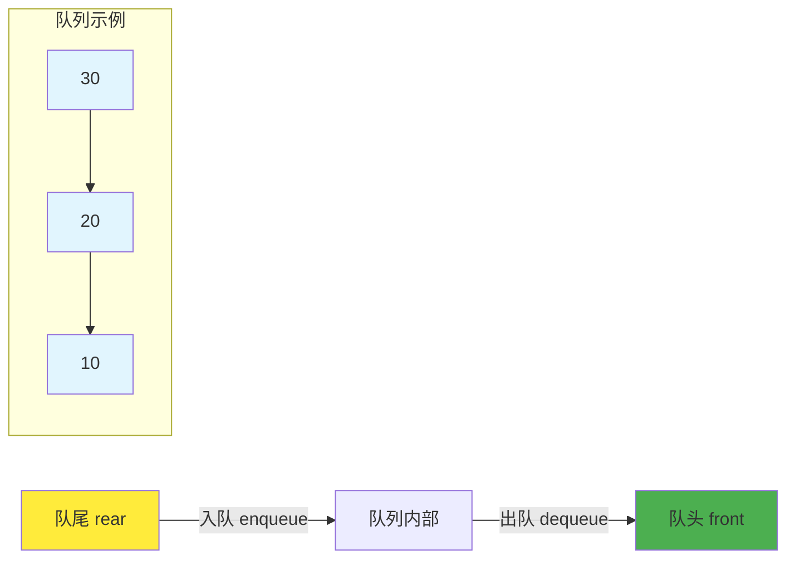
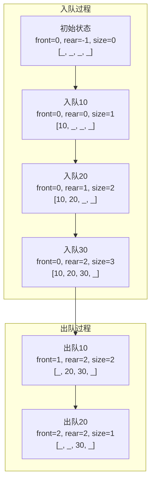

## 🚶‍♂️ 引言：排队的艺术

想象一下银行里的排队场景：最先到达的客户最先得到服务，后来的客户必须在队尾等待。这就是队列的核心思想——**先进先出（First In First Out, FIFO）**！

**队列（Queue）**是一种线性数据结构，只允许在一端（队尾rear）插入元素，在另一端（队头front）删除元素。这种特性使得队列成为处理按序服务场景的完美工具。



## 🏗️ 队列的基本结构

### 队列接口设计

```java
/**
 * 队列接口定义
 * 规定了队列必须实现的基本操作
 */
public interface Queue<T> {
    /**
     * 入队：在队尾添加元素
     * @param item 要添加的元素
     * @return 是否添加成功
     */
    boolean enqueue(T item);

    /**
     * 出队：从队头移除并返回元素
     * @return 队头元素，如果队列为空返回null
     */
    T dequeue();

    /**
     * 查看队头元素但不移除
     * @return 队头元素，如果队列为空返回null
     */
    T front();

    /**
     * 判断队列是否为空
     */
    boolean isEmpty();

    /**
     * 获取队列大小
     */
    int size();

    /**
     * 清空队列
     */
    void clear();
}
```

## 🎯 基于数组的队列实现

### 简单数组队列

```java
/**
 * 基于数组的简单队列实现
 * 优点：实现简单，内存连续
 * 缺点：存在"假溢出"问题
 */
public class ArrayQueue<T> implements Queue<T> {
    private T[] array;
    private int front;    // 队头指针
    private int rear;     // 队尾指针
    private int size;     // 队列大小
    private int capacity; // 队列容量

    @SuppressWarnings("unchecked")
    public ArrayQueue(int capacity) {
        this.capacity = capacity;
        this.array = (T[]) new Object[capacity];
        this.front = 0;
        this.rear = -1;
        this.size = 0;
    }

    @Override
    public boolean enqueue(T item) {
        if (size >= capacity) {
            System.out.println("队列已满，无法入队: " + item);
            return false;
        }

        rear = (rear + 1) % capacity; // 循环使用数组空间
        array[rear] = item;
        size++;

        System.out.println("入队: " + item + ", 当前大小: " + size);
        return true;
    }

    @Override
    public T dequeue() {
        if (isEmpty()) {
            System.out.println("队列为空，无法出队");
            return null;
        }

        T item = array[front];
        array[front] = null; // 避免内存泄漏
        front = (front + 1) % capacity;
        size--;

        System.out.println("出队: " + item + ", 当前大小: " + size);
        return item;
    }

    @Override
    public T front() {
        if (isEmpty()) {
            return null;
        }
        return array[front];
    }

    @Override
    public boolean isEmpty() {
        return size == 0;
    }

    @Override
    public int size() {
        return size;
    }

    @Override
    public void clear() {
        for (int i = 0; i < capacity; i++) {
            array[i] = null;
        }
        front = 0;
        rear = -1;
        size = 0;
        System.out.println("队列已清空");
    }

    /**
     * 显示队列内容
     */
    public void display() {
        if (isEmpty()) {
            System.out.println("队列为空");
            return;
        }

        StringBuilder sb = new StringBuilder("队列内容: [");
        for (int i = 0; i < size; i++) {
            int index = (front + i) % capacity;
            sb.append(array[index]);
            if (i < size - 1) sb.append(", ");
        }
        sb.append("]");

        System.out.println(sb.toString());
        System.out.println("队头位置: " + front + ", 队尾位置: " + rear);
    }
}
```

### 图解队列操作



## 🔄 循环队列实现

循环队列解决了简单队列的"假溢出"问题，更高效地利用存储空间。

```java
/**
 * 循环队列实现
 * 解决了假溢出问题，更高效利用空间
 */
public class CircularQueue<T> implements Queue<T> {
    private T[] array;
    private int front;
    private int rear;
    private int capacity;

    @SuppressWarnings("unchecked")
    public CircularQueue(int capacity) {
        this.capacity = capacity + 1; // 多预留一个位置区分满和空
        this.array = (T[]) new Object[this.capacity];
        this.front = 0;
        this.rear = 0;
    }

    @Override
    public boolean enqueue(T item) {
        if (isFull()) {
            System.out.println("循环队列已满，无法入队: " + item);
            return false;
        }

        array[rear] = item;
        rear = (rear + 1) % capacity;

        System.out.println("入队: " + item);
        return true;
    }

    @Override
    public T dequeue() {
        if (isEmpty()) {
            System.out.println("循环队列为空，无法出队");
            return null;
        }

        T item = array[front];
        array[front] = null;
        front = (front + 1) % capacity;

        System.out.println("出队: " + item);
        return item;
    }

    @Override
    public T front() {
        if (isEmpty()) {
            return null;
        }
        return array[front];
    }

    @Override
    public boolean isEmpty() {
        return front == rear;
    }

    /**
     * 判断队列是否已满
     * 当(rear + 1) % capacity == front时，队列满
     */
    public boolean isFull() {
        return (rear + 1) % capacity == front;
    }

    @Override
    public int size() {
        return (rear - front + capacity) % capacity;
    }

    @Override
    public void clear() {
        for (int i = 0; i < capacity; i++) {
            array[i] = null;
        }
        front = rear = 0;
        System.out.println("循环队列已清空");
    }

    /**
     * 显示循环队列状态
     */
    public void display() {
        System.out.println("循环队列状态:");
        System.out.println("front=" + front + ", rear=" + rear + ", size=" + size());

        if (isEmpty()) {
            System.out.println("队列为空");
            return;
        }

        StringBuilder sb = new StringBuilder("队列内容: [");
        int current = front;
        int count = 0;

        while (count < size()) {
            sb.append(array[current]);
            current = (current + 1) % capacity;
            count++;
            if (count < size()) sb.append(", ");
        }
        sb.append("]");

        System.out.println(sb.toString());
    }
}
```

## 🔗 基于链表的队列实现

```java
/**
 * 基于链表的队列实现
 * 优点：动态大小，不会溢出
 * 缺点：额外的指针开销
 */
public class LinkedQueue<T> implements Queue<T> {

    /**
     * 队列节点类
     */
    private static class QueueNode<T> {
        T data;
        QueueNode<T> next;

        QueueNode(T data) {
            this.data = data;
            this.next = null;
        }
    }

    private QueueNode<T> front; // 队头指针
    private QueueNode<T> rear;  // 队尾指针
    private int size;

    public LinkedQueue() {
        this.front = null;
        this.rear = null;
        this.size = 0;
    }

    @Override
    public boolean enqueue(T item) {
        QueueNode<T> newNode = new QueueNode<>(item);

        if (rear == null) {
            // 队列为空，新节点既是队头也是队尾
            front = rear = newNode;
        } else {
            // 在队尾添加新节点
            rear.next = newNode;
            rear = newNode;
        }

        size++;
        System.out.println("入队: " + item + ", 当前大小: " + size);
        return true;
    }

    @Override
    public T dequeue() {
        if (isEmpty()) {
            System.out.println("队列为空，无法出队");
            return null;
        }

        T data = front.data;
        front = front.next;

        // 如果队列变空，重置rear指针
        if (front == null) {
            rear = null;
        }

        size--;
        System.out.println("出队: " + data + ", 当前大小: " + size);
        return data;
    }

    @Override
    public T front() {
        if (isEmpty()) {
            return null;
        }
        return front.data;
    }

    @Override
    public boolean isEmpty() {
        return front == null;
    }

    @Override
    public int size() {
        return size;
    }

    @Override
    public void clear() {
        front = rear = null;
        size = 0;
        System.out.println("链式队列已清空");
    }

    /**
     * 显示队列内容
     */
    public void display() {
        if (isEmpty()) {
            System.out.println("链式队列为空");
            return;
        }

        StringBuilder sb = new StringBuilder("队列内容: ");
        QueueNode<T> current = front;

        while (current != null) {
            sb.append(current.data);
            if (current.next != null) sb.append(" -> ");
            current = current.next;
        }

        System.out.println(sb.toString());
    }
}
```

## 🎭 特殊类型的队列

### 1. 双端队列（Deque）

双端队列允许在两端进行插入和删除操作，既可以当作队列使用，也可以当作栈使用。

```java
/**
 * 双端队列接口
 */
public interface Deque<T> {
    // 队头操作
    void addFirst(T item);    // 在队头添加元素
    T removeFirst();          // 从队头移除元素
    T peekFirst();           // 查看队头元素

    // 队尾操作
    void addLast(T item);     // 在队尾添加元素
    T removeLast();           // 从队尾移除元素
    T peekLast();            // 查看队尾元素

    // 通用操作
    boolean isEmpty();
    int size();
    void clear();
}

/**
 * 基于链表的双端队列实现
 */
public class LinkedDeque<T> implements Deque<T> {

    /**
     * 双向链表节点
     */
    private static class DequeNode<T> {
        T data;
        DequeNode<T> prev;
        DequeNode<T> next;

        DequeNode(T data) {
            this.data = data;
        }
    }

    private DequeNode<T> head; // 头哨兵节点
    private DequeNode<T> tail; // 尾哨兵节点
    private int size;

    public LinkedDeque() {
        // 使用哨兵节点简化边界处理
        head = new DequeNode<>(null);
        tail = new DequeNode<>(null);
        head.next = tail;
        tail.prev = head;
        size = 0;
    }

    @Override
    public void addFirst(T item) {
        DequeNode<T> newNode = new DequeNode<>(item);

        newNode.next = head.next;
        newNode.prev = head;
        head.next.prev = newNode;
        head.next = newNode;

        size++;
        System.out.println("在队头添加: " + item);
    }

    @Override
    public void addLast(T item) {
        DequeNode<T> newNode = new DequeNode<>(item);

        newNode.prev = tail.prev;
        newNode.next = tail;
        tail.prev.next = newNode;
        tail.prev = newNode;

        size++;
        System.out.println("在队尾添加: " + item);
    }

    @Override
    public T removeFirst() {
        if (isEmpty()) {
            System.out.println("双端队列为空，无法从队头移除");
            return null;
        }

        DequeNode<T> first = head.next;
        T data = first.data;

        head.next = first.next;
        first.next.prev = head;

        size--;
        System.out.println("从队头移除: " + data);
        return data;
    }

    @Override
    public T removeLast() {
        if (isEmpty()) {
            System.out.println("双端队列为空，无法从队尾移除");
            return null;
        }

        DequeNode<T> last = tail.prev;
        T data = last.data;

        tail.prev = last.prev;
        last.prev.next = tail;

        size--;
        System.out.println("从队尾移除: " + data);
        return data;
    }

    @Override
    public T peekFirst() {
        if (isEmpty()) return null;
        return head.next.data;
    }

    @Override
    public T peekLast() {
        if (isEmpty()) return null;
        return tail.prev.data;
    }

    @Override
    public boolean isEmpty() {
        return size == 0;
    }

    @Override
    public int size() {
        return size;
    }

    @Override
    public void clear() {
        head.next = tail;
        tail.prev = head;
        size = 0;
        System.out.println("双端队列已清空");
    }

    /**
     * 显示双端队列内容
     */
    public void display() {
        if (isEmpty()) {
            System.out.println("双端队列为空");
            return;
        }

        StringBuilder sb = new StringBuilder("双端队列: [");
        DequeNode<T> current = head.next;

        while (current != tail) {
            sb.append(current.data);
            if (current.next != tail) sb.append(", ");
            current = current.next;
        }
        sb.append("]");

        System.out.println(sb.toString());
    }
}
```

### 2. 优先队列（Priority Queue）

优先队列不是按照先进先出的原则，而是按照元素的优先级进行出队。

```java
/**
 * 基于堆的优先队列实现
 * 使用最小堆，优先级高的元素先出队
 */
public class PriorityQueue<T extends Comparable<T>> {
    private T[] heap;
    private int size;
    private int capacity;

    @SuppressWarnings("unchecked")
    public PriorityQueue(int capacity) {
        this.capacity = capacity;
        this.heap = (T[]) new Comparable[capacity + 1]; // 下标从1开始
        this.size = 0;
    }

    /**
     * 入队：插入元素并维护堆性质
     * 时间复杂度：O(log n)
     */
    public boolean enqueue(T item) {
        if (size >= capacity) {
            System.out.println("优先队列已满，无法入队: " + item);
            return false;
        }

        size++;
        heap[size] = item;

        // 上浮操作，维护最小堆性质
        swim(size);

        System.out.println("入队: " + item + ", 当前大小: " + size);
        return true;
    }

    /**
     * 出队：移除并返回优先级最高（值最小）的元素
     * 时间复杂度：O(log n)
     */
    public T dequeue() {
        if (isEmpty()) {
            System.out.println("优先队列为空，无法出队");
            return null;
        }

        T min = heap[1];         // 保存最小元素
        heap[1] = heap[size];    // 用最后一个元素替换根节点
        heap[size] = null;       // 避免内存泄漏
        size--;

        if (size > 0) {
            sink(1);             // 下沉操作，维护堆性质
        }

        System.out.println("出队: " + min + ", 当前大小: " + size);
        return min;
    }

    /**
     * 查看队头元素（优先级最高的元素）
     */
    public T peek() {
        if (isEmpty()) return null;
        return heap[1];
    }

    /**
     * 上浮操作：将位置k的元素上浮到合适位置
     */
    private void swim(int k) {
        while (k > 1 && greater(k / 2, k)) {
            swap(k, k / 2);
            k = k / 2;
        }
    }

    /**
     * 下沉操作：将位置k的元素下沉到合适位置
     */
    private void sink(int k) {
        while (2 * k <= size) {
            int j = 2 * k;                    // 左子节点
            if (j < size && greater(j, j + 1)) j++; // 选择较小的子节点
            if (!greater(k, j)) break;        // 已经满足堆性质
            swap(k, j);
            k = j;
        }
    }

    /**
     * 比较两个元素的大小
     */
    private boolean greater(int i, int j) {
        return heap[i].compareTo(heap[j]) > 0;
    }

    /**
     * 交换两个元素
     */
    private void swap(int i, int j) {
        T temp = heap[i];
        heap[i] = heap[j];
        heap[j] = temp;
    }

    public boolean isEmpty() {
        return size == 0;
    }

    public int size() {
        return size;
    }

    /**
     * 显示优先队列内容（以数组形式）
     */
    public void display() {
        if (isEmpty()) {
            System.out.println("优先队列为空");
            return;
        }

        StringBuilder sb = new StringBuilder("优先队列: [");
        for (int i = 1; i <= size; i++) {
            sb.append(heap[i]);
            if (i < size) sb.append(", ");
        }
        sb.append("]");

        System.out.println(sb.toString());
        System.out.println("队头元素（最高优先级）: " + heap[1]);
    }
}
```

## 🎮 实战案例

### 案例1：约瑟夫问题（队列版本）

```java
/**
 * 使用队列解决约瑟夫问题
 */
public class JosephusWithQueue {

    /**
     * 解决约瑟夫问题
     * @param n 总人数
     * @param k 报数间隔
     * @return 最后剩余的人的编号
     */
    public static int solve(int n, int k) {
        Queue<Integer> queue = new LinkedQueue<>();

        // 初始化队列，编号1到n
        for (int i = 1; i <= n; i++) {
            queue.enqueue(i);
        }

        System.out.println("初始队列: ");
        ((LinkedQueue<Integer>) queue).display();

        while (queue.size() > 1) {
            // 前k-1个人重新入队
            for (int i = 0; i < k - 1; i++) {
                Integer person = queue.dequeue();
                queue.enqueue(person);
            }

            // 第k个人出圈
            Integer eliminated = queue.dequeue();
            System.out.println("出圈: " + eliminated);
            System.out.print("剩余: ");
            ((LinkedQueue<Integer>) queue).display();
        }

        int survivor = queue.front();
        System.out.println("最后剩余: " + survivor);
        return survivor;
    }
}
```

### 案例2：广度优先搜索（BFS）

```java
/**
 * 使用队列实现图的广度优先搜索
 */
public class BreadthFirstSearch {

    /**
     * 图的邻接表表示
     */
    private Map<Integer, List<Integer>> graph;

    public BreadthFirstSearch() {
        this.graph = new HashMap<>();
    }

    /**
     * 添加边
     */
    public void addEdge(int source, int destination) {
        graph.computeIfAbsent(source, k -> new ArrayList<>()).add(destination);
        graph.computeIfAbsent(destination, k -> new ArrayList<>()).add(source);
    }

    /**
     * 广度优先搜索
     * @param start 起始节点
     */
    public void bfs(int start) {
        Set<Integer> visited = new HashSet<>();
        Queue<Integer> queue = new LinkedQueue<>();

        visited.add(start);
        queue.enqueue(start);

        System.out.println("BFS遍历顺序:");

        while (!queue.isEmpty()) {
            int current = queue.dequeue();
            System.out.print(current + " ");

            // 访问所有未访问的邻居节点
            List<Integer> neighbors = graph.getOrDefault(current, new ArrayList<>());
            for (int neighbor : neighbors) {
                if (!visited.contains(neighbor)) {
                    visited.add(neighbor);
                    queue.enqueue(neighbor);
                }
            }
        }
        System.out.println();
    }

    /**
     * 寻找最短路径
     */
    public List<Integer> findShortestPath(int start, int end) {
        if (start == end) {
            return Arrays.asList(start);
        }

        Set<Integer> visited = new HashSet<>();
        Queue<Integer> queue = new LinkedQueue<>();
        Map<Integer, Integer> parent = new HashMap<>();

        visited.add(start);
        queue.enqueue(start);
        parent.put(start, null);

        while (!queue.isEmpty()) {
            int current = queue.dequeue();

            List<Integer> neighbors = graph.getOrDefault(current, new ArrayList<>());
            for (int neighbor : neighbors) {
                if (!visited.contains(neighbor)) {
                    visited.add(neighbor);
                    parent.put(neighbor, current);
                    queue.enqueue(neighbor);

                    if (neighbor == end) {
                        // 找到目标，重建路径
                        return buildPath(parent, start, end);
                    }
                }
            }
        }

        return new ArrayList<>(); // 无路径
    }

    /**
     * 重建路径
     */
    private List<Integer> buildPath(Map<Integer, Integer> parent, int start, int end) {
        List<Integer> path = new ArrayList<>();
        int current = end;

        while (current != null) {
            path.add(current);
            current = parent.get(current);
        }

        Collections.reverse(path);
        return path;
    }
}
```

### 案例3：任务调度系统

```java
/**
 * 基于优先队列的任务调度系统
 */
public class TaskScheduler {

    /**
     * 任务类
     */
    static class Task implements Comparable<Task> {
        int id;
        String name;
        int priority;  // 优先级，数值越小优先级越高
        long timestamp;

        public Task(int id, String name, int priority) {
            this.id = id;
            this.name = name;
            this.priority = priority;
            this.timestamp = System.currentTimeMillis();
        }

        @Override
        public int compareTo(Task other) {
            // 首先按优先级排序
            int priorityCompare = Integer.compare(this.priority, other.priority);
            if (priorityCompare != 0) {
                return priorityCompare;
            }
            // 优先级相同时按时间戳排序（先到先服务）
            return Long.compare(this.timestamp, other.timestamp);
        }

        @Override
        public String toString() {
            return String.format("Task{id=%d, name='%s', priority=%d}",
                               id, name, priority);
        }
    }

    private PriorityQueue<Task> taskQueue;

    public TaskScheduler(int capacity) {
        this.taskQueue = new PriorityQueue<>(capacity);
    }

    /**
     * 提交任务
     */
    public void submitTask(int id, String name, int priority) {
        Task task = new Task(id, name, priority);
        if (taskQueue.enqueue(task)) {
            System.out.println("任务已提交: " + task);
        } else {
            System.out.println("任务队列已满，无法提交: " + task);
        }
    }

    /**
     * 执行下一个任务
     */
    public void executeNextTask() {
        Task task = taskQueue.dequeue();
        if (task != null) {
            System.out.println("正在执行任务: " + task);
            // 模拟任务执行
            try {
                Thread.sleep(100);
            } catch (InterruptedException e) {
                Thread.currentThread().interrupt();
            }
            System.out.println("任务执行完成: " + task.name);
        }
    }

    /**
     * 查看下一个要执行的任务
     */
    public void showNextTask() {
        Task task = taskQueue.peek();
        if (task != null) {
            System.out.println("下一个执行的任务: " + task);
        } else {
            System.out.println("没有待执行的任务");
        }
    }

    /**
     * 执行所有任务
     */
    public void executeAllTasks() {
        System.out.println("开始执行所有任务...");
        while (!taskQueue.isEmpty()) {
            executeNextTask();
        }
        System.out.println("所有任务执行完成!");
    }
}
```

## 📊 性能分析与对比

### 各种队列实现的时间复杂度对比

| 操作 | 数组队列 | 循环队列 | 链式队列 | 双端队列 | 优先队列 |
|------|----------|----------|----------|----------|----------|
| 入队 | O(1) | O(1) | O(1) | O(1) | O(log n) |
| 出队 | O(1) | O(1) | O(1) | O(1) | O(log n) |
| 查看队头 | O(1) | O(1) | O(1) | O(1) | O(1) |
| 空间复杂度 | O(n) | O(n) | O(n) | O(n) | O(n) |

### 使用场景推荐

**选择数组队列：**
- 队列大小相对固定
- 需要高效的内存访问
- 对空间利用率要求较高

**选择链式队列：**
- 队列大小动态变化
- 不确定最大容量
- 内存充足且对指针开销不敏感

**选择双端队列：**
- 需要在两端进行操作
- 实现滑动窗口算法
- 需要同时支持栈和队列操作

**选择优先队列：**
- 需要按优先级处理元素
- 实现调度算法
- 解决Top-K问题

## 🧪 完整测试示例

```java
/**
 * 队列功能综合测试
 */
public class QueueTest {
    public static void main(String[] args) {
        System.out.println("=== 队列功能测试 ===");

        // 测试基本队列操作
        testBasicQueue();

        // 测试循环队列
        testCircularQueue();

        // 测试双端队列
        testDeque();

        // 测试优先队列
        testPriorityQueue();

        // 测试实际应用
        testApplications();
    }

    private static void testBasicQueue() {
        System.out.println("\n1. 测试基本队列操作:");
        Queue<Integer> queue = new ArrayQueue<>(5);

        // 入队测试
        queue.enqueue(10);
        queue.enqueue(20);
        queue.enqueue(30);
        ((ArrayQueue<Integer>) queue).display();

        // 出队测试
        queue.dequeue();
        queue.dequeue();
        ((ArrayQueue<Integer>) queue).display();

        // 继续入队测试循环
        queue.enqueue(40);
        queue.enqueue(50);
        queue.enqueue(60);
        ((ArrayQueue<Integer>) queue).display();
    }

    private static void testCircularQueue() {
        System.out.println("\n2. 测试循环队列:");
        CircularQueue<String> cQueue = new CircularQueue<>(4);

        cQueue.enqueue("A");
        cQueue.enqueue("B");
        cQueue.enqueue("C");
        cQueue.display();

        cQueue.dequeue();
        cQueue.enqueue("D");
        cQueue.enqueue("E");
        cQueue.display();
    }

    private static void testDeque() {
        System.out.println("\n3. 测试双端队列:");
        Deque<Integer> deque = new LinkedDeque<>();

        deque.addFirst(1);
        deque.addLast(2);
        deque.addFirst(0);
        deque.addLast(3);
        ((LinkedDeque<Integer>) deque).display();

        deque.removeFirst();
        deque.removeLast();
        ((LinkedDeque<Integer>) deque).display();
    }

    private static void testPriorityQueue() {
        System.out.println("\n4. 测试优先队列:");
        PriorityQueue<Integer> pQueue = new PriorityQueue<>(10);

        pQueue.enqueue(30);
        pQueue.enqueue(10);
        pQueue.enqueue(20);
        pQueue.enqueue(5);
        pQueue.display();

        while (!pQueue.isEmpty()) {
            pQueue.dequeue();
        }
    }

    private static void testApplications() {
        System.out.println("\n5. 测试实际应用:");

        // 约瑟夫问题
        System.out.println("约瑟夫问题 (7人,每3个出圈):");
        JosephusWithQueue.solve(7, 3);

        // 任务调度
        System.out.println("\n任务调度系统:");
        TaskScheduler scheduler = new TaskScheduler(10);
        scheduler.submitTask(1, "数据备份", 1);
        scheduler.submitTask(2, "发送邮件", 3);
        scheduler.submitTask(3, "系统更新", 1);
        scheduler.submitTask(4, "日志清理", 2);

        scheduler.executeAllTasks();
    }
}
```

## 🎯 总结

队列作为一种重要的线性数据结构，在计算机科学中有着广泛的应用：

### 核心特点
1. **FIFO原则：** 先进先出的访问模式
2. **操作限制：** 只能在两端进行插入和删除
3. **实现多样：** 可基于数组或链表实现
4. **应用广泛：** 从操作系统到算法设计都有应用

### 实际应用
- **操作系统：** 进程调度、I/O缓冲
- **网络通信：** 数据包传输、流量控制
- **算法设计：** BFS、拓扑排序
- **系统设计：** 消息队列、任务调度

### 学习建议
1. 理解不同队列实现的优缺点
2. 掌握队列在算法中的应用
3. 练习使用队列解决实际问题
4. 了解队列在系统设计中的作用

队列的设计哲学体现了"公平性"的原则——先到先得。这种简单而强大的数据结构为我们提供了处理有序服务场景的完美工具。掌握队列的各种变体和应用技巧，将为你的编程技能增添重要的一环！

---

*下一篇：《数据结构入门教程：递归算法详解与Java实现》*