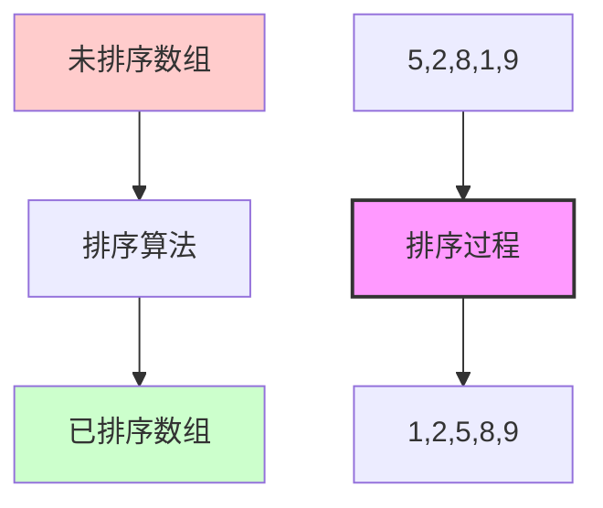
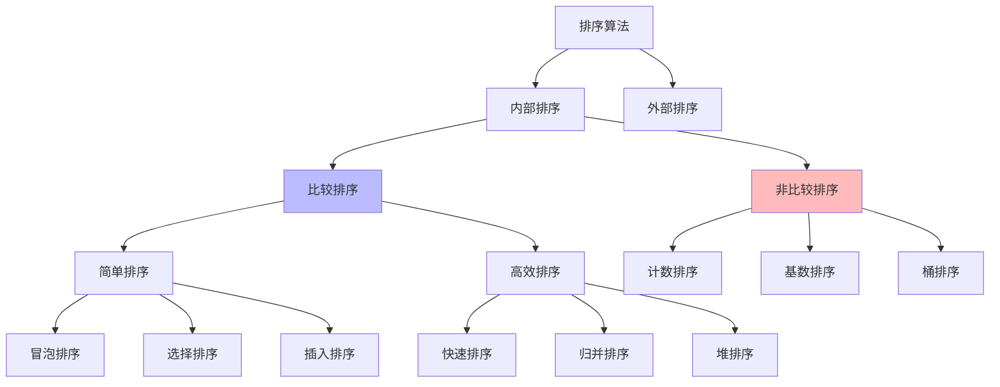
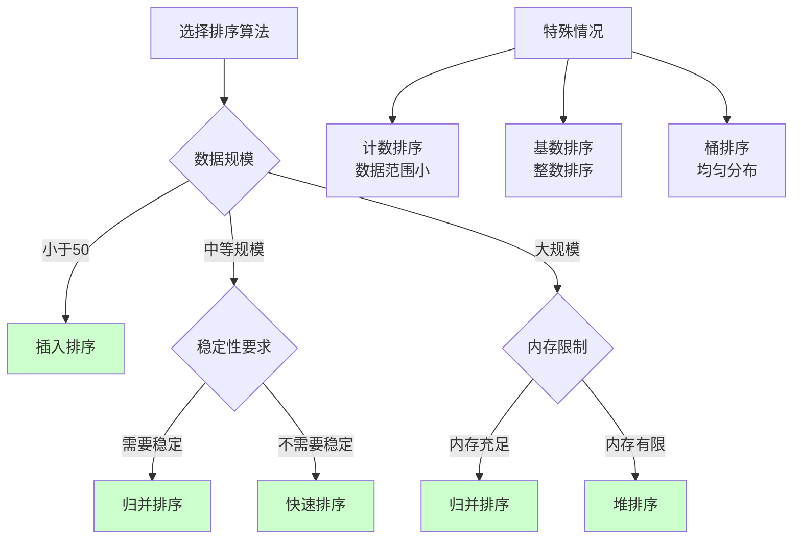

## 🎯 什么是排序算法？

### 概念图解


### 生活中的例子
排序就像整理书架、排队、或者整理扑克牌：

```
📚 整理书架:
混乱状态: [历史📕][数学📘][英语📗][物理📙][化学📔]
         ↓ 按学科排序 ↓
整齐状态: [化学📔][历史📕][数学📘][物理📙][英语📗]

🎯 体育比赛排名:
比赛成绩: [张三:85分][李四:92分][王五:78分][赵六:96分]
         ↓ 按分数降序 ↓
最终排名: [赵六:96分][李四:92分][张三:85分][王五:78分]

🃏 整理扑克牌:
洗牌后: [♠7][♥2][♦K][♣5][♠A][♥9]
       ↓ 按花色和点数排序 ↓
整理后: [♠A][♠7][♥2][♥9][♦K][♣5]
```

### 排序的重要性
- 🔍 **快速查找** - 有序数据支持二分查找
- 📊 **数据分析** - 便于找到最值、中位数等统计信息
- 🎯 **算法基础** - 很多算法依赖于排序
- 💾 **数据库优化** - 索引本质上就是排序
- 📱 **用户体验** - 搜索结果、商品列表等需要排序

## 🏗️ 排序算法分类

### 算法分类图


### 稳定性概念
```
稳定排序: 相等元素的相对位置不变
原数组: [3a, 1, 3b, 2]  (3a和3b值相等但位置不同)
稳定排序后: [1, 2, 3a, 3b]  ← 3a仍在3b前面
不稳定排序后: [1, 2, 3b, 3a]  ← 3a和3b位置可能颠倒

为什么稳定性重要？
学生成绩: [(张三,85,数学), (李四,85,英语), (王五,90,数学)]
如果按分数排序，稳定算法能保持同分学生的原有顺序
```

## 💻 简单排序算法

### 1. 冒泡排序 (Bubble Sort)

```java
/**
 * 冒泡排序 - 相邻元素比较交换
 * 时间复杂度: O(n²) 空间复杂度: O(1) 稳定
 */
public class BubbleSort {

    public static void bubbleSort(int[] arr) {
        int n = arr.length;
        boolean swapped; // 优化：检测是否发生交换

        for (int i = 0; i < n - 1; i++) {
            swapped = false;

            // 每轮将最大元素"冒泡"到末尾
            for (int j = 0; j < n - 1 - i; j++) {
                if (arr[j] > arr[j + 1]) {
                    // 交换相邻元素
                    swap(arr, j, j + 1);
                    swapped = true;
                }

                // 打印每次比较过程
                printArray(arr, "比较 " + arr[j] + " 和 " + arr[j + 1]);
            }

            // 如果没有交换，说明已经有序
            if (!swapped) {
                System.out.println("提前结束，数组已排序");
                break;
            }

            System.out.println("第 " + (i + 1) + " 轮结束: " + arrayToString(arr));
        }
    }

    /**
     * 冒泡排序可视化演示
     */
    public static void bubbleSortDemo() {
        int[] arr = {64, 34, 25, 12, 22, 11, 90};
        System.out.println("冒泡排序演示:");
        System.out.println("初始数组: " + arrayToString(arr));

        /*
        冒泡排序动画效果:
        [64, 34, 25, 12, 22, 11, 90]
         ↑   ↑  比较64和34，交换
        [34, 64, 25, 12, 22, 11, 90]
             ↑   ↑  比较64和25，交换
        [34, 25, 64, 12, 22, 11, 90]
                  ↑   ↑  比较64和12，交换
        ...最大元素90逐步"冒泡"到最后
        */

        bubbleSort(arr);
        System.out.println("排序完成: " + arrayToString(arr));
    }

    private static void swap(int[] arr, int i, int j) {
        int temp = arr[i];
        arr[i] = arr[j];
        arr[j] = temp;
    }

    private static String arrayToString(int[] arr) {
        return java.util.Arrays.toString(arr);
    }

    private static void printArray(int[] arr, String message) {
        // 简化输出，实际可以做动画效果
        // System.out.println(message + ": " + arrayToString(arr));
    }
}
```

### 2. 选择排序 (Selection Sort)

```java
/**
 * 选择排序 - 每次选择最小元素放到前面
 * 时间复杂度: O(n²) 空间复杂度: O(1) 不稳定
 */
public class SelectionSort {

    public static void selectionSort(int[] arr) {
        int n = arr.length;

        for (int i = 0; i < n - 1; i++) {
            // 假设当前位置就是最小值
            int minIndex = i;

            // 在剩余未排序部分找最小值
            for (int j = i + 1; j < n; j++) {
                if (arr[j] < arr[minIndex]) {
                    minIndex = j;
                }
            }

            // 将找到的最小值与当前位置交换
            if (minIndex != i) {
                swap(arr, i, minIndex);
            }

            printStep(arr, i, minIndex);
        }
    }

    /**
     * 选择排序可视化演示
     */
    public static void selectionSortDemo() {
        int[] arr = {64, 25, 12, 22, 11};
        System.out.println("选择排序演示:");
        System.out.println("初始数组: " + arrayToString(arr));

        /*
        选择排序过程：
        [64, 25, 12, 22, 11]  找最小值11，与位置0交换
         ^               ^
        [11, 25, 12, 22, 64]  找剩余最小值12，与位置1交换
             ^       ^
        [11, 12, 25, 22, 64]  找剩余最小值22，与位置2交换
                 ^   ^
        [11, 12, 22, 25, 64]  已排序完成
        */

        selectionSort(arr);
        System.out.println("排序完成: " + arrayToString(arr));
    }

    private static void printStep(int[] arr, int currentPos, int minIndex) {
        System.out.printf("第%d步: 在位置%d放入最小值arr[%d]=%d, 结果: %s%n",
                         currentPos + 1, currentPos, minIndex, arr[currentPos], arrayToString(arr));
    }

    private static void swap(int[] arr, int i, int j) {
        int temp = arr[i];
        arr[i] = arr[j];
        arr[j] = temp;
    }

    private static String arrayToString(int[] arr) {
        return java.util.Arrays.toString(arr);
    }
}
```

### 3. 插入排序 (Insertion Sort)

```java
/**
 * 插入排序 - 逐个插入到已排序部分的正确位置
 * 时间复杂度: O(n²) 空间复杂度: O(1) 稳定
 */
public class InsertionSort {

    public static void insertionSort(int[] arr) {
        int n = arr.length;

        for (int i = 1; i < n; i++) {
            int key = arr[i];  // 当前要插入的元素
            int j = i - 1;     // 已排序部分的最后一个元素

            // 将大于key的元素向右移动
            while (j >= 0 && arr[j] > key) {
                arr[j + 1] = arr[j];
                j--;
            }

            // 插入key到正确位置
            arr[j + 1] = key;

            printStep(arr, i, key);
        }
    }

    /**
     * 插入排序可视化演示
     */
    public static void insertionSortDemo() {
        int[] arr = {5, 2, 4, 6, 1, 3};
        System.out.println("插入排序演示:");
        System.out.println("初始数组: " + arrayToString(arr));

        /*
        插入排序过程（像整理扑克牌）:
        [5, 2, 4, 6, 1, 3]  取出2，插入到5前面
         ↑  ↑
        [2, 5, 4, 6, 1, 3]  取出4，插入到2和5之间
            ↑  ↑
        [2, 4, 5, 6, 1, 3]  取出6，已经在正确位置
               ↑  ↑
        [2, 4, 5, 6, 1, 3]  取出1，插入到最前面
                    ↑
        [1, 2, 4, 5, 6, 3]  取出3，插入到2和4之间
                       ↑
        [1, 2, 3, 4, 5, 6]  排序完成
        */

        insertionSort(arr);
        System.out.println("排序完成: " + arrayToString(arr));
    }

    /**
     * 二分插入排序（优化版本）
     */
    public static void binaryInsertionSort(int[] arr) {
        for (int i = 1; i < arr.length; i++) {
            int key = arr[i];

            // 使用二分查找找到插入位置
            int left = 0, right = i;
            while (left < right) {
                int mid = (left + right) / 2;
                if (arr[mid] > key) {
                    right = mid;
                } else {
                    left = mid + 1;
                }
            }

            // 移动元素并插入
            for (int j = i; j > left; j--) {
                arr[j] = arr[j - 1];
            }
            arr[left] = key;
        }
    }

    private static void printStep(int[] arr, int step, int insertedValue) {
        System.out.printf("第%d步: 插入元素%d, 结果: %s%n",
                         step, insertedValue, arrayToString(arr));
    }

    private static String arrayToString(int[] arr) {
        return java.util.Arrays.toString(arr);
    }
}
```

## 🚀 高效排序算法

### 1. 快速排序 (Quick Sort)

```java
/**
 * 快速排序 - 分治思想，选择基准元素分割数组
 * 平均时间复杂度: O(n log n) 最坏: O(n²) 空间: O(log n) 不稳定
 */
public class QuickSort {

    public static void quickSort(int[] arr, int low, int high) {
        if (low < high) {
            // 分割数组，返回基准元素的正确位置
            int pivotIndex = partition(arr, low, high);

            printPartition(arr, low, high, pivotIndex);

            // 递归排序左右两部分
            quickSort(arr, low, pivotIndex - 1);   // 左半部分
            quickSort(arr, pivotIndex + 1, high);  // 右半部分
        }
    }

    /**
     * 分割函数 - 选择最后一个元素作为基准
     */
    private static int partition(int[] arr, int low, int high) {
        int pivot = arr[high];  // 选择最后一个元素作为基准
        int i = low - 1;        // 小于基准的元素的索引

        for (int j = low; j < high; j++) {
            // 如果当前元素小于等于基准
            if (arr[j] <= pivot) {
                i++;
                swap(arr, i, j);
            }
        }

        // 将基准元素放到正确位置
        swap(arr, i + 1, high);
        return i + 1;
    }

    /**
     * 快速排序可视化演示
     */
    public static void quickSortDemo() {
        int[] arr = {10, 7, 8, 9, 1, 5};
        System.out.println("快速排序演示:");
        System.out.println("初始数组: " + arrayToString(arr));

        /*
        快速排序过程（分治思想）:
        [10, 7, 8, 9, 1, 5]  选择5作为基准
         ←─ 小于5 ─→ | 5 | ←─ 大于5 ─→
        [1, 5, 8, 9, 10, 7]  分割完成，5在正确位置

        左半部分 [1] 已排序
        右半部分 [8, 9, 10, 7] 继续分割...
        */

        quickSort(arr, 0, arr.length - 1);
        System.out.println("排序完成: " + arrayToString(arr));
    }

    /**
     * 三路快排（处理重复元素优化）
     */
    public static void quickSort3Way(int[] arr, int low, int high) {
        if (low >= high) return;

        int pivot = arr[low];
        int lt = low;      // arr[low...lt-1] < pivot
        int gt = high + 1; // arr[gt...high] > pivot
        int i = low + 1;   // arr[lt...i-1] == pivot

        while (i < gt) {
            if (arr[i] < pivot) {
                swap(arr, lt++, i++);
            } else if (arr[i] > pivot) {
                swap(arr, i, --gt);
            } else {
                i++;
            }
        }

        // 递归排序左右两部分
        quickSort3Way(arr, low, lt - 1);
        quickSort3Way(arr, gt, high);
    }

    private static void printPartition(int[] arr, int low, int high, int pivotIndex) {
        System.out.printf("分割范围[%d,%d], 基准位置:%d, 基准值:%d, 结果: %s%n",
                         low, high, pivotIndex, arr[pivotIndex], arrayToString(arr));
    }

    private static void swap(int[] arr, int i, int j) {
        int temp = arr[i];
        arr[i] = arr[j];
        arr[j] = temp;
    }

    private static String arrayToString(int[] arr) {
        return java.util.Arrays.toString(arr);
    }
}
```

### 2. 归并排序 (Merge Sort)

```java
/**
 * 归并排序 - 分治思想，将数组分割后合并
 * 时间复杂度: O(n log n) 空间复杂度: O(n) 稳定
 */
public class MergeSort {

    public static void mergeSort(int[] arr, int left, int right) {
        if (left < right) {
            int mid = left + (right - left) / 2;

            // 递归分割左右两半
            mergeSort(arr, left, mid);
            mergeSort(arr, mid + 1, right);

            // 合并两个有序数组
            merge(arr, left, mid, right);

            printMergeStep(arr, left, mid, right);
        }
    }

    /**
     * 合并两个有序数组
     */
    private static void merge(int[] arr, int left, int mid, int right) {
        // 创建临时数组
        int[] temp = new int[right - left + 1];
        int i = left, j = mid + 1, k = 0;

        // 比较两个数组的元素，将较小的放入临时数组
        while (i <= mid && j <= right) {
            if (arr[i] <= arr[j]) {
                temp[k++] = arr[i++];
            } else {
                temp[k++] = arr[j++];
            }
        }

        // 复制剩余元素
        while (i <= mid) {
            temp[k++] = arr[i++];
        }
        while (j <= right) {
            temp[k++] = arr[j++];
        }

        // 将临时数组复制回原数组
        for (i = left; i <= right; i++) {
            arr[i] = temp[i - left];
        }
    }

    /**
     * 归并排序可视化演示
     */
    public static void mergeSortDemo() {
        int[] arr = {38, 27, 43, 3, 9, 82, 10};
        System.out.println("归并排序演示:");
        System.out.println("初始数组: " + arrayToString(arr));

        /*
        归并排序过程（分治合并）:

        分割阶段:
        [38, 27, 43, 3, 9, 82, 10]
              ↓ 分割
        [38, 27, 43]    [3, 9, 82, 10]
              ↓              ↓
        [38][27, 43]    [3, 9][82, 10]
              ↓              ↓
        [38][27][43]    [3][9][82][10]

        合并阶段:
        [27, 38, 43]    [3, 9, 10, 82]
              ↓ 合并
        [3, 9, 10, 27, 38, 43, 82]
        */

        mergeSort(arr, 0, arr.length - 1);
        System.out.println("排序完成: " + arrayToString(arr));
    }

    /**
     * 自底向上的归并排序（迭代版本）
     */
    public static void mergeSortBottomUp(int[] arr) {
        int n = arr.length;

        // 子数组大小从1开始，每次翻倍
        for (int size = 1; size < n; size *= 2) {
            // 合并相邻的子数组
            for (int left = 0; left < n - size; left += 2 * size) {
                int mid = left + size - 1;
                int right = Math.min(left + 2 * size - 1, n - 1);

                merge(arr, left, mid, right);
            }

            System.out.printf("子数组大小%d合并完成: %s%n", size, arrayToString(arr));
        }
    }

    private static void printMergeStep(int[] arr, int left, int mid, int right) {
        System.out.printf("合并[%d,%d]和[%d,%d]: %s%n",
                         left, mid, mid + 1, right, arrayToString(arr));
    }

    private static String arrayToString(int[] arr) {
        return java.util.Arrays.toString(arr);
    }
}
```

### 3. 堆排序 (Heap Sort)

```java
/**
 * 堆排序 - 利用堆的性质进行排序
 * 时间复杂度: O(n log n) 空间复杂度: O(1) 不稳定
 */
public class HeapSort {

    public static void heapSort(int[] arr) {
        int n = arr.length;

        // 构建最大堆（从最后一个非叶子节点开始）
        for (int i = n / 2 - 1; i >= 0; i--) {
            heapify(arr, n, i);
        }

        System.out.println("构建完成的最大堆: " + arrayToString(arr));

        // 逐个提取堆顶元素
        for (int i = n - 1; i > 0; i--) {
            // 将堆顶（最大值）与最后一个元素交换
            swap(arr, 0, i);

            // 重新调整堆
            heapify(arr, i, 0);

            printStep(arr, i);
        }
    }

    /**
     * 调整堆，保持最大堆性质
     * @param arr 数组
     * @param n 堆的大小
     * @param i 要调整的节点索引
     */
    private static void heapify(int[] arr, int n, int i) {
        int largest = i;      // 假设父节点最大
        int left = 2 * i + 1; // 左子节点
        int right = 2 * i + 2;// 右子节点

        // 找到父节点和子节点中的最大值
        if (left < n && arr[left] > arr[largest]) {
            largest = left;
        }

        if (right < n && arr[right] > arr[largest]) {
            largest = right;
        }

        // 如果最大值不是父节点，交换并继续调整
        if (largest != i) {
            swap(arr, i, largest);
            heapify(arr, n, largest);
        }
    }

    /**
     * 堆排序可视化演示
     */
    public static void heapSortDemo() {
        int[] arr = {12, 11, 13, 5, 6, 7};
        System.out.println("堆排序演示:");
        System.out.println("初始数组: " + arrayToString(arr));

        /*
        堆排序过程:

        1. 构建最大堆:
        原数组: [12, 11, 13, 5, 6, 7]
        最大堆:      13
                   ↙    ↘
                 12      7
               ↙  ↘    ↙
              5    6  11
        数组形式: [13, 12, 7, 5, 6, 11]

        2. 排序过程:
        [13, 12, 7, 5, 6, 11] → 交换13和11 → [11, 12, 7, 5, 6, 13]
        调整堆 → [12, 11, 7, 5, 6, 13]
        继续提取最大值...
        */

        heapSort(arr);
        System.out.println("排序完成: " + arrayToString(arr));
    }

    /**
     * 堆结构可视化
     */
    public static void printHeapStructure(int[] arr) {
        System.out.println("堆的树形结构:");
        printHeapTree(arr, 0, 0);
    }

    private static void printHeapTree(int[] arr, int index, int level) {
        if (index >= arr.length) return;

        // 打印右子树
        printHeapTree(arr, 2 * index + 2, level + 1);

        // 打印当前节点
        for (int i = 0; i < level; i++) {
            System.out.print("    ");
        }
        System.out.println(arr[index]);

        // 打印左子树
        printHeapTree(arr, 2 * index + 1, level + 1);
    }

    private static void printStep(int[] arr, int remaining) {
        System.out.printf("提取最大值后，剩余%d个元素: %s%n",
                         remaining, arrayToString(arr));
    }

    private static void swap(int[] arr, int i, int j) {
        int temp = arr[i];
        arr[i] = arr[j];
        arr[j] = temp;
    }

    private static String arrayToString(int[] arr) {
        return java.util.Arrays.toString(arr);
    }
}
```

## 📊 排序算法性能对比

### 复杂度对比表
```
算法         最好时间    平均时间    最坏时间    空间复杂度   稳定性
═══════════════════════════════════════════════════════════════
冒泡排序     O(n)       O(n²)       O(n²)       O(1)        稳定
选择排序     O(n²)      O(n²)       O(n²)       O(1)        不稳定
插入排序     O(n)       O(n²)       O(n²)       O(1)        稳定
快速排序     O(n log n) O(n log n)  O(n²)       O(log n)    不稳定
归并排序     O(n log n) O(n log n)  O(n log n)  O(n)        稳定
堆排序       O(n log n) O(n log n)  O(n log n)  O(1)        不稳定
希尔排序     O(n)       O(n^1.3)    O(n²)       O(1)        不稳定
计数排序     O(n+k)     O(n+k)      O(n+k)      O(k)        稳定
基数排序     O(d(n+k))  O(d(n+k))   O(d(n+k))   O(n+k)      稳定
桶排序       O(n)       O(n+k)      O(n²)       O(n+k)      稳定
```

### 性能测试对比

```java
/**
 * 排序算法性能测试
 */
public class SortingPerformanceTest {

    public static void performanceTest() {
        int[] sizes = {1000, 5000, 10000, 50000};

        for (int size : sizes) {
            System.out.println("\n测试数组大小: " + size);

            // 生成随机数组
            int[] randomArray = generateRandomArray(size);

            // 测试各种排序算法
            testSortingAlgorithm("冒泡排序", randomArray.clone(), BubbleSort::bubbleSort);
            testSortingAlgorithm("选择排序", randomArray.clone(), SelectionSort::selectionSort);
            testSortingAlgorithm("插入排序", randomArray.clone(), InsertionSort::insertionSort);
            testSortingAlgorithm("快速排序", randomArray.clone(),
                arr -> QuickSort.quickSort(arr, 0, arr.length - 1));
            testSortingAlgorithm("归并排序", randomArray.clone(),
                arr -> MergeSort.mergeSort(arr, 0, arr.length - 1));
            testSortingAlgorithm("堆排序", randomArray.clone(), HeapSort::heapSort);
            testSortingAlgorithm("Java内置排序", randomArray.clone(), Arrays::sort);
        }
    }

    private static void testSortingAlgorithm(String name, int[] arr, Consumer<int[]> sortMethod) {
        long startTime = System.currentTimeMillis();

        try {
            sortMethod.accept(arr);
            long endTime = System.currentTimeMillis();

            // 验证排序结果
            boolean isSorted = isSorted(arr);
            System.out.printf("%-12s: %4dms %s%n",
                             name, endTime - startTime, isSorted ? "✓" : "✗");
        } catch (Exception e) {
            System.out.printf("%-12s: 超时或错误%n", name);
        }
    }

    private static boolean isSorted(int[] arr) {
        for (int i = 1; i < arr.length; i++) {
            if (arr[i] < arr[i - 1]) {
                return false;
            }
        }
        return true;
    }

    private static int[] generateRandomArray(int size) {
        Random random = new Random();
        return random.ints(size, 1, 10000).toArray();
    }
}
```

## 🎯 选择合适的排序算法

### 算法选择指南


### 实际应用场景
```java
/**
 * 根据场景选择排序算法
 */
public class SortingStrategy {

    /**
     * 通用排序策略
     */
    public static void smartSort(int[] arr) {
        int n = arr.length;

        if (n < 50) {
            // 小数组使用插入排序
            InsertionSort.insertionSort(arr);
        } else if (n < 10000) {
            // 中等数组使用快速排序
            QuickSort.quickSort(arr, 0, n - 1);
        } else {
            // 大数组使用归并排序（稳定）
            MergeSort.mergeSort(arr, 0, n - 1);
        }
    }

    /**
     * 针对特定数据的优化排序
     */
    public static void optimizedSort(int[] arr) {
        // 检查数组是否已基本有序
        if (isNearlySorted(arr)) {
            System.out.println("检测到近似有序数组，使用插入排序");
            InsertionSort.insertionSort(arr);
            return;
        }

        // 检查是否有大量重复元素
        if (hasManyDuplicates(arr)) {
            System.out.println("检测到大量重复元素，使用三路快排");
            QuickSort.quickSort3Way(arr, 0, arr.length - 1);
            return;
        }

        // 默认策略
        smartSort(arr);
    }

    private static boolean isNearlySorted(int[] arr) {
        int inversions = 0;
        for (int i = 0; i < arr.length - 1; i++) {
            if (arr[i] > arr[i + 1]) {
                inversions++;
                if (inversions > arr.length * 0.1) {
                    return false;
                }
            }
        }
        return true;
    }

    private static boolean hasManyDuplicates(int[] arr) {
        Set<Integer> unique = new HashSet<>();
        for (int val : arr) {
            unique.add(val);
        }
        return unique.size() < arr.length * 0.1;
    }
}
```

## ✅ 总结与最佳实践

### 算法特点记忆
```
🔥 冒泡排序: 相邻比较，最大冒泡
🎯 选择排序: 选择最小，依次放置
📥 插入排序: 逐个插入，维持有序
⚡ 快速排序: 分治思想，基准分割
🔗 归并排序: 分而治之，合并有序
🌲 堆排序: 堆顶最大，逐个提取
```

### 使用建议
1. **教学演示** → 冒泡、选择、插入排序
2. **实际项目** → 快速、归并、堆排序
3. **库函数** → 混合排序（Tim Sort、Intro Sort）
4. **特殊场景** → 计数、基数、桶排序

### 记忆口诀
> **"小用插入，大用归并，快排通用，堆排稳定"**

---

掌握了排序算法，你就掌握了算法学习的基石！这些经典算法不仅是面试常考题目，更是培养算法思维的最佳练习。记住，没有最好的算法，只有最适合的算法！