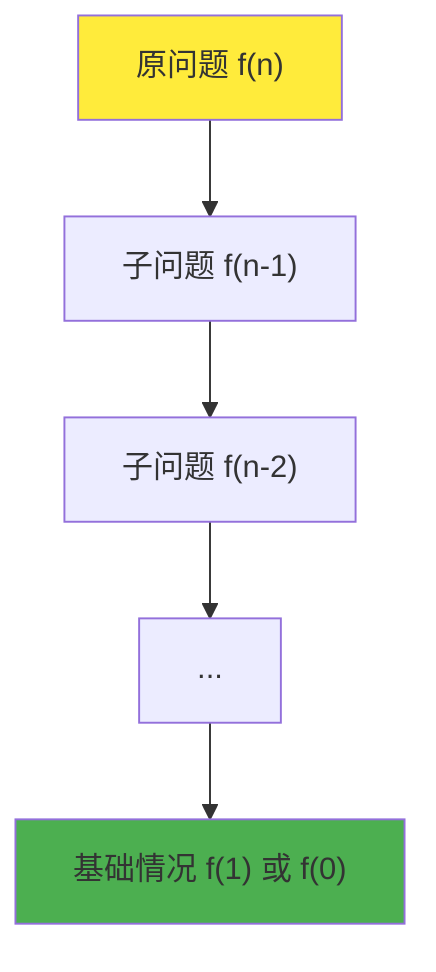

## 🪄 引言：魔法般的自我调用

想象一下俄罗斯套娃——每个娃娃里都包含一个更小的娃娃，直到最里面的那个小娃娃。这就是递归的本质：**一个问题包含与自身相似的子问题**！

**递归（Recursion）**是一种解决问题的方法，其中函数调用自身来解决更小规模的相同问题。递归就像是程序世界的"分而治之"策略，将复杂问题分解成更简单的同类问题。



## 🏗️ 递归的基本构成

### 递归的三要素

每个递归函数都必须包含以下三个要素：

1. **递归出口（Base Case）**：问题的最简单情况，无需再次递归
2. **递归调用（Recursive Case）**：函数调用自身来解决子问题
3. **状态变化**：每次递归调用时，问题规模必须朝着基础情况变化

```java
/**
 * 递归的通用模板
 */
public class RecursionTemplate {

    /**
     * 递归函数的通用结构
     * @param parameter 递归参数
     * @return 递归结果
     */
    public static ReturnType recursiveFunction(ParameterType parameter) {
        // 1. 递归出口（基础情况）
        if (基础条件) {
            return 基础情况的解;
        }

        // 2. 递归调用（处理子问题）
        // 确保参数朝着基础情况变化
        ReturnType subResult = recursiveFunction(更小的参数);

        // 3. 合并子问题的解
        return 基于subResult的解;
    }
}
```

## 🎯 经典递归算法实现

### 1. 阶乘计算

阶乘是递归的经典入门例子：n! = n × (n-1) × (n-2) × ... × 1

```java
/**
 * 阶乘计算的递归实现
 */
public class Factorial {

    /**
     * 递归计算阶乘
     * 时间复杂度：O(n)
     * 空间复杂度：O(n) - 递归调用栈
     */
    public static long factorialRecursive(int n) {
        System.out.println("计算 " + n + "!");

        // 1. 递归出口
        if (n <= 1) {
            System.out.println("到达基础情况: " + n + "! = 1");
            return 1;
        }

        // 2. 递归调用
        System.out.println(n + "! = " + n + " × " + (n-1) + "!");
        long subResult = factorialRecursive(n - 1);

        // 3. 合并结果
        long result = n * subResult;
        System.out.println(n + "! = " + result);
        return result;
    }

    /**
     * 迭代版本的阶乘计算
     * 时间复杂度：O(n)
     * 空间复杂度：O(1)
     */
    public static long factorialIterative(int n) {
        long result = 1;
        for (int i = 1; i <= n; i++) {
            result *= i;
        }
        return result;
    }

    /**
     * 尾递归优化版本
     * 某些编译器可以优化为迭代
     */
    public static long factorialTailRecursive(int n) {
        return factorialTailHelper(n, 1);
    }

    private static long factorialTailHelper(int n, long accumulator) {
        if (n <= 1) {
            return accumulator;
        }
        // 尾递归：递归调用是函数的最后一个操作
        return factorialTailHelper(n - 1, n * accumulator);
    }
}
```

**调用栈演示：**
```
factorialRecursive(4)
├── factorialRecursive(3)
│   ├── factorialRecursive(2)
│   │   ├── factorialRecursive(1) → 1
│   │   └── return 2 × 1 = 2
│   └── return 3 × 2 = 6
└── return 4 × 6 = 24
```

### 2. 斐波那契数列

斐波那契数列：F(n) = F(n-1) + F(n-2)，其中 F(0) = 0, F(1) = 1

```java
/**
 * 斐波那契数列的多种实现方式
 */
public class Fibonacci {

    /**
     * 朴素递归实现（效率低）
     * 时间复杂度：O(2^n)
     * 空间复杂度：O(n)
     */
    public static long fibonacciNaive(int n) {
        System.out.println("计算 fibonacci(" + n + ")");

        if (n <= 1) {
            System.out.println("基础情况: fibonacci(" + n + ") = " + n);
            return n;
        }

        long left = fibonacciNaive(n - 1);
        long right = fibonacciNaive(n - 2);
        long result = left + right;

        System.out.println("fibonacci(" + n + ") = " + left + " + " + right + " = " + result);
        return result;
    }

    /**
     * 记忆化递归（动态规划）
     * 时间复杂度：O(n)
     * 空间复杂度：O(n)
     */
    public static long fibonacciMemo(int n) {
        Map<Integer, Long> memo = new HashMap<>();
        return fibonacciMemoHelper(n, memo);
    }

    private static long fibonacciMemoHelper(int n, Map<Integer, Long> memo) {
        if (memo.containsKey(n)) {
            System.out.println("从缓存获取 fibonacci(" + n + ") = " + memo.get(n));
            return memo.get(n);
        }

        long result;
        if (n <= 1) {
            result = n;
        } else {
            result = fibonacciMemoHelper(n - 1, memo) + fibonacciMemoHelper(n - 2, memo);
        }

        memo.put(n, result);
        System.out.println("计算并缓存 fibonacci(" + n + ") = " + result);
        return result;
    }

    /**
     * 迭代实现（最优）
     * 时间复杂度：O(n)
     * 空间复杂度：O(1)
     */
    public static long fibonacciIterative(int n) {
        if (n <= 1) return n;

        long prev = 0, curr = 1;
        for (int i = 2; i <= n; i++) {
            long next = prev + curr;
            prev = curr;
            curr = next;
        }
        return curr;
    }

    /**
     * 矩阵快速幂算法
     * 时间复杂度：O(log n)
     * 空间复杂度：O(log n)
     */
    public static long fibonacciMatrix(int n) {
        if (n <= 1) return n;

        long[][] baseMatrix = {{1, 1}, {1, 0}};
        long[][] result = matrixPower(baseMatrix, n - 1);
        return result[0][0];
    }

    private static long[][] matrixPower(long[][] matrix, int power) {
        if (power == 1) return matrix;

        long[][] half = matrixPower(matrix, power / 2);
        long[][] result = matrixMultiply(half, half);

        if (power % 2 == 1) {
            result = matrixMultiply(result, matrix);
        }

        return result;
    }

    private static long[][] matrixMultiply(long[][] a, long[][] b) {
        return new long[][] {
            {a[0][0] * b[0][0] + a[0][1] * b[1][0], a[0][0] * b[0][1] + a[0][1] * b[1][1]},
            {a[1][0] * b[0][0] + a[1][1] * b[1][0], a[1][0] * b[0][1] + a[1][1] * b[1][1]}
        };
    }
}
```

### 3. 汉诺塔问题

汉诺塔是递归思想的经典体现：将n个盘子从源柱移动到目标柱。

```java
/**
 * 汉诺塔问题的递归解法
 */
public class TowerOfHanoi {

    /**
     * 解决汉诺塔问题
     * @param n 盘子数量
     * @param source 源柱
     * @param destination 目标柱
     * @param auxiliary 辅助柱
     * @return 移动步数
     */
    public static int solve(int n, char source, char destination, char auxiliary) {
        if (n == 1) {
            // 基础情况：只有一个盘子，直接移动
            System.out.println("将盘子1从 " + source + " 移动到 " + destination);
            return 1;
        }

        int steps = 0;

        // 步骤1：将前n-1个盘子从源柱移到辅助柱
        steps += solve(n - 1, source, auxiliary, destination);

        // 步骤2：将最大的盘子从源柱移到目标柱
        System.out.println("将盘子" + n + "从 " + source + " 移动到 " + destination);
        steps++;

        // 步骤3：将n-1个盘子从辅助柱移到目标柱
        steps += solve(n - 1, auxiliary, destination, source);

        return steps;
    }

    /**
     * 计算汉诺塔最少移动步数
     * 公式：2^n - 1
     */
    public static int minSteps(int n) {
        return (int) Math.pow(2, n) - 1;
    }

    /**
     * 可视化汉诺塔状态
     */
    public static class HanoiVisualizer {
        private Stack<Integer>[] towers;
        private int diskCount;

        @SuppressWarnings("unchecked")
        public HanoiVisualizer(int diskCount) {
            this.diskCount = diskCount;
            this.towers = new Stack[3];
            for (int i = 0; i < 3; i++) {
                towers[i] = new Stack<>();
            }

            // 初始化：所有盘子在第一个柱子上
            for (int i = diskCount; i >= 1; i--) {
                towers[0].push(i);
            }
        }

        public void moveDisk(int from, int to) {
            if (towers[from].isEmpty()) {
                System.out.println("错误：柱子 " + (char)('A' + from) + " 为空");
                return;
            }

            int disk = towers[from].pop();
            towers[to].push(disk);

            System.out.println("移动盘子 " + disk + " 从 " + (char)('A' + from) +
                             " 到 " + (char)('A' + to));
            display();
        }

        public void display() {
            System.out.println("当前状态:");
            for (int level = diskCount; level >= 1; level--) {
                for (int tower = 0; tower < 3; tower++) {
                    if (towers[tower].size() >= level) {
                        int disk = towers[tower].get(level - 1);
                        System.out.print("  " + disk + "  ");
                    } else {
                        System.out.print("  |  ");
                    }
                }
                System.out.println();
            }
            System.out.println("-----");
            System.out.println("  A    B    C");
            System.out.println();
        }
    }
}
```

### 4. 树的递归遍历

```java
/**
 * 二叉树节点定义
 */
class TreeNode {
    int val;
    TreeNode left;
    TreeNode right;

    TreeNode(int val) {
        this.val = val;
    }

    TreeNode(int val, TreeNode left, TreeNode right) {
        this.val = val;
        this.left = left;
        this.right = right;
    }
}

/**
 * 二叉树的递归遍历算法
 */
public class TreeTraversal {

    /**
     * 前序遍历：根 -> 左 -> 右
     */
    public static void preorderTraversal(TreeNode root) {
        if (root == null) {
            return; // 递归出口
        }

        // 访问根节点
        System.out.print(root.val + " ");

        // 递归遍历左子树
        preorderTraversal(root.left);

        // 递归遍历右子树
        preorderTraversal(root.right);
    }

    /**
     * 中序遍历：左 -> 根 -> 右
     */
    public static void inorderTraversal(TreeNode root) {
        if (root == null) {
            return;
        }

        inorderTraversal(root.left);   // 左子树
        System.out.print(root.val + " "); // 根节点
        inorderTraversal(root.right);  // 右子树
    }

    /**
     * 后序遍历：左 -> 右 -> 根
     */
    public static void postorderTraversal(TreeNode root) {
        if (root == null) {
            return;
        }

        postorderTraversal(root.left);  // 左子树
        postorderTraversal(root.right); // 右子树
        System.out.print(root.val + " ");  // 根节点
    }

    /**
     * 计算树的深度
     */
    public static int maxDepth(TreeNode root) {
        if (root == null) {
            return 0; // 空树深度为0
        }

        int leftDepth = maxDepth(root.left);
        int rightDepth = maxDepth(root.right);

        return Math.max(leftDepth, rightDepth) + 1;
    }

    /**
     * 计算树的节点总数
     */
    public static int countNodes(TreeNode root) {
        if (root == null) {
            return 0;
        }

        return 1 + countNodes(root.left) + countNodes(root.right);
    }

    /**
     * 判断两棵树是否相同
     */
    public static boolean isSameTree(TreeNode p, TreeNode q) {
        // 两个都为空
        if (p == null && q == null) {
            return true;
        }

        // 一个为空，一个不为空
        if (p == null || q == null) {
            return false;
        }

        // 值不相等
        if (p.val != q.val) {
            return false;
        }

        // 递归比较左右子树
        return isSameTree(p.left, q.left) && isSameTree(p.right, q.right);
    }
}
```

## 🎮 实战案例

### 案例1：快速排序

快速排序是分治思想的典型应用，使用递归实现。

```java
/**
 * 快速排序的递归实现
 */
public class QuickSort {

    /**
     * 快速排序主函数
     * 平均时间复杂度：O(n log n)
     * 最坏时间复杂度：O(n²)
     * 空间复杂度：O(log n)
     */
    public static void quickSort(int[] arr, int low, int high) {
        if (low < high) {
            // 分区操作，获取基准元素的正确位置
            int pivotIndex = partition(arr, low, high);

            System.out.println("分区后: " + java.util.Arrays.toString(arr) +
                             ", 基准位置: " + pivotIndex);

            // 递归排序基准元素左边的子数组
            quickSort(arr, low, pivotIndex - 1);

            // 递归排序基准元素右边的子数组
            quickSort(arr, pivotIndex + 1, high);
        }
    }

    /**
     * 分区函数：将数组分为两部分
     * 左部分 <= 基准元素 <= 右部分
     */
    private static int partition(int[] arr, int low, int high) {
        int pivot = arr[high]; // 选择最后一个元素作为基准
        int i = low - 1;       // 小于基准元素的区域的右边界

        for (int j = low; j < high; j++) {
            if (arr[j] <= pivot) {
                i++;
                swap(arr, i, j);
            }
        }

        swap(arr, i + 1, high); // 将基准元素放到正确位置
        return i + 1;
    }

    private static void swap(int[] arr, int i, int j) {
        int temp = arr[i];
        arr[i] = arr[j];
        arr[j] = temp;
    }

    /**
     * 三路快排：处理重复元素优化
     */
    public static void quickSort3Way(int[] arr, int low, int high) {
        if (low >= high) return;

        int[] bounds = partition3Way(arr, low, high);
        int lt = bounds[0]; // 小于基准的区域右边界
        int gt = bounds[1]; // 大于基准的区域左边界

        quickSort3Way(arr, low, lt - 1);
        quickSort3Way(arr, gt + 1, high);
    }

    private static int[] partition3Way(int[] arr, int low, int high) {
        int pivot = arr[low];
        int lt = low;      // arr[low...lt-1] < pivot
        int gt = high + 1; // arr[gt...high] > pivot
        int i = low + 1;   // arr[lt...i-1] == pivot

        while (i < gt) {
            if (arr[i] < pivot) {
                swap(arr, lt++, i++);
            } else if (arr[i] > pivot) {
                swap(arr, i, --gt);
            } else {
                i++;
            }
        }

        return new int[]{lt, gt};
    }
}
```

### 案例2：全排列生成

使用回溯递归生成全排列。

```java
/**
 * 全排列生成器
 */
public class Permutations {

    /**
     * 生成数组的全排列
     * 时间复杂度：O(n!)
     * 空间复杂度：O(n)
     */
    public static List<List<Integer>> permute(int[] nums) {
        List<List<Integer>> result = new ArrayList<>();
        List<Integer> current = new ArrayList<>();
        boolean[] used = new boolean[nums.length];

        backtrack(nums, current, used, result);
        return result;
    }

    private static void backtrack(int[] nums, List<Integer> current,
                                boolean[] used, List<List<Integer>> result) {
        // 递归出口：当前排列完成
        if (current.size() == nums.length) {
            result.add(new ArrayList<>(current));
            System.out.println("找到排列: " + current);
            return;
        }

        // 尝试每个未使用的数字
        for (int i = 0; i < nums.length; i++) {
            if (!used[i]) {
                // 做选择
                current.add(nums[i]);
                used[i] = true;

                // 递归
                backtrack(nums, current, used, result);

                // 撤销选择（回溯）
                current.remove(current.size() - 1);
                used[i] = false;
            }
        }
    }

    /**
     * 生成字符串的全排列（去重版本）
     */
    public static List<String> permuteUnique(String str) {
        List<String> result = new ArrayList<>();
        char[] chars = str.toCharArray();
        Arrays.sort(chars); // 排序以便处理重复元素

        backtrackUnique(chars, new StringBuilder(), new boolean[chars.length], result);
        return result;
    }

    private static void backtrackUnique(char[] chars, StringBuilder current,
                                      boolean[] used, List<String> result) {
        if (current.length() == chars.length) {
            result.add(current.toString());
            return;
        }

        for (int i = 0; i < chars.length; i++) {
            // 跳过已使用的字符
            if (used[i]) continue;

            // 跳过重复字符（去重逻辑）
            if (i > 0 && chars[i] == chars[i - 1] && !used[i - 1]) continue;

            current.append(chars[i]);
            used[i] = true;

            backtrackUnique(chars, current, used, result);

            current.deleteCharAt(current.length() - 1);
            used[i] = false;
        }
    }
}
```

### 案例3：递归下降解析器

实现一个简单的数学表达式解析器。

```java
/**
 * 递归下降解析器
 * 支持 +, -, *, /, (, ) 和数字
 *
 * 文法：
 * expression ::= term (('+' | '-') term)*
 * term       ::= factor (('*' | '/') factor)*
 * factor     ::= number | '(' expression ')'
 */
public class ExpressionParser {
    private String expression;
    private int position;

    public ExpressionParser(String expression) {
        this.expression = expression.replaceAll("\\s+", ""); // 移除空格
        this.position = 0;
    }

    /**
     * 解析并计算表达式
     */
    public double parse() {
        double result = parseExpression();
        if (position < expression.length()) {
            throw new IllegalArgumentException("表达式解析错误，位置: " + position);
        }
        return result;
    }

    /**
     * 解析表达式：处理 + 和 - 运算
     */
    private double parseExpression() {
        double result = parseTerm();

        while (position < expression.length()) {
            char op = expression.charAt(position);
            if (op == '+' || op == '-') {
                position++; // 跳过操作符
                double right = parseTerm();
                result = (op == '+') ? result + right : result - right;
                System.out.println("计算: " + result + " " + op + " " + right);
            } else {
                break;
            }
        }

        return result;
    }

    /**
     * 解析项：处理 * 和 / 运算
     */
    private double parseTerm() {
        double result = parseFactor();

        while (position < expression.length()) {
            char op = expression.charAt(position);
            if (op == '*' || op == '/') {
                position++; // 跳过操作符
                double right = parseFactor();
                if (op == '*') {
                    result *= right;
                } else {
                    if (right == 0) {
                        throw new ArithmeticException("除零错误");
                    }
                    result /= right;
                }
                System.out.println("计算: " + result + " " + op + " " + right);
            } else {
                break;
            }
        }

        return result;
    }

    /**
     * 解析因子：处理数字和括号
     */
    private double parseFactor() {
        if (position >= expression.length()) {
            throw new IllegalArgumentException("意外的表达式结束");
        }

        char ch = expression.charAt(position);

        // 处理负号
        if (ch == '-') {
            position++;
            return -parseFactor();
        }

        // 处理正号
        if (ch == '+') {
            position++;
            return parseFactor();
        }

        // 处理括号
        if (ch == '(') {
            position++; // 跳过 '('
            double result = parseExpression();
            if (position >= expression.length() || expression.charAt(position) != ')') {
                throw new IllegalArgumentException("缺少右括号");
            }
            position++; // 跳过 ')'
            return result;
        }

        // 处理数字
        if (Character.isDigit(ch) || ch == '.') {
            return parseNumber();
        }

        throw new IllegalArgumentException("无效字符: " + ch + " 位置: " + position);
    }

    /**
     * 解析数字
     */
    private double parseNumber() {
        int start = position;
        while (position < expression.length() &&
               (Character.isDigit(expression.charAt(position)) ||
                expression.charAt(position) == '.')) {
            position++;
        }

        if (start == position) {
            throw new IllegalArgumentException("期望数字，位置: " + position);
        }

        String numberStr = expression.substring(start, position);
        double number = Double.parseDouble(numberStr);
        System.out.println("解析数字: " + number);
        return number;
    }
}
```

## 🔍 递归的优化技术

### 1. 尾递归优化

```java
/**
 * 尾递归优化示例
 */
public class TailRecursionOptimization {

    /**
     * 普通递归计算累加和
     * 不是尾递归，有额外的加法操作
     */
    public static int sumNormal(int n) {
        if (n <= 0) return 0;
        return n + sumNormal(n - 1); // 递归调用后还有加法操作
    }

    /**
     * 尾递归版本的累加和
     * 递归调用是函数的最后一个操作
     */
    public static int sumTailRecursive(int n) {
        return sumTailHelper(n, 0);
    }

    private static int sumTailHelper(int n, int accumulator) {
        if (n <= 0) return accumulator;
        return sumTailHelper(n - 1, accumulator + n); // 尾递归
    }

    /**
     * 模拟尾递归优化（转换为循环）
     */
    public static int sumOptimized(int n) {
        int accumulator = 0;
        while (n > 0) {
            accumulator += n;
            n--;
        }
        return accumulator;
    }
}
```

### 2. 记忆化递归

```java
/**
 * 记忆化递归框架
 */
public class MemoizationFramework {

    /**
     * 通用记忆化递归装饰器
     */
    public static class Memoizer<T, R> {
        private final Map<T, R> cache = new HashMap<>();
        private final Function<T, R> function;

        public Memoizer(Function<T, R> function) {
            this.function = function;
        }

        public R apply(T input) {
            return cache.computeIfAbsent(input, function);
        }

        public void clearCache() {
            cache.clear();
        }

        public int getCacheSize() {
            return cache.size();
        }
    }

    /**
     * 使用记忆化的斐波那契数列
     */
    public static class MemoizedFibonacci {
        private final Memoizer<Integer, Long> memoizer;

        public MemoizedFibonacci() {
            this.memoizer = new Memoizer<>(this::calculateFibonacci);
        }

        public long fibonacci(int n) {
            return memoizer.apply(n);
        }

        private long calculateFibonacci(int n) {
            if (n <= 1) return n;
            return fibonacci(n - 1) + fibonacci(n - 2);
        }

        public void printCacheInfo() {
            System.out.println("缓存大小: " + memoizer.getCacheSize());
        }
    }
}
```

## 📊 递归性能分析

### 递归的时间复杂度分析

```java
/**
 * 递归算法的复杂度分析工具
 */
public class RecursionComplexityAnalyzer {

    /**
     * 计算递归调用次数
     */
    public static class CallCounter {
        private int count = 0;

        public void increment() {
            count++;
        }

        public int getCount() {
            return count;
        }

        public void reset() {
            count = 0;
        }
    }

    /**
     * 带计数的斐波那契（分析调用次数）
     */
    public static long fibonacciWithCounter(int n, CallCounter counter) {
        counter.increment();

        if (n <= 1) return n;

        return fibonacciWithCounter(n - 1, counter) +
               fibonacciWithCounter(n - 2, counter);
    }

    /**
     * 分析不同算法的性能
     */
    public static void analyzePerformance() {
        System.out.println("递归算法性能分析:");
        System.out.println("========================================");

        for (int n = 5; n <= 40; n += 5) {
            // 朴素递归
            CallCounter naiveCounter = new CallCounter();
            long start = System.nanoTime();
            long result1 = fibonacciWithCounter(n, naiveCounter);
            long naiveTime = System.nanoTime() - start;

            // 记忆化递归
            MemoizationFramework.MemoizedFibonacci memoFib =
                new MemoizationFramework.MemoizedFibonacci();
            start = System.nanoTime();
            long result2 = memoFib.fibonacci(n);
            long memoTime = System.nanoTime() - start;

            // 迭代版本
            start = System.nanoTime();
            long result3 = Fibonacci.fibonacciIterative(n);
            long iterTime = System.nanoTime() - start;

            System.out.printf("n=%d: 朴素递归=%dns(%d次调用), 记忆化=%dns, 迭代=%dns%n",
                            n, naiveTime, naiveCounter.getCount(), memoTime, iterTime);
        }
    }
}
```

### 递归深度监控

```java
/**
 * 递归深度监控工具
 */
public class RecursionDepthMonitor {
    private static final ThreadLocal<Integer> depth = ThreadLocal.withInitial(() -> 0);
    private static final ThreadLocal<Integer> maxDepth = ThreadLocal.withInitial(() -> 0);

    public static void enterRecursion() {
        int currentDepth = depth.get() + 1;
        depth.set(currentDepth);
        maxDepth.set(Math.max(maxDepth.get(), currentDepth));
    }

    public static void exitRecursion() {
        depth.set(depth.get() - 1);
    }

    public static int getCurrentDepth() {
        return depth.get();
    }

    public static int getMaxDepth() {
        return maxDepth.get();
    }

    public static void reset() {
        depth.set(0);
        maxDepth.set(0);
    }

    /**
     * 带深度监控的阶乘计算
     */
    public static long factorialWithDepthMonitoring(int n) {
        enterRecursion();
        try {
            System.out.println("进入递归，当前深度: " + getCurrentDepth() + ", 计算: " + n + "!");

            if (n <= 1) {
                return 1;
            }

            return n * factorialWithDepthMonitoring(n - 1);
        } finally {
            System.out.println("退出递归，当前深度: " + getCurrentDepth());
            exitRecursion();
        }
    }
}
```

## 🧪 完整测试示例

```java
/**
 * 递归算法综合测试
 */
public class RecursionTest {
    public static void main(String[] args) {
        System.out.println("=== 递归算法测试 ===");

        testBasicRecursion();
        testTreeTraversal();
        testQuickSort();
        testPermutations();
        testExpressionParser();
        testPerformanceAnalysis();
    }

    private static void testBasicRecursion() {
        System.out.println("\n1. 基本递归测试:");

        // 阶乘测试
        System.out.println("阶乘递归:");
        System.out.println("5! = " + Factorial.factorialRecursive(5));

        // 斐波那契测试
        System.out.println("\n斐波那契数列:");
        for (int i = 0; i <= 10; i++) {
            System.out.print(Fibonacci.fibonacciIterative(i) + " ");
        }
        System.out.println();

        // 汉诺塔测试
        System.out.println("\n汉诺塔问题 (3个盘子):");
        int steps = TowerOfHanoi.solve(3, 'A', 'C', 'B');
        System.out.println("总步数: " + steps);
    }

    private static void testTreeTraversal() {
        System.out.println("\n2. 树遍历测试:");

        // 构建测试树
        TreeNode root = new TreeNode(1);
        root.left = new TreeNode(2);
        root.right = new TreeNode(3);
        root.left.left = new TreeNode(4);
        root.left.right = new TreeNode(5);

        System.out.print("前序遍历: ");
        TreeTraversal.preorderTraversal(root);
        System.out.println();

        System.out.print("中序遍历: ");
        TreeTraversal.inorderTraversal(root);
        System.out.println();

        System.out.print("后序遍历: ");
        TreeTraversal.postorderTraversal(root);
        System.out.println();

        System.out.println("树的深度: " + TreeTraversal.maxDepth(root));
        System.out.println("节点总数: " + TreeTraversal.countNodes(root));
    }

    private static void testQuickSort() {
        System.out.println("\n3. 快速排序测试:");

        int[] arr = {64, 34, 25, 12, 22, 11, 90};
        System.out.println("原数组: " + Arrays.toString(arr));

        QuickSort.quickSort(arr, 0, arr.length - 1);
        System.out.println("排序后: " + Arrays.toString(arr));
    }

    private static void testPermutations() {
        System.out.println("\n4. 全排列测试:");

        int[] nums = {1, 2, 3};
        List<List<Integer>> permutations = Permutations.permute(nums);
        System.out.println("数组 " + Arrays.toString(nums) + " 的全排列:");
        for (List<Integer> perm : permutations) {
            System.out.println(perm);
        }
    }

    private static void testExpressionParser() {
        System.out.println("\n5. 表达式解析器测试:");

        String[] expressions = {
            "2 + 3 * 4",
            "(2 + 3) * 4",
            "10 / 2 - 3",
            "-(3 + 4) * 2"
        };

        for (String expr : expressions) {
            try {
                ExpressionParser parser = new ExpressionParser(expr);
                double result = parser.parse();
                System.out.println(expr + " = " + result);
            } catch (Exception e) {
                System.out.println(expr + " 解析错误: " + e.getMessage());
            }
        }
    }

    private static void testPerformanceAnalysis() {
        System.out.println("\n6. 性能分析:");

        // 递归深度监控
        RecursionDepthMonitor.reset();
        long result = RecursionDepthMonitor.factorialWithDepthMonitoring(5);
        System.out.println("阶乘结果: " + result);
        System.out.println("最大递归深度: " + RecursionDepthMonitor.getMaxDepth());

        // 算法复杂度分析
        RecursionComplexityAnalyzer.analyzePerformance();
    }
}
```

## 🎯 总结

递归是一种优雅而强大的编程技术，它将复杂问题分解为更简单的子问题：

### 核心优势
1. **代码简洁：** 递归代码通常比迭代版本更简洁易读
2. **问题分解：** 自然地体现了分治思想
3. **树形结构：** 处理树、图等递归结构时非常直观
4. **数学表达：** 能够直接转换数学递推公式

### 潜在问题
1. **栈溢出：** 递归深度过大可能导致栈溢出
2. **性能开销：** 函数调用有时间和空间开销
3. **重复计算：** 某些递归算法存在大量重复计算

### 优化策略
1. **尾递归优化：** 将递归转换为循环
2. **记忆化：** 缓存中间结果避免重复计算
3. **迭代替换：** 某些场景下用循环替代递归
4. **深度限制：** 设置递归深度限制防止栈溢出

### 适用场景
- **树和图的遍历**
- **分治算法（快排、归并排序）**
- **回溯算法（全排列、N皇后）**
- **动态规划的递归实现**
- **解析器和编译器**

递归是程序员必须掌握的重要思维方式，它不仅是一种编程技术，更是一种解决问题的思维模式。通过理解递归的本质和掌握相关的优化技术，你将能够编写出更加优雅和高效的代码！

---

*下一篇：《数据结构入门教程：排序算法综述与Java实现》*