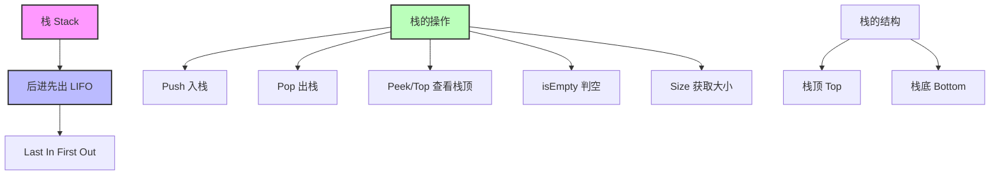
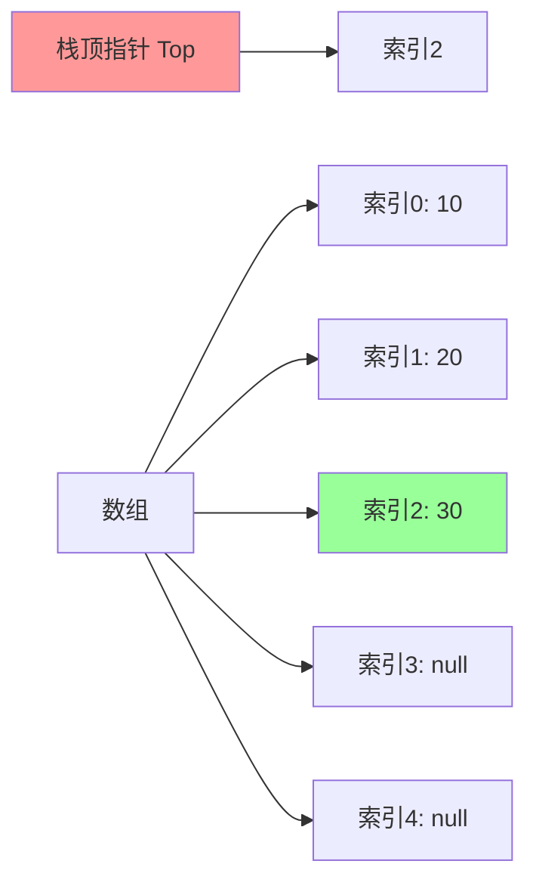
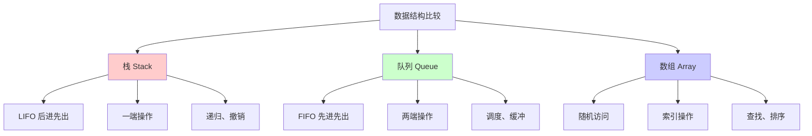

## 🎯 什么是栈？

### 概念图解


### 生活中的例子
栈就像现实生活中的许多场景，都遵循"后进先出"的原则：

```
📚 书本堆叠
┌─────────────┐
│    书本3     │ ← 最后放上去的，最先拿走
├─────────────┤
│    书本2     │
├─────────────┤
│    书本1     │ ← 最先放的，最后拿走
└─────────────┘

🍽️ 餐具叠放
   ╭─────╮
   │ 盘子 │ ← Top (栈顶)
   ├─────┤
   │ 盘子 │
   ├─────┤
   │ 盘子 │ ← Bottom (栈底)
   ╰─────╯

🌐 浏览器历史
┌──────────────┐
│   当前页面    │ ← 最新访问
├──────────────┤
│   上一页面    │
├──────────────┤
│   首页面      │ ← 最早访问
└──────────────┘
```

### 问题背景
在程序中，我们经常遇到需要"撤销"操作、函数调用、表达式计算等场景：

- **文本编辑器的撤销功能**：Ctrl+Z 需要按照操作的逆序进行撤销
- **函数调用栈**：函数A调用函数B，函数B调用函数C，返回时按C→B→A的顺序
- **表达式求值**：计算 `(3 + 4) * (5 - 2)` 需要先处理括号内的内容
- **程序执行的内存管理**：局部变量的分配和释放

## 🏗️ 栈的内部结构

### ASCII艺术图
```
栈的操作过程演示：

初始状态 (空栈)
┌─────┐
│     │
│     │ ← Top = -1
│     │
│     │
└─────┘

Push(10)
┌─────┐
│     │
│     │
│     │
│ 10  │ ← Top = 0
└─────┘

Push(20)
┌─────┐
│     │
│     │
│ 20  │ ← Top = 1
│ 10  │
└─────┘

Push(30)
┌─────┐
│     │
│ 30  │ ← Top = 2
│ 20  │
│ 10  │
└─────┘

Pop() → 返回30
┌─────┐
│     │
│     │
│ 20  │ ← Top = 1
│ 10  │
└─────┘
```

### 内存布局


## 🔧 栈的基本操作

### 核心操作说明

| 操作 | 描述 | 时间复杂度 | 空间复杂度 |
|------|------|-----------|-----------|
| `push(item)` | 将元素压入栈顶 | O(1) | O(1) |
| `pop()` | 弹出并返回栈顶元素 | O(1) | O(1) |
| `peek()/top()` | 查看栈顶元素但不弹出 | O(1) | O(1) |
| `isEmpty()` | 判断栈是否为空 | O(1) | O(1) |
| `size()` | 获取栈中元素个数 | O(1) | O(1) |

## 💻 数组实现栈

### 完整Java实现
```java
/**
 * 基于数组的栈实现
 * 优点：内存连续，访问速度快
 * 缺点：容量固定，可能浪费内存或需要扩容
 */
public class ArrayStack<T> {
    private T[] array;          // 存储栈元素的数组
    private int top;            // 栈顶指针
    private int capacity;       // 栈的容量

    // 默认容量
    private static final int DEFAULT_CAPACITY = 10;

    /**
     * 构造函数 - 使用默认容量
     */
    @SuppressWarnings("unchecked")
    public ArrayStack() {
        this(DEFAULT_CAPACITY);
    }

    /**
     * 构造函数 - 指定容量
     */
    @SuppressWarnings("unchecked")
    public ArrayStack(int capacity) {
        if (capacity <= 0) {
            throw new IllegalArgumentException("容量必须大于0");
        }
        this.capacity = capacity;
        this.array = (T[]) new Object[capacity];
        this.top = -1;  // -1表示空栈
    }

    /**
     * 入栈操作
     * @param item 要入栈的元素
     * @throws StackOverflowError 当栈满时抛出异常
     */
    public void push(T item) {
        // 检查栈溢出
        if (isFull()) {
            throw new StackOverflowError("栈已满，无法添加元素: " + item);
        }

        // 栈顶指针先增加，然后存放元素
        array[++top] = item;

        System.out.println("✅ 入栈成功: " + item + ", 当前栈大小: " + size());
    }

    /**
     * 出栈操作
     * @return 栈顶元素
     * @throws EmptyStackException 当栈空时抛出异常
     */
    public T pop() {
        // 检查栈下溢
        if (isEmpty()) {
            throw new EmptyStackException("栈为空，无法弹出元素");
        }

        // 获取栈顶元素
        T item = array[top];

        // 清空引用，帮助垃圾回收
        array[top] = null;

        // 栈顶指针减少
        top--;

        System.out.println("⬆️ 出栈成功: " + item + ", 当前栈大小: " + size());
        return item;
    }

    /**
     * 查看栈顶元素但不弹出
     * @return 栈顶元素
     * @throws EmptyStackException 当栈空时抛出异常
     */
    public T peek() {
        if (isEmpty()) {
            throw new EmptyStackException("栈为空，无法查看栈顶元素");
        }
        return array[top];
    }

    /**
     * 判断栈是否为空
     * @return true if栈为空，false otherwise
     */
    public boolean isEmpty() {
        return top == -1;
    }

    /**
     * 判断栈是否已满
     * @return true if栈已满，false otherwise
     */
    public boolean isFull() {
        return top == capacity - 1;
    }

    /**
     * 获取栈中元素个数
     * @return 栈的大小
     */
    public int size() {
        return top + 1;
    }

    /**
     * 获取栈的容量
     * @return 栈的最大容量
     */
    public int getCapacity() {
        return capacity;
    }

    /**
     * 清空栈
     */
    public void clear() {
        // 清空所有引用
        for (int i = 0; i <= top; i++) {
            array[i] = null;
        }
        top = -1;
        System.out.println("🧹 栈已清空");
    }

    /**
     * 打印栈的内容（从栈顶到栈底）
     */
    public void display() {
        if (isEmpty()) {
            System.out.println("📭 栈为空");
            return;
        }

        System.out.println("📚 栈内容 (从栈顶到栈底):");
        for (int i = top; i >= 0; i--) {
            if (i == top) {
                System.out.println("🔝 [" + i + "] " + array[i] + " ← 栈顶");
            } else {
                System.out.println("   [" + i + "] " + array[i]);
            }
        }
        System.out.println("   ------------------------");
    }

    /**
     * 自定义异常类 - 空栈异常
     */
    public static class EmptyStackException extends RuntimeException {
        public EmptyStackException(String message) {
            super(message);
        }
    }
}
```

### 动态扩容版本
```java
/**
 * 支持动态扩容的数组栈
 */
public class DynamicArrayStack<T> {
    private T[] array;
    private int top;
    private int capacity;

    @SuppressWarnings("unchecked")
    public DynamicArrayStack() {
        this.capacity = 10;
        this.array = (T[]) new Object[capacity];
        this.top = -1;
    }

    /**
     * 自动扩容的入栈操作
     */
    public void push(T item) {
        // 检查是否需要扩容
        if (isFull()) {
            resize();
        }

        array[++top] = item;
        System.out.println("✅ 入栈: " + item + " (容量: " + capacity + ")");
    }

    /**
     * 扩容操作 - 容量翻倍
     */
    @SuppressWarnings("unchecked")
    private void resize() {
        int newCapacity = capacity * 2;
        T[] newArray = (T[]) new Object[newCapacity];

        // 复制原数组内容
        System.arraycopy(array, 0, newArray, 0, capacity);

        array = newArray;
        capacity = newCapacity;

        System.out.println("🔄 栈扩容完成，新容量: " + capacity);
    }

    // 其他方法与ArrayStack相同...
    public T pop() { /* 实现同上 */ return null; }
    public T peek() { /* 实现同上 */ return null; }
    public boolean isEmpty() { return top == -1; }
    public boolean isFull() { return top == capacity - 1; }
    public int size() { return top + 1; }
}
```

## 🔗 链表实现栈

### 完整Java实现
```java
/**
 * 基于链表的栈实现
 * 优点：动态大小，不需要预先分配内存
 * 缺点：额外的指针开销，内存不连续
 */
public class LinkedStack<T> {

    /**
     * 节点类 - 栈中的每个元素
     */
    private static class Node<T> {
        T data;          // 存储的数据
        Node<T> next;    // 指向下一个节点的指针

        public Node(T data) {
            this.data = data;
            this.next = null;
        }

        public Node(T data, Node<T> next) {
            this.data = data;
            this.next = next;
        }
    }

    private Node<T> top;    // 栈顶指针
    private int size;       // 栈的大小

    /**
     * 构造函数 - 创建空栈
     */
    public LinkedStack() {
        this.top = null;
        this.size = 0;
    }

    /**
     * 入栈操作
     * @param item 要入栈的元素
     */
    public void push(T item) {
        // 创建新节点，新节点的next指向原来的栈顶
        Node<T> newNode = new Node<>(item, top);

        // 更新栈顶指针
        top = newNode;

        // 更新大小
        size++;

        System.out.println("✅ 入栈成功: " + item + ", 当前栈大小: " + size);
    }

    /**
     * 出栈操作
     * @return 栈顶元素
     * @throws EmptyStackException 当栈空时抛出异常
     */
    public T pop() {
        if (isEmpty()) {
            throw new EmptyStackException("栈为空，无法弹出元素");
        }

        // 获取栈顶元素
        T item = top.data;

        // 更新栈顶指针到下一个节点
        top = top.next;

        // 更新大小
        size--;

        System.out.println("⬆️ 出栈成功: " + item + ", 当前栈大小: " + size);
        return item;
    }

    /**
     * 查看栈顶元素但不弹出
     * @return 栈顶元素
     * @throws EmptyStackException 当栈空时抛出异常
     */
    public T peek() {
        if (isEmpty()) {
            throw new EmptyStackException("栈为空，无法查看栈顶元素");
        }
        return top.data;
    }

    /**
     * 判断栈是否为空
     * @return true if栈为空，false otherwise
     */
    public boolean isEmpty() {
        return top == null;
    }

    /**
     * 获取栈中元素个数
     * @return 栈的大小
     */
    public int size() {
        return size;
    }

    /**
     * 清空栈
     */
    public void clear() {
        top = null;
        size = 0;
        System.out.println("🧹 栈已清空");
    }

    /**
     * 打印栈的内容（从栈顶到栈底）
     */
    public void display() {
        if (isEmpty()) {
            System.out.println("📭 栈为空");
            return;
        }

        System.out.println("🔗 栈内容 (从栈顶到栈底):");
        Node<T> current = top;
        int index = size - 1;

        while (current != null) {
            if (current == top) {
                System.out.println("🔝 [" + index + "] " + current.data + " ← 栈顶");
            } else {
                System.out.println("   [" + index + "] " + current.data);
            }
            current = current.next;
            index--;
        }
        System.out.println("   ------------------------");
    }

    /**
     * 获取栈的字符串表示
     */
    @Override
    public String toString() {
        if (isEmpty()) {
            return "[]";
        }

        StringBuilder sb = new StringBuilder();
        sb.append("[");

        Node<T> current = top;
        while (current != null) {
            sb.append(current.data);
            if (current.next != null) {
                sb.append(", ");
            }
            current = current.next;
        }

        sb.append("]");
        return sb.toString();
    }

    /**
     * 自定义异常类
     */
    public static class EmptyStackException extends RuntimeException {
        public EmptyStackException(String message) {
            super(message);
        }
    }
}
```

## 🎨 栈的经典应用

### 1. 括号匹配检查
```java
/**
 * 括号匹配检查器
 * 支持: (), [], {}
 */
public class BracketMatcher {

    /**
     * 检查括号是否匹配
     * @param expression 包含括号的表达式
     * @return true if括号匹配，false otherwise
     */
    public static boolean isBalanced(String expression) {
        ArrayStack<Character> stack = new ArrayStack<>(expression.length());

        System.out.println("🔍 检查表达式: " + expression);

        for (int i = 0; i < expression.length(); i++) {
            char ch = expression.charAt(i);

            // 遇到开括号，入栈
            if (isOpenBracket(ch)) {
                stack.push(ch);
                System.out.println("  📥 发现开括号 '" + ch + "' 入栈");
            }
            // 遇到闭括号，检查匹配
            else if (isCloseBracket(ch)) {
                System.out.println("  📤 发现闭括号 '" + ch + "'");

                if (stack.isEmpty()) {
                    System.out.println("  ❌ 错误：没有对应的开括号");
                    return false;
                }

                char openBracket = stack.pop();
                if (!isMatchingPair(openBracket, ch)) {
                    System.out.println("  ❌ 错误：'" + openBracket + "' 与 '" + ch + "' 不匹配");
                    return false;
                }

                System.out.println("  ✅ 匹配成功：'" + openBracket + "' 与 '" + ch + "'");
            }
        }

        // 检查是否还有未匹配的开括号
        boolean result = stack.isEmpty();
        if (result) {
            System.out.println("🎉 所有括号匹配正确！");
        } else {
            System.out.println("❌ 错误：还有 " + stack.size() + " 个未匹配的开括号");
        }

        return result;
    }

    private static boolean isOpenBracket(char ch) {
        return ch == '(' || ch == '[' || ch == '{';
    }

    private static boolean isCloseBracket(char ch) {
        return ch == ')' || ch == ']' || ch == '}';
    }

    private static boolean isMatchingPair(char open, char close) {
        return (open == '(' && close == ')') ||
               (open == '[' && close == ']') ||
               (open == '{' && close == '}');
    }

    // 测试方法
    public static void testBracketMatching() {
        String[] testCases = {
            "()",           // ✅ 正确
            "()[]{}",       // ✅ 正确
            "([{}])",       // ✅ 正确
            "((()))",       // ✅ 正确
            "([)]",         // ❌ 错误
            "(((",          // ❌ 错误
            ")))",          // ❌ 错误
            "{[}]",         // ❌ 错误
            ""              // ✅ 正确（空字符串）
        };

        for (String testCase : testCases) {
            System.out.println("\n" + "=".repeat(50));
            boolean result = isBalanced(testCase);
            System.out.println("结果: " + (result ? "✅ 匹配" : "❌ 不匹配"));
        }
    }
}
```

### 2. 表达式求值（中缀转后缀）
```java
/**
 * 表达式求值器 - 中缀转后缀算法
 * 支持: +, -, *, /, (, )
 */
public class ExpressionEvaluator {

    /**
     * 将中缀表达式转换为后缀表达式
     * @param infix 中缀表达式，如 "3 + 4 * 2"
     * @return 后缀表达式，如 "3 4 2 * +"
     */
    public static String infixToPostfix(String infix) {
        ArrayStack<Character> operatorStack = new ArrayStack<>();
        StringBuilder postfix = new StringBuilder();

        System.out.println("🔄 转换中缀表达式: " + infix);

        for (int i = 0; i < infix.length(); i++) {
            char ch = infix.charAt(i);

            // 跳过空格
            if (ch == ' ') continue;

            // 操作数直接输出
            if (Character.isDigit(ch)) {
                postfix.append(ch).append(' ');
                System.out.println("  📝 输出操作数: " + ch);
            }
            // 左括号入栈
            else if (ch == '(') {
                operatorStack.push(ch);
                System.out.println("  📥 左括号入栈");
            }
            // 右括号：弹出直到左括号
            else if (ch == ')') {
                System.out.println("  📤 处理右括号");
                while (!operatorStack.isEmpty() && operatorStack.peek() != '(') {
                    char op = operatorStack.pop();
                    postfix.append(op).append(' ');
                    System.out.println("    📝 输出操作符: " + op);
                }
                if (!operatorStack.isEmpty()) {
                    operatorStack.pop(); // 弹出左括号
                    System.out.println("    🗑️ 弹出左括号");
                }
            }
            // 操作符
            else if (isOperator(ch)) {
                System.out.println("  🔧 处理操作符: " + ch);

                // 弹出优先级大于等于当前操作符的操作符
                while (!operatorStack.isEmpty() &&
                       operatorStack.peek() != '(' &&
                       getPrecedence(operatorStack.peek()) >= getPrecedence(ch)) {
                    char op = operatorStack.pop();
                    postfix.append(op).append(' ');
                    System.out.println("    📝 输出高优先级操作符: " + op);
                }

                operatorStack.push(ch);
                System.out.println("    📥 操作符入栈: " + ch);
            }
        }

        // 弹出剩余操作符
        System.out.println("  🔚 处理剩余操作符");
        while (!operatorStack.isEmpty()) {
            char op = operatorStack.pop();
            postfix.append(op).append(' ');
            System.out.println("    📝 输出操作符: " + op);
        }

        String result = postfix.toString().trim();
        System.out.println("✅ 后缀表达式: " + result);
        return result;
    }

    /**
     * 计算后缀表达式的值
     * @param postfix 后缀表达式
     * @return 计算结果
     */
    public static double evaluatePostfix(String postfix) {
        ArrayStack<Double> operandStack = new ArrayStack<>();
        String[] tokens = postfix.split(" ");

        System.out.println("🧮 计算后缀表达式: " + postfix);

        for (String token : tokens) {
            if (token.isEmpty()) continue;

            // 操作数入栈
            if (Character.isDigit(token.charAt(0))) {
                double operand = Double.parseDouble(token);
                operandStack.push(operand);
                System.out.println("  📥 操作数入栈: " + operand);
            }
            // 操作符：弹出两个操作数计算
            else if (isOperator(token.charAt(0))) {
                if (operandStack.size() < 2) {
                    throw new IllegalArgumentException("表达式格式错误");
                }

                double operand2 = operandStack.pop();
                double operand1 = operandStack.pop();
                double result = applyOperator(operand1, operand2, token.charAt(0));

                operandStack.push(result);
                System.out.println("  🧮 计算: " + operand1 + " " + token + " " + operand2 + " = " + result);
            }
        }

        if (operandStack.size() != 1) {
            throw new IllegalArgumentException("表达式格式错误");
        }

        double finalResult = operandStack.pop();
        System.out.println("🎯 最终结果: " + finalResult);
        return finalResult;
    }

    /**
     * 直接计算中缀表达式
     */
    public static double evaluate(String infix) {
        System.out.println("\n" + "=".repeat(50));
        System.out.println("📊 计算表达式: " + infix);
        String postfix = infixToPostfix(infix);
        return evaluatePostfix(postfix);
    }

    // 辅助方法
    private static boolean isOperator(char ch) {
        return ch == '+' || ch == '-' || ch == '*' || ch == '/';
    }

    private static int getPrecedence(char operator) {
        switch (operator) {
            case '+':
            case '-':
                return 1;
            case '*':
            case '/':
                return 2;
            default:
                return 0;
        }
    }

    private static double applyOperator(double operand1, double operand2, char operator) {
        switch (operator) {
            case '+': return operand1 + operand2;
            case '-': return operand1 - operand2;
            case '*': return operand1 * operand2;
            case '/':
                if (operand2 == 0) {
                    throw new ArithmeticException("除零错误");
                }
                return operand1 / operand2;
            default:
                throw new IllegalArgumentException("未知操作符: " + operator);
        }
    }

    // 测试方法
    public static void testExpressionEvaluation() {
        String[] expressions = {
            "3 + 4",                    // 7
            "3 + 4 * 2",               // 11
            "(3 + 4) * 2",             // 14
            "3 * (4 + 2)",             // 18
            "3 + 4 * 2 - 1",           // 10
            "(3 + 4) * (5 - 2)",       // 21
            "2 * 3 + 4 * 5",           // 26
            "(2 + 3) * (4 + 5)",       // 45
        };

        for (String expr : expressions) {
            try {
                double result = evaluate(expr);
                System.out.println("🎉 " + expr + " = " + result);
            } catch (Exception e) {
                System.out.println("❌ 错误: " + e.getMessage());
            }
            System.out.println();
        }
    }
}
```

### 3. 函数调用栈模拟
```java
/**
 * 函数调用栈模拟器
 * 演示递归调用过程
 */
public class CallStackSimulator {

    // 模拟函数调用信息
    static class FunctionCall {
        String functionName;
        String parameters;
        String localVariables;
        int lineNumber;

        public FunctionCall(String functionName, String parameters, String localVariables, int lineNumber) {
            this.functionName = functionName;
            this.parameters = parameters;
            this.localVariables = localVariables;
            this.lineNumber = lineNumber;
        }

        @Override
        public String toString() {
            return functionName + "(" + parameters + ") | 局部变量: " + localVariables + " | 行号: " + lineNumber;
        }
    }

    private static LinkedStack<FunctionCall> callStack = new LinkedStack<>();

    /**
     * 模拟函数调用
     */
    public static void callFunction(String functionName, String parameters, String localVariables, int lineNumber) {
        FunctionCall call = new FunctionCall(functionName, parameters, localVariables, lineNumber);
        callStack.push(call);

        System.out.println("📞 函数调用: " + functionName + "(" + parameters + ")");
        System.out.println("   栈深度: " + callStack.size());
        displayCallStack();
    }

    /**
     * 模拟函数返回
     */
    public static void returnFromFunction() {
        if (!callStack.isEmpty()) {
            FunctionCall call = callStack.pop();
            System.out.println("🔙 函数返回: " + call.functionName);
            System.out.println("   栈深度: " + callStack.size());
            displayCallStack();
        }
    }

    /**
     * 显示当前调用栈
     */
    public static void displayCallStack() {
        System.out.println("📚 当前调用栈:");
        if (callStack.isEmpty()) {
            System.out.println("   (空)");
        } else {
            System.out.println("   " + callStack.toString().replace("[", "").replace("]", ""));
        }
        System.out.println("   " + "-".repeat(50));
    }

    /**
     * 模拟计算阶乘的递归过程
     */
    public static int factorial(int n) {
        // 函数入口
        callFunction("factorial", "n=" + n, "result", 1);

        int result;
        if (n <= 1) {
            result = 1;
            System.out.println("   💡 基础情况: factorial(" + n + ") = 1");
        } else {
            System.out.println("   🔄 递归调用: factorial(" + (n-1) + ")");
            int subResult = factorial(n - 1);
            result = n * subResult;
            System.out.println("   🧮 计算: " + n + " * " + subResult + " = " + result);
        }

        // 函数返回
        returnFromFunction();
        return result;
    }

    /**
     * 测试调用栈
     */
    public static void testCallStack() {
        System.out.println("🎯 测试函数调用栈 - 计算 factorial(5)");
        System.out.println("=".repeat(60));

        int result = factorial(5);

        System.out.println("=".repeat(60));
        System.out.println("🎉 最终结果: factorial(5) = " + result);
    }
}
```

### 4. 浏览器历史记录
```java
/**
 * 浏览器历史记录管理器
 * 模拟浏览器的前进后退功能
 */
public class BrowserHistory {
    private LinkedStack<String> backStack;    // 后退栈
    private LinkedStack<String> forwardStack; // 前进栈
    private String currentPage;               // 当前页面

    public BrowserHistory() {
        this.backStack = new LinkedStack<>();
        this.forwardStack = new LinkedStack<>();
        this.currentPage = null;
    }

    /**
     * 访问新页面
     */
    public void visit(String url) {
        // 如果有当前页面，将其加入后退栈
        if (currentPage != null) {
            backStack.push(currentPage);
        }

        // 清空前进栈（新的访问会清除前进历史）
        forwardStack.clear();

        // 设置新的当前页面
        currentPage = url;

        System.out.println("🌐 访问页面: " + url);
        displayStatus();
    }

    /**
     * 后退操作
     */
    public String back() {
        if (backStack.isEmpty()) {
            System.out.println("❌ 无法后退，没有历史记录");
            return currentPage;
        }

        // 当前页面加入前进栈
        forwardStack.push(currentPage);

        // 从后退栈取出页面作为当前页面
        currentPage = backStack.pop();

        System.out.println("⬅️ 后退到: " + currentPage);
        displayStatus();
        return currentPage;
    }

    /**
     * 前进操作
     */
    public String forward() {
        if (forwardStack.isEmpty()) {
            System.out.println("❌ 无法前进，没有前进历史");
            return currentPage;
        }

        // 当前页面加入后退栈
        backStack.push(currentPage);

        // 从前进栈取出页面作为当前页面
        currentPage = forwardStack.pop();

        System.out.println("➡️ 前进到: " + currentPage);
        displayStatus();
        return currentPage;
    }

    /**
     * 获取当前页面
     */
    public String getCurrentPage() {
        return currentPage;
    }

    /**
     * 显示浏览器状态
     */
    public void displayStatus() {
        System.out.println("📊 浏览器状态:");
        System.out.println("   当前页面: " + (currentPage != null ? currentPage : "无"));
        System.out.println("   可后退: " + !backStack.isEmpty() + " (共" + backStack.size() + "页)");
        System.out.println("   可前进: " + !forwardStack.isEmpty() + " (共" + forwardStack.size() + "页)");

        if (!backStack.isEmpty()) {
            System.out.println("   后退历史: " + backStack.toString());
        }
        if (!forwardStack.isEmpty()) {
            System.out.println("   前进历史: " + forwardStack.toString());
        }
        System.out.println("   " + "-".repeat(40));
    }

    /**
     * 测试浏览器历史功能
     */
    public static void testBrowserHistory() {
        System.out.println("🌐 测试浏览器历史记录功能");
        System.out.println("=".repeat(50));

        BrowserHistory browser = new BrowserHistory();

        // 访问一系列页面
        browser.visit("https://www.google.com");
        browser.visit("https://www.github.com");
        browser.visit("https://www.stackoverflow.com");
        browser.visit("https://www.leetcode.com");

        System.out.println("\n🔄 开始后退操作:");
        browser.back();  // 回到 stackoverflow
        browser.back();  // 回到 github

        System.out.println("\n➡️ 开始前进操作:");
        browser.forward(); // 前进到 stackoverflow

        System.out.println("\n🆕 访问新页面（会清除前进历史）:");
        browser.visit("https://www.baidu.com");

        System.out.println("\n❌ 尝试前进（应该失败）:");
        browser.forward();

        System.out.println("\n⬅️ 继续后退:");
        browser.back();  // 回到 stackoverflow
        browser.back();  // 回到 github
        browser.back();  // 回到 google
        browser.back();  // 尝试再后退（应该失败）
    }
}
```

## ⚡ 性能分析与比较

### 时间复杂度对比
```mermaid
graph TD
    A[栈操作复杂度] --> B[数组实现]
    A --> C[链表实现]

    B --> D[Push: O(1)*]
    B --> E[Pop: O(1)]
    B --> F[Peek: O(1)]
    B --> G[Size: O(1)]

    C --> H[Push: O(1)]
    C --> I[Pop: O(1)]
    C --> J[Peek: O(1)]
    C --> K[Size: O(1)]

    style D fill:#ffcccc
    style H fill:#ccffcc
```

*注：数组实现在需要扩容时为O(n)

### 空间复杂度分析
| 实现方式 | 空间开销 | 优缺点 |
|---------|---------|--------|
| **数组实现** | O(n) | ✅ 内存连续，缓存友好<br>❌ 可能浪费空间 |
| **链表实现** | O(n) + 指针开销 | ✅ 动态分配，节省空间<br>❌ 指针额外开销 |

### 性能测试代码
```java
/**
 * 栈性能测试
 */
public class StackPerformanceTest {

    public static void performanceComparison() {
        final int OPERATIONS = 1000000;

        System.out.println("🏁 栈性能测试 - " + OPERATIONS + " 次操作");
        System.out.println("=".repeat(60));

        // 测试数组栈
        testArrayStack(OPERATIONS);

        // 测试链表栈
        testLinkedStack(OPERATIONS);

        // 测试动态数组栈
        testDynamicArrayStack(OPERATIONS);
    }

    private static void testArrayStack(int operations) {
        System.out.println("📊 测试数组栈:");

        long startTime = System.nanoTime();
        ArrayStack<Integer> stack = new ArrayStack<>(operations);

        // 入栈操作
        for (int i = 0; i < operations; i++) {
            stack.push(i);
        }

        // 出栈操作
        for (int i = 0; i < operations; i++) {
            stack.pop();
        }

        long endTime = System.nanoTime();
        double duration = (endTime - startTime) / 1_000_000.0;

        System.out.println("   ⏱️ 耗时: " + String.format("%.2f", duration) + " 毫秒");
        System.out.println("   💾 内存使用: 连续数组");
    }

    private static void testLinkedStack(int operations) {
        System.out.println("📊 测试链表栈:");

        long startTime = System.nanoTime();
        LinkedStack<Integer> stack = new LinkedStack<>();

        // 入栈操作
        for (int i = 0; i < operations; i++) {
            stack.push(i);
        }

        // 出栈操作
        for (int i = 0; i < operations; i++) {
            stack.pop();
        }

        long endTime = System.nanoTime();
        double duration = (endTime - startTime) / 1_000_000.0;

        System.out.println("   ⏱️ 耗时: " + String.format("%.2f", duration) + " 毫秒");
        System.out.println("   💾 内存使用: 动态分配 + 指针开销");
    }

    private static void testDynamicArrayStack(int operations) {
        System.out.println("📊 测试动态数组栈:");

        long startTime = System.nanoTime();
        DynamicArrayStack<Integer> stack = new DynamicArrayStack<>();

        // 入栈操作
        for (int i = 0; i < operations; i++) {
            stack.push(i);
        }

        // 出栈操作
        for (int i = 0; i < operations; i++) {
            stack.pop();
        }

        long endTime = System.nanoTime();
        double duration = (endTime - startTime) / 1_000_000.0;

        System.out.println("   ⏱️ 耗时: " + String.format("%.2f", duration) + " 毫秒");
        System.out.println("   💾 内存使用: 动态数组 + 扩容开销");
    }
}
```

## 🛡️ 异常处理

### 栈溢出和下溢处理
```java
/**
 * 栈异常处理演示
 */
public class StackExceptionDemo {

    public static void demonstrateStackOverflow() {
        System.out.println("💥 演示栈溢出 (Stack Overflow):");

        ArrayStack<String> stack = new ArrayStack<>(3); // 小容量栈

        try {
            stack.push("元素1");
            stack.push("元素2");
            stack.push("元素3");
            System.out.println("✅ 栈已满");

            // 尝试再次入栈，将导致溢出
            stack.push("元素4");
        } catch (StackOverflowError e) {
            System.out.println("❌ 捕获异常: " + e.getMessage());
        }
    }

    public static void demonstrateStackUnderflow() {
        System.out.println("\n💥 演示栈下溢 (Stack Underflow):");

        ArrayStack<String> stack = new ArrayStack<>();

        try {
            // 尝试从空栈弹出元素
            stack.pop();
        } catch (ArrayStack.EmptyStackException e) {
            System.out.println("❌ 捕获异常: " + e.getMessage());
        }

        try {
            // 尝试查看空栈顶部
            stack.peek();
        } catch (ArrayStack.EmptyStackException e) {
            System.out.println("❌ 捕获异常: " + e.getMessage());
        }
    }

    public static void safeStackOperations() {
        System.out.println("\n🛡️ 安全的栈操作:");

        ArrayStack<Integer> stack = new ArrayStack<>(5);

        // 安全入栈
        for (int i = 1; i <= 7; i++) {
            if (!stack.isFull()) {
                stack.push(i);
            } else {
                System.out.println("⚠️ 栈已满，无法添加元素 " + i);
            }
        }

        // 安全出栈
        while (!stack.isEmpty()) {
            Integer element = stack.pop();
            System.out.println("✅ 安全弹出: " + element);
        }

        // 尝试从空栈弹出
        if (!stack.isEmpty()) {
            stack.pop();
        } else {
            System.out.println("⚠️ 栈为空，无法弹出元素");
        }
    }
}
```

## 🔍 与其他数据结构的比较

### 栈 vs 队列 vs 数组


| 特性 | 栈 | 队列 | 数组 |
|------|----|----|------|
| **访问方式** | 只能访问栈顶 | 只能访问队首和队尾 | 可随机访问任意位置 |
| **插入位置** | 栈顶 | 队尾 | 任意位置 |
| **删除位置** | 栈顶 | 队首 | 任意位置 |
| **时间复杂度** | O(1) | O(1) | O(1)查找，O(n)插入删除 |
| **适用场景** | 递归、撤销、括号匹配 | 任务调度、BFS | 查找、排序、随机访问 |

## 🎯 实战练习题

### 练习1：最小栈设计
```java
/**
 * 练习：设计一个支持获取最小值的栈
 * 要求：push、pop、top、getMin 操作的时间复杂度都是 O(1)
 */
public class MinStack {
    private LinkedStack<Integer> dataStack;    // 存储数据
    private LinkedStack<Integer> minStack;     // 存储最小值

    public MinStack() {
        dataStack = new LinkedStack<>();
        minStack = new LinkedStack<>();
    }

    /**
     * 入栈操作
     */
    public void push(int val) {
        dataStack.push(val);

        // 如果最小值栈为空，或者新值小于等于当前最小值，则同时入最小值栈
        if (minStack.isEmpty() || val <= minStack.peek()) {
            minStack.push(val);
        }

        System.out.println("✅ 入栈: " + val + ", 当前最小值: " + getMin());
    }

    /**
     * 出栈操作
     */
    public void pop() {
        if (dataStack.isEmpty()) {
            throw new RuntimeException("栈为空");
        }

        int val = dataStack.pop();

        // 如果弹出的值等于当前最小值，同时弹出最小值栈
        if (!minStack.isEmpty() && val == minStack.peek()) {
            minStack.pop();
        }

        System.out.println("⬆️ 出栈: " + val +
                          (minStack.isEmpty() ? ", 栈为空" : ", 当前最小值: " + getMin()));
    }

    /**
     * 获取栈顶元素
     */
    public int top() {
        if (dataStack.isEmpty()) {
            throw new RuntimeException("栈为空");
        }
        return dataStack.peek();
    }

    /**
     * 获取栈中最小值
     */
    public int getMin() {
        if (minStack.isEmpty()) {
            throw new RuntimeException("栈为空");
        }
        return minStack.peek();
    }

    /**
     * 测试最小栈
     */
    public static void testMinStack() {
        System.out.println("🎯 测试最小栈");
        System.out.println("=".repeat(40));

        MinStack minStack = new MinStack();

        minStack.push(3);    // 最小值: 3
        minStack.push(5);    // 最小值: 3
        minStack.push(2);    // 最小值: 2
        minStack.push(1);    // 最小值: 1
        minStack.push(4);    // 最小值: 1

        System.out.println("\n开始弹出操作:");
        minStack.pop();      // 弹出4, 最小值: 1
        minStack.pop();      // 弹出1, 最小值: 2
        minStack.pop();      // 弹出2, 最小值: 3

        System.out.println("\n栈顶元素: " + minStack.top());      // 5
        System.out.println("最小值: " + minStack.getMin());       // 3
    }
}
```

### 练习2：有效的括号序列
```java
/**
 * 练习：给定一个只包括 '('，')'，'{'，'}'，'['，']' 的字符串，判断字符串是否有效
 */
public class ValidParentheses {

    public static boolean isValid(String s) {
        if (s == null || s.length() % 2 != 0) {
            return false;
        }

        LinkedStack<Character> stack = new LinkedStack<>();

        for (char c : s.toCharArray()) {
            // 开括号入栈
            if (c == '(' || c == '[' || c == '{') {
                stack.push(c);
            }
            // 闭括号检查匹配
            else if (c == ')' || c == ']' || c == '}') {
                if (stack.isEmpty()) {
                    return false;
                }

                char open = stack.pop();
                if (!isMatching(open, c)) {
                    return false;
                }
            }
        }

        return stack.isEmpty();
    }

    private static boolean isMatching(char open, char close) {
        return (open == '(' && close == ')') ||
               (open == '[' && close == ']') ||
               (open == '{' && close == '}');
    }

    public static void testValidParentheses() {
        String[] testCases = {
            "()",           // true
            "()[]{}",       // true
            "(]",           // false
            "([)]",         // false
            "{[]}",         // true
            "",             // true
            "(((",          // false
            ")))",          // false
        };

        System.out.println("🎯 测试有效括号序列");
        System.out.println("=".repeat(40));

        for (String test : testCases) {
            boolean result = isValid(test);
            System.out.println("\"" + test + "\" → " + (result ? "✅ 有效" : "❌ 无效"));
        }
    }
}
```

## 🎓 总结

栈是一种优雅而强大的数据结构，它的"后进先出"特性使其在许多算法和应用中发挥着重要作用：

### 🔑 核心特点
- **LIFO原则**：后进先出，只能在栈顶进行操作
- **操作简单**：只有push、pop、peek等基本操作
- **效率高**：所有基本操作都是O(1)时间复杂度
- **内存友好**：数组实现内存连续，链表实现动态分配

### 🎯 应用场景
- **程序执行**：函数调用栈、递归处理
- **表达式处理**：中缀转后缀、括号匹配
- **编辑器功能**：撤销重做、语法检查
- **算法设计**：深度优先搜索、回溯算法

### 💡 实现建议
- **数组实现**：适合已知大小上限的场景，内存效率高
- **链表实现**：适合动态大小的场景，灵活性好
- **安全检查**：始终检查栈空和栈满状态
- **异常处理**：合理处理溢出和下溢异常

栈的美妙之处在于其简洁性和通用性——简单的LIFO原则却能解决复杂的计算问题。掌握栈不仅是理解其他高级数据结构的基础，更是培养程序设计思维的重要一步。

### 🚀 下一步学习
- 深入学习递归和栈的关系
- 了解系统级的调用栈实现
- 学习栈在编译器中的应用
- 探索栈在并发编程中的使用

## 📚 完整测试代码

```java
/**
 * 栈数据结构完整测试程序
 */
public class StackDemo {
    public static void main(String[] args) {
        System.out.println("🎊 栈数据结构完整演示程序");
        System.out.println("=".repeat(60));

        // 1. 基本操作演示
        basicOperationsDemo();

        // 2. 括号匹配测试
        BracketMatcher.testBracketMatching();

        // 3. 表达式求值测试
        ExpressionEvaluator.testExpressionEvaluation();

        // 4. 函数调用栈测试
        CallStackSimulator.testCallStack();

        // 5. 浏览器历史测试
        BrowserHistory.testBrowserHistory();

        // 6. 最小栈测试
        MinStack.testMinStack();

        // 7. 有效括号测试
        ValidParentheses.testValidParentheses();

        // 8. 异常处理演示
        demonstrateExceptions();

        // 9. 性能测试
        StackPerformanceTest.performanceComparison();

        System.out.println("\n🎉 所有测试完成！");
    }

    private static void basicOperationsDemo() {
        System.out.println("\n📋 基本操作演示");
        System.out.println("=".repeat(40));

        // 数组栈演示
        System.out.println("🔸 数组栈演示:");
        ArrayStack<String> arrayStack = new ArrayStack<>(5);
        arrayStack.push("第一个");
        arrayStack.push("第二个");
        arrayStack.push("第三个");
        arrayStack.display();

        String item = arrayStack.pop();
        System.out.println("弹出元素: " + item);
        arrayStack.display();

        // 链表栈演示
        System.out.println("\n🔸 链表栈演示:");
        LinkedStack<Integer> linkedStack = new LinkedStack<>();
        linkedStack.push(10);
        linkedStack.push(20);
        linkedStack.push(30);
        linkedStack.display();

        Integer number = linkedStack.pop();
        System.out.println("弹出元素: " + number);
        linkedStack.display();
    }

    private static void demonstrateExceptions() {
        System.out.println("\n🛡️ 异常处理演示");
        System.out.println("=".repeat(40));

        StackExceptionDemo.demonstrateStackOverflow();
        StackExceptionDemo.demonstrateStackUnderflow();
        StackExceptionDemo.safeStackOperations();
    }
}
```

通过这篇详细的文章，相信你已经全面掌握了栈这一重要的数据结构。从基本概念到实际应用，从简单实现到性能优化，栈的每个方面都值得深入理解和实践。记住：编程不仅仅是写代码，更是一种解决问题的艺术。栈，就是这门艺术中不可或缺的工具之一！