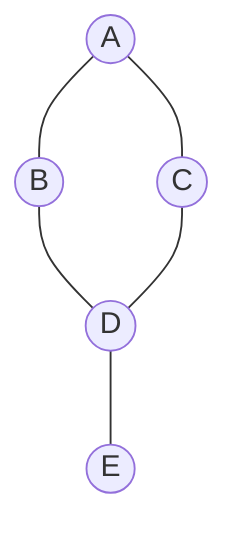
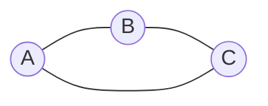
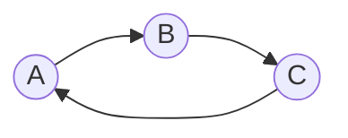
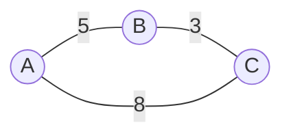
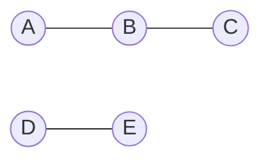
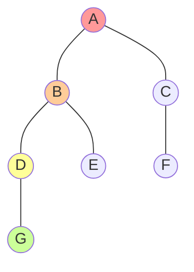
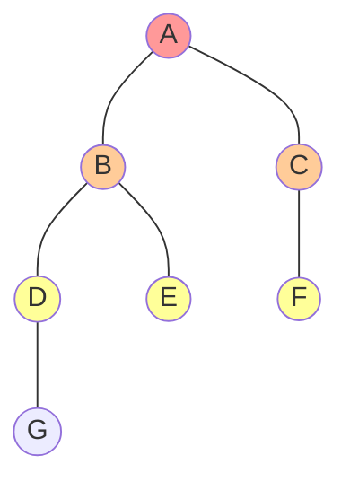

## 引言

在现实世界中，我们经常遇到需要表示复杂关系的情况：社交网络中的好友关系、城市之间的交通网络、网页之间的链接关系、任务之间的依赖关系等。这些复杂的关系网络都可以用一种强大的数据结构来表示——图(Graph)。

图是一种非线性的数据结构，它由顶点(Vertex)和边(Edge)组成，能够有效地表示和处理各种复杂的关系。本文将深入探讨图的概念、表示方法、常见算法以及实际应用。

## 图的基本概念

### 什么是图？

图是由顶点集合V和边集合E组成的数据结构，通常记作G(V,E)。顶点表示实体，边表示实体之间的关系。



### 图的基本术语

1. **顶点(Vertex/Node)**: 图中的基本单位，表示实体
2. **边(Edge)**: 连接两个顶点的线，表示关系
3. **相邻(Adjacent)**: 如果两个顶点之间有边连接，则称它们相邻
4. **度(Degree)**: 与某个顶点相连的边的数量
5. **路径(Path)**: 从一个顶点到另一个顶点经过的顶点序列
6. **环(Cycle)**: 起点和终点相同的路径

## 图的分类

### 1. 有向图与无向图

#### 无向图
在无向图中，边没有方向，表示双向关系。



#### 有向图
在有向图中，边有方向，用箭头表示。



### 2. 加权图与无权图

#### 无权图
边没有权重值，只表示连接关系。

#### 加权图
每条边都有权重值，表示连接的成本、距离等。



### 3. 连通图与非连通图

#### 连通图
任意两个顶点之间都存在路径。

#### 非连通图
存在某些顶点之间没有路径连接。



## 现实生活中的图应用

### 1. 社交网络
- 顶点：用户
- 边：好友关系
- 应用：推荐好友、社区发现

### 2. 交通网络
- 顶点：城市/车站
- 边：道路/航线
- 权重：距离/时间/费用
- 应用：最短路径规划

### 3. 网页链接
- 顶点：网页
- 边：超链接
- 应用：PageRank算法、SEO优化

### 4. 任务依赖
- 顶点：任务
- 边：依赖关系
- 应用：项目调度、编译顺序

## 图的表示方法

### 1. 邻接矩阵(Adjacency Matrix)

使用二维数组表示图，矩阵中的元素表示顶点之间是否有边连接。

#### 优点
- 查询两个顶点是否相邻的时间复杂度为O(1)
- 适合稠密图（边数较多的图）

#### 缺点
- 空间复杂度为O(V²)，对稀疏图浪费空间
- 添加或删除顶点的操作复杂

```java
/**
 * 基于邻接矩阵的图实现
 */
public class GraphMatrix {
    private int vertices;           // 顶点数
    private int[][] adjMatrix;      // 邻接矩阵
    private boolean directed;       // 是否为有向图

    public GraphMatrix(int vertices, boolean directed) {
        this.vertices = vertices;
        this.directed = directed;
        this.adjMatrix = new int[vertices][vertices];
    }

    /**
     * 添加边
     * @param src 源顶点
     * @param dest 目标顶点
     * @param weight 权重（无权图为1）
     */
    public void addEdge(int src, int dest, int weight) {
        if (src >= 0 && src < vertices && dest >= 0 && dest < vertices) {
            adjMatrix[src][dest] = weight;
            // 如果是无向图，需要添加反向边
            if (!directed) {
                adjMatrix[dest][src] = weight;
            }
        }
    }

    /**
     * 删除边
     */
    public void removeEdge(int src, int dest) {
        if (src >= 0 && src < vertices && dest >= 0 && dest < vertices) {
            adjMatrix[src][dest] = 0;
            if (!directed) {
                adjMatrix[dest][src] = 0;
            }
        }
    }

    /**
     * 检查是否存在边
     */
    public boolean hasEdge(int src, int dest) {
        if (src >= 0 && src < vertices && dest >= 0 && dest < vertices) {
            return adjMatrix[src][dest] != 0;
        }
        return false;
    }

    /**
     * 获取顶点的所有邻接顶点
     */
    public List<Integer> getAdjacent(int vertex) {
        List<Integer> adjacent = new ArrayList<>();
        if (vertex >= 0 && vertex < vertices) {
            for (int i = 0; i < vertices; i++) {
                if (adjMatrix[vertex][i] != 0) {
                    adjacent.add(i);
                }
            }
        }
        return adjacent;
    }

    /**
     * 打印邻接矩阵
     */
    public void printMatrix() {
        System.out.println("邻接矩阵:");
        System.out.print("   ");
        for (int i = 0; i < vertices; i++) {
            System.out.printf("%3d", i);
        }
        System.out.println();

        for (int i = 0; i < vertices; i++) {
            System.out.printf("%2d:", i);
            for (int j = 0; j < vertices; j++) {
                System.out.printf("%3d", adjMatrix[i][j]);
            }
            System.out.println();
        }
    }
}
```

### 2. 邻接表(Adjacency List)

使用链表或动态数组来存储每个顶点的邻接顶点。

#### 优点
- 空间效率高，特别适合稀疏图
- 容易遍历顶点的所有邻接顶点

#### 缺点
- 查询两个顶点是否相邻的时间复杂度为O(V)
- 实现稍微复杂

```java
/**
 * 基于邻接表的图实现
 */
public class GraphList {
    private int vertices;                           // 顶点数
    private List<List<Edge>> adjList;              // 邻接表
    private boolean directed;                       // 是否为有向图

    /**
     * 边的内部类
     */
    static class Edge {
        int dest;       // 目标顶点
        int weight;     // 权重

        public Edge(int dest, int weight) {
            this.dest = dest;
            this.weight = weight;
        }

        @Override
        public String toString() {
            return "(" + dest + ", w=" + weight + ")";
        }
    }

    public GraphList(int vertices, boolean directed) {
        this.vertices = vertices;
        this.directed = directed;
        this.adjList = new ArrayList<>(vertices);

        // 初始化邻接表
        for (int i = 0; i < vertices; i++) {
            adjList.add(new ArrayList<>());
        }
    }

    /**
     * 添加边
     */
    public void addEdge(int src, int dest, int weight) {
        if (src >= 0 && src < vertices && dest >= 0 && dest < vertices) {
            adjList.get(src).add(new Edge(dest, weight));
            // 如果是无向图，需要添加反向边
            if (!directed) {
                adjList.get(dest).add(new Edge(src, weight));
            }
        }
    }

    /**
     * 删除边
     */
    public void removeEdge(int src, int dest) {
        if (src >= 0 && src < vertices && dest >= 0 && dest < vertices) {
            adjList.get(src).removeIf(edge -> edge.dest == dest);
            if (!directed) {
                adjList.get(dest).removeIf(edge -> edge.dest == src);
            }
        }
    }

    /**
     * 检查是否存在边
     */
    public boolean hasEdge(int src, int dest) {
        if (src >= 0 && src < vertices && dest >= 0 && dest < vertices) {
            return adjList.get(src).stream().anyMatch(edge -> edge.dest == dest);
        }
        return false;
    }

    /**
     * 获取顶点的所有邻接顶点
     */
    public List<Edge> getAdjacent(int vertex) {
        if (vertex >= 0 && vertex < vertices) {
            return new ArrayList<>(adjList.get(vertex));
        }
        return new ArrayList<>();
    }

    /**
     * 获取顶点的度
     */
    public int getDegree(int vertex) {
        if (vertex >= 0 && vertex < vertices) {
            return adjList.get(vertex).size();
        }
        return 0;
    }

    /**
     * 打印邻接表
     */
    public void printGraph() {
        System.out.println("邻接表表示:");
        for (int i = 0; i < vertices; i++) {
            System.out.print("顶点 " + i + ": ");
            for (Edge edge : adjList.get(i)) {
                System.out.print(edge + " ");
            }
            System.out.println();
        }
    }
}
```

## 图的遍历算法

### 1. 深度优先搜索(DFS - Depth First Search)

DFS从一个顶点开始，尽可能深地搜索图的分支，然后回溯到前一个顶点继续搜索。



#### DFS实现

```java
/**
 * 深度优先搜索实现
 */
public class GraphDFS {
    private GraphList graph;
    private boolean[] visited;
    private List<Integer> dfsResult;

    public GraphDFS(GraphList graph) {
        this.graph = graph;
        this.visited = new boolean[graph.vertices];
        this.dfsResult = new ArrayList<>();
    }

    /**
     * 递归实现DFS
     */
    public List<Integer> dfsRecursive(int startVertex) {
        // 重置访问状态
        Arrays.fill(visited, false);
        dfsResult.clear();

        dfsRecursiveHelper(startVertex);
        return new ArrayList<>(dfsResult);
    }

    private void dfsRecursiveHelper(int vertex) {
        // 标记当前顶点为已访问
        visited[vertex] = true;
        dfsResult.add(vertex);

        System.out.println("访问顶点: " + vertex);

        // 递归访问所有未访问的邻接顶点
        for (GraphList.Edge edge : graph.getAdjacent(vertex)) {
            if (!visited[edge.dest]) {
                dfsRecursiveHelper(edge.dest);
            }
        }
    }

    /**
     * 迭代实现DFS（使用栈）
     */
    public List<Integer> dfsIterative(int startVertex) {
        Arrays.fill(visited, false);
        dfsResult.clear();

        Stack<Integer> stack = new Stack<>();
        stack.push(startVertex);

        while (!stack.isEmpty()) {
            int vertex = stack.pop();

            if (!visited[vertex]) {
                visited[vertex] = true;
                dfsResult.add(vertex);
                System.out.println("访问顶点: " + vertex);

                // 将邻接顶点压入栈（倒序压入以保持访问顺序）
                List<GraphList.Edge> adjacent = graph.getAdjacent(vertex);
                for (int i = adjacent.size() - 1; i >= 0; i--) {
                    GraphList.Edge edge = adjacent.get(i);
                    if (!visited[edge.dest]) {
                        stack.push(edge.dest);
                    }
                }
            }
        }

        return new ArrayList<>(dfsResult);
    }

    /**
     * 检查图是否连通（无向图）
     */
    public boolean isConnected() {
        if (graph.vertices == 0) return true;

        dfsRecursive(0);
        return dfsResult.size() == graph.vertices;
    }

    /**
     * 检测无向图中是否存在环
     */
    public boolean hasCycle() {
        Arrays.fill(visited, false);

        for (int i = 0; i < graph.vertices; i++) {
            if (!visited[i]) {
                if (hasCycleHelper(i, -1)) {
                    return true;
                }
            }
        }
        return false;
    }

    private boolean hasCycleHelper(int vertex, int parent) {
        visited[vertex] = true;

        for (GraphList.Edge edge : graph.getAdjacent(vertex)) {
            int adjacent = edge.dest;

            if (!visited[adjacent]) {
                if (hasCycleHelper(adjacent, vertex)) {
                    return true;
                }
            } else if (adjacent != parent) {
                // 发现已访问的顶点（且不是父节点），存在环
                return true;
            }
        }
        return false;
    }
}
```

### 2. 广度优先搜索(BFS - Breadth First Search)

BFS从起始顶点开始，先访问所有相邻的顶点，然后再访问这些顶点的相邻顶点。



#### BFS实现

```java
/**
 * 广度优先搜索实现
 */
public class GraphBFS {
    private GraphList graph;
    private boolean[] visited;

    public GraphBFS(GraphList graph) {
        this.graph = graph;
        this.visited = new boolean[graph.vertices];
    }

    /**
     * BFS遍历
     */
    public List<Integer> bfs(int startVertex) {
        Arrays.fill(visited, false);
        List<Integer> result = new ArrayList<>();
        Queue<Integer> queue = new LinkedList<>();

        // 从起始顶点开始
        visited[startVertex] = true;
        queue.offer(startVertex);
        result.add(startVertex);

        while (!queue.isEmpty()) {
            int vertex = queue.poll();
            System.out.println("访问顶点: " + vertex);

            // 访问所有未访问的邻接顶点
            for (GraphList.Edge edge : graph.getAdjacent(vertex)) {
                if (!visited[edge.dest]) {
                    visited[edge.dest] = true;
                    queue.offer(edge.dest);
                    result.add(edge.dest);
                }
            }
        }

        return result;
    }

    /**
     * 使用BFS查找最短路径（无权图）
     */
    public List<Integer> findShortestPath(int start, int end) {
        if (start == end) {
            return Arrays.asList(start);
        }

        Arrays.fill(visited, false);
        Queue<Integer> queue = new LinkedList<>();
        Map<Integer, Integer> parent = new HashMap<>();

        visited[start] = true;
        queue.offer(start);
        parent.put(start, -1);

        while (!queue.isEmpty()) {
            int vertex = queue.poll();

            for (GraphList.Edge edge : graph.getAdjacent(vertex)) {
                if (!visited[edge.dest]) {
                    visited[edge.dest] = true;
                    parent.put(edge.dest, vertex);
                    queue.offer(edge.dest);

                    // 找到目标顶点
                    if (edge.dest == end) {
                        return reconstructPath(parent, start, end);
                    }
                }
            }
        }

        return new ArrayList<>(); // 没有路径
    }

    /**
     * 重构路径
     */
    private List<Integer> reconstructPath(Map<Integer, Integer> parent, int start, int end) {
        List<Integer> path = new ArrayList<>();
        int current = end;

        while (current != -1) {
            path.add(current);
            current = parent.get(current);
        }

        Collections.reverse(path);
        return path;
    }

    /**
     * BFS层次遍历（返回每一层的顶点）
     */
    public List<List<Integer>> bfsLevelOrder(int startVertex) {
        Arrays.fill(visited, false);
        List<List<Integer>> levels = new ArrayList<>();
        Queue<Integer> queue = new LinkedList<>();

        visited[startVertex] = true;
        queue.offer(startVertex);

        while (!queue.isEmpty()) {
            int size = queue.size();
            List<Integer> currentLevel = new ArrayList<>();

            // 处理当前层的所有顶点
            for (int i = 0; i < size; i++) {
                int vertex = queue.poll();
                currentLevel.add(vertex);

                // 将下一层的顶点加入队列
                for (GraphList.Edge edge : graph.getAdjacent(vertex)) {
                    if (!visited[edge.dest]) {
                        visited[edge.dest] = true;
                        queue.offer(edge.dest);
                    }
                }
            }

            levels.add(currentLevel);
        }

        return levels;
    }
}
```

## 最短路径算法

### 1. Dijkstra算法

Dijkstra算法用于求解单源最短路径问题，适用于边权重为非负数的图。

```java
/**
 * Dijkstra最短路径算法实现
 */
public class DijkstraAlgorithm {
    private GraphList graph;

    public DijkstraAlgorithm(GraphList graph) {
        this.graph = graph;
    }

    /**
     * Dijkstra算法求单源最短路径
     */
    public DijkstraResult dijkstra(int source) {
        int vertices = graph.vertices;
        int[] dist = new int[vertices];          // 最短距离数组
        int[] parent = new int[vertices];        // 父节点数组，用于重构路径
        boolean[] visited = new boolean[vertices]; // 访问标记数组

        // 初始化
        Arrays.fill(dist, Integer.MAX_VALUE);
        Arrays.fill(parent, -1);
        dist[source] = 0;

        // 使用优先队列优化
        PriorityQueue<Node> pq = new PriorityQueue<>((a, b) -> a.dist - b.dist);
        pq.offer(new Node(source, 0));

        while (!pq.isEmpty()) {
            Node current = pq.poll();
            int u = current.vertex;

            if (visited[u]) continue;
            visited[u] = true;

            // 松弛操作
            for (GraphList.Edge edge : graph.getAdjacent(u)) {
                int v = edge.dest;
                int weight = edge.weight;

                if (!visited[v] && dist[u] + weight < dist[v]) {
                    dist[v] = dist[u] + weight;
                    parent[v] = u;
                    pq.offer(new Node(v, dist[v]));
                }
            }
        }

        return new DijkstraResult(dist, parent);
    }

    /**
     * 辅助类：节点
     */
    private static class Node {
        int vertex;
        int dist;

        public Node(int vertex, int dist) {
            this.vertex = vertex;
            this.dist = dist;
        }
    }

    /**
     * 结果类
     */
    public static class DijkstraResult {
        public int[] distances;
        public int[] parents;

        public DijkstraResult(int[] distances, int[] parents) {
            this.distances = distances;
            this.parents = parents;
        }

        /**
         * 获取到指定顶点的路径
         */
        public List<Integer> getPath(int target) {
            List<Integer> path = new ArrayList<>();
            int current = target;

            while (current != -1) {
                path.add(current);
                current = parents[current];
            }

            Collections.reverse(path);
            return path;
        }

        /**
         * 打印结果
         */
        public void printResult(int source) {
            System.out.println("从顶点 " + source + " 出发的最短路径:");
            for (int i = 0; i < distances.length; i++) {
                if (distances[i] == Integer.MAX_VALUE) {
                    System.out.println("到顶点 " + i + ": 无法到达");
                } else {
                    System.out.println("到顶点 " + i + ": 距离=" + distances[i] +
                                     ", 路径=" + getPath(i));
                }
            }
        }
    }
}
```

### 2. Bellman-Ford算法

Bellman-Ford算法可以处理负权边，并能检测负权环。

```java
/**
 * Bellman-Ford最短路径算法实现
 */
public class BellmanFordAlgorithm {
    private GraphList graph;

    public BellmanFordAlgorithm(GraphList graph) {
        this.graph = graph;
    }

    /**
     * Bellman-Ford算法
     */
    public BellmanFordResult bellmanFord(int source) {
        int vertices = graph.vertices;
        int[] dist = new int[vertices];
        int[] parent = new int[vertices];

        // 初始化
        Arrays.fill(dist, Integer.MAX_VALUE);
        Arrays.fill(parent, -1);
        dist[source] = 0;

        // 松弛操作进行V-1次
        for (int i = 0; i < vertices - 1; i++) {
            for (int u = 0; u < vertices; u++) {
                if (dist[u] != Integer.MAX_VALUE) {
                    for (GraphList.Edge edge : graph.getAdjacent(u)) {
                        int v = edge.dest;
                        int weight = edge.weight;

                        if (dist[u] + weight < dist[v]) {
                            dist[v] = dist[u] + weight;
                            parent[v] = u;
                        }
                    }
                }
            }
        }

        // 检查负权环
        boolean hasNegativeCycle = false;
        for (int u = 0; u < vertices; u++) {
            if (dist[u] != Integer.MAX_VALUE) {
                for (GraphList.Edge edge : graph.getAdjacent(u)) {
                    int v = edge.dest;
                    int weight = edge.weight;

                    if (dist[u] + weight < dist[v]) {
                        hasNegativeCycle = true;
                        break;
                    }
                }
            }
            if (hasNegativeCycle) break;
        }

        return new BellmanFordResult(dist, parent, hasNegativeCycle);
    }

    /**
     * 结果类
     */
    public static class BellmanFordResult {
        public int[] distances;
        public int[] parents;
        public boolean hasNegativeCycle;

        public BellmanFordResult(int[] distances, int[] parents, boolean hasNegativeCycle) {
            this.distances = distances;
            this.parents = parents;
            this.hasNegativeCycle = hasNegativeCycle;
        }

        public void printResult(int source) {
            if (hasNegativeCycle) {
                System.out.println("图中存在负权环！");
                return;
            }

            System.out.println("从顶点 " + source + " 出发的最短路径:");
            for (int i = 0; i < distances.length; i++) {
                if (distances[i] == Integer.MAX_VALUE) {
                    System.out.println("到顶点 " + i + ": 无法到达");
                } else {
                    System.out.println("到顶点 " + i + ": 距离=" + distances[i]);
                }
            }
        }
    }
}
```

## 拓扑排序

拓扑排序用于有向无环图(DAG)，产生顶点的线性排序，使得对于每条有向边(u,v)，u在排序中都出现在v之前。

```java
/**
 * 拓扑排序实现
 */
public class TopologicalSort {
    private GraphList graph;

    public TopologicalSort(GraphList graph) {
        this.graph = graph;
    }

    /**
     * 使用DFS实现拓扑排序
     */
    public List<Integer> topologicalSortDFS() {
        int vertices = graph.vertices;
        boolean[] visited = new boolean[vertices];
        Stack<Integer> stack = new Stack<>();

        // 对所有未访问的顶点进行DFS
        for (int i = 0; i < vertices; i++) {
            if (!visited[i]) {
                topologicalSortDFSHelper(i, visited, stack);
            }
        }

        // 从栈中弹出所有元素得到拓扑排序
        List<Integer> result = new ArrayList<>();
        while (!stack.isEmpty()) {
            result.add(stack.pop());
        }

        return result;
    }

    private void topologicalSortDFSHelper(int vertex, boolean[] visited, Stack<Integer> stack) {
        visited[vertex] = true;

        // 递归访问所有邻接顶点
        for (GraphList.Edge edge : graph.getAdjacent(vertex)) {
            if (!visited[edge.dest]) {
                topologicalSortDFSHelper(edge.dest, visited, stack);
            }
        }

        // 访问完所有邻接顶点后，将当前顶点压入栈
        stack.push(vertex);
    }

    /**
     * 使用Kahn算法实现拓扑排序（基于入度）
     */
    public List<Integer> topologicalSortKahn() {
        int vertices = graph.vertices;
        int[] inDegree = new int[vertices];

        // 计算所有顶点的入度
        for (int u = 0; u < vertices; u++) {
            for (GraphList.Edge edge : graph.getAdjacent(u)) {
                inDegree[edge.dest]++;
            }
        }

        // 将所有入度为0的顶点加入队列
        Queue<Integer> queue = new LinkedList<>();
        for (int i = 0; i < vertices; i++) {
            if (inDegree[i] == 0) {
                queue.offer(i);
            }
        }

        List<Integer> result = new ArrayList<>();

        while (!queue.isEmpty()) {
            int vertex = queue.poll();
            result.add(vertex);

            // 删除该顶点的所有出边，更新邻接顶点的入度
            for (GraphList.Edge edge : graph.getAdjacent(vertex)) {
                inDegree[edge.dest]--;
                if (inDegree[edge.dest] == 0) {
                    queue.offer(edge.dest);
                }
            }
        }

        // 检查是否存在环
        if (result.size() != vertices) {
            System.out.println("图中存在环，无法进行拓扑排序！");
            return new ArrayList<>();
        }

        return result;
    }

    /**
     * 检测有向图中是否存在环
     */
    public boolean hasCycle() {
        int vertices = graph.vertices;
        int[] color = new int[vertices]; // 0:白色(未访问), 1:灰色(正在访问), 2:黑色(已访问)

        for (int i = 0; i < vertices; i++) {
            if (color[i] == 0 && hasCycleHelper(i, color)) {
                return true;
            }
        }
        return false;
    }

    private boolean hasCycleHelper(int vertex, int[] color) {
        color[vertex] = 1; // 标记为灰色

        for (GraphList.Edge edge : graph.getAdjacent(vertex)) {
            if (color[edge.dest] == 1) {
                // 发现后向边，存在环
                return true;
            } else if (color[edge.dest] == 0 && hasCycleHelper(edge.dest, color)) {
                return true;
            }
        }

        color[vertex] = 2; // 标记为黑色
        return false;
    }
}
```

## 图的综合应用示例

让我们创建一个完整的示例，展示图在实际问题中的应用：

```java
/**
 * 图应用综合示例：课程调度系统
 */
public class CourseScheduler {
    private GraphList prerequisiteGraph;
    private Map<String, Integer> courseToId;
    private Map<Integer, String> idToCourse;
    private int courseCount;

    public CourseScheduler() {
        this.courseToId = new HashMap<>();
        this.idToCourse = new HashMap<>();
        this.courseCount = 0;
    }

    /**
     * 添加课程
     */
    public void addCourse(String course) {
        if (!courseToId.containsKey(course)) {
            courseToId.put(course, courseCount);
            idToCourse.put(courseCount, course);
            courseCount++;
        }
    }

    /**
     * 添加先修关系：prerequisite -> course
     */
    public void addPrerequisite(String prerequisite, String course) {
        addCourse(prerequisite);
        addCourse(course);

        if (prerequisiteGraph == null) {
            prerequisiteGraph = new GraphList(1000, true); // 有向图
        }

        int preId = courseToId.get(prerequisite);
        int courseId = courseToId.get(course);
        prerequisiteGraph.addEdge(preId, courseId, 1);
    }

    /**
     * 生成课程学习计划（拓扑排序）
     */
    public List<String> generateStudyPlan() {
        if (prerequisiteGraph == null) {
            return new ArrayList<>();
        }

        // 创建实际大小的图
        GraphList actualGraph = new GraphList(courseCount, true);
        for (int i = 0; i < courseCount; i++) {
            for (GraphList.Edge edge : prerequisiteGraph.getAdjacent(i)) {
                if (edge.dest < courseCount) {
                    actualGraph.addEdge(i, edge.dest, 1);
                }
            }
        }

        TopologicalSort topoSort = new TopologicalSort(actualGraph);
        List<Integer> sortedIds = topoSort.topologicalSortKahn();

        List<String> studyPlan = new ArrayList<>();
        for (int id : sortedIds) {
            studyPlan.add(idToCourse.get(id));
        }

        return studyPlan;
    }

    /**
     * 检查是否可以完成所有课程（检测循环依赖）
     */
    public boolean canFinishAllCourses() {
        if (prerequisiteGraph == null) return true;

        GraphList actualGraph = new GraphList(courseCount, true);
        for (int i = 0; i < courseCount; i++) {
            for (GraphList.Edge edge : prerequisiteGraph.getAdjacent(i)) {
                if (edge.dest < courseCount) {
                    actualGraph.addEdge(i, edge.dest, 1);
                }
            }
        }

        TopologicalSort topoSort = new TopologicalSort(actualGraph);
        return !topoSort.hasCycle();
    }

    /**
     * 找出可以立即开始学习的课程（入度为0）
     */
    public List<String> getStartableCourses() {
        if (prerequisiteGraph == null) {
            return new ArrayList<>(courseToId.keySet());
        }

        int[] inDegree = new int[courseCount];

        // 计算入度
        for (int i = 0; i < courseCount; i++) {
            for (GraphList.Edge edge : prerequisiteGraph.getAdjacent(i)) {
                if (edge.dest < courseCount) {
                    inDegree[edge.dest]++;
                }
            }
        }

        List<String> startable = new ArrayList<>();
        for (int i = 0; i < courseCount; i++) {
            if (inDegree[i] == 0) {
                startable.add(idToCourse.get(i));
            }
        }

        return startable;
    }

    /**
     * 演示方法
     */
    public static void main(String[] args) {
        CourseScheduler scheduler = new CourseScheduler();

        // 添加课程和先修关系
        scheduler.addPrerequisite("数学基础", "线性代数");
        scheduler.addPrerequisite("数学基础", "概率论");
        scheduler.addPrerequisite("线性代数", "机器学习");
        scheduler.addPrerequisite("概率论", "机器学习");
        scheduler.addPrerequisite("程序设计基础", "数据结构");
        scheduler.addPrerequisite("数据结构", "算法分析");
        scheduler.addPrerequisite("算法分析", "机器学习");

        System.out.println("=== 课程调度系统演示 ===");

        // 检查是否可以完成所有课程
        if (scheduler.canFinishAllCourses()) {
            System.out.println("✓ 可以完成所有课程（无循环依赖）");

            // 生成学习计划
            List<String> studyPlan = scheduler.generateStudyPlan();
            System.out.println("\n推荐学习计划:");
            for (int i = 0; i < studyPlan.size(); i++) {
                System.out.println((i + 1) + ". " + studyPlan.get(i));
            }

            // 显示可立即开始的课程
            List<String> startable = scheduler.getStartableCourses();
            System.out.println("\n可立即开始学习的课程:");
            startable.forEach(course -> System.out.println("• " + course));

        } else {
            System.out.println("✗ 存在循环依赖，无法完成所有课程");
        }
    }
}
```

## 图算法的时间复杂度总结

| 算法 | 时间复杂度 | 空间复杂度 | 适用场景 |
|------|------------|------------|----------|
| DFS | O(V + E) | O(V) | 路径查找、连通性检测、拓扑排序 |
| BFS | O(V + E) | O(V) | 最短路径(无权图)、层次遍历 |
| Dijkstra | O((V + E)logV) | O(V) | 单源最短路径(非负权重) |
| Bellman-Ford | O(VE) | O(V) | 单源最短路径(可含负权重) |
| 拓扑排序 | O(V + E) | O(V) | 依赖关系排序、任务调度 |

其中：
- V：顶点数量
- E：边的数量

## 图的实际应用场景

### 1. 社交网络分析
- **好友推荐**：基于共同好友的图算法
- **社区发现**：检测社交网络中的群体
- **影响力传播**：分析信息在网络中的传播路径

### 2. 地图和导航系统
- **路径规划**：使用Dijkstra或A*算法
- **交通流量分析**：基于图的交通网络建模
- **公共交通路线优化**：多模式交通网络

### 3. 编译器和依赖管理
- **编译顺序**：基于依赖关系的拓扑排序
- **包管理**：解决软件包依赖关系
- **构建系统**：确定构建顺序

### 4. 网络安全
- **网络拓扑分析**：识别网络结构和关键节点
- **攻击路径分析**：模拟攻击传播路径
- **访问控制**：基于图的权限管理

### 5. 推荐系统
- **协同过滤**：用户-物品二分图
- **内容推荐**：基于物品关系图的推荐
- **知识图谱**：实体关系推理

## 性能优化建议

### 1. 选择合适的表示方法
- **稠密图**：使用邻接矩阵
- **稀疏图**：使用邻接表
- **超大规模图**：考虑压缩存储格式

### 2. 算法优化
- **路径查找**：使用A*算法提升搜索效率
- **大规模图**：考虑并行算法
- **动态图**：使用增量算法

### 3. 内存管理
- **对象复用**：避免频繁创建临时对象
- **批量操作**：减少单个操作的开销
- **缓存友好**：考虑数据局部性

## 总结

图作为一种强大的数据结构，在计算机科学和实际应用中占据着重要地位。本文详细介绍了图的基本概念、表示方法、核心算法以及实际应用。

**关键要点回顾：**

1. **图的基础**：理解顶点、边、有向/无向图等基本概念
2. **表示方法**：掌握邻接矩阵和邻接表的优缺点及适用场景
3. **遍历算法**：熟练掌握DFS和BFS的实现和应用
4. **最短路径**：理解Dijkstra和Bellman-Ford算法的原理和使用场景
5. **拓扑排序**：掌握有向无环图的拓扑排序算法
6. **实际应用**：能够将图算法应用到实际问题中

图算法的学习需要大量的练习和实践。建议读者：
- 动手实现本文中的所有算法
- 尝试解决一些实际的图论问题
- 关注图算法在不同领域的应用
- 学习更高级的图算法（如网络流、最小生成树等）

通过深入理解图的原理和算法，你将能够更好地解决复杂的关系网络问题，在软件开发和算法设计中游刃有余。