## 🏗️ 引言：链表的高速公路

想象一下在一个巨大的城市中开车：如果只有普通道路，你需要在每个路口停下来决定方向；但如果有高速公路，你可以快速跳过很多路口，只在需要的出口下来。**跳表（Skip List）**就是给链表建造的"高速公路系统"！

**跳表**是一种随机化数据结构，通过在链表上建立多层索引，将链表的查找时间复杂度从 O(n) 降低到 O(log n)。它比平衡二叉树更容易实现，在并发环境下表现更好，是 Redis 等系统的核心数据结构之一。

```mermaid
flowchart LR
    subgraph "Level 3"
        A3["1"] --> B3["7"]
    end

    subgraph "Level 2"
        A2["1"] --> B2["4"] --> C2["7"] --> D2["10"]
    end

    subgraph "Level 1"
        A1["1"] --> B1["3"] --> C1["4"] --> D1["6"] --> E1["7"] --> F1["9"] --> G1["10"] --> H1["12"]
    end

    subgraph "Level 0 (原始链表)"
        A0["1"] --> B0["2"] --> C0["3"] --> D0["4"] --> E0["5"] --> F0["6"] --> G0["7"] --> H0["8"] --> I0["9"] --> J0["10"] --> K0["11"] --> L0["12"]
    end

    style A3 fill:#ff9800
    style B3 fill:#ff9800
    style A2 fill:#2196f3
    style C2 fill:#2196f3
    style A1 fill:#4caf50
    style E1 fill:#4caf50
```



## 🏗️ 跳表的基本原理

### 跳表节点设计

```java
/**
 * 跳表节点类
 */
class SkipListNode {
    int value;                    // 节点值
    SkipListNode[] forward;      // 前向指针数组，每层一个指针

    public SkipListNode(int value, int level) {
        this.value = value;
        this.forward = new SkipListNode[level + 1];
    }

    @Override
    public String toString() {
        return "Node(" + value + ", level=" + (forward.length - 1) + ")";
    }
}
```

### 跳表核心实现

```java
/**
 * 跳表数据结构实现
 * 时间复杂度：查找、插入、删除均为 O(log n)
 * 空间复杂度：O(n)
 */
public class SkipList {
    private static final int MAX_LEVEL = 16;    // 最大层数
    private static final double P = 0.5;        // 随机化概率

    private SkipListNode header;                 // 头节点
    private int level;                          // 当前最高层数
    private Random random;                      // 随机数生成器
    private int size;                           // 元素个数

    /**
     * 构造函数
     */
    public SkipList() {
        this.header = new SkipListNode(Integer.MIN_VALUE, MAX_LEVEL);
        this.level = 0;
        this.random = new Random();
        this.size = 0;

        System.out.println("创建跳表，最大层数: " + MAX_LEVEL);
    }

    /**
     * 随机生成节点层数
     * 使用几何分布：P(level = k) = (1-p)^k * p
     */
    private int randomLevel() {
        int level = 0;
        while (random.nextDouble() < P && level < MAX_LEVEL) {
            level++;
        }
        return level;
    }

    /**
     * 查找元素
     * @param target 目标值
     * @return 是否找到
     */
    public boolean search(int target) {
        SkipListNode current = header;

        System.out.println("\n查找元素: " + target);

        // 从最高层开始向下查找
        for (int i = level; i >= 0; i--) {
            while (current.forward[i] != null && current.forward[i].value < target) {
                current = current.forward[i];
                System.out.println("  第 " + i + " 层：移动到节点 " + current.value);
            }
        }

        // 移动到第0层的下一个节点
        current = current.forward[0];

        boolean found = current != null && current.value == target;
        System.out.println("查找结果: " + (found ? "找到" : "未找到"));

        return found;
    }

    /**
     * 插入元素
     * @param value 要插入的值
     */
    public void insert(int value) {
        SkipListNode[] update = new SkipListNode[MAX_LEVEL + 1];
        SkipListNode current = header;

        System.out.println("\n插入元素: " + value);

        // 查找插入位置，记录每层的前驱节点
        for (int i = level; i >= 0; i--) {
            while (current.forward[i] != null && current.forward[i].value < value) {
                current = current.forward[i];
            }
            update[i] = current;
        }

        // 移动到第0层的下一个节点
        current = current.forward[0];

        // 如果元素已存在，不重复插入
        if (current != null && current.value == value) {
            System.out.println("元素已存在，不重复插入");
            return;
        }

        // 随机生成新节点的层数
        int newLevel = randomLevel();
        System.out.println("新节点层数: " + newLevel);

        // 如果新节点层数超过当前最高层，更新最高层
        if (newLevel > level) {
            for (int i = level + 1; i <= newLevel; i++) {
                update[i] = header;
            }
            level = newLevel;
        }

        // 创建新节点
        SkipListNode newNode = new SkipListNode(value, newLevel);

        // 更新各层的指针
        for (int i = 0; i <= newLevel; i++) {
            newNode.forward[i] = update[i].forward[i];
            update[i].forward[i] = newNode;
            System.out.println("  第 " + i + " 层：插入节点");
        }

        size++;
        System.out.println("插入完成，当前大小: " + size);
    }

    /**
     * 删除元素
     * @param target 要删除的值
     * @return 是否删除成功
     */
    public boolean delete(int target) {
        SkipListNode[] update = new SkipListNode[MAX_LEVEL + 1];
        SkipListNode current = header;

        System.out.println("\n删除元素: " + target);

        // 查找要删除的节点，记录每层的前驱节点
        for (int i = level; i >= 0; i--) {
            while (current.forward[i] != null && current.forward[i].value < target) {
                current = current.forward[i];
            }
            update[i] = current;
        }

        // 移动到要删除的节点
        current = current.forward[0];

        // 如果找到目标节点
        if (current != null && current.value == target) {
            // 更新各层的指针
            for (int i = 0; i <= level; i++) {
                if (update[i].forward[i] != current) {
                    break;
                }
                update[i].forward[i] = current.forward[i];
                System.out.println("  第 " + i + " 层：删除节点连接");
            }

            // 如果删除的是最高层的节点，可能需要降低层数
            while (level > 0 && header.forward[level] == null) {
                level--;
            }

            size--;
            System.out.println("删除成功，当前大小: " + size);
            return true;
        }

        System.out.println("未找到要删除的元素");
        return false;
    }

    /**
     * 获取跳表大小
     */
    public int size() {
        return size;
    }

    /**
     * 判断跳表是否为空
     */
    public boolean isEmpty() {
        return size == 0;
    }

    /**
     * 显示跳表结构
     */
    public void display() {
        System.out.println("\n跳表结构 (当前层数: " + level + "):");

        for (int i = level; i >= 0; i--) {
            System.out.print("Level " + i + ": ");
            SkipListNode current = header.forward[i];

            while (current != null) {
                System.out.print(current.value + " -> ");
                current = current.forward[i];
            }
            System.out.println("null");
        }
        System.out.println("总元素数: " + size);
    }

    /**
     * 获取所有元素（有序）
     */
    public List<Integer> toList() {
        List<Integer> result = new ArrayList<>();
        SkipListNode current = header.forward[0];

        while (current != null) {
            result.add(current.value);
            current = current.forward[0];
        }

        return result;
    }

    /**
     * 查找第一个大于等于target的元素
     */
    public Integer ceiling(int target) {
        SkipListNode current = header;

        for (int i = level; i >= 0; i--) {
            while (current.forward[i] != null && current.forward[i].value < target) {
                current = current.forward[i];
            }
        }

        current = current.forward[0];
        return current != null ? current.value : null;
    }

    /**
     * 查找第一个小于target的元素
     */
    public Integer floor(int target) {
        SkipListNode current = header;
        SkipListNode result = null;

        for (int i = level; i >= 0; i--) {
            while (current.forward[i] != null && current.forward[i].value < target) {
                current = current.forward[i];
                result = current;
            }
        }

        return result != null && result != header ? result.value : null;
    }
}
```

## 🎯 跳表的高级特性

### 范围查询实现

```java
/**
 * 跳表范围查询扩展
 */
public class SkipListWithRangeQuery extends SkipList {

    /**
     * 范围查询：返回[min, max]范围内的所有元素
     */
    public List<Integer> rangeQuery(int min, int max) {
        List<Integer> result = new ArrayList<>();

        if (min > max) {
            return result;
        }

        System.out.println("\n范围查询: [" + min + ", " + max + "]");

        // 找到第一个大于等于min的节点
        SkipListNode current = header;
        for (int i = level; i >= 0; i--) {
            while (current.forward[i] != null && current.forward[i].value < min) {
                current = current.forward[i];
            }
        }

        // 从找到的位置开始收集结果
        current = current.forward[0];
        while (current != null && current.value <= max) {
            result.add(current.value);
            current = current.forward[0];
        }

        System.out.println("范围查询结果: " + result);
        return result;
    }

    /**
     * 计算范围内元素个数
     */
    public int countInRange(int min, int max) {
        return rangeQuery(min, max).size();
    }

    /**
     * 获取第k小的元素
     */
    public Integer kthElement(int k) {
        if (k <= 0 || k > size) {
            return null;
        }

        SkipListNode current = header.forward[0];
        for (int i = 1; i < k && current != null; i++) {
            current = current.forward[0];
        }

        return current != null ? current.value : null;
    }

    /**
     * 获取元素的排名（从1开始）
     */
    public int rank(int value) {
        int rank = 1;
        SkipListNode current = header.forward[0];

        while (current != null && current.value < value) {
            rank++;
            current = current.forward[0];
        }

        return current != null && current.value == value ? rank : -1;
    }
}
```

### 并发安全的跳表

```java
/**
 * 线程安全的跳表实现
 * 使用读写锁优化并发性能
 */
public class ConcurrentSkipList {
    private final SkipList skipList;
    private final ReadWriteLock lock;
    private final Lock readLock;
    private final Lock writeLock;

    public ConcurrentSkipList() {
        this.skipList = new SkipList();
        this.lock = new ReentrantReadWriteLock();
        this.readLock = lock.readLock();
        this.writeLock = lock.writeLock();
    }

    /**
     * 线程安全的查找
     */
    public boolean search(int target) {
        readLock.lock();
        try {
            return skipList.search(target);
        } finally {
            readLock.unlock();
        }
    }

    /**
     * 线程安全的插入
     */
    public void insert(int value) {
        writeLock.lock();
        try {
            skipList.insert(value);
        } finally {
            writeLock.unlock();
        }
    }

    /**
     * 线程安全的删除
     */
    public boolean delete(int target) {
        writeLock.lock();
        try {
            return skipList.delete(target);
        } finally {
            writeLock.unlock();
        }
    }

    /**
     * 线程安全的大小获取
     */
    public int size() {
        readLock.lock();
        try {
            return skipList.size();
        } finally {
            readLock.unlock();
        }
    }

    /**
     * 批量插入（优化写锁使用）
     */
    public void bulkInsert(int[] values) {
        writeLock.lock();
        try {
            for (int value : values) {
                skipList.insert(value);
            }
        } finally {
            writeLock.unlock();
        }
    }

    /**
     * 线程安全的范围查询
     */
    public List<Integer> rangeQuery(int min, int max) {
        readLock.lock();
        try {
            if (skipList instanceof SkipListWithRangeQuery) {
                return ((SkipListWithRangeQuery) skipList).rangeQuery(min, max);
            }
            return new ArrayList<>();
        } finally {
            readLock.unlock();
        }
    }
}
```

## 🔍 跳表的实际应用

### Redis中的跳表

```java
/**
 * 模拟Redis中的有序集合（Sorted Set）
 * 基于跳表实现
 */
public class RedisSortedSet {

    /**
     * 有序集合元素
     */
    static class ZSetEntry {
        String member;    // 成员名
        double score;     // 分数

        ZSetEntry(String member, double score) {
            this.member = member;
            this.score = score;
        }

        @Override
        public String toString() {
            return member + "(" + score + ")";
        }
    }

    /**
     * 跳表节点（支持分数）
     */
    static class ZSkipListNode {
        ZSetEntry entry;
        ZSkipListNode[] forward;

        ZSkipListNode(ZSetEntry entry, int level) {
            this.entry = entry;
            this.forward = new ZSkipListNode[level + 1];
        }

        ZSkipListNode(int level) {
            this.forward = new ZSkipListNode[level + 1];
        }
    }

    private static final int MAX_LEVEL = 32;
    private static final double P = 0.25;

    private ZSkipListNode header;
    private int level;
    private int size;
    private Random random;
    private Map<String, Double> memberToScore; // 成员到分数的映射

    public RedisSortedSet() {
        this.header = new ZSkipListNode(MAX_LEVEL);
        this.level = 0;
        this.size = 0;
        this.random = new Random();
        this.memberToScore = new HashMap<>();
    }

    private int randomLevel() {
        int level = 0;
        while (random.nextDouble() < P && level < MAX_LEVEL) {
            level++;
        }
        return level;
    }

    /**
     * 添加成员到有序集合
     */
    public boolean zadd(String member, double score) {
        // 如果成员已存在，更新分数
        if (memberToScore.containsKey(member)) {
            double oldScore = memberToScore.get(member);
            if (oldScore != score) {
                zrem(member);
                return zaddNew(member, score);
            }
            return false;
        }

        return zaddNew(member, score);
    }

    private boolean zaddNew(String member, double score) {
        ZSkipListNode[] update = new ZSkipListNode[MAX_LEVEL + 1];
        ZSkipListNode current = header;

        // 查找插入位置
        for (int i = level; i >= 0; i--) {
            while (current.forward[i] != null &&
                   compareEntry(current.forward[i].entry, score, member) < 0) {
                current = current.forward[i];
            }
            update[i] = current;
        }

        int newLevel = randomLevel();
        if (newLevel > level) {
            for (int i = level + 1; i <= newLevel; i++) {
                update[i] = header;
            }
            level = newLevel;
        }

        ZSkipListNode newNode = new ZSkipListNode(new ZSetEntry(member, score), newLevel);

        for (int i = 0; i <= newLevel; i++) {
            newNode.forward[i] = update[i].forward[i];
            update[i].forward[i] = newNode;
        }

        memberToScore.put(member, score);
        size++;
        return true;
    }

    /**
     * 删除成员
     */
    public boolean zrem(String member) {
        if (!memberToScore.containsKey(member)) {
            return false;
        }

        double score = memberToScore.get(member);
        ZSkipListNode[] update = new ZSkipListNode[MAX_LEVEL + 1];
        ZSkipListNode current = header;

        for (int i = level; i >= 0; i--) {
            while (current.forward[i] != null &&
                   compareEntry(current.forward[i].entry, score, member) < 0) {
                current = current.forward[i];
            }
            update[i] = current;
        }

        current = current.forward[0];
        if (current != null && current.entry.member.equals(member)) {
            for (int i = 0; i <= level; i++) {
                if (update[i].forward[i] != current) break;
                update[i].forward[i] = current.forward[i];
            }

            while (level > 0 && header.forward[level] == null) {
                level--;
            }

            memberToScore.remove(member);
            size--;
            return true;
        }

        return false;
    }

    /**
     * 获取成员分数
     */
    public Double zscore(String member) {
        return memberToScore.get(member);
    }

    /**
     * 获取成员排名（从0开始，分数从小到大）
     */
    public int zrank(String member) {
        if (!memberToScore.containsKey(member)) {
            return -1;
        }

        double score = memberToScore.get(member);
        int rank = 0;
        ZSkipListNode current = header.forward[0];

        while (current != null) {
            if (current.entry.member.equals(member)) {
                return rank;
            }
            if (compareEntry(current.entry, score, member) < 0) {
                rank++;
            }
            current = current.forward[0];
        }

        return -1;
    }

    /**
     * 按分数范围查询
     */
    public List<ZSetEntry> zrangeByScore(double min, double max) {
        List<ZSetEntry> result = new ArrayList<>();
        ZSkipListNode current = header.forward[0];

        while (current != null) {
            if (current.entry.score >= min && current.entry.score <= max) {
                result.add(current.entry);
            } else if (current.entry.score > max) {
                break;
            }
            current = current.forward[0];
        }

        return result;
    }

    /**
     * 按排名范围查询
     */
    public List<ZSetEntry> zrange(int start, int stop) {
        List<ZSetEntry> result = new ArrayList<>();
        if (start < 0) start = Math.max(0, size + start);
        if (stop < 0) stop = Math.max(-1, size + stop);

        if (start > stop || start >= size) {
            return result;
        }

        ZSkipListNode current = header.forward[0];
        int index = 0;

        while (current != null && index <= stop) {
            if (index >= start) {
                result.add(current.entry);
            }
            current = current.forward[0];
            index++;
        }

        return result;
    }

    /**
     * 比较两个entry的顺序
     */
    private int compareEntry(ZSetEntry entry, double score, String member) {
        if (entry.score != score) {
            return Double.compare(entry.score, score);
        }
        return entry.member.compareTo(member);
    }

    /**
     * 获取集合大小
     */
    public int zcard() {
        return size;
    }

    /**
     * 显示有序集合
     */
    public void display() {
        System.out.println("有序集合内容 (按分数排序):");
        ZSkipListNode current = header.forward[0];
        int rank = 0;

        while (current != null) {
            System.out.println("  " + rank + ": " + current.entry);
            current = current.forward[0];
            rank++;
        }
    }
}
```

### 基于跳表的LRU缓存

```java
/**
 * 基于跳表实现的LRU缓存
 * 结合时间戳和跳表实现O(log n)的LRU
 */
public class SkipListLRUCache<K, V> {

    /**
     * 缓存项
     */
    static class CacheEntry<K, V> {
        K key;
        V value;
        long timestamp;

        CacheEntry(K key, V value, long timestamp) {
            this.key = key;
            this.value = value;
            this.timestamp = timestamp;
        }
    }

    /**
     * 时间戳跳表节点
     */
    static class TimestampNode<K, V> {
        CacheEntry<K, V> entry;
        TimestampNode<K, V>[] forward;

        @SuppressWarnings("unchecked")
        TimestampNode(CacheEntry<K, V> entry, int level) {
            this.entry = entry;
            this.forward = new TimestampNode[level + 1];
        }

        @SuppressWarnings("unchecked")
        TimestampNode(int level) {
            this.forward = new TimestampNode[level + 1];
        }
    }

    private final int capacity;
    private final Map<K, TimestampNode<K, V>> keyToNode;
    private final TimestampNode<K, V> header;
    private int level;
    private int size;
    private final Random random;
    private long currentTime;

    public SkipListLRUCache(int capacity) {
        this.capacity = capacity;
        this.keyToNode = new HashMap<>();
        this.header = new TimestampNode<>(16);
        this.level = 0;
        this.size = 0;
        this.random = new Random();
        this.currentTime = 0;
    }

    /**
     * 获取缓存值
     */
    public V get(K key) {
        TimestampNode<K, V> node = keyToNode.get(key);
        if (node == null) {
            return null;
        }

        // 更新访问时间
        V value = node.entry.value;
        remove(node);
        put(key, value);

        return value;
    }

    /**
     * 放入缓存
     */
    public void put(K key, V value) {
        // 如果key已存在，删除旧节点
        if (keyToNode.containsKey(key)) {
            TimestampNode<K, V> oldNode = keyToNode.get(key);
            remove(oldNode);
        }

        // 如果达到容量限制，删除最旧的节点
        if (size >= capacity) {
            removeOldest();
        }

        // 插入新节点
        CacheEntry<K, V> entry = new CacheEntry<>(key, value, ++currentTime);
        insertNode(entry);
    }

    /**
     * 插入新节点到跳表
     */
    private void insertNode(CacheEntry<K, V> entry) {
        TimestampNode<K, V>[] update = new TimestampNode[17];
        TimestampNode<K, V> current = header;

        // 查找插入位置
        for (int i = level; i >= 0; i--) {
            while (current.forward[i] != null &&
                   current.forward[i].entry.timestamp < entry.timestamp) {
                current = current.forward[i];
            }
            update[i] = current;
        }

        int newLevel = randomLevel();
        if (newLevel > level) {
            for (int i = level + 1; i <= newLevel; i++) {
                update[i] = header;
            }
            level = newLevel;
        }

        TimestampNode<K, V> newNode = new TimestampNode<>(entry, newLevel);

        for (int i = 0; i <= newLevel; i++) {
            newNode.forward[i] = update[i].forward[i];
            update[i].forward[i] = newNode;
        }

        keyToNode.put(entry.key, newNode);
        size++;
    }

    /**
     * 删除最旧的节点
     */
    private void removeOldest() {
        TimestampNode<K, V> oldest = header.forward[0];
        if (oldest != null) {
            remove(oldest);
        }
    }

    /**
     * 删除指定节点
     */
    private void remove(TimestampNode<K, V> nodeToRemove) {
        TimestampNode<K, V>[] update = new TimestampNode[17];
        TimestampNode<K, V> current = header;

        // 查找要删除的节点
        for (int i = level; i >= 0; i--) {
            while (current.forward[i] != null &&
                   current.forward[i].entry.timestamp < nodeToRemove.entry.timestamp) {
                current = current.forward[i];
            }
            update[i] = current;
        }

        current = current.forward[0];
        if (current == nodeToRemove) {
            for (int i = 0; i <= level; i++) {
                if (update[i].forward[i] != current) break;
                update[i].forward[i] = current.forward[i];
            }

            while (level > 0 && header.forward[level] == null) {
                level--;
            }

            keyToNode.remove(nodeToRemove.entry.key);
            size--;
        }
    }

    private int randomLevel() {
        int level = 0;
        while (random.nextDouble() < 0.5 && level < 16) {
            level++;
        }
        return level;
    }

    /**
     * 显示缓存状态
     */
    public void display() {
        System.out.println("LRU缓存状态 (按时间戳排序):");
        TimestampNode<K, V> current = header.forward[0];

        while (current != null) {
            System.out.println("  " + current.entry.key + " -> " +
                             current.entry.value + " (time: " +
                             current.entry.timestamp + ")");
            current = current.forward[0];
        }
        System.out.println("缓存大小: " + size + "/" + capacity);
    }
}
```

## 📊 性能分析与优化

### 跳表性能测试

```java
/**
 * 跳表性能分析工具
 */
public class SkipListPerformanceAnalyzer {

    /**
     * 比较跳表与其他数据结构的性能
     */
    public static void compareDataStructures() {
        int[] sizes = {1000, 10000, 100000, 1000000};

        System.out.println("数据结构性能对比:");
        System.out.println("操作\\数据结构\t跳表\t\tTreeSet\t\tLinkedList");
        System.out.println("-".repeat(60));

        for (int size : sizes) {
            System.out.println("\n数据规模: " + size);

            // 测试数据
            int[] testData = generateRandomData(size);
            int[] searchData = generateRandomData(1000);

            // 跳表测试
            long skipListTime = testSkipList(testData, searchData);

            // TreeSet测试
            long treeSetTime = testTreeSet(testData, searchData);

            // LinkedList测试（只测试小规模数据）
            long linkedListTime = size <= 10000 ? testLinkedList(testData, searchData) : -1;

            System.out.printf("插入+查找\t%.2fms\t\t%.2fms\t\t%s%n",
                            skipListTime / 1_000_000.0,
                            treeSetTime / 1_000_000.0,
                            linkedListTime == -1 ? "太慢" : String.format("%.2fms", linkedListTime / 1_000_000.0));
        }
    }

    private static long testSkipList(int[] insertData, int[] searchData) {
        SkipList skipList = new SkipList();

        long startTime = System.nanoTime();

        // 插入操作
        for (int value : insertData) {
            skipList.insert(value);
        }

        // 查找操作
        for (int value : searchData) {
            skipList.search(value);
        }

        return System.nanoTime() - startTime;
    }

    private static long testTreeSet(int[] insertData, int[] searchData) {
        TreeSet<Integer> treeSet = new TreeSet<>();

        long startTime = System.nanoTime();

        // 插入操作
        for (int value : insertData) {
            treeSet.add(value);
        }

        // 查找操作
        for (int value : searchData) {
            treeSet.contains(value);
        }

        return System.nanoTime() - startTime;
    }

    private static long testLinkedList(int[] insertData, int[] searchData) {
        LinkedList<Integer> linkedList = new LinkedList<>();

        long startTime = System.nanoTime();

        // 插入操作（保持有序）
        for (int value : insertData) {
            insertSorted(linkedList, value);
        }

        // 查找操作
        for (int value : searchData) {
            linkedList.contains(value);
        }

        return System.nanoTime() - startTime;
    }

    private static void insertSorted(LinkedList<Integer> list, int value) {
        int index = 0;
        for (Integer item : list) {
            if (item > value) {
                break;
            }
            index++;
        }
        list.add(index, value);
    }

    private static int[] generateRandomData(int size) {
        Random random = new Random(42);
        Set<Integer> uniqueValues = new HashSet<>();

        while (uniqueValues.size() < size) {
            uniqueValues.add(random.nextInt(size * 10));
        }

        return uniqueValues.stream().mapToInt(i -> i).toArray();
    }

    /**
     * 分析跳表的层数分布
     */
    public static void analyzeLevelDistribution() {
        SkipList skipList = new SkipList();
        int[] testData = generateRandomData(10000);

        Map<Integer, Integer> levelCount = new HashMap<>();

        // 插入数据并统计层数分布
        for (int value : testData) {
            skipList.insert(value);
        }

        // 遍历跳表统计每层节点数
        System.out.println("跳表层数分布分析:");
        skipList.display();
    }

    /**
     * 测试并发性能
     */
    public static void testConcurrentPerformance() {
        ConcurrentSkipList concurrentSkipList = new ConcurrentSkipList();
        int numThreads = 4;
        int operationsPerThread = 10000;

        ExecutorService executor = Executors.newFixedThreadPool(numThreads);
        CountDownLatch latch = new CountDownLatch(numThreads);

        long startTime = System.nanoTime();

        for (int i = 0; i < numThreads; i++) {
            final int threadId = i;
            executor.submit(() -> {
                try {
                    Random random = new Random(threadId);

                    for (int j = 0; j < operationsPerThread; j++) {
                        int value = random.nextInt(100000);

                        if (j % 3 == 0) {
                            concurrentSkipList.insert(value);
                        } else if (j % 3 == 1) {
                            concurrentSkipList.search(value);
                        } else {
                            concurrentSkipList.delete(value);
                        }
                    }
                } finally {
                    latch.countDown();
                }
            });
        }

        try {
            latch.await();
            long endTime = System.nanoTime();

            System.out.printf("并发测试完成: %d线程, 每线程%d操作, 总耗时: %.2fms%n",
                            numThreads, operationsPerThread,
                            (endTime - startTime) / 1_000_000.0);
            System.out.println("最终大小: " + concurrentSkipList.size());

        } catch (InterruptedException e) {
            Thread.currentThread().interrupt();
        } finally {
            executor.shutdown();
        }
    }
}
```

## 🧪 完整测试示例

```java
/**
 * 跳表数据结构综合测试
 */
public class SkipListTest {
    public static void main(String[] args) {
        System.out.println("=== 跳表数据结构综合测试 ===");

        testBasicOperations();
        testRangeQueries();
        testRedisSortedSet();
        testLRUCache();
        testPerformance();
    }

    private static void testBasicOperations() {
        System.out.println("\n1. 基本操作测试:");

        SkipList skipList = new SkipList();

        // 插入测试
        int[] values = {3, 6, 7, 9, 12, 17, 19, 21, 25, 26};
        for (int value : values) {
            skipList.insert(value);
        }

        skipList.display();

        // 查找测试
        System.out.println("\n查找测试:");
        System.out.println("查找7: " + skipList.search(7));
        System.out.println("查找15: " + skipList.search(15));

        // 删除测试
        System.out.println("\n删除测试:");
        skipList.delete(7);
        skipList.delete(25);
        skipList.display();
    }

    private static void testRangeQueries() {
        System.out.println("\n2. 范围查询测试:");

        SkipListWithRangeQuery skipList = new SkipListWithRangeQuery();

        for (int i = 1; i <= 20; i++) {
            skipList.insert(i);
        }

        System.out.println("范围[5, 15]: " + skipList.rangeQuery(5, 15));
        System.out.println("第8小元素: " + skipList.kthElement(8));
        System.out.println("元素12的排名: " + skipList.rank(12));
    }

    private static void testRedisSortedSet() {
        System.out.println("\n3. Redis有序集合测试:");

        RedisSortedSet zset = new RedisSortedSet();

        // 添加成员
        zset.zadd("Alice", 85.5);
        zset.zadd("Bob", 92.0);
        zset.zadd("Charlie", 78.5);
        zset.zadd("Diana", 96.5);
        zset.zadd("Eve", 88.0);

        zset.display();

        System.out.println("\nBob的分数: " + zset.zscore("Bob"));
        System.out.println("Charlie的排名: " + zset.zrank("Charlie"));
        System.out.println("分数90-100范围: " + zset.zrangeByScore(90, 100));
        System.out.println("排名0-2: " + zset.zrange(0, 2));
    }

    private static void testLRUCache() {
        System.out.println("\n4. LRU缓存测试:");

        SkipListLRUCache<String, String> cache = new SkipListLRUCache<>(3);

        cache.put("A", "Value A");
        cache.put("B", "Value B");
        cache.put("C", "Value C");
        cache.display();

        System.out.println("\n访问A: " + cache.get("A"));
        cache.display();

        System.out.println("\n添加D (超出容量):");
        cache.put("D", "Value D");
        cache.display();
    }

    private static void testPerformance() {
        System.out.println("\n5. 性能测试:");

        SkipListPerformanceAnalyzer.compareDataStructures();
        SkipListPerformanceAnalyzer.testConcurrentPerformance();
    }
}
```

## 🎯 总结

跳表是一种优雅的概率数据结构，完美平衡了性能和实现复杂度：

### 核心优势
1. **性能优秀**：O(log n) 的查找、插入、删除时间复杂度
2. **实现简单**：比平衡二叉树更容易实现和维护
3. **并发友好**：天然支持无锁并发操作
4. **内存局部性好**：相比树结构有更好的缓存性能

### 关键特性
- **随机化层数**：通过概率分布构建多层索引
- **有序性**：天然维护元素的有序性
- **范围查询**：高效支持范围操作
- **动态性**：支持动态插入和删除

### 实际应用
- **Redis**：有序集合（Sorted Set）的底层实现
- **数据库**：索引结构的一种选择
- **缓存系统**：LRU缓存的高效实现
- **搜索引擎**：倒排索引的组织结构

### 设计思想
跳表的核心思想是"空间换时间"和"概率平衡"。它用额外的空间建立多层索引，用随机化避免最坏情况，实现了简单而高效的有序数据结构。

跳表证明了有时候最优雅的解决方案不一定是最复杂的——通过巧妙的设计和概率分析，我们可以用相对简单的方法达到很好的效果！

---

*下一篇：《数据结构入门教程：散列表数据结构详解与Java实现》*