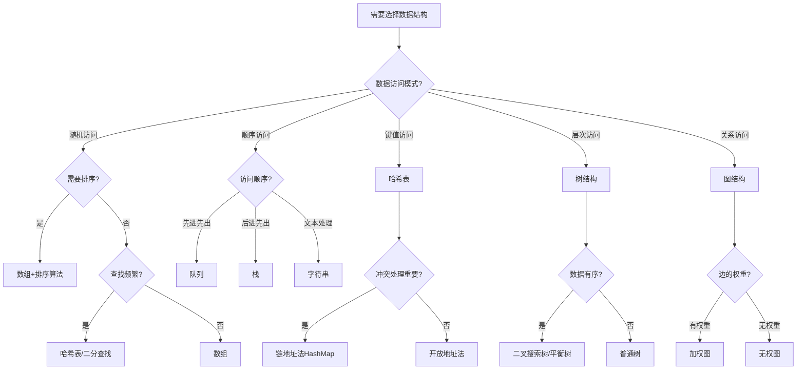

# 数据结构总结：选择最合适的数据结构

## 引言

在软件开发的世界里，选择合适的数据结构就像选择合适的工具一样重要。不同的数据结构有着不同的特性和适用场景，理解它们的优缺点和性能特征，是每个程序员必备的技能。

本文将对我们之前学习的所有数据结构进行全面总结和对比，帮助你在面对具体问题时，能够快速选择最合适的数据结构。

## 1. 数据结构全览对比表

### 1.1 基本特性对比

| 数据结构 | 访问模式 | 存储模式 | 主要操作 | 典型应用场景 |
|---------|---------|---------|---------|-------------|
| **字符串(String)** | 索引访问 | 连续存储 | 查找、替换、截取 | 文本处理、模式匹配 |
| **数组(Array)/排序** | 随机访问 | 连续存储 | 排序、查找、遍历 | 数据排序、二分查找 |
| **哈希表(Hash Table)** | 键值访问 | 散列存储 | 插入、删除、查找 | 缓存、快速查找 |
| **队列(Queue)** | 先进先出 | 线性存储 | 入队、出队 | 任务调度、广度优先搜索 |
| **栈(Stack)** | 后进先出 | 线性存储 | 入栈、出栈 | 函数调用、表达式求值 |
| **树(Tree)** | 层次访问 | 分层存储 | 插入、删除、遍历 | 文件系统、数据库索引 |
| **图(Graph)** | 关系访问 | 邻接存储 | 遍历、最短路径 | 社交网络、路径规划 |

### 1.2 时间复杂度对比

| 数据结构 | 查找 | 插入 | 删除 | 遍历 | 空间复杂度 |
|---------|------|------|------|------|-----------|
| **字符串** | O(n) | O(n) | O(n) | O(n) | O(n) |
| **有序数组** | O(log n) | O(n) | O(n) | O(n) | O(n) |
| **哈希表** | O(1)* | O(1)* | O(1)* | O(n) | O(n) |
| **队列** | O(n) | O(1) | O(1) | O(n) | O(n) |
| **栈** | O(n) | O(1) | O(1) | O(n) | O(n) |
| **二叉搜索树** | O(log n)* | O(log n)* | O(log n)* | O(n) | O(n) |
| **图(邻接表)** | O(V+E) | O(1) | O(E) | O(V+E) | O(V+E) |

*注：标记为*的复杂度为平均情况，最坏情况可能更高*

## 2. 数据结构选择决策流程图



## 3. 详细性能分析

### 3.1 字符串(String)

**优势：**
- 内存连续，访问效率高
- 支持丰富的操作：查找、替换、分割等
- 不可变性保证线程安全

**劣势：**
- 修改操作需要创建新对象，开销大
- 大量字符串拼接效率低
- 内存占用可能较大

**最佳使用场景：**
- 文本处理和分析
- 配置文件解析
- 日志处理
- 正则表达式匹配

**性能优化技巧：**
```java
// ❌ 效率低的字符串拼接
String result = "";
for (int i = 0; i < 1000; i++) {
    result += "item" + i;
}

// ✅ 高效的字符串拼接
StringBuilder sb = new StringBuilder();
for (int i = 0; i < 1000; i++) {
    sb.append("item").append(i);
}
String result = sb.toString();
```

### 3.2 排序算法

**常用排序算法性能对比：**

| 算法 | 平均时间 | 最坏时间 | 空间复杂度 | 稳定性 | 适用场景 |
|------|----------|----------|-----------|--------|----------|
| 冒泡排序 | O(n²) | O(n²) | O(1) | 稳定 | 小数据集，教学 |
| 插入排序 | O(n²) | O(n²) | O(1) | 稳定 | 小数据集，基本有序 |
| 选择排序 | O(n²) | O(n²) | O(1) | 不稳定 | 内存受限环境 |
| 快速排序 | O(n log n) | O(n²) | O(log n) | 不稳定 | 通用排序 |
| 归并排序 | O(n log n) | O(n log n) | O(n) | 稳定 | 大数据集，外部排序 |
| 堆排序 | O(n log n) | O(n log n) | O(1) | 不稳定 | 内存受限，优先队列 |

**选择策略：**
- **小数据集(n < 50)**: 插入排序
- **一般情况**: 快速排序
- **需要稳定性**: 归并排序
- **内存受限**: 堆排序

### 3.3 哈希表(Hash Table)

**优势：**
- 平均O(1)的查找、插入、删除时间
- 适合快速查找和缓存
- 空间利用率可以很高

**劣势：**
- 最坏情况下性能退化到O(n)
- 需要设计良好的哈希函数
- 不支持有序遍历

**冲突解决策略对比：**

| 策略 | 优势 | 劣势 | 适用场景 |
|------|------|------|----------|
| 链地址法 | 实现简单，删除方便 | 额外内存开销 | 冲突较多的情况 |
| 开放地址法 | 内存利用率高 | 删除复杂，聚集问题 | 负载因子较低的情况 |

**性能调优：**
```java
// 选择合适的初始容量和负载因子
Map<String, Integer> map = new HashMap<>(16, 0.75f);

// 对于已知大小的数据，预设容量
Map<String, Integer> map = new HashMap<>((int)(expectedSize / 0.75f) + 1);
```

### 3.4 队列(Queue)

**优势：**
- 严格的FIFO顺序保证
- 操作简单，概念清晰
- 适合流式数据处理

**劣势：**
- 只能从两端访问元素
- 中间元素不可直接访问
- 可能存在空间浪费

**实现方式对比：**

| 实现方式 | 优势 | 劣势 | 使用场景 |
|----------|------|------|----------|
| 数组实现 | 内存连续，访问快 | 大小固定，可能浪费空间 | 大小已知的场景 |
| 链表实现 | 动态大小，内存灵活 | 额外指针开销 | 大小未知的场景 |
| 循环数组 | 空间利用率高 | 实现稍复杂 | 高性能要求 |

### 3.5 栈(Stack)

**优势：**
- 严格的LIFO顺序
- 实现简单高效
- 自然支持递归和回溯

**劣势：**
- 访问受限，只能操作栈顶
- 可能出现栈溢出
- 不适合需要随机访问的场景

**应用场景深度分析：**
- **函数调用栈**: 管理函数调用的生命周期
- **表达式求值**: 中缀转后缀，计算表达式
- **括号匹配**: 检查括号是否匹配
- **撤销操作**: 实现编辑器的撤销功能
- **深度优先搜索**: 代替递归实现DFS

### 3.6 树(Tree)

**树的类型与特点：**

| 树类型 | 特点 | 时间复杂度 | 应用场景 |
|--------|------|-----------|----------|
| 二叉搜索树 | 左小右大 | O(log n) ~ O(n) | 动态查找表 |
| 平衡二叉树(AVL) | 高度平衡 | O(log n) | 频繁查找 |
| 红黑树 | 近似平衡 | O(log n) | Java TreeMap |
| B树/B+树 | 多路平衡 | O(log n) | 数据库索引 |
| 堆树 | 完全二叉树 | O(log n) | 优先队列 |

**选择指南：**
- **查找频繁**: AVL树或红黑树
- **插入删除频繁**: 红黑树
- **磁盘存储**: B+树
- **优先级管理**: 堆

### 3.7 图(Graph)

**图的表示方法对比：**

| 表示方法 | 空间复杂度 | 查找边 | 遍历 | 适用场景 |
|----------|-----------|--------|------|----------|
| 邻接矩阵 | O(V²) | O(1) | O(V²) | 稠密图，频繁查询边 |
| 邻接表 | O(V+E) | O(degree) | O(V+E) | 稀疏图，节省空间 |
| 边列表 | O(E) | O(E) | O(E) | 简单存储，边的操作 |

**图算法复杂度：**

| 算法 | 时间复杂度 | 空间复杂度 | 用途 |
|------|-----------|-----------|------|
| DFS/BFS | O(V+E) | O(V) | 图遍历，连通性 |
| Dijkstra | O((V+E)logV) | O(V) | 单源最短路径 |
| Floyd-Warshall | O(V³) | O(V²) | 所有点对最短路径 |
| Kruskal/Prim | O(ElogE) | O(V) | 最小生成树 |

## 4. 实际应用场景分析

### 4.1 Web开发场景

**用户会话管理：**
```java
// 使用哈希表存储会话信息
Map<String, UserSession> sessionMap = new ConcurrentHashMap<>();

// 使用队列实现会话超时清理
Queue<SessionTimeout> timeoutQueue = new PriorityQueue<>();
```

**缓存系统：**
```java
// LRU缓存实现（LinkedHashMap + 双向链表）
public class LRUCache<K, V> extends LinkedHashMap<K, V> {
    private final int capacity;

    protected boolean removeEldestEntry(Map.Entry<K, V> eldest) {
        return size() > capacity;
    }
}
```

### 4.2 游戏开发场景

**游戏状态管理：**
```java
// 使用栈管理游戏状态
Stack<GameState> stateStack = new Stack<>();
stateStack.push(new MenuState());
stateStack.push(new GamePlayState());
```

**寻路算法：**
```java
// 使用图结构和A*算法
Graph gameMap = new Graph();
List<Node> path = AStar.findPath(gameMap, start, goal);
```

### 4.3 大数据处理场景

**数据流处理：**
```java
// 使用队列缓冲数据流
BlockingQueue<DataPacket> buffer = new LinkedBlockingQueue<>(1000);

// 生产者
buffer.offer(packet);

// 消费者
DataPacket packet = buffer.poll(1, TimeUnit.SECONDS);
```

**索引构建：**
```java
// 使用B+树构建数据库索引
BPlusTree<String, Record> index = new BPlusTree<>(degree);
index.insert(key, record);
```

## 5. 内存使用模式和优化技巧

### 5.1 内存布局特点

**连续内存结构（数组、字符串）：**
- 优势：缓存友好，访问速度快
- 劣势：插入删除开销大，内存分配固定

**链式结构（链表、树、图）：**
- 优势：动态内存分配，插入删除灵活
- 劣势：内存不连续，指针开销，缓存命中率低

### 5.2 内存优化策略

**1. 对象池技术：**
```java
// 重用对象，减少GC压力
public class NodePool {
    private final Queue<TreeNode> pool = new LinkedList<>();

    public TreeNode acquire() {
        TreeNode node = pool.poll();
        return node != null ? node : new TreeNode();
    }

    public void release(TreeNode node) {
        node.reset();
        pool.offer(node);
    }
}
```

**2. 内存预分配：**
```java
// 预分配适当大小，避免频繁扩容
List<String> list = new ArrayList<>(expectedSize);
Map<String, Integer> map = new HashMap<>(expectedSize * 4 / 3);
```

**3. 压缩存储：**
```java
// 使用位操作压缩存储
class CompactBitSet {
    private long[] words;

    public void set(int bitIndex) {
        int wordIndex = bitIndex >> 6; // 除以64
        int bitOffset = bitIndex & 63;  // 模64
        words[wordIndex] |= (1L << bitOffset);
    }
}
```

### 5.3 垃圾回收优化

**减少对象创建：**
```java
// ❌ 创建大量临时对象
for (int i = 0; i < 1000000; i++) {
    String temp = "prefix" + i + "suffix";
    process(temp);
}

// ✅ 重用StringBuilder
StringBuilder sb = new StringBuilder();
for (int i = 0; i < 1000000; i++) {
    sb.setLength(0);
    sb.append("prefix").append(i).append("suffix");
    process(sb.toString());
}
```

## 6. 面试准备指南

### 6.1 高频面试题目

**基础概念题：**
1. 解释各种数据结构的特点和适用场景
2. 分析时间复杂度和空间复杂度
3. 比较不同实现方式的优缺点

**编程实现题：**
1. 手写各种数据结构的核心操作
2. 实现特定功能（如LRU缓存、线程安全的队列）
3. 优化现有实现的性能

**系统设计题：**
1. 设计一个缓存系统
2. 实现一个简单的数据库
3. 设计分布式系统中的数据结构

### 6.2 面试准备清单

**理论知识：**
- [ ] 掌握各种数据结构的基本概念
- [ ] 熟悉时间和空间复杂度分析
- [ ] 了解不同实现方式的trade-off
- [ ] 掌握常见算法和优化技巧

**编程能力：**
- [ ] 能够手写核心数据结构
- [ ] 熟练使用标准库中的数据结构
- [ ] 能够分析和优化代码性能
- [ ] 掌握多线程环境下的注意事项

**实际应用：**
- [ ] 了解各种数据结构的实际应用场景
- [ ] 能够根据需求选择合适的数据结构
- [ ] 熟悉大型系统中的数据结构使用
- [ ] 掌握性能调优和内存优化技巧

### 6.3 常见面试问题及答案要点

**Q: 什么时候选择ArrayList vs LinkedList？**

A:
- 频繁随机访问 → ArrayList（O(1) vs O(n)）
- 频繁插入删除 → LinkedList（中间位置O(1) vs O(n)）
- 内存敏感 → ArrayList（无指针开销）
- 缓存性能 → ArrayList（内存连续）

**Q: HashMap的实现原理和优化？**

A:
- 数组+链表/红黑树结构
- 哈希冲突时链表长度>8转红黑树
- 负载因子0.75平衡时间和空间
- 扩容时重新hash，可能影响性能

**Q: 如何设计一个线程安全的数据结构？**

A:
- 使用synchronized关键字
- 使用concurrent包下的类
- 使用CAS操作
- 考虑读写分离（如CopyOnWriteArrayList）

## 7. 总结与选择建议

### 7.1 选择决策矩阵

根据不同的需求特征，选择最适合的数据结构：

| 需求特征 | 推荐数据结构 | 原因 |
|----------|-------------|------|
| 快速查找 | HashMap, 有序数组+二分 | O(1)或O(log n)查找 |
| 频繁插入删除 | LinkedList, B+树 | 动态结构，灵活操作 |
| 内存受限 | 数组, 压缩结构 | 连续存储，无额外开销 |
| 需要排序 | TreeSet, 堆 | 自动维护有序性 |
| 并发访问 | ConcurrentHashMap, CopyOnWriteArrayList | 线程安全保证 |
| 缓存实现 | LinkedHashMap | LRU特性 |
| 任务调度 | PriorityQueue | 优先级管理 |
| 图算法 | 邻接表 | 空间效率高 |

### 7.2 性能优先级指导

**高性能场景优先级：**
1. **时间复杂度** > 空间复杂度
2. **缓存友好性** > 理论复杂度
3. **并发性能** > 单线程性能
4. **实际测试结果** > 理论分析

**资源受限场景优先级：**
1. **空间复杂度** > 时间复杂度
2. **内存局部性** > 操作灵活性
3. **GC友好** > 功能丰富
4. **简单实现** > 复杂优化

### 7.3 最佳实践总结

1. **先理解需求**：明确访问模式、性能要求、并发需求
2. **选择合适结构**：根据决策流程图选择最匹配的数据结构
3. **性能测试验证**：在真实环境中测试性能表现
4. **持续优化改进**：根据实际使用情况进行调优

记住，没有万能的数据结构，只有最适合当前场景的选择。深入理解各种数据结构的特性，结合实际需求做出明智的选择，是每个优秀程序员的必备技能。

通过本系列文章的学习，相信你已经对各种数据结构有了全面的认识。在实际开发中，多实践、多思考、多总结，才能真正掌握数据结构的精髓，写出高效优雅的代码。

---

**相关文章：**
- [数据结构详解：字符串(String) - 文本处理的基石](/posts/data-structure-01-string/)
- [数据结构详解：排序算法(Sorting) - 数据整理的艺术](/posts/data-structure-02-sorting/)
- [数据结构详解：哈希表(Hash Table) - 快速查找的魔法](/posts/data-structure-03-hashtable/)
- [数据结构详解：队列(Queue) - 先进先出的有序世界](/posts/data-structure-04-queue/)
- [数据结构详解：栈(Stack) - 后进先出的优雅艺术](/posts/data-structure-05-stack/)
- [数据结构详解：树(Tree) - 层次分明的数据王国](/posts/data-structure-06-tree/)

**下一篇预告：** 图(Graph) - 复杂关系的数据表示