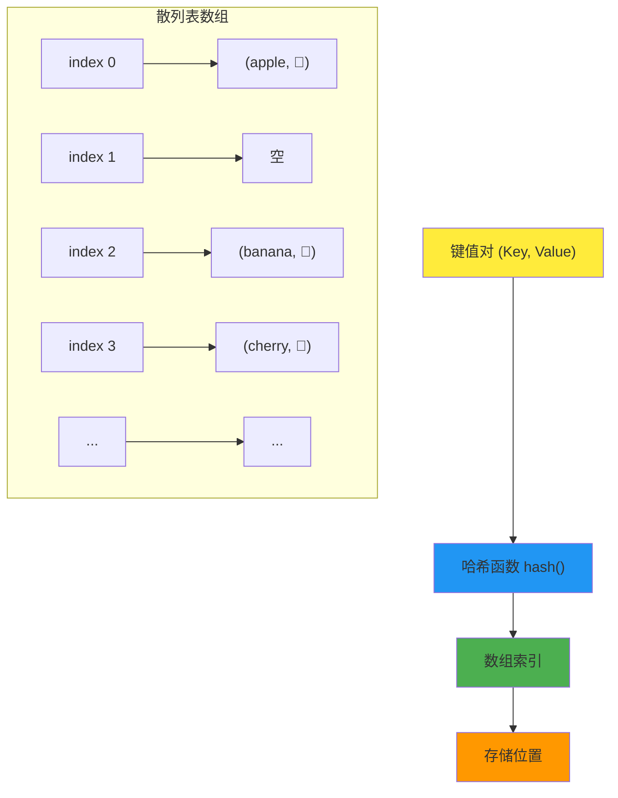

## 🗂️ 引言：快速存取的魔法盒

想象一下图书馆的分类系统：每本书都有一个独特的编号，通过这个编号就能快速找到书架上的确切位置。**散列表（Hash Table）**就是数据世界的图书馆——通过巧妙的编号系统（哈希函数），让我们能够在 O(1) 时间内存取数据！

**散列表**是一种基于键值对存储的数据结构，它使用哈希函数将键映射到数组的特定位置。这种"以空间换时间"的设计让散列表成为现代编程中最重要的数据结构之一。



## 🔑 哈希函数设计

哈希函数是散列表的核心，决定了性能和冲突率。

### 常见哈希函数

```java
/**
 * 哈希函数集合
 * 演示不同类型的哈希函数设计
 */
public class HashFunctions {

    /**
     * 除法散列法
     * 最简单的哈希函数：h(k) = k mod m
     */
    public static int divisionHash(int key, int tableSize) {
        return Math.abs(key) % tableSize;
    }

    /**
     * 乘法散列法
     * h(k) = floor(m * ((k * A) mod 1))
     * 其中 A = (√5 - 1) / 2 ≈ 0.618 (黄金比例的小数部分)
     */
    public static int multiplicationHash(int key, int tableSize) {
        double A = (Math.sqrt(5) - 1) / 2; // 黄金比例
        double temp = key * A;
        double fractionalPart = temp - Math.floor(temp);
        return (int) Math.floor(tableSize * fractionalPart);
    }

    /**
     * 字符串哈希函数 - DJB2算法
     * 经典的字符串哈希算法，冲突率低
     */
    public static int djb2Hash(String str, int tableSize) {
        long hash = 5381;
        for (char c : str.toCharArray()) {
            hash = ((hash << 5) + hash) + c; // hash * 33 + c
        }
        return (int) (Math.abs(hash) % tableSize);
    }

    /**
     * 字符串哈希函数 - SDBM算法
     * 另一种高质量的字符串哈希算法
     */
    public static int sdbmHash(String str, int tableSize) {
        long hash = 0;
        for (char c : str.toCharArray()) {
            hash = c + (hash << 6) + (hash << 16) - hash;
        }
        return (int) (Math.abs(hash) % tableSize);
    }

    /**
     * FNV-1a哈希算法
     * 快速且分布均匀的哈希算法
     */
    public static int fnv1aHash(String str, int tableSize) {
        final int FNV_PRIME = 16777619;
        final int FNV_OFFSET_BASIS = (int) 2166136261L;

        int hash = FNV_OFFSET_BASIS;
        for (char c : str.toCharArray()) {
            hash ^= c;
            hash *= FNV_PRIME;
        }
        return Math.abs(hash) % tableSize;
    }

    /**
     * 通用哈希函数
     * 使用随机参数减少最坏情况的出现
     */
    public static class UniversalHashFunction {
        private final int a, b, p, m;

        public UniversalHashFunction(int tableSize) {
            Random random = new Random();
            this.p = 1000003; // 一个大质数
            this.m = tableSize;
            this.a = random.nextInt(p - 1) + 1; // 1 <= a <= p-1
            this.b = random.nextInt(p);         // 0 <= b <= p-1
        }

        public int hash(int key) {
            return ((a * key + b) % p) % m;
        }
    }

    /**
     * 测试哈希函数的分布均匀性
     */
    public static void testHashDistribution() {
        String[] testStrings = {
            "apple", "banana", "cherry", "date", "elderberry",
            "fig", "grape", "honeydew", "kiwi", "lemon",
            "mango", "nectarine", "orange", "papaya", "quince"
        };

        int tableSize = 11;
        int[] distribution = new int[tableSize];

        System.out.println("哈希函数分布测试:");
        System.out.println("表大小: " + tableSize);
        System.out.println("\n字符串\t\tDJB2\tSDBM\tFNV1a");
        System.out.println("-".repeat(50));

        for (String str : testStrings) {
            int djb2 = djb2Hash(str, tableSize);
            int sdbm = sdbmHash(str, tableSize);
            int fnv1a = fnv1aHash(str, tableSize);

            distribution[djb2]++;

            System.out.printf("%-12s\t%d\t%d\t%d%n", str, djb2, sdbm, fnv1a);
        }

        System.out.println("\nDJB2算法分布统计:");
        for (int i = 0; i < tableSize; i++) {
            System.out.println("位置 " + i + ": " + distribution[i] + " 个元素");
        }
    }
}
```

## 🛠️ 冲突解决策略

当不同的键映射到同一个数组位置时，就发生了冲突。

### 1. 链地址法（Separate Chaining）

```java
/**
 * 使用链地址法解决冲突的散列表
 * 每个数组位置维护一个链表
 */
public class ChainedHashTable<K, V> {

    /**
     * 键值对节点
     */
    private static class Entry<K, V> {
        K key;
        V value;
        Entry<K, V> next;

        Entry(K key, V value) {
            this.key = key;
            this.value = value;
        }

        @Override
        public String toString() {
            return key + "=" + value;
        }
    }

    private Entry<K, V>[] table;    // 散列表数组
    private int size;               // 元素个数
    private int capacity;           // 表容量
    private static final double LOAD_FACTOR_THRESHOLD = 0.75; // 负载因子阈值

    @SuppressWarnings("unchecked")
    public ChainedHashTable(int initialCapacity) {
        this.capacity = initialCapacity;
        this.table = new Entry[capacity];
        this.size = 0;
    }

    public ChainedHashTable() {
        this(16);
    }

    /**
     * 哈希函数
     */
    private int hash(K key) {
        if (key == null) return 0;
        return Math.abs(key.hashCode()) % capacity;
    }

    /**
     * 插入或更新键值对
     */
    public V put(K key, V value) {
        int index = hash(key);
        Entry<K, V> entry = table[index];

        // 在链表中查找键
        while (entry != null) {
            if (key.equals(entry.key)) {
                V oldValue = entry.value;
                entry.value = value;
                System.out.println("更新: " + key + " -> " + value + " (位置: " + index + ")");
                return oldValue;
            }
            entry = entry.next;
        }

        // 键不存在，插入新节点到链表头部
        Entry<K, V> newEntry = new Entry<>(key, value);
        newEntry.next = table[index];
        table[index] = newEntry;
        size++;

        System.out.println("插入: " + key + " -> " + value + " (位置: " + index + ")");

        // 检查是否需要扩容
        if ((double) size / capacity > LOAD_FACTOR_THRESHOLD) {
            resize();
        }

        return null;
    }

    /**
     * 获取值
     */
    public V get(K key) {
        int index = hash(key);
        Entry<K, V> entry = table[index];

        while (entry != null) {
            if (key.equals(entry.key)) {
                System.out.println("找到: " + key + " -> " + entry.value + " (位置: " + index + ")");
                return entry.value;
            }
            entry = entry.next;
        }

        System.out.println("未找到: " + key);
        return null;
    }

    /**
     * 删除键值对
     */
    public V remove(K key) {
        int index = hash(key);
        Entry<K, V> entry = table[index];
        Entry<K, V> prev = null;

        while (entry != null) {
            if (key.equals(entry.key)) {
                if (prev == null) {
                    table[index] = entry.next;
                } else {
                    prev.next = entry.next;
                }
                size--;
                System.out.println("删除: " + key + " -> " + entry.value + " (位置: " + index + ")");
                return entry.value;
            }
            prev = entry;
            entry = entry.next;
        }

        System.out.println("删除失败，未找到: " + key);
        return null;
    }

    /**
     * 扩容操作
     */
    @SuppressWarnings("unchecked")
    private void resize() {
        System.out.println("开始扩容: " + capacity + " -> " + (capacity * 2));

        Entry<K, V>[] oldTable = table;
        int oldCapacity = capacity;

        capacity *= 2;
        table = new Entry[capacity];
        size = 0;

        // 重新插入所有元素
        for (int i = 0; i < oldCapacity; i++) {
            Entry<K, V> entry = oldTable[i];
            while (entry != null) {
                put(entry.key, entry.value);
                entry = entry.next;
            }
        }

        System.out.println("扩容完成，新容量: " + capacity);
    }

    /**
     * 获取负载因子
     */
    public double getLoadFactor() {
        return (double) size / capacity;
    }

    /**
     * 显示散列表状态
     */
    public void display() {
        System.out.println("\n散列表状态 (容量: " + capacity + ", 大小: " + size +
                         ", 负载因子: " + String.format("%.2f", getLoadFactor()) + "):");

        for (int i = 0; i < capacity; i++) {
            System.out.print("位置 " + i + ": ");
            Entry<K, V> entry = table[i];

            if (entry == null) {
                System.out.println("空");
            } else {
                while (entry != null) {
                    System.out.print(entry);
                    if (entry.next != null) System.out.print(" -> ");
                    entry = entry.next;
                }
                System.out.println();
            }
        }
    }

    /**
     * 获取最长链的长度（用于性能分析）
     */
    public int getMaxChainLength() {
        int maxLength = 0;
        for (int i = 0; i < capacity; i++) {
            int length = 0;
            Entry<K, V> entry = table[i];
            while (entry != null) {
                length++;
                entry = entry.next;
            }
            maxLength = Math.max(maxLength, length);
        }
        return maxLength;
    }

    public int size() { return size; }
    public boolean isEmpty() { return size == 0; }
}
```

### 2. 开放寻址法（Open Addressing）

```java
/**
 * 使用开放寻址法解决冲突的散列表
 * 支持线性探测、二次探测和双重散列
 */
public class OpenAddressingHashTable<K, V> {

    /**
     * 探测方法枚举
     */
    public enum ProbeType {
        LINEAR,      // 线性探测
        QUADRATIC,   // 二次探测
        DOUBLE_HASH  // 双重散列
    }

    /**
     * 键值对条目
     */
    private static class Entry<K, V> {
        K key;
        V value;
        boolean isDeleted; // 懒删除标记

        Entry(K key, V value) {
            this.key = key;
            this.value = value;
            this.isDeleted = false;
        }

        @Override
        public String toString() {
            return isDeleted ? "[已删除]" : key + "=" + value;
        }
    }

    private Entry<K, V>[] table;
    private int size;
    private int capacity;
    private ProbeType probeType;
    private static final double LOAD_FACTOR_THRESHOLD = 0.5;

    @SuppressWarnings("unchecked")
    public OpenAddressingHashTable(int initialCapacity, ProbeType probeType) {
        this.capacity = initialCapacity;
        this.table = new Entry[capacity];
        this.size = 0;
        this.probeType = probeType;
    }

    public OpenAddressingHashTable(ProbeType probeType) {
        this(16, probeType);
    }

    /**
     * 主哈希函数
     */
    private int hash1(K key) {
        if (key == null) return 0;
        return Math.abs(key.hashCode()) % capacity;
    }

    /**
     * 辅助哈希函数（用于双重散列）
     */
    private int hash2(K key) {
        if (key == null) return 1;
        return 7 - (Math.abs(key.hashCode()) % 7);
    }

    /**
     * 探测函数
     */
    private int probe(K key, int attempt) {
        int h1 = hash1(key);

        switch (probeType) {
            case LINEAR:
                return (h1 + attempt) % capacity;

            case QUADRATIC:
                return (h1 + attempt * attempt) % capacity;

            case DOUBLE_HASH:
                int h2 = hash2(key);
                return (h1 + attempt * h2) % capacity;

            default:
                return h1;
        }
    }

    /**
     * 插入或更新键值对
     */
    public V put(K key, V value) {
        if ((double) size / capacity >= LOAD_FACTOR_THRESHOLD) {
            resize();
        }

        for (int attempt = 0; attempt < capacity; attempt++) {
            int index = probe(key, attempt);
            Entry<K, V> entry = table[index];

            // 位置为空或已删除，可以插入
            if (entry == null || entry.isDeleted) {
                table[index] = new Entry<>(key, value);
                if (entry == null || entry.isDeleted) {
                    size++;
                }
                System.out.println("插入: " + key + " -> " + value +
                                 " (位置: " + index + ", 探测次数: " + (attempt + 1) + ")");
                return null;
            }

            // 键已存在，更新值
            if (key.equals(entry.key)) {
                V oldValue = entry.value;
                entry.value = value;
                System.out.println("更新: " + key + " -> " + value +
                                 " (位置: " + index + ", 探测次数: " + (attempt + 1) + ")");
                return oldValue;
            }
        }

        throw new IllegalStateException("散列表已满，无法插入");
    }

    /**
     * 获取值
     */
    public V get(K key) {
        for (int attempt = 0; attempt < capacity; attempt++) {
            int index = probe(key, attempt);
            Entry<K, V> entry = table[index];

            if (entry == null) {
                System.out.println("未找到: " + key + " (探测次数: " + (attempt + 1) + ")");
                return null;
            }

            if (!entry.isDeleted && key.equals(entry.key)) {
                System.out.println("找到: " + key + " -> " + entry.value +
                                 " (位置: " + index + ", 探测次数: " + (attempt + 1) + ")");
                return entry.value;
            }
        }

        System.out.println("未找到: " + key + " (已探测整个表)");
        return null;
    }

    /**
     * 删除键值对（懒删除）
     */
    public V remove(K key) {
        for (int attempt = 0; attempt < capacity; attempt++) {
            int index = probe(key, attempt);
            Entry<K, V> entry = table[index];

            if (entry == null) {
                System.out.println("删除失败，未找到: " + key);
                return null;
            }

            if (!entry.isDeleted && key.equals(entry.key)) {
                entry.isDeleted = true;
                size--;
                System.out.println("删除: " + key + " -> " + entry.value +
                                 " (位置: " + index + ", 探测次数: " + (attempt + 1) + ")");
                return entry.value;
            }
        }

        System.out.println("删除失败，未找到: " + key);
        return null;
    }

    /**
     * 扩容并重新散列
     */
    @SuppressWarnings("unchecked")
    private void resize() {
        System.out.println("开始扩容: " + capacity + " -> " + (capacity * 2));

        Entry<K, V>[] oldTable = table;
        int oldCapacity = capacity;

        capacity *= 2;
        table = new Entry[capacity];
        size = 0;

        // 重新插入所有有效元素
        for (int i = 0; i < oldCapacity; i++) {
            Entry<K, V> entry = oldTable[i];
            if (entry != null && !entry.isDeleted) {
                put(entry.key, entry.value);
            }
        }

        System.out.println("扩容完成，新容量: " + capacity);
    }

    /**
     * 显示散列表状态
     */
    public void display() {
        System.out.println("\n散列表状态 (" + probeType + " 探测, 容量: " + capacity +
                         ", 大小: " + size + ", 负载因子: " +
                         String.format("%.2f", (double) size / capacity) + "):");

        for (int i = 0; i < capacity; i++) {
            Entry<K, V> entry = table[i];
            if (entry == null) {
                System.out.println("位置 " + i + ": 空");
            } else {
                System.out.println("位置 " + i + ": " + entry);
            }
        }
    }

    /**
     * 计算平均探测次数
     */
    public double getAverageProbeCount() {
        int totalProbes = 0;
        int validEntries = 0;

        for (int i = 0; i < capacity; i++) {
            Entry<K, V> entry = table[i];
            if (entry != null && !entry.isDeleted) {
                // 重新计算这个元素的探测次数
                for (int attempt = 0; attempt < capacity; attempt++) {
                    int index = probe(entry.key, attempt);
                    if (index == i) {
                        totalProbes += attempt + 1;
                        validEntries++;
                        break;
                    }
                }
            }
        }

        return validEntries == 0 ? 0 : (double) totalProbes / validEntries;
    }

    public int size() { return size; }
    public boolean isEmpty() { return size == 0; }
}
```

## 🌟 高级散列表实现

### Robin Hood 散列

```java
/**
 * Robin Hood 散列实现
 * 通过"劫富济贫"的策略优化探测距离
 */
public class RobinHoodHashTable<K, V> {

    private static class Entry<K, V> {
        K key;
        V value;
        int distance; // 探测距离

        Entry(K key, V value, int distance) {
            this.key = key;
            this.value = value;
            this.distance = distance;
        }

        @Override
        public String toString() {
            return key + "=" + value + "(d:" + distance + ")";
        }
    }

    private Entry<K, V>[] table;
    private int size;
    private int capacity;
    private static final double LOAD_FACTOR_THRESHOLD = 0.75;

    @SuppressWarnings("unchecked")
    public RobinHoodHashTable(int initialCapacity) {
        this.capacity = initialCapacity;
        this.table = new Entry[capacity];
        this.size = 0;
    }

    private int hash(K key) {
        if (key == null) return 0;
        return Math.abs(key.hashCode()) % capacity;
    }

    /**
     * 插入键值对
     */
    public V put(K key, V value) {
        if ((double) size / capacity >= LOAD_FACTOR_THRESHOLD) {
            resize();
        }

        int hash = hash(key);
        Entry<K, V> newEntry = new Entry<>(key, value, 0);

        return robinHoodInsert(newEntry, hash);
    }

    /**
     * Robin Hood 插入算法
     */
    private V robinHoodInsert(Entry<K, V> entry, int startPos) {
        int pos = startPos;

        while (true) {
            int actualPos = pos % capacity;

            // 位置为空，直接插入
            if (table[actualPos] == null) {
                entry.distance = pos - startPos;
                table[actualPos] = entry;
                size++;
                System.out.println("插入: " + entry.key + " -> " + entry.value +
                                 " (位置: " + actualPos + ", 距离: " + entry.distance + ")");
                return null;
            }

            // 键已存在，更新值
            if (entry.key.equals(table[actualPos].key)) {
                V oldValue = table[actualPos].value;
                table[actualPos].value = entry.value;
                return oldValue;
            }

            // Robin Hood 策略：如果新元素的距离大于当前元素的距离，交换它们
            entry.distance = pos - startPos;
            if (entry.distance > table[actualPos].distance) {
                Entry<K, V> displaced = table[actualPos];
                table[actualPos] = entry;

                // 继续为被替换的元素寻找位置
                entry = displaced;
                startPos = actualPos - displaced.distance;

                System.out.println("Robin Hood 交换: " + entry.key + " 被 " +
                                 table[actualPos].key + " 替换 (位置: " + actualPos + ")");
            }

            pos++;
        }
    }

    /**
     * 获取值
     */
    public V get(K key) {
        int hash = hash(key);
        int pos = hash;

        while (true) {
            int actualPos = pos % capacity;
            Entry<K, V> entry = table[actualPos];

            if (entry == null) {
                return null;
            }

            if (entry.key.equals(key)) {
                return entry.value;
            }

            // 如果当前探测距离超过了元素的距离，说明元素不存在
            int currentDistance = pos - hash;
            if (currentDistance > entry.distance) {
                return null;
            }

            pos++;
        }
    }

    /**
     * 扩容
     */
    @SuppressWarnings("unchecked")
    private void resize() {
        Entry<K, V>[] oldTable = table;
        int oldCapacity = capacity;

        capacity *= 2;
        table = new Entry[capacity];
        size = 0;

        for (int i = 0; i < oldCapacity; i++) {
            Entry<K, V> entry = oldTable[i];
            if (entry != null) {
                put(entry.key, entry.value);
            }
        }
    }

    /**
     * 显示散列表状态
     */
    public void display() {
        System.out.println("\nRobin Hood 散列表状态:");
        for (int i = 0; i < capacity; i++) {
            Entry<K, V> entry = table[i];
            if (entry == null) {
                System.out.println("位置 " + i + ": 空");
            } else {
                System.out.println("位置 " + i + ": " + entry);
            }
        }

        // 计算平均探测距离
        double avgDistance = 0;
        int count = 0;
        for (int i = 0; i < capacity; i++) {
            Entry<K, V> entry = table[i];
            if (entry != null) {
                avgDistance += entry.distance;
                count++;
            }
        }
        if (count > 0) {
            avgDistance /= count;
            System.out.println("平均探测距离: " + String.format("%.2f", avgDistance));
        }
    }
}
```

### 一致性哈希

```java
/**
 * 一致性哈希实现
 * 用于分布式系统中的负载均衡
 */
public class ConsistentHashing {

    /**
     * 虚拟节点类
     */
    private static class VirtualNode {
        String nodeId;
        int hash;

        VirtualNode(String nodeId, int hash) {
            this.nodeId = nodeId;
            this.hash = hash;
        }

        @Override
        public String toString() {
            return nodeId + "@" + hash;
        }
    }

    private final TreeMap<Integer, String> ring; // 哈希环
    private final Set<String> nodes;             // 物理节点
    private final int virtualNodesPerNode;       // 每个物理节点的虚拟节点数

    public ConsistentHashing(int virtualNodesPerNode) {
        this.ring = new TreeMap<>();
        this.nodes = new HashSet<>();
        this.virtualNodesPerNode = virtualNodesPerNode;
    }

    /**
     * 添加节点
     */
    public void addNode(String nodeId) {
        nodes.add(nodeId);

        // 为每个物理节点创建多个虚拟节点
        for (int i = 0; i < virtualNodesPerNode; i++) {
            String virtualNodeId = nodeId + "#" + i;
            int hash = hash(virtualNodeId);
            ring.put(hash, nodeId);
            System.out.println("添加虚拟节点: " + virtualNodeId + " -> " + hash);
        }

        System.out.println("节点 " + nodeId + " 添加完成，创建了 " +
                         virtualNodesPerNode + " 个虚拟节点");
    }

    /**
     * 移除节点
     */
    public void removeNode(String nodeId) {
        if (!nodes.contains(nodeId)) {
            return;
        }

        nodes.remove(nodeId);

        // 移除所有相关的虚拟节点
        Iterator<Map.Entry<Integer, String>> iterator = ring.entrySet().iterator();
        int removedCount = 0;

        while (iterator.hasNext()) {
            Map.Entry<Integer, String> entry = iterator.next();
            if (entry.getValue().equals(nodeId)) {
                iterator.remove();
                removedCount++;
            }
        }

        System.out.println("节点 " + nodeId + " 移除完成，删除了 " + removedCount + " 个虚拟节点");
    }

    /**
     * 获取负责处理指定键的节点
     */
    public String getNode(String key) {
        if (ring.isEmpty()) {
            return null;
        }

        int hash = hash(key);
        System.out.println("查找键: " + key + " (hash: " + hash + ")");

        // 找到第一个大于等于该hash值的节点
        Map.Entry<Integer, String> entry = ring.ceilingEntry(hash);

        if (entry == null) {
            // 如果没找到，返回环上的第一个节点（环形特性）
            entry = ring.firstEntry();
        }

        System.out.println("  -> 路由到节点: " + entry.getValue());
        return entry.getValue();
    }

    /**
     * 简单哈希函数
     */
    private int hash(String input) {
        return Math.abs(input.hashCode());
    }

    /**
     * 分析数据分布
     */
    public void analyzeDistribution(String[] keys) {
        Map<String, Integer> distribution = new HashMap<>();

        // 初始化计数器
        for (String node : nodes) {
            distribution.put(node, 0);
        }

        // 统计每个键的分布
        for (String key : keys) {
            String node = getNode(key);
            if (node != null) {
                distribution.put(node, distribution.get(node) + 1);
            }
        }

        // 显示分布结果
        System.out.println("\n数据分布分析:");
        System.out.println("总键数: " + keys.length);

        for (Map.Entry<String, Integer> entry : distribution.entrySet()) {
            double percentage = (double) entry.getValue() / keys.length * 100;
            System.out.printf("节点 %s: %d 个键 (%.1f%%)%n",
                            entry.getKey(), entry.getValue(), percentage);
        }

        // 计算标准差
        double mean = (double) keys.length / nodes.size();
        double variance = 0;

        for (int count : distribution.values()) {
            variance += Math.pow(count - mean, 2);
        }
        variance /= nodes.size();
        double stdDev = Math.sqrt(variance);

        System.out.printf("均值: %.1f, 标准差: %.1f%n", mean, stdDev);
    }

    /**
     * 显示哈希环状态
     */
    public void displayRing() {
        System.out.println("\n哈希环状态:");
        System.out.println("物理节点: " + nodes);
        System.out.println("环上虚拟节点数: " + ring.size());

        // 显示环上的虚拟节点分布
        for (Map.Entry<Integer, String> entry : ring.entrySet()) {
            System.out.println("  " + entry.getKey() + " -> " + entry.getValue());
        }
    }

    /**
     * 模拟节点故障时的数据迁移
     */
    public void simulateNodeFailure(String failedNode, String[] keys) {
        System.out.println("\n模拟节点故障: " + failedNode);

        // 记录故障前的分布
        Map<String, Set<String>> beforeFailure = new HashMap<>();
        for (String node : nodes) {
            beforeFailure.put(node, new HashSet<>());
        }

        for (String key : keys) {
            String node = getNode(key);
            if (node != null) {
                beforeFailure.get(node).add(key);
            }
        }

        // 移除故障节点
        Set<String> affectedKeys = beforeFailure.get(failedNode);
        removeNode(failedNode);

        // 计算迁移后的分布
        Map<String, Set<String>> afterFailure = new HashMap<>();
        for (String node : nodes) {
            afterFailure.put(node, new HashSet<>());
        }

        for (String key : affectedKeys) {
            String newNode = getNode(key);
            if (newNode != null) {
                afterFailure.get(newNode).add(key);
            }
        }

        // 分析迁移结果
        System.out.println("受影响的键数: " + affectedKeys.size());
        System.out.println("键的重新分布:");

        for (Map.Entry<String, Set<String>> entry : afterFailure.entrySet()) {
            if (!entry.getValue().isEmpty()) {
                System.out.println("  节点 " + entry.getKey() + ": +" +
                                 entry.getValue().size() + " 个键");
            }
        }
    }
}
```

## 🧪 完整测试示例

```java
/**
 * 散列表数据结构综合测试
 */
public class HashTableTest {
    public static void main(String[] args) {
        System.out.println("=== 散列表数据结构综合测试 ===");

        testHashFunctions();
        testChainedHashTable();
        testOpenAddressing();
        testRobinHoodHashing();
        testConsistentHashing();
        performanceComparison();
    }

    private static void testHashFunctions() {
        System.out.println("\n1. 哈希函数测试:");
        HashFunctions.testHashDistribution();

        // 测试通用哈希函数
        HashFunctions.UniversalHashFunction uhf = new HashFunctions.UniversalHashFunction(11);
        System.out.println("\n通用哈希函数示例:");
        for (int i = 1; i <= 10; i++) {
            System.out.println("hash(" + i + ") = " + uhf.hash(i));
        }
    }

    private static void testChainedHashTable() {
        System.out.println("\n2. 链地址法散列表测试:");

        ChainedHashTable<String, Integer> table = new ChainedHashTable<>(7);

        // 插入数据
        String[] keys = {"apple", "banana", "cherry", "date", "elderberry", "fig", "grape"};
        for (int i = 0; i < keys.length; i++) {
            table.put(keys[i], i + 1);
        }

        table.display();
        System.out.println("最长链长度: " + table.getMaxChainLength());

        // 测试查找和删除
        System.out.println("\n查找测试:");
        table.get("apple");
        table.get("banana");
        table.get("notfound");

        System.out.println("\n删除测试:");
        table.remove("cherry");
        table.display();
    }

    private static void testOpenAddressing() {
        System.out.println("\n3. 开放寻址法测试:");

        // 测试不同探测方法
        OpenAddressingHashTable.ProbeType[] probeTypes = {
            OpenAddressingHashTable.ProbeType.LINEAR,
            OpenAddressingHashTable.ProbeType.QUADRATIC,
            OpenAddressingHashTable.ProbeType.DOUBLE_HASH
        };

        for (OpenAddressingHashTable.ProbeType probeType : probeTypes) {
            System.out.println("\n" + probeType + " 探测:");
            OpenAddressingHashTable<Integer, String> table =
                new OpenAddressingHashTable<>(7, probeType);

            for (int i = 1; i <= 5; i++) {
                table.put(i * 7, "Value" + i); // 故意造成冲突
            }

            table.display();
            System.out.println("平均探测次数: " +
                             String.format("%.2f", table.getAverageProbeCount()));
        }
    }

    private static void testRobinHoodHashing() {
        System.out.println("\n4. Robin Hood 散列测试:");

        RobinHoodHashTable<Integer, String> table = new RobinHoodHashTable<>(7);

        for (int i = 1; i <= 5; i++) {
            table.put(i * 7, "Value" + i); // 故意造成冲突
        }

        table.display();
    }

    private static void testConsistentHashing() {
        System.out.println("\n5. 一致性哈希测试:");

        ConsistentHashing ch = new ConsistentHashing(3); // 每个节点3个虚拟节点

        // 添加节点
        ch.addNode("Server1");
        ch.addNode("Server2");
        ch.addNode("Server3");

        // 生成测试数据
        String[] keys = new String[30];
        for (int i = 0; i < keys.length; i++) {
            keys[i] = "key" + i;
        }

        // 分析初始分布
        ch.analyzeDistribution(keys);

        // 模拟节点故障
        ch.simulateNodeFailure("Server2", keys);
    }

    private static void performanceComparison() {
        System.out.println("\n6. 性能对比测试:");

        int[] sizes = {1000, 10000, 100000};

        System.out.println("数据规模\t链地址法\t开放寻址\tJava HashMap");
        System.out.println("-".repeat(60));

        for (int size : sizes) {
            // 生成测试数据
            String[] keys = new String[size];
            for (int i = 0; i < size; i++) {
                keys[i] = "key" + i;
            }

            // 测试链地址法
            long time1 = testChainedPerformance(keys);

            // 测试开放寻址法
            long time2 = testOpenAddressingPerformance(keys);

            // 测试Java HashMap
            long time3 = testJavaHashMapPerformance(keys);

            System.out.printf("%d\t\t%.2fms\t\t%.2fms\t\t%.2fms%n",
                            size,
                            time1 / 1_000_000.0,
                            time2 / 1_000_000.0,
                            time3 / 1_000_000.0);
        }
    }

    private static long testChainedPerformance(String[] keys) {
        ChainedHashTable<String, Integer> table = new ChainedHashTable<>();
        long start = System.nanoTime();

        for (int i = 0; i < keys.length; i++) {
            table.put(keys[i], i);
        }

        for (String key : keys) {
            table.get(key);
        }

        return System.nanoTime() - start;
    }

    private static long testOpenAddressingPerformance(String[] keys) {
        OpenAddressingHashTable<String, Integer> table =
            new OpenAddressingHashTable<>(OpenAddressingHashTable.ProbeType.LINEAR);
        long start = System.nanoTime();

        for (int i = 0; i < keys.length; i++) {
            table.put(keys[i], i);
        }

        for (String key : keys) {
            table.get(key);
        }

        return System.nanoTime() - start;
    }

    private static long testJavaHashMapPerformance(String[] keys) {
        HashMap<String, Integer> map = new HashMap<>();
        long start = System.nanoTime();

        for (int i = 0; i < keys.length; i++) {
            map.put(keys[i], i);
        }

        for (String key : keys) {
            map.get(key);
        }

        return System.nanoTime() - start;
    }
}
```

## 🎯 总结

散列表是现代计算机科学中最重要的数据结构之一，它的优雅在于简单而高效：

### 核心优势
1. **平均 O(1) 性能**：查找、插入、删除操作的平均时间复杂度
2. **实现相对简单**：比平衡树等数据结构更容易实现
3. **内存效率高**：相比树结构有更好的空间利用率
4. **应用广泛**：从编程语言到数据库都有应用

### 设计要点
- **哈希函数**：决定性能的关键，需要分布均匀、计算快速
- **冲突解决**：链地址法和开放寻址法各有优缺点
- **负载因子控制**：平衡时间和空间效率
- **动态扩容**：保持良好的性能特性

### 高级技术
- **Robin Hood 散列**：优化探测距离分布
- **一致性哈希**：解决分布式系统的负载均衡
- **布隆过滤器**：概率性数据结构，空间高效
- **并发散列表**：支持多线程安全访问

### 实际应用
- **编程语言**：Python dict、Java HashMap、C++ unordered_map
- **数据库**：索引结构、查询优化
- **分布式系统**：负载均衡、缓存分片
- **网络协议**：路由表、DNS解析

散列表的设计体现了计算机科学中"平均情况优化"的重要思想。虽然最坏情况下性能可能退化，但通过精心设计的哈希函数和冲突解决策略，可以让平均性能达到近乎完美的 O(1)。这种实用主义的设计哲学，正是散列表能够在各种系统中广泛应用的根本原因！

---

*恭喜你完成了数据结构入门教程系列！从链表到散列表，你已经掌握了程序设计的核心工具。继续学习，探索更广阔的算法世界吧！*