## 什么是位图(Bitmap)

位图(Bitmap)是一种用位(bit)来表示数据的数据结构，它使用一个位数组来存储信息，每个位只能表示0或1两种状态。位图在处理海量数据时具有极高的空间效率和时间效率，是大数据处理中的重要工具。

### 位图的核心思想

位图的核心思想是**用位的索引表示数据值，用位的状态表示该数据是否存在**。例如：
- 位图中第i位为1，表示数值i存在
- 位图中第i位为0，表示数值i不存在

```mermaid
graph TD
    A[数据集合: 2,5,7,10] --> B[位图表示]
    B --> C[索引: 0 1 2 3 4 5 6 7 8 9 10]
    C --> D[位值: 0 0 1 0 0 1 0 1 0 0 1]

    style A fill:#e1f5fe
    style B fill:#f3e5f5
    style C fill:#fff3e0
    style D fill:#e8f5e8
```



## 位图的优势与劣势

### 🚀 优势
1. **极致的空间效率**：每个数据只需要1位存储空间
2. **高效的时间复杂度**：插入、删除、查找都是O(1)
3. **位运算操作**：支持快速的交集、并集、差集运算
4. **缓存友好**：连续的内存访问模式

### ⚠️ 劣势
1. **稀疏数据浪费**：如果数据范围大但实际数据少，会浪费空间
2. **数据范围限制**：需要预先知道数据的最大值
3. **只适合整数**：无法直接存储浮点数或字符串

## 位图的基本实现

### Java实现

```java
public class Bitmap {
    private long[] bits;  // 使用long数组，每个long有64位
    private int maxNum;   // 支持的最大数值

    /**
     * 构造函数
     * @param maxNum 支持的最大数值
     */
    public Bitmap(int maxNum) {
        this.maxNum = maxNum;
        // 计算需要多少个long来存储maxNum+1个位
        int arraySize = (maxNum + 64) / 64;
        this.bits = new long[arraySize];
    }

    /**
     * 设置指定位为1
     * @param num 要设置的数值
     */
    public void set(int num) {
        if (num < 0 || num > maxNum) {
            throw new IllegalArgumentException("数值超出范围: " + num);
        }

        int arrayIndex = num / 64;        // 确定在哪个long中
        int bitIndex = num % 64;          // 确定在long的哪一位
        bits[arrayIndex] |= (1L << bitIndex);  // 使用位或运算设置位
    }

    /**
     * 设置指定位为0
     * @param num 要清除的数值
     */
    public void clear(int num) {
        if (num < 0 || num > maxNum) {
            return;
        }

        int arrayIndex = num / 64;
        int bitIndex = num % 64;
        bits[arrayIndex] &= ~(1L << bitIndex);  // 使用位与运算清除位
    }

    /**
     * 检查指定位是否为1
     * @param num 要检查的数值
     * @return 如果存在返回true，否则返回false
     */
    public boolean get(int num) {
        if (num < 0 || num > maxNum) {
            return false;
        }

        int arrayIndex = num / 64;
        int bitIndex = num % 64;
        return (bits[arrayIndex] & (1L << bitIndex)) != 0;
    }

    /**
     * 计算位图中设置为1的位数
     * @return 位数统计
     */
    public int cardinality() {
        int count = 0;
        for (long word : bits) {
            count += Long.bitCount(word);  // Java内置方法统计1的个数
        }
        return count;
    }

    /**
     * 与另一个位图进行交集运算
     * @param other 另一个位图
     * @return 新的位图表示交集结果
     */
    public Bitmap and(Bitmap other) {
        Bitmap result = new Bitmap(Math.max(this.maxNum, other.maxNum));
        int minLength = Math.min(this.bits.length, other.bits.length);

        for (int i = 0; i < minLength; i++) {
            result.bits[i] = this.bits[i] & other.bits[i];
        }

        return result;
    }

    /**
     * 与另一个位图进行并集运算
     * @param other 另一个位图
     * @return 新的位图表示并集结果
     */
    public Bitmap or(Bitmap other) {
        Bitmap result = new Bitmap(Math.max(this.maxNum, other.maxNum));
        int maxLength = Math.max(this.bits.length, other.bits.length);

        for (int i = 0; i < maxLength; i++) {
            long thisBits = i < this.bits.length ? this.bits[i] : 0;
            long otherBits = i < other.bits.length ? other.bits[i] : 0;
            result.bits[i] = thisBits | otherBits;
        }

        return result;
    }
}
```

### 使用示例

```java
public class BitmapDemo {
    public static void main(String[] args) {
        // 创建一个支持0-99数值的位图
        Bitmap bitmap = new Bitmap(99);

        // 添加一些数据
        int[] data = {2, 5, 7, 10, 15, 20, 25, 30};
        for (int num : data) {
            bitmap.set(num);
            System.out.println("添加数值: " + num);
        }

        // 检查数据是否存在
        System.out.println("\n=== 数据存在性检查 ===");
        for (int i = 0; i <= 30; i++) {
            if (bitmap.get(i)) {
                System.out.println("数值 " + i + " 存在");
            }
        }

        // 统计位图中的数据量
        System.out.println("\n位图中共有 " + bitmap.cardinality() + " 个数据");

        // 演示位图运算
        demonstrateBitmapOperations();
    }

    private static void demonstrateBitmapOperations() {
        System.out.println("\n=== 位图运算演示 ===");

        Bitmap bitmap1 = new Bitmap(20);
        Bitmap bitmap2 = new Bitmap(20);

        // bitmap1: {1, 3, 5, 7, 9}
        bitmap1.set(1); bitmap1.set(3); bitmap1.set(5);
        bitmap1.set(7); bitmap1.set(9);

        // bitmap2: {2, 3, 5, 8, 9}
        bitmap2.set(2); bitmap2.set(3); bitmap2.set(5);
        bitmap2.set(8); bitmap2.set(9);

        // 交集运算
        Bitmap intersection = bitmap1.and(bitmap2);
        System.out.print("交集结果: ");
        for (int i = 0; i <= 10; i++) {
            if (intersection.get(i)) {
                System.out.print(i + " ");
            }
        }
        System.out.println();

        // 并集运算
        Bitmap union = bitmap1.or(bitmap2);
        System.out.print("并集结果: ");
        for (int i = 0; i <= 10; i++) {
            if (union.get(i)) {
                System.out.print(i + " ");
            }
        }
        System.out.println();
    }
}
```

## 位图的经典应用场景

### 1. 海量数据去重

```java
/**
 * 处理海量整数去重问题
 * 假设有40亿个整数，范围在0到2^32-1之间，如何快速去重？
 */
public class MassiveDataDeduplication {

    public static void deduplicateNumbers(String inputFile, String outputFile) {
        // 创建能容纳2^32个数的位图
        // 实际上可以使用分片技术，这里简化处理
        Bitmap bitmap = new Bitmap(Integer.MAX_VALUE);

        try (BufferedReader reader = new BufferedReader(new FileReader(inputFile));
             BufferedWriter writer = new BufferedWriter(new FileWriter(outputFile))) {

            String line;
            System.out.println("开始读取数据并标记...");

            // 第一遍扫描：标记所有出现的数字
            while ((line = reader.readLine()) != null) {
                int num = Integer.parseInt(line.trim());
                bitmap.set(num);
            }

            System.out.println("开始输出去重结果...");

            // 第二遍：输出所有标记为1的数字
            for (int i = 0; i <= Integer.MAX_VALUE; i++) {
                if (bitmap.get(i)) {
                    writer.write(i + "\n");
                }
            }

            System.out.println("去重完成！");

        } catch (IOException e) {
            e.printStackTrace();
        }
    }
}
```

### 2. 用户活跃度统计

```java
/**
 * 用户活跃度统计系统
 * 使用位图统计每日活跃用户
 */
public class UserActivityTracker {
    private static final int MAX_USER_ID = 10_000_000;  // 支持1000万用户

    // 存储每日活跃用户的位图
    private Map<String, Bitmap> dailyActiveUsers;

    public UserActivityTracker() {
        this.dailyActiveUsers = new ConcurrentHashMap<>();
    }

    /**
     * 记录用户活跃
     * @param date 日期 (格式: yyyy-MM-dd)
     * @param userId 用户ID
     */
    public void recordUserActivity(String date, int userId) {
        if (userId < 0 || userId > MAX_USER_ID) {
            throw new IllegalArgumentException("用户ID超出范围");
        }

        Bitmap dayBitmap = dailyActiveUsers.computeIfAbsent(date,
            k -> new Bitmap(MAX_USER_ID));

        dayBitmap.set(userId);
    }

    /**
     * 获取某日活跃用户数
     * @param date 日期
     * @return 活跃用户数
     */
    public int getDailyActiveUsers(String date) {
        Bitmap dayBitmap = dailyActiveUsers.get(date);
        return dayBitmap != null ? dayBitmap.cardinality() : 0;
    }

    /**
     * 获取两日的共同活跃用户数
     * @param date1 日期1
     * @param date2 日期2
     * @return 共同活跃用户数
     */
    public int getCommonActiveUsers(String date1, String date2) {
        Bitmap bitmap1 = dailyActiveUsers.get(date1);
        Bitmap bitmap2 = dailyActiveUsers.get(date2);

        if (bitmap1 == null || bitmap2 == null) {
            return 0;
        }

        return bitmap1.and(bitmap2).cardinality();
    }

    /**
     * 获取指定日期范围内的总活跃用户数
     * @param startDate 开始日期
     * @param endDate 结束日期
     * @return 总活跃用户数
     */
    public int getTotalActiveUsers(String startDate, String endDate) {
        Bitmap totalBitmap = new Bitmap(MAX_USER_ID);

        // 简化：假设日期列表已获取
        List<String> dateRange = getDateRange(startDate, endDate);

        for (String date : dateRange) {
            Bitmap dayBitmap = dailyActiveUsers.get(date);
            if (dayBitmap != null) {
                totalBitmap = totalBitmap.or(dayBitmap);
            }
        }

        return totalBitmap.cardinality();
    }

    private List<String> getDateRange(String startDate, String endDate) {
        // 实际实现中需要解析日期并生成日期列表
        // 这里返回空列表作为示例
        return new ArrayList<>();
    }
}
```

### 3. 权限系统

```java
/**
 * 基于位图的权限系统
 * 每个权限对应位图中的一位
 */
public class PermissionSystem {

    // 权限常量定义
    public static final int READ_PERMISSION = 0;
    public static final int WRITE_PERMISSION = 1;
    public static final int DELETE_PERMISSION = 2;
    public static final int ADMIN_PERMISSION = 3;
    public static final int AUDIT_PERMISSION = 4;

    private static final String[] PERMISSION_NAMES = {
        "READ", "WRITE", "DELETE", "ADMIN", "AUDIT"
    };

    /**
     * 用户权限类
     */
    public static class UserPermission {
        private long permissions;  // 使用long存储权限位图

        public UserPermission() {
            this.permissions = 0;
        }

        /**
         * 授予权限
         * @param permission 权限ID
         */
        public void grantPermission(int permission) {
            permissions |= (1L << permission);
        }

        /**
         * 撤销权限
         * @param permission 权限ID
         */
        public void revokePermission(int permission) {
            permissions &= ~(1L << permission);
        }

        /**
         * 检查是否有指定权限
         * @param permission 权限ID
         * @return 是否有权限
         */
        public boolean hasPermission(int permission) {
            return (permissions & (1L << permission)) != 0;
        }

        /**
         * 检查是否有所有指定权限
         * @param requiredPermissions 需要的权限列表
         * @return 是否有所有权限
         */
        public boolean hasAllPermissions(int... requiredPermissions) {
            for (int permission : requiredPermissions) {
                if (!hasPermission(permission)) {
                    return false;
                }
            }
            return true;
        }

        /**
         * 检查是否有任一指定权限
         * @param anyPermissions 权限列表
         * @return 是否有任一权限
         */
        public boolean hasAnyPermission(int... anyPermissions) {
            for (int permission : anyPermissions) {
                if (hasPermission(permission)) {
                    return true;
                }
            }
            return false;
        }

        /**
         * 获取所有权限的字符串表示
         * @return 权限描述
         */
        public String getPermissionDescription() {
            List<String> grantedPermissions = new ArrayList<>();

            for (int i = 0; i < PERMISSION_NAMES.length; i++) {
                if (hasPermission(i)) {
                    grantedPermissions.add(PERMISSION_NAMES[i]);
                }
            }

            return String.join(", ", grantedPermissions);
        }
    }

    /**
     * 权限系统演示
     */
    public static void demonstratePermissionSystem() {
        UserPermission userPermission = new UserPermission();

        System.out.println("=== 权限系统演示 ===");

        // 授予读和写权限
        userPermission.grantPermission(READ_PERMISSION);
        userPermission.grantPermission(WRITE_PERMISSION);

        System.out.println("当前权限: " + userPermission.getPermissionDescription());

        // 权限检查
        System.out.println("有读权限: " + userPermission.hasPermission(READ_PERMISSION));
        System.out.println("有删除权限: " + userPermission.hasPermission(DELETE_PERMISSION));

        // 复合权限检查
        System.out.println("有读写权限: " +
            userPermission.hasAllPermissions(READ_PERMISSION, WRITE_PERMISSION));

        System.out.println("有管理员或审计权限: " +
            userPermission.hasAnyPermission(ADMIN_PERMISSION, AUDIT_PERMISSION));

        // 授予管理员权限
        userPermission.grantPermission(ADMIN_PERMISSION);
        System.out.println("授予管理员权限后: " + userPermission.getPermissionDescription());

        // 撤销写权限
        userPermission.revokePermission(WRITE_PERMISSION);
        System.out.println("撤销写权限后: " + userPermission.getPermissionDescription());
    }
}
```

## 布隆过滤器：位图的高级应用

布隆过滤器是位图的一个重要扩展应用，用于快速判断元素是否**可能存在**。

```java
/**
 * 布隆过滤器实现
 * 使用多个哈希函数和位图来实现概率性数据结构
 */
public class BloomFilter {
    private Bitmap bitmap;
    private int hashFunctionCount;  // 哈希函数个数
    private int expectedElements;   // 预期元素个数
    private int bitmapSize;        // 位图大小

    /**
     * 构造布隆过滤器
     * @param expectedElements 预期元素个数
     * @param falsePositiveRate 假阳性率
     */
    public BloomFilter(int expectedElements, double falsePositiveRate) {
        this.expectedElements = expectedElements;

        // 计算最优位图大小
        this.bitmapSize = (int) Math.ceil(
            -expectedElements * Math.log(falsePositiveRate) / (Math.log(2) * Math.log(2))
        );

        // 计算最优哈希函数个数
        this.hashFunctionCount = (int) Math.ceil(
            bitmapSize * Math.log(2) / expectedElements
        );

        this.bitmap = new Bitmap(bitmapSize - 1);

        System.out.println("布隆过滤器参数:");
        System.out.println("位图大小: " + bitmapSize);
        System.out.println("哈希函数个数: " + hashFunctionCount);
        System.out.println("预期假阳性率: " + falsePositiveRate);
    }

    /**
     * 添加元素
     * @param element 要添加的元素
     */
    public void add(String element) {
        int[] hashes = getHashes(element);
        for (int hash : hashes) {
            bitmap.set(Math.abs(hash) % bitmapSize);
        }
    }

    /**
     * 检查元素是否可能存在
     * @param element 要检查的元素
     * @return true表示可能存在，false表示一定不存在
     */
    public boolean mightContain(String element) {
        int[] hashes = getHashes(element);
        for (int hash : hashes) {
            if (!bitmap.get(Math.abs(hash) % bitmapSize)) {
                return false;  // 一定不存在
            }
        }
        return true;  // 可能存在
    }

    /**
     * 生成多个哈希值
     * @param element 元素
     * @return 哈希值数组
     */
    private int[] getHashes(String element) {
        int[] hashes = new int[hashFunctionCount];

        // 使用不同的种子生成多个哈希值
        for (int i = 0; i < hashFunctionCount; i++) {
            hashes[i] = hash(element, i);
        }

        return hashes;
    }

    /**
     * 哈希函数
     * @param element 元素
     * @param seed 种子
     * @return 哈希值
     */
    private int hash(String element, int seed) {
        int hash = seed;
        for (char c : element.toCharArray()) {
            hash = hash * 31 + c;
        }
        return hash;
    }

    /**
     * 演示布隆过滤器使用
     */
    public static void demonstrateBloomFilter() {
        System.out.println("\n=== 布隆过滤器演示 ===");

        // 创建布隆过滤器，预期1000个元素，1%假阳性率
        BloomFilter bloomFilter = new BloomFilter(1000, 0.01);

        // 添加一些元素
        String[] elements = {
            "apple", "banana", "cherry", "date", "elderberry"
        };

        for (String element : elements) {
            bloomFilter.add(element);
            System.out.println("添加元素: " + element);
        }

        // 测试存在性
        System.out.println("\n=== 存在性测试 ===");
        String[] testElements = {
            "apple", "banana", "grape", "kiwi", "cherry"
        };

        for (String element : testElements) {
            boolean mightExist = bloomFilter.mightContain(element);
            System.out.println("元素 '" + element + "' " +
                (mightExist ? "可能存在" : "一定不存在"));
        }
    }
}
```

## 位图的性能分析

### 时间复杂度
- **插入**：O(1)
- **删除**：O(1)
- **查找**：O(1)
- **位运算**：O(n)，n为位图大小

### 空间复杂度
- **存储空间**：O(max_value/8) 字节
- **相比哈希表**：空间节省率可达 95% 以上

### 性能测试

```java
public class BitmapPerformanceTest {

    public static void performanceComparison() {
        int dataSize = 1_000_000;
        int maxValue = 10_000_000;

        System.out.println("=== 性能对比测试 ===");
        System.out.println("数据量: " + dataSize);
        System.out.println("数值范围: 0 - " + maxValue);

        // 位图测试
        testBitmapPerformance(dataSize, maxValue);

        // HashSet测试
        testHashSetPerformance(dataSize);
    }

    private static void testBitmapPerformance(int dataSize, int maxValue) {
        System.out.println("\n--- 位图性能测试 ---");

        Bitmap bitmap = new Bitmap(maxValue);
        Random random = new Random(42);  // 固定种子保证可重复性

        // 插入测试
        long startTime = System.currentTimeMillis();
        for (int i = 0; i < dataSize; i++) {
            bitmap.set(random.nextInt(maxValue));
        }
        long insertTime = System.currentTimeMillis() - startTime;

        // 查询测试
        startTime = System.currentTimeMillis();
        int foundCount = 0;
        for (int i = 0; i < dataSize; i++) {
            if (bitmap.get(random.nextInt(maxValue))) {
                foundCount++;
            }
        }
        long queryTime = System.currentTimeMillis() - startTime;

        // 内存使用估算
        long memoryUsage = (long) Math.ceil(maxValue / 8.0);

        System.out.println("插入时间: " + insertTime + " ms");
        System.out.println("查询时间: " + queryTime + " ms");
        System.out.println("查询命中: " + foundCount);
        System.out.println("内存使用: " + memoryUsage + " bytes (" +
            (memoryUsage / 1024 / 1024) + " MB)");
    }

    private static void testHashSetPerformance(int dataSize) {
        System.out.println("\n--- HashSet性能测试 ---");

        Set<Integer> hashSet = new HashSet<>();
        Random random = new Random(42);  // 同样的种子

        // 插入测试
        long startTime = System.currentTimeMillis();
        for (int i = 0; i < dataSize; i++) {
            hashSet.add(random.nextInt(10_000_000));
        }
        long insertTime = System.currentTimeMillis() - startTime;

        // 查询测试
        startTime = System.currentTimeMillis();
        int foundCount = 0;
        for (int i = 0; i < dataSize; i++) {
            if (hashSet.contains(random.nextInt(10_000_000))) {
                foundCount++;
            }
        }
        long queryTime = System.currentTimeMillis() - startTime;

        // 内存使用估算（粗略）
        long memoryUsage = hashSet.size() * 4 * 4;  // 假设每个Integer占16字节

        System.out.println("插入时间: " + insertTime + " ms");
        System.out.println("查询时间: " + queryTime + " ms");
        System.out.println("查询命中: " + foundCount);
        System.out.println("实际存储: " + hashSet.size() + " 个元素");
        System.out.println("内存使用(估算): " + memoryUsage + " bytes (" +
            (memoryUsage / 1024 / 1024) + " MB)");
    }
}
```

## 位图的扩展与优化

### 1. 压缩位图(Compressed Bitmap)

```java
/**
 * 压缩位图 - 处理稀疏数据
 * 使用游程编码压缩连续的0和1
 */
public class CompressedBitmap {

    /**
     * 游程编码段
     */
    private static class RunLengthSegment {
        boolean value;    // 位值(0或1)
        int length;       // 连续长度

        RunLengthSegment(boolean value, int length) {
            this.value = value;
            this.length = length;
        }
    }

    private List<RunLengthSegment> segments;
    private int totalBits;

    public CompressedBitmap() {
        this.segments = new ArrayList<>();
        this.totalBits = 0;
    }

    /**
     * 从普通位图构建压缩位图
     * @param bitmap 原始位图
     */
    public CompressedBitmap(Bitmap bitmap) {
        this();
        compress(bitmap);
    }

    private void compress(Bitmap bitmap) {
        boolean currentValue = bitmap.get(0);
        int runLength = 1;

        for (int i = 1; i < bitmap.maxNum; i++) {
            boolean bit = bitmap.get(i);

            if (bit == currentValue) {
                runLength++;
            } else {
                segments.add(new RunLengthSegment(currentValue, runLength));
                currentValue = bit;
                runLength = 1;
            }
        }

        // 添加最后一段
        if (runLength > 0) {
            segments.add(new RunLengthSegment(currentValue, runLength));
        }

        this.totalBits = bitmap.maxNum;
    }

    /**
     * 获取压缩率
     * @return 压缩率百分比
     */
    public double getCompressionRatio() {
        int originalSize = (totalBits + 7) / 8;  // 原始字节数
        int compressedSize = segments.size() * 5; // 每段约5字节(boolean+int)

        return (1.0 - (double) compressedSize / originalSize) * 100;
    }

    public void printCompressionInfo() {
        System.out.println("压缩位图信息:");
        System.out.println("原始位数: " + totalBits);
        System.out.println("压缩段数: " + segments.size());
        System.out.println("压缩率: " + String.format("%.2f", getCompressionRatio()) + "%");
    }
}
```

### 2. 分布式位图

```java
/**
 * 分布式位图 - 支持超大数据集
 * 将位图分片存储在多个节点上
 */
public class DistributedBitmap {

    private Map<Integer, Bitmap> shards;  // 分片存储
    private int shardSize;                // 每个分片的大小
    private int totalShards;              // 总分片数

    public DistributedBitmap(long maxValue, int shardSize) {
        this.shardSize = shardSize;
        this.totalShards = (int) ((maxValue + shardSize - 1) / shardSize);
        this.shards = new ConcurrentHashMap<>();
    }

    /**
     * 设置位
     * @param bitIndex 位索引
     */
    public void set(long bitIndex) {
        int shardIndex = (int) (bitIndex / shardSize);
        int localIndex = (int) (bitIndex % shardSize);

        Bitmap shard = shards.computeIfAbsent(shardIndex,
            k -> new Bitmap(shardSize - 1));

        shard.set(localIndex);
    }

    /**
     * 获取位
     * @param bitIndex 位索引
     * @return 位值
     */
    public boolean get(long bitIndex) {
        int shardIndex = (int) (bitIndex / shardSize);
        int localIndex = (int) (bitIndex % shardSize);

        Bitmap shard = shards.get(shardIndex);
        return shard != null && shard.get(localIndex);
    }

    /**
     * 统计总的位数
     * @return 总位数
     */
    public long cardinality() {
        return shards.values().stream()
            .mapToLong(Bitmap::cardinality)
            .sum();
    }

    /**
     * 获取活跃分片数
     * @return 活跃分片数
     */
    public int getActiveShards() {
        return shards.size();
    }
}
```

## 位图使用建议与最佳实践

### 🎯 适用场景
1. **海量数据去重**：数值范围相对集中的大数据集
2. **快速查找**：需要O(1)时间复杂度的存在性判断
3. **集合运算**：需要频繁进行交集、并集运算
4. **状态标记**：用户在线状态、权限系统等

### ⚠️ 注意事项
1. **数据稀疏性**：如果数据很稀疏，考虑使用压缩位图或其他数据结构
2. **内存限制**：大范围数据可能需要大量内存，考虑分片存储
3. **数据类型**：只适合非负整数，其他类型需要映射
4. **并发安全**：多线程环境下需要考虑线程安全性

### 🚀 性能优化技巧
1. **批量操作**：尽量批量设置位而不是逐个操作
2. **位运算优化**：充分利用CPU的位运算指令
3. **缓存友好**：顺序访问比随机访问更高效
4. **压缩存储**：对于稀疏数据使用压缩算法

## 总结

位图是一种极其高效的数据结构，特别适合处理海量数据的场景。通过用位的索引表示数据值，用位的状态表示数据是否存在，位图实现了极致的空间效率和时间效率。

**位图的核心价值在于**：
- 🚀 **极致性能**：O(1)的插入、删除、查找操作
- 💾 **空间高效**：相比传统数据结构节省95%以上空间
- ⚡ **位运算**：支持高效的集合运算操作
- 🌐 **扩展性**：可扩展为布隆过滤器、压缩位图等高级结构

在实际应用中，位图广泛用于搜索引擎、数据库索引、缓存系统、用户画像等场景，是每个程序员都应该掌握的重要数据结构。

掌握位图的原理和应用，将帮助你在处理海量数据时选择最合适的解决方案，写出更高效的代码！