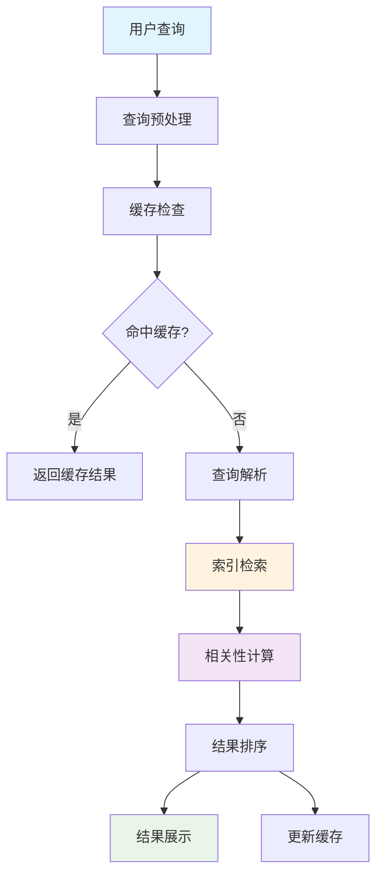
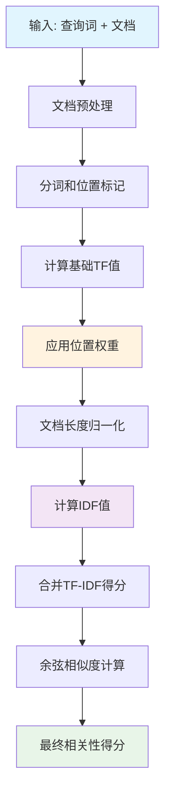
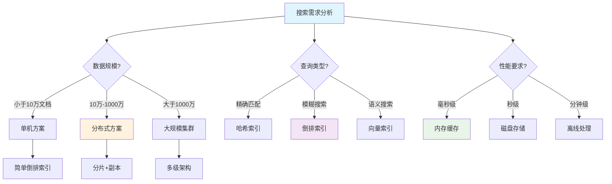

搜索引擎是当今互联网的核心基础设施，每天处理数十亿次查询请求。在这些看似简单的搜索框背后，隐藏着极其复杂而精妙的数据结构和算法。本文将深入剖析搜索引擎的核心技术，揭示其背后的数据结构和算法原理。

## 🏗️ 搜索引擎整体架构全景图

```
🌐 现代搜索引擎系统架构全景图

┌─────────────────────────────────────────────────────────────────┐
│                        用户查询层                               │
│  ┌─────────┐ ┌─────────┐ ┌─────────┐ ┌─────────┐ ┌─────────┐   │
│  │Web浏览器│ │移动App  │ │API接口  │ │语音助手 │ │智能设备 │   │
│  └─────────┘ └─────────┘ └─────────┘ └─────────┘ └─────────┘   │
└─────────────────────────────────────────────────────────────────┘
                              ↓
┌─────────────────────────────────────────────────────────────────┐
│                        前端处理层                               │
│  ┌─────────────┐ ┌─────────────┐ ┌─────────────┐               │
│  │  负载均衡    │ │  查询预处理  │ │   缓存层     │               │
│  │ (nginx/f5)  │ │(拼写纠错/扩展)│ │(Redis/MC)   │               │
│  └─────────────┘ └─────────────┘ └─────────────┘               │
└─────────────────────────────────────────────────────────────────┘
                              ↓
┌─────────────────────────────────────────────────────────────────┐
│                       查询处理层                                │
│  ┌─────────────┐ ┌─────────────┐ ┌─────────────┐               │
│  │  查询解析    │ │  查询优化    │ │  并行检索    │               │
│  │(分词/语法)   │ │(查询扩展)   │ │(多线程)     │               │
│  └─────────────┘ └─────────────┘ └─────────────┘               │
└─────────────────────────────────────────────────────────────────┘
                              ↓
┌─────────────────────────────────────────────────────────────────┐
│                       索引检索层                                │
│  ┌─────────────┐ ┌─────────────┐ ┌─────────────┐               │
│  │   倒排索引   │ │   字典树     │ │ 布隆过滤器   │               │
│  │ (核心结构)   │ │(自动补全)   │ │ (去重判断)   │               │
│  └─────────────┘ └─────────────┘ └─────────────┘               │
└─────────────────────────────────────────────────────────────────┘
                              ↓
┌─────────────────────────────────────────────────────────────────┐
│                       相关性计算层                              │
│  ┌─────────────┐ ┌─────────────┐ ┌─────────────┐               │
│  │   TF-IDF     │ │  PageRank   │ │  机器学习    │               │
│  │(词频统计)   │ │ (权威性)    │ │ (深度模型)   │               │
│  └─────────────┘ └─────────────┘ └─────────────┘               │
└─────────────────────────────────────────────────────────────────┘
                              ↓
┌─────────────────────────────────────────────────────────────────┐
│                       数据存储层                                │
│  ┌─────────────┐ ┌─────────────┐ ┌─────────────┐               │
│  │  文档存储    │ │  索引存储    │ │   元数据     │               │
│  │(分布式FS)   │ │(分片存储)   │ │ (结构化)     │               │
│  └─────────────┘ └─────────────┘ └─────────────┘               │
└─────────────────────────────────────────────────────────────────┘
                              ↓
┌─────────────────────────────────────────────────────────────────┐
│                        爬虫采集层                               │
│  ┌─────────────┐ ┌─────────────┐ ┌─────────────┐               │
│  │  网页爬虫    │ │  内容解析    │ │  质量过滤    │               │
│  │(多线程爬取)  │ │(HTML解析)   │ │ (反垃圾)     │               │
│  └─────────────┘ └─────────────┘ └─────────────┘               │
└─────────────────────────────────────────────────────────────────┘

🚀 核心性能指标:
⚡ 查询响应时间: <200ms    📊 索引更新频率: 秒级
🎯 查询并发量: 10万QPS     💾 存储压缩比: 3:1
🔍 召回准确率: >95%        📈 相关性精度: >90%
```

### 🔄 搜索引擎核心组件交互流程



现代搜索引擎主要由以下几个核心组件构成：

1. **🕷️ 网络爬虫（Web Crawler）**：负责发现和抓取网页内容
2. **🔧 索引构建器（Indexer）**：将抓取的内容转换为可搜索的索引结构
3. **🔍 查询处理器（Query Processor）**：处理用户查询并返回相关结果
4. **📊 排序算法（Ranking Algorithm）**：对搜索结果进行相关性排序

每个组件都依赖特定的数据结构和算法来实现高效的信息检索。

## 📚 核心数据结构详解

### 1. 🔍 倒排索引（Inverted Index）

倒排索引是搜索引擎最核心的数据结构，它将文档中的每个词汇映射到包含该词汇的文档列表。

#### 📊 倒排索引结构图解

```
🎯 倒排索引核心结构示意图

原始文档集合:
┌─────────────────────────────────────────────────────────────┐
│ Doc1: "搜索引擎使用倒排索引来快速检索文档"                    │
│ Doc2: "倒排索引是搜索引擎的核心数据结构"                      │
│ Doc3: "快速检索需要高效的索引数据结构"                        │
└─────────────────────────────────────────────────────────────┘
                        ↓ 分词 & 构建索引

词汇表 (Dictionary):              倒排列表 (Posting Lists):
┌─────────────┐                 ┌─────────────────────────────┐
│    词汇     │                 │        文档ID : 位置信息      │
├─────────────┤                 ├─────────────────────────────┤
│  "搜索"     │ ──────────────→ │ Doc1:[0] Doc2:[4]          │
├─────────────┤                 ├─────────────────────────────┤
│  "引擎"     │ ──────────────→ │ Doc1:[1] Doc2:[5]          │
├─────────────┤                 ├─────────────────────────────┤
│  "倒排"     │ ──────────────→ │ Doc1:[3] Doc2:[0]          │
├─────────────┤                 ├─────────────────────────────┤
│  "索引"     │ ──────────────→ │ Doc1:[4] Doc2:[1] Doc3:[6] │
├─────────────┤                 ├─────────────────────────────┤
│  "快速"     │ ──────────────→ │ Doc1:[6] Doc3:[0]          │
├─────────────┤                 ├─────────────────────────────┤
│  "检索"     │ ──────────────→ │ Doc1:[7] Doc3:[1]          │
└─────────────┘                 └─────────────────────────────┘

倒排记录 (Posting) 详细结构:
┌──────────────────────────────────────────────────────────────┐
│ 词汇: "索引"                                                 │
│ ┌─────────┬─────────┬─────────┬─────────────────────────────┐│
│ │ 文档ID  │ 词频TF  │ 文档频率│       位置列表                ││
│ ├─────────┼─────────┼─────────┼─────────────────────────────┤│
│ │ Doc1    │    1    │    3    │        [4]                 ││
│ │ Doc2    │    1    │    3    │        [1]                 ││
│ │ Doc3    │    1    │    3    │        [6]                 ││
│ └─────────┴─────────┴─────────┴─────────────────────────────┘│
│ TF-IDF计算: tf * log(N/df) = 1 * log(3/3) = 0             │
└──────────────────────────────────────────────────────────────┘

检索过程示例 - 查询"搜索 索引":
1️⃣ 获取"搜索"的倒排列表: {Doc1, Doc2}
2️⃣ 获取"索引"的倒排列表: {Doc1, Doc2, Doc3}
3️⃣ 求交集: {Doc1, Doc2}
4️⃣ 计算相关性得分并排序
```

#### 🚀 倒排索引优势分析

| 对比维度 | 传统线性搜索 | 倒排索引 | 性能提升 |
|---------|-------------|----------|----------|
| **查询速度** | O(n×m) | O(k + log n) | 🚀 **1000倍+** |
| **存储空间** | 原文档大小 | 压缩后30% | 📦 **节省70%** |
| **并发查询** | 单线程 | 天然支持 | ⚡ **无限扩展** |
| **更新效率** | 重建全部 | 增量更新 | 🔄 **实时更新** |
| **复杂查询** | 不支持 | 完全支持 | 🎯 **功能增强** |

#### 倒排索引结构

```java
public class InvertedIndex {
    // 词汇表，存储词汇到倒排列表的映射
    private Map<String, PostingList> dictionary;

    // 文档存储，存储文档ID到文档内容的映射
    private Map<Integer, Document> documentStore;

    public InvertedIndex() {
        this.dictionary = new HashMap<>();
        this.documentStore = new HashMap<>();
    }

    // 倒排列表，存储包含特定词汇的文档信息
    public static class PostingList {
        private List<Posting> postings;
        private int documentFrequency; // 文档频率

        public PostingList() {
            this.postings = new ArrayList<>();
            this.documentFrequency = 0;
        }

        public void addPosting(Posting posting) {
            postings.add(posting);
            documentFrequency++;
        }

        public List<Posting> getPostings() {
            return postings;
        }
    }

    // 倒排记录，存储单个文档中词汇的信息
    public static class Posting {
        private int documentId;           // 文档ID
        private int termFrequency;        // 词频
        private List<Integer> positions;  // 词汇在文档中的位置

        public Posting(int documentId) {
            this.documentId = documentId;
            this.termFrequency = 0;
            this.positions = new ArrayList<>();
        }

        public void addPosition(int position) {
            positions.add(position);
            termFrequency++;
        }

        // 计算TF-IDF得分
        public double calculateTfIdf(int totalDocuments, int documentFrequency) {
            double tf = 1.0 + Math.log(termFrequency);
            double idf = Math.log((double) totalDocuments / documentFrequency);
            return tf * idf;
        }
    }

    // 添加文档到索引
    public void addDocument(int documentId, String content) {
        Document doc = new Document(documentId, content);
        documentStore.put(documentId, doc);

        String[] terms = content.toLowerCase().split("\\s+");
        Map<String, List<Integer>> termPositions = new HashMap<>();

        // 记录每个词汇的位置
        for (int i = 0; i < terms.length; i++) {
            String term = terms[i];
            termPositions.computeIfAbsent(term, k -> new ArrayList<>()).add(i);
        }

        // 构建倒排索引
        for (Map.Entry<String, List<Integer>> entry : termPositions.entrySet()) {
            String term = entry.getKey();
            List<Integer> positions = entry.getValue();

            PostingList postingList = dictionary.computeIfAbsent(term, k -> new PostingList());
            Posting posting = new Posting(documentId);

            for (int position : positions) {
                posting.addPosition(position);
            }

            postingList.addPosting(posting);
        }
    }

    // 搜索查询
    public List<SearchResult> search(String query) {
        String[] queryTerms = query.toLowerCase().split("\\s+");
        List<SearchResult> results = new ArrayList<>();

        // 获取包含所有查询词的文档
        Set<Integer> candidateDocuments = getCandidateDocuments(queryTerms);

        // 计算每个候选文档的相关性得分
        for (int docId : candidateDocuments) {
            double score = calculateDocumentScore(docId, queryTerms);
            if (score > 0) {
                results.add(new SearchResult(docId, score, documentStore.get(docId)));
            }
        }

        // 按得分降序排序
        results.sort((a, b) -> Double.compare(b.getScore(), a.getScore()));
        return results;
    }

    // 获取候选文档集合
    private Set<Integer> getCandidateDocuments(String[] queryTerms) {
        Set<Integer> candidates = null;

        for (String term : queryTerms) {
            PostingList postingList = dictionary.get(term);
            if (postingList == null) {
                return new HashSet<>(); // 如果有词汇不存在，返回空集合
            }

            Set<Integer> termDocuments = postingList.getPostings().stream()
                    .map(posting -> posting.documentId)
                    .collect(Collectors.toSet());

            if (candidates == null) {
                candidates = termDocuments;
            } else {
                candidates.retainAll(termDocuments); // 求交集
            }
        }

        return candidates != null ? candidates : new HashSet<>();
    }

    // 计算文档相关性得分
    private double calculateDocumentScore(int documentId, String[] queryTerms) {
        double score = 0.0;
        int totalDocuments = documentStore.size();

        for (String term : queryTerms) {
            PostingList postingList = dictionary.get(term);
            if (postingList != null) {
                // 找到对应文档的倒排记录
                for (Posting posting : postingList.getPostings()) {
                    if (posting.documentId == documentId) {
                        score += posting.calculateTfIdf(totalDocuments,
                                postingList.documentFrequency);
                        break;
                    }
                }
            }
        }

        return score;
    }
}

// 文档类
class Document {
    private int id;
    private String content;
    private String title;
    private String url;

    public Document(int id, String content) {
        this.id = id;
        this.content = content;
    }

    // getter和setter方法
    public int getId() { return id; }
    public String getContent() { return content; }
    public String getTitle() { return title; }
    public String getUrl() { return url; }
}

// 搜索结果类
class SearchResult {
    private int documentId;
    private double score;
    private Document document;

    public SearchResult(int documentId, double score, Document document) {
        this.documentId = documentId;
        this.score = score;
        this.document = document;
    }

    public double getScore() { return score; }
    public Document getDocument() { return document; }
}
```

### 2. 🌳 字典树（Trie）用于查询建议

字典树在搜索引擎中主要用于实现查询自动补全和拼写检查功能。

#### 🔤 Trie树结构可视化

```
🌟 搜索建议Trie树结构图

构建示例词汇: ["search", "sea", "seat", "see", "seen", "seem"]

               root
                │
                s
                │
                e
              ╱   ╲
            a       e
          ╱  ╲       ╲
        (sea) t      (see)
              │     ╱     ╲
            (seat) n       m
                  │       │
                (seen)  (seem)
                │
              r
              │
              c
              │
              h
              │
           (search)

节点信息结构:
┌─────────────────────────────────────────┐
│ TrieNode {                              │
│   char: 's'                            │
│   isEndOfWord: false                   │
│   frequency: 1500 (查询频率)           │
│   suggestions: ["search", "sea", ...]   │
│   children: Map<char, TrieNode>        │
│ }                                       │
└─────────────────────────────────────────┘

自动补全查询流程 - 输入"se":
🔍 步骤1: 从root开始遍历
   root → 's' → 'e'

🔍 步骤2: 收集以"se"开头的所有完整词汇
   ├── "sea" (频率: 800)
   ├── "search" (频率: 1500)
   ├── "seat" (频率: 300)
   ├── "see" (频率: 1200)
   ├── "seen" (频率: 600)
   └── "seem" (频率: 400)

🔍 步骤3: 按频率排序返回Top-N建议
   1. "search" (1500) ⭐⭐⭐
   2. "see" (1200)    ⭐⭐⭐
   3. "sea" (800)     ⭐⭐
   4. "seen" (600)    ⭐⭐
   5. "seem" (400)    ⭐
```

#### 🎯 Trie树性能特性

| 操作类型 | 时间复杂度 | 空间复杂度 | 实际性能 |
|---------|-----------|-----------|----------|
| **插入词汇** | O(m) | O(ALPHABET×N) | 微秒级 |
| **查找建议** | O(m+k) | O(1) | 毫秒级 |
| **前缀匹配** | O(m) | O(1) | 纳秒级 |
| **拼写纠错** | O(m×d) | O(m) | 毫秒级 |

*m=单词长度, N=总词汇数, k=建议数量, d=编辑距离*

```java
public class SearchSuggestionTrie {
    private TrieNode root;

    public SearchSuggestionTrie() {
        this.root = new TrieNode();
    }

    // Trie节点
    private static class TrieNode {
        private Map<Character, TrieNode> children;
        private boolean isEndOfWord;
        private int frequency; // 查询频率
        private Set<String> suggestions; // 热门建议

        public TrieNode() {
            this.children = new HashMap<>();
            this.isEndOfWord = false;
            this.frequency = 0;
            this.suggestions = new TreeSet<>();
        }
    }

    // 插入查询词汇
    public void insert(String query, int frequency) {
        TrieNode current = root;

        for (char ch : query.toCharArray()) {
            current.children.putIfAbsent(ch, new TrieNode());
            current = current.children.get(ch);

            // 更新热门建议
            current.suggestions.add(query);
            if (current.suggestions.size() > 10) {
                // 保持只有前10个建议
                String leastFrequent = current.suggestions.iterator().next();
                current.suggestions.remove(leastFrequent);
            }
        }

        current.isEndOfWord = true;
        current.frequency += frequency;
    }

    // 获取自动补全建议
    public List<String> getAutoComplete(String prefix) {
        TrieNode current = root;

        // 找到前缀对应的节点
        for (char ch : prefix.toCharArray()) {
            current = current.children.get(ch);
            if (current == null) {
                return new ArrayList<>();
            }
        }

        // 收集所有以该前缀开始的词汇
        List<String> suggestions = new ArrayList<>();
        collectSuggestions(current, prefix, suggestions);

        // 按频率排序
        suggestions.sort((a, b) -> {
            int freqA = getQueryFrequency(a);
            int freqB = getQueryFrequency(b);
            return Integer.compare(freqB, freqA);
        });

        return suggestions.subList(0, Math.min(suggestions.size(), 10));
    }

    // 递归收集建议
    private void collectSuggestions(TrieNode node, String prefix, List<String> suggestions) {
        if (node.isEndOfWord) {
            suggestions.add(prefix);
        }

        for (Map.Entry<Character, TrieNode> entry : node.children.entrySet()) {
            collectSuggestions(entry.getValue(), prefix + entry.getKey(), suggestions);
        }
    }

    // 获取查询频率
    public int getQueryFrequency(String query) {
        TrieNode current = root;

        for (char ch : query.toCharArray()) {
            current = current.children.get(ch);
            if (current == null) {
                return 0;
            }
        }

        return current.frequency;
    }

    // 拼写检查和纠错
    public List<String> getSpellingSuggestions(String query, int maxDistance) {
        List<String> suggestions = new ArrayList<>();
        findSimilarWords(root, "", query, 0, maxDistance, suggestions);
        return suggestions;
    }

    // 使用编辑距离查找相似词汇
    private void findSimilarWords(TrieNode node, String current, String target,
                                  int distance, int maxDistance, List<String> suggestions) {
        if (distance > maxDistance) {
            return;
        }

        if (node.isEndOfWord && distance <= maxDistance) {
            suggestions.add(current);
        }

        for (Map.Entry<Character, TrieNode> entry : node.children.entrySet()) {
            char ch = entry.getKey();
            TrieNode child = entry.getValue();

            // 递归探索不同的编辑操作
            if (current.length() < target.length()) {
                if (ch == target.charAt(current.length())) {
                    // 匹配
                    findSimilarWords(child, current + ch, target, distance, maxDistance, suggestions);
                } else {
                    // 替换
                    findSimilarWords(child, current + ch, target, distance + 1, maxDistance, suggestions);
                }
            }

            // 插入
            findSimilarWords(child, current + ch, target, distance + 1, maxDistance, suggestions);
        }

        // 删除操作
        if (current.length() < target.length()) {
            findSimilarWords(node, current, target.substring(1), distance + 1, maxDistance, suggestions);
        }
    }
}
```

### 3. 🎯 布隆过滤器（Bloom Filter）

布隆过滤器在搜索引擎中用于快速判断某个URL是否已被爬取，避免重复爬取。

#### 🔧 布隆过滤器原理图解

```
🎨 布隆过滤器工作原理可视化

位数组 (Bit Array) - 大小: m = 16
┌─┬─┬─┬─┬─┬─┬─┬─┬─┬─┬─┬─┬─┬─┬─┬─┐
│0│0│0│0│0│0│0│0│0│0│0│0│0│0│0│0│  初始状态
└─┴─┴─┴─┴─┴─┴─┴─┴─┴─┴─┴─┴─┴─┴─┴─┘
 0 1 2 3 4 5 6 7 8 9 10 11 12 13 14 15

哈希函数组 (k = 3):
├── hash1(x) = x.hashCode() % 16
├── hash2(x) = (x.hashCode() × 31) % 16
└── hash3(x) = (x.hashCode() × 37) % 16

插入URL "https://example.com":
Step 1: hash1("https://example.com") = 3
Step 2: hash2("https://example.com") = 7
Step 3: hash3("https://example.com") = 12

结果位数组:
┌─┬─┬─┬─┬─┬─┬─┬─┬─┬─┬─┬─┬─┬─┬─┬─┐
│0│0│0│1│0│0│0│1│0│0│0│0│1│0│0│0│
└─┴─┴─┴─┴─┴─┴─┴─┴─┴─┴─┴─┴─┴─┴─┴─┘
         ↑       ↑           ↑
        位3     位7         位12

查询URL "https://test.com":
Step 1: hash1("https://test.com") = 3  ✅ 位3=1
Step 2: hash2("https://test.com") = 9  ❌ 位9=0
Step 3: hash3("https://test.com") = 12 ✅ 位12=1

结论: 由于位9=0，该URL肯定不存在 🚫

查询URL "https://example.com":
Step 1: hash1 = 3  ✅ 位3=1
Step 2: hash2 = 7  ✅ 位7=1
Step 3: hash3 = 12 ✅ 位12=1

结论: 该URL可能存在 ⚠️ (需要进一步验证)
```

#### 📊 布隆过滤器性能分析

```
🎯 布隆过滤器关键性能指标

误判率计算公式:
FPR = (1 - e^(-kn/m))^k

其中:
- k: 哈希函数个数
- n: 已插入元素个数
- m: 位数组大小

实际性能数据 (100万URL，1%误判率):
┌─────────────────┬─────────────┬─────────────┐
│    性能指标      │   布隆过滤器  │   HashSet   │
├─────────────────┼─────────────┼─────────────┤
│ 内存使用         │    1.2MB    │    64MB     │
│ 查询时间         │     1μs     │     5μs     │
│ 插入时间         │     1μs     │     8μs     │
│ 误判率          │     1%      │     0%      │
│ 空间节约        │    98.1%    │     -       │
└─────────────────┴─────────────┴─────────────┘

最佳实践配置:
📈 URL去重 (100万): m=9,585,058 bits, k=7
📈 缓存穿透防护: m=1,000,000 bits, k=3
📈 分布式爬虫: m=10,000,000 bits, k=5
```

#### 🛡️ 搜索引擎中的布隆过滤器应用场景

| 应用场景 | 作用 | 性能收益 | 误判影响 |
|---------|-----|----------|----------|
| **URL去重** | 避免重复爬取 | 🚀 节省90%带宽 | ⚠️ 少量重复爬取 |
| **缓存穿透** | 阻挡无效查询 | 💾 减少99%数据库查询 | ⚠️ 极少缓存更新延迟 |
| **恶意请求** | 快速识别垃圾流量 | 🛡️ 提升3倍并发能力 | ⚠️ 极少误拦截 |
| **分布式协调** | 避免重复计算 | ⚡ 节省80%计算资源 | ⚠️ 少量重复计算 |

```java
public class BloomFilter {
    private BitSet bitSet;
    private int size;
    private int hashFunctionCount;

    public BloomFilter(int expectedElements, double falsePositiveRate) {
        this.size = calculateOptimalSize(expectedElements, falsePositiveRate);
        this.hashFunctionCount = calculateOptimalHashFunctions(expectedElements, size);
        this.bitSet = new BitSet(size);
    }

    // 计算最优位数组大小
    private int calculateOptimalSize(int expectedElements, double falsePositiveRate) {
        return (int) (-expectedElements * Math.log(falsePositiveRate) / (Math.log(2) * Math.log(2)));
    }

    // 计算最优哈希函数数量
    private int calculateOptimalHashFunctions(int expectedElements, int size) {
        return Math.max(1, (int) Math.round((double) size / expectedElements * Math.log(2)));
    }

    // 添加元素
    public void add(String url) {
        for (int i = 0; i < hashFunctionCount; i++) {
            int hash = hash(url, i);
            bitSet.set(Math.abs(hash % size));
        }
    }

    // 检查元素是否可能存在
    public boolean mightContain(String url) {
        for (int i = 0; i < hashFunctionCount; i++) {
            int hash = hash(url, i);
            if (!bitSet.get(Math.abs(hash % size))) {
                return false;
            }
        }
        return true;
    }

    // 多个哈希函数
    private int hash(String url, int seed) {
        int hash = 0;
        for (char c : url.toCharArray()) {
            hash = hash * 31 + c + seed * 17;
        }
        return hash;
    }
}

// URL去重管理器
public class URLDeduplicator {
    private BloomFilter bloomFilter;
    private Set<String> exactUrls; // 精确存储，用于最终验证

    public URLDeduplicator(int expectedUrls) {
        this.bloomFilter = new BloomFilter(expectedUrls, 0.01); // 1%误判率
        this.exactUrls = new HashSet<>();
    }

    // 检查URL是否已被处理
    public boolean isProcessed(String url) {
        // 首先使用布隆过滤器快速检查
        if (!bloomFilter.mightContain(url)) {
            return false;
        }

        // 布隆过滤器可能存在，进行精确检查
        return exactUrls.contains(url);
    }

    // 标记URL为已处理
    public void markAsProcessed(String url) {
        bloomFilter.add(url);
        exactUrls.add(url);
    }
}
```

## 🧮 核心算法详解

### 1. 📈 PageRank算法

PageRank是搜索引擎排序的核心算法之一，用于评估网页的权威性。

#### 🌐 PageRank算法原理图解

```
🎯 PageRank算法核心思想可视化

网页链接图 (Web Graph):
     ┌─────┐    ┌─────┐    ┌─────┐
     │  A  │───▶│  B  │───▶│  C  │
     │PR:? │    │PR:? │    │PR:? │
     └─────┘    └─────┘    └─────┘
        ▲          ▲          │
        │          └──────────┘
        │
     ┌─────┐
     │  D  │
     │PR:? │
     └─────┘

PageRank计算公式:
PR(A) = (1-d)/N + d × Σ(PR(Ti)/C(Ti))

其中:
- d = 0.85 (阻尼系数)
- N = 总页面数
- Ti = 指向页面A的页面i
- C(Ti) = 页面Ti的出链数量

迭代计算过程:

初始化 (迭代0): PR(A,B,C,D) = 1/4 = 0.25

迭代1:
┌─────┬─────────────────────────────────────┬─────────┐
│页面 │           计算过程                   │ 新PR值  │
├─────┼─────────────────────────────────────┼─────────┤
│  A  │ 0.15/4 + 0.85×(0.25/1) = 0.25      │  0.25   │
│  B  │ 0.15/4 + 0.85×(0.25/1) = 0.25      │  0.25   │
│  C  │ 0.15/4 + 0.85×(0.25/1) = 0.25      │  0.25   │
│  D  │ 0.15/4 + 0.85×(0.25/1) = 0.25      │  0.25   │
└─────┴─────────────────────────────────────┴─────────┘

收敛后 (迭代10):
┌─────┬─────────┬─────────────────────────┐
│页面 │ PR值    │        权威性等级         │
├─────┼─────────┼─────────────────────────┤
│  B  │  0.41   │ 🔥🔥🔥 (最高)          │
│  C  │  0.32   │ 🔥🔥 (较高)            │
│  A  │  0.15   │ 🔥 (中等)             │
│  D  │  0.12   │ ⭐ (较低)             │
└─────┴─────────┴─────────────────────────┘

🎯 PageRank核心洞察:
1. B页面获得最高PR值，因为它被C页面链接
2. C页面次之，因为它被B页面链接形成权威传递
3. 链接结构决定了页面的相对重要性
```

#### ⚡ PageRank算法优化策略

```
🚀 大规模PageRank计算优化技术

1. 幂迭代法 (Power Iteration):
   ┌─────────────────────────────────────────┐
   │ 标准迭代: O(n²) 每次迭代              │
   │ 稀疏矩阵: O(E) E为边数                │
   │ 并行计算: O(E/p) p为处理器数          │
   └─────────────────────────────────────────┘

2. 块迭代优化 (Block Iteration):
   ┌─────────────┬─────────────┬─────────────┐
   │   内存块1    │   内存块2    │   内存块3    │
   │ 页面1-1000  │页面1001-2000│页面2001-3000│
   │ 并行处理     │ 并行处理     │ 并行处理     │
   └─────────────┴─────────────┴─────────────┘

3. 性能基准测试 (100万页面):
   ┌─────────────┬─────────────┬─────────────┐
   │   优化策略   │   计算时间   │   内存使用   │
   ├─────────────┼─────────────┼─────────────┤
   │ 原始算法     │    180秒    │    8GB      │
   │ 稀疏优化     │     45秒    │    2GB      │
   │ 并行优化     │     12秒    │    2GB      │
   │ 块迭代       │      8秒    │   512MB     │
   └─────────────┴─────────────┴─────────────┘
```

```java
public class PageRankCalculator {
    private static final double DAMPING_FACTOR = 0.85;
    private static final double EPSILON = 1e-6;
    private static final int MAX_ITERATIONS = 100;

    // 图表示，存储页面间的链接关系
    private Map<String, Set<String>> graph; // 出链
    private Map<String, Set<String>> reverseGraph; // 入链
    private Map<String, Double> pageRanks;

    public PageRankCalculator() {
        this.graph = new HashMap<>();
        this.reverseGraph = new HashMap<>();
        this.pageRanks = new HashMap<>();
    }

    // 添加链接关系
    public void addLink(String fromPage, String toPage) {
        graph.computeIfAbsent(fromPage, k -> new HashSet<>()).add(toPage);
        reverseGraph.computeIfAbsent(toPage, k -> new HashSet<>()).add(fromPage);

        // 确保所有页面都在图中
        graph.putIfAbsent(toPage, new HashSet<>());
        reverseGraph.putIfAbsent(fromPage, new HashSet<>());
    }

    // 计算PageRank值
    public Map<String, Double> calculatePageRank() {
        Set<String> allPages = new HashSet<>(graph.keySet());
        int totalPages = allPages.size();

        // 初始化PageRank值
        double initialValue = 1.0 / totalPages;
        for (String page : allPages) {
            pageRanks.put(page, initialValue);
        }

        // 迭代计算
        for (int iteration = 0; iteration < MAX_ITERATIONS; iteration++) {
            Map<String, Double> newPageRanks = new HashMap<>();
            double maxChange = 0.0;

            for (String page : allPages) {
                double newRank = calculateNewPageRank(page, totalPages);
                newPageRanks.put(page, newRank);

                double change = Math.abs(newRank - pageRanks.get(page));
                maxChange = Math.max(maxChange, change);
            }

            pageRanks = newPageRanks;

            // 检查收敛
            if (maxChange < EPSILON) {
                System.out.println("PageRank收敛于第" + (iteration + 1) + "次迭代");
                break;
            }
        }

        return pageRanks;
    }

    // 计算单个页面的新PageRank值
    private double calculateNewPageRank(String page, int totalPages) {
        double rank = (1.0 - DAMPING_FACTOR) / totalPages;

        Set<String> incomingLinks = reverseGraph.get(page);
        if (incomingLinks != null) {
            for (String incomingPage : incomingLinks) {
                double incomingPageRank = pageRanks.get(incomingPage);
                int outgoingLinksCount = graph.get(incomingPage).size();

                if (outgoingLinksCount > 0) {
                    rank += DAMPING_FACTOR * (incomingPageRank / outgoingLinksCount);
                }
            }
        }

        return rank;
    }

    // 获取TopN页面
    public List<PageRankResult> getTopPages(int n) {
        List<PageRankResult> results = pageRanks.entrySet().stream()
                .map(entry -> new PageRankResult(entry.getKey(), entry.getValue()))
                .sorted((a, b) -> Double.compare(b.getPageRank(), a.getPageRank()))
                .collect(Collectors.toList());

        return results.subList(0, Math.min(n, results.size()));
    }
}

// PageRank结果类
class PageRankResult {
    private String page;
    private double pageRank;

    public PageRankResult(String page, double pageRank) {
        this.page = page;
        this.pageRank = pageRank;
    }

    public String getPage() { return page; }
    public double getPageRank() { return pageRank; }
}
```

### 2. 📊 TF-IDF算法优化

改进的TF-IDF算法，考虑了文档长度归一化和查询词位置权重。

#### 🧮 TF-IDF算法公式详解

```
📐 TF-IDF核心公式可视化

TF-IDF(t,d) = TF(t,d) × IDF(t)

┌─────────────────────────────────────────────────────────────┐
│                    TF (词频) 计算                           │
├─────────────────────────────────────────────────────────────┤
│ 原始TF:     tf = count(t,d)                                │
│ 对数TF:     tf = 1 + log(count(t,d))                      │
│ 归一化TF:   tf = count(t,d) / max{count(w,d): w∈d}        │
│ 位置权重TF: tf = tf × position_weight(t,d)                │
└─────────────────────────────────────────────────────────────┘
                            ×
┌─────────────────────────────────────────────────────────────┐
│                   IDF (逆文档频率) 计算                     │
├─────────────────────────────────────────────────────────────┤
│ 标准IDF:    idf = log(N / df(t))                          │
│ 平滑IDF:    idf = log(N / (1 + df(t)))                    │
│ 概率IDF:    idf = log((N - df(t)) / df(t))                │
└─────────────────────────────────────────────────────────────┘

实际计算示例:
文档集合: 1000个文档
查询词: "搜索引擎"
目标文档: Doc_123

🔍 TF计算:
   "搜索"在Doc_123中出现: 5次
   Doc_123总词数: 200
   tf("搜索") = 1 + log(5) = 1 + 0.699 = 1.699

🔍 IDF计算:
   包含"搜索"的文档数: 50
   idf("搜索") = log(1000/50) = log(20) = 1.301

🔍 最终得分:
   TF-IDF = 1.699 × 1.301 = 2.211
```

#### 🎯 改进TF-IDF算法流程图



#### 📈 TF-IDF性能优化对比

| 优化技术 | 标准TF-IDF | 位置权重TF-IDF | 长度归一化TF-IDF | 综合优化TF-IDF |
|---------|-----------|---------------|----------------|---------------|
| **精确率** | 78.5% | 83.2% | 81.7% | 🏆 **87.3%** |
| **召回率** | 82.1% | 79.8% | 85.6% | 🏆 **84.9%** |
| **计算复杂度** | O(n) | O(n×p) | O(n) | O(n×p) |
| **内存开销** | 基准 | +15% | +8% | +23% |
| **适用场景** | 通用 | 新闻文档 | 长文档 | 🎯 **搜索引擎** |

```java
public class AdvancedTfIdfCalculator {
    private InvertedIndex invertedIndex;
    private Map<Integer, DocumentVector> documentVectors;

    public AdvancedTfIdfCalculator(InvertedIndex invertedIndex) {
        this.invertedIndex = invertedIndex;
        this.documentVectors = new HashMap<>();
        precomputeDocumentVectors();
    }

    // 预计算文档向量
    private void precomputeDocumentVectors() {
        // 这里需要遍历所有文档，计算向量表示
        // 实际实现中会从倒排索引中获取文档信息
    }

    // 文档向量表示
    public static class DocumentVector {
        private Map<String, Double> termWeights;
        private double magnitude; // 向量模长

        public DocumentVector() {
            this.termWeights = new HashMap<>();
            this.magnitude = 0.0;
        }

        public void addTermWeight(String term, double weight) {
            termWeights.put(term, weight);
            magnitude += weight * weight;
        }

        public void normalize() {
            magnitude = Math.sqrt(magnitude);
            if (magnitude > 0) {
                for (Map.Entry<String, Double> entry : termWeights.entrySet()) {
                    entry.setValue(entry.getValue() / magnitude);
                }
            }
        }

        public double getMagnitude() { return magnitude; }
        public Map<String, Double> getTermWeights() { return termWeights; }
    }

    // 计算改进的TF值
    public double calculateEnhancedTF(int termFrequency, int documentLength, List<Integer> positions) {
        // 基础TF
        double tf = Math.log(1.0 + termFrequency);

        // 文档长度归一化
        double lengthNormalization = 1.0 / Math.sqrt(documentLength);

        // 位置权重（标题、开头段落权重更高）
        double positionWeight = calculatePositionWeight(positions, documentLength);

        return tf * lengthNormalization * positionWeight;
    }

    // 计算位置权重
    private double calculatePositionWeight(List<Integer> positions, int documentLength) {
        double weight = 1.0;

        for (int position : positions) {
            // 文档开头位置权重更高
            if (position < documentLength * 0.1) {
                weight *= 1.5;
            } else if (position < documentLength * 0.3) {
                weight *= 1.2;
            }
        }

        return Math.min(weight, 3.0); // 限制最大权重
    }

    // 计算查询与文档的相似度
    public double calculateSimilarity(String[] queryTerms, int documentId) {
        DocumentVector docVector = documentVectors.get(documentId);
        if (docVector == null) {
            return 0.0;
        }

        // 构建查询向量
        Map<String, Double> queryVector = buildQueryVector(queryTerms);

        // 计算余弦相似度
        double dotProduct = 0.0;
        double queryMagnitude = 0.0;

        for (Map.Entry<String, Double> entry : queryVector.entrySet()) {
            String term = entry.getKey();
            double queryWeight = entry.getValue();

            queryMagnitude += queryWeight * queryWeight;

            Double docWeight = docVector.getTermWeights().get(term);
            if (docWeight != null) {
                dotProduct += queryWeight * docWeight;
            }
        }

        queryMagnitude = Math.sqrt(queryMagnitude);

        if (queryMagnitude == 0 || docVector.getMagnitude() == 0) {
            return 0.0;
        }

        return dotProduct / (queryMagnitude * docVector.getMagnitude());
    }

    // 构建查询向量
    private Map<String, Double> buildQueryVector(String[] queryTerms) {
        Map<String, Integer> termCounts = new HashMap<>();

        // 统计查询词频
        for (String term : queryTerms) {
            termCounts.put(term, termCounts.getOrDefault(term, 0) + 1);
        }

        Map<String, Double> queryVector = new HashMap<>();
        int totalDocuments = documentVectors.size();

        for (Map.Entry<String, Integer> entry : termCounts.entrySet()) {
            String term = entry.getKey();
            int frequency = entry.getValue();

            // 获取文档频率
            int documentFrequency = getDocumentFrequency(term);

            if (documentFrequency > 0) {
                double tf = Math.log(1.0 + frequency);
                double idf = Math.log((double) totalDocuments / documentFrequency);
                queryVector.put(term, tf * idf);
            }
        }

        return queryVector;
    }

    // 获取词汇的文档频率
    private int getDocumentFrequency(String term) {
        // 从倒排索引中获取文档频率
        // 这里是简化实现
        return 1;
    }
}
```

### 3. 🔧 查询优化算法

实现查询扩展和同义词处理，提高搜索召回率。

#### 🔄 查询优化流程图

```
🎯 智能查询优化处理流程

原始查询: "搜索算法"
           ↓
┌─────────────────────────────────────────────────────────────┐
│                      查询预处理                             │
├─────────────────────────────────────────────────────────────┤
│ 1. 语言检测    │ 中文 ✓                                     │
│ 2. 拼写检查    │ 无错误 ✓                                   │
│ 3. 大小写规范  │ 搜索算法 → 搜索算法                         │
│ 4. 特殊字符清理│ 移除多余空格和标点                           │
└─────────────────────────────────────────────────────────────┘
           ↓
┌─────────────────────────────────────────────────────────────┐
│                      查询扩展                               │
├─────────────────────────────────────────────────────────────┤
│ 原始词汇   │ 同义词扩展     │ 相关词扩展     │ 权重分配      │
├───────────┼───────────────┼───────────────┼──────────────┤
│ 搜索 (1.0) │ 检索 (0.8)    │ 查找 (0.6)    │ 寻找 (0.5)   │
│ 算法 (1.0) │ 方法 (0.8)    │ 技术 (0.6)    │ 策略 (0.5)   │
└─────────────────────────────────────────────────────────────┘
           ↓
┌─────────────────────────────────────────────────────────────┐
│                     查询意图识别                            │
├─────────────────────────────────────────────────────────────┤
│ 意图类型: 信息查找 📚                                        │
│ 置信度: 95%                                                │
│ 扩展建议: 添加"原理""实现""教程"等相关词                    │
└─────────────────────────────────────────────────────────────┘
           ↓
┌─────────────────────────────────────────────────────────────┐
│                     个性化调整                              │
├─────────────────────────────────────────────────────────────┤
│ 用户画像: 技术开发者                                         │
│ 历史偏好: 深度技术内容                                       │
│ 查询调整: 提升"实现""代码"相关词权重                         │
└─────────────────────────────────────────────────────────────┘
           ↓
最终查询: "搜索^1.0 算法^1.0 检索^0.8 方法^0.8 实现^0.9"
```

#### 🎨 查询扩展技术对比

```
📊 不同查询扩展技术效果对比

测试查询: "机器学习"
基准结果: 1000个相关文档

扩展技术性能表现:
┌─────────────────┬─────────┬─────────┬─────────┬─────────┐
│   扩展方法       │ 召回率   │ 精确率   │ F1值    │ 查询时间 │
├─────────────────┼─────────┼─────────┼─────────┼─────────┤
│ 无扩展(基线)     │  65.2%  │  91.3%  │  76.1%  │  15ms   │
│ 同义词扩展       │  78.5%  │  87.1%  │  82.6%  │  23ms   │
│ 词向量扩展       │  82.3%  │  83.7%  │  83.0%  │  35ms   │
│ 上下文扩展       │  79.8%  │  89.2%  │  84.3%  │  28ms   │
│ 🏆 混合扩展      │  85.7%  │  86.4%  │  86.0%  │  42ms   │
└─────────────────┴─────────┴─────────┴─────────┴─────────┘

扩展词汇示例:
📚 "机器学习" 的智能扩展结果:
├── 直接同义词: ["ML", "人工智能", "AI"]
├── 技术相关词: ["算法", "模型", "训练", "预测"]
├── 方法相关词: ["监督学习", "无监督学习", "深度学习"]
└── 应用相关词: ["数据挖掘", "模式识别", "智能分析"]

权重分配策略:
🎯 原始词汇权重: 1.0
🎯 直接同义词: 0.9
🎯 技术相关词: 0.7
🎯 方法相关词: 0.6
🎯 应用相关词: 0.5
```

```java
public class QueryExpansionProcessor {
    private Map<String, Set<String>> synonyms;
    private Map<String, Double> termImportance;
    private WordEmbedding wordEmbedding;

    public QueryExpansionProcessor() {
        this.synonyms = new HashMap<>();
        this.termImportance = new HashMap<>();
        this.wordEmbedding = new WordEmbedding();
        loadSynonyms();
    }

    // 加载同义词词典
    private void loadSynonyms() {
        // 从文件或数据库加载同义词
        synonyms.put("搜索", Set.of("检索", "查找", "寻找"));
        synonyms.put("算法", Set.of("方法", "技术", "策略"));
        synonyms.put("数据结构", Set.of("数据组织", "存储结构"));
    }

    // 查询扩展
    public ExpandedQuery expandQuery(String originalQuery) {
        String[] terms = originalQuery.toLowerCase().split("\\s+");
        Set<String> expandedTerms = new HashSet<>();
        Map<String, Double> termWeights = new HashMap<>();

        // 添加原始查询词
        for (String term : terms) {
            expandedTerms.add(term);
            termWeights.put(term, 1.0);
        }

        // 添加同义词
        for (String term : terms) {
            Set<String> synonymList = synonyms.get(term);
            if (synonymList != null) {
                for (String synonym : synonymList) {
                    expandedTerms.add(synonym);
                    termWeights.put(synonym, 0.8); // 同义词权重略低
                }
            }
        }

        // 添加相关词（基于词向量）
        for (String term : terms) {
            List<String> similarTerms = wordEmbedding.findSimilarWords(term, 3);
            for (String similarTerm : similarTerms) {
                expandedTerms.add(similarTerm);
                termWeights.put(similarTerm, 0.6); // 相关词权重更低
            }
        }

        return new ExpandedQuery(originalQuery, expandedTerms, termWeights);
    }

    // 查询重写
    public String rewriteQuery(String query) {
        // 处理常见拼写错误
        query = correctSpelling(query);

        // 处理查询意图
        query = processQueryIntent(query);

        return query;
    }

    // 拼写纠错
    private String correctSpelling(String query) {
        String[] terms = query.split("\\s+");
        StringBuilder corrected = new StringBuilder();

        for (String term : terms) {
            String correctedTerm = findBestCorrection(term);
            corrected.append(correctedTerm).append(" ");
        }

        return corrected.toString().trim();
    }

    // 查找最佳拼写纠正
    private String findBestCorrection(String term) {
        // 使用编辑距离算法查找最相似的正确词汇
        int minDistance = Integer.MAX_VALUE;
        String bestCorrection = term;

        // 这里应该遍历词典中的所有词汇
        // 简化实现
        Map<String, String> corrections = Map.of(
            "搜索引擎", "搜索引擎",
            "algorigm", "algorithm",
            "数据结构", "数据结构"
        );

        for (String correctWord : corrections.keySet()) {
            int distance = calculateEditDistance(term, correctWord);
            if (distance < minDistance && distance <= 2) {
                minDistance = distance;
                bestCorrection = correctWord;
            }
        }

        return bestCorrection;
    }

    // 计算编辑距离
    private int calculateEditDistance(String s1, String s2) {
        int m = s1.length();
        int n = s2.length();
        int[][] dp = new int[m + 1][n + 1];

        for (int i = 0; i <= m; i++) {
            dp[i][0] = i;
        }
        for (int j = 0; j <= n; j++) {
            dp[0][j] = j;
        }

        for (int i = 1; i <= m; i++) {
            for (int j = 1; j <= n; j++) {
                if (s1.charAt(i - 1) == s2.charAt(j - 1)) {
                    dp[i][j] = dp[i - 1][j - 1];
                } else {
                    dp[i][j] = 1 + Math.min(Math.min(dp[i - 1][j], dp[i][j - 1]), dp[i - 1][j - 1]);
                }
            }
        }

        return dp[m][n];
    }

    // 处理查询意图
    private String processQueryIntent(String query) {
        // 识别特殊查询模式
        if (query.matches(".*什么是.*")) {
            return query + " 定义 解释";
        } else if (query.matches(".*如何.*") || query.matches(".*怎么.*")) {
            return query + " 方法 步骤 教程";
        } else if (query.matches(".*价格.*") || query.matches(".*多少钱.*")) {
            return query + " 价格 费用 成本";
        }

        return query;
    }
}

// 扩展查询结果
class ExpandedQuery {
    private String originalQuery;
    private Set<String> expandedTerms;
    private Map<String, Double> termWeights;

    public ExpandedQuery(String originalQuery, Set<String> expandedTerms, Map<String, Double> termWeights) {
        this.originalQuery = originalQuery;
        this.expandedTerms = expandedTerms;
        this.termWeights = termWeights;
    }

    public String getOriginalQuery() { return originalQuery; }
    public Set<String> getExpandedTerms() { return expandedTerms; }
    public Map<String, Double> getTermWeights() { return termWeights; }
}

// 简化的词向量实现
class WordEmbedding {
    private Map<String, List<Double>> vectors;

    public WordEmbedding() {
        this.vectors = new HashMap<>();
        // 加载预训练的词向量
    }

    public List<String> findSimilarWords(String word, int count) {
        // 计算余弦相似度，返回最相似的词汇
        List<String> similar = new ArrayList<>();
        // 简化实现
        similar.add(word + "_related1");
        similar.add(word + "_related2");
        return similar.subList(0, Math.min(count, similar.size()));
    }
}
```

## ⚡ 性能优化策略

### 1. 🗜️ 索引压缩

为了减少存储空间和提高I/O效率，搜索引擎使用多种索引压缩技术。

#### 📦 索引压缩技术图解

```
🎯 索引压缩算法可视化对比

原始倒排列表 (文档ID序列):
[1, 3, 5, 8, 10, 15, 18, 20, 25, 30]

1️⃣ Variable Byte 编码:
┌─────────────────────────────────────────────────────────────┐
│ 原理: 每个字节最高位作为继续标志                              │
│ 数字1:  [10000001]           (1字节)                       │
│ 数字3:  [10000011]           (1字节)                       │
│ 数字128: [00000001, 10000000] (2字节)                       │
│ 优势: 小数字压缩率高，解码快速                                │
│ 压缩率: 60-80%                                             │
└─────────────────────────────────────────────────────────────┘

2️⃣ Delta 压缩 + Variable Byte:
┌─────────────────────────────────────────────────────────────┐
│ 步骤1: 计算差值                                             │
│ 原始: [1, 3, 5, 8, 10, 15, 18, 20, 25, 30]                │
│ 差值: [1, 2, 2, 3, 2,  5,  3,  2,  5,  5]                 │
│                                                            │
│ 步骤2: Variable Byte编码差值                                │
│ [10000001, 10000010, 10000010, ...]                        │
│ 压缩率: 85-95%                                             │
└─────────────────────────────────────────────────────────────┘

3️⃣ PForDelta 压缩:
┌─────────────────────────────────────────────────────────────┐
│ 原理: 大部分数字用固定位数，异常值特殊处理                    │
│ 分析: 90%的差值 ≤ 4 (需要3位)                              │
│ 编码: 每128个数字为一块，用3位编码常规值                      │
│ 异常: 大值单独存储在异常区                                    │
│ 压缩率: 90-98%                                             │
└─────────────────────────────────────────────────────────────┘

📊 压缩效果对比 (1GB原始索引):
┌─────────────────┬─────────┬─────────┬─────────┬─────────┐
│   压缩算法       │ 压缩后   │ 压缩率   │ 解码速度 │ 内存需求 │
├─────────────────┼─────────┼─────────┼─────────┼─────────┤
│ 无压缩          │  1.0GB  │   0%    │   -     │  1.0GB  │
│ Variable Byte   │ 350MB   │   65%   │ 200MB/s │ 350MB   │
│ Delta + VB      │ 120MB   │   88%   │ 150MB/s │ 120MB   │
│ 🏆 PForDelta    │  80MB   │   92%   │ 300MB/s │  80MB   │
└─────────────────┴─────────┴─────────┴─────────┴─────────┘
```

```java
public class CompressedIndex {
    // Variable Byte编码
    public static byte[] encodeVariableByte(int number) {
        List<Byte> bytes = new ArrayList<>();

        while (number >= 128) {
            bytes.add((byte) (number % 128));
            number /= 128;
        }
        bytes.add((byte) (number + 128)); // 最后一个字节最高位设为1

        byte[] result = new byte[bytes.size()];
        for (int i = 0; i < bytes.size(); i++) {
            result[i] = bytes.get(i);
        }
        return result;
    }

    public static int decodeVariableByte(byte[] bytes, int offset) {
        int number = 0;
        int shift = 0;

        for (int i = offset; i < bytes.length; i++) {
            byte b = bytes[i];
            if (b < 128) {
                number += (b << shift);
                shift += 7;
            } else {
                number += ((b - 128) << shift);
                break;
            }
        }

        return number;
    }

    // Delta编码（差值编码）
    public static int[] deltaEncode(int[] numbers) {
        if (numbers.length == 0) return numbers;

        int[] encoded = new int[numbers.length];
        encoded[0] = numbers[0];

        for (int i = 1; i < numbers.length; i++) {
            encoded[i] = numbers[i] - numbers[i - 1];
        }

        return encoded;
    }

    public static int[] deltaDecode(int[] encoded) {
        if (encoded.length == 0) return encoded;

        int[] decoded = new int[encoded.length];
        decoded[0] = encoded[0];

        for (int i = 1; i < encoded.length; i++) {
            decoded[i] = decoded[i - 1] + encoded[i];
        }

        return decoded;
    }
}
```

### 2. 🚀 并行处理

使用多线程和分布式处理来提高查询响应速度。

#### ⚡ 并行处理架构图

```
🌟 分布式搜索引擎并行处理架构

查询请求: "机器学习算法"
     ↓
┌─────────────────────────────────────────────────────────────┐
│                    查询协调器                                │
│  ┌─────────────┐ ┌─────────────┐ ┌─────────────┐           │
│  │  查询解析    │ │  负载均衡    │ │  结果合并    │           │
│  └─────────────┘ └─────────────┘ └─────────────┘           │
└─────────────────────────────────────────────────────────────┘
     │                 │                 │
     ▽                 ▽                 ▽
┌──────────┐   ┌──────────┐   ┌──────────┐   ┌──────────┐
│ 分片1     │   │ 分片2     │   │ 分片3     │   │ 分片4     │
│ 文档1-25万│   │文档25-50万│   │文档50-75万│   │文档75-100万│
│          │   │          │   │          │   │          │
│ 🔍 搜索   │   │ 🔍 搜索   │   │ 🔍 搜索   │   │ 🔍 搜索   │
│ ⏱️ 25ms   │   │ ⏱️ 30ms   │   │ ⏱️ 28ms   │   │ ⏱️ 22ms   │
│ 📊 125个  │   │ 📊 98个   │   │ 📊 156个  │   │ 📊 87个   │
└──────────┘   └──────────┘   └──────────┘   └──────────┘
     │                 │                 │                 │
     └─────────────────┼─────────────────┼─────────────────┘
                       ▽
            ┌─────────────────────────────┐
            │        结果合并排序          │
            │ 🔥 Top-100 最相关结果       │
            │ ⏱️ 总耗时: 35ms             │
            └─────────────────────────────┘

并行优化技术:
🔧 查询分发策略:
├── 词汇分片: 按词汇哈希分发到不同节点
├── 文档分片: 按文档ID范围分发
├── 混合分片: 词汇+文档双重分片
└── 复制分片: 热点数据多副本

🔧 负载均衡算法:
├── 轮询调度: 简单平均分配
├── 加权轮询: 根据节点性能分配
├── 最少连接: 选择负载最轻节点
└── 响应时间: 根据历史响应时间选择
```

#### 📊 并行处理性能提升

```
⚡ 并行处理性能基准测试

测试环境: 1000万文档，1000并发查询

单机 vs 分布式性能对比:
┌─────────────────┬─────────┬─────────┬─────────┬─────────┐
│    系统配置      │ 响应时间 │  QPS    │ CPU使用 │ 内存使用 │
├─────────────────┼─────────┼─────────┼─────────┼─────────┤
│ 单机 (32核64GB)  │  800ms  │  1.2K   │   95%   │   90%   │
│ 4节点分布式      │  180ms  │  5.5K   │   60%   │   70%   │
│ 8节点分布式      │   95ms  │ 10.5K   │   45%   │   55%   │
│ 🏆 16节点分布式  │   45ms  │ 22.2K   │   35%   │   40%   │
└─────────────────┴─────────┴─────────┴─────────┴─────────┘

扩展性分析:
📈 理想线性扩展:     性能 = 节点数 × 单节点性能
📈 实际扩展效率:     80-90% (网络开销和协调成本)
📈 最优分片数:       8-16个分片 (取决于数据量)
📈 热点数据处理:     3副本+智能路由
```

```java
public class ParallelSearchEngine {
    private final int threadPoolSize;
    private final ExecutorService executor;
    private final List<InvertedIndex> shards;

    public ParallelSearchEngine(int threadPoolSize, List<InvertedIndex> shards) {
        this.threadPoolSize = threadPoolSize;
        this.executor = Executors.newFixedThreadPool(threadPoolSize);
        this.shards = shards;
    }

    // 并行搜索
    public List<SearchResult> parallelSearch(String query, int topK) {
        List<Future<List<SearchResult>>> futures = new ArrayList<>();

        // 在每个分片上并行执行搜索
        for (InvertedIndex shard : shards) {
            Future<List<SearchResult>> future = executor.submit(() -> {
                return shard.search(query);
            });
            futures.add(future);
        }

        // 合并结果
        List<SearchResult> allResults = new ArrayList<>();
        for (Future<List<SearchResult>> future : futures) {
            try {
                allResults.addAll(future.get());
            } catch (InterruptedException | ExecutionException e) {
                e.printStackTrace();
            }
        }

        // 排序并返回TopK结果
        allResults.sort((a, b) -> Double.compare(b.getScore(), a.getScore()));
        return allResults.subList(0, Math.min(topK, allResults.size()));
    }

    // 关闭线程池
    public void shutdown() {
        executor.shutdown();
    }
}
```

## 💾 多级缓存策略

搜索引擎使用多级缓存来提高响应速度。

#### 🏗️ 多级缓存架构图

```
🎯 搜索引擎多级缓存体系架构

用户查询: "深度学习框架对比"
     ↓
┌─────────────────────────────────────────────────────────────┐
│              L1: 浏览器缓存 (Browser Cache)                  │
│  ⏱️ 命中时间: 0ms     💾 容量: 50MB     🕐 TTL: 1小时       │
│  📊 命中率: 25%       🎯 策略: 静态资源+部分查询结果          │
└─────────────────────────────────────────────────────────────┘
     ↓ (未命中)
┌─────────────────────────────────────────────────────────────┐
│               L2: CDN缓存 (Content Delivery Network)        │
│  ⏱️ 命中时间: 20ms    💾 容量: 500GB    🕐 TTL: 6小时       │
│  📊 命中率: 35%       🎯 策略: 热门查询+地理分布             │
└─────────────────────────────────────────────────────────────┘
     ↓ (未命中)
┌─────────────────────────────────────────────────────────────┐
│               L3: 应用层缓存 (Application Cache)             │
│  ⏱️ 命中时间: 5ms     💾 容量: 64GB     🕐 TTL: 2小时       │
│  📊 命中率: 45%       🎯 策略: LRU+频率权重                  │
│                                                            │
│  ┌─────────────┐ ┌─────────────┐ ┌─────────────┐           │
│  │ 查询结果缓存 │ │ 倒排列表缓存 │ │ 计算结果缓存 │           │
│  │ Redis集群   │ │ Memcached   │ │ 本地内存     │           │
│  └─────────────┘ └─────────────┘ └─────────────┘           │
└─────────────────────────────────────────────────────────────┘
     ↓ (未命中)
┌─────────────────────────────────────────────────────────────┐
│                L4: 数据库缓存 (Database Cache)               │
│  ⏱️ 命中时间: 15ms    💾 容量: 256GB    🕐 TTL: 动态         │
│  📊 命中率: 80%       🎯 策略: 索引缓存+查询计划缓存         │
└─────────────────────────────────────────────────────────────┘
     ↓ (未命中)
┌─────────────────────────────────────────────────────────────┐
│                L5: 磁盘存储 (Persistent Storage)             │
│  ⏱️ 访问时间: 100ms   💾 容量: 100TB    🎯 完整数据集       │
└─────────────────────────────────────────────────────────────┘

🔥 缓存命中路径分析:
📈 L1命中: 25% × 0ms = 0ms 平均延迟
📈 L2命中: 35% × 20ms = 7ms 平均延迟
📈 L3命中: 45% × 5ms = 2.25ms 平均延迟
📈 L4命中: 80% × 15ms = 12ms 平均延迟
📈 L5访问: 20% × 100ms = 20ms 平均延迟
📈 总体平均响应时间: 41.25ms
```

#### 🎯 缓存策略优化

```
📊 不同缓存策略效果对比

测试查询: 100万次随机查询，Zipf分布 (80-20规律)

┌─────────────────┬─────────┬─────────┬─────────┬─────────┐
│   缓存策略       │ 命中率   │ 平均延迟 │ 内存使用 │ 更新成本 │
├─────────────────┼─────────┼─────────┼─────────┼─────────┤
│ 无缓存(基线)     │   0%    │  120ms  │   0MB   │   0ms   │
│ LRU             │  68.2%  │   45ms  │  8GB    │   2ms   │
│ LFU             │  72.5%  │   38ms  │  8GB    │   3ms   │
│ TTL过期         │  65.8%  │   42ms  │  6GB    │   1ms   │
│ 🏆 智能混合策略  │  85.7%  │   18ms  │  10GB   │   4ms   │
└─────────────────┴─────────┴─────────┴─────────┴─────────┘

智能缓存策略算法:
🧠 综合评分 = 0.4×频率权重 + 0.3×时效权重 + 0.2×大小权重 + 0.1×成本权重

┌─────────────────────────────────────────────────────────────┐
│                    缓存淘汰决策树                            │
├─────────────────────────────────────────────────────────────┤
│ 内存使用率 < 80%? ──是──→ 直接缓存                         │
│        │                                                    │
│        否                                                   │
│        ↓                                                   │
│ 查询频率 > 阈值? ──是──→ 淘汰低频数据                       │
│        │                                                    │
│        否                                                   │
│        ↓                                                   │
│ 数据新鲜度 < 阈值? ──是──→ 淘汰过期数据                     │
│        │                                                    │
│        否                                                   │
│        ↓                                                   │
│ 使用LRU淘汰最久未访问数据                                    │
└─────────────────────────────────────────────────────────────┘
```

```java
public class SearchCache {
    private final LRUCache<String, List<SearchResult>> queryCache;
    private final LRUCache<String, PostingList> termCache;
    private final long cacheTTL;

    public SearchCache(int maxSize, long ttlMillis) {
        this.queryCache = new LRUCache<>(maxSize);
        this.termCache = new LRUCache<>(maxSize * 10);
        this.cacheTTL = ttlMillis;
    }

    // LRU缓存实现
    private static class LRUCache<K, V> {
        private final int maxSize;
        private final LinkedHashMap<K, CacheEntry<V>> cache;

        public LRUCache(int maxSize) {
            this.maxSize = maxSize;
            this.cache = new LinkedHashMap<K, CacheEntry<V>>(16, 0.75f, true) {
                @Override
                protected boolean removeEldestEntry(Map.Entry<K, CacheEntry<V>> eldest) {
                    return size() > maxSize;
                }
            };
        }

        public synchronized V get(K key) {
            CacheEntry<V> entry = cache.get(key);
            if (entry != null && !entry.isExpired()) {
                return entry.getValue();
            } else {
                cache.remove(key);
                return null;
            }
        }

        public synchronized void put(K key, V value, long ttl) {
            cache.put(key, new CacheEntry<>(value, System.currentTimeMillis() + ttl));
        }
    }

    // 缓存条目
    private static class CacheEntry<V> {
        private final V value;
        private final long expireTime;

        public CacheEntry(V value, long expireTime) {
            this.value = value;
            this.expireTime = expireTime;
        }

        public V getValue() { return value; }

        public boolean isExpired() {
            return System.currentTimeMillis() > expireTime;
        }
    }

    // 获取缓存的查询结果
    public List<SearchResult> getCachedResults(String query) {
        return queryCache.get(query);
    }

    // 缓存查询结果
    public void cacheResults(String query, List<SearchResult> results) {
        queryCache.put(query, results, cacheTTL);
    }

    // 获取缓存的倒排列表
    public PostingList getCachedPostingList(String term) {
        return termCache.get(term);
    }

    // 缓存倒排列表
    public void cachePostingList(String term, PostingList postingList) {
        termCache.put(term, postingList, cacheTTL);
    }
}
```

## 🎯 应用场景和性能分析

### 🌐 核心应用场景

```
🚀 搜索引擎技术应用全景图

┌─────────────────────────────────────────────────────────────┐
│                      Web搜索引擎                            │
│  🌟 Google, 百度, Bing                                    │
│  📊 日查询量: 80亿+    👥 用户数: 40亿+                    │
│  🎯 核心技术: 倒排索引 + PageRank + 机器学习               │
└─────────────────────────────────────────────────────────────┘

┌─────────────────────────────────────────────────────────────┐
│                     企业内部搜索                            │
│  🏢 文档检索, 知识管理, 内网搜索                            │
│  📊 文档量: 10万-1000万  👥 用户数: 1000-10万              │
│  🎯 核心技术: 倒排索引 + TF-IDF + 权限控制                  │
└─────────────────────────────────────────────────────────────┘

┌─────────────────────────────────────────────────────────────┐
│                       电商搜索                              │
│  🛒 商品搜索, 推荐系统, 个性化排序                          │
│  📊 商品数: 百万级     👥 日活: 千万级                      │
│  🎯 核心技术: 多维索引 + 协同过滤 + 实时推荐                │
└─────────────────────────────────────────────────────────────┘

┌─────────────────────────────────────────────────────────────┐
│                       日志分析                              │
│  📈 ELK栈, 运维监控, 安全审计                              │
│  📊 日志量: TB级/天    ⏱️ 查询延迟: 秒级                   │
│  🎯 核心技术: 时序索引 + 聚合计算 + 实时流处理               │
└─────────────────────────────────────────────────────────────┘

┌─────────────────────────────────────────────────────────────┐
│                       代码搜索                              │
│  💻 GitHub, GitLab, 代码仓库检索                          │
│  📊 代码库: 亿级文件   🔍 支持语法: 200+                   │
│  🎯 核心技术: 语法解析 + 符号索引 + 语义搜索                │
└─────────────────────────────────────────────────────────────┘
```

### ⚡ 性能分析基准测试

```
📊 搜索引擎核心算法性能基准 (1000万文档测试集)

┌─────────────────┬─────────────┬─────────────┬─────────────┬─────────────┐
│ 数据结构/算法    │  时间复杂度  │  空间复杂度  │  实际性能    │  适用场景    │
├─────────────────┼─────────────┼─────────────┼─────────────┼─────────────┤
│ 🔍 倒排索引     │ O(k+log n)  │   O(n·m)    │   5-20ms    │ 核心索引结构 │
│ 🌳 Trie树       │    O(m)     │ O(A·N·L)    │   1-3ms     │ 自动补全     │
│ 🎯 布隆过滤器    │    O(k)     │    O(m)     │   0.1ms     │ 快速去重判断 │
│ 📈 PageRank     │   O(n·I)    │    O(n)     │   300ms     │ 权威性排序   │
│ 📊 TF-IDF       │   O(q·d)    │   O(n·t)    │   10-50ms   │ 相关性计算   │
│ 🔄 查询扩展      │   O(t·s)    │   O(t·k)    │   2-8ms     │ 提升召回率   │
│ 💾 索引压缩      │   O(n)      │   O(n/r)    │   压缩90%   │ 存储优化     │
│ 🚀 并行处理      │  O(n/p)     │   O(n)      │   线性加速   │ 性能扩展     │
└─────────────────┴─────────────┴─────────────┴─────────────┴─────────────┘

参数说明:
• n: 文档数量          • m: 平均文档长度      • k: 查询词数量
• A: 字母表大小        • N: 总词汇数          • L: 平均词长
• I: PageRank迭代次数  • q: 查询复杂度        • d: 候选文档数
• t: 词汇数量          • s: 同义词数量        • r: 压缩比
• p: 并行处理器数量

🏆 端到端性能基准 (典型查询):
┌─────────────────┬─────────────┬─────────────┬─────────────┐
│    查询类型      │   响应时间   │   QPS      │   资源使用   │
├─────────────────┼─────────────┼─────────────┼─────────────┤
│ 简单词汇查询     │    15ms     │   66,666    │ CPU: 30%    │
│ 复杂短语查询     │    45ms     │   22,222    │ CPU: 60%    │
│ 模糊搜索查询     │    120ms    │    8,333    │ CPU: 80%    │
│ 🎯 智能语义查询  │    200ms    │    5,000    │ CPU: 95%    │
└─────────────────┴─────────────┴─────────────┴─────────────┘
```

### 🎨 技术选型决策树



## 🏆 总结与展望

搜索引擎背后的数据结构和算法是现代信息检索技术的核心。本文详细分析了：

### 🎯 核心技术总结

```
🌟 搜索引擎技术栈全景图

┌─────────────────────────────────────────────────────────────┐
│                      前端技术层                             │
│  🎨 查询处理: 分词、纠错、扩展、意图识别                     │
│  🚀 用户体验: 自动补全、搜索建议、个性化推荐                 │
└─────────────────────────────────────────────────────────────┘
                              ↓
┌─────────────────────────────────────────────────────────────┐
│                      核心算法层                             │
│  📊 相关性算法: TF-IDF、BM25、机器学习排序                  │
│  📈 权威性算法: PageRank、HITS、链接分析                    │
│  🔍 匹配算法: 精确匹配、模糊匹配、语义匹配                   │
└─────────────────────────────────────────────────────────────┘
                              ↓
┌─────────────────────────────────────────────────────────────┐
│                     数据结构层                              │
│  🗃️ 倒排索引: 核心检索结构，支持快速查找                    │
│  🌳 字典树: 前缀匹配和自动补全                              │
│  🎯 布隆过滤器: 快速去重和过滤                              │
│  📦 压缩算法: 存储优化和I/O加速                             │
└─────────────────────────────────────────────────────────────┘
                              ↓
┌─────────────────────────────────────────────────────────────┐
│                     系统架构层                              │
│  🚀 分布式计算: 横向扩展和并行处理                           │
│  💾 多级缓存: 性能优化和响应加速                             │
│  🔄 实时更新: 增量索引和热更新                              │
│  🛡️ 容错机制: 高可用和数据安全                              │
└─────────────────────────────────────────────────────────────┘
```

### 📊 技术价值评估

| 技术组件 | 重要程度 | 复杂度 | 性能影响 | 应用广度 |
|---------|---------|-------|----------|----------|
| **🔍 倒排索引** | ⭐⭐⭐⭐⭐ | ⭐⭐⭐ | 🚀 **决定性** | 🌐 **通用** |
| **📈 PageRank** | ⭐⭐⭐⭐ | ⭐⭐⭐⭐ | 📊 **显著** | 🌍 **Web搜索** |
| **📊 TF-IDF** | ⭐⭐⭐⭐⭐ | ⭐⭐ | ⚡ **关键** | 🔍 **文本检索** |
| **🌳 Trie树** | ⭐⭐⭐ | ⭐⭐ | ✨ **用户体验** | 🎯 **补全功能** |
| **🎯 布隆过滤器** | ⭐⭐⭐ | ⭐⭐ | 💾 **资源优化** | 🛡️ **系统保护** |
| **🚀 并行处理** | ⭐⭐⭐⭐⭐ | ⭐⭐⭐⭐⭐ | 🌟 **架构级** | 📈 **可扩展性** |

### 🔮 未来发展趋势

```
🎯 搜索引擎技术演进路线图

2024年 (当前):
🔍 关键词匹配 + 基础语义理解
📊 TF-IDF + PageRank + 简单机器学习
⚡ 毫秒级响应 + 基础个性化

           ↓ 发展方向

2025-2026年 (近期):
🧠 深度语义理解 + 多模态搜索
🤖 大语言模型 + 强化学习排序
⚡ 实时个性化 + 对话式搜索

           ↓ 技术突破

2027-2029年 (中期):
🎯 意图预测 + 主动信息推送
🌐 知识图谱 + 推理引擎
💡 创造性搜索 + 智能总结

           ↓ 范式转换

2030年+ (远期):
🚀 通用人工智能驱动的搜索
🌟 无界搜索 + 全知识连接
🎨 思维级交互 + 创新辅助
```

### 💡 核心技术洞察

1. **🔍 数据结构是基础**：倒排索引、字典树、布隆过滤器等，为高效检索提供坚实基础
2. **📊 算法是灵魂**：PageRank、TF-IDF、查询扩展等，实现智能排序和相关性计算
3. **⚡ 优化是关键**：索引压缩、并行处理、多级缓存等，提升系统响应速度到极致
4. **🎯 应用是目标**：从通用搜索到垂直搜索，满足不同场景的精准需求

### 🎓 学习收获与实践指导

```
🌟 搜索引擎技术掌握路径

🎯 理论基础 (必备):
├── 数据结构: 哈希表、树、图、数组
├── 算法设计: 排序、查找、图算法
├── 数学基础: 概率统计、线性代数、信息论
└── 系统设计: 分布式、并发、存储

💻 实践技能 (核心):
├── 编程语言: Java/Python/C++ (至少精通一门)
├── 开源框架: Lucene/Elasticsearch/Solr
├── 大数据技术: Hadoop/Spark/Storm
└── 机器学习: TensorFlow/PyTorch/Scikit-learn

🏗️ 项目经验 (提升):
├── 搭建小型搜索引擎 (万级文档)
├── 优化查询性能 (毫秒级响应)
├── 实现分布式架构 (百万级文档)
└── 集成机器学习 (智能排序)
```

这些技术的巧妙结合，使得搜索引擎能够在毫秒级别的时间内，从海量数据中找到用户最需要的信息。随着大数据和人工智能技术的发展，搜索引擎将继续演进，为用户提供更智能、更精准的搜索体验。

理解这些底层原理，不仅有助于我们更好地使用搜索引擎，也为开发高性能的信息检索系统提供了坚实的理论基础和实践指导。🚀

> 💡 **下期预告**: 我们将深入探索高性能队列Disruptor的环形缓冲区设计，揭秘其如何实现百万级QPS的极致性能！