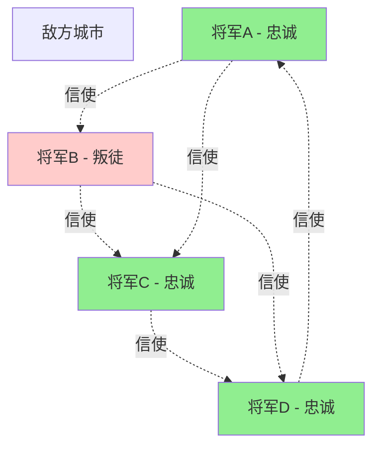
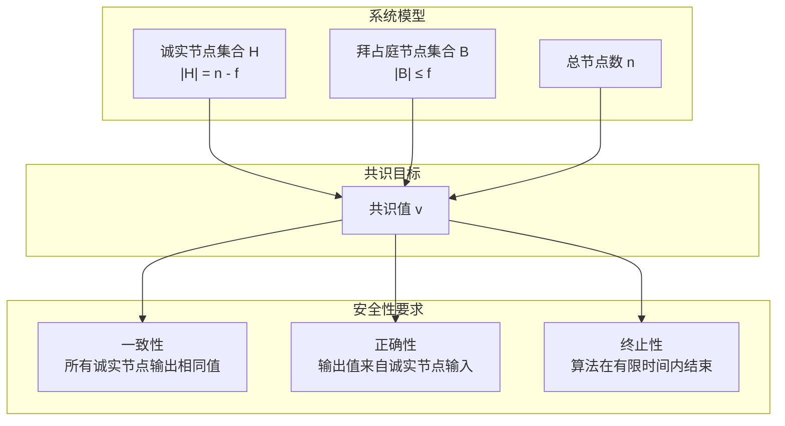
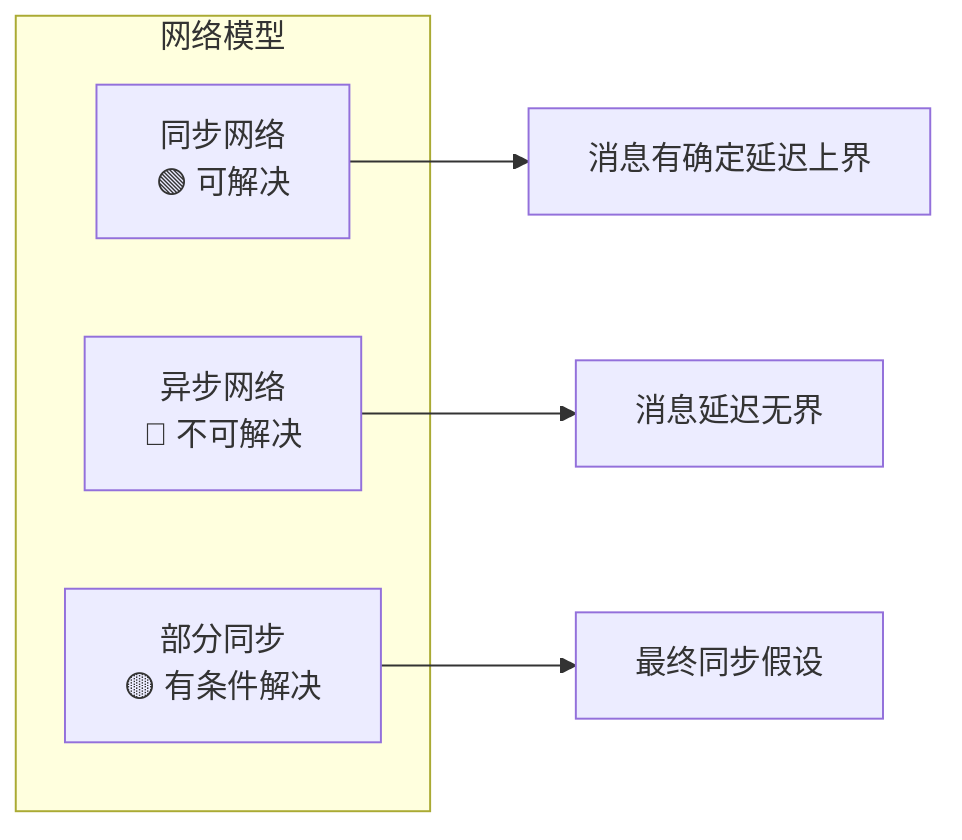
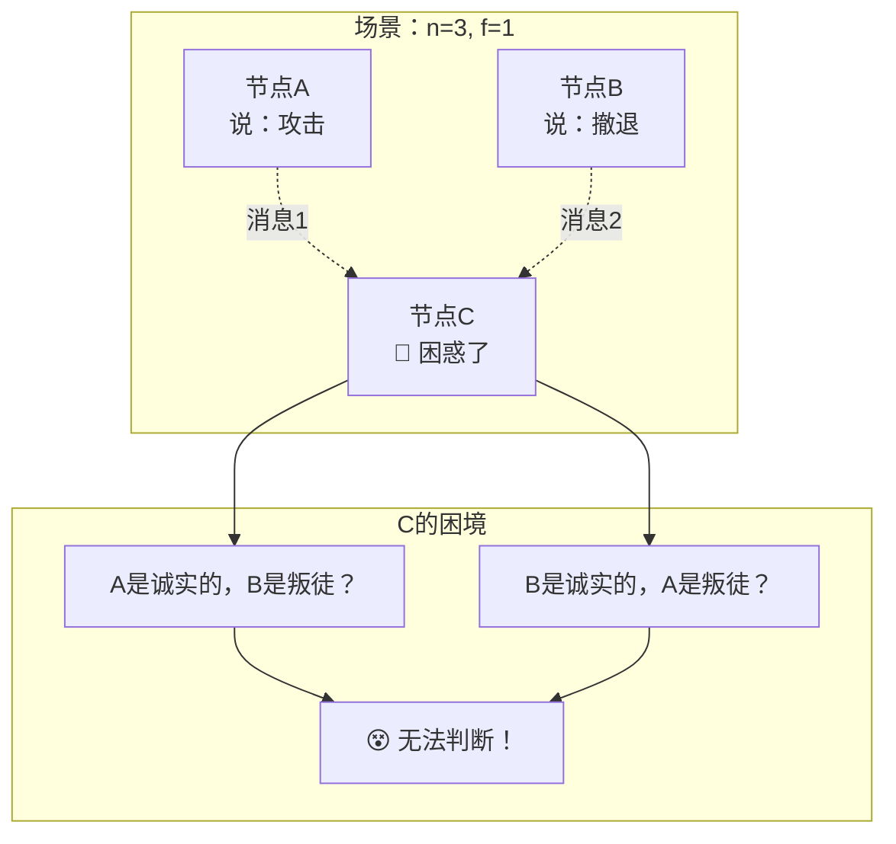
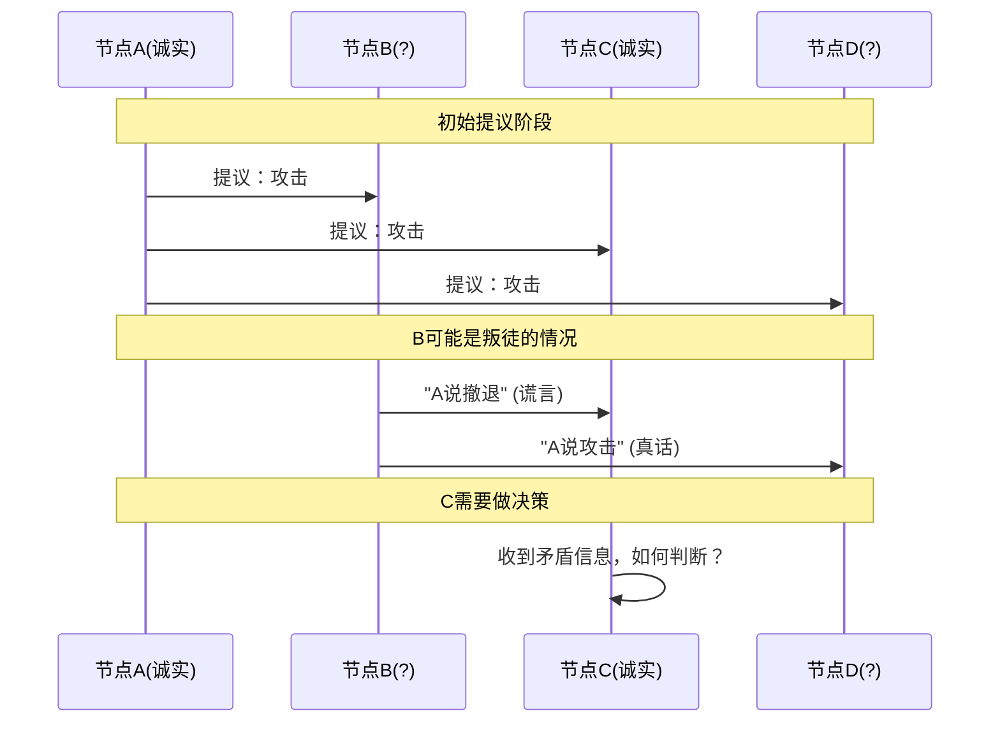
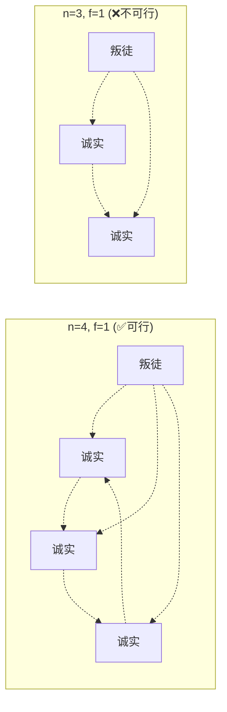

## 引言

想象一下，你正在使用支付宝转账给朋友，但是网络中存在恶意攻击者试图篡改交易信息。如何确保你的转账能够安全、准确地完成？这就是拜占庭将军问题要解决的核心挑战。

拜占庭将军问题是分布式计算中最经典的问题之一，它用一个生动的军事隐喻描述了在存在恶意节点的分布式系统中如何达成共识的挑战。这个问题不仅是理论研究的基石，更是现代区块链、分布式数据库、云计算等系统设计的核心考量。

### 为什么要了解拜占庭将军问题？

- 🌐 **互联网安全**：理解网络中恶意节点的威胁
- 💰 **数字货币**：区块链共识机制的理论基础
- 🏢 **企业应用**：分布式数据库的一致性保证
- 🛡️ **系统设计**：构建容错分布式系统的指导原则

## 问题描述

### 📚 经典故事：拜占庭帝国的军事难题

公元1000年，拜占庭帝国的将军们围攻一座敌方城市。他们面临一个生死攸关的决策：



### 🎯 核心挑战

| 约束条件 | 具体含义 | 现实对应 |
|---------|----------|----------|
| 🔄 **分布式通信** | 将军们只能通过信使传递消息 | 网络节点间的消息传递 |
| 🎭 **恶意节点** | 部分将军可能是叛徒，发送虚假信息 | 系统中的恶意攻击者 |
| 🤝 **一致性要求** | 忠诚的将军必须达成一致决策 | 分布式系统的状态同步 |
| ⏰ **时间限制** | 必须在有限时间内做出决策 | 系统响应时间要求 |

### 🌍 现代应用场景

**区块链网络**
```
节点A (诚实) ←→ 节点B (恶意)
    ↕              ↕
节点C (诚实) ←→ 节点D (诚实)

问题：如何确保诚实节点对交易达成共识？
```

**分布式数据库**
```
数据库1 ←→ 数据库2 (故障)
    ↕           ↕
数据库3 ←→ 数据库4

问题：如何保证数据的一致性和完整性？
```

### 🔬 形式化定义



### 🧮 数学表示

设分布式系统有 `n` 个节点，其中最多有 `f` 个拜占庭故障节点：

```
系统参数：
• n：总节点数
• f：最大拜占庭故障节点数
• H：诚实节点集合，|H| = n - f
• B：拜占庭节点集合，|B| ≤ f

共识属性：
• Agreement：∀i,j ∈ H，decision_i = decision_j
• Validity：如果所有诚实节点输入相同值v，则决策值为v
• Termination：所有诚实节点最终都会产生决策
```

## 🧠 理论分析

### 🚫 不可能性定理（FLP定理）

**发现者**：Fischer, Lynch, Paterson (1985)

**定理内容**：在异步网络中，即使只有一个节点可能故障，也不存在既保证安全性又保证活性的确定性共识算法。



### 📏 容错边界分析

#### 🔢 神奇的"3f+1"公式

拜占庭容错系统必须满足：**n ≥ 3f + 1**

| 网络类型 | 容错条件 | 说明 |
|---------|----------|------|
| 🔄 **同步网络** | n ≥ 3f + 1 | 消息传递有时间上界 |
| ⚡ **异步网络** | 不可能 | FLP定理限制 |
| 🌓 **部分同步** | n ≥ 3f + 1 + 额外假设 | 最终同步或故障检测 |

#### 🤔 为什么是"3f+1"而不是"2f+1"？

让我们用一个直观的例子来理解：



**结论**：3个节点无法容忍1个拜占庭故障！

### 🧮 数学证明：为什么需要 n ≥ 3f + 1？

#### 📋 证明思路

**步骤1：基本约束**
```
诚实节点数 > 拜占庭节点数
n - f > f
因此：n > 2f
```

**步骤2：信息传递复杂性**

考虑一个更复杂的场景：



**步骤3：最坏情况分析**

假设系统被分为两部分，拜占庭节点可能向两部分发送不同的消息：

```
情况1：网络分区
┌─────────────┐    ┌─────────────┐
│   组 X      │    │    组 Y     │
│ 诚实: a个   │    │  诚实: b个  │
│ 拜占庭: f个 │    │  拜占庭: 0个│
└─────────────┘    └─────────────┘

其中：a + b = n - f, a ≥ f (组X能够检测拜占庭行为)

为了保证每组都能正确工作：
a ≥ f 且 b ≥ f
因此：a + b ≥ 2f
即：n - f ≥ 2f
所以：n ≥ 3f
```

**步骤4：边界条件**

实际上需要严格大于：**n ≥ 3f + 1**

#### 🎨 直观理解



## 💡 解决方案大全

拜占庭将军问题催生了多种巧妙的解决方案，每种方案都有其特定的应用场景和优势。让我们从最基础的算法开始，逐步探索更先进的解决方案。

### 1. 口头消息算法 (OM算法)

**基本思想**：通过多轮消息传递，让每个节点收集足够信息做出决策。

```java
import java.util.*;
import java.util.concurrent.ThreadLocalRandom;

public class ByzantineGeneralsOM {
    private int n; // 总节点数
    private int f; // 最大拜占庭节点数
    private Set<Integer> byzantineNodes;

    public ByzantineGeneralsOM(int n, int f) {
        this.n = n;
        this.f = f;
        this.byzantineNodes = new HashSet<>();
    }

    /**
     * OM(m)算法实现
     * @param commanderValue 指挥官的初始值
     * @param m 轮数，通常设置为f
     * @return 共识结果
     */
    public int oralMessage(int commanderValue, int m) {
        if (m == 0) {
            // 基础情况：直接返回指挥官的值
            return commanderValue;
        }

        // 第一轮：指挥官向所有副官发送值
        Map<Integer, Integer> messages = new HashMap<>();
        for (int i = 1; i < n; i++) {
            // 模拟可能的拜占庭行为
            if (isByzantine(0)) { // 如果指挥官是拜占庭的
                messages.put(i, byzantineValue(i));
            } else {
                messages.put(i, commanderValue);
            }
        }

        // 后续轮次：递归处理
        Map<Integer, Integer> results = new HashMap<>();
        for (int i = 1; i < n; i++) {
            if (!isByzantine(i)) {
                // 诚实节点运行OM(m-1)
                results.put(i, oralMessage(messages.get(i), m - 1));
            }
        }

        return majorityVote(results);
    }

    /**
     * 多数投票决策
     */
    private int majorityVote(Map<Integer, Integer> values) {
        Map<Integer, Integer> voteCount = new HashMap<>();
        for (Integer value : values.values()) {
            voteCount.put(value, voteCount.getOrDefault(value, 0) + 1);
        }

        return voteCount.entrySet().stream()
            .max(Map.Entry.comparingByValue())
            .map(Map.Entry::getKey)
            .orElse(0);
    }

    /**
     * 检查节点是否为拜占庭节点
     */
    private boolean isByzantine(int nodeId) {
        return byzantineNodes.contains(nodeId);
    }

    /**
     * 拜占庭节点发送的恶意值
     */
    private int byzantineValue(int targetNode) {
        // 拜占庭节点可能发送不同的值给不同节点
        return ThreadLocalRandom.current().nextInt(2);
    }

    public void setByzantineNodes(Set<Integer> nodes) {
        this.byzantineNodes = nodes;
    }

    // 使用示例
    public static void main(String[] args) {
        int n = 4, f = 1; // 4个节点，最多1个拜占庭节点
        ByzantineGeneralsOM bg = new ByzantineGeneralsOM(n, f);
        bg.setByzantineNodes(Set.of(3)); // 节点3是拜占庭节点

        int result = bg.oralMessage(1, f);
        System.out.println("共识结果: " + result);
    }
}
```

**算法流程图**：

```
OM(m)算法流程：

轮次0：指挥官 → 所有副官
┌─────┐    1    ┌─────┐
│ 将军0│ ──────→ │ 将军1│
│(指挥)│    1    │     │
└─────┘ ──────→ ┌─────┐
   │       1    │ 将军2│
   └──────────→ │     │
              └─────┘

轮次1：每个副官作为指挥官
将军1 → {将军2}: 值1
将军2 → {将军1}: 值1

决策阶段：
将军1收到: [1(来自指挥官), 1(来自将军2)]
将军2收到: [1(来自指挥官), 1(来自将军1)]
→ 共识：攻击(1)
```

### 2. 签名消息算法 (SM算法)

引入数字签名机制，提高效率和安全性：

```java
import java.security.*;
import java.security.spec.PKCS8EncodedKeySpec;
import java.security.spec.X509EncodedKeySpec;
import java.util.*;
import java.util.stream.Collectors;
import javax.crypto.Cipher;

class SignatureEntry {
    private int signerId;
    private String signature;

    public SignatureEntry(int signerId, String signature) {
        this.signerId = signerId;
        this.signature = signature;
    }

    public int getSignerId() { return signerId; }
    public String getSignature() { return signature; }
}

class SignedMessage {
    private int value;
    private int senderId;
    private List<SignatureEntry> signatureChain;

    public SignedMessage(int value, int senderId) {
        this.value = value;
        this.senderId = senderId;
        this.signatureChain = new ArrayList<>();
    }

    public SignedMessage(int value, int senderId, List<SignatureEntry> chain) {
        this.value = value;
        this.senderId = senderId;
        this.signatureChain = new ArrayList<>(chain);
    }

    /**
     * 为消息添加数字签名
     */
    public SignedMessage sign(PrivateKey privateKey, int signerId) throws Exception {
        // 创建消息摘要
        String messageData = String.format("{value:%d,senderId:%d,chainSize:%d}",
                                          value, senderId, signatureChain.size());

        // 生成签名
        Signature signature = Signature.getInstance("SHA256withRSA");
        signature.initSign(privateKey);
        signature.update(messageData.getBytes());
        byte[] signatureBytes = signature.sign();

        // 添加到签名链
        signatureChain.add(new SignatureEntry(signerId,
                          Base64.getEncoder().encodeToString(signatureBytes)));

        return this;
    }

    public int getValue() { return value; }
    public int getSenderId() { return senderId; }
    public List<SignatureEntry> getSignatureChain() { return signatureChain; }
}

public class ByzantineGeneralsSM {
    private int n;
    private int f;
    private Map<Integer, KeyPair> keyPairs;
    private Set<Integer> byzantineNodes;

    public ByzantineGeneralsSM(int n, int f) throws Exception {
        this.n = n;
        this.f = f;
        this.byzantineNodes = new HashSet<>();
        generateKeys();
    }

    /**
     * 为每个节点生成公私钥对
     */
    private void generateKeys() throws Exception {
        keyPairs = new HashMap<>();
        KeyPairGenerator keyGen = KeyPairGenerator.getInstance("RSA");
        keyGen.initialize(2048);

        for (int i = 0; i < n; i++) {
            KeyPair keyPair = keyGen.generateKeyPair();
            keyPairs.put(i, keyPair);
        }
    }

    /**
     * SM算法实现
     */
    public Map<Integer, Integer> signedMessageAlgorithm(int commanderValue, int commanderId)
            throws Exception {

        // 第一阶段：指挥官签名并广播
        SignedMessage initialMessage = new SignedMessage(commanderValue, commanderId);
        initialMessage.sign(keyPairs.get(commanderId).getPrivate(), commanderId);

        // 模拟消息传播
        Map<Integer, List<SignedMessage>> nodeMessages = new HashMap<>();
        for (int i = 0; i < n; i++) {
            nodeMessages.put(i, new ArrayList<>());
        }

        // 指挥官向所有节点发送签名消息
        for (int i = 0; i < n; i++) {
            if (i != commanderId) {
                nodeMessages.get(i).add(initialMessage);
            }
        }

        // 多轮转发和签名
        for (int round = 0; round < f; round++) {
            Map<Integer, List<SignedMessage>> newMessages = new HashMap<>();
            for (int i = 0; i < n; i++) {
                newMessages.put(i, new ArrayList<>());
            }

            for (int nodeId = 0; nodeId < n; nodeId++) {
                if (nodeId == commanderId || isByzantine(nodeId)) {
                    continue;
                }

                // 诚实节点转发收到的消息
                for (SignedMessage msg : nodeMessages.get(nodeId)) {
                    if (msg.getSignatureChain().size() <= f) {
                        // 添加自己的签名并转发
                        SignedMessage forwardedMsg = new SignedMessage(
                            msg.getValue(), msg.getSenderId(), msg.getSignatureChain());
                        forwardedMsg.sign(keyPairs.get(nodeId).getPrivate(), nodeId);

                        // 发送给其他节点
                        Set<Integer> signerIds = msg.getSignatureChain().stream()
                            .map(SignatureEntry::getSignerId)
                            .collect(Collectors.toSet());

                        for (int targetId = 0; targetId < n; targetId++) {
                            if (targetId != nodeId && !signerIds.contains(targetId)) {
                                newMessages.get(targetId).add(forwardedMsg);
                            }
                        }
                    }
                }
            }

            // 更新消息集合
            for (int nodeId = 0; nodeId < n; nodeId++) {
                nodeMessages.get(nodeId).addAll(newMessages.get(nodeId));
            }
        }

        // 决策阶段
        Map<Integer, Integer> decisions = new HashMap<>();
        for (int nodeId = 0; nodeId < n; nodeId++) {
            if (!isByzantine(nodeId)) {
                decisions.put(nodeId, makeDecision(nodeMessages.get(nodeId)));
            }
        }

        return decisions;
    }

    /**
     * 验证签名链的有效性
     */
    private boolean verifySignatureChain(SignedMessage message) {
        // 简化实现，实际中需要完整的签名验证
        Set<Integer> signerIds = message.getSignatureChain().stream()
            .map(SignatureEntry::getSignerId)
            .collect(Collectors.toSet());
        return signerIds.size() >= f + 1;
    }

    /**
     * 基于收到的消息做出决策
     */
    private Integer makeDecision(List<SignedMessage> messages) {
        List<SignedMessage> validMessages = messages.stream()
            .filter(this::verifySignatureChain)
            .collect(Collectors.toList());

        if (validMessages.isEmpty()) {
            return null; // 默认值
        }

        // 选择具有最多有效签名的值
        Map<Integer, Integer> valueCounts = new HashMap<>();
        for (SignedMessage msg : validMessages) {
            int value = msg.getValue();
            int weight = msg.getSignatureChain().size();
            valueCounts.put(value, valueCounts.getOrDefault(value, 0) + weight);
        }

        return valueCounts.entrySet().stream()
            .max(Map.Entry.comparingByValue())
            .map(Map.Entry::getKey)
            .orElse(null);
    }

    /**
     * 检查是否为拜占庭节点
     */
    private boolean isByzantine(int nodeId) {
        return byzantineNodes.contains(nodeId);
    }

    public void setByzantineNodes(Set<Integer> nodes) {
        this.byzantineNodes = nodes;
    }

    // 使用示例
    public static void main(String[] args) throws Exception {
        ByzantineGeneralsSM bgSm = new ByzantineGeneralsSM(4, 1);
        bgSm.setByzantineNodes(Set.of(3));

        Map<Integer, Integer> decisions = bgSm.signedMessageAlgorithm(1, 0);
        System.out.println("各节点决策结果: " + decisions);
    }
}
```

## 现代应用

### 1. 区块链中的应用

```java
import java.util.*;
import java.util.concurrent.ConcurrentHashMap;
import java.time.Instant;

class BlockProposal {
    private int view;
    private int sequence;
    private String blockData;
    private long timestamp;

    public BlockProposal(int view, int sequence, String blockData) {
        this.view = view;
        this.sequence = sequence;
        this.blockData = blockData;
        this.timestamp = Instant.now().toEpochMilli();
    }

    // Getters
    public int getView() { return view; }
    public int getSequence() { return sequence; }
    public String getBlockData() { return blockData; }
    public long getTimestamp() { return timestamp; }
}

class Validator {
    private int id;
    private boolean isByzantine;

    public Validator(int id, boolean isByzantine) {
        this.id = id;
        this.isByzantine = isByzantine;
    }

    public boolean validateProposal(BlockProposal proposal) {
        // 简化的验证逻辑
        return !isByzantine && proposal.getBlockData() != null;
    }

    public String signPreprepare(BlockProposal proposal) {
        return "preprepare_" + id + "_" + proposal.getSequence();
    }

    public String signPrepare(BlockProposal proposal) {
        return "prepare_" + id + "_" + proposal.getSequence();
    }

    public String signCommit(BlockProposal proposal) {
        return "commit_" + id + "_" + proposal.getSequence();
    }

    public int getId() { return id; }
}

public class BlockchainBFT {
    private List<Validator> validators;
    private int f; // 最大拜占庭节点数
    private int currentView;
    private int sequenceNumber;

    public BlockchainBFT(List<Validator> validators) {
        this.validators = validators;
        this.f = (validators.size() - 1) / 3;
        this.currentView = 0;
        this.sequenceNumber = 0;
    }

    /**
     * 提议新区块
     */
    public boolean proposeBlock(String blockData) {
        // PBFT三阶段协议

        // 1. Pre-prepare阶段
        BlockProposal proposal = new BlockProposal(currentView, sequenceNumber++, blockData);
        List<String> preprepareVotes = broadcastPreprepare(proposal);

        // 2. Prepare阶段
        if (preprepareVotes.size() >= 2 * f + 1) {
            List<String> prepareVotes = broadcastPrepare(proposal);

            // 3. Commit阶段
            if (prepareVotes.size() >= 2 * f + 1) {
                List<String> commitVotes = broadcastCommit(proposal);

                if (commitVotes.size() >= 2 * f + 1) {
                    return finalizeBlock(blockData);
                }
            }
        }

        return false;
    }

    /**
     * 广播pre-prepare消息
     */
    private List<String> broadcastPreprepare(BlockProposal proposal) {
        List<String> votes = new ArrayList<>();
        for (Validator validator : validators) {
            if (validator.validateProposal(proposal)) {
                String vote = validator.signPreprepare(proposal);
                votes.add(vote);
            }
        }
        return votes;
    }

    /**
     * 广播prepare消息
     */
    private List<String> broadcastPrepare(BlockProposal proposal) {
        List<String> votes = new ArrayList<>();
        for (Validator validator : validators) {
            if (validator.validateProposal(proposal)) {
                String vote = validator.signPrepare(proposal);
                votes.add(vote);
            }
        }
        return votes;
    }

    /**
     * 广播commit消息
     */
    private List<String> broadcastCommit(BlockProposal proposal) {
        List<String> votes = new ArrayList<>();
        for (Validator validator : validators) {
            if (validator.validateProposal(proposal)) {
                String vote = validator.signCommit(proposal);
                votes.add(vote);
            }
        }
        return votes;
    }

    /**
     * 最终确认区块
     */
    private boolean finalizeBlock(String blockData) {
        System.out.println("区块已确认: " + blockData);
        return true;
    }

    // 使用示例
    public static void main(String[] args) {
        List<Validator> validators = Arrays.asList(
            new Validator(0, false),
            new Validator(1, false),
            new Validator(2, false),
            new Validator(3, true)  // 拜占庭节点
        );

        BlockchainBFT bft = new BlockchainBFT(validators);
        boolean success = bft.proposeBlock("新区块数据");
        System.out.println("区块提议结果: " + success);
    }
}
```

### 2. 分布式数据库

```java
import java.util.*;
import java.util.concurrent.CompletableFuture;
import java.util.concurrent.ExecutorService;
import java.util.concurrent.Executors;

class Transaction {
    private String id;
    private List<String> operations;
    private long timestamp;

    public Transaction(String id, List<String> operations) {
        this.id = id;
        this.operations = operations;
        this.timestamp = System.currentTimeMillis();
    }

    public String getId() { return id; }
    public List<String> getOperations() { return operations; }
    public long getTimestamp() { return timestamp; }
}

class TransactionProposal {
    private String txId;
    private List<String> operations;
    private long timestamp;

    public TransactionProposal(String txId, List<String> operations, long timestamp) {
        this.txId = txId;
        this.operations = operations;
        this.timestamp = timestamp;
    }

    public String getTxId() { return txId; }
    public List<String> getOperations() { return operations; }
    public long getTimestamp() { return timestamp; }
}

class DatabaseReplica {
    private int id;
    private boolean isByzantine;
    private Map<String, String> data;

    public DatabaseReplica(int id, boolean isByzantine) {
        this.id = id;
        this.isByzantine = isByzantine;
        this.data = new ConcurrentHashMap<>();
    }

    public boolean validateTransaction(Transaction transaction) {
        // 简化的事务验证逻辑
        return !isByzantine && transaction.getOperations() != null && !transaction.getOperations().isEmpty();
    }

    public String voteCommit(TransactionProposal proposal) {
        if (isByzantine) {
            // 拜占庭节点可能发送恶意投票
            return "byzantine_vote_" + id;
        }
        return "commit_vote_" + id + "_" + proposal.getTxId();
    }

    public boolean commitTransaction(Transaction transaction) {
        if (isByzantine) {
            return false; // 拜占庭节点可能拒绝提交
        }

        // 模拟事务提交
        for (String operation : transaction.getOperations()) {
            data.put("tx_" + transaction.getId(), operation);
        }
        System.out.println("副本 " + id + " 提交事务: " + transaction.getId());
        return true;
    }

    public void abortTransaction(Transaction transaction) {
        System.out.println("副本 " + id + " 中止事务: " + transaction.getId());
    }

    public int getId() { return id; }
}

public class DistributedDatabase {
    private List<DatabaseReplica> replicas;
    private int f; // 最大拜占庭节点数
    private ExecutorService executor;

    public DistributedDatabase(List<DatabaseReplica> replicas) {
        this.replicas = replicas;
        this.f = (replicas.size() - 1) / 3;
        this.executor = Executors.newCachedThreadPool();
    }

    /**
     * 执行事务
     */
    public boolean executeTransaction(Transaction transaction) {
        // 使用拜占庭容错确保事务一致性

        // 1. 事务提议阶段
        TransactionProposal proposal = new TransactionProposal(
            transaction.getId(),
            transaction.getOperations(),
            transaction.getTimestamp()
        );

        // 2. 投票阶段
        List<String> votes = new ArrayList<>();
        List<CompletableFuture<String>> voteFutures = new ArrayList<>();

        for (DatabaseReplica replica : replicas) {
            CompletableFuture<String> future = CompletableFuture.supplyAsync(() -> {
                if (replica.validateTransaction(transaction)) {
                    return replica.voteCommit(proposal);
                }
                return null;
            }, executor);
            voteFutures.add(future);
        }

        // 收集投票结果
        for (CompletableFuture<String> future : voteFutures) {
            try {
                String vote = future.get();
                if (vote != null && !vote.startsWith("byzantine")) {
                    votes.add(vote);
                }
            } catch (Exception e) {
                System.err.println("投票收集异常: " + e.getMessage());
            }
        }

        // 3. 决策阶段
        if (votes.size() >= 2 * f + 1) {
            // 提交事务
            System.out.println("事务 " + transaction.getId() + " 获得足够投票，开始提交");
            for (DatabaseReplica replica : replicas) {
                replica.commitTransaction(transaction);
            }
            return true;
        } else {
            // 回滚事务
            System.out.println("事务 " + transaction.getId() + " 投票不足，开始回滚");
            for (DatabaseReplica replica : replicas) {
                replica.abortTransaction(transaction);
            }
            return false;
        }
    }

    public void shutdown() {
        executor.shutdown();
    }

    // 使用示例
    public static void main(String[] args) {
        List<DatabaseReplica> replicas = Arrays.asList(
            new DatabaseReplica(0, false),
            new DatabaseReplica(1, false),
            new DatabaseReplica(2, false),
            new DatabaseReplica(3, true)  // 拜占庭节点
        );

        DistributedDatabase db = new DistributedDatabase(replicas);

        Transaction tx = new Transaction("tx_001",
            Arrays.asList("INSERT user1", "UPDATE balance"));

        boolean success = db.executeTransaction(tx);
        System.out.println("事务执行结果: " + success);

        db.shutdown();
    }
}
```

## 性能分析

### 复杂度对比

```
┌──────────────────┬──────────────┬──────────────┬──────────────┐
│ 算法类型         │ 消息复杂度    │ 轮数复杂度    │ 容错能力      │
├──────────────────┼──────────────┼──────────────┼──────────────┤
│ OM算法          │ O(n^(f+1))   │ f+1          │ n ≥ 3f+1     │
│ SM算法          │ O(n²)        │ f+1          │ n ≥ 2f+1     │
│ PBFT            │ O(n²)        │ 3            │ n ≥ 3f+1     │
│ HotStuff        │ O(n)         │ 4            │ n ≥ 3f+1     │
└──────────────────┴──────────────┴──────────────┴──────────────┘
```

### 实际性能测试

```java
import java.util.*;
import java.util.concurrent.ThreadLocalRandom;

public class PerformanceTest {

    /**
     * 性能测试函数
     */
    public static Map<Integer, Map<String, Long>> performanceTest() {
        int[] nodeCounts = {4, 7, 10, 13, 16};
        String[] algorithms = {"OM", "SM", "PBFT"};

        Map<Integer, Map<String, Long>> results = new HashMap<>();

        for (int n : nodeCounts) {
            int f = (n - 1) / 3;
            Map<String, Long> algoResults = new HashMap<>();

            for (String algo : algorithms) {
                long startTime = System.currentTimeMillis();

                try {
                    if ("OM".equals(algo)) {
                        ByzantineGeneralsOM bg = new ByzantineGeneralsOM(n, f);
                        Set<Integer> byzantineNodes = new HashSet<>();
                        // 随机选择f个拜占庭节点
                        for (int i = 0; i < f; i++) {
                            byzantineNodes.add(ThreadLocalRandom.current().nextInt(n));
                        }
                        bg.setByzantineNodes(byzantineNodes);
                        bg.oralMessage(1, f);

                    } else if ("SM".equals(algo)) {
                        ByzantineGeneralsSM bg = new ByzantineGeneralsSM(n, f);
                        Set<Integer> byzantineNodes = new HashSet<>();
                        for (int i = 0; i < f; i++) {
                            byzantineNodes.add(ThreadLocalRandom.current().nextInt(n));
                        }
                        bg.setByzantineNodes(byzantineNodes);
                        bg.signedMessageAlgorithm(1, 0);

                    } else if ("PBFT".equals(algo)) {
                        // 模拟PBFT性能
                        Thread.sleep(n * 10); // 模拟复杂度
                    }
                } catch (Exception e) {
                    System.err.println("算法 " + algo + " 执行异常: " + e.getMessage());
                }

                long endTime = System.currentTimeMillis();
                algoResults.put(algo, endTime - startTime);
            }

            results.put(n, algoResults);
        }

        return results;
    }

    public static void main(String[] args) {
        Map<Integer, Map<String, Long>> perfResults = performanceTest();
        System.out.println("性能测试结果 (毫秒):");

        for (Map.Entry<Integer, Map<String, Long>> entry : perfResults.entrySet()) {
            System.out.println("节点数 " + entry.getKey() + ": " + entry.getValue());
        }
    }
}
```
```

## 优化策略

### 1. 消息聚合

```java
import java.util.*;
import java.util.stream.Collectors;

class AggregatedSignature {
    private List<Integer> values;
    private List<Integer> signers;
    private String aggregatedSignature;

    public AggregatedSignature(List<Integer> values, List<Integer> signers, String signature) {
        this.values = values;
        this.signers = signers;
        this.aggregatedSignature = signature;
    }

    // Getters
    public List<Integer> getValues() { return values; }
    public List<Integer> getSigners() { return signers; }
    public String getAggregatedSignature() { return aggregatedSignature; }
}

public class OptimizedBFT {

    /**
     * 聚合多个签名以减少通信开销
     */
    public AggregatedSignature aggregateSignatures(List<SignedMessage> messages) {
        List<Integer> values = messages.stream()
            .map(SignedMessage::getValue)
            .collect(Collectors.toList());

        List<Integer> signers = messages.stream()
            .map(SignedMessage::getSenderId)
            .collect(Collectors.toList());

        // 使用BLS签名等技术聚合签名
        String aggregatedSig = blsAggregate(messages.stream()
            .flatMap(msg -> msg.getSignatureChain().stream())
            .map(SignatureEntry::getSignature)
            .collect(Collectors.toList()));

        return new AggregatedSignature(values, signers, aggregatedSig);
    }

    /**
     * 批量处理事务以提高吞吐量
     */
    public List<Boolean> batchProcessing(List<Transaction> transactions) {
        final int BATCH_SIZE = 1000;
        List<List<Transaction>> batches = new ArrayList<>();

        // 分批处理
        for (int i = 0; i < transactions.size(); i += BATCH_SIZE) {
            int end = Math.min(i + BATCH_SIZE, transactions.size());
            batches.add(transactions.subList(i, end));
        }

        List<Boolean> results = new ArrayList<>();
        for (List<Transaction> batch : batches) {
            Boolean result = processTransactionBatch(batch);
            results.add(result);
        }

        return results;
    }

    /**
     * BLS签名聚合（简化实现）
     */
    private String blsAggregate(List<String> signatures) {
        // 简化实现，实际中需要使用真正的BLS签名库
        return "aggregated_" + signatures.size() + "_signatures";
    }

    /**
     * 处理事务批次
     */
    private Boolean processTransactionBatch(List<Transaction> batch) {
        // 简化实现
        System.out.println("处理事务批次，大小: " + batch.size());
        return true;
    }
}
```

### 2. 异步优化

```java
import java.util.*;
import java.util.concurrent.*;
import java.util.stream.Collectors;

class ConsensusResponse {
    private boolean valid;
    private int value;
    private int nodeId;

    public ConsensusResponse(boolean valid, int value, int nodeId) {
        this.valid = valid;
        this.value = value;
        this.nodeId = nodeId;
    }

    public boolean isValid() { return valid; }
    public int getValue() { return value; }
    public int getNodeId() { return nodeId; }
}

class ConsensusNode {
    private int id;
    private boolean isByzantine;

    public ConsensusNode(int id, boolean isByzantine) {
        this.id = id;
        this.isByzantine = isByzantine;
    }

    public CompletableFuture<ConsensusResponse> processMessage(int message) {
        return CompletableFuture.supplyAsync(() -> {
            try {
                // 模拟网络延迟
                Thread.sleep(ThreadLocalRandom.current().nextInt(100, 500));

                if (isByzantine) {
                    // 拜占庭节点可能返回错误响应
                    return new ConsensusResponse(false, -1, id);
                } else {
                    // 诚实节点返回正常响应
                    return new ConsensusResponse(true, message, id);
                }
            } catch (InterruptedException e) {
                Thread.currentThread().interrupt();
                return new ConsensusResponse(false, -1, id);
            }
        });
    }

    public int getId() { return id; }
}

public class AsyncByzantineConsensus {
    private List<ConsensusNode> nodes;
    private int f; // 最大拜占庭节点数
    private ExecutorService executor;

    public AsyncByzantineConsensus(List<ConsensusNode> nodes) {
        this.nodes = nodes;
        this.f = (nodes.size() - 1) / 3;
        this.executor = Executors.newCachedThreadPool();
    }

    /**
     * 异步共识算法
     */
    public CompletableFuture<Integer> asyncConsensus(int value) {
        List<CompletableFuture<ConsensusResponse>> tasks = new ArrayList<>();

        // 并行发送消息到所有节点
        for (ConsensusNode node : nodes) {
            CompletableFuture<ConsensusResponse> task = sendMessageAsync(node, value);
            tasks.add(task);
        }

        // 等待所有响应
        CompletableFuture<Void> allTasks = CompletableFuture.allOf(
            tasks.toArray(new CompletableFuture[0]));

        return allTasks.thenApply(v -> {
            // 收集所有响应
            List<ConsensusResponse> responses = tasks.stream()
                .map(CompletableFuture::join)
                .collect(Collectors.toList());

            // 处理响应并达成共识
            List<ConsensusResponse> validResponses = responses.stream()
                .filter(ConsensusResponse::isValid)
                .collect(Collectors.toList());

            if (validResponses.size() >= 2 * f + 1) {
                return computeConsensus(validResponses);
            }

            return null;
        });
    }

    /**
     * 异步发送消息
     */
    private CompletableFuture<ConsensusResponse> sendMessageAsync(ConsensusNode node, int message) {
        return node.processMessage(message);
    }

    /**
     * 计算共识结果
     */
    private Integer computeConsensus(List<ConsensusResponse> validResponses) {
        Map<Integer, Long> valueCounts = validResponses.stream()
            .collect(Collectors.groupingBy(
                ConsensusResponse::getValue,
                Collectors.counting()
            ));

        return valueCounts.entrySet().stream()
            .max(Map.Entry.comparingByValue())
            .map(Map.Entry::getKey)
            .orElse(null);
    }

    public void shutdown() {
        executor.shutdown();
    }

    // 使用示例
    public static void main(String[] args) throws Exception {
        List<ConsensusNode> nodes = Arrays.asList(
            new ConsensusNode(0, false),
            new ConsensusNode(1, false),
            new ConsensusNode(2, false),
            new ConsensusNode(3, true)  // 拜占庭节点
        );

        AsyncByzantineConsensus consensus = new AsyncByzantineConsensus(nodes);

        CompletableFuture<Integer> result = consensus.asyncConsensus(1);
        Integer consensusValue = result.get(5, TimeUnit.SECONDS);

        System.out.println("异步共识结果: " + consensusValue);

        consensus.shutdown();
    }
}
```

## 安全性分析

### 攻击模型

```
┌─────────────────────────────────────┐
│ 拜占庭攻击类型                      │
├─────────────────────────────────────┤
│ 1. 消息伪造攻击                     │
│    • 发送虚假消息                   │
│    • 伪造签名                       │
│                                     │
│ 2. 延迟攻击                         │
│    • 故意延迟消息传递               │
│    • 选择性延迟                     │
│                                     │
│ 3. 联合攻击                         │
│    • 多个拜占庭节点协调攻击         │
│    • 策略性投票                     │
│                                     │
│ 4. 女巫攻击                         │
│    • 创建多个虚假身份               │
│    • 增加恶意节点影响力             │
└─────────────────────────────────────┘
```

### 防御机制

```java
import java.util.*;
import java.util.stream.Collectors;

class NodeHistory {
    private int nodeId;
    private List<String> messageHistory;
    private List<Long> timestamps;
    private List<Integer> votes;

    public NodeHistory(int nodeId) {
        this.nodeId = nodeId;
        this.messageHistory = new ArrayList<>();
        this.timestamps = new ArrayList<>();
        this.votes = new ArrayList<>();
    }

    public void addMessage(String message, long timestamp) {
        messageHistory.add(message);
        timestamps.add(timestamp);
    }

    public void addVote(int vote) {
        votes.add(vote);
    }

    // Getters
    public int getNodeId() { return nodeId; }
    public List<String> getMessageHistory() { return messageHistory; }
    public List<Long> getTimestamps() { return timestamps; }
    public List<Integer> getVotes() { return votes; }
}

class ReputationSystem {
    private Map<Integer, Double> reputations;

    public ReputationSystem() {
        this.reputations = new HashMap<>();
    }

    public double getReputation(int nodeId) {
        return reputations.getOrDefault(nodeId, 1.0); // 默认声誉值
    }

    public void updateReputation(int nodeId, double delta) {
        double currentRep = getReputation(nodeId);
        reputations.put(nodeId, Math.max(0.0, Math.min(1.0, currentRep + delta)));
    }
}

class IdentityVerification {
    private Set<Integer> verifiedNodes;

    public IdentityVerification() {
        this.verifiedNodes = new HashSet<>();
    }

    public boolean isVerified(int nodeId) {
        return verifiedNodes.contains(nodeId);
    }

    public void addVerifiedNode(int nodeId) {
        verifiedNodes.add(nodeId);
    }
}

public class SecurityMechanism {
    private ReputationSystem reputationSystem;
    private IdentityVerification identityVerification;
    private double reputationThreshold;

    public SecurityMechanism() {
        this.reputationSystem = new ReputationSystem();
        this.identityVerification = new IdentityVerification();
        this.reputationThreshold = 0.5;
    }

    /**
     * 检测拜占庭行为
     */
    public boolean detectByzantineBehavior(NodeHistory nodeHistory) {
        boolean[] suspiciousPatterns = {
            checkMessageConsistency(nodeHistory),
            checkTimingAnomalies(nodeHistory),
            checkVotingPatterns(nodeHistory)
        };

        // 如果任何一个模式可疑，则认为可能是拜占庭节点
        return Arrays.stream(suspiciousPatterns).anyMatch(pattern -> pattern);
    }

    /**
     * 基于声誉的消息过滤
     */
    public List<SignedMessage> reputationBasedFiltering(List<SignedMessage> messages) {
        return messages.stream()
            .filter(msg -> {
                double senderReputation = reputationSystem.getReputation(msg.getSenderId());
                return senderReputation > reputationThreshold;
            })
            .collect(Collectors.toList());
    }

    /**
     * 检查消息一致性
     */
    private boolean checkMessageConsistency(NodeHistory history) {
        List<String> messages = history.getMessageHistory();
        if (messages.size() < 2) return false;

        // 简化检查：检查是否有相互矛盾的消息
        Set<String> uniqueMessages = new HashSet<>(messages);
        return uniqueMessages.size() < messages.size() * 0.8; // 如果重复消息过多
    }

    /**
     * 检查时间异常
     */
    private boolean checkTimingAnomalies(NodeHistory history) {
        List<Long> timestamps = history.getTimestamps();
        if (timestamps.size() < 3) return false;

        // 检查是否有异常的时间间隔
        for (int i = 1; i < timestamps.size(); i++) {
            long interval = timestamps.get(i) - timestamps.get(i-1);
            if (interval < 0 || interval > 10000) { // 10秒以上的间隔可能异常
                return true;
            }
        }
        return false;
    }

    /**
     * 检查投票模式
     */
    private boolean checkVotingPatterns(NodeHistory history) {
        List<Integer> votes = history.getVotes();
        if (votes.size() < 5) return false;

        // 检查是否有异常的投票模式（例如总是投反对票）
        long negativeVotes = votes.stream().mapToLong(vote -> vote < 0 ? 1 : 0).sum();
        return (double) negativeVotes / votes.size() > 0.8; // 80%以上的反对票
    }

    public void setReputationThreshold(double threshold) {
        this.reputationThreshold = threshold;
    }
}
```

## 总结

拜占庭将军问题为分布式系统的容错设计提供了理论基础：

### 关键要点

1. **理论限制**：n ≥ 3f + 1 是拜占庭容错的基本要求
2. **算法选择**：根据网络环境和性能要求选择合适的算法
3. **实际应用**：在区块链、分布式数据库等系统中广泛应用
4. **优化方向**：通过签名聚合、批处理等技术提高性能

### 技术演进

```
经典拜占庭容错
      ↓
实用拜占庭容错(PBFT)
      ↓
高效BFT算法(HotStuff, Tendermint)
      ↓
区块链共识机制(PoS, DPoS)
```

拜占庭将军问题不仅是理论研究的经典问题，更是现代分布式系统设计必须考虑的核心挑战。理解这个问题及其解决方案，对于构建可靠的分布式系统至关重要。

## 参考资料

1. Lamport, L., Shostak, R., & Pease, M. (1982). The Byzantine Generals Problem
2. Castro, M., & Liskov, B. (1999). Practical Byzantine Fault Tolerance
3. Yin, M., Malkhi, D., Reiter, M. K., Golan-Gueta, G., & Abraham, I. (2019). HotStuff