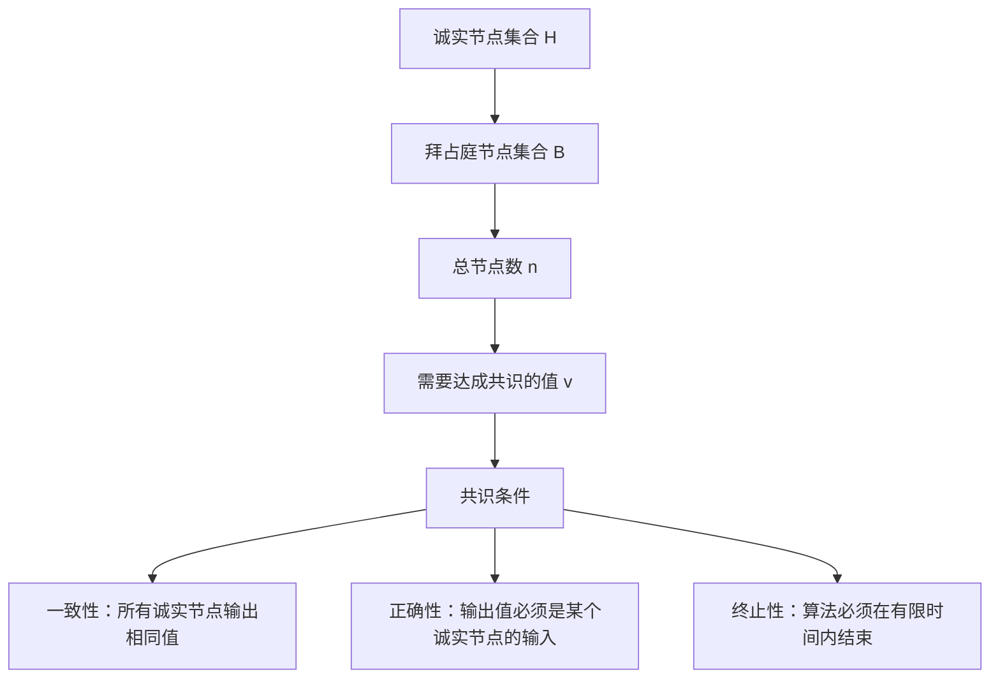

## 引言

拜占庭将军问题是分布式计算中最经典的问题之一，它描述了在存在恶意节点的分布式系统中如何达成共识的挑战。这个问题不仅是理论研究的基础，更是现代区块链、分布式数据库等系统设计的核心考量。

## 问题描述

### 经典场景

想象拜占庭帝国的将军们围攻一座城市，他们需要决定是否发起攻击：

```
城市 🏰
   ↑
将军A ← → 将军B
   ↑     ↑
将军C ← → 将军D
```

**挑战**：
- 将军们只能通过信使传递消息
- 部分将军可能是叛徒，发送虚假信息
- 必须确保忠诚的将军达成一致决策

### 形式化定义



## 理论分析

### 不可能性定理

**FLP不可能性定理**：在异步网络中，即使只有一个节点可能故障，也不存在既保证安全性又保证活性的确定性共识算法。

### 容错边界

对于拜占庭容错，存在重要的理论界限：

```
┌─────────────────────────────────────┐
│ 拜占庭容错理论界限                      │
├─────────────────────────────────────┤
│ • 同步网络：n ≥ 3f + 1                │
│ • 异步网络：不可能 (FLP定理)           │
│ • 部分同步：n ≥ 3f + 1 + 额外假设      │
└─────────────────────────────────────┘

其中：
n = 总节点数
f = 最大拜占庭故障节点数
```

### 数学证明思路

**为什么需要 n ≥ 3f + 1？**

```
假设场景：
- 总节点数：n
- 拜占庭节点数：f
- 诚实节点数：n - f

最坏情况分析：
1. f个拜占庭节点可以向不同组发送不同消息
2. 需要确保诚实节点能够区分真假消息
3. 需要足够的诚实节点形成多数

推导：
n - f > f  (诚实节点数 > 拜占庭节点数)
n > 2f
但考虑到信息传递的复杂性：
n ≥ 3f + 1
```

## 解决方案

### 1. 口头消息算法 (OM算法)

**基本思想**：通过多轮消息传递，让每个节点收集足够信息做出决策。

```python
class ByzantineGeneralsOM:
    def __init__(self, n, f):
        self.n = n  # 总节点数
        self.f = f  # 最大拜占庭节点数
        self.nodes = list(range(n))

    def oral_message(self, commander_value, m):
        """
        OM(m)算法实现
        commander_value: 指挥官的初始值
        m: 轮数，通常设置为f
        """
        if m == 0:
            # 基础情况：直接返回指挥官的值
            return commander_value

        # 第一轮：指挥官向所有副官发送值
        messages = {}
        for i in range(1, self.n):
            # 模拟可能的拜占庭行为
            if self.is_byzantine(0):  # 如果指挥官是拜占庭的
                messages[i] = self.byzantine_value(i)
            else:
                messages[i] = commander_value

        # 后续轮次：递归处理
        results = {}
        for i in range(1, self.n):
            if not self.is_byzantine(i):
                # 诚实节点运行OM(m-1)
                results[i] = self.oral_message(messages[i], m-1)

        return self.majority_vote(results)

    def majority_vote(self, values):
        """多数投票决策"""
        vote_count = {}
        for v in values.values():
            vote_count[v] = vote_count.get(v, 0) + 1

        return max(vote_count, key=vote_count.get)

    def is_byzantine(self, node_id):
        """检查节点是否为拜占庭节点"""
        # 简化实现，实际中这是未知的
        return node_id in self.byzantine_nodes

    def byzantine_value(self, target_node):
        """拜占庭节点发送的恶意值"""
        # 拜占庭节点可能发送不同的值给不同节点
        return random.choice([0, 1])

# 使用示例
n, f = 4, 1  # 4个节点，最多1个拜占庭节点
bg = ByzantineGeneralsOM(n, f)
bg.byzantine_nodes = {3}  # 节点3是拜占庭节点

result = bg.oral_message(commander_value=1, m=f)
print(f"共识结果: {result}")
```

**算法流程图**：

```
OM(m)算法流程：

轮次0：指挥官 → 所有副官
┌─────┐    1    ┌─────┐
│ 将军0│ ──────→ │ 将军1│
│(指挥)│    1    │     │
└─────┘ ──────→ ┌─────┐
   │       1    │ 将军2│
   └──────────→ │     │
              └─────┘

轮次1：每个副官作为指挥官
将军1 → {将军2}: 值1
将军2 → {将军1}: 值1

决策阶段：
将军1收到: [1(来自指挥官), 1(来自将军2)]
将军2收到: [1(来自指挥官), 1(来自将军1)]
→ 共识：攻击(1)
```

### 2. 签名消息算法 (SM算法)

引入数字签名机制，提高效率和安全性：

```python
import hashlib
import json
from cryptography.hazmat.primitives import hashes
from cryptography.hazmat.primitives.asymmetric import rsa, padding

class SignedMessage:
    def __init__(self, value, sender_id, signature_chain=None):
        self.value = value
        self.sender_id = sender_id
        self.signature_chain = signature_chain or []

    def sign(self, private_key, signer_id):
        """为消息添加数字签名"""
        message_data = json.dumps({
            'value': self.value,
            'sender_id': self.sender_id,
            'chain': self.signature_chain
        }, sort_keys=True).encode()

        signature = private_key.sign(
            message_data,
            padding.PSS(
                mgf=padding.MGF1(hashes.SHA256()),
                salt_length=padding.PSS.MAX_LENGTH
            ),
            hashes.SHA256()
        )

        self.signature_chain.append({
            'signer_id': signer_id,
            'signature': signature.hex()
        })

        return self

class ByzantineGeneralsSM:
    def __init__(self, n, f):
        self.n = n
        self.f = f
        self.generate_keys()

    def generate_keys(self):
        """为每个节点生成公私钥对"""
        self.private_keys = {}
        self.public_keys = {}

        for i in range(self.n):
            private_key = rsa.generate_private_key(
                public_exponent=65537,
                key_size=2048
            )
            public_key = private_key.public_key()

            self.private_keys[i] = private_key
            self.public_keys[i] = public_key

    def signed_message_algorithm(self, commander_value, commander_id):
        """SM算法实现"""
        # 第一阶段：指挥官签名并广播
        initial_message = SignedMessage(commander_value, commander_id)
        initial_message.sign(self.private_keys[commander_id], commander_id)

        # 模拟消息传播
        node_messages = {i: [] for i in range(self.n)}

        # 指挥官向所有节点发送签名消息
        for i in range(self.n):
            if i != commander_id:
                node_messages[i].append(initial_message)

        # 多轮转发和签名
        for round_num in range(self.f):
            new_messages = {i: [] for i in range(self.n)}

            for node_id in range(self.n):
                if node_id == commander_id or self.is_byzantine(node_id):
                    continue

                # 诚实节点转发收到的消息
                for msg in node_messages[node_id]:
                    if len(msg.signature_chain) <= self.f:
                        # 添加自己的签名并转发
                        forwarded_msg = SignedMessage(
                            msg.value,
                            msg.sender_id,
                            msg.signature_chain.copy()
                        )
                        forwarded_msg.sign(self.private_keys[node_id], node_id)

                        # 发送给其他节点
                        for target_id in range(self.n):
                            if target_id != node_id and target_id not in [s['signer_id'] for s in forwarded_msg.signature_chain]:
                                new_messages[target_id].append(forwarded_msg)

            # 更新消息集合
            for node_id in range(self.n):
                node_messages[node_id].extend(new_messages[node_id])

        # 决策阶段
        decisions = {}
        for node_id in range(self.n):
            if not self.is_byzantine(node_id):
                decisions[node_id] = self.make_decision(node_messages[node_id])

        return decisions

    def verify_signature_chain(self, message):
        """验证签名链的有效性"""
        # 简化实现，实际中需要完整的签名验证
        return len(set(s['signer_id'] for s in message.signature_chain)) >= self.f + 1

    def make_decision(self, messages):
        """基于收到的消息做出决策"""
        valid_messages = [msg for msg in messages if self.verify_signature_chain(msg)]

        if not valid_messages:
            return None  # 默认值

        # 选择具有最多有效签名的值
        value_counts = {}
        for msg in valid_messages:
            value_counts[msg.value] = value_counts.get(msg.value, 0) + len(msg.signature_chain)

        return max(value_counts, key=value_counts.get)

    def is_byzantine(self, node_id):
        """检查是否为拜占庭节点"""
        return node_id in getattr(self, 'byzantine_nodes', set())

# 使用示例
bg_sm = ByzantineGeneralsSM(n=4, f=1)
bg_sm.byzantine_nodes = {3}

decisions = bg_sm.signed_message_algorithm(commander_value=1, commander_id=0)
print("各节点决策结果:", decisions)
```

## 现代应用

### 1. 区块链中的应用

```python
class BlockchainBFT:
    """区块链中的拜占庭容错实现"""

    def __init__(self, validators):
        self.validators = validators
        self.f = (len(validators) - 1) // 3

    def propose_block(self, block_data):
        """提议新区块"""
        # PBFT三阶段协议

        # 1. Pre-prepare阶段
        proposal = {
            'view': self.current_view,
            'sequence': self.sequence_number,
            'block': block_data,
            'timestamp': time.time()
        }

        preprepare_votes = self.broadcast_preprepare(proposal)

        # 2. Prepare阶段
        if len(preprepare_votes) >= 2 * self.f + 1:
            prepare_votes = self.broadcast_prepare(proposal)

            # 3. Commit阶段
            if len(prepare_votes) >= 2 * self.f + 1:
                commit_votes = self.broadcast_commit(proposal)

                if len(commit_votes) >= 2 * self.f + 1:
                    return self.finalize_block(block_data)

        return None

    def broadcast_preprepare(self, proposal):
        """广播pre-prepare消息"""
        votes = []
        for validator in self.validators:
            if validator.validate_proposal(proposal):
                vote = validator.sign_preprepare(proposal)
                votes.append(vote)
        return votes
```

### 2. 分布式数据库

```python
class DistributedDatabase:
    """分布式数据库的拜占庭容错实现"""

    def __init__(self, replicas):
        self.replicas = replicas
        self.f = (len(replicas) - 1) // 3

    def execute_transaction(self, transaction):
        """执行事务"""
        # 使用拜占庭容错确保事务一致性

        # 1. 事务提议阶段
        proposal = {
            'tx_id': transaction['id'],
            'operations': transaction['ops'],
            'timestamp': time.time()
        }

        # 2. 投票阶段
        votes = []
        for replica in self.replicas:
            if replica.validate_transaction(transaction):
                vote = replica.vote_commit(proposal)
                votes.append(vote)

        # 3. 决策阶段
        if len(votes) >= 2 * self.f + 1:
            # 提交事务
            for replica in self.replicas:
                replica.commit_transaction(transaction)
            return True
        else:
            # 回滚事务
            for replica in self.replicas:
                replica.abort_transaction(transaction)
            return False
```

## 性能分析

### 复杂度对比

```
┌──────────────────┬──────────────┬──────────────┬──────────────┐
│ 算法类型         │ 消息复杂度    │ 轮数复杂度    │ 容错能力      │
├──────────────────┼──────────────┼──────────────┼──────────────┤
│ OM算法          │ O(n^(f+1))   │ f+1          │ n ≥ 3f+1     │
│ SM算法          │ O(n²)        │ f+1          │ n ≥ 2f+1     │
│ PBFT            │ O(n²)        │ 3            │ n ≥ 3f+1     │
│ HotStuff        │ O(n)         │ 4            │ n ≥ 3f+1     │
└──────────────────┴──────────────┴──────────────┴──────────────┘
```

### 实际性能测试

```python
import time
import random

def performance_test():
    """性能测试函数"""
    node_counts = [4, 7, 10, 13, 16]
    algorithms = ['OM', 'SM', 'PBFT']

    results = {}

    for n in node_counts:
        f = (n - 1) // 3
        results[n] = {}

        for algo in algorithms:
            start_time = time.time()

            if algo == 'OM':
                bg = ByzantineGeneralsOM(n, f)
                bg.byzantine_nodes = set(random.sample(range(n), f))
                result = bg.oral_message(1, f)

            elif algo == 'SM':
                bg = ByzantineGeneralsSM(n, f)
                bg.byzantine_nodes = set(random.sample(range(n), f))
                result = bg.signed_message_algorithm(1, 0)

            end_time = time.time()
            results[n][algo] = end_time - start_time

    return results

# 运行性能测试
perf_results = performance_test()
print("性能测试结果 (秒):")
for n, algos in perf_results.items():
    print(f"节点数 {n}: {algos}")
```

## 优化策略

### 1. 消息聚合

```python
class OptimizedBFT:
    """优化的拜占庭容错算法"""

    def aggregate_signatures(self, messages):
        """聚合多个签名以减少通信开销"""
        # 使用BLS签名等技术聚合签名
        aggregated = {
            'values': [msg.value for msg in messages],
            'signers': [msg.sender_id for msg in messages],
            'aggregated_signature': self.bls_aggregate([msg.signature for msg in messages])
        }
        return aggregated

    def batch_processing(self, transactions):
        """批量处理事务以提高吞吐量"""
        batch_size = 1000
        batches = [transactions[i:i+batch_size] for i in range(0, len(transactions), batch_size)]

        results = []
        for batch in batches:
            result = self.process_transaction_batch(batch)
            results.append(result)

        return results
```

### 2. 异步优化

```python
import asyncio

class AsyncByzantineConsensus:
    """异步拜占庭共识实现"""

    async def async_consensus(self, value):
        """异步共识算法"""
        tasks = []

        # 并行发送消息到所有节点
        for node in self.nodes:
            task = asyncio.create_task(self.send_message_async(node, value))
            tasks.append(task)

        # 等待足够多的响应
        responses = await asyncio.gather(*tasks)

        # 处理响应并达成共识
        valid_responses = [r for r in responses if r.is_valid()]

        if len(valid_responses) >= 2 * self.f + 1:
            return self.compute_consensus(valid_responses)

        return None

    async def send_message_async(self, node, message):
        """异步发送消息"""
        return await node.process_message(message)
```

## 安全性分析

### 攻击模型

```
┌─────────────────────────────────────┐
│ 拜占庭攻击类型                      │
├─────────────────────────────────────┤
│ 1. 消息伪造攻击                     │
│    • 发送虚假消息                   │
│    • 伪造签名                       │
│                                     │
│ 2. 延迟攻击                         │
│    • 故意延迟消息传递               │
│    • 选择性延迟                     │
│                                     │
│ 3. 联合攻击                         │
│    • 多个拜占庭节点协调攻击         │
│    • 策略性投票                     │
│                                     │
│ 4. 女巫攻击                         │
│    • 创建多个虚假身份               │
│    • 增加恶意节点影响力             │
└─────────────────────────────────────┘
```

### 防御机制

```python
class SecurityMechanism:
    """安全机制实现"""

    def __init__(self):
        self.reputation_system = ReputationSystem()
        self.identity_verification = IdentityVerification()

    def detect_byzantine_behavior(self, node_history):
        """检测拜占庭行为"""
        suspicious_patterns = [
            self.check_message_consistency(node_history),
            self.check_timing_anomalies(node_history),
            self.check_voting_patterns(node_history)
        ]

        return any(suspicious_patterns)

    def reputation_based_filtering(self, messages):
        """基于声誉的消息过滤"""
        filtered_messages = []

        for msg in messages:
            sender_reputation = self.reputation_system.get_reputation(msg.sender_id)

            if sender_reputation > self.reputation_threshold:
                filtered_messages.append(msg)

        return filtered_messages
```

## 总结

拜占庭将军问题为分布式系统的容错设计提供了理论基础：

### 关键要点

1. **理论限制**：n ≥ 3f + 1 是拜占庭容错的基本要求
2. **算法选择**：根据网络环境和性能要求选择合适的算法
3. **实际应用**：在区块链、分布式数据库等系统中广泛应用
4. **优化方向**：通过签名聚合、批处理等技术提高性能

### 技术演进

```
经典拜占庭容错
      ↓
实用拜占庭容错(PBFT)
      ↓
高效BFT算法(HotStuff, Tendermint)
      ↓
区块链共识机制(PoS, DPoS)
```

拜占庭将军问题不仅是理论研究的经典问题，更是现代分布式系统设计必须考虑的核心挑战。理解这个问题及其解决方案，对于构建可靠的分布式系统至关重要。

## 参考资料

1. Lamport, L., Shostak, R., & Pease, M. (1982). The Byzantine Generals Problem
2. Castro, M., & Liskov, B. (1999). Practical Byzantine Fault Tolerance
3. Yin, M., Malkhi, D., Reiter, M. K., Golan-Gueta, G., & Abraham, I. (2019). HotStuff