## 引言

想象一下，你在使用微信转账时，突然遇到网络故障。你会希望：
- 🔒 **数据一致**：你和朋友看到的账户余额都是正确的
- 🚀 **系统可用**：逐给能够正常处理你的转账请求
- 🌐 **网络容错**：即使部分网络出现问题，系统仍能正常工作

但是CAP理论告诉我们：**这三个目标无法同时实现！**

CAP理论是分布式系统设计中最重要的理论基础，它揭示了一个残酷的现实：在面对网络分区时，我们必须在一致性和可用性之间做出艰难的选择。

### 🎯 为什么要学习CAP理论？

- 🏢 **架构决策**：帮助架构师做出明智的技术选型
- 💰 **业务理解**：明白不同业务场景的技术要求
- 🕧 **问题诊断**：快速定位分布式系统问题的根本原因
- 🚀 **性能优化**：根据业务特点进行精准优化

## 🔬 CAP理论深度剖析

### 💫 三大特性全解析

让我们用一个生动的比喻来理解CAP三要素：

#### 🏦 CAP三要素 - 銀行系统类比

| 特性 | 定义 | 银行系统类比 | 核心要求 |
|------|------|-------------|----------|
| **🔒 Consistency<br/>一致性** | 所有节点在同一时刻看到相同的数据 | 就像銀行账户：<br/>你在北京和上海查询<br/>余额必须完全一样 | 数据统一性 |
| **🚀 Availability<br/>可用性** | 系统始终保持可访问状态 | 就像ATM机：<br/>24小时随时可以<br/>取钱和查询 | 服务持续性 |
| **🌐 Partition Tolerance<br/>分区容错** | 网络分区时系统仍可运行 | 就像网点间通信：<br/>即使电缆断了，<br/>仍能部分服务 | 容错能力 |

**三者关系：** 这三个特性不能同时满足，必须在其中进行权衡。

### 📆 历史背景与发展

| 时间 | 里程碑 | 重要性 |
|------|----------|---------|
| **2000年** | Eric Brewer提出CAP猜想 | 首次提出三者不可兼得的观点 |
| **2002年** | Gilbert & Lynch数学证明 | 从猜想升级为定理 |
| **2012年** | Brewer澄清误解 | 提出"2 of 3"不是绝对的 |
| **现在** | 工程实践中的指导原则 | 指导现代分布式系统设计 |

### 📊 精确定义与衡量标准

```mermaid
flowchart LR
    subgraph ConsistencyTypes ["Consistency 一致性类型"]
        C1[Linear Consistency<br/>线性一致性]
        C2[Sequential Consistency<br/>顺序一致性]
        C3[Causal Consistency<br/>因果一致性]
        C4[Eventual Consistency<br/>最终一致性]
    end

    subgraph AvailabilityMetrics ["Availability 可用性指标"]
        A1[99.9% = 8.77小时/年]
        A2[99.99% = 52.6分钟/年]
        A3[99.999% = 5.26分钟/年]
        A4[99.9999% = 31.6秒/年]
    end

    subgraph PartitionTypes ["Partition Tolerance 容错类型"]
        P1[网络分区]
        P2[节点故障]
        P3[消息丢失]
        P4[延迟超时]
    end
```



### 🔥 核心定理深度解读

**CAP定理**：在分布式系统中，一致性(Consistency)、可用性(Availability)和分区容错性(Partition Tolerance)这三个特性最多只能同时满足其中两个。

#### 🎲 三角关系与权衡选择

```mermaid
flowchart TD
    subgraph TriangleChart ["三角权衡图"]
        A["Consistency<br/>一致性<br/>100% 准确数据"]
        B["Availability<br/>可用性<br/>100% 响应率"]
        C["Partition Tolerance<br/>分区容错<br/>100% 网络容错"]
    end

    A -.->|"不能同时存在"| B
    B -.->|"不能同时存在"| C
    C -.->|"不能同时存在"| A

    A --> CP["👍 CP系统<br/>强一致 + 容错<br/>(牺牲可用性)"]
    B --> AP["🌈 AP系统<br/>可用 + 容错<br/>(牺牲一致性)"]
    C --> CA["💭 CA系统<br/>一致 + 可用<br/>(理论模型)"]

    CP --> CP_SYSTEMS["金融交易<br/>Zookeeper<br/>MongoDB<br/>Redis Cluster"]
    AP --> AP_SYSTEMS["社交应用<br/>Cassandra<br/>DynamoDB<br/>CouchDB"]
    CA --> CA_SYSTEMS["单机数据库<br/>传统 RDBMS<br/>(现实中不存在)"]
```



#### 🤔 为什么CA系统不存在？

在现实网络中，分区是不可避免的：
- 🔌 **网络电缆**可能被挖断
- 🔥 **机房火灾**导致服务器宕机
- 🌊 **自然灾害**影响数据中心
- 🐛 **软件Bug**导致程序崩溃

因此，**Partition Tolerance是必须选项**，真正的选择只在CP和AP之间！

## 🔬 特性详细分析与实战指南

### 1. 🔒 一致性 (Consistency) 全面解析

一致性要求所有节点在同一时刻看到的数据是相同的。但这并不是一个简单的“是或否”问题！

#### 🌈 一致性光谱（从强到弱）

```mermaid
flowchart TD
    subgraph StrongConsistency ["强一致性 Strong Consistency"]
        SC["线性一致性<br/>Linearizability<br/><br/>数据库转账<br/>一定是原子性的"]
    end

    subgraph MediumConsistency ["中等一致性 Medium Consistency"]
        MC1["顺序一致性<br/>Sequential Consistency<br/><br/>群聊消息<br/>所有人看到的顺序相同"]
        MC2["因果一致性<br/>Causal Consistency<br/><br/>朋友圈点赞<br/>先发帖再点赞"]
    end

    subgraph WeakConsistency ["弱一致性 Weak Consistency"]
        WC["最终一致性<br/>Eventual Consistency<br/><br/>社交媒体<br/>点赞数延迟更新OK"]
    end

    SC --> MC1
    MC1 --> MC2
    MC2 --> WC
```



#### 📈 不同一致性级别的性能对比

| 一致性级别 | 延迟 | 吐量 | 适用场景 | 代表系统 |
|-------------|------|------|-----------|----------|
| **线性一致** | 高 | 低 | 金融交易 | 传统RDBMS |
| **顺序一致** | 中 | 中 | 协同办公 | Spanner |
| **因果一致** | 低 | 高 | 社交网络 | COPS |
| **最终一致** | 最低 | 最高 | 内容分发 | Cassandra |

#### 💻 一致性模型实现

```java
import java.util.*;
import java.util.concurrent.*;
import java.util.concurrent.locks.ReentrantLock;

// 📊 CAP理论中的一致性模型实现
enum ConsistencyLevel {
    LINEARIZABLE("线性一致性", "最强一致性，实时同步"),
    SEQUENTIAL("顺序一致性", "操作顺序一致，允许延迟"),
    CAUSAL("因果一致性", "保证因果关系，性能较好"),
    EVENTUAL("最终一致性", "最终同步，性能最佳"),
    WEAK("弱一致性", "无一致性保证，最高性能");

    private final String description;
    private final String detail;

    ConsistencyLevel(String description, String detail) {
        this.description = description;
        this.detail = detail;
    }

    public String getDescription() {
        return description;
    }

    public String getDetail() {
        return detail;
    }
}

class DataEntry {
    private String value;
    private long timestamp;
    private String writeId;

    public DataEntry(String value, long timestamp, String writeId) {
        this.value = value;
        this.timestamp = timestamp;
        this.writeId = writeId;
    }

    // Getters
    public String getValue() { return value; }
    public long getTimestamp() { return timestamp; }
    public String getWriteId() { return writeId; }
}

class Replica {
    private String id;
    private Map<String, DataEntry> data;
    private Map<String, Long> versionVector;
    private boolean isAvailable;
    private ReentrantLock lock;

    public Replica(String replicaId) {
        this.id = replicaId;
        this.data = new ConcurrentHashMap<>();
        this.versionVector = new ConcurrentHashMap<>();
        this.isAvailable = true;
        this.lock = new ReentrantLock();
    }

    /**
     * 副本写操作
     */
    public boolean write(String key, String value, long timestamp, String writeId) throws Exception {
        if (!isAvailable) {
            throw new Exception("副本 " + id + " 不可用");
        }

        lock.lock();
        try {
            DataEntry entry = new DataEntry(value, timestamp, writeId);
            data.put(key, entry);

            // 更新版本向量
            versionVector.put(writeId, timestamp);
            return true;
        } finally {
            lock.unlock();
        }
    }

    /**
     * 副本读操作
     */
    public DataEntry read(String key) throws Exception {
        if (!isAvailable) {
            throw new Exception("副本 " + id + " 不可用");
        }

        return data.get(key);
    }

    public String getId() { return id; }
    public ReentrantLock getLock() { return lock; }
}

public class DistributedDataStore {
    private List<Replica> replicas;
    private ConsistencyLevel consistencyLevel;
    private Map<String, Long> versionVector;
    private ExecutorService executor;

    public DistributedDataStore(List<Replica> replicas, ConsistencyLevel consistencyLevel) {
        this.replicas = replicas;
        this.consistencyLevel = consistencyLevel;
        this.versionVector = new ConcurrentHashMap<>();
        this.executor = Executors.newCachedThreadPool();
    }

    /**
     * 写操作实现不同一致性级别
     */
    public boolean write(String key, String value, String clientId) {
        long timestamp = System.currentTimeMillis();
        String writeId = UUID.randomUUID().toString();

        switch (consistencyLevel) {
            case STRONG:
                return strongConsistencyWrite(key, value, timestamp, writeId);
            case EVENTUAL:
                return eventualConsistencyWrite(key, value, timestamp, writeId);
            case WEAK:
                return weakConsistencyWrite(key, value, timestamp, writeId);
            default:
                return false;
        }
    }

    /**
     * 强一致性写操作 - 需要所有副本确认
     */
    private boolean strongConsistencyWrite(String key, String value, long timestamp, String writeId) {
        int successfulWrites = 0;
        int requiredWrites = replicas.size();

        for (Replica replica : replicas) {
            try {
                replica.getLock().lock();
                try {
                    if (replica.write(key, value, timestamp, writeId)) {
                        successfulWrites++;
                    }
                } finally {
                    replica.getLock().unlock();
                }
            } catch (Exception e) {
                System.out.println("写入副本 " + replica.getId() + " 失败: " + e.getMessage());
            }
        }

        if (successfulWrites == requiredWrites) {
            System.out.println("强一致性写入成功: " + key + " = " + value);
            return true;
        } else {
            // 回滚操作
            rollbackWrite(key, writeId);
            return false;
        }
    }

    /**
     * 最终一致性写操作 - 异步复制
     */
    private boolean eventualConsistencyWrite(String key, String value, long timestamp, String writeId) {
        if (replicas.isEmpty()) return false;

        Replica primaryReplica = replicas.get(0);

        // 主副本写入
        try {
            primaryReplica.getLock().lock();
            try {
                boolean success = primaryReplica.write(key, value, timestamp, writeId);

                if (success) {
                    // 异步复制到其他副本
                    List<Replica> secondaryReplicas = replicas.subList(1, replicas.size());
                    asyncReplicate(key, value, timestamp, writeId, secondaryReplicas);
                    return true;
                }
            } finally {
                primaryReplica.getLock().unlock();
            }
        } catch (Exception e) {
            System.out.println("主副本写入失败: " + e.getMessage());
        }

        return false;
    }

    /**
     * 弱一致性写操作
     */
    private boolean weakConsistencyWrite(String key, String value, long timestamp, String writeId) {
        // 简化实现：只写入一个副本
        if (!replicas.isEmpty()) {
            try {
                return replicas.get(0).write(key, value, timestamp, writeId);
            } catch (Exception e) {
                System.out.println("弱一致性写入失败: " + e.getMessage());
            }
        }
        return false;
    }

    /**
     * 异步复制到副本
     */
    private void asyncReplicate(String key, String value, long timestamp, String writeId,
                               List<Replica> replicasToUpdate) {
        for (Replica replica : replicasToUpdate) {
            executor.submit(() -> {
                try {
                    Thread.sleep(100); // 模拟网络延迟
                    replica.getLock().lock();
                    try {
                        replica.write(key, value, timestamp, writeId);
                        System.out.println("异步复制到副本 " + replica.getId() + " 成功");
                    } finally {
                        replica.getLock().unlock();
                    }
                } catch (Exception e) {
                    System.out.println("异步复制到副本 " + replica.getId() + " 失败: " + e.getMessage());
                }
            });
        }
    }

    /**
     * 回滚写操作
     */
    private void rollbackWrite(String key, String writeId) {
        System.out.println("正在回滚写操作: " + writeId);
        // 简化实现，实际中需要复杂的回滚逻辑
    }

    public void shutdown() {
        executor.shutdown();
    }

    // 使用示例
    public static void main(String[] args) throws InterruptedException {
        List<Replica> replicas = Arrays.asList(
            new Replica("replica_0"),
            new Replica("replica_1"),
            new Replica("replica_2")
        );

        // 强一致性存储
        DistributedDataStore strongStore = new DistributedDataStore(replicas, ConsistencyLevel.STRONG);
        System.out.println("=== 强一致性测试 ===");
        strongStore.write("user:1", "Alice", "client_1");

        // 最终一致性存储
        DistributedDataStore eventualStore = new DistributedDataStore(replicas, ConsistencyLevel.EVENTUAL);
        System.out.println("\n=== 最终一致性测试 ===");
        eventualStore.write("user:2", "Bob", "client_2");

        Thread.sleep(1000); // 等待异步复制完成

        strongStore.shutdown();
        eventualStore.shutdown();
    }
}
```

#### 一致性级别对比

```
┌──────────────┬──────────────┬──────────────┬──────────────┐
│ 一致性级别    │ 读取延迟     │ 写入延迟     │ 数据一致性    │
├──────────────┼──────────────┼──────────────┼──────────────┤
│ 强一致性      │ 高           │ 高           │ 立即一致      │
│ 最终一致性    │ 低           │ 低           │ 延迟一致      │
│ 弱一致性      │ 最低         │ 最低         │ 不保证        │
│ 单调一致性    │ 中等         │ 中等         │ 单调递增      │
└──────────────┴──────────────┴──────────────┴──────────────┘
```

### 2. 可用性 (Availability)

可用性要求系统在合理的时间内响应用户请求。

```python
import random
import threading
import time
from datetime import datetime, timedelta

class AvailabilityManager:
    """可用性管理器"""

    def __init__(self, target_availability=0.99):
        self.target_availability = target_availability
        self.request_history = []
        self.downtime_periods = []
        self.circuit_breaker_state = "CLOSED"  # CLOSED, OPEN, HALF_OPEN
        self.failure_count = 0
        self.failure_threshold = 5
        self.timeout = 30  # 秒

    def process_request(self, request):
        """处理请求并记录可用性指标"""
        start_time = datetime.now()

        try:
            # 检查熔断器状态
            if self.circuit_breaker_state == "OPEN":
                if self._should_attempt_reset():
                    self.circuit_breaker_state = "HALF_OPEN"
                else:
                    raise Exception("服务熔断中")

            # 模拟请求处理
            processing_time = self._simulate_request_processing()

            # 记录成功请求
            self.request_history.append({
                'timestamp': start_time,
                'success': True,
                'response_time': processing_time,
                'request_id': request.get('id', 'unknown')
            })

            # 重置失败计数
            if self.circuit_breaker_state == "HALF_OPEN":
                self.circuit_breaker_state = "CLOSED"
                self.failure_count = 0

            return {'status': 'success', 'data': f"处理请求 {request.get('id')}"}

        except Exception as e:
            # 记录失败请求
            self.request_history.append({
                'timestamp': start_time,
                'success': False,
                'error': str(e),
                'request_id': request.get('id', 'unknown')
            })

            # 更新熔断器状态
            self.failure_count += 1
            if self.failure_count >= self.failure_threshold:
                self.circuit_breaker_state = "OPEN"
                self.downtime_periods.append({
                    'start': datetime.now(),
                    'reason': '连续失败触发熔断'
                })

            raise e

    def _simulate_request_processing(self):
        """模拟请求处理时间"""
        # 90%的请求正常处理，10%可能超时或失败
        if random.random() < 0.9:
            return random.uniform(0.1, 0.5)  # 正常响应时间
        else:
            if random.random() < 0.5:
                time.sleep(2)  # 模拟超时
                raise Exception("请求超时")
            else:
                raise Exception("服务内部错误")

    def _should_attempt_reset(self):
        """判断是否应该尝试重置熔断器"""
        if not self.downtime_periods:
            return False

        last_downtime = self.downtime_periods[-1]
        return datetime.now() - last_downtime['start'] > timedelta(seconds=self.timeout)

    def calculate_availability(self, time_window_hours=24):
        """计算可用性指标"""
        current_time = datetime.now()
        window_start = current_time - timedelta(hours=time_window_hours)

        # 过滤时间窗口内的请求
        recent_requests = [
            req for req in self.request_history
            if req['timestamp'] >= window_start
        ]

        if not recent_requests:
            return 1.0

        successful_requests = sum(1 for req in recent_requests if req['success'])
        total_requests = len(recent_requests)

        availability = successful_requests / total_requests

        return {
            'availability': availability,
            'total_requests': total_requests,
            'successful_requests': successful_requests,
            'failed_requests': total_requests - successful_requests,
            'meets_sla': availability >= self.target_availability
        }

# 可用性测试
def availability_test():
    """可用性测试函数"""
    manager = AvailabilityManager(target_availability=0.95)

    # 模拟1000个并发请求
    def send_requests():
        for i in range(100):
            try:
                request = {'id': f'req_{i}', 'data': f'test_data_{i}'}
                result = manager.process_request(request)
                print(f"✓ 请求 {i} 成功")
            except Exception as e:
                print(f"✗ 请求 {i} 失败: {e}")

            time.sleep(0.01)  # 模拟请求间隔

    # 启动多个线程模拟并发
    threads = []
    for i in range(10):
        thread = threading.Thread(target=send_requests)
        threads.append(thread)
        thread.start()

    # 等待所有线程完成
    for thread in threads:
        thread.join()

    # 计算可用性指标
    metrics = manager.calculate_availability()
    print(f"\n=== 可用性指标 ===")
    print(f"可用性: {metrics['availability']:.4f} ({metrics['availability']*100:.2f}%)")
    print(f"总请求数: {metrics['total_requests']}")
    print(f"成功请求数: {metrics['successful_requests']}")
    print(f"失败请求数: {metrics['failed_requests']}")
    print(f"满足SLA: {metrics['meets_sla']}")

# 运行测试
availability_test()
```

### 3. 分区容错性 (Partition Tolerance)

分区容错性要求系统在网络分区发生时仍能继续工作。

```python
import random
import time
from collections import defaultdict

class NetworkPartition:
    """网络分区模拟器"""

    def __init__(self, nodes):
        self.nodes = nodes
        self.partitions = [set(nodes)]  # 初始时所有节点在同一分区
        self.message_loss_rate = 0.0

    def create_partition(self, partition1, partition2):
        """创建网络分区"""
        self.partitions = [set(partition1), set(partition2)]
        print(f"网络分区创建: {partition1} | {partition2}")

    def heal_partition(self):
        """修复网络分区"""
        self.partitions = [set(self.nodes)]
        print("网络分区已修复")

    def can_communicate(self, node1, node2):
        """检查两个节点是否可以通信"""
        # 检查是否在同一分区
        for partition in self.partitions:
            if node1 in partition and node2 in partition:
                # 模拟网络丢包
                return random.random() > self.message_loss_rate
        return False

class PartitionTolerantSystem:
    """分区容错系统实现"""

    def __init__(self, nodes, quorum_size):
        self.nodes = nodes
        self.quorum_size = quorum_size
        self.data = defaultdict(dict)  # node_id -> {key: value}
        self.network = NetworkPartition(nodes)
        self.leader = nodes[0]

    def write(self, key, value, client_node):
        """分区容错的写操作"""
        print(f"\n尝试写入 {key} = {value} (来自节点 {client_node})")

        # 查找可达的节点
        reachable_nodes = self._find_reachable_nodes(client_node)

        if len(reachable_nodes) < self.quorum_size:
            print(f"可达节点数 ({len(reachable_nodes)}) 小于法定人数 ({self.quorum_size})")
            return False

        # 向可达节点写入数据
        successful_writes = 0
        for node in reachable_nodes:
            if self._write_to_node(node, key, value):
                successful_writes += 1

        success = successful_writes >= self.quorum_size
        print(f"写入结果: {successful_writes}/{len(reachable_nodes)} 节点成功, 需要 {self.quorum_size}")

        return success

    def read(self, key, client_node):
        """分区容错的读操作"""
        print(f"\n尝试读取 {key} (来自节点 {client_node})")

        reachable_nodes = self._find_reachable_nodes(client_node)

        if len(reachable_nodes) < self.quorum_size:
            print(f"可达节点数 ({len(reachable_nodes)}) 小于法定人数 ({self.quorum_size})")
            return None

        # 从可达节点读取数据
        values = []
        for node in reachable_nodes[:self.quorum_size]:
            value = self._read_from_node(node, key)
            if value is not None:
                values.append(value)

        if values:
            # 返回最新值（简化实现）
            result = values[-1]
            print(f"读取结果: {result}")
            return result
        else:
            print("读取失败: 未找到数据")
            return None

    def _find_reachable_nodes(self, from_node):
        """查找从指定节点可达的所有节点"""
        reachable = []
        for node in self.nodes:
            if node == from_node or self.network.can_communicate(from_node, node):
                reachable.append(node)

        print(f"从节点 {from_node} 可达的节点: {reachable}")
        return reachable

    def _write_to_node(self, node, key, value):
        """向指定节点写入数据"""
        try:
            # 模拟网络延迟
            time.sleep(0.01)
            self.data[node][key] = {
                'value': value,
                'timestamp': time.time()
            }
            print(f"  ✓ 写入节点 {node} 成功")
            return True
        except Exception as e:
            print(f"  ✗ 写入节点 {node} 失败: {e}")
            return False

    def _read_from_node(self, node, key):
        """从指定节点读取数据"""
        try:
            time.sleep(0.01)
            data = self.data[node].get(key)
            if data:
                print(f"  ✓ 从节点 {node} 读取: {data['value']}")
                return data['value']
            else:
                print(f"  - 节点 {node} 无数据")
                return None
        except Exception as e:
            print(f"  ✗ 从节点 {node} 读取失败: {e}")
            return None

# 分区容错测试
def partition_tolerance_test():
    """分区容错测试"""
    nodes = ['A', 'B', 'C', 'D', 'E']
    system = PartitionTolerantSystem(nodes, quorum_size=3)

    print("=== 正常情况下的读写测试 ===")
    system.write("user:1", "Alice", "A")
    system.read("user:1", "B")

    print("\n=== 创建网络分区 ===")
    system.network.create_partition(['A', 'B'], ['C', 'D', 'E'])

    print("\n=== 分区后的写入测试 ===")
    # 大分区（3个节点）可以继续服务
    system.write("user:2", "Bob", "C")

    # 小分区（2个节点）无法达到法定人数
    system.write("user:3", "Charlie", "A")

    print("\n=== 分区后的读取测试 ===")
    system.read("user:1", "C")  # 大分区读取
    system.read("user:2", "A")  # 小分区读取

    print("\n=== 修复网络分区 ===")
    system.network.heal_partition()

    print("\n=== 分区修复后的测试 ===")
    system.write("user:4", "David", "A")
    system.read("user:4", "E")

# 运行测试
partition_tolerance_test()
```

## CAP组合分析

### 1. CP系统 (一致性 + 分区容错)

```python
class CPSystem:
    """CP系统实现 - 牺牲可用性保证一致性"""

    def __init__(self, nodes):
        self.nodes = nodes
        self.master = nodes[0]
        self.data = {}
        self.is_available = True

    def write(self, key, value):
        """强一致性写入"""
        if not self.is_available:
            raise Exception("系统不可用 - 网络分区导致无法保证一致性")

        # 必须在所有节点成功写入才返回成功
        successful_writes = 0
        for node in self.nodes:
            try:
                if self._write_to_node(node, key, value):
                    successful_writes += 1
            except Exception:
                # 任何节点失败都会导致整个写入失败
                self.is_available = False
                raise Exception("写入失败 - 系统进入不可用状态")

        if successful_writes == len(self.nodes):
            self.data[key] = value
            return True
        else:
            self.is_available = False
            raise Exception("写入失败 - 无法保证一致性")

    def read(self, key):
        """强一致性读取"""
        if not self.is_available:
            raise Exception("系统不可用")

        return self.data.get(key)

# CP系统示例：MongoDB、Redis Cluster
print("=== CP系统示例 ===")
cp_system = CPSystem(['node1', 'node2', 'node3'])
try:
    cp_system.write("key1", "value1")
    print(f"读取结果: {cp_system.read('key1')}")
except Exception as e:
    print(f"CP系统错误: {e}")
```

### 2. AP系统 (可用性 + 分区容错)

```python
class APSystem:
    """AP系统实现 - 牺牲一致性保证可用性"""

    def __init__(self, nodes):
        self.nodes = nodes
        self.data = {node: {} for node in nodes}
        self.vector_clocks = {node: {} for node in nodes}

    def write(self, key, value, preferred_node=None):
        """最终一致性写入"""
        target_node = preferred_node or self.nodes[0]

        # 更新向量时钟
        if key not in self.vector_clocks[target_node]:
            self.vector_clocks[target_node][key] = 0
        self.vector_clocks[target_node][key] += 1

        # 写入目标节点
        self.data[target_node][key] = {
            'value': value,
            'timestamp': time.time(),
            'vector_clock': self.vector_clocks[target_node][key]
        }

        # 异步复制到其他可达节点
        self._async_replicate(key, value, target_node)

        print(f"写入成功到节点 {target_node}")
        return True

    def read(self, key, preferred_node=None):
        """读取（可能不一致）"""
        target_node = preferred_node or self.nodes[0]

        data = self.data[target_node].get(key)
        if data:
            print(f"从节点 {target_node} 读取: {data['value']}")
            return data['value']
        else:
            print(f"节点 {target_node} 没有键 {key}")
            return None

    def _async_replicate(self, key, value, source_node):
        """异步复制到其他节点"""
        import threading

        def replicate():
            for node in self.nodes:
                if node != source_node:
                    try:
                        # 模拟网络延迟
                        time.sleep(random.uniform(0.1, 0.5))

                        source_data = self.data[source_node][key]
                        self.data[node][key] = source_data.copy()
                        print(f"  异步复制到节点 {node}")
                    except Exception as e:
                        print(f"  复制到节点 {node} 失败: {e}")

        thread = threading.Thread(target=replicate)
        thread.start()

# AP系统示例：Cassandra、DynamoDB
print("\n=== AP系统示例 ===")
ap_system = APSystem(['node1', 'node2', 'node3'])

ap_system.write("key1", "value1", "node1")
time.sleep(0.1)  # 等待异步复制

# 读取可能得到不同结果
ap_system.read("key1", "node1")
ap_system.read("key1", "node2")
```

## 实际系统分析

### 数据库系统CAP选择

```
┌──────────────────┬─────────────┬──────────────┬──────────────┐
│ 系统类型         │ 一致性模型   │ 可用性策略    │ 分区容错方案  │
├──────────────────┼─────────────┼──────────────┼──────────────┤
│ RDBMS           │ ACID强一致   │ 主从复制     │ 分区时停服务  │
│ MongoDB         │ 可调一致性   │ 副本集       │ 主节点选举   │
│ Cassandra       │ 最终一致性   │ 多主复制     │ Gossip协议   │
│ Redis Cluster   │ 强一致性     │ 故障转移     │ 集群重配置   │
│ Elasticsearch   │ 最终一致性   │ 分片复制     │ 脑裂检测     │
│ Kafka           │ 顺序一致性   │ 分区复制     │ ISR机制      │
└──────────────────┴─────────────┴──────────────┴──────────────┘
```

### 真实案例分析

```python
class DatabaseCAPAnalysis:
    """数据库CAP特性分析"""

    @staticmethod
    def analyze_mongodb():
        """MongoDB CAP分析"""
        return {
            'type': 'CP系统',
            'consistency': '可配置（默认强一致性）',
            'availability': '主节点故障时短暂不可用',
            'partition_tolerance': '通过副本集实现',
            'trade_offs': [
                '主节点故障时写操作不可用',
                '次节点可提供读操作',
                '自动故障转移恢复可用性'
            ],
            'use_cases': [
                '需要强一致性的应用',
                '文档型数据存储',
                'OLTP系统'
            ]
        }

    @staticmethod
    def analyze_cassandra():
        """Cassandra CAP分析"""
        return {
            'type': 'AP系统',
            'consistency': '最终一致性（可调节）',
            'availability': '极高可用性',
            'partition_tolerance': 'Gossip协议处理分区',
            'trade_offs': [
                '读写可能返回过期数据',
                '需要应用层处理冲突',
                '数据最终会一致'
            ],
            'use_cases': [
                '高可用性要求',
                '大规模分布式系统',
                '时间序列数据'
            ]
        }

    @staticmethod
    def analyze_redis_cluster():
        """Redis Cluster CAP分析"""
        return {
            'type': 'CP系统',
            'consistency': '强一致性',
            'availability': '分片故障时部分不可用',
            'partition_tolerance': '集群重配置',
            'trade_offs': [
                '主节点故障影响对应分片',
                '集群重配置期间短暂不可用',
                '保证数据强一致性'
            ],
            'use_cases': [
                '缓存系统',
                '会话存储',
                '实时计算'
            ]
        }

# 输出分析结果
analysis = DatabaseCAPAnalysis()
systems = ['mongodb', 'cassandra', 'redis_cluster']

for system in systems:
    result = getattr(analysis, f'analyze_{system}')()
    print(f"\n=== {system.upper()} CAP分析 ===")
    for key, value in result.items():
        if isinstance(value, list):
            print(f"{key}:")
            for item in value:
                print(f"  - {item}")
        else:
            print(f"{key}: {value}")
```

## 架构设计指导

### 1. 系统选型决策树

```
选择分布式系统架构
         │
         ▼
    是否可接受分区？
         │
      ┌──┴──┐
     否│    │是
      │    │
      ▼    ▼
   单机系统  是否优先一致性？
   (CA)     │
           ┌┴─┐
          是│ │否
           │ │
           ▼ ▼
        CP系统 AP系统
```

### 2. 实践指导原则

```python
class CAPGuidelines:
    """CAP理论实践指导"""

    @staticmethod
    def choose_consistency_level(requirements):
        """选择一致性级别"""
        if requirements.get('financial_data'):
            return 'STRONG'
        elif requirements.get('user_experience'):
            return 'EVENTUAL'
        elif requirements.get('analytics'):
            return 'WEAK'
        else:
            return 'MONOTONIC'

    @staticmethod
    def design_availability_strategy(sla_requirement):
        """设计可用性策略"""
        if sla_requirement >= 0.9999:  # 99.99%
            return {
                'strategy': 'multi_region_active_active',
                'components': [
                    '多地域部署',
                    '自动故障转移',
                    '健康检查',
                    '流量路由'
                ]
            }
        elif sla_requirement >= 0.999:  # 99.9%
            return {
                'strategy': 'active_passive',
                'components': [
                    '主备部署',
                    '心跳检测',
                    '快速切换'
                ]
            }
        else:
            return {
                'strategy': 'single_region',
                'components': [
                    '本地冗余',
                    '基本监控'
                ]
            }

    @staticmethod
    def partition_tolerance_design(network_reliability):
        """分区容错设计"""
        if network_reliability < 0.95:
            return {
                'approach': 'aggressive_partition_handling',
                'techniques': [
                    'Quorum机制',
                    '向量时钟',
                    '冲突解决',
                    '反熵机制'
                ]
            }
        else:
            return {
                'approach': 'basic_partition_handling',
                'techniques': [
                    '主从复制',
                    '故障检测',
                    '自动恢复'
                ]
            }

# 使用示例
guidelines = CAPGuidelines()

# 电商系统需求分析
ecommerce_requirements = {
    'financial_data': True,
    'user_experience': True,
    'sla_requirement': 0.999,
    'network_reliability': 0.98
}

print("=== 电商系统CAP设计建议 ===")
consistency = guidelines.choose_consistency_level(ecommerce_requirements)
availability = guidelines.design_availability_strategy(ecommerce_requirements['sla_requirement'])
partition = guidelines.partition_tolerance_design(ecommerce_requirements['network_reliability'])

print(f"一致性选择: {consistency}")
print(f"可用性策略: {availability['strategy']}")
print(f"分区容错方案: {partition['approach']}")
```

## 现代发展趋势

### 1. PACELC定理

CAP理论的扩展，考虑网络正常时的权衡：

```
┌─────────────────────────────────────┐
│ PACELC 定理                         │
├─────────────────────────────────────┤
│ P → A vs C (分区时: 可用性 vs 一致性) │
│ E → L vs C (正常时: 延迟 vs 一致性)   │
└─────────────────────────────────────┘

系统分类：
• PA/EL: Dynamo, Cassandra
• PA/EC: MongoDB, VoltDB
• PC/EL: Yahoo! PNUTS
• PC/EC: HBase, Redis Cluster
```

### 2. 新兴架构模式

```python
class ModernCAPEvolution:
    """现代CAP理论演进"""

    @staticmethod
    def cqrs_pattern():
        """命令查询责任分离"""
        return {
            'description': '读写分离，不同一致性要求',
            'write_side': 'CP系统（强一致性）',
            'read_side': 'AP系统（最终一致性）',
            'benefits': [
                '读写性能独立优化',
                '不同一致性需求',
                '复杂查询支持'
            ]
        }

    @staticmethod
    def event_sourcing():
        """事件溯源"""
        return {
            'description': '基于事件的状态重建',
            'consistency': '事件顺序一致性',
            'availability': '高可用事件存储',
            'partition_tolerance': '事件复制容错',
            'benefits': [
                '完整历史记录',
                '时间旅行调试',
                '审计追踪'
            ]
        }

    @staticmethod
    def saga_pattern():
        """Saga模式"""
        return {
            'description': '分布式事务最终一致性',
            'approach': '补偿机制处理失败',
            'trade_offs': [
                '牺牲即时一致性',
                '获得高可用性',
                '处理网络分区'
            ]
        }

modern_cap = ModernCAPEvolution()
patterns = ['cqrs_pattern', 'event_sourcing', 'saga_pattern']

print("=== 现代CAP架构模式 ===")
for pattern in patterns:
    result = getattr(modern_cap, pattern)()
    print(f"\n{pattern.upper().replace('_', ' ')}:")
    for key, value in result.items():
        if isinstance(value, list):
            print(f"  {key}:")
            for item in value:
                print(f"    - {item}")
        else:
            print(f"  {key}: {value}")
```

## 性能测试与监控

### 1. CAP指标监控

```python
import psutil
import time
from datetime import datetime

class CAPMetricsMonitor:
    """CAP指标监控"""

    def __init__(self):
        self.metrics = {
            'consistency': [],
            'availability': [],
            'partition_tolerance': []
        }

    def measure_consistency_lag(self, primary_value, replica_values):
        """测量一致性延迟"""
        inconsistent_replicas = 0
        max_lag = 0

        for replica_value in replica_values:
            if replica_value != primary_value:
                inconsistent_replicas += 1
                # 简化的延迟计算
                lag = abs(hash(replica_value) - hash(primary_value)) / 1000000
                max_lag = max(max_lag, lag)

        consistency_ratio = 1 - (inconsistent_replicas / len(replica_values))

        self.metrics['consistency'].append({
            'timestamp': datetime.now(),
            'consistency_ratio': consistency_ratio,
            'max_lag_ms': max_lag,
            'inconsistent_replicas': inconsistent_replicas
        })

        return consistency_ratio

    def measure_availability(self, successful_requests, total_requests):
        """测量系统可用性"""
        availability = successful_requests / total_requests if total_requests > 0 else 0

        self.metrics['availability'].append({
            'timestamp': datetime.now(),
            'availability': availability,
            'successful_requests': successful_requests,
            'total_requests': total_requests
        })

        return availability

    def measure_partition_impact(self, nodes_reachable, total_nodes):
        """测量分区影响"""
        partition_ratio = nodes_reachable / total_nodes

        self.metrics['partition_tolerance'].append({
            'timestamp': datetime.now(),
            'partition_ratio': partition_ratio,
            'reachable_nodes': nodes_reachable,
            'total_nodes': total_nodes
        })

        return partition_ratio

    def generate_report(self):
        """生成CAP指标报告"""
        report = {}

        for metric_type, measurements in self.metrics.items():
            if measurements:
                latest = measurements[-1]
                avg_value = sum(m.get(f'{metric_type.split("_")[0]}_ratio',
                                   m.get('availability', 0)) for m in measurements) / len(measurements)

                report[metric_type] = {
                    'latest': latest,
                    'average': avg_value,
                    'measurements_count': len(measurements)
                }

        return report

# 监控使用示例
monitor = CAPMetricsMonitor()

# 模拟一系列测量
for i in range(10):
    # 一致性测量
    primary = f"value_{i}"
    replicas = [f"value_{i}" if random.random() > 0.1 else f"old_value_{i-1}" for _ in range(3)]
    consistency = monitor.measure_consistency_lag(primary, replicas)

    # 可用性测量
    success = random.randint(95, 100)
    total = 100
    availability = monitor.measure_availability(success, total)

    # 分区容错测量
    reachable = random.randint(3, 5)
    total_nodes = 5
    partition_tolerance = monitor.measure_partition_impact(reachable, total_nodes)

    time.sleep(0.1)

# 生成报告
report = monitor.generate_report()
print("=== CAP指标监控报告 ===")
for metric, data in report.items():
    print(f"\n{metric.upper()}:")
    print(f"  最新值: {data['latest']}")
    print(f"  平均值: {data['average']:.4f}")
    print(f"  测量次数: {data['measurements_count']}")
```

## 总结

CAP理论为分布式系统设计提供了重要的理论指导：

### 核心洞察

1. **权衡本质**：分布式系统必须在一致性、可用性和分区容错之间做出权衡
2. **现实约束**：网络分区不可避免，必须在C和A之间选择
3. **设计指导**：根据业务需求选择合适的CAP组合

### 实践建议

```
业务场景 → CAP选择
├─ 金融系统 → CP (强一致性)
├─ 社交媒体 → AP (高可用性)
├─ 电商平台 → 混合架构
└─ 物联网 → AP (容忍不一致)
```

### 技术演进

CAP理论继续指导着现代分布式系统的发展，从传统的数据库到微服务架构，从区块链到边缘计算，理解CAP权衡对于构建可靠的分布式系统至关重要。

## 参考资料

1. Brewer, E. (2000). Towards robust distributed systems
2. Gilbert, S., & Lynch, N. (2002). Brewer's conjecture and the feasibility of consistent, available, partition-tolerant web services
3. Abadi, D. (2012). Consistency tradeoffs in modern distributed database system design