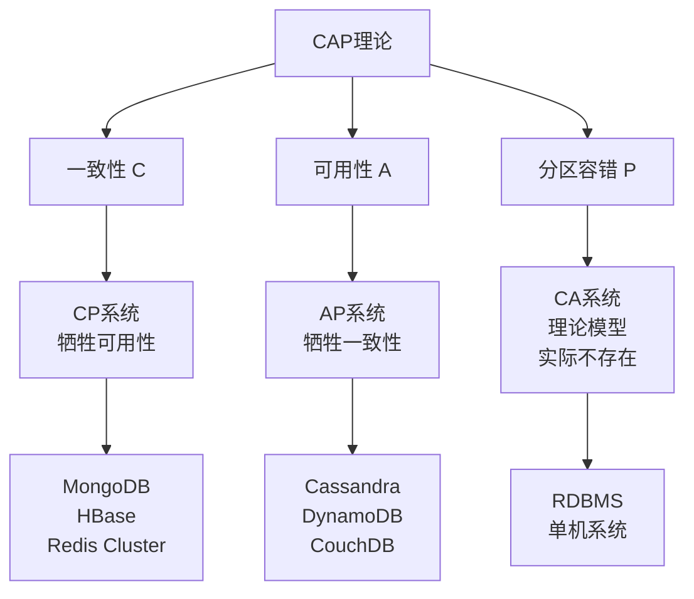

## 引言

CAP理论是分布式系统设计中最重要的理论基础之一，它揭示了分布式系统在面对网络分区时必须在一致性和可用性之间做出权衡的本质。理解CAP理论对于架构师和开发者设计可靠的分布式系统至关重要。

## CAP理论概述

### 三大特性定义

```
┌─────────────────────────────────────┐
│            CAP 理论                 │
├─────────────────────────────────────┤
│                                     │
│    C (Consistency)                  │
│    ┌─ 强一致性                      │
│    ├─ 最终一致性                    │
│    └─ 弱一致性                      │
│                                     │
│    A (Availability)                 │
│    ┌─ 系统可用性                    │
│    ├─ 服务可达性                    │
│    └─ 响应时间                      │
│                                     │
│    P (Partition Tolerance)          │
│    ┌─ 网络分区容错                  │
│    ├─ 节点间通信失败                │
│    └─ 部分节点不可达                │
│                                     │
└─────────────────────────────────────┘
```

### 核心定理

**CAP定理**：在分布式系统中，一致性(Consistency)、可用性(Availability)和分区容错性(Partition Tolerance)这三个特性最多只能同时满足其中两个。



## 详细特性分析

### 1. 一致性 (Consistency)

一致性要求所有节点在同一时刻看到的数据是相同的。

#### 一致性模型

```python
from enum import Enum
from threading import Lock
import time
import uuid

class ConsistencyLevel(Enum):
    STRONG = "强一致性"
    EVENTUAL = "最终一致性"
    WEAK = "弱一致性"
    MONOTONIC = "单调一致性"

class DistributedDataStore:
    """分布式数据存储一致性实现"""

    def __init__(self, replicas, consistency_level=ConsistencyLevel.STRONG):
        self.replicas = replicas
        self.consistency_level = consistency_level
        self.version_vector = {}
        self.locks = {replica: Lock() for replica in replicas}

    def write(self, key, value, client_id):
        """写操作实现不同一致性级别"""
        timestamp = time.time()
        write_id = str(uuid.uuid4())

        if self.consistency_level == ConsistencyLevel.STRONG:
            return self._strong_consistency_write(key, value, timestamp, write_id)
        elif self.consistency_level == ConsistencyLevel.EVENTUAL:
            return self._eventual_consistency_write(key, value, timestamp, write_id)
        elif self.consistency_level == ConsistencyLevel.WEAK:
            return self._weak_consistency_write(key, value, timestamp, write_id)

    def _strong_consistency_write(self, key, value, timestamp, write_id):
        """强一致性写操作 - 需要所有副本确认"""
        successful_writes = 0
        required_writes = len(self.replicas)

        for replica in self.replicas:
            try:
                with self.locks[replica]:
                    if replica.write(key, value, timestamp, write_id):
                        successful_writes += 1
            except Exception as e:
                print(f"写入副本 {replica.id} 失败: {e}")

        if successful_writes == required_writes:
            print(f"强一致性写入成功: {key} = {value}")
            return True
        else:
            # 回滚操作
            self._rollback_write(key, write_id)
            return False

    def _eventual_consistency_write(self, key, value, timestamp, write_id):
        """最终一致性写操作 - 异步复制"""
        primary_replica = self.replicas[0]

        # 主副本写入
        try:
            with self.locks[primary_replica]:
                success = primary_replica.write(key, value, timestamp, write_id)

                if success:
                    # 异步复制到其他副本
                    self._async_replicate(key, value, timestamp, write_id, self.replicas[1:])
                    return True
        except Exception as e:
            print(f"主副本写入失败: {e}")

        return False

    def _async_replicate(self, key, value, timestamp, write_id, replicas):
        """异步复制到副本"""
        import threading

        def replicate_to_replica(replica):
            try:
                time.sleep(0.1)  # 模拟网络延迟
                with self.locks[replica]:
                    replica.write(key, value, timestamp, write_id)
                    print(f"异步复制到副本 {replica.id} 成功")
            except Exception as e:
                print(f"异步复制到副本 {replica.id} 失败: {e}")

        for replica in replicas:
            thread = threading.Thread(target=replicate_to_replica, args=(replica,))
            thread.start()

class Replica:
    """副本节点实现"""

    def __init__(self, replica_id):
        self.id = replica_id
        self.data = {}
        self.version_vector = {}
        self.is_available = True

    def write(self, key, value, timestamp, write_id):
        """副本写操作"""
        if not self.is_available:
            raise Exception(f"副本 {self.id} 不可用")

        self.data[key] = {
            'value': value,
            'timestamp': timestamp,
            'write_id': write_id
        }

        # 更新版本向量
        self.version_vector[write_id] = timestamp
        return True

    def read(self, key):
        """副本读操作"""
        if not self.is_available:
            raise Exception(f"副本 {self.id} 不可用")

        return self.data.get(key)

# 使用示例
replicas = [Replica(f"replica_{i}") for i in range(3)]

# 强一致性存储
strong_store = DistributedDataStore(replicas, ConsistencyLevel.STRONG)
print("=== 强一致性测试 ===")
strong_store.write("user:1", {"name": "Alice", "age": 25}, "client_1")

# 最终一致性存储
eventual_store = DistributedDataStore(replicas, ConsistencyLevel.EVENTUAL)
print("\n=== 最终一致性测试 ===")
eventual_store.write("user:2", {"name": "Bob", "age": 30}, "client_2")
```

#### 一致性级别对比

```
┌──────────────┬──────────────┬──────────────┬──────────────┐
│ 一致性级别    │ 读取延迟     │ 写入延迟     │ 数据一致性    │
├──────────────┼──────────────┼──────────────┼──────────────┤
│ 强一致性      │ 高           │ 高           │ 立即一致      │
│ 最终一致性    │ 低           │ 低           │ 延迟一致      │
│ 弱一致性      │ 最低         │ 最低         │ 不保证        │
│ 单调一致性    │ 中等         │ 中等         │ 单调递增      │
└──────────────┴──────────────┴──────────────┴──────────────┘
```

### 2. 可用性 (Availability)

可用性要求系统在合理的时间内响应用户请求。

```python
import random
import threading
import time
from datetime import datetime, timedelta

class AvailabilityManager:
    """可用性管理器"""

    def __init__(self, target_availability=0.99):
        self.target_availability = target_availability
        self.request_history = []
        self.downtime_periods = []
        self.circuit_breaker_state = "CLOSED"  # CLOSED, OPEN, HALF_OPEN
        self.failure_count = 0
        self.failure_threshold = 5
        self.timeout = 30  # 秒

    def process_request(self, request):
        """处理请求并记录可用性指标"""
        start_time = datetime.now()

        try:
            # 检查熔断器状态
            if self.circuit_breaker_state == "OPEN":
                if self._should_attempt_reset():
                    self.circuit_breaker_state = "HALF_OPEN"
                else:
                    raise Exception("服务熔断中")

            # 模拟请求处理
            processing_time = self._simulate_request_processing()

            # 记录成功请求
            self.request_history.append({
                'timestamp': start_time,
                'success': True,
                'response_time': processing_time,
                'request_id': request.get('id', 'unknown')
            })

            # 重置失败计数
            if self.circuit_breaker_state == "HALF_OPEN":
                self.circuit_breaker_state = "CLOSED"
                self.failure_count = 0

            return {'status': 'success', 'data': f"处理请求 {request.get('id')}"}

        except Exception as e:
            # 记录失败请求
            self.request_history.append({
                'timestamp': start_time,
                'success': False,
                'error': str(e),
                'request_id': request.get('id', 'unknown')
            })

            # 更新熔断器状态
            self.failure_count += 1
            if self.failure_count >= self.failure_threshold:
                self.circuit_breaker_state = "OPEN"
                self.downtime_periods.append({
                    'start': datetime.now(),
                    'reason': '连续失败触发熔断'
                })

            raise e

    def _simulate_request_processing(self):
        """模拟请求处理时间"""
        # 90%的请求正常处理，10%可能超时或失败
        if random.random() < 0.9:
            return random.uniform(0.1, 0.5)  # 正常响应时间
        else:
            if random.random() < 0.5:
                time.sleep(2)  # 模拟超时
                raise Exception("请求超时")
            else:
                raise Exception("服务内部错误")

    def _should_attempt_reset(self):
        """判断是否应该尝试重置熔断器"""
        if not self.downtime_periods:
            return False

        last_downtime = self.downtime_periods[-1]
        return datetime.now() - last_downtime['start'] > timedelta(seconds=self.timeout)

    def calculate_availability(self, time_window_hours=24):
        """计算可用性指标"""
        current_time = datetime.now()
        window_start = current_time - timedelta(hours=time_window_hours)

        # 过滤时间窗口内的请求
        recent_requests = [
            req for req in self.request_history
            if req['timestamp'] >= window_start
        ]

        if not recent_requests:
            return 1.0

        successful_requests = sum(1 for req in recent_requests if req['success'])
        total_requests = len(recent_requests)

        availability = successful_requests / total_requests

        return {
            'availability': availability,
            'total_requests': total_requests,
            'successful_requests': successful_requests,
            'failed_requests': total_requests - successful_requests,
            'meets_sla': availability >= self.target_availability
        }

# 可用性测试
def availability_test():
    """可用性测试函数"""
    manager = AvailabilityManager(target_availability=0.95)

    # 模拟1000个并发请求
    def send_requests():
        for i in range(100):
            try:
                request = {'id': f'req_{i}', 'data': f'test_data_{i}'}
                result = manager.process_request(request)
                print(f"✓ 请求 {i} 成功")
            except Exception as e:
                print(f"✗ 请求 {i} 失败: {e}")

            time.sleep(0.01)  # 模拟请求间隔

    # 启动多个线程模拟并发
    threads = []
    for i in range(10):
        thread = threading.Thread(target=send_requests)
        threads.append(thread)
        thread.start()

    # 等待所有线程完成
    for thread in threads:
        thread.join()

    # 计算可用性指标
    metrics = manager.calculate_availability()
    print(f"\n=== 可用性指标 ===")
    print(f"可用性: {metrics['availability']:.4f} ({metrics['availability']*100:.2f}%)")
    print(f"总请求数: {metrics['total_requests']}")
    print(f"成功请求数: {metrics['successful_requests']}")
    print(f"失败请求数: {metrics['failed_requests']}")
    print(f"满足SLA: {metrics['meets_sla']}")

# 运行测试
availability_test()
```

### 3. 分区容错性 (Partition Tolerance)

分区容错性要求系统在网络分区发生时仍能继续工作。

```python
import random
import time
from collections import defaultdict

class NetworkPartition:
    """网络分区模拟器"""

    def __init__(self, nodes):
        self.nodes = nodes
        self.partitions = [set(nodes)]  # 初始时所有节点在同一分区
        self.message_loss_rate = 0.0

    def create_partition(self, partition1, partition2):
        """创建网络分区"""
        self.partitions = [set(partition1), set(partition2)]
        print(f"网络分区创建: {partition1} | {partition2}")

    def heal_partition(self):
        """修复网络分区"""
        self.partitions = [set(self.nodes)]
        print("网络分区已修复")

    def can_communicate(self, node1, node2):
        """检查两个节点是否可以通信"""
        # 检查是否在同一分区
        for partition in self.partitions:
            if node1 in partition and node2 in partition:
                # 模拟网络丢包
                return random.random() > self.message_loss_rate
        return False

class PartitionTolerantSystem:
    """分区容错系统实现"""

    def __init__(self, nodes, quorum_size):
        self.nodes = nodes
        self.quorum_size = quorum_size
        self.data = defaultdict(dict)  # node_id -> {key: value}
        self.network = NetworkPartition(nodes)
        self.leader = nodes[0]

    def write(self, key, value, client_node):
        """分区容错的写操作"""
        print(f"\n尝试写入 {key} = {value} (来自节点 {client_node})")

        # 查找可达的节点
        reachable_nodes = self._find_reachable_nodes(client_node)

        if len(reachable_nodes) < self.quorum_size:
            print(f"可达节点数 ({len(reachable_nodes)}) 小于法定人数 ({self.quorum_size})")
            return False

        # 向可达节点写入数据
        successful_writes = 0
        for node in reachable_nodes:
            if self._write_to_node(node, key, value):
                successful_writes += 1

        success = successful_writes >= self.quorum_size
        print(f"写入结果: {successful_writes}/{len(reachable_nodes)} 节点成功, 需要 {self.quorum_size}")

        return success

    def read(self, key, client_node):
        """分区容错的读操作"""
        print(f"\n尝试读取 {key} (来自节点 {client_node})")

        reachable_nodes = self._find_reachable_nodes(client_node)

        if len(reachable_nodes) < self.quorum_size:
            print(f"可达节点数 ({len(reachable_nodes)}) 小于法定人数 ({self.quorum_size})")
            return None

        # 从可达节点读取数据
        values = []
        for node in reachable_nodes[:self.quorum_size]:
            value = self._read_from_node(node, key)
            if value is not None:
                values.append(value)

        if values:
            # 返回最新值（简化实现）
            result = values[-1]
            print(f"读取结果: {result}")
            return result
        else:
            print("读取失败: 未找到数据")
            return None

    def _find_reachable_nodes(self, from_node):
        """查找从指定节点可达的所有节点"""
        reachable = []
        for node in self.nodes:
            if node == from_node or self.network.can_communicate(from_node, node):
                reachable.append(node)

        print(f"从节点 {from_node} 可达的节点: {reachable}")
        return reachable

    def _write_to_node(self, node, key, value):
        """向指定节点写入数据"""
        try:
            # 模拟网络延迟
            time.sleep(0.01)
            self.data[node][key] = {
                'value': value,
                'timestamp': time.time()
            }
            print(f"  ✓ 写入节点 {node} 成功")
            return True
        except Exception as e:
            print(f"  ✗ 写入节点 {node} 失败: {e}")
            return False

    def _read_from_node(self, node, key):
        """从指定节点读取数据"""
        try:
            time.sleep(0.01)
            data = self.data[node].get(key)
            if data:
                print(f"  ✓ 从节点 {node} 读取: {data['value']}")
                return data['value']
            else:
                print(f"  - 节点 {node} 无数据")
                return None
        except Exception as e:
            print(f"  ✗ 从节点 {node} 读取失败: {e}")
            return None

# 分区容错测试
def partition_tolerance_test():
    """分区容错测试"""
    nodes = ['A', 'B', 'C', 'D', 'E']
    system = PartitionTolerantSystem(nodes, quorum_size=3)

    print("=== 正常情况下的读写测试 ===")
    system.write("user:1", "Alice", "A")
    system.read("user:1", "B")

    print("\n=== 创建网络分区 ===")
    system.network.create_partition(['A', 'B'], ['C', 'D', 'E'])

    print("\n=== 分区后的写入测试 ===")
    # 大分区（3个节点）可以继续服务
    system.write("user:2", "Bob", "C")

    # 小分区（2个节点）无法达到法定人数
    system.write("user:3", "Charlie", "A")

    print("\n=== 分区后的读取测试 ===")
    system.read("user:1", "C")  # 大分区读取
    system.read("user:2", "A")  # 小分区读取

    print("\n=== 修复网络分区 ===")
    system.network.heal_partition()

    print("\n=== 分区修复后的测试 ===")
    system.write("user:4", "David", "A")
    system.read("user:4", "E")

# 运行测试
partition_tolerance_test()
```

## CAP组合分析

### 1. CP系统 (一致性 + 分区容错)

```python
class CPSystem:
    """CP系统实现 - 牺牲可用性保证一致性"""

    def __init__(self, nodes):
        self.nodes = nodes
        self.master = nodes[0]
        self.data = {}
        self.is_available = True

    def write(self, key, value):
        """强一致性写入"""
        if not self.is_available:
            raise Exception("系统不可用 - 网络分区导致无法保证一致性")

        # 必须在所有节点成功写入才返回成功
        successful_writes = 0
        for node in self.nodes:
            try:
                if self._write_to_node(node, key, value):
                    successful_writes += 1
            except Exception:
                # 任何节点失败都会导致整个写入失败
                self.is_available = False
                raise Exception("写入失败 - 系统进入不可用状态")

        if successful_writes == len(self.nodes):
            self.data[key] = value
            return True
        else:
            self.is_available = False
            raise Exception("写入失败 - 无法保证一致性")

    def read(self, key):
        """强一致性读取"""
        if not self.is_available:
            raise Exception("系统不可用")

        return self.data.get(key)

# CP系统示例：MongoDB、Redis Cluster
print("=== CP系统示例 ===")
cp_system = CPSystem(['node1', 'node2', 'node3'])
try:
    cp_system.write("key1", "value1")
    print(f"读取结果: {cp_system.read('key1')}")
except Exception as e:
    print(f"CP系统错误: {e}")
```

### 2. AP系统 (可用性 + 分区容错)

```python
class APSystem:
    """AP系统实现 - 牺牲一致性保证可用性"""

    def __init__(self, nodes):
        self.nodes = nodes
        self.data = {node: {} for node in nodes}
        self.vector_clocks = {node: {} for node in nodes}

    def write(self, key, value, preferred_node=None):
        """最终一致性写入"""
        target_node = preferred_node or self.nodes[0]

        # 更新向量时钟
        if key not in self.vector_clocks[target_node]:
            self.vector_clocks[target_node][key] = 0
        self.vector_clocks[target_node][key] += 1

        # 写入目标节点
        self.data[target_node][key] = {
            'value': value,
            'timestamp': time.time(),
            'vector_clock': self.vector_clocks[target_node][key]
        }

        # 异步复制到其他可达节点
        self._async_replicate(key, value, target_node)

        print(f"写入成功到节点 {target_node}")
        return True

    def read(self, key, preferred_node=None):
        """读取（可能不一致）"""
        target_node = preferred_node or self.nodes[0]

        data = self.data[target_node].get(key)
        if data:
            print(f"从节点 {target_node} 读取: {data['value']}")
            return data['value']
        else:
            print(f"节点 {target_node} 没有键 {key}")
            return None

    def _async_replicate(self, key, value, source_node):
        """异步复制到其他节点"""
        import threading

        def replicate():
            for node in self.nodes:
                if node != source_node:
                    try:
                        # 模拟网络延迟
                        time.sleep(random.uniform(0.1, 0.5))

                        source_data = self.data[source_node][key]
                        self.data[node][key] = source_data.copy()
                        print(f"  异步复制到节点 {node}")
                    except Exception as e:
                        print(f"  复制到节点 {node} 失败: {e}")

        thread = threading.Thread(target=replicate)
        thread.start()

# AP系统示例：Cassandra、DynamoDB
print("\n=== AP系统示例 ===")
ap_system = APSystem(['node1', 'node2', 'node3'])

ap_system.write("key1", "value1", "node1")
time.sleep(0.1)  # 等待异步复制

# 读取可能得到不同结果
ap_system.read("key1", "node1")
ap_system.read("key1", "node2")
```

## 实际系统分析

### 数据库系统CAP选择

```
┌──────────────────┬─────────────┬──────────────┬──────────────┐
│ 系统类型         │ 一致性模型   │ 可用性策略    │ 分区容错方案  │
├──────────────────┼─────────────┼──────────────┼──────────────┤
│ RDBMS           │ ACID强一致   │ 主从复制     │ 分区时停服务  │
│ MongoDB         │ 可调一致性   │ 副本集       │ 主节点选举   │
│ Cassandra       │ 最终一致性   │ 多主复制     │ Gossip协议   │
│ Redis Cluster   │ 强一致性     │ 故障转移     │ 集群重配置   │
│ Elasticsearch   │ 最终一致性   │ 分片复制     │ 脑裂检测     │
│ Kafka           │ 顺序一致性   │ 分区复制     │ ISR机制      │
└──────────────────┴─────────────┴──────────────┴──────────────┘
```

### 真实案例分析

```python
class DatabaseCAPAnalysis:
    """数据库CAP特性分析"""

    @staticmethod
    def analyze_mongodb():
        """MongoDB CAP分析"""
        return {
            'type': 'CP系统',
            'consistency': '可配置（默认强一致性）',
            'availability': '主节点故障时短暂不可用',
            'partition_tolerance': '通过副本集实现',
            'trade_offs': [
                '主节点故障时写操作不可用',
                '次节点可提供读操作',
                '自动故障转移恢复可用性'
            ],
            'use_cases': [
                '需要强一致性的应用',
                '文档型数据存储',
                'OLTP系统'
            ]
        }

    @staticmethod
    def analyze_cassandra():
        """Cassandra CAP分析"""
        return {
            'type': 'AP系统',
            'consistency': '最终一致性（可调节）',
            'availability': '极高可用性',
            'partition_tolerance': 'Gossip协议处理分区',
            'trade_offs': [
                '读写可能返回过期数据',
                '需要应用层处理冲突',
                '数据最终会一致'
            ],
            'use_cases': [
                '高可用性要求',
                '大规模分布式系统',
                '时间序列数据'
            ]
        }

    @staticmethod
    def analyze_redis_cluster():
        """Redis Cluster CAP分析"""
        return {
            'type': 'CP系统',
            'consistency': '强一致性',
            'availability': '分片故障时部分不可用',
            'partition_tolerance': '集群重配置',
            'trade_offs': [
                '主节点故障影响对应分片',
                '集群重配置期间短暂不可用',
                '保证数据强一致性'
            ],
            'use_cases': [
                '缓存系统',
                '会话存储',
                '实时计算'
            ]
        }

# 输出分析结果
analysis = DatabaseCAPAnalysis()
systems = ['mongodb', 'cassandra', 'redis_cluster']

for system in systems:
    result = getattr(analysis, f'analyze_{system}')()
    print(f"\n=== {system.upper()} CAP分析 ===")
    for key, value in result.items():
        if isinstance(value, list):
            print(f"{key}:")
            for item in value:
                print(f"  - {item}")
        else:
            print(f"{key}: {value}")
```

## 架构设计指导

### 1. 系统选型决策树

```
选择分布式系统架构
         │
         ▼
    是否可接受分区？
         │
      ┌──┴──┐
     否│    │是
      │    │
      ▼    ▼
   单机系统  是否优先一致性？
   (CA)     │
           ┌┴─┐
          是│ │否
           │ │
           ▼ ▼
        CP系统 AP系统
```

### 2. 实践指导原则

```python
class CAPGuidelines:
    """CAP理论实践指导"""

    @staticmethod
    def choose_consistency_level(requirements):
        """选择一致性级别"""
        if requirements.get('financial_data'):
            return 'STRONG'
        elif requirements.get('user_experience'):
            return 'EVENTUAL'
        elif requirements.get('analytics'):
            return 'WEAK'
        else:
            return 'MONOTONIC'

    @staticmethod
    def design_availability_strategy(sla_requirement):
        """设计可用性策略"""
        if sla_requirement >= 0.9999:  # 99.99%
            return {
                'strategy': 'multi_region_active_active',
                'components': [
                    '多地域部署',
                    '自动故障转移',
                    '健康检查',
                    '流量路由'
                ]
            }
        elif sla_requirement >= 0.999:  # 99.9%
            return {
                'strategy': 'active_passive',
                'components': [
                    '主备部署',
                    '心跳检测',
                    '快速切换'
                ]
            }
        else:
            return {
                'strategy': 'single_region',
                'components': [
                    '本地冗余',
                    '基本监控'
                ]
            }

    @staticmethod
    def partition_tolerance_design(network_reliability):
        """分区容错设计"""
        if network_reliability < 0.95:
            return {
                'approach': 'aggressive_partition_handling',
                'techniques': [
                    'Quorum机制',
                    '向量时钟',
                    '冲突解决',
                    '反熵机制'
                ]
            }
        else:
            return {
                'approach': 'basic_partition_handling',
                'techniques': [
                    '主从复制',
                    '故障检测',
                    '自动恢复'
                ]
            }

# 使用示例
guidelines = CAPGuidelines()

# 电商系统需求分析
ecommerce_requirements = {
    'financial_data': True,
    'user_experience': True,
    'sla_requirement': 0.999,
    'network_reliability': 0.98
}

print("=== 电商系统CAP设计建议 ===")
consistency = guidelines.choose_consistency_level(ecommerce_requirements)
availability = guidelines.design_availability_strategy(ecommerce_requirements['sla_requirement'])
partition = guidelines.partition_tolerance_design(ecommerce_requirements['network_reliability'])

print(f"一致性选择: {consistency}")
print(f"可用性策略: {availability['strategy']}")
print(f"分区容错方案: {partition['approach']}")
```

## 现代发展趋势

### 1. PACELC定理

CAP理论的扩展，考虑网络正常时的权衡：

```
┌─────────────────────────────────────┐
│ PACELC 定理                         │
├─────────────────────────────────────┤
│ P → A vs C (分区时: 可用性 vs 一致性) │
│ E → L vs C (正常时: 延迟 vs 一致性)   │
└─────────────────────────────────────┘

系统分类：
• PA/EL: Dynamo, Cassandra
• PA/EC: MongoDB, VoltDB
• PC/EL: Yahoo! PNUTS
• PC/EC: HBase, Redis Cluster
```

### 2. 新兴架构模式

```python
class ModernCAPEvolution:
    """现代CAP理论演进"""

    @staticmethod
    def cqrs_pattern():
        """命令查询责任分离"""
        return {
            'description': '读写分离，不同一致性要求',
            'write_side': 'CP系统（强一致性）',
            'read_side': 'AP系统（最终一致性）',
            'benefits': [
                '读写性能独立优化',
                '不同一致性需求',
                '复杂查询支持'
            ]
        }

    @staticmethod
    def event_sourcing():
        """事件溯源"""
        return {
            'description': '基于事件的状态重建',
            'consistency': '事件顺序一致性',
            'availability': '高可用事件存储',
            'partition_tolerance': '事件复制容错',
            'benefits': [
                '完整历史记录',
                '时间旅行调试',
                '审计追踪'
            ]
        }

    @staticmethod
    def saga_pattern():
        """Saga模式"""
        return {
            'description': '分布式事务最终一致性',
            'approach': '补偿机制处理失败',
            'trade_offs': [
                '牺牲即时一致性',
                '获得高可用性',
                '处理网络分区'
            ]
        }

modern_cap = ModernCAPEvolution()
patterns = ['cqrs_pattern', 'event_sourcing', 'saga_pattern']

print("=== 现代CAP架构模式 ===")
for pattern in patterns:
    result = getattr(modern_cap, pattern)()
    print(f"\n{pattern.upper().replace('_', ' ')}:")
    for key, value in result.items():
        if isinstance(value, list):
            print(f"  {key}:")
            for item in value:
                print(f"    - {item}")
        else:
            print(f"  {key}: {value}")
```

## 性能测试与监控

### 1. CAP指标监控

```python
import psutil
import time
from datetime import datetime

class CAPMetricsMonitor:
    """CAP指标监控"""

    def __init__(self):
        self.metrics = {
            'consistency': [],
            'availability': [],
            'partition_tolerance': []
        }

    def measure_consistency_lag(self, primary_value, replica_values):
        """测量一致性延迟"""
        inconsistent_replicas = 0
        max_lag = 0

        for replica_value in replica_values:
            if replica_value != primary_value:
                inconsistent_replicas += 1
                # 简化的延迟计算
                lag = abs(hash(replica_value) - hash(primary_value)) / 1000000
                max_lag = max(max_lag, lag)

        consistency_ratio = 1 - (inconsistent_replicas / len(replica_values))

        self.metrics['consistency'].append({
            'timestamp': datetime.now(),
            'consistency_ratio': consistency_ratio,
            'max_lag_ms': max_lag,
            'inconsistent_replicas': inconsistent_replicas
        })

        return consistency_ratio

    def measure_availability(self, successful_requests, total_requests):
        """测量系统可用性"""
        availability = successful_requests / total_requests if total_requests > 0 else 0

        self.metrics['availability'].append({
            'timestamp': datetime.now(),
            'availability': availability,
            'successful_requests': successful_requests,
            'total_requests': total_requests
        })

        return availability

    def measure_partition_impact(self, nodes_reachable, total_nodes):
        """测量分区影响"""
        partition_ratio = nodes_reachable / total_nodes

        self.metrics['partition_tolerance'].append({
            'timestamp': datetime.now(),
            'partition_ratio': partition_ratio,
            'reachable_nodes': nodes_reachable,
            'total_nodes': total_nodes
        })

        return partition_ratio

    def generate_report(self):
        """生成CAP指标报告"""
        report = {}

        for metric_type, measurements in self.metrics.items():
            if measurements:
                latest = measurements[-1]
                avg_value = sum(m.get(f'{metric_type.split("_")[0]}_ratio',
                                   m.get('availability', 0)) for m in measurements) / len(measurements)

                report[metric_type] = {
                    'latest': latest,
                    'average': avg_value,
                    'measurements_count': len(measurements)
                }

        return report

# 监控使用示例
monitor = CAPMetricsMonitor()

# 模拟一系列测量
for i in range(10):
    # 一致性测量
    primary = f"value_{i}"
    replicas = [f"value_{i}" if random.random() > 0.1 else f"old_value_{i-1}" for _ in range(3)]
    consistency = monitor.measure_consistency_lag(primary, replicas)

    # 可用性测量
    success = random.randint(95, 100)
    total = 100
    availability = monitor.measure_availability(success, total)

    # 分区容错测量
    reachable = random.randint(3, 5)
    total_nodes = 5
    partition_tolerance = monitor.measure_partition_impact(reachable, total_nodes)

    time.sleep(0.1)

# 生成报告
report = monitor.generate_report()
print("=== CAP指标监控报告 ===")
for metric, data in report.items():
    print(f"\n{metric.upper()}:")
    print(f"  最新值: {data['latest']}")
    print(f"  平均值: {data['average']:.4f}")
    print(f"  测量次数: {data['measurements_count']}")
```

## 总结

CAP理论为分布式系统设计提供了重要的理论指导：

### 核心洞察

1. **权衡本质**：分布式系统必须在一致性、可用性和分区容错之间做出权衡
2. **现实约束**：网络分区不可避免，必须在C和A之间选择
3. **设计指导**：根据业务需求选择合适的CAP组合

### 实践建议

```
业务场景 → CAP选择
├─ 金融系统 → CP (强一致性)
├─ 社交媒体 → AP (高可用性)
├─ 电商平台 → 混合架构
└─ 物联网 → AP (容忍不一致)
```

### 技术演进

CAP理论继续指导着现代分布式系统的发展，从传统的数据库到微服务架构，从区块链到边缘计算，理解CAP权衡对于构建可靠的分布式系统至关重要。

## 参考资料

1. Brewer, E. (2000). Towards robust distributed systems
2. Gilbert, S., & Lynch, N. (2002). Brewer's conjecture and the feasibility of consistent, available, partition-tolerant web services
3. Abadi, D. (2012). Consistency tradeoffs in modern distributed database system design