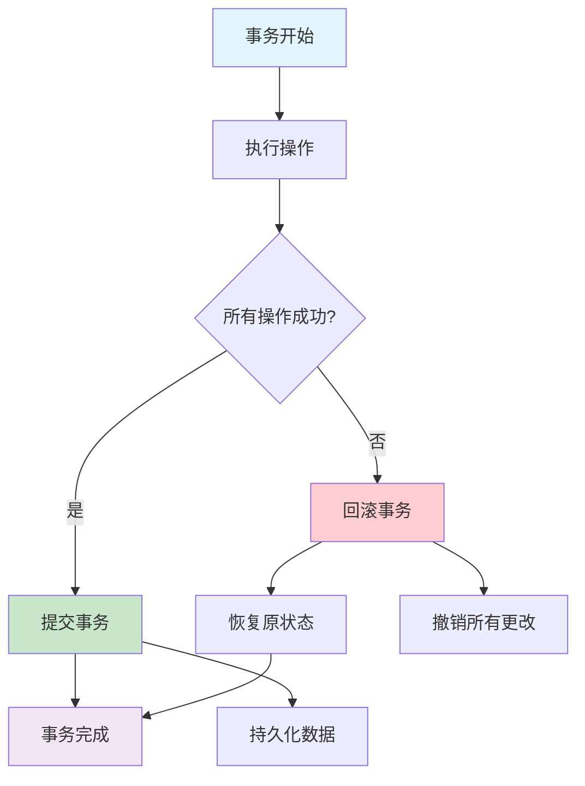

## 引言

ACID理论是数据库系统设计的基石，定义了可靠事务处理必须具备的四个基本特性。在分布式系统中，实现ACID特性面临着更大的挑战，需要在性能、可用性和一致性之间做出权衡。

## ACID理论概述

### 四大特性定义

```
┌─────────────────────────────────────┐
│            ACID 特性                │
├─────────────────────────────────────┤
│                                     │
│ A - Atomicity (原子性)              │
│     事务要么全部执行，要么全部不执行  │
│                                     │
│ C - Consistency (一致性)            │
│     事务执行前后数据库状态一致       │
│                                     │
│ I - Isolation (隔离性)              │
│     并发执行的事务相互独立          │
│                                     │
│ D - Durability (持久性)             │
│     已提交的事务永久保存            │
│                                     │
└─────────────────────────────────────┘
```

### 事务生命周期



## 详细特性分析

### 1. 原子性 (Atomicity)

原子性确保事务中的所有操作要么全部成功，要么全部失败。

```python
import threading
import time
import uuid
from enum import Enum

class TransactionState(Enum):
    ACTIVE = "活跃"
    COMMITTED = "已提交"
    ABORTED = "已中止"
    PREPARING = "准备中"

class Operation:
    """事务操作"""
    def __init__(self, operation_type, table, key, value=None, condition=None):
        self.id = str(uuid.uuid4())
        self.type = operation_type  # READ, WRITE, DELETE
        self.table = table
        self.key = key
        self.value = value
        self.condition = condition
        self.timestamp = time.time()
        self.old_value = None

class TransactionManager:
    """事务管理器 - 实现原子性"""

    def __init__(self):
        self.transactions = {}
        self.locks = {}
        self.global_lock = threading.Lock()
        self.data_store = {}

    def begin_transaction(self, tx_id=None):
        """开始事务"""
        if tx_id is None:
            tx_id = str(uuid.uuid4())

        with self.global_lock:
            self.transactions[tx_id] = {
                'id': tx_id,
                'state': TransactionState.ACTIVE,
                'operations': [],
                'undo_log': [],
                'start_time': time.time(),
                'locks_held': set()
            }

        print(f"事务 {tx_id} 开始")
        return tx_id

    def add_operation(self, tx_id, operation):
        """添加操作到事务"""
        if tx_id not in self.transactions:
            raise Exception(f"事务 {tx_id} 不存在")

        transaction = self.transactions[tx_id]
        if transaction['state'] != TransactionState.ACTIVE:
            raise Exception(f"事务 {tx_id} 状态无效: {transaction['state']}")

        transaction['operations'].append(operation)
        print(f"事务 {tx_id} 添加操作: {operation.type} {operation.table}.{operation.key}")

    def execute_operation(self, tx_id, operation):
        """执行单个操作"""
        transaction = self.transactions[tx_id]

        # 获取锁
        lock_key = f"{operation.table}.{operation.key}"
        if not self._acquire_lock(tx_id, lock_key):
            raise Exception(f"无法获取锁: {lock_key}")

        try:
            if operation.type == "READ":
                return self._execute_read(operation)
            elif operation.type == "WRITE":
                return self._execute_write(tx_id, operation)
            elif operation.type == "DELETE":
                return self._execute_delete(tx_id, operation)
            else:
                raise Exception(f"未知操作类型: {operation.type}")

        except Exception as e:
            # 操作失败，释放锁并标记事务为失败
            self._release_lock(tx_id, lock_key)
            raise e

    def _execute_read(self, operation):
        """执行读操作"""
        table_key = f"{operation.table}.{operation.key}"
        value = self.data_store.get(table_key)
        print(f"  读取 {table_key} = {value}")
        return value

    def _execute_write(self, tx_id, operation):
        """执行写操作"""
        table_key = f"{operation.table}.{operation.key}"

        # 保存旧值用于回滚
        old_value = self.data_store.get(table_key)
        self.transactions[tx_id]['undo_log'].append({
            'operation': 'WRITE',
            'key': table_key,
            'old_value': old_value,
            'new_value': operation.value
        })

        # 执行写入
        self.data_store[table_key] = operation.value
        print(f"  写入 {table_key} = {operation.value} (旧值: {old_value})")
        return True

    def _execute_delete(self, tx_id, operation):
        """执行删除操作"""
        table_key = f"{operation.table}.{operation.key}"

        # 保存旧值用于回滚
        old_value = self.data_store.get(table_key)
        if old_value is not None:
            self.transactions[tx_id]['undo_log'].append({
                'operation': 'DELETE',
                'key': table_key,
                'old_value': old_value
            })

            del self.data_store[table_key]
            print(f"  删除 {table_key} (旧值: {old_value})")
            return True
        else:
            print(f"  删除失败: {table_key} 不存在")
            return False

    def commit_transaction(self, tx_id):
        """提交事务 - 原子性保证"""
        if tx_id not in self.transactions:
            raise Exception(f"事务 {tx_id} 不存在")

        transaction = self.transactions[tx_id]

        try:
            # 执行所有操作
            for operation in transaction['operations']:
                self.execute_operation(tx_id, operation)

            # 所有操作成功，提交事务
            transaction['state'] = TransactionState.COMMITTED
            self._release_all_locks(tx_id)

            print(f"事务 {tx_id} 提交成功")
            return True

        except Exception as e:
            # 任何操作失败，回滚整个事务
            print(f"事务 {tx_id} 执行失败: {e}")
            self.rollback_transaction(tx_id)
            return False

    def rollback_transaction(self, tx_id):
        """回滚事务 - 原子性保证"""
        if tx_id not in self.transactions:
            return

        transaction = self.transactions[tx_id]

        # 根据undo log回滚所有更改
        for log_entry in reversed(transaction['undo_log']):
            if log_entry['operation'] == 'WRITE':
                if log_entry['old_value'] is not None:
                    self.data_store[log_entry['key']] = log_entry['old_value']
                else:
                    if log_entry['key'] in self.data_store:
                        del self.data_store[log_entry['key']]
            elif log_entry['operation'] == 'DELETE':
                self.data_store[log_entry['key']] = log_entry['old_value']

        transaction['state'] = TransactionState.ABORTED
        self._release_all_locks(tx_id)

        print(f"事务 {tx_id} 已回滚")

    def _acquire_lock(self, tx_id, lock_key):
        """获取锁"""
        with self.global_lock:
            if lock_key in self.locks:
                return False  # 锁已被占用

            self.locks[lock_key] = tx_id
            self.transactions[tx_id]['locks_held'].add(lock_key)
            return True

    def _release_lock(self, tx_id, lock_key):
        """释放锁"""
        with self.global_lock:
            if lock_key in self.locks and self.locks[lock_key] == tx_id:
                del self.locks[lock_key]
                self.transactions[tx_id]['locks_held'].discard(lock_key)

    def _release_all_locks(self, tx_id):
        """释放事务持有的所有锁"""
        transaction = self.transactions[tx_id]
        locks_to_release = list(transaction['locks_held'])

        for lock_key in locks_to_release:
            self._release_lock(tx_id, lock_key)

# 原子性测试
def test_atomicity():
    """测试原子性"""
    tm = TransactionManager()

    print("=== 原子性测试 ===")

    # 测试1: 成功的事务
    print("\n--- 测试1: 成功事务 ---")
    tx1 = tm.begin_transaction()
    tm.add_operation(tx1, Operation("WRITE", "users", "1", {"name": "Alice", "balance": 1000}))
    tm.add_operation(tx1, Operation("WRITE", "users", "2", {"name": "Bob", "balance": 500}))

    result1 = tm.commit_transaction(tx1)
    print(f"事务1结果: {result1}")
    print(f"数据状态: {tm.data_store}")

    # 测试2: 失败的事务（模拟失败）
    print("\n--- 测试2: 失败事务 ---")
    tx2 = tm.begin_transaction()
    tm.add_operation(tx2, Operation("WRITE", "users", "1", {"name": "Alice", "balance": 800}))
    tm.add_operation(tx2, Operation("WRITE", "users", "3", None))  # 这会失败

    # 手动模拟失败
    try:
        for op in tm.transactions[tx2]['operations']:
            if op.value is None:
                raise Exception("写入值不能为空")
            tm.execute_operation(tx2, op)
        tm.transactions[tx2]['state'] = TransactionState.COMMITTED
    except Exception as e:
        print(f"操作失败: {e}")
        tm.rollback_transaction(tx2)

    print(f"数据状态（回滚后）: {tm.data_store}")

# 运行测试
test_atomicity()
```

### 2. 一致性 (Consistency)

一致性确保事务将数据库从一个一致状态转换到另一个一致状态。

```python
class ConsistencyManager:
    """一致性管理器"""

    def __init__(self):
        self.constraints = {}
        self.triggers = {}

    def add_constraint(self, name, check_function, error_message):
        """添加数据一致性约束"""
        self.constraints[name] = {
            'check': check_function,
            'error': error_message
        }

    def add_trigger(self, event, trigger_function):
        """添加触发器维护一致性"""
        if event not in self.triggers:
            self.triggers[event] = []
        self.triggers[event].append(trigger_function)

    def validate_consistency(self, data_store, operations):
        """验证操作后的数据一致性"""
        # 创建临时数据状态用于验证
        temp_store = data_store.copy()

        # 应用所有操作到临时状态
        for operation in operations:
            self._apply_operation_to_temp_store(temp_store, operation)

        # 检查所有约束
        for constraint_name, constraint in self.constraints.items():
            if not constraint['check'](temp_store):
                raise Exception(f"一致性约束违反: {constraint['error']}")

        return True

    def _apply_operation_to_temp_store(self, temp_store, operation):
        """将操作应用到临时存储"""
        table_key = f"{operation.table}.{operation.key}"

        if operation.type == "WRITE":
            temp_store[table_key] = operation.value
        elif operation.type == "DELETE":
            if table_key in temp_store:
                del temp_store[table_key]

    def execute_triggers(self, event, data_store, operation):
        """执行触发器"""
        if event in self.triggers:
            for trigger in self.triggers[event]:
                trigger(data_store, operation)

class BankingSystem:
    """银行系统示例 - 演示一致性约束"""

    def __init__(self):
        self.tm = TransactionManager()
        self.cm = ConsistencyManager()
        self._setup_constraints()
        self._setup_triggers()

    def _setup_constraints(self):
        """设置银行系统的一致性约束"""

        def check_balance_non_negative(data_store):
            """检查账户余额非负"""
            for key, value in data_store.items():
                if key.startswith("accounts.") and isinstance(value, dict):
                    if value.get('balance', 0) < 0:
                        return False
            return True

        def check_total_balance_conservation(data_store):
            """检查总余额守恒（简化版本）"""
            total_balance = 0
            for key, value in data_store.items():
                if key.startswith("accounts.") and isinstance(value, dict):
                    total_balance += value.get('balance', 0)

            # 简化的守恒检查 - 实际应用中会更复杂
            expected_total = 10000  # 假设系统总资金
            return abs(total_balance - expected_total) < 0.01

        self.cm.add_constraint(
            "balance_non_negative",
            check_balance_non_negative,
            "账户余额不能为负数"
        )

        self.cm.add_constraint(
            "balance_conservation",
            check_total_balance_conservation,
            "系统总余额必须守恒"
        )

    def _setup_triggers(self):
        """设置触发器"""

        def audit_trigger(data_store, operation):
            """审计触发器"""
            audit_key = f"audit.{int(time.time())}.{operation.id}"
            data_store[audit_key] = {
                'operation': operation.type,
                'table': operation.table,
                'key': operation.key,
                'value': operation.value,
                'timestamp': time.time()
            }

        def update_account_modified_time(data_store, operation):
            """更新账户修改时间"""
            if operation.table == "accounts":
                account_key = f"accounts.{operation.key}"
                if account_key in data_store:
                    data_store[account_key]['last_modified'] = time.time()

        self.cm.add_trigger("WRITE", audit_trigger)
        self.cm.add_trigger("WRITE", update_account_modified_time)

    def transfer_money(self, from_account, to_account, amount):
        """转账操作 - 演示一致性维护"""
        print(f"\n=== 转账: {from_account} -> {to_account}, 金额: {amount} ===")

        tx_id = self.tm.begin_transaction()

        try:
            # 创建转账操作
            operations = []

            # 读取源账户余额
            from_key = f"accounts.{from_account}"
            from_balance = self.tm.data_store.get(from_key, {}).get('balance', 0)

            # 检查余额是否充足
            if from_balance < amount:
                raise Exception(f"余额不足: {from_balance} < {amount}")

            # 扣减源账户
            new_from_balance = from_balance - amount
            operations.append(Operation("WRITE", "accounts", from_account, {
                'balance': new_from_balance,
                'last_modified': time.time()
            }))

            # 读取目标账户余额
            to_key = f"accounts.{to_account}"
            to_balance = self.tm.data_store.get(to_key, {}).get('balance', 0)

            # 增加目标账户
            new_to_balance = to_balance + amount
            operations.append(Operation("WRITE", "accounts", to_account, {
                'balance': new_to_balance,
                'last_modified': time.time()
            }))

            # 验证一致性
            if self.cm.validate_consistency(self.tm.data_store, operations):
                # 执行操作
                for operation in operations:
                    self.tm.add_operation(tx_id, operation)

                # 提交事务
                if self.tm.commit_transaction(tx_id):
                    # 执行触发器
                    for operation in operations:
                        self.cm.execute_triggers("WRITE", self.tm.data_store, operation)

                    print(f"转账成功: {from_account}({new_from_balance}) -> {to_account}({new_to_balance})")
                    return True
                else:
                    print("转账失败: 事务提交失败")
                    return False
            else:
                print("转账失败: 一致性验证失败")
                self.tm.rollback_transaction(tx_id)
                return False

        except Exception as e:
            print(f"转账失败: {e}")
            self.tm.rollback_transaction(tx_id)
            return False

# 一致性测试
def test_consistency():
    """测试一致性"""
    banking = BankingSystem()

    # 初始化账户
    banking.tm.data_store["accounts.alice"] = {'balance': 5000, 'last_modified': time.time()}
    banking.tm.data_store["accounts.bob"] = {'balance': 3000, 'last_modified': time.time()}
    banking.tm.data_store["accounts.charlie"] = {'balance': 2000, 'last_modified': time.time()}

    print("初始状态:")
    for key, value in banking.tm.data_store.items():
        if key.startswith("accounts."):
            print(f"  {key}: {value}")

    # 测试正常转账
    banking.transfer_money("alice", "bob", 1000)

    print("\n转账后状态:")
    for key, value in banking.tm.data_store.items():
        if key.startswith("accounts."):
            print(f"  {key}: {value}")

    # 测试余额不足的转账
    banking.transfer_money("charlie", "alice", 5000)

# 运行测试
test_consistency()
```

### 3. 隔离性 (Isolation)

隔离性确保并发执行的事务不会相互干扰。

```python
import threading
import time
from enum import Enum

class IsolationLevel(Enum):
    READ_UNCOMMITTED = "读未提交"
    READ_COMMITTED = "读已提交"
    REPEATABLE_READ = "可重复读"
    SERIALIZABLE = "序列化"

class Lock:
    """锁对象"""
    def __init__(self, lock_type, resource, owner):
        self.type = lock_type  # SHARED, EXCLUSIVE
        self.resource = resource
        self.owner = owner
        self.timestamp = time.time()

class IsolationManager:
    """隔离性管理器"""

    def __init__(self, isolation_level=IsolationLevel.READ_COMMITTED):
        self.isolation_level = isolation_level
        self.locks = {}  # resource -> Lock
        self.waiting_transactions = {}  # tx_id -> [resources]
        self.lock_table = threading.Lock()
        self.version_store = {}  # 多版本并发控制

    def acquire_lock(self, tx_id, resource, lock_type):
        """获取锁"""
        with self.lock_table:
            # 检查是否已有锁
            if resource in self.locks:
                existing_lock = self.locks[resource]

                # 如果是同一个事务，检查锁升级
                if existing_lock.owner == tx_id:
                    if existing_lock.type == "SHARED" and lock_type == "EXCLUSIVE":
                        # 锁升级
                        existing_lock.type = "EXCLUSIVE"
                        print(f"事务 {tx_id} 锁升级: {resource}")
                        return True
                    return True

                # 共享锁兼容性检查
                if existing_lock.type == "SHARED" and lock_type == "SHARED":
                    # 可以共享
                    print(f"事务 {tx_id} 获取共享锁: {resource}")
                    return True

                # 锁冲突，加入等待队列
                if tx_id not in self.waiting_transactions:
                    self.waiting_transactions[tx_id] = []
                self.waiting_transactions[tx_id].append(resource)
                print(f"事务 {tx_id} 等待锁: {resource}")
                return False

            # 获取新锁
            self.locks[resource] = Lock(lock_type, resource, tx_id)
            print(f"事务 {tx_id} 获取{lock_type}锁: {resource}")
            return True

    def release_lock(self, tx_id, resource):
        """释放锁"""
        with self.lock_table:
            if resource in self.locks and self.locks[resource].owner == tx_id:
                del self.locks[resource]
                print(f"事务 {tx_id} 释放锁: {resource}")

                # 检查等待队列
                self._check_waiting_transactions(resource)

    def _check_waiting_transactions(self, resource):
        """检查等待事务队列"""
        for tx_id, waiting_resources in self.waiting_transactions.items():
            if resource in waiting_resources:
                waiting_resources.remove(resource)
                print(f"唤醒等待事务 {tx_id}")

    def read_with_isolation(self, tx_id, resource):
        """根据隔离级别执行读操作"""
        if self.isolation_level == IsolationLevel.READ_UNCOMMITTED:
            return self._read_uncommitted(resource)
        elif self.isolation_level == IsolationLevel.READ_COMMITTED:
            return self._read_committed(tx_id, resource)
        elif self.isolation_level == IsolationLevel.REPEATABLE_READ:
            return self._repeatable_read(tx_id, resource)
        elif self.isolation_level == IsolationLevel.SERIALIZABLE:
            return self._serializable_read(tx_id, resource)

    def _read_uncommitted(self, resource):
        """读未提交 - 直接读取当前值"""
        # 不需要锁，直接读取
        return f"读取{resource}的当前值"

    def _read_committed(self, tx_id, resource):
        """读已提交 - 只读取已提交的值"""
        if self.acquire_lock(tx_id, resource, "SHARED"):
            value = f"读取{resource}的已提交值"
            # 读完立即释放共享锁
            self.release_lock(tx_id, resource)
            return value
        return None

    def _repeatable_read(self, tx_id, resource):
        """可重复读 - 事务期间保持读锁"""
        if self.acquire_lock(tx_id, resource, "SHARED"):
            # 保持锁直到事务结束
            return f"读取{resource}的快照值"
        return None

    def _serializable_read(self, tx_id, resource):
        """序列化 - 最严格的隔离级别"""
        if self.acquire_lock(tx_id, resource, "SHARED"):
            # 使用范围锁防止幻读
            range_resource = f"{resource}_range"
            if self.acquire_lock(tx_id, range_resource, "SHARED"):
                return f"读取{resource}的序列化值"
        return None

class ConcurrentTransactionDemo:
    """并发事务演示"""

    def __init__(self, isolation_level=IsolationLevel.READ_COMMITTED):
        self.isolation_manager = IsolationManager(isolation_level)
        self.data_store = {"account_1": 1000, "account_2": 2000}
        self.transaction_locks = {}

    def simulate_transaction(self, tx_id, operations, delay=0.1):
        """模拟事务执行"""
        print(f"\n=== 事务 {tx_id} 开始 ===")
        self.transaction_locks[tx_id] = []

        try:
            for operation in operations:
                time.sleep(delay)  # 模拟操作延迟

                if operation['type'] == 'READ':
                    resource = operation['resource']
                    lock_acquired = self.isolation_manager.acquire_lock(
                        tx_id, resource, "SHARED")

                    if lock_acquired:
                        self.transaction_locks[tx_id].append(resource)
                        value = self.isolation_manager.read_with_isolation(tx_id, resource)
                        print(f"事务 {tx_id} 读取 {resource}: {value}")

                elif operation['type'] == 'write':
                    resource = operation['resource']
                    lock_acquired = self.isolation_manager.acquire_lock(
                        tx_id, resource, "EXCLUSIVE")

                    if lock_acquired:
                        self.transaction_locks[tx_id].append(resource)
                        self.data_store[resource] = operation['value']
                        print(f"事务 {tx_id} 写入 {resource}: {operation['value']}")

        except Exception as e:
            print(f"事务 {tx_id} 异常: {e}")

        finally:
            # 释放所有锁
            for resource in self.transaction_locks.get(tx_id, []):
                self.isolation_manager.release_lock(tx_id, resource)
            print(f"事务 {tx_id} 完成")

# 隔离性测试
def test_isolation():
    """测试不同隔离级别的效果"""

    print("=== 测试隔离性 ===")

    # 测试读已提交隔离级别
    demo = ConcurrentTransactionDemo(IsolationLevel.READ_COMMITTED)

    # 定义两个并发事务
    tx1_operations = [
        {'type': 'read', 'resource': 'account_1'},
        {'type': 'write', 'resource': 'account_1', 'value': 1500},
        {'type': 'read', 'resource': 'account_2'},
    ]

    tx2_operations = [
        {'type': 'read', 'resource': 'account_1'},
        {'type': 'write', 'resource': 'account_2', 'value': 2500},
        {'type': 'read', 'resource': 'account_1'},
    ]

    # 创建并启动并发事务
    thread1 = threading.Thread(
        target=demo.simulate_transaction,
        args=("TX1", tx1_operations, 0.2)
    )

    thread2 = threading.Thread(
        target=demo.simulate_transaction,
        args=("TX2", tx2_operations, 0.15)
    )

    thread1.start()
    thread2.start()

    thread1.join()
    thread2.join()

    print(f"\n最终数据状态: {demo.data_store}")

# 运行测试
test_isolation()
```

### 4. 持久性 (Durability)

持久性确保已提交的事务更改永久保存。

```python
import os
import json
import hashlib
import threading
from datetime import datetime

class WriteAheadLog:
    """预写日志实现持久性"""

    def __init__(self, log_file_path):
        self.log_file_path = log_file_path
        self.log_lock = threading.Lock()
        self.checkpoint_interval = 100  # 每100个操作做一次检查点

    def write_log_entry(self, tx_id, operation_type, data, lsn=None):
        """写入日志条目"""
        if lsn is None:
            lsn = self._generate_lsn()

        log_entry = {
            'lsn': lsn,
            'tx_id': tx_id,
            'timestamp': datetime.now().isoformat(),
            'operation_type': operation_type,
            'data': data,
            'checksum': self._calculate_checksum(data)
        }

        with self.log_lock:
            # 强制写入磁盘确保持久性
            with open(self.log_file_path, 'a', encoding='utf-8') as f:
                f.write(json.dumps(log_entry) + '\n')
                f.flush()  # 确保写入内核缓冲区
                os.fsync(f.fileno())  # 确保写入磁盘

        print(f"WAL写入: LSN={lsn}, TX={tx_id}, 操作={operation_type}")
        return lsn

    def _generate_lsn(self):
        """生成日志序列号"""
        import time
        return int(time.time() * 1000000)  # 微秒级时间戳

    def _calculate_checksum(self, data):
        """计算数据校验和"""
        data_str = json.dumps(data, sort_keys=True)
        return hashlib.md5(data_str.encode()).hexdigest()

    def recover_from_log(self):
        """从日志恢复数据"""
        recovered_data = {}
        committed_transactions = set()
        aborted_transactions = set()

        if not os.path.exists(self.log_file_path):
            return recovered_data

        print("开始从WAL恢复...")

        with open(self.log_file_path, 'r', encoding='utf-8') as f:
            for line in f:
                try:
                    log_entry = json.loads(line.strip())

                    if log_entry['operation_type'] == 'COMMIT':
                        committed_transactions.add(log_entry['tx_id'])
                    elif log_entry['operation_type'] == 'ABORT':
                        aborted_transactions.add(log_entry['tx_id'])
                    elif log_entry['operation_type'] == 'WRITE':
                        # 只恢复已提交事务的更改
                        tx_id = log_entry['tx_id']
                        if tx_id in committed_transactions:
                            data = log_entry['data']
                            recovered_data[data['key']] = data['value']

                except json.JSONDecodeError as e:
                    print(f"日志条目损坏: {e}")
                    continue

        print(f"恢复完成: {len(recovered_data)} 个数据项")
        return recovered_data

class DurableTransactionManager:
    """支持持久性的事务管理器"""

    def __init__(self, wal_path="transaction.wal", data_path="database.json"):
        self.wal = WriteAheadLog(wal_path)
        self.data_path = data_path
        self.data_store = {}
        self.active_transactions = {}
        self.lock = threading.Lock()

        # 从WAL恢复数据
        self._recover_from_crash()

    def _recover_from_crash(self):
        """系统启动时从WAL恢复"""
        print("=== 系统启动，检查是否需要恢复 ===")

        # 首先尝试加载已持久化的数据
        if os.path.exists(self.data_path):
            with open(self.data_path, 'r', encoding='utf-8') as f:
                self.data_store = json.load(f)
                print(f"加载已持久化数据: {len(self.data_store)} 个数据项")

        # 然后从WAL恢复未完成的事务
        recovered_data = self.wal.recover_from_log()
        self.data_store.update(recovered_data)

        print(f"最终数据状态: {len(self.data_store)} 个数据项")

    def begin_transaction(self, tx_id):
        """开始事务并记录WAL"""
        with self.lock:
            self.active_transactions[tx_id] = {
                'start_time': datetime.now(),
                'operations': []
            }

        # 记录事务开始
        self.wal.write_log_entry(tx_id, 'BEGIN', {'tx_id': tx_id})
        print(f"事务 {tx_id} 开始")

    def write_operation(self, tx_id, key, value):
        """执行写操作"""
        if tx_id not in self.active_transactions:
            raise Exception(f"事务 {tx_id} 未开始")

        # 记录操作到WAL（Write-Ahead）
        operation_data = {'key': key, 'value': value, 'old_value': self.data_store.get(key)}
        lsn = self.wal.write_log_entry(tx_id, 'WRITE', operation_data)

        # 记录操作到事务中
        self.active_transactions[tx_id]['operations'].append({
            'type': 'WRITE',
            'key': key,
            'value': value,
            'lsn': lsn
        })

        print(f"事务 {tx_id} 写操作: {key} = {value} (LSN: {lsn})")

    def commit_transaction(self, tx_id):
        """提交事务并确保持久性"""
        if tx_id not in self.active_transactions:
            raise Exception(f"事务 {tx_id} 未开始")

        try:
            # 1. 记录COMMIT到WAL
            self.wal.write_log_entry(tx_id, 'COMMIT', {'tx_id': tx_id})

            # 2. 应用所有更改到数据存储
            transaction = self.active_transactions[tx_id]
            for operation in transaction['operations']:
                if operation['type'] == 'WRITE':
                    self.data_store[operation['key']] = operation['value']

            # 3. 持久化数据到磁盘
            self._persist_data()

            # 4. 清理事务状态
            del self.active_transactions[tx_id]

            print(f"事务 {tx_id} 提交成功并已持久化")
            return True

        except Exception as e:
            print(f"事务 {tx_id} 提交失败: {e}")
            self.abort_transaction(tx_id)
            return False

    def abort_transaction(self, tx_id):
        """中止事务"""
        if tx_id not in self.active_transactions:
            return

        # 记录ABORT到WAL
        self.wal.write_log_entry(tx_id, 'ABORT', {'tx_id': tx_id})

        # 清理事务状态（不应用任何更改）
        del self.active_transactions[tx_id]

        print(f"事务 {tx_id} 已中止")

    def _persist_data(self):
        """持久化数据到磁盘"""
        temp_path = f"{self.data_path}.tmp"

        # 写入临时文件
        with open(temp_path, 'w', encoding='utf-8') as f:
            json.dump(self.data_store, f, indent=2)
            f.flush()
            os.fsync(f.fileno())

        # 原子性地替换原文件
        os.replace(temp_path, self.data_path)
        print("数据已持久化到磁盘")

class CrashSimulator:
    """崩溃模拟器 - 测试持久性"""

    @staticmethod
    def simulate_crash_during_commit():
        """模拟提交过程中崩溃"""
        print("\n=== 模拟系统崩溃测试 ===")

        # 第一阶段：正常操作然后"崩溃"
        dtm1 = DurableTransactionManager("test.wal", "test.json")

        # 清理之前的测试文件
        for file_path in ["test.wal", "test.json"]:
            if os.path.exists(file_path):
                os.remove(file_path)

        dtm1 = DurableTransactionManager("test.wal", "test.json")

        # 执行一些事务
        dtm1.begin_transaction("tx1")
        dtm1.write_operation("tx1", "user:1", {"name": "Alice", "balance": 1000})
        dtm1.write_operation("tx1", "user:2", {"name": "Bob", "balance": 2000})
        dtm1.commit_transaction("tx1")

        dtm1.begin_transaction("tx2")
        dtm1.write_operation("tx2", "user:3", {"name": "Charlie", "balance": 1500})
        # 模拟在这里崩溃，事务未提交

        print("系统在事务2未提交时'崩溃'...")

        # 第二阶段：重新启动并恢复
        print("\n=== 系统重启，开始恢复 ===")
        dtm2 = DurableTransactionManager("test.wal", "test.json")

        print(f"恢复后的数据: {dtm2.data_store}")

        # 验证数据完整性
        expected_data = {
            "user:1": {"name": "Alice", "balance": 1000},
            "user:2": {"name": "Bob", "balance": 2000}
        }

        # 事务2的数据不应该存在，因为未提交
        assert "user:3" not in dtm2.data_store
        assert dtm2.data_store["user:1"] == expected_data["user:1"]
        assert dtm2.data_store["user:2"] == expected_data["user:2"]

        print("✓ 持久性测试通过：只有已提交的事务被恢复")

        # 清理测试文件
        for file_path in ["test.wal", "test.json"]:
            if os.path.exists(file_path):
                os.remove(file_path)

# 持久性测试
def test_durability():
    """测试持久性"""
    CrashSimulator.simulate_crash_during_commit()

# 运行测试
test_durability()
```

## 分布式环境下的ACID挑战

### 分布式事务协调

```python
import threading
import time
import random
from enum import Enum

class PhaseType(Enum):
    PREPARE = "准备阶段"
    COMMIT = "提交阶段"
    ABORT = "中止阶段"

class VoteType(Enum):
    YES = "同意"
    NO = "拒绝"
    TIMEOUT = "超时"

class TwoPhaseCommitCoordinator:
    """两阶段提交协调器"""

    def __init__(self, participants):
        self.participants = participants
        self.transaction_log = {}

    def execute_distributed_transaction(self, tx_id, operations):
        """执行分布式事务"""
        print(f"\n=== 分布式事务 {tx_id} 开始 ===")

        # 阶段1：准备阶段
        prepare_success = self._prepare_phase(tx_id, operations)

        if prepare_success:
            # 阶段2：提交阶段
            return self._commit_phase(tx_id)
        else:
            # 中止事务
            return self._abort_phase(tx_id)

    def _prepare_phase(self, tx_id, operations):
        """准备阶段 - 询问所有参与者是否准备好提交"""
        print(f"阶段1: 准备阶段")

        votes = {}
        vote_threads = []

        def collect_vote(participant, operations):
            try:
                vote = participant.prepare(tx_id, operations)
                votes[participant.id] = vote
                print(f"  参与者 {participant.id} 投票: {vote.value}")
            except Exception as e:
                votes[participant.id] = VoteType.TIMEOUT
                print(f"  参与者 {participant.id} 超时: {e}")

        # 并行向所有参与者发送准备请求
        for participant in self.participants:
            thread = threading.Thread(
                target=collect_vote,
                args=(participant, operations.get(participant.id, []))
            )
            vote_threads.append(thread)
            thread.start()

        # 等待所有投票（设置超时）
        for thread in vote_threads:
            thread.join(timeout=5.0)

        # 检查投票结果
        all_yes = all(vote == VoteType.YES for vote in votes.values())
        missing_votes = len(self.participants) - len(votes)

        if missing_votes > 0:
            print(f"  有 {missing_votes} 个参与者未响应")

        print(f"  投票结果: {dict(votes)}")
        print(f"  准备阶段{'成功' if all_yes else '失败'}")

        return all_yes and missing_votes == 0

    def _commit_phase(self, tx_id):
        """提交阶段"""
        print(f"阶段2: 提交阶段")

        commit_threads = []
        commit_results = {}

        def send_commit(participant):
            try:
                result = participant.commit(tx_id)
                commit_results[participant.id] = result
                print(f"  参与者 {participant.id} 提交: {'成功' if result else '失败'}")
            except Exception as e:
                commit_results[participant.id] = False
                print(f"  参与者 {participant.id} 提交异常: {e}")

        # 并行向所有参与者发送提交请求
        for participant in self.participants:
            thread = threading.Thread(target=send_commit, args=(participant,))
            commit_threads.append(thread)
            thread.start()

        # 等待所有提交完成
        for thread in commit_threads:
            thread.join()

        success = all(commit_results.values())
        print(f"  分布式事务 {tx_id} {'提交成功' if success else '提交失败'}")

        return success

    def _abort_phase(self, tx_id):
        """中止阶段"""
        print(f"阶段2: 中止阶段")

        abort_threads = []

        def send_abort(participant):
            try:
                participant.abort(tx_id)
                print(f"  参与者 {participant.id} 已中止")
            except Exception as e:
                print(f"  参与者 {participant.id} 中止异常: {e}")

        # 通知所有参与者中止
        for participant in self.participants:
            thread = threading.Thread(target=send_abort, args=(participant,))
            abort_threads.append(thread)
            thread.start()

        # 等待所有中止完成
        for thread in abort_threads:
            thread.join()

        print(f"  分布式事务 {tx_id} 已中止")
        return False

class DistributedParticipant:
    """分布式事务参与者"""

    def __init__(self, participant_id, failure_rate=0.0):
        self.id = participant_id
        self.failure_rate = failure_rate
        self.prepared_transactions = {}
        self.committed_transactions = set()
        self.local_data = {}

    def prepare(self, tx_id, operations):
        """准备阶段响应"""
        # 模拟网络延迟
        time.sleep(random.uniform(0.1, 0.5))

        # 模拟故障
        if random.random() < self.failure_rate:
            raise Exception("参与者故障")

        # 检查是否能执行操作
        can_commit = self._validate_operations(operations)

        if can_commit:
            # 记录准备状态
            self.prepared_transactions[tx_id] = operations
            return VoteType.YES
        else:
            return VoteType.NO

    def commit(self, tx_id):
        """提交阶段响应"""
        if tx_id not in self.prepared_transactions:
            return False

        try:
            # 执行已准备的操作
            operations = self.prepared_transactions[tx_id]
            for operation in operations:
                self._execute_operation(operation)

            # 记录提交状态
            self.committed_transactions.add(tx_id)
            del self.prepared_transactions[tx_id]

            return True

        except Exception as e:
            print(f"参与者 {self.id} 提交失败: {e}")
            return False

    def abort(self, tx_id):
        """中止事务"""
        if tx_id in self.prepared_transactions:
            del self.prepared_transactions[tx_id]

    def _validate_operations(self, operations):
        """验证操作是否可以执行"""
        # 简化的验证逻辑
        return len(operations) <= 10  # 假设限制操作数量

    def _execute_operation(self, operation):
        """执行具体操作"""
        if operation['type'] == 'write':
            self.local_data[operation['key']] = operation['value']
        elif operation['type'] == 'delete':
            if operation['key'] in self.local_data:
                del self.local_data[operation['key']]

# 分布式ACID测试
def test_distributed_acid():
    """测试分布式ACID"""
    print("=== 分布式ACID测试 ===")

    # 创建参与者
    participants = [
        DistributedParticipant("db1", failure_rate=0.1),
        DistributedParticipant("db2", failure_rate=0.1),
        DistributedParticipant("db3", failure_rate=0.1)
    ]

    # 创建协调器
    coordinator = TwoPhaseCommitCoordinator(participants)

    # 定义分布式操作
    operations = {
        "db1": [
            {'type': 'write', 'key': 'user:1', 'value': {'name': 'Alice', 'balance': 900}},
        ],
        "db2": [
            {'type': 'write', 'key': 'user:2', 'value': {'name': 'Bob', 'balance': 1100}},
        ],
        "db3": [
            {'type': 'write', 'key': 'transfer_log', 'value': {'from': 'user:1', 'to': 'user:2', 'amount': 100}},
        ]
    }

    # 执行分布式事务
    success = coordinator.execute_distributed_transaction("dtx_001", operations)

    print(f"\n分布式事务结果: {'成功' if success else '失败'}")

    # 显示各参与者的最终状态
    for participant in participants:
        print(f"参与者 {participant.id} 数据: {participant.local_data}")

# 运行测试
test_distributed_acid()
```

## 性能优化策略

### ACID性能对比

```
┌──────────────────┬──────────────┬──────────────┬──────────────┐
│ 事务模式         │ 吞吐量        │ 延迟         │ 一致性       │
├──────────────────┼──────────────┼──────────────┼──────────────┤
│ 完整ACID        │ 低           │ 高           │ 强一致       │
│ 弱化隔离        │ 中等         │ 中等         │ 弱一致       │
│ 异步提交        │ 高           │ 低           │ 最终一致     │
│ 无事务          │ 最高         │ 最低         │ 不保证       │
└──────────────────┴──────────────┴──────────────┴──────────────┘
```

### 优化实现

```python
class OptimizedACIDSystem:
    """优化的ACID系统实现"""

    def __init__(self):
        self.mvcc_storage = {}  # 多版本并发控制
        self.lock_free_structures = {}  # 无锁数据结构
        self.async_commit_queue = []  # 异步提交队列

    def mvcc_read(self, key, tx_timestamp):
        """多版本并发控制读取"""
        versions = self.mvcc_storage.get(key, [])

        # 找到小于等于事务时间戳的最新版本
        valid_version = None
        for version in reversed(versions):
            if version['timestamp'] <= tx_timestamp:
                valid_version = version
                break

        return valid_version['value'] if valid_version else None

    def mvcc_write(self, key, value, tx_timestamp):
        """多版本并发控制写入"""
        if key not in self.mvcc_storage:
            self.mvcc_storage[key] = []

        new_version = {
            'value': value,
            'timestamp': tx_timestamp,
            'committed': False
        }

        self.mvcc_storage[key].append(new_version)

    def async_commit(self, tx_id, operations):
        """异步提交优化"""
        # 立即返回成功，后台异步处理
        self.async_commit_queue.append({
            'tx_id': tx_id,
            'operations': operations,
            'timestamp': time.time()
        })

        # 启动后台处理线程
        threading.Thread(target=self._process_async_commits).start()

        return True  # 立即返回

    def _process_async_commits(self):
        """处理异步提交队列"""
        while self.async_commit_queue:
            commit_item = self.async_commit_queue.pop(0)
            try:
                # 实际执行提交操作
                self._execute_commit(commit_item)
            except Exception as e:
                print(f"异步提交失败: {e}")

# 性能测试
def performance_comparison():
    """ACID性能对比测试"""
    print("=== ACID性能对比测试 ===")

    systems = {
        'Full ACID': lambda: time.sleep(0.1),  # 模拟完整ACID延迟
        'Optimized ACID': lambda: time.sleep(0.05),  # 优化后的延迟
        'Eventual Consistency': lambda: time.sleep(0.01),  # 最终一致性延迟
    }

    for system_name, operation in systems.items():
        start_time = time.time()

        # 执行1000个操作
        for i in range(1000):
            operation()

        end_time = time.time()
        total_time = end_time - start_time
        throughput = 1000 / total_time

        print(f"{system_name}: {throughput:.2f} ops/sec, 总时间: {total_time:.2f}s")

# 运行性能测试
performance_comparison()
```

## 总结

ACID理论为数据库事务处理提供了可靠性保证：

### 核心要点

1. **原子性**：确保事务的全有或全无执行
2. **一致性**：维护数据的完整性约束
3. **隔离性**：防止并发事务相互干扰
4. **持久性**：保证已提交更改的永久性

### 分布式挑战

```
单机ACID ──→ 分布式ACID
    │              │
    ├─ 简单实现     ├─ 复杂协调
    ├─ 高性能      ├─ 网络开销
    ├─ 强一致性    ├─ 最终一致性
    └─ 单点故障    └─ 分区容错
```

### 实践建议

1. **场景选择**：根据业务需求选择合适的ACID级别
2. **性能权衡**：在一致性和性能之间找到平衡
3. **容错设计**：考虑网络分区和节点故障
4. **监控告警**：建立完善的事务监控体系

ACID理论虽然在分布式环境下面临挑战，但仍然是构建可靠数据系统的重要指导原则。

## 参考资料

1. Gray, J., & Reuter, A. (1992). Transaction Processing: Concepts and Techniques
2. Bernstein, P. A., & Newcomer, E. (2009). Principles of Transaction Processing
3. Bailis, P., & Ghodsi, A. (2013). Eventual consistency today