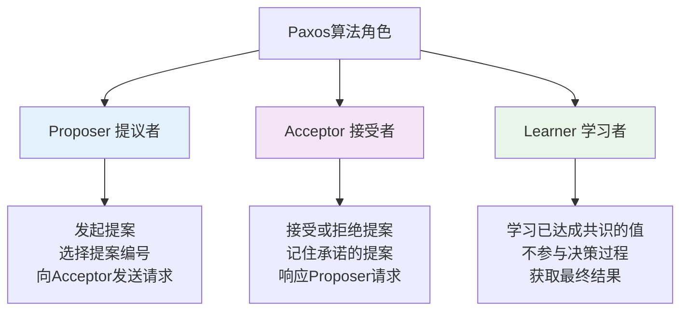

## 引言

Paxos算法是分布式系统中最重要的共识算法之一，由图灵奖获得者Leslie Lamport在1990年提出。它解决了在不可靠网络环境中，多个节点如何就某个值达成一致的问题。Paxos算法是许多现代分布式系统（如Google Chubby、Apache ZooKeeper）的理论基础。

## Paxos算法概述

### 问题定义

在分布式系统中，多个节点需要对某个提案（proposal）达成一致，但面临以下挑战：

```
分布式共识挑战：
┌─────────────────────────────────────┐
│ • 网络分区：节点间通信可能中断        │
│ • 节点故障：节点可能崩溃或重启        │
│ • 消息丢失：网络消息可能丢失或延迟    │
│ • 消息乱序：消息可能不按发送顺序到达  │
│ • 网络延迟：消息传递存在不确定延迟    │
└─────────────────────────────────────┘
```

### 算法角色



## 基础Paxos算法

### 两阶段协议

Paxos算法采用两阶段提交协议：

```
阶段一：Prepare阶段
┌─────────────────────────────────────┐
│ 1. Proposer选择提案编号n            │
│ 2. 向Acceptor发送Prepare(n)请求     │
│ 3. Acceptor响应Promise或拒绝         │
└─────────────────────────────────────┘

阶段二：Accept阶段
┌─────────────────────────────────────┐
│ 1. Proposer发送Accept(n,v)请求      │
│ 2. Acceptor响应Accepted或拒绝        │
│ 3. 达成共识或重新开始               │
└─────────────────────────────────────┘
```

### Java实现

```java
import java.util.*;
import java.util.concurrent.*;
import java.util.concurrent.atomic.AtomicLong;

/**
 * Paxos算法实现
 */
public class PaxosAlgorithm {

    /**
     * 提案类
     */
    public static class Proposal {
        private final long proposalNumber;
        private final String value;
        private final String proposerId;
        private final long timestamp;

        public Proposal(long proposalNumber, String value, String proposerId) {
            this.proposalNumber = proposalNumber;
            this.value = value;
            this.proposerId = proposerId;
            this.timestamp = System.currentTimeMillis();
        }

        public long getProposalNumber() { return proposalNumber; }
        public String getValue() { return value; }
        public String getProposerId() { return proposerId; }
        public long getTimestamp() { return timestamp; }

        @Override
        public boolean equals(Object obj) {
            if (this == obj) return true;
            if (!(obj instanceof Proposal)) return false;
            Proposal other = (Proposal) obj;
            return proposalNumber == other.proposalNumber &&
                   Objects.equals(proposerId, other.proposerId);
        }

        @Override
        public int hashCode() {
            return Objects.hash(proposalNumber, proposerId);
        }

        @Override
        public String toString() {
            return String.format("Proposal{n=%d, v='%s', proposer='%s'}",
                               proposalNumber, value, proposerId);
        }
    }

    /**
     * Promise响应类
     */
    public static class PromiseResponse {
        private final boolean accepted;
        private final Proposal acceptedProposal;
        private final String acceptorId;
        private final String reason;

        public PromiseResponse(boolean accepted, Proposal acceptedProposal,
                             String acceptorId, String reason) {
            this.accepted = accepted;
            this.acceptedProposal = acceptedProposal;
            this.acceptorId = acceptorId;
            this.reason = reason;
        }

        public boolean isAccepted() { return accepted; }
        public Proposal getAcceptedProposal() { return acceptedProposal; }
        public String getAcceptorId() { return acceptorId; }
        public String getReason() { return reason; }
    }

    /**
     * Accept响应类
     */
    public static class AcceptResponse {
        private final boolean accepted;
        private final Proposal proposal;
        private final String acceptorId;
        private final String reason;

        public AcceptResponse(boolean accepted, Proposal proposal,
                            String acceptorId, String reason) {
            this.accepted = accepted;
            this.proposal = proposal;
            this.acceptorId = acceptorId;
            this.reason = reason;
        }

        public boolean isAccepted() { return accepted; }
        public Proposal getProposal() { return proposal; }
        public String getAcceptorId() { return acceptorId; }
        public String getReason() { return reason; }
    }

    /**
     * Proposer实现
     */
    public static class Proposer {
        private final String proposerId;
        private final AtomicLong proposalCounter;
        private final List<Acceptor> acceptors;
        private final ExecutorService executor;
        private final int majoritySize;

        public Proposer(String proposerId, List<Acceptor> acceptors) {
            this.proposerId = proposerId;
            this.proposalCounter = new AtomicLong(0);
            this.acceptors = acceptors;
            this.executor = Executors.newCachedThreadPool();
            this.majoritySize = (acceptors.size() / 2) + 1;
        }

        /**
         * 提议一个值
         */
        public CompletableFuture<String> propose(String value) {
            long proposalNumber = generateProposalNumber();
            Proposal proposal = new Proposal(proposalNumber, value, proposerId);

            System.out.printf("Proposer %s 开始提议: %s%n", proposerId, proposal);

            return preparePhase(proposal)
                .thenCompose(prepareResult -> {
                    if (prepareResult == null) {
                        return CompletableFuture.completedFuture("PREPARE_FAILED");
                    }
                    return acceptPhase(prepareResult);
                })
                .exceptionally(throwable -> {
                    System.err.printf("Proposer %s 提议失败: %s%n",
                                     proposerId, throwable.getMessage());
                    return "FAILED: " + throwable.getMessage();
                });
        }

        /**
         * Prepare阶段
         */
        private CompletableFuture<Proposal> preparePhase(Proposal proposal) {
            System.out.printf("Proposer %s 开始Prepare阶段: n=%d%n",
                             proposerId, proposal.getProposalNumber());

            List<CompletableFuture<PromiseResponse>> prepareFutures = new ArrayList<>();

            for (Acceptor acceptor : acceptors) {
                CompletableFuture<PromiseResponse> future = CompletableFuture
                    .supplyAsync(() -> acceptor.prepare(proposal), executor);
                prepareFutures.add(future);
            }

            return CompletableFuture.allOf(prepareFutures.toArray(new CompletableFuture[0]))
                .thenApply(v -> {
                    List<PromiseResponse> responses = prepareFutures.stream()
                        .map(CompletableFuture::join)
                        .collect(Collectors.toList());

                    return processPrepareResponses(proposal, responses);
                });
        }

        /**
         * 处理Prepare响应
         */
        private Proposal processPrepareResponses(Proposal originalProposal,
                                               List<PromiseResponse> responses) {
            List<PromiseResponse> promises = responses.stream()
                .filter(PromiseResponse::isAccepted)
                .collect(Collectors.toList());

            System.out.printf("Proposer %s 收到 %d/%d Promise响应%n",
                             proposerId, promises.size(), responses.size());

            if (promises.size() < majoritySize) {
                System.out.printf("Proposer %s Prepare失败: 未获得多数Promise%n", proposerId);
                return null;
            }

            // 选择已接受的提案中编号最大的值
            Proposal highestProposal = promises.stream()
                .map(PromiseResponse::getAcceptedProposal)
                .filter(Objects::nonNull)
                .max(Comparator.comparingLong(Proposal::getProposalNumber))
                .orElse(null);

            if (highestProposal != null) {
                // 使用已接受的值
                return new Proposal(originalProposal.getProposalNumber(),
                                  highestProposal.getValue(), proposerId);
            } else {
                // 使用原始提议值
                return originalProposal;
            }
        }

        /**
         * Accept阶段
         */
        private CompletableFuture<String> acceptPhase(Proposal proposal) {
            System.out.printf("Proposer %s 开始Accept阶段: %s%n", proposerId, proposal);

            List<CompletableFuture<AcceptResponse>> acceptFutures = new ArrayList<>();

            for (Acceptor acceptor : acceptors) {
                CompletableFuture<AcceptResponse> future = CompletableFuture
                    .supplyAsync(() -> acceptor.accept(proposal), executor);
                acceptFutures.add(future);
            }

            return CompletableFuture.allOf(acceptFutures.toArray(new CompletableFuture[0]))
                .thenApply(v -> {
                    List<AcceptResponse> responses = acceptFutures.stream()
                        .map(CompletableFuture::join)
                        .collect(Collectors.toList());

                    return processAcceptResponses(proposal, responses);
                });
        }

        /**
         * 处理Accept响应
         */
        private String processAcceptResponses(Proposal proposal, List<AcceptResponse> responses) {
            List<AcceptResponse> accepts = responses.stream()
                .filter(AcceptResponse::isAccepted)
                .collect(Collectors.toList());

            System.out.printf("Proposer %s 收到 %d/%d Accept响应%n",
                             proposerId, accepts.size(), responses.size());

            if (accepts.size() >= majoritySize) {
                System.out.printf("Proposer %s 提议成功: %s%n", proposerId, proposal);
                return "SUCCESS: " + proposal.getValue();
            } else {
                System.out.printf("Proposer %s Accept失败: 未获得多数Accept%n", proposerId);
                return "ACCEPT_FAILED";
            }
        }

        /**
         * 生成提案编号
         */
        private long generateProposalNumber() {
            // 使用时间戳和计数器生成唯一递增的提案编号
            long timestamp = System.currentTimeMillis();
            long counter = proposalCounter.incrementAndGet();
            return (timestamp << 16) | (counter & 0xFFFF);
        }

        public void shutdown() {
            executor.shutdown();
        }
    }

    /**
     * Acceptor实现
     */
    public static class Acceptor {
        private final String acceptorId;
        private volatile Long promisedProposalNumber;
        private volatile Proposal acceptedProposal;
        private final Object lock = new Object();

        public Acceptor(String acceptorId) {
            this.acceptorId = acceptorId;
            this.promisedProposalNumber = null;
            this.acceptedProposal = null;
        }

        /**
         * 处理Prepare请求
         */
        public PromiseResponse prepare(Proposal proposal) {
            synchronized (lock) {
                long proposalNumber = proposal.getProposalNumber();

                System.out.printf("Acceptor %s 收到Prepare请求: n=%d%n",
                                 acceptorId, proposalNumber);

                // 检查是否已经承诺过更高编号的提案
                if (promisedProposalNumber != null && proposalNumber <= promisedProposalNumber) {
                    String reason = String.format("已承诺更高编号的提案: %d", promisedProposalNumber);
                    System.out.printf("Acceptor %s 拒绝Prepare: %s%n", acceptorId, reason);
                    return new PromiseResponse(false, null, acceptorId, reason);
                }

                // 承诺不再接受编号小于n的提案
                promisedProposalNumber = proposalNumber;

                System.out.printf("Acceptor %s 承诺提案: n=%d%n", acceptorId, proposalNumber);

                return new PromiseResponse(true, acceptedProposal, acceptorId, "Promise成功");
            }
        }

        /**
         * 处理Accept请求
         */
        public AcceptResponse accept(Proposal proposal) {
            synchronized (lock) {
                long proposalNumber = proposal.getProposalNumber();

                System.out.printf("Acceptor %s 收到Accept请求: %s%n", acceptorId, proposal);

                // 检查是否违反了之前的承诺
                if (promisedProposalNumber != null && proposalNumber < promisedProposalNumber) {
                    String reason = String.format("违反承诺: 承诺编号=%d, 请求编号=%d",
                                                 promisedProposalNumber, proposalNumber);
                    System.out.printf("Acceptor %s 拒绝Accept: %s%n", acceptorId, reason);
                    return new AcceptResponse(false, proposal, acceptorId, reason);
                }

                // 接受提案
                acceptedProposal = proposal;
                promisedProposalNumber = proposalNumber;

                System.out.printf("Acceptor %s 接受提案: %s%n", acceptorId, proposal);

                return new AcceptResponse(true, proposal, acceptorId, "Accept成功");
            }
        }

        public String getAcceptorId() {
            return acceptorId;
        }

        public Proposal getAcceptedProposal() {
            synchronized (lock) {
                return acceptedProposal;
            }
        }
    }

    /**
     * Learner实现
     */
    public static class Learner {
        private final String learnerId;
        private final List<Acceptor> acceptors;
        private final int majoritySize;

        public Learner(String learnerId, List<Acceptor> acceptors) {
            this.learnerId = learnerId;
            this.acceptors = acceptors;
            this.majoritySize = (acceptors.size() / 2) + 1;
        }

        /**
         * 学习已达成共识的值
         */
        public String learn() {
            Map<Proposal, Integer> proposalCounts = new HashMap<>();

            for (Acceptor acceptor : acceptors) {
                Proposal accepted = acceptor.getAcceptedProposal();
                if (accepted != null) {
                    proposalCounts.put(accepted, proposalCounts.getOrDefault(accepted, 0) + 1);
                }
            }

            // 查找获得多数接受的提案
            for (Map.Entry<Proposal, Integer> entry : proposalCounts.entrySet()) {
                if (entry.getValue() >= majoritySize) {
                    Proposal consensusProposal = entry.getKey();
                    System.out.printf("Learner %s 学习到共识值: %s%n",
                                     learnerId, consensusProposal.getValue());
                    return consensusProposal.getValue();
                }
            }

            System.out.printf("Learner %s 未发现共识值%n", learnerId);
            return null;
        }
    }
}

/**
 * Paxos演示程序
 */
class PaxosDemo {
    public static void main(String[] args) throws Exception {
        System.out.println("=== Paxos算法演示 ===");

        // 创建5个Acceptor
        List<PaxosAlgorithm.Acceptor> acceptors = Arrays.asList(
            new PaxosAlgorithm.Acceptor("A1"),
            new PaxosAlgorithm.Acceptor("A2"),
            new PaxosAlgorithm.Acceptor("A3"),
            new PaxosAlgorithm.Acceptor("A4"),
            new PaxosAlgorithm.Acceptor("A5")
        );

        // 创建Proposer
        PaxosAlgorithm.Proposer proposer1 = new PaxosAlgorithm.Proposer("P1", acceptors);
        PaxosAlgorithm.Proposer proposer2 = new PaxosAlgorithm.Proposer("P2", acceptors);

        // 创建Learner
        PaxosAlgorithm.Learner learner = new PaxosAlgorithm.Learner("L1", acceptors);

        try {
            // 测试单个提议
            System.out.println("\n--- 测试1: 单个提议 ---");
            String result1 = proposer1.propose("value_A").get();
            System.out.println("提议结果: " + result1);

            String learned1 = learner.learn();
            System.out.println("学习结果: " + learned1);

            // 测试并发提议
            System.out.println("\n--- 测试2: 并发提议 ---");
            CompletableFuture<String> future1 = proposer1.propose("value_B");
            CompletableFuture<String> future2 = proposer2.propose("value_C");

            String result2 = future1.get();
            String result3 = future2.get();

            System.out.println("Proposer1结果: " + result2);
            System.out.println("Proposer2结果: " + result3);

            String learned2 = learner.learn();
            System.out.println("最终共识值: " + learned2);

        } finally {
            proposer1.shutdown();
            proposer2.shutdown();
        }
    }
}
```

## Multi-Paxos优化

基础Paxos每次只能对一个值达成共识，Multi-Paxos通过选举Leader来优化性能：

```java
import java.util.concurrent.atomic.AtomicReference;

/**
 * Multi-Paxos实现
 */
public class MultiPaxos {

    /**
     * 实例状态
     */
    public static class InstanceState {
        private final int instanceId;
        private volatile PaxosAlgorithm.Proposal acceptedProposal;
        private volatile Long promisedProposalNumber;
        private volatile boolean decided;
        private volatile String decidedValue;

        public InstanceState(int instanceId) {
            this.instanceId = instanceId;
            this.decided = false;
        }

        public synchronized boolean isDecided() { return decided; }
        public synchronized String getDecidedValue() { return decidedValue; }

        public synchronized void decide(String value) {
            this.decided = true;
            this.decidedValue = value;
        }

        public int getInstanceId() { return instanceId; }
        public PaxosAlgorithm.Proposal getAcceptedProposal() { return acceptedProposal; }
        public void setAcceptedProposal(PaxosAlgorithm.Proposal proposal) { this.acceptedProposal = proposal; }
        public Long getPromisedProposalNumber() { return promisedProposalNumber; }
        public void setPromisedProposalNumber(Long number) { this.promisedProposalNumber = number; }
    }

    /**
     * Multi-Paxos节点
     */
    public static class MultiPaxosNode {
        private final String nodeId;
        private final List<MultiPaxosNode> peers;
        private final Map<Integer, InstanceState> instances;
        private final AtomicReference<String> currentLeader;
        private final AtomicLong proposalCounter;
        private final ExecutorService executor;
        private final int majoritySize;

        public MultiPaxosNode(String nodeId, List<MultiPaxosNode> peers) {
            this.nodeId = nodeId;
            this.peers = peers;
            this.instances = new ConcurrentHashMap<>();
            this.currentLeader = new AtomicReference<>();
            this.proposalCounter = new AtomicLong(0);
            this.executor = Executors.newCachedThreadPool();
            this.majoritySize = (peers.size() + 1) / 2 + 1; // 包括自己
        }

        /**
         * 提交值到指定实例
         */
        public CompletableFuture<String> submit(int instanceId, String value) {
            if (!isLeader()) {
                // 如果不是Leader，尝试成为Leader
                return becomeLeader().thenCompose(success -> {
                    if (success) {
                        return submitAsLeader(instanceId, value);
                    } else {
                        return CompletableFuture.completedFuture("NOT_LEADER");
                    }
                });
            } else {
                return submitAsLeader(instanceId, value);
            }
        }

        /**
         * 作为Leader提交值
         */
        private CompletableFuture<String> submitAsLeader(int instanceId, String value) {
            InstanceState instance = instances.computeIfAbsent(instanceId, InstanceState::new);

            if (instance.isDecided()) {
                return CompletableFuture.completedFuture("ALREADY_DECIDED: " + instance.getDecidedValue());
            }

            long proposalNumber = generateProposalNumber();
            PaxosAlgorithm.Proposal proposal = new PaxosAlgorithm.Proposal(proposalNumber, value, nodeId);

            System.out.printf("Leader %s 为实例 %d 提议: %s%n", nodeId, instanceId, proposal);

            // 作为Leader，可以跳过Prepare阶段直接进入Accept阶段
            return acceptPhase(instanceId, proposal);
        }

        /**
         * Accept阶段
         */
        private CompletableFuture<String> acceptPhase(int instanceId, PaxosAlgorithm.Proposal proposal) {
            List<CompletableFuture<Boolean>> acceptFutures = new ArrayList<>();

            // 发送Accept请求到所有节点（包括自己）
            acceptFutures.add(CompletableFuture.completedFuture(acceptLocally(instanceId, proposal)));

            for (MultiPaxosNode peer : peers) {
                CompletableFuture<Boolean> future = CompletableFuture
                    .supplyAsync(() -> peer.receiveAccept(instanceId, proposal), executor);
                acceptFutures.add(future);
            }

            return CompletableFuture.allOf(acceptFutures.toArray(new CompletableFuture[0]))
                .thenApply(v -> {
                    long acceptCount = acceptFutures.stream()
                        .mapToLong(f -> f.join() ? 1 : 0)
                        .sum();

                    if (acceptCount >= majoritySize) {
                        // 达成共识，通知所有节点
                        notifyDecision(instanceId, proposal.getValue());
                        return "SUCCESS: " + proposal.getValue();
                    } else {
                        return "ACCEPT_FAILED";
                    }
                });
        }

        /**
         * 本地接受提案
         */
        private boolean acceptLocally(int instanceId, PaxosAlgorithm.Proposal proposal) {
            InstanceState instance = instances.computeIfAbsent(instanceId, InstanceState::new);

            synchronized (instance) {
                if (instance.isDecided()) {
                    return false;
                }

                Long promisedNumber = instance.getPromisedProposalNumber();
                if (promisedNumber != null && proposal.getProposalNumber() < promisedNumber) {
                    return false;
                }

                instance.setAcceptedProposal(proposal);
                instance.setPromisedProposalNumber(proposal.getProposalNumber());

                System.out.printf("节点 %s 接受实例 %d 的提案: %s%n", nodeId, instanceId, proposal);
                return true;
            }
        }

        /**
         * 接收Accept请求
         */
        public boolean receiveAccept(int instanceId, PaxosAlgorithm.Proposal proposal) {
            return acceptLocally(instanceId, proposal);
        }

        /**
         * 通知决策结果
         */
        private void notifyDecision(int instanceId, String value) {
            InstanceState instance = instances.get(instanceId);
            if (instance != null) {
                instance.decide(value);
            }

            // 异步通知所有节点
            for (MultiPaxosNode peer : peers) {
                executor.submit(() -> peer.receiveDecision(instanceId, value));
            }

            System.out.printf("Leader %s 宣布实例 %d 的决策: %s%n", nodeId, instanceId, value);
        }

        /**
         * 接收决策通知
         */
        public void receiveDecision(int instanceId, String value) {
            InstanceState instance = instances.computeIfAbsent(instanceId, InstanceState::new);
            instance.decide(value);
            System.out.printf("节点 %s 收到实例 %d 的决策: %s%n", nodeId, instanceId, value);
        }

        /**
         * 尝试成为Leader
         */
        private CompletableFuture<Boolean> becomeLeader() {
            currentLeader.set(nodeId);
            System.out.printf("节点 %s 成为Leader%n", nodeId);
            // 简化实现，实际中需要Leader选举过程
            return CompletableFuture.completedFuture(true);
        }

        /**
         * 检查是否为Leader
         */
        private boolean isLeader() {
            return nodeId.equals(currentLeader.get());
        }

        /**
         * 生成提案编号
         */
        private long generateProposalNumber() {
            long timestamp = System.currentTimeMillis();
            long counter = proposalCounter.incrementAndGet();
            return (timestamp << 16) | (counter & 0xFFFF);
        }

        /**
         * 获取实例状态
         */
        public String getInstanceValue(int instanceId) {
            InstanceState instance = instances.get(instanceId);
            return instance != null && instance.isDecided() ? instance.getDecidedValue() : null;
        }

        public String getNodeId() { return nodeId; }

        public void shutdown() {
            executor.shutdown();
        }
    }
}

/**
 * Multi-Paxos演示
 */
class MultiPaxosDemo {
    public static void main(String[] args) throws Exception {
        System.out.println("=== Multi-Paxos算法演示 ===");

        // 创建5个节点
        List<MultiPaxos.MultiPaxosNode> nodes = new ArrayList<>();
        for (int i = 1; i <= 5; i++) {
            nodes.add(new MultiPaxos.MultiPaxosNode("Node" + i, new ArrayList<>()));
        }

        // 设置peers关系
        for (MultiPaxos.MultiPaxosNode node : nodes) {
            List<MultiPaxos.MultiPaxosNode> peers = new ArrayList<>(nodes);
            peers.remove(node);
            // 反射设置peers（简化演示）
            // 实际实现中应在构造函数中正确设置
        }

        try {
            // 模拟多个实例的共识
            MultiPaxos.MultiPaxosNode leader = nodes.get(0);

            List<CompletableFuture<String>> futures = new ArrayList<>();

            // 并发提交多个实例
            for (int i = 1; i <= 3; i++) {
                String value = "Command_" + i;
                CompletableFuture<String> future = leader.submit(i, value);
                futures.add(future);
                System.out.printf("提交实例 %d: %s%n", i, value);
            }

            // 等待所有提交完成
            CompletableFuture.allOf(futures.toArray(new CompletableFuture[0])).get();

            // 打印结果
            System.out.println("\n--- 共识结果 ---");
            for (int i = 1; i <= 3; i++) {
                for (MultiPaxos.MultiPaxosNode node : nodes) {
                    String value = node.getInstanceValue(i);
                    System.out.printf("节点 %s 实例 %d: %s%n",
                                     node.getNodeId(), i, value);
                }
                System.out.println();
            }

        } finally {
            for (MultiPaxos.MultiPaxosNode node : nodes) {
                node.shutdown();
            }
        }
    }
}
```

## Paxos变种与优化

### Fast Paxos

Fast Paxos允许在某些条件下跳过Prepare阶段：

```java
/**
 * Fast Paxos实现
 */
public class FastPaxos {

    /**
     * Fast Paxos条件检查
     */
    public static class FastPaxosCondition {
        /**
         * 检查是否可以使用Fast路径
         */
        public static boolean canUseFastPath(List<PaxosAlgorithm.Acceptor> acceptors,
                                           PaxosAlgorithm.Proposal proposal) {
            // 条件1: 没有并发的Proposer
            // 条件2: 足够多的Acceptor可用
            // 条件3: 网络延迟较低

            int availableAcceptors = (int) acceptors.stream()
                .filter(acceptor -> isAcceptorAvailable(acceptor))
                .count();

            int requiredAcceptors = (acceptors.size() * 3 / 4) + 1; // 更高的门槛

            return availableAcceptors >= requiredAcceptors;
        }

        private static boolean isAcceptorAvailable(PaxosAlgorithm.Acceptor acceptor) {
            // 简化实现：检查Acceptor是否可用
            return true;
        }
    }

    /**
     * Fast Paxos Proposer
     */
    public static class FastProposer extends PaxosAlgorithm.Proposer {

        public FastProposer(String proposerId, List<PaxosAlgorithm.Acceptor> acceptors) {
            super(proposerId, acceptors);
        }

        /**
         * Fast提议
         */
        public CompletableFuture<String> fastPropose(String value) {
            long proposalNumber = generateProposalNumber();
            PaxosAlgorithm.Proposal proposal = new PaxosAlgorithm.Proposal(proposalNumber, value, "fast_" + System.currentTimeMillis());

            // 检查是否可以使用Fast路径
            if (FastPaxosCondition.canUseFastPath(acceptors, proposal)) {
                System.out.printf("使用Fast Paxos路径提议: %s%n", proposal);
                return fastAcceptPhase(proposal);
            } else {
                System.out.printf("使用经典Paxos路径提议: %s%n", proposal);
                return propose(value);
            }
        }

        /**
         * Fast Accept阶段（跳过Prepare）
         */
        private CompletableFuture<String> fastAcceptPhase(PaxosAlgorithm.Proposal proposal) {
            List<CompletableFuture<PaxosAlgorithm.AcceptResponse>> acceptFutures = new ArrayList<>();

            for (PaxosAlgorithm.Acceptor acceptor : acceptors) {
                CompletableFuture<PaxosAlgorithm.AcceptResponse> future = CompletableFuture
                    .supplyAsync(() -> acceptor.accept(proposal), executor);
                acceptFutures.add(future);
            }

            return CompletableFuture.allOf(acceptFutures.toArray(new CompletableFuture[0]))
                .thenApply(v -> {
                    List<PaxosAlgorithm.AcceptResponse> responses = acceptFutures.stream()
                        .map(CompletableFuture::join)
                        .collect(Collectors.toList());

                    long accepts = responses.stream()
                        .filter(PaxosAlgorithm.AcceptResponse::isAccepted)
                        .count();

                    // Fast Paxos需要更高的Accept门槛
                    int fastMajority = (acceptors.size() * 3 / 4) + 1;

                    if (accepts >= fastMajority) {
                        return "FAST_SUCCESS: " + proposal.getValue();
                    } else {
                        // 回退到经典Paxos
                        System.out.printf("Fast Paxos失败，回退到经典Paxos%n");
                        return "FAST_FAILED";
                    }
                });
        }

        // 需要访问父类的protected方法，这里简化处理
        private long generateProposalNumber() {
            return System.currentTimeMillis();
        }
    }
}
```

## 故障处理与恢复

### 网络分区处理

```java
/**
 * 网络分区处理
 */
public class PartitionTolerantPaxos {

    /**
     * 分区检测器
     */
    public static class PartitionDetector {
        private final Map<String, Long> lastHeartbeat;
        private final long timeoutMs;

        public PartitionDetector(long timeoutMs) {
            this.lastHeartbeat = new ConcurrentHashMap<>();
            this.timeoutMs = timeoutMs;
        }

        /**
         * 更新心跳
         */
        public void updateHeartbeat(String nodeId) {
            lastHeartbeat.put(nodeId, System.currentTimeMillis());
        }

        /**
         * 检查节点是否可达
         */
        public boolean isNodeReachable(String nodeId) {
            Long lastBeat = lastHeartbeat.get(nodeId);
            return lastBeat != null &&
                   (System.currentTimeMillis() - lastBeat) < timeoutMs;
        }

        /**
         * 获取可达的节点集合
         */
        public Set<String> getReachableNodes(Set<String> allNodes) {
            return allNodes.stream()
                .filter(this::isNodeReachable)
                .collect(Collectors.toSet());
        }
    }

    /**
     * 分区容错的Acceptor
     */
    public static class PartitionTolerantAcceptor extends PaxosAlgorithm.Acceptor {
        private final PartitionDetector partitionDetector;
        private final Set<String> allNodes;

        public PartitionTolerantAcceptor(String acceptorId, Set<String> allNodes) {
            super(acceptorId);
            this.allNodes = allNodes;
            this.partitionDetector = new PartitionDetector(5000); // 5秒超时
        }

        /**
         * 分区容错的Prepare处理
         */
        @Override
        public PaxosAlgorithm.PromiseResponse prepare(PaxosAlgorithm.Proposal proposal) {
            // 检查网络分区状态
            Set<String> reachableNodes = partitionDetector.getReachableNodes(allNodes);
            int majoritySize = (allNodes.size() / 2) + 1;

            if (reachableNodes.size() < majoritySize) {
                String reason = String.format("网络分区: 可达节点%d < 法定人数%d",
                                             reachableNodes.size(), majoritySize);
                System.out.printf("Acceptor %s 因分区拒绝Prepare: %s%n", getAcceptorId(), reason);
                return new PaxosAlgorithm.PromiseResponse(false, null, getAcceptorId(), reason);
            }

            return super.prepare(proposal);
        }

        /**
         * 分区容错的Accept处理
         */
        @Override
        public PaxosAlgorithm.AcceptResponse accept(PaxosAlgorithm.Proposal proposal) {
            // 检查网络分区状态
            Set<String> reachableNodes = partitionDetector.getReachableNodes(allNodes);
            int majoritySize = (allNodes.size() / 2) + 1;

            if (reachableNodes.size() < majoritySize) {
                String reason = String.format("网络分区: 可达节点%d < 法定人数%d",
                                             reachableNodes.size(), majoritySize);
                System.out.printf("Acceptor %s 因分区拒绝Accept: %s%n", getAcceptorId(), reason);
                return new PaxosAlgorithm.AcceptResponse(false, proposal, getAcceptorId(), reason);
            }

            return super.accept(proposal);
        }

        /**
         * 接收心跳
         */
        public void receiveHeartbeat(String fromNode) {
            partitionDetector.updateHeartbeat(fromNode);
        }
    }
}
```

### 节点恢复机制

```java
/**
 * 节点恢复机制
 */
public class PaxosRecovery {

    /**
     * 状态恢复管理器
     */
    public static class StateRecoveryManager {
        private final String nodeId;
        private final List<PaxosAlgorithm.Acceptor> peers;

        public StateRecoveryManager(String nodeId, List<PaxosAlgorithm.Acceptor> peers) {
            this.nodeId = nodeId;
            this.peers = peers;
        }

        /**
         * 恢复节点状态
         */
        public CompletableFuture<RecoveryResult> recoverState() {
            System.out.printf("节点 %s 开始状态恢复...%n", nodeId);

            return queryPeersState()
                .thenApply(this::reconstructState)
                .thenApply(state -> {
                    System.out.printf("节点 %s 状态恢复完成%n", nodeId);
                    return new RecoveryResult(true, state, "恢复成功");
                })
                .exceptionally(throwable -> {
                    System.err.printf("节点 %s 状态恢复失败: %s%n", nodeId, throwable.getMessage());
                    return new RecoveryResult(false, null, "恢复失败: " + throwable.getMessage());
                });
        }

        /**
         * 查询peers状态
         */
        private CompletableFuture<List<NodeState>> queryPeersState() {
            List<CompletableFuture<NodeState>> futures = new ArrayList<>();

            for (PaxosAlgorithm.Acceptor peer : peers) {
                CompletableFuture<NodeState> future = CompletableFuture
                    .supplyAsync(() -> queryPeerState(peer));
                futures.add(future);
            }

            return CompletableFuture.allOf(futures.toArray(new CompletableFuture[0]))
                .thenApply(v -> futures.stream()
                    .map(CompletableFuture::join)
                    .filter(Objects::nonNull)
                    .collect(Collectors.toList()));
        }

        /**
         * 查询单个peer状态
         */
        private NodeState queryPeerState(PaxosAlgorithm.Acceptor peer) {
            try {
                // 模拟查询peer的状态
                PaxosAlgorithm.Proposal acceptedProposal = peer.getAcceptedProposal();

                return new NodeState(
                    peer.getAcceptorId(),
                    acceptedProposal,
                    System.currentTimeMillis()
                );
            } catch (Exception e) {
                System.err.printf("查询peer %s 状态失败: %s%n", peer.getAcceptorId(), e.getMessage());
                return null;
            }
        }

        /**
         * 重构状态
         */
        private Map<String, Object> reconstructState(List<NodeState> peerStates) {
            Map<String, Object> reconstructedState = new HashMap<>();

            // 选择最新的状态
            NodeState latestState = peerStates.stream()
                .filter(state -> state.getAcceptedProposal() != null)
                .max(Comparator.comparingLong(state ->
                    state.getAcceptedProposal().getProposalNumber()))
                .orElse(null);

            if (latestState != null) {
                reconstructedState.put("latestProposal", latestState.getAcceptedProposal());
                reconstructedState.put("recoveryTime", System.currentTimeMillis());
            }

            return reconstructedState;
        }
    }

    /**
     * 节点状态
     */
    public static class NodeState {
        private final String nodeId;
        private final PaxosAlgorithm.Proposal acceptedProposal;
        private final long timestamp;

        public NodeState(String nodeId, PaxosAlgorithm.Proposal acceptedProposal, long timestamp) {
            this.nodeId = nodeId;
            this.acceptedProposal = acceptedProposal;
            this.timestamp = timestamp;
        }

        public String getNodeId() { return nodeId; }
        public PaxosAlgorithm.Proposal getAcceptedProposal() { return acceptedProposal; }
        public long getTimestamp() { return timestamp; }
    }

    /**
     * 恢复结果
     */
    public static class RecoveryResult {
        private final boolean success;
        private final Map<String, Object> recoveredState;
        private final String message;

        public RecoveryResult(boolean success, Map<String, Object> recoveredState, String message) {
            this.success = success;
            this.recoveredState = recoveredState;
            this.message = message;
        }

        public boolean isSuccess() { return success; }
        public Map<String, Object> getRecoveredState() { return recoveredState; }
        public String getMessage() { return message; }
    }
}
```

## 性能分析与优化

### 性能对比

```
┌──────────────────┬──────────────┬──────────────┬──────────────┐
│ Paxos变种        │ 消息复杂度    │ 延迟         │ 适用场景      │
├──────────────────┼──────────────┼──────────────┼──────────────┤
│ Basic Paxos      │ O(n²)        │ 2轮          │ 理论基础      │
│ Multi-Paxos      │ O(n)         │ 1轮          │ 状态机复制    │
│ Fast Paxos       │ O(n)         │ 1轮          │ 低延迟场景    │
│ Cheap Paxos      │ O(f+1)       │ 2轮          │ 节约带宽      │
│ Flexible Paxos   │ 可调节       │ 可调节       │ 灵活配置      │
└──────────────────┴──────────────┴──────────────┴──────────────┘
```

### 性能监控

```java
/**
 * Paxos性能监控
 */
public class PaxosPerformanceMonitor {
    private final AtomicLong totalProposals = new AtomicLong(0);
    private final AtomicLong successfulProposals = new AtomicLong(0);
    private final AtomicLong totalLatency = new AtomicLong(0);
    private final AtomicLong maxLatency = new AtomicLong(0);
    private final Map<String, AtomicLong> phaseLatencies = new ConcurrentHashMap<>();

    /**
     * 记录提案性能
     */
    public void recordProposal(boolean success, long latencyMs,
                              long prepareLatency, long acceptLatency) {
        totalProposals.incrementAndGet();
        if (success) {
            successfulProposals.incrementAndGet();
        }

        totalLatency.addAndGet(latencyMs);
        maxLatency.updateAndGet(current -> Math.max(current, latencyMs));

        phaseLatencies.computeIfAbsent("prepare", k -> new AtomicLong(0))
                     .addAndGet(prepareLatency);
        phaseLatencies.computeIfAbsent("accept", k -> new AtomicLong(0))
                     .addAndGet(acceptLatency);
    }

    /**
     * 生成性能报告
     */
    public PerformanceReport generateReport() {
        long total = totalProposals.get();
        long successful = successfulProposals.get();

        double successRate = total > 0 ? (double) successful / total : 0.0;
        double avgLatency = total > 0 ? (double) totalLatency.get() / total : 0.0;

        Map<String, Double> avgPhaseLatencies = phaseLatencies.entrySet().stream()
            .collect(Collectors.toMap(
                Map.Entry::getKey,
                entry -> total > 0 ? (double) entry.getValue().get() / total : 0.0
            ));

        return new PerformanceReport(
            successRate,
            avgLatency,
            maxLatency.get(),
            avgPhaseLatencies,
            total
        );
    }

    /**
     * 性能报告
     */
    public static class PerformanceReport {
        private final double successRate;
        private final double avgLatency;
        private final long maxLatency;
        private final Map<String, Double> avgPhaseLatencies;
        private final long totalProposals;

        public PerformanceReport(double successRate, double avgLatency, long maxLatency,
                               Map<String, Double> avgPhaseLatencies, long totalProposals) {
            this.successRate = successRate;
            this.avgLatency = avgLatency;
            this.maxLatency = maxLatency;
            this.avgPhaseLatencies = avgPhaseLatencies;
            this.totalProposals = totalProposals;
        }

        @Override
        public String toString() {
            return String.format(
                "Paxos性能报告:\n" +
                "成功率: %.2f%%\n" +
                "平均延迟: %.2f ms\n" +
                "最大延迟: %d ms\n" +
                "总提案数: %d\n" +
                "阶段延迟: %s",
                successRate * 100,
                avgLatency,
                maxLatency,
                totalProposals,
                avgPhaseLatencies
            );
        }
    }
}
```

## 总结

Paxos算法为分布式系统共识提供了坚实的理论基础：

### 核心要点

1. **安全性保证**：在任何网络条件下都不会产生不一致的结果
2. **活性优化**：通过各种变种算法提高性能和可用性
3. **容错能力**：能够容忍少数节点故障和网络分区
4. **实用性**：广泛应用于现代分布式系统

### 适用场景

```
Paxos算法应用：
├─ 分布式锁服务 (Chubby)
├─ 配置管理系统 (ZooKeeper)
├─ 分布式数据库 (Spanner)
├─ 服务发现 (Consul)
└─ 状态机复制 (Raft基于Paxos理论)
```

### 实践建议

1. **选择合适变种**：根据场景选择Basic/Multi/Fast Paxos
2. **性能优化**：通过Leader选举减少冲突
3. **故障处理**：建立完善的恢复机制
4. **监控告警**：跟踪关键性能指标

Paxos算法虽然理论复杂，但为构建可靠的分布式系统提供了重要的理论支撑和实践指导。

## 参考资料

1. Lamport, L. (1998). The Part-Time Parliament
2. Lamport, L. (2001). Paxos Made Simple
3. Lamport, L. (2005). Fast Paxos
4. Van Renesse, R., & Altinbuken, D. (2015). Paxos Made Moderately Complex