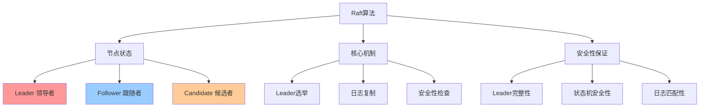

## 引言

Raft算法由Diego Ongaro和John Ousterhout在2013年提出，旨在解决Paxos算法难以理解和实现的问题。Raft通过"分而治之"的思想，将共识问题分解为Leader选举、日志复制和安全性三个相对独立的子问题，使得算法更加容易理解和实现。

## Raft算法概述

### 设计目标

```
┌─────────────────────────────────────┐
│           Raft设计目标              │
├─────────────────────────────────────┤
│ • 易于理解：简化复杂的共识问题       │
│ • 易于实现：提供清晰的实现指导       │
│ • 高可用性：容忍少数节点故障         │
│ • 强一致性：保证数据一致性           │
│ • 高性能：优化日志复制和选举过程     │
└─────────────────────────────────────┘
```

### 算法核心概念



## Raft算法核心组件

### 1. 基础数据结构

```java
import java.util.*;
import java.util.concurrent.*;
import java.util.concurrent.atomic.AtomicInteger;
import java.util.concurrent.atomic.AtomicLong;

/**
 * Raft算法实现
 */
public class RaftAlgorithm {

    /**
     * 节点状态枚举
     */
    public enum NodeState {
        FOLLOWER("跟随者"),
        CANDIDATE("候选者"),
        LEADER("领导者");

        private final String description;

        NodeState(String description) {
            this.description = description;
        }

        public String getDescription() { return description; }
    }

    /**
     * 日志条目
     */
    public static class LogEntry {
        private final int index;
        private final long term;
        private final String command;
        private final long timestamp;

        public LogEntry(int index, long term, String command) {
            this.index = index;
            this.term = term;
            this.command = command;
            this.timestamp = System.currentTimeMillis();
        }

        public int getIndex() { return index; }
        public long getTerm() { return term; }
        public String getCommand() { return command; }
        public long getTimestamp() { return timestamp; }

        @Override
        public boolean equals(Object obj) {
            if (this == obj) return true;
            if (!(obj instanceof LogEntry)) return false;
            LogEntry other = (LogEntry) obj;
            return index == other.index && term == other.term;
        }

        @Override
        public int hashCode() {
            return Objects.hash(index, term);
        }

        @Override
        public String toString() {
            return String.format("LogEntry{index=%d, term=%d, cmd='%s'}", index, term, command);
        }
    }

    /**
     * 投票请求
     */
    public static class VoteRequest {
        private final long term;
        private final String candidateId;
        private final int lastLogIndex;
        private final long lastLogTerm;

        public VoteRequest(long term, String candidateId, int lastLogIndex, long lastLogTerm) {
            this.term = term;
            this.candidateId = candidateId;
            this.lastLogIndex = lastLogIndex;
            this.lastLogTerm = lastLogTerm;
        }

        public long getTerm() { return term; }
        public String getCandidateId() { return candidateId; }
        public int getLastLogIndex() { return lastLogIndex; }
        public long getLastLogTerm() { return lastLogTerm; }
    }

    /**
     * 投票响应
     */
    public static class VoteResponse {
        private final long term;
        private final boolean voteGranted;
        private final String voterId;

        public VoteResponse(long term, boolean voteGranted, String voterId) {
            this.term = term;
            this.voteGranted = voteGranted;
            this.voterId = voterId;
        }

        public long getTerm() { return term; }
        public boolean isVoteGranted() { return voteGranted; }
        public String getVoterId() { return voterId; }
    }

    /**
     * 追加条目请求
     */
    public static class AppendEntriesRequest {
        private final long term;
        private final String leaderId;
        private final int prevLogIndex;
        private final long prevLogTerm;
        private final List<LogEntry> entries;
        private final int leaderCommit;

        public AppendEntriesRequest(long term, String leaderId, int prevLogIndex,
                                  long prevLogTerm, List<LogEntry> entries, int leaderCommit) {
            this.term = term;
            this.leaderId = leaderId;
            this.prevLogIndex = prevLogIndex;
            this.prevLogTerm = prevLogTerm;
            this.entries = entries != null ? new ArrayList<>(entries) : new ArrayList<>();
            this.leaderCommit = leaderCommit;
        }

        public long getTerm() { return term; }
        public String getLeaderId() { return leaderId; }
        public int getPrevLogIndex() { return prevLogIndex; }
        public long getPrevLogTerm() { return prevLogTerm; }
        public List<LogEntry> getEntries() { return entries; }
        public int getLeaderCommit() { return leaderCommit; }
        public boolean isHeartbeat() { return entries.isEmpty(); }
    }

    /**
     * 追加条目响应
     */
    public static class AppendEntriesResponse {
        private final long term;
        private final boolean success;
        private final String followerId;
        private final int matchIndex;

        public AppendEntriesResponse(long term, boolean success, String followerId, int matchIndex) {
            this.term = term;
            this.success = success;
            this.followerId = followerId;
            this.matchIndex = matchIndex;
        }

        public long getTerm() { return term; }
        public boolean isSuccess() { return success; }
        public String getFollowerId() { return followerId; }
        public int getMatchIndex() { return matchIndex; }
    }

    /**
     * Raft节点实现
     */
    public static class RaftNode {
        // 持久化状态
        private volatile long currentTerm = 0;
        private volatile String votedFor = null;
        private final List<LogEntry> log = Collections.synchronizedList(new ArrayList<>());

        // 易失状态
        private volatile int commitIndex = 0;
        private volatile int lastApplied = 0;

        // Leader状态
        private final Map<String, Integer> nextIndex = new ConcurrentHashMap<>();
        private final Map<String, Integer> matchIndex = new ConcurrentHashMap<>();

        // 节点信息
        private final String nodeId;
        private volatile NodeState state = NodeState.FOLLOWER;
        private volatile String currentLeader = null;
        private volatile long lastHeartbeat = System.currentTimeMillis();

        // 网络和定时器
        private final List<RaftNode> peers;
        private final ScheduledExecutorService scheduler;
        private final ExecutorService executor;
        private ScheduledFuture<?> electionTimer;
        private ScheduledFuture<?> heartbeatTimer;

        // 配置参数
        private final int electionTimeoutMin = 150; // ms
        private final int electionTimeoutMax = 300; // ms
        private final int heartbeatInterval = 50; // ms

        public RaftNode(String nodeId, List<RaftNode> peers) {
            this.nodeId = nodeId;
            this.peers = new ArrayList<>(peers);
            this.scheduler = Executors.newScheduledThreadPool(2);
            this.executor = Executors.newCachedThreadPool();

            // 初始化日志（索引0为空条目）
            this.log.add(new LogEntry(0, 0, ""));

            // 启动选举定时器
            resetElectionTimer();
        }

        /**
         * 启动Leader选举
         */
        private void startElection() {
            if (state == NodeState.LEADER) {
                return; // Leader不参与选举
            }

            synchronized (this) {
                state = NodeState.CANDIDATE;
                currentTerm++;
                votedFor = nodeId;
                resetElectionTimer();

                System.out.printf("节点 %s 开始选举，任期 %d%n", nodeId, currentTerm);
            }

            // 向所有节点发送投票请求
            List<CompletableFuture<VoteResponse>> voteFutures = new ArrayList<>();

            for (RaftNode peer : peers) {
                if (!peer.nodeId.equals(nodeId)) {
                    CompletableFuture<VoteResponse> future = CompletableFuture
                        .supplyAsync(() -> peer.requestVote(createVoteRequest()), executor);
                    voteFutures.add(future);
                }
            }

            // 自己给自己投票
            AtomicInteger voteCount = new AtomicInteger(1);
            int majoritySize = (peers.size() + 1) / 2 + 1;

            // 处理投票响应
            CompletableFuture.allOf(voteFutures.toArray(new CompletableFuture[0]))
                .thenRun(() -> {
                    if (state != NodeState.CANDIDATE) {
                        return; // 状态已改变
                    }

                    for (CompletableFuture<VoteResponse> future : voteFutures) {
                        try {
                            VoteResponse response = future.get();
                            if (response.getTerm() > currentTerm) {
                                becomeFollower(response.getTerm());
                                return;
                            }
                            if (response.isVoteGranted()) {
                                voteCount.incrementAndGet();
                            }
                        } catch (Exception e) {
                            // 忽略投票失败
                        }
                    }

                    if (voteCount.get() >= majoritySize && state == NodeState.CANDIDATE) {
                        becomeLeader();
                    }
                });
        }

        /**
         * 创建投票请求
         */
        private VoteRequest createVoteRequest() {
            int lastLogIndex = log.size() - 1;
            long lastLogTerm = lastLogIndex > 0 ? log.get(lastLogIndex).getTerm() : 0;
            return new VoteRequest(currentTerm, nodeId, lastLogIndex, lastLogTerm);
        }

        /**
         * 处理投票请求
         */
        public VoteResponse requestVote(VoteRequest request) {
            synchronized (this) {
                // 检查任期
                if (request.getTerm() > currentTerm) {
                    becomeFollower(request.getTerm());
                }

                boolean voteGranted = false;

                // 投票条件检查
                if (request.getTerm() == currentTerm &&
                    (votedFor == null || votedFor.equals(request.getCandidateId())) &&
                    isLogUpToDate(request.getLastLogIndex(), request.getLastLogTerm())) {

                    votedFor = request.getCandidateId();
                    voteGranted = true;
                    resetElectionTimer();

                    System.out.printf("节点 %s 投票给 %s，任期 %d%n",
                                     nodeId, request.getCandidateId(), currentTerm);
                }

                return new VoteResponse(currentTerm, voteGranted, nodeId);
            }
        }

        /**
         * 检查日志是否足够新
         */
        private boolean isLogUpToDate(int lastLogIndex, long lastLogTerm) {
            int myLastLogIndex = log.size() - 1;
            long myLastLogTerm = myLastLogIndex > 0 ? log.get(myLastLogIndex).getTerm() : 0;

            // 比较最后一条日志的任期和索引
            if (lastLogTerm != myLastLogTerm) {
                return lastLogTerm > myLastLogTerm;
            }
            return lastLogIndex >= myLastLogIndex;
        }

        /**
         * 成为Leader
         */
        private void becomeLeader() {
            if (state != NodeState.CANDIDATE) {
                return;
            }

            synchronized (this) {
                state = NodeState.LEADER;
                currentLeader = nodeId;

                // 初始化Leader状态
                int lastLogIndex = log.size() - 1;
                for (RaftNode peer : peers) {
                    if (!peer.nodeId.equals(nodeId)) {
                        nextIndex.put(peer.nodeId, lastLogIndex + 1);
                        matchIndex.put(peer.nodeId, 0);
                    }
                }

                System.out.printf("节点 %s 成为Leader，任期 %d%n", nodeId, currentTerm);
            }

            stopElectionTimer();
            startHeartbeat();

            // 发送空的AppendEntries作为心跳
            sendHeartbeat();
        }

        /**
         * 成为Follower
         */
        private void becomeFollower(long term) {
            synchronized (this) {
                state = NodeState.FOLLOWER;
                currentTerm = term;
                votedFor = null;
                currentLeader = null;
            }

            stopHeartbeatTimer();
            resetElectionTimer();
        }

        /**
         * 发送心跳
         */
        private void sendHeartbeat() {
            if (state != NodeState.LEADER) {
                return;
            }

            for (RaftNode peer : peers) {
                if (!peer.nodeId.equals(nodeId)) {
                    executor.submit(() -> sendAppendEntries(peer, true));
                }
            }
        }

        /**
         * 发送AppendEntries RPC
         */
        private void sendAppendEntries(RaftNode peer, boolean isHeartbeat) {
            if (state != NodeState.LEADER) {
                return;
            }

            Integer peerNextIndex = nextIndex.get(peer.nodeId);
            if (peerNextIndex == null) {
                peerNextIndex = log.size();
                nextIndex.put(peer.nodeId, peerNextIndex);
            }

            int prevLogIndex = peerNextIndex - 1;
            long prevLogTerm = prevLogIndex > 0 ? log.get(prevLogIndex).getTerm() : 0;

            List<LogEntry> entries = new ArrayList<>();
            if (!isHeartbeat && peerNextIndex < log.size()) {
                // 发送需要复制的日志条目
                entries = log.subList(peerNextIndex, log.size());
            }

            AppendEntriesRequest request = new AppendEntriesRequest(
                currentTerm, nodeId, prevLogIndex, prevLogTerm, entries, commitIndex);

            try {
                AppendEntriesResponse response = peer.appendEntries(request);
                handleAppendEntriesResponse(peer, request, response);
            } catch (Exception e) {
                System.err.printf("发送AppendEntries到 %s 失败: %s%n", peer.nodeId, e.getMessage());
            }
        }

        /**
         * 处理AppendEntries响应
         */
        private void handleAppendEntriesResponse(RaftNode peer, AppendEntriesRequest request,
                                               AppendEntriesResponse response) {
            if (state != NodeState.LEADER || response.getTerm() > currentTerm) {
                if (response.getTerm() > currentTerm) {
                    becomeFollower(response.getTerm());
                }
                return;
            }

            if (response.isSuccess()) {
                // 更新nextIndex和matchIndex
                int newMatchIndex = request.getPrevLogIndex() + request.getEntries().size();
                matchIndex.put(peer.nodeId, newMatchIndex);
                nextIndex.put(peer.nodeId, newMatchIndex + 1);

                // 尝试更新commitIndex
                updateCommitIndex();
            } else {
                // 日志不匹配，递减nextIndex重试
                Integer currentNext = nextIndex.get(peer.nodeId);
                if (currentNext != null && currentNext > 1) {
                    nextIndex.put(peer.nodeId, currentNext - 1);
                    executor.submit(() -> sendAppendEntries(peer, false));
                }
            }
        }

        /**
         * 更新commitIndex
         */
        private void updateCommitIndex() {
            for (int n = commitIndex + 1; n < log.size(); n++) {
                if (log.get(n).getTerm() == currentTerm) {
                    int replicationCount = 1; // 包括Leader自己

                    for (Integer match : matchIndex.values()) {
                        if (match >= n) {
                            replicationCount++;
                        }
                    }

                    if (replicationCount > (peers.size() + 1) / 2) {
                        commitIndex = n;
                        System.out.printf("Leader %s 提交日志到索引 %d%n", nodeId, commitIndex);
                    }
                }
            }
        }

        /**
         * 处理AppendEntries请求
         */
        public AppendEntriesResponse appendEntries(AppendEntriesRequest request) {
            synchronized (this) {
                lastHeartbeat = System.currentTimeMillis();

                // 检查任期
                if (request.getTerm() > currentTerm) {
                    becomeFollower(request.getTerm());
                } else if (request.getTerm() < currentTerm) {
                    return new AppendEntriesResponse(currentTerm, false, nodeId, 0);
                }

                // 重置选举定时器
                if (state == NodeState.CANDIDATE) {
                    becomeFollower(currentTerm);
                }
                resetElectionTimer();

                currentLeader = request.getLeaderId();

                // 检查日志一致性
                if (request.getPrevLogIndex() > 0) {
                    if (request.getPrevLogIndex() >= log.size() ||
                        log.get(request.getPrevLogIndex()).getTerm() != request.getPrevLogTerm()) {
                        return new AppendEntriesResponse(currentTerm, false, nodeId, 0);
                    }
                }

                // 追加新条目
                if (!request.getEntries().isEmpty()) {
                    int insertIndex = request.getPrevLogIndex() + 1;

                    // 删除冲突的条目
                    if (insertIndex < log.size()) {
                        log.subList(insertIndex, log.size()).clear();
                    }

                    // 追加新条目
                    log.addAll(request.getEntries());

                    System.out.printf("Follower %s 追加 %d 条日志条目%n",
                                     nodeId, request.getEntries().size());
                }

                // 更新commitIndex
                if (request.getLeaderCommit() > commitIndex) {
                    commitIndex = Math.min(request.getLeaderCommit(), log.size() - 1);
                }

                return new AppendEntriesResponse(currentTerm, true, nodeId, log.size() - 1);
            }
        }

        /**
         * 客户端提交命令
         */
        public CompletableFuture<String> submitCommand(String command) {
            if (state != NodeState.LEADER) {
                return CompletableFuture.completedFuture("NOT_LEADER");
            }

            synchronized (this) {
                LogEntry entry = new LogEntry(log.size(), currentTerm, command);
                log.add(entry);

                System.out.printf("Leader %s 接收命令: %s (索引 %d)%n",
                                 nodeId, command, entry.getIndex());
            }

            // 立即复制到所有Follower
            for (RaftNode peer : peers) {
                if (!peer.nodeId.equals(nodeId)) {
                    executor.submit(() -> sendAppendEntries(peer, false));
                }
            }

            // 等待日志被提交
            return waitForCommit(log.size() - 1);
        }

        /**
         * 等待日志提交
         */
        private CompletableFuture<String> waitForCommit(int logIndex) {
            return CompletableFuture.supplyAsync(() -> {
                long startTime = System.currentTimeMillis();
                long timeout = 5000; // 5秒超时

                while (commitIndex < logIndex && System.currentTimeMillis() - startTime < timeout) {
                    try {
                        Thread.sleep(10);
                    } catch (InterruptedException e) {
                        Thread.currentThread().interrupt();
                        return "INTERRUPTED";
                    }
                }

                if (commitIndex >= logIndex) {
                    return "COMMITTED";
                } else {
                    return "TIMEOUT";
                }
            }, executor);
        }

        /**
         * 定时器管理
         */
        private void resetElectionTimer() {
            stopElectionTimer();
            long timeout = ThreadLocalRandom.current().nextLong(electionTimeoutMin, electionTimeoutMax);
            electionTimer = scheduler.schedule(this::startElection, timeout, TimeUnit.MILLISECONDS);
        }

        private void stopElectionTimer() {
            if (electionTimer != null) {
                electionTimer.cancel(false);
            }
        }

        private void startHeartbeat() {
            heartbeatTimer = scheduler.scheduleWithFixedDelay(
                this::sendHeartbeat, 0, heartbeatInterval, TimeUnit.MILLISECONDS);
        }

        private void stopHeartbeatTimer() {
            if (heartbeatTimer != null) {
                heartbeatTimer.cancel(false);
            }
        }

        // Getter方法
        public String getNodeId() { return nodeId; }
        public NodeState getState() { return state; }
        public long getCurrentTerm() { return currentTerm; }
        public String getCurrentLeader() { return currentLeader; }
        public int getLogSize() { return log.size(); }
        public int getCommitIndex() { return commitIndex; }

        public void shutdown() {
            stopElectionTimer();
            stopHeartbeatTimer();
            scheduler.shutdown();
            executor.shutdown();
        }
    }
}

/**
 * Raft集群演示
 */
class RaftClusterDemo {
    public static void main(String[] args) throws Exception {
        System.out.println("=== Raft算法演示 ===");

        // 创建5个节点的Raft集群
        List<RaftAlgorithm.RaftNode> nodes = new ArrayList<>();
        for (int i = 1; i <= 5; i++) {
            nodes.add(new RaftAlgorithm.RaftNode("Node" + i, nodes));
        }

        // 更新每个节点的peers列表
        for (RaftAlgorithm.RaftNode node : nodes) {
            // 使用反射或其他方式更新peers（简化演示）
        }

        try {
            // 等待Leader选举
            System.out.println("等待Leader选举...");
            Thread.sleep(1000);

            // 查找Leader
            RaftAlgorithm.RaftNode leader = nodes.stream()
                .filter(node -> node.getState() == RaftAlgorithm.NodeState.LEADER)
                .findFirst()
                .orElse(null);

            if (leader != null) {
                System.out.printf("Leader选举完成: %s (任期 %d)%n",
                                 leader.getNodeId(), leader.getCurrentTerm());

                // 提交一些命令
                List<CompletableFuture<String>> futures = new ArrayList<>();
                for (int i = 1; i <= 5; i++) {
                    String command = "SET key" + i + " value" + i;
                    CompletableFuture<String> future = leader.submitCommand(command);
                    futures.add(future);
                }

                // 等待命令提交
                CompletableFuture.allOf(futures.toArray(new CompletableFuture[0])).get();

                System.out.println("\n--- 集群状态 ---");
                for (RaftAlgorithm.RaftNode node : nodes) {
                    System.out.printf("节点 %s: 状态=%s, 任期=%d, 日志大小=%d, 提交索引=%d%n",
                                     node.getNodeId(),
                                     node.getState().getDescription(),
                                     node.getCurrentTerm(),
                                     node.getLogSize(),
                                     node.getCommitIndex());
                }
            } else {
                System.out.println("Leader选举失败");
            }

        } finally {
            // 关闭所有节点
            for (RaftAlgorithm.RaftNode node : nodes) {
                node.shutdown();
            }
        }
    }
}
```

## 日志复制优化

### 批量复制

```java
/**
 * 批量日志复制优化
 */
public class BatchLogReplication {

    /**
     * 批量日志条目
     */
    public static class BatchLogEntries {
        private final List<RaftAlgorithm.LogEntry> entries;
        private final int batchId;
        private final long timestamp;

        public BatchLogEntries(List<RaftAlgorithm.LogEntry> entries, int batchId) {
            this.entries = new ArrayList<>(entries);
            this.batchId = batchId;
            this.timestamp = System.currentTimeMillis();
        }

        public List<RaftAlgorithm.LogEntry> getEntries() { return entries; }
        public int getBatchId() { return batchId; }
        public long getTimestamp() { return timestamp; }
        public int size() { return entries.size(); }
    }

    /**
     * 批量复制管理器
     */
    public static class BatchReplicationManager {
        private final RaftAlgorithm.RaftNode node;
        private final List<RaftAlgorithm.LogEntry> pendingEntries;
        private final int batchSize;
        private final long batchTimeoutMs;
        private final ScheduledExecutorService scheduler;
        private ScheduledFuture<?> batchTimer;

        public BatchReplicationManager(RaftAlgorithm.RaftNode node, int batchSize, long batchTimeoutMs) {
            this.node = node;
            this.pendingEntries = Collections.synchronizedList(new ArrayList<>());
            this.batchSize = batchSize;
            this.batchTimeoutMs = batchTimeoutMs;
            this.scheduler = Executors.newScheduledThreadPool(1);
        }

        /**
         * 添加待复制的日志条目
         */
        public synchronized void addEntry(RaftAlgorithm.LogEntry entry) {
            pendingEntries.add(entry);

            // 检查是否达到批量大小
            if (pendingEntries.size() >= batchSize) {
                flushBatch();
            } else if (batchTimer == null) {
                // 启动批量定时器
                batchTimer = scheduler.schedule(this::flushBatch, batchTimeoutMs, TimeUnit.MILLISECONDS);
            }
        }

        /**
         * 刷新批量条目
         */
        private synchronized void flushBatch() {
            if (pendingEntries.isEmpty()) {
                return;
            }

            List<RaftAlgorithm.LogEntry> batch = new ArrayList<>(pendingEntries);
            pendingEntries.clear();

            if (batchTimer != null) {
                batchTimer.cancel(false);
                batchTimer = null;
            }

            // 执行批量复制
            executeBatchReplication(batch);
        }

        /**
         * 执行批量复制
         */
        private void executeBatchReplication(List<RaftAlgorithm.LogEntry> batch) {
            BatchLogEntries batchEntries = new BatchLogEntries(batch, generateBatchId());

            System.out.printf("Leader %s 开始批量复制: %d 条日志条目%n",
                             node.getNodeId(), batch.size());

            // 并行发送到所有Follower
            // 这里简化实现，实际中需要集成到RaftNode中
            CompletableFuture.runAsync(() -> {
                // 批量复制逻辑
                System.out.printf("批量复制完成: 批次ID %d%n", batchEntries.getBatchId());
            });
        }

        private int generateBatchId() {
            return (int) (System.currentTimeMillis() % Integer.MAX_VALUE);
        }

        public void shutdown() {
            if (batchTimer != null) {
                batchTimer.cancel(false);
            }
            scheduler.shutdown();
        }
    }
}
```

## 快照机制

### 日志压缩

```java
/**
 * Raft快照机制
 */
public class RaftSnapshot {

    /**
     * 快照数据
     */
    public static class SnapshotData {
        private final int lastIncludedIndex;
        private final long lastIncludedTerm;
        private final Map<String, String> stateMachine;
        private final long timestamp;

        public SnapshotData(int lastIncludedIndex, long lastIncludedTerm,
                          Map<String, String> stateMachine) {
            this.lastIncludedIndex = lastIncludedIndex;
            this.lastIncludedTerm = lastIncludedTerm;
            this.stateMachine = new HashMap<>(stateMachine);
            this.timestamp = System.currentTimeMillis();
        }

        public int getLastIncludedIndex() { return lastIncludedIndex; }
        public long getLastIncludedTerm() { return lastIncludedTerm; }
        public Map<String, String> getStateMachine() { return stateMachine; }
        public long getTimestamp() { return timestamp; }
    }

    /**
     * 快照管理器
     */
    public static class SnapshotManager {
        private volatile SnapshotData currentSnapshot;
        private final Map<String, String> stateMachine;
        private final int snapshotThreshold;

        public SnapshotManager(int snapshotThreshold) {
            this.stateMachine = new ConcurrentHashMap<>();
            this.snapshotThreshold = snapshotThreshold;
        }

        /**
         * 应用日志条目到状态机
         */
        public void applyLogEntry(RaftAlgorithm.LogEntry entry) {
            // 解析命令并应用到状态机
            String command = entry.getCommand();
            if (command.startsWith("SET ")) {
                String[] parts = command.split(" ", 3);
                if (parts.length == 3) {
                    stateMachine.put(parts[1], parts[2]);
                    System.out.printf("应用命令到状态机: %s%n", command);
                }
            }
        }

        /**
         * 创建快照
         */
        public SnapshotData createSnapshot(int lastAppliedIndex, long lastAppliedTerm) {
            System.out.printf("创建快照: 索引=%d, 任期=%d, 状态机大小=%d%n",
                             lastAppliedIndex, lastAppliedTerm, stateMachine.size());

            currentSnapshot = new SnapshotData(lastAppliedIndex, lastAppliedTerm, stateMachine);
            return currentSnapshot;
        }

        /**
         * 检查是否需要创建快照
         */
        public boolean shouldCreateSnapshot(int logSize, int lastAppliedIndex) {
            return logSize - lastAppliedIndex > snapshotThreshold;
        }

        /**
         * 安装快照
         */
        public void installSnapshot(SnapshotData snapshot) {
            System.out.printf("安装快照: 索引=%d, 任期=%d%n",
                             snapshot.getLastIncludedIndex(), snapshot.getLastIncludedTerm());

            stateMachine.clear();
            stateMachine.putAll(snapshot.getStateMachine());
            currentSnapshot = snapshot;
        }

        public SnapshotData getCurrentSnapshot() { return currentSnapshot; }
        public Map<String, String> getStateMachine() { return new HashMap<>(stateMachine); }
    }

    /**
     * 安装快照请求
     */
    public static class InstallSnapshotRequest {
        private final long term;
        private final String leaderId;
        private final int lastIncludedIndex;
        private final long lastIncludedTerm;
        private final byte[] data;
        private final boolean done;

        public InstallSnapshotRequest(long term, String leaderId, int lastIncludedIndex,
                                    long lastIncludedTerm, byte[] data, boolean done) {
            this.term = term;
            this.leaderId = leaderId;
            this.lastIncludedIndex = lastIncludedIndex;
            this.lastIncludedTerm = lastIncludedTerm;
            this.data = data != null ? data.clone() : new byte[0];
            this.done = done;
        }

        public long getTerm() { return term; }
        public String getLeaderId() { return leaderId; }
        public int getLastIncludedIndex() { return lastIncludedIndex; }
        public long getLastIncludedTerm() { return lastIncludedTerm; }
        public byte[] getData() { return data.clone(); }
        public boolean isDone() { return done; }
    }

    /**
     * 安装快照响应
     */
    public static class InstallSnapshotResponse {
        private final long term;
        private final boolean success;
        private final String followerId;

        public InstallSnapshotResponse(long term, boolean success, String followerId) {
            this.term = term;
            this.success = success;
            this.followerId = followerId;
        }

        public long getTerm() { return term; }
        public boolean isSuccess() { return success; }
        public String getFollowerId() { return followerId; }
    }
}
```

## 成员变更

### 配置变更协议

```java
/**
 * Raft集群成员变更
 */
public class RaftMembershipChange {

    /**
     * 配置变更类型
     */
    public enum ConfigChangeType {
        ADD_SERVER("添加服务器"),
        REMOVE_SERVER("移除服务器"),
        REPLACE_SERVER("替换服务器");

        private final String description;

        ConfigChangeType(String description) {
            this.description = description;
        }

        public String getDescription() { return description; }
    }

    /**
     * 配置变更条目
     */
    public static class ConfigChangeEntry extends RaftAlgorithm.LogEntry {
        private final ConfigChangeType changeType;
        private final String serverId;
        private final String serverAddress;

        public ConfigChangeEntry(int index, long term, ConfigChangeType changeType,
                               String serverId, String serverAddress) {
            super(index, term, String.format("%s %s %s", changeType, serverId, serverAddress));
            this.changeType = changeType;
            this.serverId = serverId;
            this.serverAddress = serverAddress;
        }

        public ConfigChangeType getChangeType() { return changeType; }
        public String getServerId() { return serverId; }
        public String getServerAddress() { return serverAddress; }
    }

    /**
     * 集群配置
     */
    public static class ClusterConfiguration {
        private final Set<String> servers;
        private final Map<String, String> serverAddresses;
        private final int configIndex;

        public ClusterConfiguration(Set<String> servers, Map<String, String> serverAddresses,
                                  int configIndex) {
            this.servers = new HashSet<>(servers);
            this.serverAddresses = new HashMap<>(serverAddresses);
            this.configIndex = configIndex;
        }

        public Set<String> getServers() { return new HashSet<>(servers); }
        public Map<String, String> getServerAddresses() { return new HashMap<>(serverAddresses); }
        public int getConfigIndex() { return configIndex; }
        public int getMajoritySize() { return servers.size() / 2 + 1; }

        public boolean contains(String serverId) {
            return servers.contains(serverId);
        }
    }

    /**
     * 成员变更管理器
     */
    public static class MembershipChangeManager {
        private volatile ClusterConfiguration currentConfig;
        private volatile ClusterConfiguration pendingConfig;
        private final RaftAlgorithm.RaftNode node;

        public MembershipChangeManager(RaftAlgorithm.RaftNode node,
                                     ClusterConfiguration initialConfig) {
            this.node = node;
            this.currentConfig = initialConfig;
        }

        /**
         * 添加服务器
         */
        public CompletableFuture<String> addServer(String serverId, String serverAddress) {
            if (pendingConfig != null) {
                return CompletableFuture.completedFuture("CONFIG_CHANGE_IN_PROGRESS");
            }

            if (currentConfig.contains(serverId)) {
                return CompletableFuture.completedFuture("SERVER_ALREADY_EXISTS");
            }

            System.out.printf("开始添加服务器: %s (%s)%n", serverId, serverAddress);

            // 创建新配置
            Set<String> newServers = currentConfig.getServers();
            newServers.add(serverId);
            Map<String, String> newAddresses = currentConfig.getServerAddresses();
            newAddresses.put(serverId, serverAddress);

            pendingConfig = new ClusterConfiguration(newServers, newAddresses,
                                                   currentConfig.getConfigIndex() + 1);

            // 提交配置变更日志
            ConfigChangeEntry entry = new ConfigChangeEntry(
                0, // 索引将由RaftNode设置
                node.getCurrentTerm(),
                ConfigChangeType.ADD_SERVER,
                serverId,
                serverAddress
            );

            return submitConfigChange(entry);
        }

        /**
         * 移除服务器
         */
        public CompletableFuture<String> removeServer(String serverId) {
            if (pendingConfig != null) {
                return CompletableFuture.completedFuture("CONFIG_CHANGE_IN_PROGRESS");
            }

            if (!currentConfig.contains(serverId)) {
                return CompletableFuture.completedFuture("SERVER_NOT_EXISTS");
            }

            if (currentConfig.getServers().size() <= 1) {
                return CompletableFuture.completedFuture("CANNOT_REMOVE_LAST_SERVER");
            }

            System.out.printf("开始移除服务器: %s%n", serverId);

            // 创建新配置
            Set<String> newServers = currentConfig.getServers();
            newServers.remove(serverId);
            Map<String, String> newAddresses = currentConfig.getServerAddresses();
            newAddresses.remove(serverId);

            pendingConfig = new ClusterConfiguration(newServers, newAddresses,
                                                   currentConfig.getConfigIndex() + 1);

            // 提交配置变更日志
            ConfigChangeEntry entry = new ConfigChangeEntry(
                0,
                node.getCurrentTerm(),
                ConfigChangeType.REMOVE_SERVER,
                serverId,
                ""
            );

            return submitConfigChange(entry);
        }

        /**
         * 提交配置变更
         */
        private CompletableFuture<String> submitConfigChange(ConfigChangeEntry entry) {
            // 将配置变更作为特殊的日志条目提交
            return node.submitCommand(entry.getCommand())
                .thenApply(result -> {
                    if ("COMMITTED".equals(result)) {
                        applyConfigChange(entry);
                        return "CONFIG_CHANGE_SUCCESS";
                    } else {
                        pendingConfig = null;
                        return "CONFIG_CHANGE_FAILED";
                    }
                });
        }

        /**
         * 应用配置变更
         */
        private void applyConfigChange(ConfigChangeEntry entry) {
            if (pendingConfig != null) {
                currentConfig = pendingConfig;
                pendingConfig = null;

                System.out.printf("配置变更已应用: %s %s%n",
                                 entry.getChangeType().getDescription(),
                                 entry.getServerId());
            }
        }

        /**
         * 检查是否可以安全地移除Leader
         */
        public boolean canSafelyRemoveLeader() {
            String leaderId = node.getCurrentLeader();
            if (leaderId == null || !currentConfig.contains(leaderId)) {
                return true;
            }

            // 检查集群是否有足够的其他节点来形成多数
            return currentConfig.getServers().size() > 2;
        }

        public ClusterConfiguration getCurrentConfig() { return currentConfig; }
        public ClusterConfiguration getPendingConfig() { return pendingConfig; }
    }
}
```

## 性能监控与调优

### 性能指标

```java
/**
 * Raft性能监控
 */
public class RaftPerformanceMonitor {
    private final AtomicLong electionCount = new AtomicLong(0);
    private final AtomicLong leadershipDuration = new AtomicLong(0);
    private final AtomicLong logReplicationLatency = new AtomicLong(0);
    private final AtomicLong commandThroughput = new AtomicLong(0);
    private final Map<String, AtomicLong> nodeMetrics = new ConcurrentHashMap<>();

    /**
     * 记录选举事件
     */
    public void recordElection(String nodeId, long duration, boolean successful) {
        electionCount.incrementAndGet();
        nodeMetrics.computeIfAbsent(nodeId + "_elections", k -> new AtomicLong(0))
                  .incrementAndGet();

        if (successful) {
            nodeMetrics.computeIfAbsent(nodeId + "_leadership_time", k -> new AtomicLong(0))
                      .addAndGet(duration);
        }
    }

    /**
     * 记录日志复制延迟
     */
    public void recordLogReplication(long latencyMs, int entryCount) {
        logReplicationLatency.addAndGet(latencyMs);
        commandThroughput.addAndGet(entryCount);
    }

    /**
     * 生成性能报告
     */
    public String generatePerformanceReport() {
        StringBuilder report = new StringBuilder();
        report.append("=== Raft性能报告 ===\n");
        report.append(String.format("总选举次数: %d\n", electionCount.get()));
        report.append(String.format("平均日志复制延迟: %d ms\n",
                     commandThroughput.get() > 0 ?
                     logReplicationLatency.get() / commandThroughput.get() : 0));
        report.append(String.format("命令吞吐量: %d\n", commandThroughput.get()));

        report.append("\n节点指标:\n");
        nodeMetrics.forEach((metric, value) -> {
            report.append(String.format("  %s: %d\n", metric, value.get()));
        });

        return report.toString();
    }
}
```

## 总结

Raft算法通过分解复杂的共识问题，提供了一个易于理解和实现的解决方案：

### 核心优势

1. **易于理解**：将共识问题分解为独立的子问题
2. **强一致性**：保证线性一致性
3. **高可用性**：容忍少数节点故障
4. **工程实用**：提供清晰的实现指导

### 应用场景

```
Raft算法应用：
├─ etcd (Kubernetes配置存储)
├─ Consul (服务发现)
├─ TiKV (分布式存储)
├─ CockroachDB (分布式数据库)
└─ Hashicorp Vault (密钥管理)
```

### 优化建议

1. **批量操作**：通过批量日志复制提高吞吐量
2. **快照机制**：定期创建快照压缩日志
3. **网络优化**：使用流水线和并行复制
4. **配置调优**：根据网络条件调整超时参数

Raft算法是现代分布式系统的重要基础，为构建可靠的分布式应用提供了坚实的理论和实践支撑。

## 参考资料

1. Ongaro, D., & Ousterhout, J. (2014). In Search of an Understandable Consensus Algorithm
2. Ongaro, D. (2014). Consensus: Bridging Theory and Practice (PhD Dissertation)
3. Howard, H., & Mortier, R. (2020). Paxos vs Raft: Have we reached consensus on distributed consensus?