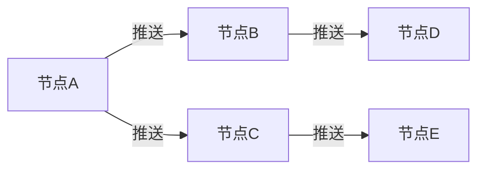
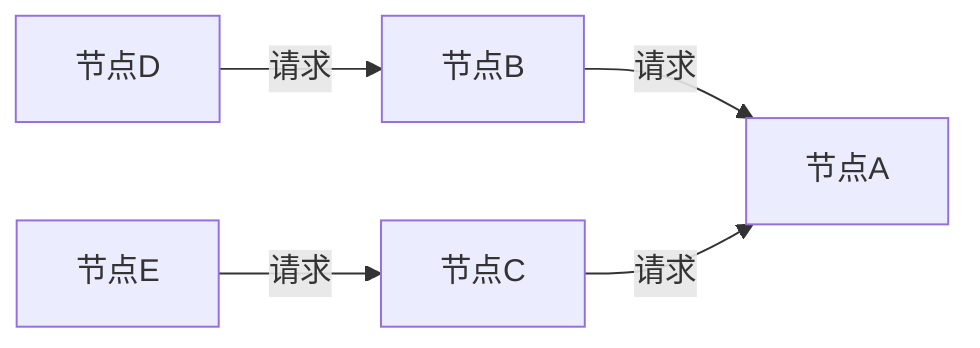

## 1. Gossip算法概述

Gossip算法，又称为流言传播协议（Epidemic Protocol），是一种基于随机选择的分布式信息传播算法。该算法模拟了现实生活中流言传播的过程，通过节点间的随机通信实现信息的最终一致性传播。

### 1.1 核心思想

```
传统广播模式：
节点A → 所有节点 (1对N)

Gossip模式：
节点A → 随机选择的几个节点 → 这些节点再随机选择其他节点 → ...
```

### 1.2 算法特点

- **去中心化**：无需中央协调节点
- **容错性强**：能够容忍节点故障和网络分区
- **最终一致性**：保证信息最终会传播到所有节点
- **可扩展性好**：复杂度为O(log N)

## 2. Gossip算法分类

### 2.1 Push模式（推送模式）

节点主动向其他节点推送信息：



### 2.2 Pull模式（拉取模式）

节点主动从其他节点拉取信息：



### 2.3 Push-Pull模式（混合模式）

结合推送和拉取两种模式：


## 3. Gossip算法基础实现

### 3.1 消息定义

```java
import java.io.Serializable;
import java.util.Map;
import java.util.concurrent.ConcurrentHashMap;

/**
 * Gossip消息定义
 */
public class GossipMessage implements Serializable {
    private final String messageId;
    private final String content;
    private final String sourceNode;
    private final long timestamp;
    private final int ttl; // 生存时间

    public GossipMessage(String messageId, String content, String sourceNode, int ttl) {
        this.messageId = messageId;
        this.content = content;
        this.sourceNode = sourceNode;
        this.timestamp = System.currentTimeMillis();
        this.ttl = ttl;
    }

    public GossipMessage decrementTTL() {
        return new GossipMessage(messageId, content, sourceNode, ttl - 1);
    }

    // Getters
    public String getMessageId() { return messageId; }
    public String getContent() { return content; }
    public String getSourceNode() { return sourceNode; }
    public long getTimestamp() { return timestamp; }
    public int getTtl() { return ttl; }

    @Override
    public boolean equals(Object obj) {
        if (this == obj) return true;
        if (obj == null || getClass() != obj.getClass()) return false;
        GossipMessage that = (GossipMessage) obj;
        return messageId.equals(that.messageId);
    }

    @Override
    public int hashCode() {
        return messageId.hashCode();
    }
}

/**
 * 节点状态信息
 */
public class NodeState implements Serializable {
    private final String nodeId;
    private final String address;
    private final int port;
    private final long lastHeartbeat;
    private final Map<String, String> metadata;

    public NodeState(String nodeId, String address, int port) {
        this.nodeId = nodeId;
        this.address = address;
        this.port = port;
        this.lastHeartbeat = System.currentTimeMillis();
        this.metadata = new ConcurrentHashMap<>();
    }

    public NodeState updateHeartbeat() {
        NodeState newState = new NodeState(nodeId, address, port);
        newState.metadata.putAll(this.metadata);
        return newState;
    }

    // Getters
    public String getNodeId() { return nodeId; }
    public String getAddress() { return address; }
    public int getPort() { return port; }
    public long getLastHeartbeat() { return lastHeartbeat; }
    public Map<String, String> getMetadata() { return metadata; }
}
```

### 3.2 基础Gossip节点实现

```java
import java.io.*;
import java.net.*;
import java.util.*;
import java.util.concurrent.*;
import java.util.concurrent.atomic.AtomicBoolean;

/**
 * Gossip节点基础实现
 */
public class GossipNode {
    private final String nodeId;
    private final String address;
    private final int port;
    private final int gossipInterval; // 毫秒
    private final int failureTimeout; // 毫秒
    private final int fanout; // 每次gossip的目标节点数

    // 节点状态管理
    private final Map<String, NodeState> memberList = new ConcurrentHashMap<>();
    private final Map<String, GossipMessage> messageStore = new ConcurrentHashMap<>();
    private final Set<String> processedMessages = ConcurrentHashMap.newKeySet();

    // 线程管理
    private final ScheduledExecutorService scheduler = Executors.newScheduledThreadPool(4);
    private final ExecutorService executor = Executors.newCachedThreadPool();
    private final AtomicBoolean running = new AtomicBoolean(false);
    private ServerSocket serverSocket;

    public GossipNode(String nodeId, String address, int port) {
        this.nodeId = nodeId;
        this.address = address;
        this.port = port;
        this.gossipInterval = 1000; // 1秒
        this.failureTimeout = 5000; // 5秒
        this.fanout = 3; // 每次选择3个节点

        // 添加自己到成员列表
        memberList.put(nodeId, new NodeState(nodeId, address, port));
    }

    /**
     * 启动Gossip节点
     */
    public void start() throws IOException {
        if (running.compareAndSet(false, true)) {
            // 启动服务器监听
            serverSocket = new ServerSocket(port);
            executor.submit(this::acceptConnections);

            // 启动定时任务
            scheduler.scheduleAtFixedRate(this::gossipRound,
                gossipInterval, gossipInterval, TimeUnit.MILLISECONDS);
            scheduler.scheduleAtFixedRate(this::failureDetection,
                failureTimeout, failureTimeout, TimeUnit.MILLISECONDS);
            scheduler.scheduleAtFixedRate(this::cleanup,
                30000, 30000, TimeUnit.MILLISECONDS);

            System.out.println("Gossip节点启动: " + nodeId + " 在 " + address + ":" + port);
        }
    }

    /**
     * 停止Gossip节点
     */
    public void stop() throws IOException {
        if (running.compareAndSet(true, false)) {
            scheduler.shutdown();
            executor.shutdown();
            if (serverSocket != null) {
                serverSocket.close();
            }
            System.out.println("Gossip节点停止: " + nodeId);
        }
    }

    /**
     * 接受连接
     */
    private void acceptConnections() {
        while (running.get() && !serverSocket.isClosed()) {
            try {
                Socket clientSocket = serverSocket.accept();
                executor.submit(() -> handleConnection(clientSocket));
            } catch (IOException e) {
                if (running.get()) {
                    System.err.println("接受连接错误: " + e.getMessage());
                }
            }
        }
    }

    /**
     * 处理连接
     */
    private void handleConnection(Socket socket) {
        try (ObjectInputStream input = new ObjectInputStream(socket.getInputStream());
             ObjectOutputStream output = new ObjectOutputStream(socket.getOutputStream())) {

            Object request = input.readObject();

            if (request instanceof GossipMessage) {
                handleGossipMessage((GossipMessage) request);
                output.writeObject("ACK");
            } else if (request instanceof MembershipRequest) {
                handleMembershipRequest((MembershipRequest) request, output);
            }

        } catch (Exception e) {
            System.err.println("处理连接错误: " + e.getMessage());
        } finally {
            try {
                socket.close();
            } catch (IOException e) {
                // 忽略关闭错误
            }
        }
    }

    /**
     * Gossip轮次
     */
    private void gossipRound() {
        try {
            // 更新自己的心跳
            memberList.put(nodeId, memberList.get(nodeId).updateHeartbeat());

            // 选择随机节点进行gossip
            List<String> targetNodes = selectRandomNodes(fanout);

            for (String targetNodeId : targetNodes) {
                NodeState targetNode = memberList.get(targetNodeId);
                if (targetNode != null && !targetNode.getNodeId().equals(nodeId)) {
                    executor.submit(() -> gossipToNode(targetNode));
                }
            }

        } catch (Exception e) {
            System.err.println("Gossip轮次错误: " + e.getMessage());
        }
    }

    /**
     * 向指定节点发送gossip
     */
    private void gossipToNode(NodeState targetNode) {
        try (Socket socket = new Socket(targetNode.getAddress(), targetNode.getPort());
             ObjectOutputStream output = new ObjectOutputStream(socket.getOutputStream());
             ObjectInputStream input = new ObjectInputStream(socket.getInputStream())) {

            // 发送成员列表更新
            MembershipRequest request = new MembershipRequest(nodeId, new ArrayList<>(memberList.values()));
            output.writeObject(request);

            Object response = input.readObject();
            if (response instanceof MembershipResponse) {
                handleMembershipResponse((MembershipResponse) response);
            }

        } catch (Exception e) {
            // 标记节点为可疑
            System.err.println("与节点 " + targetNode.getNodeId() + " 通信失败: " + e.getMessage());
        }
    }

    /**
     * 选择随机节点
     */
    private List<String> selectRandomNodes(int count) {
        List<String> allNodes = new ArrayList<>(memberList.keySet());
        allNodes.remove(nodeId); // 移除自己

        Collections.shuffle(allNodes);
        return allNodes.subList(0, Math.min(count, allNodes.size()));
    }

    /**
     * 处理Gossip消息
     */
    private void handleGossipMessage(GossipMessage message) {
        if (processedMessages.contains(message.getMessageId()) || message.getTtl() <= 0) {
            return;
        }

        processedMessages.add(message.getMessageId());
        messageStore.put(message.getMessageId(), message);

        // 处理消息内容
        processMessage(message);

        // 继续传播消息
        if (message.getTtl() > 1) {
            propagateMessage(message.decrementTTL());
        }
    }

    /**
     * 传播消息
     */
    private void propagateMessage(GossipMessage message) {
        List<String> targetNodes = selectRandomNodes(fanout);

        for (String targetNodeId : targetNodes) {
            NodeState targetNode = memberList.get(targetNodeId);
            if (targetNode != null && !targetNode.getNodeId().equals(nodeId)) {
                executor.submit(() -> sendMessage(targetNode, message));
            }
        }
    }

    /**
     * 发送消息到节点
     */
    private void sendMessage(NodeState targetNode, GossipMessage message) {
        try (Socket socket = new Socket(targetNode.getAddress(), targetNode.getPort());
             ObjectOutputStream output = new ObjectOutputStream(socket.getOutputStream());
             ObjectInputStream input = new ObjectInputStream(socket.getInputStream())) {

            output.writeObject(message);
            input.readObject(); // 读取ACK

        } catch (Exception e) {
            System.err.println("发送消息到节点 " + targetNode.getNodeId() + " 失败: " + e.getMessage());
        }
    }

    /**
     * 处理成员关系请求
     */
    private void handleMembershipRequest(MembershipRequest request, ObjectOutputStream output) throws IOException {
        // 合并成员列表
        for (NodeState nodeState : request.getMemberList()) {
            NodeState existing = memberList.get(nodeState.getNodeId());
            if (existing == null || nodeState.getLastHeartbeat() > existing.getLastHeartbeat()) {
                memberList.put(nodeState.getNodeId(), nodeState);
            }
        }

        // 返回自己的成员列表
        MembershipResponse response = new MembershipResponse(nodeId, new ArrayList<>(memberList.values()));
        output.writeObject(response);
    }

    /**
     * 处理成员关系响应
     */
    private void handleMembershipResponse(MembershipResponse response) {
        // 合并成员列表
        for (NodeState nodeState : response.getMemberList()) {
            NodeState existing = memberList.get(nodeState.getNodeId());
            if (existing == null || nodeState.getLastHeartbeat() > existing.getLastHeartbeat()) {
                memberList.put(nodeState.getNodeId(), nodeState);
            }
        }
    }

    /**
     * 故障检测
     */
    private void failureDetection() {
        long currentTime = System.currentTimeMillis();
        List<String> failedNodes = new ArrayList<>();

        for (Map.Entry<String, NodeState> entry : memberList.entrySet()) {
            String nodeId = entry.getKey();
            NodeState nodeState = entry.getValue();

            if (!nodeId.equals(this.nodeId) &&
                currentTime - nodeState.getLastHeartbeat() > failureTimeout) {
                failedNodes.add(nodeId);
            }
        }

        // 移除失效节点
        for (String failedNode : failedNodes) {
            memberList.remove(failedNode);
            System.out.println("检测到节点失效: " + failedNode);
        }
    }

    /**
     * 清理过期消息
     */
    private void cleanup() {
        long currentTime = System.currentTimeMillis();
        long maxAge = 300000; // 5分钟

        messageStore.entrySet().removeIf(entry ->
            currentTime - entry.getValue().getTimestamp() > maxAge);

        // 清理处理过的消息ID（保留最近的1000个）
        if (processedMessages.size() > 1000) {
            List<String> messageIds = new ArrayList<>(processedMessages);
            processedMessages.clear();
            processedMessages.addAll(messageIds.subList(messageIds.size() - 500, messageIds.size()));
        }
    }

    /**
     * 处理消息内容
     */
    private void processMessage(GossipMessage message) {
        System.out.println("收到消息: " + message.getContent() + " 来自: " + message.getSourceNode());

        // 在这里可以添加具体的业务逻辑
        // 例如：状态更新、事件处理等
    }

    /**
     * 广播消息
     */
    public void broadcast(String content) {
        String messageId = UUID.randomUUID().toString();
        GossipMessage message = new GossipMessage(messageId, content, nodeId, 10);

        processedMessages.add(messageId);
        messageStore.put(messageId, message);

        propagateMessage(message);
        System.out.println("广播消息: " + content);
    }

    /**
     * 加入集群
     */
    public void joinCluster(String seedAddress, int seedPort) throws IOException, ClassNotFoundException {
        try (Socket socket = new Socket(seedAddress, seedPort);
             ObjectOutputStream output = new ObjectOutputStream(socket.getOutputStream());
             ObjectInputStream input = new ObjectInputStream(socket.getInputStream())) {

            MembershipRequest request = new MembershipRequest(nodeId, Arrays.asList(memberList.get(nodeId)));
            output.writeObject(request);

            Object response = input.readObject();
            if (response instanceof MembershipResponse) {
                handleMembershipResponse((MembershipResponse) response);
                System.out.println("成功加入集群，当前成员数: " + memberList.size());
            }
        }
    }

    /**
     * 获取集群状态
     */
    public void printClusterStatus() {
        System.out.println("\n=== 集群状态 ===");
        System.out.println("节点ID: " + nodeId);
        System.out.println("成员数量: " + memberList.size());
        System.out.println("消息数量: " + messageStore.size());

        System.out.println("\n成员列表:");
        for (NodeState node : memberList.values()) {
            long timeSinceHeartbeat = System.currentTimeMillis() - node.getLastHeartbeat();
            System.out.printf("- %s (%s:%d) 心跳: %dms前\n",
                node.getNodeId(), node.getAddress(), node.getPort(), timeSinceHeartbeat);
        }
        System.out.println("================\n");
    }

    // Getters
    public String getNodeId() { return nodeId; }
    public int getMemberCount() { return memberList.size(); }
    public boolean isRunning() { return running.get(); }
}

/**
 * 成员关系请求
 */
class MembershipRequest implements Serializable {
    private final String requestorId;
    private final List<NodeState> memberList;

    public MembershipRequest(String requestorId, List<NodeState> memberList) {
        this.requestorId = requestorId;
        this.memberList = memberList;
    }

    public String getRequestorId() { return requestorId; }
    public List<NodeState> getMemberList() { return memberList; }
}

/**
 * 成员关系响应
 */
class MembershipResponse implements Serializable {
    private final String responderId;
    private final List<NodeState> memberList;

    public MembershipResponse(String responderId, List<NodeState> memberList) {
        this.responderId = responderId;
        this.memberList = memberList;
    }

    public String getResponderId() { return responderId; }
    public List<NodeState> getMemberList() { return memberList; }
}
```

## 4. 高级Gossip特性实现

### 4.1 反熵机制

```java
import java.util.concurrent.atomic.AtomicLong;

/**
 * 带有反熵机制的Gossip节点
 */
public class AntiEntropyGossipNode extends GossipNode {
    private final Map<String, Long> vectorClock = new ConcurrentHashMap<>();
    private final AtomicLong localClock = new AtomicLong(0);

    public AntiEntropyGossipNode(String nodeId, String address, int port) {
        super(nodeId, address, port);
        vectorClock.put(nodeId, 0L);
    }

    /**
     * 反熵同步
     */
    public void antiEntropySync(NodeState targetNode) {
        try (Socket socket = new Socket(targetNode.getAddress(), targetNode.getPort());
             ObjectOutputStream output = new ObjectOutputStream(socket.getOutputStream());
             ObjectInputStream input = new ObjectInputStream(socket.getInputStream())) {

            // 发送向量时钟
            AntiEntropyRequest request = new AntiEntropyRequest(getNodeId(), new HashMap<>(vectorClock));
            output.writeObject(request);

            Object response = input.readObject();
            if (response instanceof AntiEntropyResponse) {
                handleAntiEntropyResponse((AntiEntropyResponse) response);
            }

        } catch (Exception e) {
            System.err.println("反熵同步失败 " + targetNode.getNodeId() + ": " + e.getMessage());
        }
    }

    /**
     * 处理反熵响应
     */
    private void handleAntiEntropyResponse(AntiEntropyResponse response) {
        Map<String, Long> remoteClock = response.getVectorClock();

        // 合并向量时钟
        for (Map.Entry<String, Long> entry : remoteClock.entrySet()) {
            String nodeId = entry.getKey();
            Long remoteTimestamp = entry.getValue();

            vectorClock.merge(nodeId, remoteTimestamp, Math::max);
        }

        // 请求缺失的更新
        List<String> missingUpdates = findMissingUpdates(remoteClock);
        if (!missingUpdates.isEmpty()) {
            requestMissingUpdates(response.getNodeId(), missingUpdates);
        }
    }

    /**
     * 查找缺失的更新
     */
    private List<String> findMissingUpdates(Map<String, Long> remoteClock) {
        List<String> missing = new ArrayList<>();

        for (Map.Entry<String, Long> entry : remoteClock.entrySet()) {
            String nodeId = entry.getKey();
            Long remoteTimestamp = entry.getValue();
            Long localTimestamp = vectorClock.get(nodeId);

            if (localTimestamp == null || localTimestamp < remoteTimestamp) {
                missing.add(nodeId);
            }
        }

        return missing;
    }

    /**
     * 更新本地时钟
     */
    public void updateLocalClock() {
        long newTimestamp = localClock.incrementAndGet();
        vectorClock.put(getNodeId(), newTimestamp);
    }
}

/**
 * 反熵请求
 */
class AntiEntropyRequest implements Serializable {
    private final String nodeId;
    private final Map<String, Long> vectorClock;

    public AntiEntropyRequest(String nodeId, Map<String, Long> vectorClock) {
        this.nodeId = nodeId;
        this.vectorClock = vectorClock;
    }

    public String getNodeId() { return nodeId; }
    public Map<String, Long> getVectorClock() { return vectorClock; }
}

/**
 * 反熵响应
 */
class AntiEntropyResponse implements Serializable {
    private final String nodeId;
    private final Map<String, Long> vectorClock;
    private final List<GossipMessage> missingMessages;

    public AntiEntropyResponse(String nodeId, Map<String, Long> vectorClock, List<GossipMessage> missingMessages) {
        this.nodeId = nodeId;
        this.vectorClock = vectorClock;
        this.missingMessages = missingMessages;
    }

    public String getNodeId() { return nodeId; }
    public Map<String, Long> getVectorClock() { return vectorClock; }
    public List<GossipMessage> getMissingMessages() { return missingMessages; }
}
```

### 4.2 基于权重的Gossip

```java
/**
 * 带权重的Gossip节点选择
 */
public class WeightedGossipNode extends GossipNode {
    private final Map<String, Double> nodeWeights = new ConcurrentHashMap<>();
    private final Random random = new Random();

    public WeightedGossipNode(String nodeId, String address, int port, double weight) {
        super(nodeId, address, port);
        nodeWeights.put(nodeId, weight);
    }

    /**
     * 基于权重选择节点
     */
    @Override
    protected List<String> selectRandomNodes(int count) {
        List<String> allNodes = new ArrayList<>(getMemberList().keySet());
        allNodes.remove(getNodeId());

        if (allNodes.isEmpty()) {
            return Collections.emptyList();
        }

        List<String> selectedNodes = new ArrayList<>();
        double totalWeight = calculateTotalWeight(allNodes);

        for (int i = 0; i < Math.min(count, allNodes.size()); i++) {
            String selectedNode = selectNodeByWeight(allNodes, totalWeight);
            if (selectedNode != null && !selectedNodes.contains(selectedNode)) {
                selectedNodes.add(selectedNode);
                allNodes.remove(selectedNode);
                totalWeight = calculateTotalWeight(allNodes);
            }
        }

        return selectedNodes;
    }

    /**
     * 计算总权重
     */
    private double calculateTotalWeight(List<String> nodes) {
        return nodes.stream()
                .mapToDouble(nodeId -> nodeWeights.getOrDefault(nodeId, 1.0))
                .sum();
    }

    /**
     * 按权重选择节点
     */
    private String selectNodeByWeight(List<String> nodes, double totalWeight) {
        double randomValue = random.nextDouble() * totalWeight;
        double currentWeight = 0;

        for (String nodeId : nodes) {
            currentWeight += nodeWeights.getOrDefault(nodeId, 1.0);
            if (randomValue <= currentWeight) {
                return nodeId;
            }
        }

        return nodes.isEmpty() ? null : nodes.get(nodes.size() - 1);
    }

    /**
     * 设置节点权重
     */
    public void setNodeWeight(String nodeId, double weight) {
        nodeWeights.put(nodeId, weight);
    }

    /**
     * 获取节点权重
     */
    public double getNodeWeight(String nodeId) {
        return nodeWeights.getOrDefault(nodeId, 1.0);
    }
}
```

## 5. Gossip应用场景实现

### 5.1 分布式配置管理

```java
/**
 * 基于Gossip的分布式配置管理器
 */
public class DistributedConfigManager {
    private final GossipNode gossipNode;
    private final Map<String, ConfigEntry> configurations = new ConcurrentHashMap<>();
    private final List<ConfigChangeListener> listeners = new CopyOnWriteArrayList<>();

    public DistributedConfigManager(GossipNode gossipNode) {
        this.gossipNode = gossipNode;
        registerMessageHandler();
    }

    /**
     * 注册消息处理器
     */
    private void registerMessageHandler() {
        // 这里需要扩展GossipNode以支持自定义消息处理器
        // gossipNode.registerMessageHandler("CONFIG_UPDATE", this::handleConfigUpdate);
    }

    /**
     * 更新配置
     */
    public void updateConfig(String key, String value) {
        ConfigEntry entry = new ConfigEntry(key, value, gossipNode.getNodeId(), System.currentTimeMillis());
        configurations.put(key, entry);

        // 通过Gossip传播配置更新
        String configMessage = serializeConfigUpdate(entry);
        gossipNode.broadcast("CONFIG_UPDATE:" + configMessage);

        // 通知本地监听器
        notifyListeners(key, value);
    }

    /**
     * 处理配置更新消息
     */
    private void handleConfigUpdate(String message) {
        try {
            ConfigEntry entry = deserializeConfigUpdate(message);
            ConfigEntry existing = configurations.get(entry.getKey());

            // 使用时间戳进行冲突解决
            if (existing == null || entry.getTimestamp() > existing.getTimestamp()) {
                configurations.put(entry.getKey(), entry);
                notifyListeners(entry.getKey(), entry.getValue());
            }

        } catch (Exception e) {
            System.err.println("处理配置更新失败: " + e.getMessage());
        }
    }

    /**
     * 获取配置值
     */
    public String getConfig(String key) {
        ConfigEntry entry = configurations.get(key);
        return entry != null ? entry.getValue() : null;
    }

    /**
     * 添加配置变更监听器
     */
    public void addConfigChangeListener(ConfigChangeListener listener) {
        listeners.add(listener);
    }

    /**
     * 通知监听器
     */
    private void notifyListeners(String key, String value) {
        for (ConfigChangeListener listener : listeners) {
            try {
                listener.onConfigChanged(key, value);
            } catch (Exception e) {
                System.err.println("通知配置监听器失败: " + e.getMessage());
            }
        }
    }

    /**
     * 序列化配置更新
     */
    private String serializeConfigUpdate(ConfigEntry entry) {
        return entry.getKey() + "|" + entry.getValue() + "|" +
               entry.getUpdatedBy() + "|" + entry.getTimestamp();
    }

    /**
     * 反序列化配置更新
     */
    private ConfigEntry deserializeConfigUpdate(String message) {
        String[] parts = message.split("\\|", 4);
        return new ConfigEntry(parts[0], parts[1], parts[2], Long.parseLong(parts[3]));
    }
}

/**
 * 配置项
 */
class ConfigEntry {
    private final String key;
    private final String value;
    private final String updatedBy;
    private final long timestamp;

    public ConfigEntry(String key, String value, String updatedBy, long timestamp) {
        this.key = key;
        this.value = value;
        this.updatedBy = updatedBy;
        this.timestamp = timestamp;
    }

    // Getters
    public String getKey() { return key; }
    public String getValue() { return value; }
    public String getUpdatedBy() { return updatedBy; }
    public long getTimestamp() { return timestamp; }
}

/**
 * 配置变更监听器
 */
interface ConfigChangeListener {
    void onConfigChanged(String key, String value);
}
```

### 5.2 分布式缓存失效

```java
/**
 * 基于Gossip的分布式缓存失效管理器
 */
public class DistributedCacheInvalidator {
    private final GossipNode gossipNode;
    private final Map<String, CacheEntry> localCache = new ConcurrentHashMap<>();
    private final Set<String> invalidatedKeys = ConcurrentHashMap.newKeySet();

    public DistributedCacheInvalidator(GossipNode gossipNode) {
        this.gossipNode = gossipNode;
        registerInvalidationHandler();
    }

    /**
     * 注册失效处理器
     */
    private void registerInvalidationHandler() {
        // gossipNode.registerMessageHandler("CACHE_INVALIDATE", this::handleCacheInvalidation);
    }

    /**
     * 缓存数据
     */
    public void put(String key, Object value, long ttl) {
        CacheEntry entry = new CacheEntry(value, System.currentTimeMillis() + ttl);
        localCache.put(key, entry);
        invalidatedKeys.remove(key);
    }

    /**
     * 获取缓存数据
     */
    public Object get(String key) {
        // 检查是否已失效
        if (invalidatedKeys.contains(key)) {
            return null;
        }

        CacheEntry entry = localCache.get(key);
        if (entry == null || entry.isExpired()) {
            localCache.remove(key);
            return null;
        }

        return entry.getValue();
    }

    /**
     * 失效缓存
     */
    public void invalidate(String key) {
        localCache.remove(key);
        invalidatedKeys.add(key);

        // 通过Gossip传播失效消息
        InvalidationMessage message = new InvalidationMessage(key, gossipNode.getNodeId(), System.currentTimeMillis());
        gossipNode.broadcast("CACHE_INVALIDATE:" + serializeInvalidation(message));

        System.out.println("缓存失效: " + key);
    }

    /**
     * 处理缓存失效消息
     */
    private void handleCacheInvalidation(String message) {
        try {
            InvalidationMessage invalidation = deserializeInvalidation(message);

            // 避免处理自己发送的消息
            if (!invalidation.getSource().equals(gossipNode.getNodeId())) {
                localCache.remove(invalidation.getKey());
                invalidatedKeys.add(invalidation.getKey());
                System.out.println("收到缓存失效通知: " + invalidation.getKey() + " 来自: " + invalidation.getSource());
            }

        } catch (Exception e) {
            System.err.println("处理缓存失效消息失败: " + e.getMessage());
        }
    }

    /**
     * 序列化失效消息
     */
    private String serializeInvalidation(InvalidationMessage message) {
        return message.getKey() + "|" + message.getSource() + "|" + message.getTimestamp();
    }

    /**
     * 反序列化失效消息
     */
    private InvalidationMessage deserializeInvalidation(String message) {
        String[] parts = message.split("\\|", 3);
        return new InvalidationMessage(parts[0], parts[1], Long.parseLong(parts[2]));
    }

    /**
     * 获取缓存统计信息
     */
    public CacheStats getStats() {
        return new CacheStats(localCache.size(), invalidatedKeys.size());
    }
}

/**
 * 缓存项
 */
class CacheEntry {
    private final Object value;
    private final long expireTime;

    public CacheEntry(Object value, long expireTime) {
        this.value = value;
        this.expireTime = expireTime;
    }

    public Object getValue() { return value; }
    public boolean isExpired() { return System.currentTimeMillis() > expireTime; }
}

/**
 * 失效消息
 */
class InvalidationMessage {
    private final String key;
    private final String source;
    private final long timestamp;

    public InvalidationMessage(String key, String source, long timestamp) {
        this.key = key;
        this.source = source;
        this.timestamp = timestamp;
    }

    public String getKey() { return key; }
    public String getSource() { return source; }
    public long getTimestamp() { return timestamp; }
}

/**
 * 缓存统计信息
 */
class CacheStats {
    private final int cacheSize;
    private final int invalidatedCount;

    public CacheStats(int cacheSize, int invalidatedCount) {
        this.cacheSize = cacheSize;
        this.invalidatedCount = invalidatedCount;
    }

    public int getCacheSize() { return cacheSize; }
    public int getInvalidatedCount() { return invalidatedCount; }

    @Override
    public String toString() {
        return String.format("CacheStats{缓存大小=%d, 失效数量=%d}", cacheSize, invalidatedCount);
    }
}
```

## 6. 性能优化与监控

### 6.1 性能监控

```java
/**
 * Gossip性能监控器
 */
public class GossipPerformanceMonitor {
    private final AtomicLong messagesSent = new AtomicLong(0);
    private final AtomicLong messagesReceived = new AtomicLong(0);
    private final AtomicLong bytesSent = new AtomicLong(0);
    private final AtomicLong bytesReceived = new AtomicLong(0);
    private final AtomicLong connectionsOpened = new AtomicLong(0);
    private final AtomicLong connectionsFailed = new AtomicLong(0);

    private final Map<String, Long> messagePropagationTimes = new ConcurrentHashMap<>();
    private final ScheduledExecutorService reportScheduler = Executors.newSingleThreadScheduledExecutor();

    public GossipPerformanceMonitor() {
        // 每30秒输出性能报告
        reportScheduler.scheduleAtFixedRate(this::printPerformanceReport,
            30, 30, TimeUnit.SECONDS);
    }

    /**
     * 记录消息发送
     */
    public void recordMessageSent(int messageSize) {
        messagesSent.incrementAndGet();
        bytesSent.addAndGet(messageSize);
    }

    /**
     * 记录消息接收
     */
    public void recordMessageReceived(int messageSize) {
        messagesReceived.incrementAndGet();
        bytesReceived.addAndGet(messageSize);
    }

    /**
     * 记录连接
     */
    public void recordConnectionOpened() {
        connectionsOpened.incrementAndGet();
    }

    /**
     * 记录连接失败
     */
    public void recordConnectionFailed() {
        connectionsFailed.incrementAndGet();
    }

    /**
     * 记录消息传播时间
     */
    public void recordMessagePropagation(String messageId, long propagationTime) {
        messagePropagationTimes.put(messageId, propagationTime);
    }

    /**
     * 打印性能报告
     */
    private void printPerformanceReport() {
        System.out.println("\n=== Gossip性能报告 ===");
        System.out.println("发送消息数: " + messagesSent.get());
        System.out.println("接收消息数: " + messagesReceived.get());
        System.out.println("发送字节数: " + formatBytes(bytesSent.get()));
        System.out.println("接收字节数: " + formatBytes(bytesReceived.get()));
        System.out.println("成功连接数: " + connectionsOpened.get());
        System.out.println("失败连接数: " + connectionsFailed.get());

        if (!messagePropagationTimes.isEmpty()) {
            double avgPropagationTime = messagePropagationTimes.values().stream()
                .mapToLong(Long::longValue)
                .average()
                .orElse(0.0);
            System.out.println("平均传播时间: " + String.format("%.2f", avgPropagationTime) + "ms");
        }

        double successRate = connectionsOpened.get() + connectionsFailed.get() > 0 ?
            (double) connectionsOpened.get() / (connectionsOpened.get() + connectionsFailed.get()) * 100 : 0;
        System.out.println("连接成功率: " + String.format("%.2f", successRate) + "%");
        System.out.println("===================\n");
    }

    /**
     * 格式化字节数
     */
    private String formatBytes(long bytes) {
        if (bytes < 1024) return bytes + " B";
        if (bytes < 1024 * 1024) return String.format("%.2f KB", bytes / 1024.0);
        return String.format("%.2f MB", bytes / (1024.0 * 1024.0));
    }

    /**
     * 获取性能指标
     */
    public PerformanceMetrics getMetrics() {
        return new PerformanceMetrics(
            messagesSent.get(),
            messagesReceived.get(),
            bytesSent.get(),
            bytesReceived.get(),
            connectionsOpened.get(),
            connectionsFailed.get()
        );
    }

    /**
     * 停止监控
     */
    public void shutdown() {
        reportScheduler.shutdown();
    }
}

/**
 * 性能指标
 */
class PerformanceMetrics {
    private final long messagesSent;
    private final long messagesReceived;
    private final long bytesSent;
    private final long bytesReceived;
    private final long connectionsOpened;
    private final long connectionsFailed;

    public PerformanceMetrics(long messagesSent, long messagesReceived,
                            long bytesSent, long bytesReceived,
                            long connectionsOpened, long connectionsFailed) {
        this.messagesSent = messagesSent;
        this.messagesReceived = messagesReceived;
        this.bytesSent = bytesSent;
        this.bytesReceived = bytesReceived;
        this.connectionsOpened = connectionsOpened;
        this.connectionsFailed = connectionsFailed;
    }

    // Getters
    public long getMessagesSent() { return messagesSent; }
    public long getMessagesReceived() { return messagesReceived; }
    public long getBytesSent() { return bytesSent; }
    public long getBytesReceived() { return bytesReceived; }
    public long getConnectionsOpened() { return connectionsOpened; }
    public long getConnectionsFailed() { return connectionsFailed; }
}
```

### 6.2 压缩和批处理优化

```java
/**
 * 优化的Gossip节点，支持消息压缩和批处理
 */
public class OptimizedGossipNode extends GossipNode {
    private final Queue<GossipMessage> pendingMessages = new ConcurrentLinkedQueue<>();
    private final int batchSize;
    private final ScheduledExecutorService batchScheduler = Executors.newSingleThreadScheduledExecutor();

    public OptimizedGossipNode(String nodeId, String address, int port, int batchSize) {
        super(nodeId, address, port);
        this.batchSize = batchSize;

        // 启动批处理定时器
        batchScheduler.scheduleAtFixedRate(this::processBatch, 100, 100, TimeUnit.MILLISECONDS);
    }

    /**
     * 发送消息（支持批处理）
     */
    @Override
    protected void sendMessage(NodeState targetNode, GossipMessage message) {
        pendingMessages.offer(message);

        if (pendingMessages.size() >= batchSize) {
            processBatch();
        }
    }

    /**
     * 处理消息批次
     */
    private void processBatch() {
        if (pendingMessages.isEmpty()) {
            return;
        }

        List<GossipMessage> batch = new ArrayList<>();
        for (int i = 0; i < batchSize && !pendingMessages.isEmpty(); i++) {
            batch.add(pendingMessages.poll());
        }

        if (!batch.isEmpty()) {
            sendBatch(batch);
        }
    }

    /**
     * 发送消息批次
     */
    private void sendBatch(List<GossipMessage> messages) {
        // 按目标节点分组
        Map<String, List<GossipMessage>> messagesByTarget = new HashMap<>();

        for (GossipMessage message : messages) {
            List<String> targetNodes = selectRandomNodes(getFanout());
            for (String targetNodeId : targetNodes) {
                messagesByTarget.computeIfAbsent(targetNodeId, k -> new ArrayList<>()).add(message);
            }
        }

        // 并行发送
        messagesByTarget.entrySet().parallelStream().forEach(entry -> {
            String targetNodeId = entry.getKey();
            List<GossipMessage> nodeMessages = entry.getValue();

            NodeState targetNode = getMemberList().get(targetNodeId);
            if (targetNode != null) {
                sendCompressedBatch(targetNode, nodeMessages);
            }
        });
    }

    /**
     * 发送压缩的消息批次
     */
    private void sendCompressedBatch(NodeState targetNode, List<GossipMessage> messages) {
        try (Socket socket = new Socket(targetNode.getAddress(), targetNode.getPort());
             ObjectOutputStream output = new ObjectOutputStream(socket.getOutputStream());
             ObjectInputStream input = new ObjectInputStream(socket.getInputStream())) {

            // 压缩消息批次
            byte[] compressedData = compressMessages(messages);
            BatchMessage batchMessage = new BatchMessage(getNodeId(), compressedData, messages.size());

            output.writeObject(batchMessage);
            input.readObject(); // 读取ACK

            // 记录性能指标
            // performanceMonitor.recordMessageSent(compressedData.length);

        } catch (Exception e) {
            System.err.println("发送压缩批次到节点 " + targetNode.getNodeId() + " 失败: " + e.getMessage());
            // performanceMonitor.recordConnectionFailed();
        }
    }

    /**
     * 压缩消息
     */
    private byte[] compressMessages(List<GossipMessage> messages) throws IOException {
        ByteArrayOutputStream baos = new ByteArrayOutputStream();

        try (GZIPOutputStream gzipOut = new GZIPOutputStream(baos);
             ObjectOutputStream objOut = new ObjectOutputStream(gzipOut)) {

            objOut.writeObject(messages);
        }

        return baos.toByteArray();
    }

    /**
     * 解压缩消息
     */
    private List<GossipMessage> decompressMessages(byte[] compressedData) throws IOException, ClassNotFoundException {
        ByteArrayInputStream bais = new ByteArrayInputStream(compressedData);

        try (GZIPInputStream gzipIn = new GZIPInputStream(bais);
             ObjectInputStream objIn = new ObjectInputStream(gzipIn)) {

            return (List<GossipMessage>) objIn.readObject();
        }
    }

    /**
     * 处理批次消息
     */
    protected void handleBatchMessage(BatchMessage batchMessage) {
        try {
            List<GossipMessage> messages = decompressMessages(batchMessage.getCompressedData());

            for (GossipMessage message : messages) {
                handleGossipMessage(message);
            }

            // 记录性能指标
            // performanceMonitor.recordMessageReceived(batchMessage.getCompressedData().length);

        } catch (Exception e) {
            System.err.println("处理批次消息失败: " + e.getMessage());
        }
    }

    @Override
    public void stop() throws IOException {
        batchScheduler.shutdown();
        super.stop();
    }
}

/**
 * 批次消息
 */
class BatchMessage implements Serializable {
    private final String sourceNode;
    private final byte[] compressedData;
    private final int messageCount;
    private final long timestamp;

    public BatchMessage(String sourceNode, byte[] compressedData, int messageCount) {
        this.sourceNode = sourceNode;
        this.compressedData = compressedData;
        this.messageCount = messageCount;
        this.timestamp = System.currentTimeMillis();
    }

    // Getters
    public String getSourceNode() { return sourceNode; }
    public byte[] getCompressedData() { return compressedData; }
    public int getMessageCount() { return messageCount; }
    public long getTimestamp() { return timestamp; }
}
```

## 7. 测试和示例

### 7.1 完整测试示例

```java
/**
 * Gossip集群测试
 */
public class GossipClusterTest {

    public static void main(String[] args) throws Exception {
        // 创建测试集群
        testGossipCluster();
    }

    /**
     * 测试Gossip集群
     */
    private static void testGossipCluster() throws Exception {
        System.out.println("=== 启动Gossip集群测试 ===\n");

        // 创建5个节点
        List<GossipNode> nodes = new ArrayList<>();
        int basePort = 8000;

        for (int i = 0; i < 5; i++) {
            String nodeId = "node-" + i;
            GossipNode node = new GossipNode(nodeId, "localhost", basePort + i);
            node.start();
            nodes.add(node);

            Thread.sleep(500); // 等待节点启动
        }

        // 让节点加入集群
        for (int i = 1; i < nodes.size(); i++) {
            nodes.get(i).joinCluster("localhost", basePort);
            Thread.sleep(1000);
        }

        // 等待集群稳定
        Thread.sleep(3000);

        // 打印集群状态
        System.out.println("集群启动完成，状态如下：");
        for (GossipNode node : nodes) {
            node.printClusterStatus();
        }

        // 测试消息广播
        System.out.println("开始消息广播测试...\n");
        nodes.get(0).broadcast("Hello from node-0!");
        Thread.sleep(2000);

        nodes.get(2).broadcast("Hello from node-2!");
        Thread.sleep(2000);

        // 模拟节点故障
        System.out.println("模拟节点故障...");
        nodes.get(1).stop();
        Thread.sleep(8000); // 等待故障检测

        // 打印故障后状态
        System.out.println("故障检测后的集群状态：");
        for (int i = 0; i < nodes.size(); i++) {
            if (i != 1) { // 跳过已停止的节点
                nodes.get(i).printClusterStatus();
            }
        }

        // 测试新节点加入
        System.out.println("测试新节点加入...");
        GossipNode newNode = new GossipNode("node-new", "localhost", basePort + 10);
        newNode.start();
        Thread.sleep(500);

        newNode.joinCluster("localhost", basePort);
        Thread.sleep(3000);

        // 最终状态
        System.out.println("最终集群状态：");
        for (GossipNode node : nodes) {
            if (node.isRunning()) {
                node.printClusterStatus();
            }
        }
        newNode.printClusterStatus();

        // 性能测试
        performanceTest(nodes);

        // 清理资源
        for (GossipNode node : nodes) {
            if (node.isRunning()) {
                node.stop();
            }
        }
        newNode.stop();

        System.out.println("\n=== 测试完成 ===");
    }

    /**
     * 性能测试
     */
    private static void performanceTest(List<GossipNode> nodes) throws Exception {
        System.out.println("\n=== 开始性能测试 ===");

        long startTime = System.currentTimeMillis();
        int messageCount = 100;

        // 并发发送消息
        ExecutorService executor = Executors.newFixedThreadPool(5);
        CountDownLatch latch = new CountDownLatch(messageCount);

        for (int i = 0; i < messageCount; i++) {
            final int msgIndex = i;
            executor.submit(() -> {
                try {
                    GossipNode sender = nodes.get(msgIndex % nodes.size());
                    if (sender.isRunning()) {
                        sender.broadcast("Performance test message " + msgIndex);
                    }
                } finally {
                    latch.countDown();
                }
            });
        }

        latch.await(30, TimeUnit.SECONDS);
        long endTime = System.currentTimeMillis();

        System.out.println("发送 " + messageCount + " 条消息耗时: " + (endTime - startTime) + "ms");
        System.out.println("平均每条消息: " + ((endTime - startTime) / (double) messageCount) + "ms");

        executor.shutdown();

        // 等待消息传播完成
        Thread.sleep(5000);

        System.out.println("=== 性能测试完成 ===\n");
    }
}
```

### 7.2 配置管理测试

```java
/**
 * 分布式配置管理测试
 */
public class DistributedConfigTest {

    public static void main(String[] args) throws Exception {
        testDistributedConfig();
    }

    private static void testDistributedConfig() throws Exception {
        System.out.println("=== 分布式配置管理测试 ===\n");

        // 创建3个配置管理节点
        List<DistributedConfigManager> configManagers = new ArrayList<>();
        List<GossipNode> gossipNodes = new ArrayList<>();

        for (int i = 0; i < 3; i++) {
            String nodeId = "config-node-" + i;
            GossipNode gossipNode = new GossipNode(nodeId, "localhost", 9000 + i);
            gossipNode.start();
            gossipNodes.add(gossipNode);

            DistributedConfigManager configManager = new DistributedConfigManager(gossipNode);
            configManagers.add(configManager);

            // 添加配置变更监听器
            configManager.addConfigChangeListener((key, value) ->
                System.out.println(nodeId + " 收到配置更新: " + key + " = " + value));
        }

        // 建立集群
        for (int i = 1; i < gossipNodes.size(); i++) {
            gossipNodes.get(i).joinCluster("localhost", 9000);
            Thread.sleep(1000);
        }

        Thread.sleep(2000);

        // 测试配置更新
        System.out.println("节点0更新配置...");
        configManagers.get(0).updateConfig("database.url", "jdbc:mysql://localhost:3306/test");
        configManagers.get(0).updateConfig("cache.size", "1000");

        Thread.sleep(3000);

        System.out.println("节点1更新配置...");
        configManagers.get(1).updateConfig("api.timeout", "30000");

        Thread.sleep(3000);

        // 验证配置同步
        System.out.println("\n=== 配置同步验证 ===");
        for (int i = 0; i < configManagers.size(); i++) {
            System.out.println("节点" + i + "的配置:");
            System.out.println("  database.url = " + configManagers.get(i).getConfig("database.url"));
            System.out.println("  cache.size = " + configManagers.get(i).getConfig("cache.size"));
            System.out.println("  api.timeout = " + configManagers.get(i).getConfig("api.timeout"));
        }

        // 清理资源
        for (GossipNode node : gossipNodes) {
            node.stop();
        }

        System.out.println("\n=== 配置管理测试完成 ===");
    }
}
```

## 8. 总结

Gossip算法是分布式系统中实现最终一致性的重要协议，具有以下特点：

### 8.1 优势
- **高可用性**：无单点故障，任意节点故障不影响整体运行
- **可扩展性**：算法复杂度为O(log N)，适合大规模集群
- **容错性强**：能够容忍网络分区和节点故障
- **简单易实现**：算法逻辑相对简单，实现复杂度较低

### 8.2 应用场景
- **服务发现**：节点成员关系管理
- **配置管理**：分布式配置同步
- **缓存失效**：分布式缓存一致性
- **状态同步**：集群状态信息传播

### 8.3 性能考虑
- **网络开销**：需要控制消息传播频率和范围
- **收敛时间**：信息传播需要一定时间达到最终一致性
- **消息重复**：需要去重机制防止消息重复处理
- **内存使用**：需要合理管理消息存储和清理

通过本文的详细实现，你可以深入理解Gossip算法的工作原理，并在实际项目中应用这一强大的分布式协议。