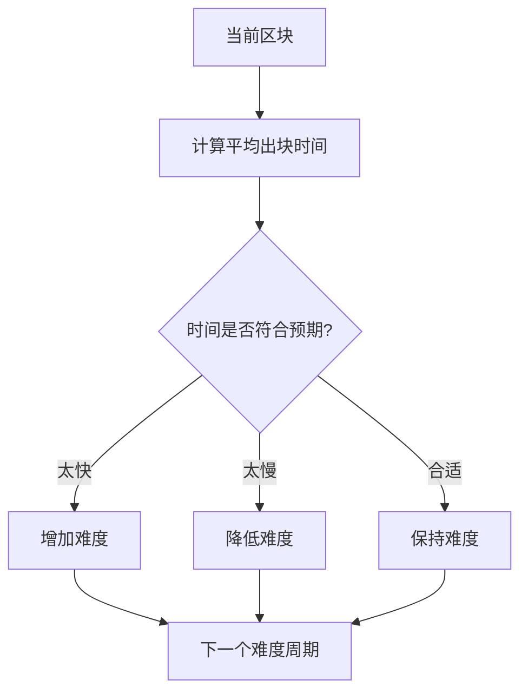

## 1. PoW算法概述

PoW（Proof of Work，工作量证明）是一种分布式共识算法，最初由Adam Back在1997年提出，后来被中本聪用于比特币区块链系统。PoW通过要求网络参与者完成一定的计算工作来获得记账权，从而实现分布式环境下的共识。

### 1.1 核心思想

```
工作量证明原理：
1. 提出一个计算难题（通常是寻找特定哈希值）
2. 矿工竞争解决这个难题
3. 最先解决难题的矿工获得记账权
4. 其他节点验证解决方案并接受新区块
```

### 1.2 算法特点

- **计算密集型**：需要大量计算资源
- **验证简单**：虽然计算困难，但验证解答很容易
- **随机性**：无法预测谁会最先找到答案
- **可调节性**：可以动态调整难度以控制出块时间

## 2. PoW算法原理

### 2.1 哈希谜题

PoW的核心是解决哈希谜题，通常要求找到一个nonce值，使得区块头的哈希值满足特定条件：

```
Hash(Block Header + nonce) < Target
```

其中Target值决定了挖矿难度。

### 2.2 难度调节机制



## 3. PoW基础数据结构

### 3.1 区块结构定义

```java
import java.security.MessageDigest;
import java.time.Instant;
import java.util.*;

/**
 * 区块头结构
 */
public class BlockHeader {
    private final String previousHash;  // 前一个区块的哈希
    private final String merkleRoot;    // Merkle树根
    private final long timestamp;       // 时间戳
    private final int difficulty;       // 难度值
    private long nonce;                 // 随机数

    public BlockHeader(String previousHash, String merkleRoot, int difficulty) {
        this.previousHash = previousHash;
        this.merkleRoot = merkleRoot;
        this.timestamp = Instant.now().getEpochSecond();
        this.difficulty = difficulty;
        this.nonce = 0;
    }

    /**
     * 计算区块头哈希
     */
    public String calculateHash() {
        try {
            String data = previousHash + merkleRoot + timestamp + difficulty + nonce;
            MessageDigest digest = MessageDigest.getInstance("SHA-256");
            byte[] hash = digest.digest(data.getBytes("UTF-8"));

            StringBuilder hexString = new StringBuilder();
            for (byte b : hash) {
                String hex = Integer.toHexString(0xff & b);
                if (hex.length() == 1) {
                    hexString.append('0');
                }
                hexString.append(hex);
            }
            return hexString.toString();

        } catch (Exception e) {
            throw new RuntimeException("计算哈希失败", e);
        }
    }

    /**
     * 检查是否满足难度要求
     */
    public boolean isValidHash(String hash) {
        String target = "0".repeat(difficulty);
        return hash.startsWith(target);
    }

    // Getters and Setters
    public String getPreviousHash() { return previousHash; }
    public String getMerkleRoot() { return merkleRoot; }
    public long getTimestamp() { return timestamp; }
    public int getDifficulty() { return difficulty; }
    public long getNonce() { return nonce; }
    public void setNonce(long nonce) { this.nonce = nonce; }
}

/**
 * 交易结构
 */
public class Transaction {
    private final String id;            // 交易ID
    private final String from;          // 发送方
    private final String to;            // 接收方
    private final double amount;        // 交易金额
    private final long timestamp;       // 时间戳
    private String signature;           // 数字签名

    public Transaction(String from, String to, double amount) {
        this.from = from;
        this.to = to;
        this.amount = amount;
        this.timestamp = Instant.now().getEpochSecond();
        this.id = calculateTransactionId();
    }

    /**
     * 计算交易ID
     */
    private String calculateTransactionId() {
        try {
            String data = from + to + amount + timestamp;
            MessageDigest digest = MessageDigest.getInstance("SHA-256");
            byte[] hash = digest.digest(data.getBytes("UTF-8"));

            StringBuilder hexString = new StringBuilder();
            for (byte b : hash) {
                String hex = Integer.toHexString(0xff & b);
                if (hex.length() == 1) {
                    hexString.append('0');
                }
                hexString.append(hex);
            }
            return hexString.toString();

        } catch (Exception e) {
            throw new RuntimeException("计算交易ID失败", e);
        }
    }

    /**
     * 验证交易
     */
    public boolean isValid() {
        // 简化的验证逻辑
        return from != null && to != null && amount > 0 && !from.equals(to);
    }

    // Getters
    public String getId() { return id; }
    public String getFrom() { return from; }
    public String getTo() { return to; }
    public double getAmount() { return amount; }
    public long getTimestamp() { return timestamp; }
    public String getSignature() { return signature; }
    public void setSignature(String signature) { this.signature = signature; }

    @Override
    public String toString() {
        return String.format("Transaction{id='%s', from='%s', to='%s', amount=%.2f}",
                id, from, to, amount);
    }
}

/**
 * 区块结构
 */
public class Block {
    private final BlockHeader header;
    private final List<Transaction> transactions;
    private String hash;

    public Block(String previousHash, List<Transaction> transactions, int difficulty) {
        this.transactions = new ArrayList<>(transactions);
        String merkleRoot = calculateMerkleRoot(transactions);
        this.header = new BlockHeader(previousHash, merkleRoot, difficulty);
        this.hash = null;
    }

    /**
     * 计算Merkle树根
     */
    private String calculateMerkleRoot(List<Transaction> transactions) {
        if (transactions.isEmpty()) {
            return "0";
        }

        List<String> hashes = new ArrayList<>();
        for (Transaction tx : transactions) {
            hashes.add(tx.getId());
        }

        while (hashes.size() > 1) {
            List<String> newHashes = new ArrayList<>();
            for (int i = 0; i < hashes.size(); i += 2) {
                String left = hashes.get(i);
                String right = (i + 1 < hashes.size()) ? hashes.get(i + 1) : left;
                newHashes.add(hashPair(left, right));
            }
            hashes = newHashes;
        }

        return hashes.get(0);
    }

    /**
     * 计算两个哈希的组合哈希
     */
    private String hashPair(String left, String right) {
        try {
            MessageDigest digest = MessageDigest.getInstance("SHA-256");
            byte[] hash = digest.digest((left + right).getBytes("UTF-8"));

            StringBuilder hexString = new StringBuilder();
            for (byte b : hash) {
                String hex = Integer.toHexString(0xff & b);
                if (hex.length() == 1) {
                    hexString.append('0');
                }
                hexString.append(hex);
            }
            return hexString.toString();

        } catch (Exception e) {
            throw new RuntimeException("计算哈希对失败", e);
        }
    }

    /**
     * 验证区块
     */
    public boolean isValid() {
        // 验证交易
        for (Transaction tx : transactions) {
            if (!tx.isValid()) {
                return false;
            }
        }

        // 验证Merkle根
        String calculatedMerkleRoot = calculateMerkleRoot(transactions);
        if (!calculatedMerkleRoot.equals(header.getMerkleRoot())) {
            return false;
        }

        // 验证哈希
        if (hash != null) {
            String calculatedHash = header.calculateHash();
            if (!calculatedHash.equals(hash)) {
                return false;
            }

            // 验证是否满足难度要求
            if (!header.isValidHash(hash)) {
                return false;
            }
        }

        return true;
    }

    // Getters
    public BlockHeader getHeader() { return header; }
    public List<Transaction> getTransactions() { return new ArrayList<>(transactions); }
    public String getHash() { return hash; }
    public void setHash(String hash) { this.hash = hash; }

    @Override
    public String toString() {
        return String.format("Block{hash='%s', previousHash='%s', transactions=%d, difficulty=%d, nonce=%d}",
                hash, header.getPreviousHash(), transactions.size(),
                header.getDifficulty(), header.getNonce());
    }
}
```

### 3.2 挖矿奖励和费用

```java
/**
 * 挖矿奖励管理
 */
public class MiningReward {
    private static final double INITIAL_REWARD = 50.0;  // 初始奖励
    private static final int HALVING_INTERVAL = 210000;  // 减半间隔（区块数）
    private static final double MIN_REWARD = 0.00000001; // 最小奖励

    /**
     * 计算区块奖励
     */
    public static double calculateBlockReward(int blockHeight) {
        int halvings = blockHeight / HALVING_INTERVAL;
        double reward = INITIAL_REWARD;

        for (int i = 0; i < halvings; i++) {
            reward /= 2.0;
            if (reward < MIN_REWARD) {
                reward = MIN_REWARD;
                break;
            }
        }

        return reward;
    }

    /**
     * 计算交易费用
     */
    public static double calculateTransactionFees(List<Transaction> transactions) {
        // 简化实现：固定费用
        return transactions.size() * 0.001;
    }

    /**
     * 创建挖矿奖励交易（coinbase交易）
     */
    public static Transaction createCoinbaseTransaction(String minerAddress, int blockHeight,
                                                      List<Transaction> transactions) {
        double blockReward = calculateBlockReward(blockHeight);
        double transactionFees = calculateTransactionFees(transactions);
        double totalReward = blockReward + transactionFees;

        Transaction coinbase = new Transaction("SYSTEM", minerAddress, totalReward);
        return coinbase;
    }
}
```

## 4. PoW挖矿实现

### 4.1 基础挖矿器

```java
import java.util.concurrent.atomic.AtomicBoolean;
import java.util.concurrent.atomic.AtomicLong;

/**
 * PoW挖矿器
 */
public class PoWMiner {
    private final String minerAddress;
    private final AtomicBoolean mining = new AtomicBoolean(false);
    private final AtomicLong hashRate = new AtomicLong(0);

    public PoWMiner(String minerAddress) {
        this.minerAddress = minerAddress;
    }

    /**
     * 挖矿方法
     */
    public MiningResult mine(Block block) {
        if (!mining.compareAndSet(false, true)) {
            throw new IllegalStateException("挖矿器已在运行");
        }

        try {
            System.out.println("开始挖矿区块，难度: " + block.getHeader().getDifficulty());
            long startTime = System.currentTimeMillis();
            long hashCount = 0;

            BlockHeader header = block.getHeader();
            String target = "0".repeat(header.getDifficulty());

            while (mining.get()) {
                header.setNonce(header.getNonce() + 1);
                String hash = header.calculateHash();
                hashCount++;

                // 每10000次哈希计算更新一次哈希率
                if (hashCount % 10000 == 0) {
                    long elapsed = System.currentTimeMillis() - startTime;
                    if (elapsed > 0) {
                        hashRate.set((hashCount * 1000) / elapsed);
                    }
                }

                if (hash.startsWith(target)) {
                    long endTime = System.currentTimeMillis();
                    block.setHash(hash);

                    MiningResult result = new MiningResult(
                        true,
                        block,
                        header.getNonce(),
                        hash,
                        hashCount,
                        endTime - startTime,
                        minerAddress
                    );

                    System.out.println("挖矿成功! Nonce: " + header.getNonce() +
                                      ", Hash: " + hash +
                                      ", 耗时: " + (endTime - startTime) + "ms" +
                                      ", 哈希次数: " + hashCount);

                    return result;
                }
            }

            // 挖矿被中断
            return new MiningResult(false, null, 0, null, hashCount,
                                  System.currentTimeMillis() - startTime, minerAddress);

        } finally {
            mining.set(false);
        }
    }

    /**
     * 停止挖矿
     */
    public void stopMining() {
        mining.set(false);
    }

    /**
     * 获取当前哈希率
     */
    public long getHashRate() {
        return hashRate.get();
    }

    /**
     * 检查是否正在挖矿
     */
    public boolean isMining() {
        return mining.get();
    }

    public String getMinerAddress() {
        return minerAddress;
    }
}

/**
 * 挖矿结果
 */
public class MiningResult {
    private final boolean success;
    private final Block block;
    private final long nonce;
    private final String hash;
    private final long hashCount;
    private final long miningTime;
    private final String minerAddress;

    public MiningResult(boolean success, Block block, long nonce, String hash,
                       long hashCount, long miningTime, String minerAddress) {
        this.success = success;
        this.block = block;
        this.nonce = nonce;
        this.hash = hash;
        this.hashCount = hashCount;
        this.miningTime = miningTime;
        this.minerAddress = minerAddress;
    }

    // Getters
    public boolean isSuccess() { return success; }
    public Block getBlock() { return block; }
    public long getNonce() { return nonce; }
    public String getHash() { return hash; }
    public long getHashCount() { return hashCount; }
    public long getMiningTime() { return miningTime; }
    public String getMinerAddress() { return minerAddress; }

    @Override
    public String toString() {
        return String.format("MiningResult{success=%s, nonce=%d, hashCount=%d, time=%dms, miner='%s'}",
                success, nonce, hashCount, miningTime, minerAddress);
    }
}
```

### 4.2 多线程挖矿器

```java
import java.util.concurrent.*;
import java.util.concurrent.atomic.AtomicReference;

/**
 * 多线程PoW挖矿器
 */
public class MultiThreadPoWMiner {
    private final String minerAddress;
    private final int threadCount;
    private final ExecutorService executor;
    private final AtomicBoolean mining = new AtomicBoolean(false);
    private final AtomicReference<MiningResult> result = new AtomicReference<>();

    public MultiThreadPoWMiner(String minerAddress, int threadCount) {
        this.minerAddress = minerAddress;
        this.threadCount = threadCount;
        this.executor = Executors.newFixedThreadPool(threadCount);
    }

    /**
     * 多线程挖矿
     */
    public MiningResult mine(Block block) {
        if (!mining.compareAndSet(false, true)) {
            throw new IllegalStateException("挖矿器已在运行");
        }

        try {
            System.out.println("开始多线程挖矿，线程数: " + threadCount +
                              ", 难度: " + block.getHeader().getDifficulty());

            CountDownLatch latch = new CountDownLatch(1);
            long startTime = System.currentTimeMillis();

            // 启动多个挖矿线程
            for (int i = 0; i < threadCount; i++) {
                final int threadId = i;
                executor.submit(() -> mineInThread(block, threadId, startTime, latch));
            }

            try {
                // 等待任一线程找到解
                latch.await();
            } catch (InterruptedException e) {
                Thread.currentThread().interrupt();
            }

            return result.get();

        } finally {
            mining.set(false);
        }
    }

    /**
     * 线程内挖矿逻辑
     */
    private void mineInThread(Block block, int threadId, long startTime, CountDownLatch latch) {
        BlockHeader header = block.getHeader();
        String target = "0".repeat(header.getDifficulty());
        long nonce = threadId; // 每个线程从不同的nonce开始
        long hashCount = 0;

        while (mining.get()) {
            nonce += threadCount; // 每个线程递增threadCount，避免重复计算
            header.setNonce(nonce);
            String hash = header.calculateHash();
            hashCount++;

            if (hash.startsWith(target)) {
                // 找到解
                long endTime = System.currentTimeMillis();
                block.setHash(hash);

                MiningResult minerResult = new MiningResult(
                    true,
                    block,
                    nonce,
                    hash,
                    hashCount,
                    endTime - startTime,
                    minerAddress + "-thread-" + threadId
                );

                if (result.compareAndSet(null, minerResult)) {
                    System.out.println("线程 " + threadId + " 挖矿成功! " +
                                      "Nonce: " + nonce +
                                      ", Hash: " + hash +
                                      ", 哈希次数: " + hashCount);
                    latch.countDown();
                }
                return;
            }

            // 每1000次检查一次是否应该停止
            if (hashCount % 1000 == 0 && !mining.get()) {
                break;
            }
        }
    }

    /**
     * 停止挖矿
     */
    public void stopMining() {
        mining.set(false);
    }

    /**
     * 关闭挖矿器
     */
    public void shutdown() {
        stopMining();
        executor.shutdown();
        try {
            if (!executor.awaitTermination(5, TimeUnit.SECONDS)) {
                executor.shutdownNow();
            }
        } catch (InterruptedException e) {
            executor.shutdownNow();
            Thread.currentThread().interrupt();
        }
    }

    public boolean isMining() {
        return mining.get();
    }
}
```

### 4.3 挖矿池实现

```java
import java.util.concurrent.*;
import java.util.concurrent.atomic.AtomicInteger;

/**
 * 挖矿池
 */
public class MiningPool {
    private final String poolAddress;
    private final ConcurrentHashMap<String, PoolMiner> miners = new ConcurrentHashMap<>();
    private final ScheduledExecutorService scheduler = Executors.newScheduledThreadPool(2);
    private final AtomicInteger totalHashRate = new AtomicInteger(0);

    public MiningPool(String poolAddress) {
        this.poolAddress = poolAddress;

        // 每5秒更新一次统计信息
        scheduler.scheduleAtFixedRate(this::updateStatistics, 5, 5, TimeUnit.SECONDS);
    }

    /**
     * 矿工加入矿池
     */
    public void joinPool(String minerAddress, int hashPower) {
        PoolMiner poolMiner = new PoolMiner(minerAddress, hashPower);
        miners.put(minerAddress, poolMiner);
        totalHashRate.addAndGet(hashPower);

        System.out.println("矿工 " + minerAddress + " 加入矿池，算力: " + hashPower);
    }

    /**
     * 矿工离开矿池
     */
    public void leavePool(String minerAddress) {
        PoolMiner poolMiner = miners.remove(minerAddress);
        if (poolMiner != null) {
            totalHashRate.addAndGet(-poolMiner.getHashPower());
            System.out.println("矿工 " + minerAddress + " 离开矿池");
        }
    }

    /**
     * 协作挖矿
     */
    public MiningResult collaborativeMining(Block block) {
        if (miners.isEmpty()) {
            throw new IllegalStateException("矿池中没有矿工");
        }

        System.out.println("矿池开始协作挖矿，参与矿工: " + miners.size() +
                          ", 总算力: " + totalHashRate.get());

        long startTime = System.currentTimeMillis();
        AtomicBoolean found = new AtomicBoolean(false);
        CompletableFuture<MiningResult> resultFuture = new CompletableFuture<>();

        // 并行挖矿
        miners.values().parallelStream().forEach(poolMiner -> {
            if (!found.get()) {
                MiningResult result = poolMiner.mine(block, found);
                if (result.isSuccess() && !resultFuture.isDone()) {
                    resultFuture.complete(result);
                }
            }
        });

        try {
            MiningResult result = resultFuture.get(60, TimeUnit.SECONDS);
            long endTime = System.currentTimeMillis();

            // 分配奖励
            distributeRewards(result, endTime - startTime);

            return result;

        } catch (Exception e) {
            found.set(true);
            throw new RuntimeException("协作挖矿失败", e);
        }
    }

    /**
     * 分配挖矿奖励
     */
    private void distributeRewards(MiningResult result, long miningTime) {
        if (!result.isSuccess()) {
            return;
        }

        // 计算总奖励（简化实现）
        double totalReward = 50.0; // 假设固定奖励
        double poolFee = totalReward * 0.02; // 2%矿池费用
        double minerReward = totalReward - poolFee;

        System.out.println("\n=== 奖励分配 ===");
        System.out.println("总奖励: " + totalReward);
        System.out.println("矿池费用: " + poolFee);
        System.out.println("矿工奖励: " + minerReward);

        // 按算力比例分配
        for (PoolMiner poolMiner : miners.values()) {
            double share = (double) poolMiner.getHashPower() / totalHashRate.get();
            double reward = minerReward * share;
            poolMiner.addReward(reward);

            System.out.println("矿工 " + poolMiner.getAddress() +
                              " 算力占比: " + String.format("%.2f%%", share * 100) +
                              " 奖励: " + String.format("%.6f", reward));
        }
        System.out.println("================\n");
    }

    /**
     * 更新统计信息
     */
    private void updateStatistics() {
        if (!miners.isEmpty()) {
            System.out.println("矿池状态 - 矿工数: " + miners.size() +
                              ", 总算力: " + totalHashRate.get());
        }
    }

    /**
     * 获取矿池统计信息
     */
    public PoolStatistics getStatistics() {
        return new PoolStatistics(
            poolAddress,
            miners.size(),
            totalHashRate.get(),
            miners.values().stream().mapToDouble(PoolMiner::getTotalReward).sum()
        );
    }

    /**
     * 关闭矿池
     */
    public void shutdown() {
        scheduler.shutdown();
    }
}

/**
 * 矿池中的矿工
 */
class PoolMiner {
    private final String address;
    private final int hashPower;
    private double totalReward = 0.0;

    public PoolMiner(String address, int hashPower) {
        this.address = address;
        this.hashPower = hashPower;
    }

    /**
     * 挖矿（模拟）
     */
    public MiningResult mine(Block block, AtomicBoolean globalFound) {
        BlockHeader header = block.getHeader();
        String target = "0".repeat(header.getDifficulty());
        long nonce = new Random().nextInt(1000000); // 随机起始点
        long hashCount = 0;
        long startTime = System.currentTimeMillis();

        while (!globalFound.get()) {
            nonce++;
            header.setNonce(nonce);
            String hash = header.calculateHash();
            hashCount++;

            if (hash.startsWith(target)) {
                globalFound.set(true);
                block.setHash(hash);

                return new MiningResult(
                    true,
                    block,
                    nonce,
                    hash,
                    hashCount,
                    System.currentTimeMillis() - startTime,
                    address
                );
            }

            // 模拟算力差异（算力越高，计算越快）
            if (hashCount % (1000 / hashPower) == 0) {
                try {
                    Thread.sleep(1);
                } catch (InterruptedException e) {
                    Thread.currentThread().interrupt();
                    break;
                }
            }
        }

        return new MiningResult(false, null, 0, null, hashCount,
                              System.currentTimeMillis() - startTime, address);
    }

    /**
     * 添加奖励
     */
    public void addReward(double reward) {
        totalReward += reward;
    }

    // Getters
    public String getAddress() { return address; }
    public int getHashPower() { return hashPower; }
    public double getTotalReward() { return totalReward; }
}

/**
 * 矿池统计信息
 */
class PoolStatistics {
    private final String poolAddress;
    private final int minerCount;
    private final int totalHashPower;
    private final double totalRewards;

    public PoolStatistics(String poolAddress, int minerCount, int totalHashPower, double totalRewards) {
        this.poolAddress = poolAddress;
        this.minerCount = minerCount;
        this.totalHashPower = totalHashPower;
        this.totalRewards = totalRewards;
    }

    // Getters
    public String getPoolAddress() { return poolAddress; }
    public int getMinerCount() { return minerCount; }
    public int getTotalHashPower() { return totalHashPower; }
    public double getTotalRewards() { return totalRewards; }

    @Override
    public String toString() {
        return String.format("PoolStatistics{pool='%s', miners=%d, hashPower=%d, rewards=%.6f}",
                poolAddress, minerCount, totalHashPower, totalRewards);
    }
}
```

## 5. 难度调节机制

### 5.1 动态难度调节

```java
/**
 * 难度调节器
 */
public class DifficultyAdjuster {
    private static final long TARGET_BLOCK_TIME = 10 * 60 * 1000; // 10分钟（毫秒）
    private static final int ADJUSTMENT_INTERVAL = 2016; // 每2016个区块调整一次
    private static final double MAX_ADJUSTMENT_FACTOR = 4.0; // 最大调整倍数

    /**
     * 计算新难度
     */
    public static int calculateNewDifficulty(List<Block> recentBlocks, int currentDifficulty) {
        if (recentBlocks.size() < ADJUSTMENT_INTERVAL) {
            return currentDifficulty; // 区块数不足，保持当前难度
        }

        // 获取最近一个调整周期的区块
        List<Block> adjustmentBlocks = recentBlocks.subList(
            recentBlocks.size() - ADJUSTMENT_INTERVAL,
            recentBlocks.size()
        );

        // 计算实际用时
        long startTime = adjustmentBlocks.get(0).getHeader().getTimestamp();
        long endTime = adjustmentBlocks.get(adjustmentBlocks.size() - 1).getHeader().getTimestamp();
        long actualTime = (endTime - startTime) * 1000; // 转换为毫秒

        // 计算预期用时
        long expectedTime = TARGET_BLOCK_TIME * ADJUSTMENT_INTERVAL;

        // 计算调整比例
        double adjustmentFactor = (double) actualTime / expectedTime;

        // 限制调整范围
        adjustmentFactor = Math.max(adjustmentFactor, 1.0 / MAX_ADJUSTMENT_FACTOR);
        adjustmentFactor = Math.min(adjustmentFactor, MAX_ADJUSTMENT_FACTOR);

        // 计算新难度
        int newDifficulty = (int) (currentDifficulty / adjustmentFactor);
        newDifficulty = Math.max(1, newDifficulty); // 最小难度为1
        newDifficulty = Math.min(10, newDifficulty); // 最大难度为10（示例限制）

        System.out.println("难度调节统计:");
        System.out.println("  实际用时: " + (actualTime / 1000 / 60) + " 分钟");
        System.out.println("  预期用时: " + (expectedTime / 1000 / 60) + " 分钟");
        System.out.println("  调整系数: " + String.format("%.4f", adjustmentFactor));
        System.out.println("  旧难度: " + currentDifficulty);
        System.out.println("  新难度: " + newDifficulty);

        return newDifficulty;
    }

    /**
     * 预测下次调节
     */
    public static DifficultyPrediction predictNextAdjustment(List<Block> recentBlocks, int currentDifficulty) {
        if (recentBlocks.isEmpty()) {
            return new DifficultyPrediction(currentDifficulty, 0, ADJUSTMENT_INTERVAL);
        }

        int blocksSinceLastAdjustment = recentBlocks.size() % ADJUSTMENT_INTERVAL;
        int blocksUntilAdjustment = ADJUSTMENT_INTERVAL - blocksSinceLastAdjustment;

        if (blocksSinceLastAdjustment == 0) {
            return new DifficultyPrediction(currentDifficulty, 0, ADJUSTMENT_INTERVAL);
        }

        // 计算当前周期的平均出块时间
        List<Block> currentCycleBlocks = recentBlocks.subList(
            Math.max(0, recentBlocks.size() - blocksSinceLastAdjustment),
            recentBlocks.size()
        );

        if (currentCycleBlocks.size() < 2) {
            return new DifficultyPrediction(currentDifficulty, 0, blocksUntilAdjustment);
        }

        long startTime = currentCycleBlocks.get(0).getHeader().getTimestamp();
        long endTime = currentCycleBlocks.get(currentCycleBlocks.size() - 1).getHeader().getTimestamp();
        long actualTime = (endTime - startTime) * 1000;
        long averageBlockTime = actualTime / (currentCycleBlocks.size() - 1);

        // 预测调整系数
        long projectedTotalTime = averageBlockTime * ADJUSTMENT_INTERVAL;
        long expectedTotalTime = TARGET_BLOCK_TIME * ADJUSTMENT_INTERVAL;
        double predictedAdjustmentFactor = (double) projectedTotalTime / expectedTotalTime;

        // 限制调整范围
        predictedAdjustmentFactor = Math.max(predictedAdjustmentFactor, 1.0 / MAX_ADJUSTMENT_FACTOR);
        predictedAdjustmentFactor = Math.min(predictedAdjustmentFactor, MAX_ADJUSTMENT_FACTOR);

        int predictedDifficulty = (int) (currentDifficulty / predictedAdjustmentFactor);
        predictedDifficulty = Math.max(1, predictedDifficulty);
        predictedDifficulty = Math.min(10, predictedDifficulty);

        return new DifficultyPrediction(predictedDifficulty, averageBlockTime, blocksUntilAdjustment);
    }
}

/**
 * 难度预测结果
 */
class DifficultyPrediction {
    private final int predictedDifficulty;
    private final long averageBlockTime;
    private final int blocksUntilAdjustment;

    public DifficultyPrediction(int predictedDifficulty, long averageBlockTime, int blocksUntilAdjustment) {
        this.predictedDifficulty = predictedDifficulty;
        this.averageBlockTime = averageBlockTime;
        this.blocksUntilAdjustment = blocksUntilAdjustment;
    }

    // Getters
    public int getPredictedDifficulty() { return predictedDifficulty; }
    public long getAverageBlockTime() { return averageBlockTime; }
    public int getBlocksUntilAdjustment() { return blocksUntilAdjustment; }

    @Override
    public String toString() {
        return String.format("DifficultyPrediction{predicted=%d, avgBlockTime=%ds, blocksUntil=%d}",
                predictedDifficulty, averageBlockTime / 1000, blocksUntilAdjustment);
    }
}
```

### 5.2 自适应难度算法

```java
/**
 * 自适应难度调节器（类似以太坊的难度炸弹）
 */
public class AdaptiveDifficultyAdjuster {
    private static final long TARGET_BLOCK_TIME = 15 * 1000; // 15秒
    private static final double DIFFICULTY_BOUND_DIVISOR = 2048.0;
    private static final long BOMB_DELAY = 3000000; // 难度炸弹延迟

    /**
     * 计算下一个区块的难度（每个区块都可能调整）
     */
    public static int calculateAdaptiveDifficulty(Block parentBlock, long parentTimestamp,
                                                 int parentDifficulty, long blockNumber) {
        if (parentBlock == null) {
            return 1; // 创世区块
        }

        long blockTime = System.currentTimeMillis() - parentTimestamp;

        // 基础难度调整
        int newDifficulty = parentDifficulty;

        // 根据出块时间调整
        if (blockTime < TARGET_BLOCK_TIME / 2) {
            // 出块太快，增加难度
            int increase = (int) (parentDifficulty / DIFFICULTY_BOUND_DIVISOR) + 1;
            newDifficulty = parentDifficulty + increase;
        } else if (blockTime > TARGET_BLOCK_TIME * 2) {
            // 出块太慢，降低难度
            int decrease = (int) (parentDifficulty / DIFFICULTY_BOUND_DIVISOR) + 1;
            newDifficulty = parentDifficulty - decrease;
        }

        // 应用难度炸弹（模拟冰河时代）
        newDifficulty = applyDifficultyBomb(newDifficulty, blockNumber);

        // 限制难度范围
        newDifficulty = Math.max(1, newDifficulty);
        newDifficulty = Math.min(20, newDifficulty);

        return newDifficulty;
    }

    /**
     * 应用难度炸弹
     */
    private static int applyDifficultyBomb(int difficulty, long blockNumber) {
        if (blockNumber < BOMB_DELAY) {
            return difficulty;
        }

        // 计算炸弹影响
        long bombBlocks = blockNumber - BOMB_DELAY;
        int bombEffect = (int) Math.pow(2, bombBlocks / 100000);

        return difficulty + bombEffect;
    }

    /**
     * 计算目标哈希值
     */
    public static String calculateTarget(int difficulty) {
        // 简化的目标计算：difficulty个前导零
        return "0".repeat(Math.min(difficulty, 64));
    }

    /**
     * 验证区块难度
     */
    public static boolean validateBlockDifficulty(Block block, Block parentBlock, long parentTimestamp) {
        int expectedDifficulty = calculateAdaptiveDifficulty(
            parentBlock,
            parentTimestamp,
            parentBlock != null ? parentBlock.getHeader().getDifficulty() : 1,
            getBlockNumber(block)
        );

        return block.getHeader().getDifficulty() == expectedDifficulty;
    }

    /**
     * 获取区块号（简化实现）
     */
    private static long getBlockNumber(Block block) {
        // 在实际实现中，这应该从区块链中获取
        return System.currentTimeMillis() / 1000; // 简化为时间戳
    }
}
```

## 6. PoW性能优化

### 6.1 哈希算法优化

```java
import java.nio.ByteBuffer;
import java.security.MessageDigest;

/**
 * 优化的哈希计算器
 */
public class OptimizedHashCalculator {
    private static final ThreadLocal<MessageDigest> DIGEST_THREAD_LOCAL =
        ThreadLocal.withInitial(() -> {
            try {
                return MessageDigest.getInstance("SHA-256");
            } catch (Exception e) {
                throw new RuntimeException("初始化SHA-256失败", e);
            }
        });

    /**
     * 高效的哈希计算（重用MessageDigest）
     */
    public static String calculateHash(String previousHash, String merkleRoot,
                                     long timestamp, int difficulty, long nonce) {
        MessageDigest digest = DIGEST_THREAD_LOCAL.get();
        digest.reset();

        // 使用ByteBuffer提高性能
        ByteBuffer buffer = ByteBuffer.allocate(1024);
        buffer.put(previousHash.getBytes());
        buffer.put(merkleRoot.getBytes());
        buffer.putLong(timestamp);
        buffer.putInt(difficulty);
        buffer.putLong(nonce);

        byte[] hash = digest.digest(buffer.array(), 0, buffer.position());
        return bytesToHex(hash);
    }

    /**
     * 优化的字节转十六进制
     */
    private static String bytesToHex(byte[] bytes) {
        StringBuilder result = new StringBuilder();
        for (byte b : bytes) {
            result.append(String.format("%02x", b));
        }
        return result.toString();
    }

    /**
     * 快速难度检查
     */
    public static boolean meetsTarget(String hash, int difficulty) {
        if (difficulty <= 0 || difficulty > hash.length()) {
            return false;
        }

        for (int i = 0; i < difficulty; i++) {
            if (hash.charAt(i) != '0') {
                return false;
            }
        }
        return true;
    }

    /**
     * 批量哈希计算（SIMD风格）
     */
    public static String[] calculateHashBatch(String baseData, long startNonce, int batchSize) {
        String[] results = new String[batchSize];
        MessageDigest digest = DIGEST_THREAD_LOCAL.get();

        for (int i = 0; i < batchSize; i++) {
            digest.reset();
            String data = baseData + (startNonce + i);
            byte[] hash = digest.digest(data.getBytes());
            results[i] = bytesToHex(hash);
        }

        return results;
    }
}

/**
 * GPU模拟挖矿器（模拟并行计算）
 */
public class GPUSimulatedMiner {
    private final String minerAddress;
    private final int parallelLevel; // 模拟GPU并行度

    public GPUSimulatedMiner(String minerAddress, int parallelLevel) {
        this.minerAddress = minerAddress;
        this.parallelLevel = parallelLevel;
    }

    /**
     * 模拟GPU并行挖矿
     */
    public MiningResult parallelMine(Block block) {
        System.out.println("GPU模拟挖矿开始，并行度: " + parallelLevel);

        BlockHeader header = block.getHeader();
        String baseData = header.getPreviousHash() + header.getMerkleRoot() +
                         header.getTimestamp() + header.getDifficulty();
        String target = "0".repeat(header.getDifficulty());

        long startTime = System.currentTimeMillis();
        long nonce = 0;
        long totalHashes = 0;

        while (true) {
            // 批量计算（模拟GPU并行）
            String[] hashes = OptimizedHashCalculator.calculateHashBatch(baseData, nonce, parallelLevel);
            totalHashes += parallelLevel;

            // 检查每个结果
            for (int i = 0; i < hashes.length; i++) {
                if (OptimizedHashCalculator.meetsTarget(hashes[i], header.getDifficulty())) {
                    long foundNonce = nonce + i;
                    long endTime = System.currentTimeMillis();

                    header.setNonce(foundNonce);
                    block.setHash(hashes[i]);

                    System.out.println("GPU挖矿成功! " +
                                      "Nonce: " + foundNonce +
                                      ", 总哈希: " + totalHashes +
                                      ", 耗时: " + (endTime - startTime) + "ms");

                    return new MiningResult(
                        true,
                        block,
                        foundNonce,
                        hashes[i],
                        totalHashes,
                        endTime - startTime,
                        minerAddress
                    );
                }
            }

            nonce += parallelLevel;

            // 简单的中断检查
            if (totalHashes % (parallelLevel * 1000) == 0) {
                long currentTime = System.currentTimeMillis();
                if (currentTime - startTime > 60000) { // 1分钟超时
                    System.out.println("GPU挖矿超时");
                    break;
                }
            }
        }

        return new MiningResult(false, null, 0, null, totalHashes,
                              System.currentTimeMillis() - startTime, minerAddress);
    }

    /**
     * 获取模拟算力
     */
    public long getSimulatedHashRate() {
        return parallelLevel * 1000; // 假设每秒能计算这么多哈希
    }
}
```

### 6.2 内存池优化

```java
import java.util.concurrent.PriorityBlockingQueue;

/**
 * 优化的交易内存池
 */
public class OptimizedMemoryPool {
    private final PriorityBlockingQueue<Transaction> transactionPool;
    private final Map<String, Transaction> transactionMap = new ConcurrentHashMap<>();
    private final AtomicLong totalFees = new AtomicLong(0);

    public OptimizedMemoryPool() {
        // 按交易费用排序（费用高的优先）
        this.transactionPool = new PriorityBlockingQueue<>(1000,
            (tx1, tx2) -> Double.compare(calculateFee(tx2), calculateFee(tx1)));
    }

    /**
     * 添加交易到内存池
     */
    public boolean addTransaction(Transaction transaction) {
        if (!transaction.isValid()) {
            return false;
        }

        if (transactionMap.containsKey(transaction.getId())) {
            return false; // 重复交易
        }

        transactionMap.put(transaction.getId(), transaction);
        transactionPool.offer(transaction);
        totalFees.addAndGet((long) (calculateFee(transaction) * 100000000)); // 转换为聪

        System.out.println("交易加入内存池: " + transaction.getId() +
                          ", 费用: " + calculateFee(transaction));
        return true;
    }

    /**
     * 获取最高费用的交易集合
     */
    public List<Transaction> getTopTransactions(int maxCount) {
        List<Transaction> result = new ArrayList<>();
        List<Transaction> temp = new ArrayList<>();

        // 取出交易
        for (int i = 0; i < maxCount && !transactionPool.isEmpty(); i++) {
            Transaction tx = transactionPool.poll();
            if (tx != null) {
                result.add(tx);
                temp.add(tx);
            }
        }

        // 重新放回内存池
        transactionPool.addAll(temp);

        return result;
    }

    /**
     * 移除已确认的交易
     */
    public void removeConfirmedTransactions(List<Transaction> confirmedTransactions) {
        for (Transaction tx : confirmedTransactions) {
            if (transactionMap.remove(tx.getId()) != null) {
                transactionPool.remove(tx);
                totalFees.addAndGet(-(long) (calculateFee(tx) * 100000000));
            }
        }
    }

    /**
     * 计算交易费用
     */
    private double calculateFee(Transaction transaction) {
        // 简化的费用计算：基于交易金额的固定比例
        return transaction.getAmount() * 0.001;
    }

    /**
     * 清理过期交易
     */
    public void cleanupExpiredTransactions() {
        long currentTime = System.currentTimeMillis();
        long maxAge = 24 * 60 * 60 * 1000; // 24小时

        List<Transaction> toRemove = new ArrayList<>();
        for (Transaction tx : transactionMap.values()) {
            if (currentTime - tx.getTimestamp() * 1000 > maxAge) {
                toRemove.add(tx);
            }
        }

        for (Transaction tx : toRemove) {
            transactionMap.remove(tx.getId());
            transactionPool.remove(tx);
            totalFees.addAndGet(-(long) (calculateFee(tx) * 100000000));
        }

        if (!toRemove.isEmpty()) {
            System.out.println("清理过期交易: " + toRemove.size() + " 笔");
        }
    }

    /**
     * 获取内存池统计信息
     */
    public MemoryPoolStats getStats() {
        return new MemoryPoolStats(
            transactionPool.size(),
            totalFees.get() / 100000000.0, // 转换回普通单位
            transactionPool.isEmpty() ? 0 : calculateFee(transactionPool.peek())
        );
    }

    /**
     * 估算确认时间
     */
    public long estimateConfirmationTime(double transactionFee) {
        // 简化的确认时间估算
        long position = transactionPool.stream()
            .mapToLong(tx -> calculateFee(tx) > transactionFee ? 1 : 0)
            .sum();

        // 假设每个区块处理100笔交易，每10分钟一个区块
        long blocksUntilConfirmation = position / 100 + 1;
        return blocksUntilConfirmation * 10 * 60 * 1000; // 毫秒
    }
}

/**
 * 内存池统计信息
 */
class MemoryPoolStats {
    private final int transactionCount;
    private final double totalFees;
    private final double highestFee;

    public MemoryPoolStats(int transactionCount, double totalFees, double highestFee) {
        this.transactionCount = transactionCount;
        this.totalFees = totalFees;
        this.highestFee = highestFee;
    }

    // Getters
    public int getTransactionCount() { return transactionCount; }
    public double getTotalFees() { return totalFees; }
    public double getHighestFee() { return highestFee; }

    @Override
    public String toString() {
        return String.format("MemoryPoolStats{txCount=%d, totalFees=%.6f, highestFee=%.6f}",
                transactionCount, totalFees, highestFee);
    }
}
```

## 7. 完整的PoW区块链实现

### 7.1 区块链主体

```java
/**
 * PoW区块链实现
 */
public class PoWBlockchain {
    private final List<Block> blockchain = new ArrayList<>();
    private final OptimizedMemoryPool memoryPool = new OptimizedMemoryPool();
    private final Map<String, PoWMiner> miners = new ConcurrentHashMap<>();
    private final ScheduledExecutorService scheduler = Executors.newScheduledThreadPool(2);

    private int currentDifficulty = 4; // 初始难度
    private final Object miningLock = new Object();

    public PoWBlockchain() {
        // 创建创世区块
        createGenesisBlock();

        // 启动内存池清理定时任务
        scheduler.scheduleAtFixedRate(memoryPool::cleanupExpiredTransactions,
            60, 60, TimeUnit.SECONDS);
    }

    /**
     * 创建创世区块
     */
    private void createGenesisBlock() {
        List<Transaction> genesisTxs = Arrays.asList(
            new Transaction("GENESIS", "genesis-address", 1000000.0)
        );

        Block genesis = new Block("0", genesisTxs, currentDifficulty);
        genesis.getHeader().setNonce(0);
        genesis.setHash(genesis.getHeader().calculateHash());

        blockchain.add(genesis);
        System.out.println("创世区块已创建: " + genesis.getHash());
    }

    /**
     * 添加交易到内存池
     */
    public boolean addTransaction(Transaction transaction) {
        return memoryPool.addTransaction(transaction);
    }

    /**
     * 开始挖矿
     */
    public void startMining(String minerAddress, int threadCount) {
        MultiThreadPoWMiner miner = new MultiThreadPoWMiner(minerAddress, threadCount);
        miners.put(minerAddress, miner);

        CompletableFuture.runAsync(() -> {
            while (miners.containsKey(minerAddress)) {
                try {
                    mineNextBlock(miner);
                    Thread.sleep(1000); // 短暂休息
                } catch (Exception e) {
                    System.err.println("挖矿错误: " + e.getMessage());
                }
            }
        });

        System.out.println("矿工 " + minerAddress + " 开始挖矿");
    }

    /**
     * 停止挖矿
     */
    public void stopMining(String minerAddress) {
        PoWMiner miner = miners.remove(minerAddress);
        if (miner != null) {
            miner.stopMining();
            System.out.println("矿工 " + minerAddress + " 停止挖矿");
        }
    }

    /**
     * 挖矿下一个区块
     */
    private void mineNextBlock(PoWMiner miner) {
        synchronized (miningLock) {
            // 获取待打包的交易
            List<Transaction> transactions = memoryPool.getTopTransactions(100);

            if (transactions.isEmpty()) {
                return; // 没有交易可打包
            }

            // 添加coinbase交易
            Transaction coinbase = MiningReward.createCoinbaseTransaction(
                miner.getMinerAddress(),
                blockchain.size(),
                transactions
            );
            transactions.add(0, coinbase);

            // 创建新区块
            Block newBlock = new Block(
                getLatestBlock().getHash(),
                transactions,
                currentDifficulty
            );

            // 挖矿
            MiningResult result = miner.mine(newBlock);

            if (result.isSuccess()) {
                // 验证并添加区块
                if (addBlock(result.getBlock())) {
                    // 从内存池移除已确认交易
                    memoryPool.removeConfirmedTransactions(
                        transactions.subList(1, transactions.size()) // 排除coinbase
                    );

                    System.out.println("新区块已添加: " + result.getBlock().getHash());
                    System.out.println("区块高度: " + blockchain.size());

                    // 调整难度
                    adjustDifficulty();
                }
            }
        }
    }

    /**
     * 添加区块到链上
     */
    public boolean addBlock(Block block) {
        // 验证区块
        if (!isValidNewBlock(block)) {
            return false;
        }

        blockchain.add(block);
        return true;
    }

    /**
     * 验证新区块
     */
    private boolean isValidNewBlock(Block block) {
        Block lastBlock = getLatestBlock();

        // 验证前一个区块哈希
        if (!block.getHeader().getPreviousHash().equals(lastBlock.getHash())) {
            System.err.println("无效的前一个区块哈希");
            return false;
        }

        // 验证区块结构
        if (!block.isValid()) {
            System.err.println("区块结构验证失败");
            return false;
        }

        // 验证难度
        if (block.getHeader().getDifficulty() != currentDifficulty) {
            System.err.println("难度不匹配");
            return false;
        }

        // 验证工作量证明
        if (!block.getHeader().isValidHash(block.getHash())) {
            System.err.println("工作量证明验证失败");
            return false;
        }

        return true;
    }

    /**
     * 调整挖矿难度
     */
    private void adjustDifficulty() {
        if (blockchain.size() % DifficultyAdjuster.ADJUSTMENT_INTERVAL == 0) {
            int newDifficulty = DifficultyAdjuster.calculateNewDifficulty(blockchain, currentDifficulty);
            if (newDifficulty != currentDifficulty) {
                System.out.println("难度调整: " + currentDifficulty + " -> " + newDifficulty);
                currentDifficulty = newDifficulty;
            }
        }
    }

    /**
     * 获取最新区块
     */
    public Block getLatestBlock() {
        return blockchain.get(blockchain.size() - 1);
    }

    /**
     * 获取区块链状态
     */
    public BlockchainStats getStats() {
        double totalRewards = blockchain.stream()
            .flatMap(block -> block.getTransactions().stream())
            .filter(tx -> "SYSTEM".equals(tx.getFrom()))
            .mapToDouble(Transaction::getAmount)
            .sum();

        return new BlockchainStats(
            blockchain.size(),
            currentDifficulty,
            memoryPool.getStats().getTransactionCount(),
            miners.size(),
            totalRewards
        );
    }

    /**
     * 获取账户余额
     */
    public double getBalance(String address) {
        double balance = 0.0;

        for (Block block : blockchain) {
            for (Transaction tx : block.getTransactions()) {
                if (tx.getTo().equals(address)) {
                    balance += tx.getAmount();
                }
                if (tx.getFrom().equals(address)) {
                    balance -= tx.getAmount();
                }
            }
        }

        return balance;
    }

    /**
     * 打印区块链状态
     */
    public void printBlockchainStatus() {
        BlockchainStats stats = getStats();
        System.out.println("\n=== 区块链状态 ===");
        System.out.println("区块数量: " + stats.getBlockCount());
        System.out.println("当前难度: " + stats.getCurrentDifficulty());
        System.out.println("待确认交易: " + stats.getPendingTransactions());
        System.out.println("活跃矿工: " + stats.getActiveMiners());
        System.out.println("总奖励: " + String.format("%.6f", stats.getTotalRewards()));
        System.out.println("内存池状态: " + memoryPool.getStats());
        System.out.println("================\n");
    }

    /**
     * 关闭区块链
     */
    public void shutdown() {
        // 停止所有矿工
        new ArrayList<>(miners.keySet()).forEach(this::stopMining);

        scheduler.shutdown();
        try {
            if (!scheduler.awaitTermination(5, TimeUnit.SECONDS)) {
                scheduler.shutdownNow();
            }
        } catch (InterruptedException e) {
            scheduler.shutdownNow();
            Thread.currentThread().interrupt();
        }
    }
}

/**
 * 区块链统计信息
 */
class BlockchainStats {
    private final int blockCount;
    private final int currentDifficulty;
    private final int pendingTransactions;
    private final int activeMiners;
    private final double totalRewards;

    public BlockchainStats(int blockCount, int currentDifficulty, int pendingTransactions,
                          int activeMiners, double totalRewards) {
        this.blockCount = blockCount;
        this.currentDifficulty = currentDifficulty;
        this.pendingTransactions = pendingTransactions;
        this.activeMiners = activeMiners;
        this.totalRewards = totalRewards;
    }

    // Getters
    public int getBlockCount() { return blockCount; }
    public int getCurrentDifficulty() { return currentDifficulty; }
    public int getPendingTransactions() { return pendingTransactions; }
    public int getActiveMiners() { return activeMiners; }
    public double getTotalRewards() { return totalRewards; }
}
```

## 8. 完整测试示例

### 8.1 PoW区块链测试

```java
/**
 * PoW区块链综合测试
 */
public class PoWBlockchainTest {

    public static void main(String[] args) throws Exception {
        testPoWBlockchain();
    }

    /**
     * 测试PoW区块链
     */
    private static void testPoWBlockchain() throws Exception {
        System.out.println("=== PoW区块链测试开始 ===\n");

        // 创建区块链
        PoWBlockchain blockchain = new PoWBlockchain();

        // 添加一些初始交易
        addInitialTransactions(blockchain);

        // 启动多个矿工
        blockchain.startMining("miner-alice", 2);
        blockchain.startMining("miner-bob", 2);
        blockchain.startMining("miner-charlie", 1);

        // 让系统运行一段时间
        Thread.sleep(30000); // 30秒

        // 添加更多交易
        addMoreTransactions(blockchain);

        // 继续运行
        Thread.sleep(60000); // 60秒

        // 测试矿池
        testMiningPool();

        // 测试难度调节
        testDifficultyAdjustment(blockchain);

        // 打印最终状态
        blockchain.printBlockchainStatus();

        // 打印账户余额
        printBalances(blockchain);

        // 关闭系统
        blockchain.shutdown();

        System.out.println("\n=== PoW区块链测试完成 ===");
    }

    /**
     * 添加初始交易
     */
    private static void addInitialTransactions(PoWBlockchain blockchain) {
        System.out.println("添加初始交易...");

        String[] addresses = {"alice", "bob", "charlie", "david", "eve"};
        Random random = new Random();

        for (int i = 0; i < 20; i++) {
            String from = addresses[random.nextInt(addresses.length)];
            String to = addresses[random.nextInt(addresses.length)];

            if (!from.equals(to)) {
                double amount = 1 + random.nextDouble() * 99; // 1-100的随机金额
                Transaction tx = new Transaction(from, to, amount);
                blockchain.addTransaction(tx);
            }
        }

        System.out.println("初始交易添加完成\n");
    }

    /**
     * 添加更多交易
     */
    private static void addMoreTransactions(PoWBlockchain blockchain) {
        System.out.println("添加更多交易...");

        String[] addresses = {"alice", "bob", "charlie", "david", "eve", "frank", "grace"};
        Random random = new Random();

        for (int i = 0; i < 50; i++) {
            String from = addresses[random.nextInt(addresses.length)];
            String to = addresses[random.nextInt(addresses.length)];

            if (!from.equals(to)) {
                double amount = 0.1 + random.nextDouble() * 49.9; // 0.1-50的随机金额
                Transaction tx = new Transaction(from, to, amount);
                blockchain.addTransaction(tx);
            }
        }

        System.out.println("更多交易添加完成\n");
    }

    /**
     * 测试矿池
     */
    private static void testMiningPool() throws Exception {
        System.out.println("=== 测试矿池 ===");

        MiningPool pool = new MiningPool("mining-pool-1");

        // 矿工加入矿池
        pool.joinPool("pool-miner-1", 100);
        pool.joinPool("pool-miner-2", 80);
        pool.joinPool("pool-miner-3", 120);
        pool.joinPool("pool-miner-4", 60);

        // 创建测试区块
        List<Transaction> transactions = Arrays.asList(
            new Transaction("test-sender", "test-receiver", 50.0)
        );

        Block testBlock = new Block("test-previous-hash", transactions, 3);

        // 矿池协作挖矿
        try {
            MiningResult result = pool.collaborativeMining(testBlock);
            System.out.println("矿池挖矿结果: " + result);
        } catch (Exception e) {
            System.out.println("矿池挖矿失败: " + e.getMessage());
        }

        // 打印矿池统计
        System.out.println("矿池统计: " + pool.getStatistics());

        pool.shutdown();
        System.out.println("=== 矿池测试完成 ===\n");
    }

    /**
     * 测试难度调节
     */
    private static void testDifficultyAdjustment(PoWBlockchain blockchain) {
        System.out.println("=== 测试难度调节 ===");

        // 模拟快速出块场景
        List<Block> fastBlocks = createFastBlocks(10, 2); // 难度2，快速出块
        int newDifficulty = DifficultyAdjuster.calculateNewDifficulty(fastBlocks, 2);
        System.out.println("快速出块场景，新难度: " + newDifficulty);

        // 模拟慢速出块场景
        List<Block> slowBlocks = createSlowBlocks(10, 6); // 难度6，慢速出块
        newDifficulty = DifficultyAdjuster.calculateNewDifficulty(slowBlocks, 6);
        System.out.println("慢速出块场景，新难度: " + newDifficulty);

        // 预测下次调节
        DifficultyPrediction prediction = DifficultyAdjuster.predictNextAdjustment(fastBlocks, 4);
        System.out.println("难度预测: " + prediction);

        System.out.println("=== 难度调节测试完成 ===\n");
    }

    /**
     * 创建快速出块的模拟区块
     */
    private static List<Block> createFastBlocks(int count, int difficulty) {
        List<Block> blocks = new ArrayList<>();
        long currentTime = System.currentTimeMillis() / 1000;

        for (int i = 0; i < count; i++) {
            List<Transaction> txs = Arrays.asList(new Transaction("test", "test2", 1.0));
            Block block = new Block("hash" + i, txs, difficulty);

            // 设置快速出块时间（5分钟间隔）
            BlockHeader header = block.getHeader();
            long blockTime = currentTime - (count - i) * 5 * 60; // 5分钟间隔
            // 注意：实际实现中需要修改BlockHeader允许设置时间戳

            blocks.add(block);
        }

        return blocks;
    }

    /**
     * 创建慢速出块的模拟区块
     */
    private static List<Block> createSlowBlocks(int count, int difficulty) {
        List<Block> blocks = new ArrayList<>();
        long currentTime = System.currentTimeMillis() / 1000;

        for (int i = 0; i < count; i++) {
            List<Transaction> txs = Arrays.asList(new Transaction("test", "test2", 1.0));
            Block block = new Block("hash" + i, txs, difficulty);

            // 设置慢速出块时间（20分钟间隔）
            // 实际实现中需要修改BlockHeader以支持自定义时间戳

            blocks.add(block);
        }

        return blocks;
    }

    /**
     * 打印账户余额
     */
    private static void printBalances(PoWBlockchain blockchain) {
        System.out.println("=== 账户余额 ===");

        String[] addresses = {"alice", "bob", "charlie", "david", "eve",
                             "miner-alice", "miner-bob", "miner-charlie"};

        for (String address : addresses) {
            double balance = blockchain.getBalance(address);
            if (balance != 0) {
                System.out.println(address + ": " + String.format("%.6f", balance));
            }
        }

        System.out.println("================\n");
    }

    /**
     * 性能测试
     */
    private static void performanceTest() {
        System.out.println("=== 性能测试 ===");

        // 测试单线程挖矿性能
        PoWMiner singleMiner = new PoWMiner("perf-miner");
        List<Transaction> txs = Arrays.asList(new Transaction("test", "test2", 1.0));
        Block testBlock = new Block("test-hash", txs, 4);

        long startTime = System.currentTimeMillis();
        MiningResult result = singleMiner.mine(testBlock);
        long endTime = System.currentTimeMillis();

        if (result.isSuccess()) {
            double hashRate = (double) result.getHashCount() / ((endTime - startTime) / 1000.0);
            System.out.println("单线程挖矿 - 哈希率: " + String.format("%.0f", hashRate) + " H/s");
        }

        // 测试多线程挖矿性能
        MultiThreadPoWMiner multiMiner = new MultiThreadPoWMiner("multi-miner", 4);
        Block testBlock2 = new Block("test-hash2", txs, 4);

        startTime = System.currentTimeMillis();
        MiningResult result2 = multiMiner.mine(testBlock2);
        endTime = System.currentTimeMillis();

        if (result2.isSuccess()) {
            double hashRate = (double) result2.getHashCount() / ((endTime - startTime) / 1000.0);
            System.out.println("多线程挖矿 - 哈希率: " + String.format("%.0f", hashRate) + " H/s");
        }

        multiMiner.shutdown();

        // 测试GPU模拟挖矿
        GPUSimulatedMiner gpuMiner = new GPUSimulatedMiner("gpu-miner", 1000);
        Block testBlock3 = new Block("test-hash3", txs, 4);

        startTime = System.currentTimeMillis();
        MiningResult result3 = gpuMiner.parallelMine(testBlock3);
        endTime = System.currentTimeMillis();

        if (result3.isSuccess()) {
            double hashRate = (double) result3.getHashCount() / ((endTime - startTime) / 1000.0);
            System.out.println("GPU模拟挖矿 - 哈希率: " + String.format("%.0f", hashRate) + " H/s");
        }

        System.out.println("=== 性能测试完成 ===\n");
    }
}
```

## 9. 总结

PoW（工作量证明）算法是区块链技术的核心共识机制，具有以下特点：

### 9.1 核心优势
- **安全性高**：需要控制51%以上算力才能攻击网络
- **去中心化**：任何人都可以参与挖矿竞争
- **经济激励**：通过挖矿奖励激励网络参与
- **抗审查**：没有中央权威可以阻止交易

### 9.2 主要挑战
- **能耗问题**：需要大量电力进行哈希计算
- **硬件军备竞赛**：专业矿机导致普通用户难以参与
- **扩展性限制**：出块时间和区块大小限制了TPS
- **中心化风险**：矿池集中可能导致算力中心化

### 9.3 应用场景
- **公链系统**：比特币、以太坊（早期）等主流区块链
- **数字货币**：需要去中心化和高安全性的货币系统
- **价值存储**：数字黄金等价值存储应用
- **时间戳服务**：不可篡改的时间戳证明

### 9.4 优化方向
- **算法优化**：更高效的哈希算法和验证机制
- **硬件优化**：ASIC矿机、GPU优化等
- **网络优化**：减少孤块率，提高网络效率
- **激励机制**：更公平的奖励分配机制

### 9.5 未来发展
- **混合共识**：PoW与PoS等其他共识的结合
- **绿色挖矿**：使用可再生能源进行挖矿
- **Layer 2解决方案**：闪电网络等提高扩展性
- **跨链技术**：连接不同的PoW区块链

通过本文的详细实现，你可以深入理解PoW算法的工作原理和实现细节，为开发基于PoW的区块链系统提供坚实的基础。