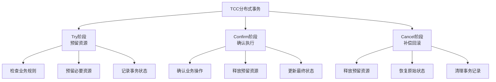
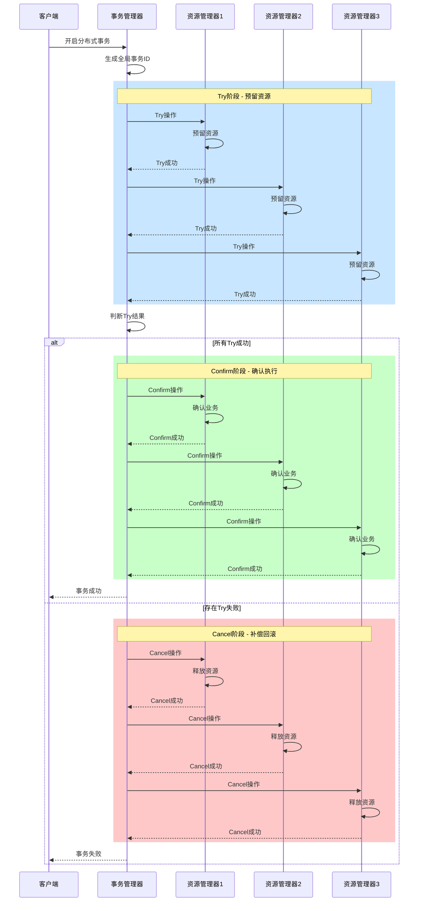
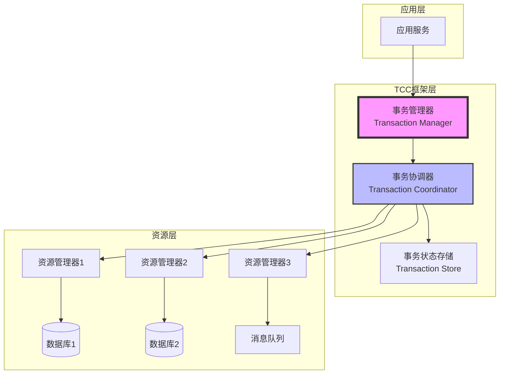
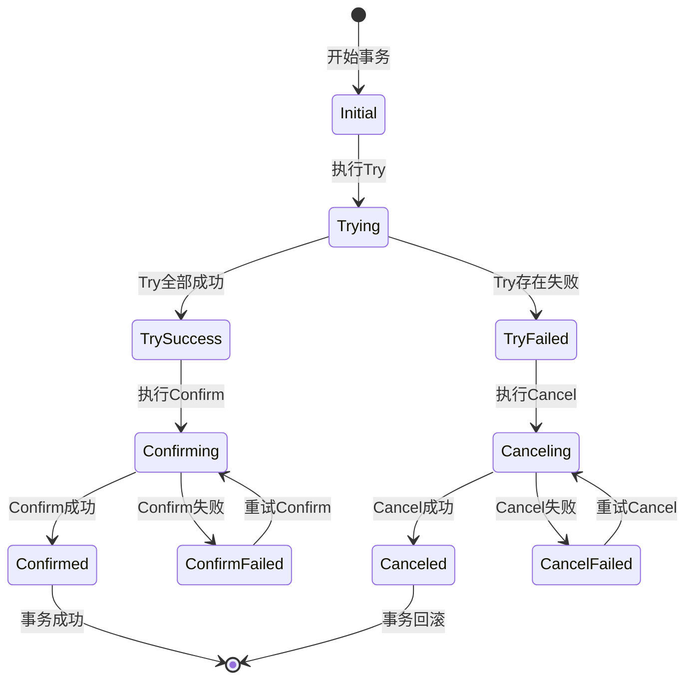

## 1. TCC模式概述

TCC（Try-Confirm-Cancel）是一种分布式事务处理模式，通过业务层面的补偿机制来实现分布式事务的一致性。它将一个完整的业务操作分解为三个阶段，是一种应用层的两阶段提交协议。

### 1.1 核心思想



### 1.2 TCC vs 传统事务对比

| 特性 | 传统ACID事务 | TCC模式 | XA事务 |
|-----|------------|---------|--------|
| **一致性保证** | 强一致性 | 最终一致性 | 强一致性 |
| **资源锁定** | 长时间锁定 | 短时间预留 | 长时间锁定 |
| **性能影响** | 低并发 | 高并发 | 低并发 |
| **实现复杂度** | 简单 | 复杂 | 中等 |
| **跨服务支持** | 不支持 | 支持 | 支持 |
| **业务侵入性** | 无 | 高 | 低 |
| **故障恢复** | 自动 | 需要补偿 | 自动 |

### 1.3 适用场景

#### 🎯 适合使用TCC的场景

1. **高并发业务场景**
   - 电商订单处理
   - 支付交易系统
   - 库存扣减操作

2. **跨服务调用场景**
   - 微服务架构
   - 多数据源事务
   - 跨系统集成

3. **性能敏感场景**
   - 需要高吞吐量
   - 不能接受长时间锁定
   - 要求快速响应

#### ⚠️ 不适合使用TCC的场景

1. **简单事务场景**
   - 单库事务即可满足
   - 业务逻辑简单
   - 无跨服务调用

2. **强一致性要求**
   - 金融核心账务
   - 实时数据同步
   - 关键数据更新

## 2. TCC模式原理详解

### 2.1 三阶段协议流程



### 2.2 核心组件架构



### 2.3 状态机模型



## 3. TCC框架核心实现

### 3.1 事务管理器实现

```java
import java.util.*;
import java.util.concurrent.*;
import java.util.concurrent.atomic.AtomicReference;
import lombok.Data;
import lombok.extern.slf4j.Slf4j;

/**
 * TCC事务管理器核心实现
 */
@Slf4j
public class TCCTransactionManager {

    // 事务存储
    private final TransactionStore transactionStore;

    // 参与者注册表
    private final Map<String, TCCParticipant> participants = new ConcurrentHashMap<>();

    // 事务执行线程池
    private final ExecutorService executorService;

    // 事务超时时间（毫秒）
    private final long transactionTimeout;

    // 重试策略
    private final RetryPolicy retryPolicy;

    // 事务恢复调度器
    private final ScheduledExecutorService recoveryScheduler;

    public TCCTransactionManager(TransactionStore transactionStore,
                                 int threadPoolSize,
                                 long transactionTimeout) {
        this.transactionStore = transactionStore;
        this.executorService = Executors.newFixedThreadPool(threadPoolSize);
        this.transactionTimeout = transactionTimeout;
        this.retryPolicy = new ExponentialBackoffRetryPolicy();
        this.recoveryScheduler = Executors.newScheduledThreadPool(2);

        // 启动事务恢复任务
        startRecoveryTask();
    }

    /**
     * 注册TCC参与者
     */
    public void registerParticipant(String name, TCCParticipant participant) {
        participants.put(name, participant);
        log.info("Registered TCC participant: {}", name);
    }

    /**
     * 执行TCC事务
     */
    public <T> CompletableFuture<T> executeTransaction(TCCTransaction<T> transaction) {
        String transactionId = generateTransactionId();
        TransactionContext context = new TransactionContext(transactionId);

        // 创建事务记录
        TransactionRecord record = new TransactionRecord();
        record.setTransactionId(transactionId);
        record.setStatus(TransactionStatus.TRYING);
        record.setCreateTime(System.currentTimeMillis());
        record.setParticipants(new ArrayList<>());

        // 保存事务记录
        transactionStore.save(record);

        return CompletableFuture.supplyAsync(() -> {
            try {
                // 设置事务上下文
                TransactionContextHolder.set(context);

                // 执行Try阶段
                log.info("Starting Try phase for transaction: {}", transactionId);
                List<ParticipantRecord> tryResults = executeTryPhase(transaction, context, record);

                if (allTrySuccess(tryResults)) {
                    // Try全部成功，执行Confirm阶段
                    log.info("Try phase succeeded, starting Confirm phase: {}", transactionId);
                    record.setStatus(TransactionStatus.CONFIRMING);
                    transactionStore.update(record);

                    executeConfirmPhase(tryResults, context, record);

                    record.setStatus(TransactionStatus.CONFIRMED);
                    transactionStore.update(record);

                    log.info("Transaction confirmed successfully: {}", transactionId);
                    return transaction.getResult();
                } else {
                    // Try存在失败，执行Cancel阶段
                    log.info("Try phase failed, starting Cancel phase: {}", transactionId);
                    record.setStatus(TransactionStatus.CANCELING);
                    transactionStore.update(record);

                    executeCancelPhase(tryResults, context, record);

                    record.setStatus(TransactionStatus.CANCELED);
                    transactionStore.update(record);

                    log.info("Transaction canceled successfully: {}", transactionId);
                    throw new TCCTransactionException("Transaction failed in Try phase");
                }
            } catch (Exception e) {
                log.error("Transaction failed: {}", transactionId, e);
                handleTransactionFailure(record, context, e);
                throw new TCCTransactionException("Transaction execution failed", e);
            } finally {
                TransactionContextHolder.clear();
            }
        }, executorService);
    }

    /**
     * 执行Try阶段
     */
    private List<ParticipantRecord> executeTryPhase(TCCTransaction<?> transaction,
                                                     TransactionContext context,
                                                     TransactionRecord record) {
        List<ParticipantRecord> results = new ArrayList<>();
        List<CompletableFuture<ParticipantRecord>> futures = new ArrayList<>();

        for (TCCAction action : transaction.getActions()) {
            CompletableFuture<ParticipantRecord> future = CompletableFuture.supplyAsync(() -> {
                ParticipantRecord participant = new ParticipantRecord();
                participant.setParticipantName(action.getParticipantName());
                participant.setActionId(UUID.randomUUID().toString());

                try {
                    TCCParticipant tccParticipant = participants.get(action.getParticipantName());
                    if (tccParticipant == null) {
                        throw new IllegalStateException("Participant not found: " + action.getParticipantName());
                    }

                    // 执行Try操作
                    Object result = tccParticipant.doTry(context, action.getRequest());

                    participant.setTryResult(result);
                    participant.setStatus(ParticipantStatus.TRY_SUCCESS);
                    participant.setTryTime(System.currentTimeMillis());

                    log.info("Try succeeded for participant: {}", action.getParticipantName());
                } catch (Exception e) {
                    participant.setStatus(ParticipantStatus.TRY_FAILED);
                    participant.setErrorMessage(e.getMessage());
                    log.error("Try failed for participant: {}", action.getParticipantName(), e);
                }

                return participant;
            }, executorService);

            futures.add(future);
        }

        // 等待所有Try操作完成
        try {
            CompletableFuture<Void> allFutures = CompletableFuture.allOf(
                futures.toArray(new CompletableFuture[0])
            );
            allFutures.get(transactionTimeout, TimeUnit.MILLISECONDS);

            for (CompletableFuture<ParticipantRecord> future : futures) {
                ParticipantRecord result = future.get();
                results.add(result);
                record.getParticipants().add(result);
            }

            transactionStore.update(record);
        } catch (Exception e) {
            log.error("Error waiting for Try phase completion", e);
            throw new TCCTransactionException("Try phase execution timeout or failed", e);
        }

        return results;
    }

    /**
     * 执行Confirm阶段
     */
    private void executeConfirmPhase(List<ParticipantRecord> participants,
                                      TransactionContext context,
                                      TransactionRecord record) {
        List<CompletableFuture<Void>> futures = new ArrayList<>();

        for (ParticipantRecord participant : participants) {
            if (participant.getStatus() == ParticipantStatus.TRY_SUCCESS) {
                CompletableFuture<Void> future = CompletableFuture.runAsync(() -> {
                    executeWithRetry(() -> {
                        TCCParticipant tccParticipant = this.participants.get(participant.getParticipantName());
                        tccParticipant.doConfirm(context, participant.getTryResult());
                        participant.setStatus(ParticipantStatus.CONFIRMED);
                        participant.setConfirmTime(System.currentTimeMillis());
                        log.info("Confirm succeeded for participant: {}", participant.getParticipantName());
                    }, "Confirm", participant.getParticipantName());
                }, executorService);

                futures.add(future);
            }
        }

        // 等待所有Confirm操作完成
        try {
            CompletableFuture<Void> allFutures = CompletableFuture.allOf(
                futures.toArray(new CompletableFuture[0])
            );
            allFutures.get(transactionTimeout, TimeUnit.MILLISECONDS);

            transactionStore.update(record);
        } catch (Exception e) {
            log.error("Error during Confirm phase", e);
            // Confirm阶段失败需要持续重试
            scheduleRetry(record, TransactionStatus.CONFIRMING);
        }
    }

    /**
     * 执行Cancel阶段
     */
    private void executeCancelPhase(List<ParticipantRecord> participants,
                                     TransactionContext context,
                                     TransactionRecord record) {
        List<CompletableFuture<Void>> futures = new ArrayList<>();

        for (ParticipantRecord participant : participants) {
            if (participant.getStatus() == ParticipantStatus.TRY_SUCCESS) {
                CompletableFuture<Void> future = CompletableFuture.runAsync(() -> {
                    executeWithRetry(() -> {
                        TCCParticipant tccParticipant = this.participants.get(participant.getParticipantName());
                        tccParticipant.doCancel(context, participant.getTryResult());
                        participant.setStatus(ParticipantStatus.CANCELED);
                        participant.setCancelTime(System.currentTimeMillis());
                        log.info("Cancel succeeded for participant: {}", participant.getParticipantName());
                    }, "Cancel", participant.getParticipantName());
                }, executorService);

                futures.add(future);
            }
        }

        // 等待所有Cancel操作完成
        try {
            CompletableFuture<Void> allFutures = CompletableFuture.allOf(
                futures.toArray(new CompletableFuture[0])
            );
            allFutures.get(transactionTimeout, TimeUnit.MILLISECONDS);

            transactionStore.update(record);
        } catch (Exception e) {
            log.error("Error during Cancel phase", e);
            // Cancel阶段失败需要持续重试
            scheduleRetry(record, TransactionStatus.CANCELING);
        }
    }

    /**
     * 带重试的执行
     */
    private void executeWithRetry(Runnable action, String phase, String participant) {
        int maxRetries = retryPolicy.getMaxRetries();
        long delay = retryPolicy.getInitialDelay();

        for (int i = 0; i <= maxRetries; i++) {
            try {
                action.run();
                return; // 成功执行
            } catch (Exception e) {
                if (i == maxRetries) {
                    log.error("{} failed after {} retries for participant: {}",
                              phase, maxRetries, participant, e);
                    throw new TCCTransactionException(phase + " failed after max retries", e);
                }

                log.warn("{} failed, retrying... (attempt {}/{}) for participant: {}",
                         phase, i + 1, maxRetries, participant);

                try {
                    Thread.sleep(delay);
                } catch (InterruptedException ie) {
                    Thread.currentThread().interrupt();
                    throw new TCCTransactionException("Retry interrupted", ie);
                }

                delay = retryPolicy.getNextDelay(delay);
            }
        }
    }

    /**
     * 判断所有Try是否成功
     */
    private boolean allTrySuccess(List<ParticipantRecord> results) {
        return results.stream().allMatch(r -> r.getStatus() == ParticipantStatus.TRY_SUCCESS);
    }

    /**
     * 处理事务失败
     */
    private void handleTransactionFailure(TransactionRecord record,
                                           TransactionContext context,
                                           Exception e) {
        try {
            record.setStatus(TransactionStatus.FAILED);
            record.setErrorMessage(e.getMessage());
            transactionStore.update(record);

            // 尝试执行补偿
            if (record.getStatus() == TransactionStatus.TRYING ||
                record.getStatus() == TransactionStatus.CONFIRMING) {
                scheduleRetry(record, TransactionStatus.CANCELING);
            }
        } catch (Exception ex) {
            log.error("Failed to handle transaction failure", ex);
        }
    }

    /**
     * 调度重试任务
     */
    private void scheduleRetry(TransactionRecord record, TransactionStatus targetStatus) {
        recoveryScheduler.schedule(() -> {
            try {
                recoverTransaction(record, targetStatus);
            } catch (Exception e) {
                log.error("Failed to recover transaction: {}", record.getTransactionId(), e);
            }
        }, retryPolicy.getInitialDelay(), TimeUnit.MILLISECONDS);
    }

    /**
     * 恢复事务
     */
    private void recoverTransaction(TransactionRecord record, TransactionStatus targetStatus) {
        TransactionContext context = new TransactionContext(record.getTransactionId());

        if (targetStatus == TransactionStatus.CONFIRMING) {
            executeConfirmPhase(record.getParticipants(), context, record);
        } else if (targetStatus == TransactionStatus.CANCELING) {
            executeCancelPhase(record.getParticipants(), context, record);
        }
    }

    /**
     * 启动事务恢复任务
     */
    private void startRecoveryTask() {
        recoveryScheduler.scheduleWithFixedDelay(() -> {
            try {
                recoverPendingTransactions();
            } catch (Exception e) {
                log.error("Error in recovery task", e);
            }
        }, 30, 60, TimeUnit.SECONDS);
    }

    /**
     * 恢复未完成的事务
     */
    private void recoverPendingTransactions() {
        List<TransactionRecord> pendingTransactions = transactionStore.findPendingTransactions();

        for (TransactionRecord record : pendingTransactions) {
            if (isTimeout(record)) {
                log.info("Recovering timeout transaction: {}", record.getTransactionId());

                if (record.getStatus() == TransactionStatus.TRYING) {
                    // Try阶段超时，执行Cancel
                    scheduleRetry(record, TransactionStatus.CANCELING);
                } else if (record.getStatus() == TransactionStatus.CONFIRMING) {
                    // Confirm阶段超时，继续Confirm
                    scheduleRetry(record, TransactionStatus.CONFIRMING);
                } else if (record.getStatus() == TransactionStatus.CANCELING) {
                    // Cancel阶段超时，继续Cancel
                    scheduleRetry(record, TransactionStatus.CANCELING);
                }
            }
        }
    }

    /**
     * 判断事务是否超时
     */
    private boolean isTimeout(TransactionRecord record) {
        return System.currentTimeMillis() - record.getCreateTime() > transactionTimeout;
    }

    /**
     * 生成事务ID
     */
    private String generateTransactionId() {
        return "TCC-" + System.currentTimeMillis() + "-" + UUID.randomUUID().toString();
    }

    /**
     * 关闭事务管理器
     */
    public void shutdown() {
        executorService.shutdown();
        recoveryScheduler.shutdown();

        try {
            if (!executorService.awaitTermination(60, TimeUnit.SECONDS)) {
                executorService.shutdownNow();
            }
            if (!recoveryScheduler.awaitTermination(60, TimeUnit.SECONDS)) {
                recoveryScheduler.shutdownNow();
            }
        } catch (InterruptedException e) {
            executorService.shutdownNow();
            recoveryScheduler.shutdownNow();
            Thread.currentThread().interrupt();
        }
    }
}
```

### 3.2 事务上下文管理

```java
/**
 * 事务上下文
 */
@Data
public class TransactionContext {
    private String transactionId;
    private Map<String, Object> attributes = new HashMap<>();
    private long startTime;
    private long timeout;

    public TransactionContext(String transactionId) {
        this.transactionId = transactionId;
        this.startTime = System.currentTimeMillis();
        this.timeout = 60000; // 默认60秒超时
    }

    public void setAttribute(String key, Object value) {
        attributes.put(key, value);
    }

    public Object getAttribute(String key) {
        return attributes.get(key);
    }

    public boolean isTimeout() {
        return System.currentTimeMillis() - startTime > timeout;
    }
}

/**
 * 事务上下文持有者
 */
public class TransactionContextHolder {
    private static final ThreadLocal<TransactionContext> contextHolder = new ThreadLocal<>();

    public static void set(TransactionContext context) {
        contextHolder.set(context);
    }

    public static TransactionContext get() {
        return contextHolder.get();
    }

    public static void clear() {
        contextHolder.remove();
    }

    public static String getCurrentTransactionId() {
        TransactionContext context = get();
        return context != null ? context.getTransactionId() : null;
    }
}
```

## 4. TCC参与者实现

### 4.1 TCC参与者接口

```java
/**
 * TCC参与者接口
 */
public interface TCCParticipant<T, R> {
    /**
     * Try阶段：预留资源
     * @param context 事务上下文
     * @param request 请求参数
     * @return Try结果，用于Confirm/Cancel阶段
     */
    R doTry(TransactionContext context, T request) throws TCCException;

    /**
     * Confirm阶段：确认执行
     * @param context 事务上下文
     * @param tryResult Try阶段的结果
     */
    void doConfirm(TransactionContext context, R tryResult) throws TCCException;

    /**
     * Cancel阶段：补偿回滚
     * @param context 事务上下文
     * @param tryResult Try阶段的结果
     */
    void doCancel(TransactionContext context, R tryResult) throws TCCException;
}
```

### 4.2 库存服务TCC实现

```java
/**
 * 库存服务TCC参与者实现
 */
@Component
@Slf4j
public class InventoryTCCParticipant implements TCCParticipant<InventoryRequest, InventoryReservation> {

    @Autowired
    private InventoryRepository inventoryRepository;

    @Autowired
    private ReservationRepository reservationRepository;

    @Override
    @Transactional
    public InventoryReservation doTry(TransactionContext context, InventoryRequest request) {
        log.info("Inventory Try phase - Transaction: {}, Product: {}, Quantity: {}",
                 context.getTransactionId(), request.getProductId(), request.getQuantity());

        // 1. 检查库存是否充足
        Inventory inventory = inventoryRepository.findByProductId(request.getProductId())
            .orElseThrow(() -> new TCCException("Product not found: " + request.getProductId()));

        if (inventory.getAvailable() < request.getQuantity()) {
            throw new TCCException("Insufficient inventory, available: " +
                                   inventory.getAvailable() + ", requested: " + request.getQuantity());
        }

        // 2. 预留库存
        inventory.setAvailable(inventory.getAvailable() - request.getQuantity());
        inventory.setReserved(inventory.getReserved() + request.getQuantity());
        inventoryRepository.save(inventory);

        // 3. 创建预留记录
        InventoryReservation reservation = new InventoryReservation();
        reservation.setReservationId(UUID.randomUUID().toString());
        reservation.setTransactionId(context.getTransactionId());
        reservation.setProductId(request.getProductId());
        reservation.setQuantity(request.getQuantity());
        reservation.setStatus(ReservationStatus.RESERVED);
        reservation.setCreateTime(new Date());
        reservation.setExpireTime(new Date(System.currentTimeMillis() + 600000)); // 10分钟过期

        reservationRepository.save(reservation);

        log.info("Inventory reserved successfully - Reservation: {}", reservation.getReservationId());
        return reservation;
    }

    @Override
    @Transactional
    public void doConfirm(TransactionContext context, InventoryReservation reservation) {
        log.info("Inventory Confirm phase - Transaction: {}, Reservation: {}",
                 context.getTransactionId(), reservation.getReservationId());

        // 1. 查找预留记录
        InventoryReservation existingReservation = reservationRepository
            .findById(reservation.getReservationId())
            .orElseThrow(() -> new TCCException("Reservation not found: " + reservation.getReservationId()));

        // 幂等性检查
        if (existingReservation.getStatus() == ReservationStatus.CONFIRMED) {
            log.warn("Reservation already confirmed: {}", reservation.getReservationId());
            return;
        }

        // 2. 确认扣减库存
        Inventory inventory = inventoryRepository.findByProductId(reservation.getProductId())
            .orElseThrow(() -> new TCCException("Product not found: " + reservation.getProductId()));

        inventory.setReserved(inventory.getReserved() - reservation.getQuantity());
        inventory.setTotal(inventory.getTotal() - reservation.getQuantity());
        inventoryRepository.save(inventory);

        // 3. 更新预留状态
        existingReservation.setStatus(ReservationStatus.CONFIRMED);
        existingReservation.setConfirmTime(new Date());
        reservationRepository.save(existingReservation);

        log.info("Inventory confirmed successfully - Reservation: {}", reservation.getReservationId());
    }

    @Override
    @Transactional
    public void doCancel(TransactionContext context, InventoryReservation reservation) {
        log.info("Inventory Cancel phase - Transaction: {}, Reservation: {}",
                 context.getTransactionId(), reservation.getReservationId());

        // 1. 查找预留记录
        InventoryReservation existingReservation = reservationRepository
            .findById(reservation.getReservationId())
            .orElse(null);

        if (existingReservation == null) {
            log.warn("Reservation not found, may not have been created: {}", reservation.getReservationId());
            return;
        }

        // 幂等性检查
        if (existingReservation.getStatus() == ReservationStatus.CANCELED) {
            log.warn("Reservation already canceled: {}", reservation.getReservationId());
            return;
        }

        // 2. 恢复库存
        Inventory inventory = inventoryRepository.findByProductId(reservation.getProductId())
            .orElseThrow(() -> new TCCException("Product not found: " + reservation.getProductId()));

        inventory.setAvailable(inventory.getAvailable() + reservation.getQuantity());
        inventory.setReserved(inventory.getReserved() - reservation.getQuantity());
        inventoryRepository.save(inventory);

        // 3. 更新预留状态
        existingReservation.setStatus(ReservationStatus.CANCELED);
        existingReservation.setCancelTime(new Date());
        reservationRepository.save(existingReservation);

        log.info("Inventory canceled successfully - Reservation: {}", reservation.getReservationId());
    }
}
```

### 4.3 订单服务TCC实现

```java
/**
 * 订单服务TCC参与者实现
 */
@Component
@Slf4j
public class OrderTCCParticipant implements TCCParticipant<OrderRequest, OrderRecord> {

    @Autowired
    private OrderRepository orderRepository;

    @Autowired
    private OrderItemRepository orderItemRepository;

    @Override
    @Transactional
    public OrderRecord doTry(TransactionContext context, OrderRequest request) {
        log.info("Order Try phase - Transaction: {}, User: {}, Amount: {}",
                 context.getTransactionId(), request.getUserId(), request.getTotalAmount());

        // 1. 创建订单（预创建状态）
        Order order = new Order();
        order.setOrderId(generateOrderId());
        order.setTransactionId(context.getTransactionId());
        order.setUserId(request.getUserId());
        order.setTotalAmount(request.getTotalAmount());
        order.setStatus(OrderStatus.PENDING);
        order.setCreateTime(new Date());

        orderRepository.save(order);

        // 2. 创建订单项
        for (OrderItemRequest itemRequest : request.getItems()) {
            OrderItem item = new OrderItem();
            item.setOrderId(order.getOrderId());
            item.setProductId(itemRequest.getProductId());
            item.setQuantity(itemRequest.getQuantity());
            item.setPrice(itemRequest.getPrice());
            item.setStatus(OrderItemStatus.PENDING);

            orderItemRepository.save(item);
        }

        // 3. 创建订单记录
        OrderRecord record = new OrderRecord();
        record.setOrderId(order.getOrderId());
        record.setTransactionId(context.getTransactionId());
        record.setUserId(request.getUserId());
        record.setTotalAmount(request.getTotalAmount());

        log.info("Order created in pending status - OrderId: {}", order.getOrderId());
        return record;
    }

    @Override
    @Transactional
    public void doConfirm(TransactionContext context, OrderRecord record) {
        log.info("Order Confirm phase - Transaction: {}, OrderId: {}",
                 context.getTransactionId(), record.getOrderId());

        // 1. 查找订单
        Order order = orderRepository.findById(record.getOrderId())
            .orElseThrow(() -> new TCCException("Order not found: " + record.getOrderId()));

        // 幂等性检查
        if (order.getStatus() == OrderStatus.CONFIRMED) {
            log.warn("Order already confirmed: {}", record.getOrderId());
            return;
        }

        // 2. 确认订单
        order.setStatus(OrderStatus.CONFIRMED);
        order.setConfirmTime(new Date());
        orderRepository.save(order);

        // 3. 确认订单项
        List<OrderItem> items = orderItemRepository.findByOrderId(record.getOrderId());
        for (OrderItem item : items) {
            item.setStatus(OrderItemStatus.CONFIRMED);
            orderItemRepository.save(item);
        }

        // 4. 发送订单确认事件
        publishOrderConfirmedEvent(order);

        log.info("Order confirmed successfully - OrderId: {}", record.getOrderId());
    }

    @Override
    @Transactional
    public void doCancel(TransactionContext context, OrderRecord record) {
        log.info("Order Cancel phase - Transaction: {}, OrderId: {}",
                 context.getTransactionId(), record.getOrderId());

        // 1. 查找订单
        Order order = orderRepository.findById(record.getOrderId())
            .orElse(null);

        if (order == null) {
            log.warn("Order not found, may not have been created: {}", record.getOrderId());
            return;
        }

        // 幂等性检查
        if (order.getStatus() == OrderStatus.CANCELED) {
            log.warn("Order already canceled: {}", record.getOrderId());
            return;
        }

        // 2. 取消订单
        order.setStatus(OrderStatus.CANCELED);
        order.setCancelTime(new Date());
        order.setCancelReason("Transaction failed");
        orderRepository.save(order);

        // 3. 取消订单项
        List<OrderItem> items = orderItemRepository.findByOrderId(record.getOrderId());
        for (OrderItem item : items) {
            item.setStatus(OrderItemStatus.CANCELED);
            orderItemRepository.save(item);
        }

        // 4. 发送订单取消事件
        publishOrderCanceledEvent(order);

        log.info("Order canceled successfully - OrderId: {}", record.getOrderId());
    }

    private String generateOrderId() {
        return "ORD" + System.currentTimeMillis() + RandomUtils.nextInt(1000, 9999);
    }

    private void publishOrderConfirmedEvent(Order order) {
        // 发布订单确认事件到消息队列
        log.info("Publishing order confirmed event: {}", order.getOrderId());
    }

    private void publishOrderCanceledEvent(Order order) {
        // 发布订单取消事件到消息队列
        log.info("Publishing order canceled event: {}", order.getOrderId());
    }
}
```

### 4.4 支付服务TCC实现

```java
/**
 * 支付服务TCC参与者实现
 */
@Component
@Slf4j
public class PaymentTCCParticipant implements TCCParticipant<PaymentRequest, PaymentRecord> {

    @Autowired
    private AccountRepository accountRepository;

    @Autowired
    private PaymentRecordRepository paymentRecordRepository;

    @Autowired
    private FrozenRecordRepository frozenRecordRepository;

    @Override
    @Transactional
    public PaymentRecord doTry(TransactionContext context, PaymentRequest request) {
        log.info("Payment Try phase - Transaction: {}, Account: {}, Amount: {}",
                 context.getTransactionId(), request.getAccountId(), request.getAmount());

        // 1. 检查账户余额
        Account account = accountRepository.findByAccountId(request.getAccountId())
            .orElseThrow(() -> new TCCException("Account not found: " + request.getAccountId()));

        if (account.getBalance().compareTo(request.getAmount()) < 0) {
            throw new TCCException("Insufficient balance, available: " +
                                   account.getBalance() + ", requested: " + request.getAmount());
        }

        // 2. 冻结金额
        account.setBalance(account.getBalance().subtract(request.getAmount()));
        account.setFrozenAmount(account.getFrozenAmount().add(request.getAmount()));
        accountRepository.save(account);

        // 3. 创建冻结记录
        FrozenRecord frozen = new FrozenRecord();
        frozen.setFrozenId(UUID.randomUUID().toString());
        frozen.setTransactionId(context.getTransactionId());
        frozen.setAccountId(request.getAccountId());
        frozen.setAmount(request.getAmount());
        frozen.setStatus(FrozenStatus.FROZEN);
        frozen.setCreateTime(new Date());
        frozen.setExpireTime(new Date(System.currentTimeMillis() + 600000)); // 10分钟过期

        frozenRecordRepository.save(frozen);

        // 4. 创建支付记录（待确认状态）
        PaymentRecord payment = new PaymentRecord();
        payment.setPaymentId(generatePaymentId());
        payment.setTransactionId(context.getTransactionId());
        payment.setAccountId(request.getAccountId());
        payment.setAmount(request.getAmount());
        payment.setFrozenId(frozen.getFrozenId());
        payment.setStatus(PaymentStatus.PENDING);
        payment.setCreateTime(new Date());

        paymentRecordRepository.save(payment);

        log.info("Payment amount frozen successfully - PaymentId: {}, FrozenId: {}",
                 payment.getPaymentId(), frozen.getFrozenId());
        return payment;
    }

    @Override
    @Transactional
    public void doConfirm(TransactionContext context, PaymentRecord payment) {
        log.info("Payment Confirm phase - Transaction: {}, PaymentId: {}",
                 context.getTransactionId(), payment.getPaymentId());

        // 1. 查找支付记录
        PaymentRecord existingPayment = paymentRecordRepository
            .findById(payment.getPaymentId())
            .orElseThrow(() -> new TCCException("Payment not found: " + payment.getPaymentId()));

        // 幂等性检查
        if (existingPayment.getStatus() == PaymentStatus.SUCCESS) {
            log.warn("Payment already confirmed: {}", payment.getPaymentId());
            return;
        }

        // 2. 查找冻结记录
        FrozenRecord frozen = frozenRecordRepository.findById(payment.getFrozenId())
            .orElseThrow(() -> new TCCException("Frozen record not found: " + payment.getFrozenId()));

        // 3. 确认扣款
        Account account = accountRepository.findByAccountId(payment.getAccountId())
            .orElseThrow(() -> new TCCException("Account not found: " + payment.getAccountId()));

        account.setFrozenAmount(account.getFrozenAmount().subtract(payment.getAmount()));
        accountRepository.save(account);

        // 4. 更新冻结记录状态
        frozen.setStatus(FrozenStatus.CONFIRMED);
        frozen.setConfirmTime(new Date());
        frozenRecordRepository.save(frozen);

        // 5. 更新支付记录状态
        existingPayment.setStatus(PaymentStatus.SUCCESS);
        existingPayment.setCompleteTime(new Date());
        paymentRecordRepository.save(existingPayment);

        // 6. 记录交易流水
        recordTransaction(account, payment, TransactionType.PAYMENT);

        log.info("Payment confirmed successfully - PaymentId: {}", payment.getPaymentId());
    }

    @Override
    @Transactional
    public void doCancel(TransactionContext context, PaymentRecord payment) {
        log.info("Payment Cancel phase - Transaction: {}, PaymentId: {}",
                 context.getTransactionId(), payment.getPaymentId());

        // 1. 查找支付记录
        PaymentRecord existingPayment = paymentRecordRepository
            .findById(payment.getPaymentId())
            .orElse(null);

        if (existingPayment == null) {
            log.warn("Payment not found, may not have been created: {}", payment.getPaymentId());
            return;
        }

        // 幂等性检查
        if (existingPayment.getStatus() == PaymentStatus.CANCELED) {
            log.warn("Payment already canceled: {}", payment.getPaymentId());
            return;
        }

        // 2. 查找冻结记录
        FrozenRecord frozen = frozenRecordRepository.findById(payment.getFrozenId())
            .orElse(null);

        if (frozen == null) {
            log.warn("Frozen record not found: {}", payment.getFrozenId());
            return;
        }

        // 3. 解冻金额
        Account account = accountRepository.findByAccountId(payment.getAccountId())
            .orElseThrow(() -> new TCCException("Account not found: " + payment.getAccountId()));

        account.setBalance(account.getBalance().add(payment.getAmount()));
        account.setFrozenAmount(account.getFrozenAmount().subtract(payment.getAmount()));
        accountRepository.save(account);

        // 4. 更新冻结记录状态
        frozen.setStatus(FrozenStatus.CANCELED);
        frozen.setCancelTime(new Date());
        frozenRecordRepository.save(frozen);

        // 5. 更新支付记录状态
        existingPayment.setStatus(PaymentStatus.CANCELED);
        existingPayment.setCancelTime(new Date());
        existingPayment.setCancelReason("Transaction failed");
        paymentRecordRepository.save(existingPayment);

        log.info("Payment canceled successfully - PaymentId: {}", payment.getPaymentId());
    }

    private String generatePaymentId() {
        return "PAY" + System.currentTimeMillis() + RandomUtils.nextInt(1000, 9999);
    }

    private void recordTransaction(Account account, PaymentRecord payment, TransactionType type) {
        // 记录交易流水
        TransactionLog log = new TransactionLog();
        log.setAccountId(account.getAccountId());
        log.setPaymentId(payment.getPaymentId());
        log.setAmount(payment.getAmount());
        log.setType(type);
        log.setBalance(account.getBalance());
        log.setCreateTime(new Date());

        // 保存交易记录
    }
}
```

## 5. TCC注解和AOP支持

### 5.1 TCC注解定义

```java
/**
 * TCC事务注解
 */
@Target({ElementType.METHOD})
@Retention(RetentionPolicy.RUNTIME)
@Documented
public @interface TCCTransaction {
    /**
     * 事务名称
     */
    String name() default "";

    /**
     * 超时时间（毫秒）
     */
    long timeout() default 60000;

    /**
     * 重试次数
     */
    int maxRetries() default 3;

    /**
     * 传播行为
     */
    Propagation propagation() default Propagation.REQUIRED;
}

/**
 * TCC Try操作注解
 */
@Target({ElementType.METHOD})
@Retention(RetentionPolicy.RUNTIME)
@Documented
public @interface TCCTry {
    String confirmMethod();
    String cancelMethod();
}

/**
 * TCC Confirm操作注解
 */
@Target({ElementType.METHOD})
@Retention(RetentionPolicy.RUNTIME)
@Documented
public @interface TCCConfirm {
}

/**
 * TCC Cancel操作注解
 */
@Target({ElementType.METHOD})
@Retention(RetentionPolicy.RUNTIME)
@Documented
public @interface TCCCancel {
}
```

### 5.2 TCC AOP切面实现

```java
/**
 * TCC事务切面
 */
@Aspect
@Component
@Slf4j
public class TCCTransactionAspect {

    @Autowired
    private TCCTransactionManager transactionManager;

    @Around("@annotation(tccTransaction)")
    public Object handleTCCTransaction(ProceedingJoinPoint joinPoint,
                                        TCCTransaction tccTransaction) throws Throwable {

        String transactionName = StringUtils.hasText(tccTransaction.name())
            ? tccTransaction.name()
            : joinPoint.getSignature().getName();

        log.info("Starting TCC transaction: {}", transactionName);

        // 创建事务上下文
        String transactionId = generateTransactionId();
        TransactionContext context = new TransactionContext(transactionId);
        context.setTimeout(tccTransaction.timeout());

        try {
            // 设置事务上下文
            TransactionContextHolder.set(context);

            // 执行业务方法
            Object result = joinPoint.proceed();

            log.info("TCC transaction completed successfully: {}", transactionName);
            return result;

        } catch (Exception e) {
            log.error("TCC transaction failed: {}", transactionName, e);
            throw e;
        } finally {
            TransactionContextHolder.clear();
        }
    }

    @Around("@annotation(tccTry)")
    public Object handleTCCTry(ProceedingJoinPoint joinPoint, TCCTry tccTry) throws Throwable {

        TransactionContext context = TransactionContextHolder.get();
        if (context == null) {
            throw new TCCException("No transaction context found for TCC Try operation");
        }

        String methodName = joinPoint.getSignature().getName();
        log.info("Executing TCC Try: {} in transaction: {}", methodName, context.getTransactionId());

        try {
            // 执行Try操作
            Object tryResult = joinPoint.proceed();

            // 注册Confirm和Cancel方法
            registerTCCMethods(joinPoint, tccTry, tryResult);

            return tryResult;
        } catch (Exception e) {
            log.error("TCC Try failed: {}", methodName, e);
            throw e;
        }
    }

    private void registerTCCMethods(ProceedingJoinPoint joinPoint,
                                    TCCTry tccTry,
                                    Object tryResult) {
        // 获取目标对象和方法
        Object target = joinPoint.getTarget();
        Class<?> targetClass = target.getClass();

        try {
            // 注册Confirm方法
            Method confirmMethod = targetClass.getMethod(tccTry.confirmMethod(), tryResult.getClass());

            // 注册Cancel方法
            Method cancelMethod = targetClass.getMethod(tccTry.cancelMethod(), tryResult.getClass());

            // 创建TCC动作
            TCCAction action = new TCCAction();
            action.setTarget(target);
            action.setTryResult(tryResult);
            action.setConfirmMethod(confirmMethod);
            action.setCancelMethod(cancelMethod);

            // 注册到事务管理器
            TransactionContext context = TransactionContextHolder.get();
            transactionManager.registerAction(context.getTransactionId(), action);

        } catch (NoSuchMethodException e) {
            throw new TCCException("TCC method not found", e);
        }
    }

    private String generateTransactionId() {
        return "TCC-AOP-" + System.currentTimeMillis() + "-" + UUID.randomUUID().toString();
    }
}
```

## 6. 完整应用示例

### 6.1 电商下单场景

```java
/**
 * 电商下单服务
 */
@Service
@Slf4j
public class OrderService {

    @Autowired
    private TCCTransactionManager tccManager;

    @Autowired
    private OrderTCCParticipant orderParticipant;

    @Autowired
    private InventoryTCCParticipant inventoryParticipant;

    @Autowired
    private PaymentTCCParticipant paymentParticipant;

    /**
     * 创建订单（使用TCC事务）
     */
    public OrderResponse createOrder(CreateOrderRequest request) {
        log.info("Creating order for user: {}, total amount: {}",
                 request.getUserId(), request.getTotalAmount());

        // 注册TCC参与者
        tccManager.registerParticipant("order", orderParticipant);
        tccManager.registerParticipant("inventory", inventoryParticipant);
        tccManager.registerParticipant("payment", paymentParticipant);

        // 创建TCC事务
        TCCTransaction<OrderResponse> transaction = new TCCTransaction<OrderResponse>() {
            private OrderRecord orderRecord;
            private List<InventoryReservation> inventoryReservations = new ArrayList<>();
            private PaymentRecord paymentRecord;

            @Override
            public List<TCCAction> getActions() {
                List<TCCAction> actions = new ArrayList<>();

                // 1. 创建订单
                actions.add(new TCCAction("order",
                    new OrderRequest(request.getUserId(), request.getItems(), request.getTotalAmount())));

                // 2. 预留库存
                for (OrderItemRequest item : request.getItems()) {
                    actions.add(new TCCAction("inventory",
                        new InventoryRequest(item.getProductId(), item.getQuantity())));
                }

                // 3. 支付扣款
                actions.add(new TCCAction("payment",
                    new PaymentRequest(request.getUserId(), request.getTotalAmount())));

                return actions;
            }

            @Override
            public OrderResponse getResult() {
                return new OrderResponse(
                    orderRecord != null ? orderRecord.getOrderId() : null,
                    "Order created successfully",
                    OrderStatus.CONFIRMED
                );
            }
        };

        // 执行TCC事务
        try {
            CompletableFuture<OrderResponse> future = tccManager.executeTransaction(transaction);
            OrderResponse response = future.get(30, TimeUnit.SECONDS);

            log.info("Order created successfully: {}", response.getOrderId());
            return response;

        } catch (Exception e) {
            log.error("Failed to create order", e);
            throw new OrderException("Order creation failed: " + e.getMessage(), e);
        }
    }

    /**
     * 使用注解方式的TCC事务
     */
    @TCCTransaction(name = "createOrderWithAnnotation", timeout = 30000)
    public OrderResponse createOrderWithAnnotation(CreateOrderRequest request) {
        log.info("Creating order with annotation for user: {}", request.getUserId());

        // Try阶段
        OrderRecord order = tryCreateOrder(request);
        List<InventoryReservation> inventories = tryReserveInventory(request.getItems());
        PaymentRecord payment = tryMakePayment(request.getUserId(), request.getTotalAmount());

        // 如果所有Try成功，框架会自动调用Confirm
        // 如果有失败，框架会自动调用Cancel

        return new OrderResponse(order.getOrderId(), "Success", OrderStatus.CONFIRMED);
    }

    @TCCTry(confirmMethod = "confirmCreateOrder", cancelMethod = "cancelCreateOrder")
    private OrderRecord tryCreateOrder(CreateOrderRequest request) {
        // Try逻辑
        return orderParticipant.doTry(TransactionContextHolder.get(),
            new OrderRequest(request.getUserId(), request.getItems(), request.getTotalAmount()));
    }

    @TCCConfirm
    private void confirmCreateOrder(OrderRecord order) {
        // Confirm逻辑
        orderParticipant.doConfirm(TransactionContextHolder.get(), order);
    }

    @TCCCancel
    private void cancelCreateOrder(OrderRecord order) {
        // Cancel逻辑
        orderParticipant.doCancel(TransactionContextHolder.get(), order);
    }

    @TCCTry(confirmMethod = "confirmReserveInventory", cancelMethod = "cancelReserveInventory")
    private List<InventoryReservation> tryReserveInventory(List<OrderItemRequest> items) {
        List<InventoryReservation> reservations = new ArrayList<>();
        for (OrderItemRequest item : items) {
            InventoryReservation reservation = inventoryParticipant.doTry(
                TransactionContextHolder.get(),
                new InventoryRequest(item.getProductId(), item.getQuantity())
            );
            reservations.add(reservation);
        }
        return reservations;
    }

    @TCCConfirm
    private void confirmReserveInventory(List<InventoryReservation> reservations) {
        for (InventoryReservation reservation : reservations) {
            inventoryParticipant.doConfirm(TransactionContextHolder.get(), reservation);
        }
    }

    @TCCCancel
    private void cancelReserveInventory(List<InventoryReservation> reservations) {
        for (InventoryReservation reservation : reservations) {
            inventoryParticipant.doCancel(TransactionContextHolder.get(), reservation);
        }
    }

    @TCCTry(confirmMethod = "confirmMakePayment", cancelMethod = "cancelMakePayment")
    private PaymentRecord tryMakePayment(String userId, BigDecimal amount) {
        return paymentParticipant.doTry(
            TransactionContextHolder.get(),
            new PaymentRequest(userId, amount)
        );
    }

    @TCCConfirm
    private void confirmMakePayment(PaymentRecord payment) {
        paymentParticipant.doConfirm(TransactionContextHolder.get(), payment);
    }

    @TCCCancel
    private void cancelMakePayment(PaymentRecord payment) {
        paymentParticipant.doCancel(TransactionContextHolder.get(), payment);
    }
}
```

## 7. 性能优化和最佳实践

### 7.1 性能优化策略

#### 7.1.1 异步并行执行

```java
/**
 * 并行执行TCC操作
 */
public class ParallelTCCExecutor {

    private final ExecutorService executorService;

    public ParallelTCCExecutor(int parallelism) {
        this.executorService = new ForkJoinPool(parallelism);
    }

    /**
     * 并行执行Try阶段
     */
    public List<TryResult> parallelTry(List<TCCAction> actions) {
        return actions.parallelStream()
            .map(action -> {
                try {
                    return executeTry(action);
                } catch (Exception e) {
                    return TryResult.failure(action, e);
                }
            })
            .collect(Collectors.toList());
    }

    /**
     * 并行执行Confirm阶段
     */
    public void parallelConfirm(List<ConfirmAction> actions) {
        CompletableFuture<?>[] futures = actions.stream()
            .map(action -> CompletableFuture.runAsync(() -> executeConfirm(action), executorService))
            .toArray(CompletableFuture[]::new);

        CompletableFuture.allOf(futures).join();
    }
}
```

#### 7.1.2 批量操作优化

```java
/**
 * 批量TCC操作优化
 */
@Component
public class BatchTCCOptimizer {

    /**
     * 批量预留库存
     */
    @Transactional
    public List<InventoryReservation> batchTryReserveInventory(List<InventoryRequest> requests) {
        // 批量查询库存
        List<String> productIds = requests.stream()
            .map(InventoryRequest::getProductId)
            .collect(Collectors.toList());

        Map<String, Inventory> inventoryMap = inventoryRepository.findByProductIdIn(productIds)
            .stream()
            .collect(Collectors.toMap(Inventory::getProductId, Function.identity()));

        // 批量检查和预留
        List<InventoryReservation> reservations = new ArrayList<>();
        List<Inventory> toUpdate = new ArrayList<>();

        for (InventoryRequest request : requests) {
            Inventory inventory = inventoryMap.get(request.getProductId());
            if (inventory == null || inventory.getAvailable() < request.getQuantity()) {
                throw new InsufficientInventoryException(request.getProductId());
            }

            inventory.setAvailable(inventory.getAvailable() - request.getQuantity());
            inventory.setReserved(inventory.getReserved() + request.getQuantity());
            toUpdate.add(inventory);

            InventoryReservation reservation = createReservation(request, inventory);
            reservations.add(reservation);
        }

        // 批量更新
        inventoryRepository.saveAll(toUpdate);
        reservationRepository.saveAll(reservations);

        return reservations;
    }
}
```

### 7.2 最佳实践

#### 7.2.1 幂等性设计

```java
/**
 * 幂等性保证
 */
public abstract class IdempotentTCCParticipant<T, R> implements TCCParticipant<T, R> {

    @Autowired
    private IdempotentRecordRepository idempotentRepository;

    @Override
    public final R doTry(TransactionContext context, T request) throws TCCException {
        String idempotentKey = generateIdempotentKey(context, request, "TRY");

        // 检查幂等性
        Optional<IdempotentRecord> existing = idempotentRepository.findByKey(idempotentKey);
        if (existing.isPresent()) {
            log.warn("Try operation already executed: {}", idempotentKey);
            return (R) existing.get().getResult();
        }

        // 执行业务逻辑
        R result = doTryInternal(context, request);

        // 记录幂等信息
        IdempotentRecord record = new IdempotentRecord();
        record.setIdempotentKey(idempotentKey);
        record.setTransactionId(context.getTransactionId());
        record.setPhase("TRY");
        record.setResult(result);
        record.setCreateTime(new Date());
        idempotentRepository.save(record);

        return result;
    }

    protected abstract R doTryInternal(TransactionContext context, T request) throws TCCException;

    private String generateIdempotentKey(TransactionContext context, Object request, String phase) {
        return String.format("%s:%s:%s",
            context.getTransactionId(),
            phase,
            request.hashCode());
    }
}
```

#### 7.2.2 资源隔离

```java
/**
 * TCC资源隔离
 */
@Configuration
public class TCCResourceIsolation {

    @Bean
    public DataSource tccDataSource() {
        // TCC专用数据源
        HikariConfig config = new HikariConfig();
        config.setJdbcUrl("jdbc:mysql://localhost:3306/tcc_db");
        config.setUsername("tcc_user");
        config.setPassword("tcc_password");
        config.setMaximumPoolSize(20);
        config.setConnectionTimeout(5000);
        return new HikariDataSource(config);
    }

    @Bean
    public ThreadPoolExecutor tccExecutor() {
        // TCC专用线程池
        return new ThreadPoolExecutor(
            10,  // 核心线程数
            50,  // 最大线程数
            60L, // 空闲时间
            TimeUnit.SECONDS,
            new LinkedBlockingQueue<>(1000),
            new ThreadFactory() {
                private final AtomicInteger counter = new AtomicInteger();

                @Override
                public Thread newThread(Runnable r) {
                    Thread thread = new Thread(r);
                    thread.setName("tcc-executor-" + counter.incrementAndGet());
                    thread.setDaemon(false);
                    return thread;
                }
            },
            new ThreadPoolExecutor.CallerRunsPolicy()
        );
    }
}
```

#### 7.2.3 监控和告警

```java
/**
 * TCC监控
 */
@Component
@Slf4j
public class TCCMonitor {

    private final MeterRegistry meterRegistry;
    private final AlertService alertService;

    public TCCMonitor(MeterRegistry meterRegistry, AlertService alertService) {
        this.meterRegistry = meterRegistry;
        this.alertService = alertService;
    }

    /**
     * 记录TCC事务指标
     */
    public void recordTransaction(String transactionId, TransactionStatus status, long duration) {
        // 记录事务数量
        meterRegistry.counter("tcc.transaction.total",
            "status", status.toString()).increment();

        // 记录事务耗时
        meterRegistry.timer("tcc.transaction.duration",
            "status", status.toString()).record(duration, TimeUnit.MILLISECONDS);

        // 告警处理
        if (status == TransactionStatus.FAILED) {
            alertService.sendAlert("TCC Transaction Failed",
                "Transaction " + transactionId + " failed after " + duration + "ms");
        }

        if (duration > 10000) {  // 超过10秒
            alertService.sendAlert("TCC Transaction Slow",
                "Transaction " + transactionId + " took " + duration + "ms");
        }
    }

    /**
     * 健康检查
     */
    @Scheduled(fixedDelay = 60000)
    public void healthCheck() {
        // 检查待处理事务数量
        long pendingCount = transactionStore.countPendingTransactions();
        if (pendingCount > 100) {
            alertService.sendAlert("TCC Pending Transactions High",
                "There are " + pendingCount + " pending transactions");
        }

        // 检查失败率
        double failureRate = calculateFailureRate();
        if (failureRate > 0.1) {  // 失败率超过10%
            alertService.sendAlert("TCC High Failure Rate",
                "Failure rate is " + (failureRate * 100) + "%");
        }
    }
}
```

## 8. 测试示例

### 8.1 单元测试

```java
/**
 * TCC单元测试
 */
@SpringBootTest
@Transactional
@Rollback
public class TCCTransactionTest {

    @Autowired
    private OrderService orderService;

    @Autowired
    private TCCTransactionManager tccManager;

    @MockBean
    private InventoryRepository inventoryRepository;

    @MockBean
    private AccountRepository accountRepository;

    @Test
    public void testSuccessfulTransaction() {
        // 准备测试数据
        CreateOrderRequest request = new CreateOrderRequest();
        request.setUserId("USER001");
        request.setTotalAmount(new BigDecimal("1000"));
        request.setItems(Arrays.asList(
            new OrderItemRequest("PROD001", 2, new BigDecimal("500"))
        ));

        // Mock库存充足
        Inventory inventory = new Inventory();
        inventory.setProductId("PROD001");
        inventory.setAvailable(10);
        when(inventoryRepository.findByProductId("PROD001"))
            .thenReturn(Optional.of(inventory));

        // Mock账户余额充足
        Account account = new Account();
        account.setAccountId("USER001");
        account.setBalance(new BigDecimal("2000"));
        when(accountRepository.findByAccountId("USER001"))
            .thenReturn(Optional.of(account));

        // 执行测试
        OrderResponse response = orderService.createOrder(request);

        // 验证结果
        assertNotNull(response);
        assertEquals(OrderStatus.CONFIRMED, response.getStatus());
        verify(inventoryRepository, times(2)).save(any(Inventory.class)); // Try + Confirm
        verify(accountRepository, times(2)).save(any(Account.class)); // Try + Confirm
    }

    @Test
    public void testTransactionRollback() {
        // 准备测试数据
        CreateOrderRequest request = new CreateOrderRequest();
        request.setUserId("USER001");
        request.setTotalAmount(new BigDecimal("1000"));

        // Mock库存不足
        Inventory inventory = new Inventory();
        inventory.setProductId("PROD001");
        inventory.setAvailable(0);  // 库存不足
        when(inventoryRepository.findByProductId("PROD001"))
            .thenReturn(Optional.of(inventory));

        // 执行测试并期望异常
        assertThrows(OrderException.class, () -> {
            orderService.createOrder(request);
        });

        // 验证Cancel被调用
        verify(inventoryRepository, atLeastOnce()).save(any(Inventory.class));
    }
}
```

### 8.2 集成测试

```java
/**
 * TCC集成测试
 */
@SpringBootTest(webEnvironment = SpringBootTest.WebEnvironment.RANDOM_PORT)
@AutoConfigureMockMvc
public class TCCIntegrationTest {

    @Autowired
    private MockMvc mockMvc;

    @Autowired
    private TestRestTemplate restTemplate;

    @Test
    public void testCreateOrderEndToEnd() throws Exception {
        // 准备请求数据
        CreateOrderRequest request = new CreateOrderRequest();
        request.setUserId("USER001");
        request.setTotalAmount(new BigDecimal("1000"));
        request.setItems(Arrays.asList(
            new OrderItemRequest("PROD001", 2, new BigDecimal("500"))
        ));

        // 发送HTTP请求
        mockMvc.perform(post("/api/orders")
                .contentType(MediaType.APPLICATION_JSON)
                .content(objectMapper.writeValueAsString(request)))
                .andExpect(status().isOk())
                .andExpect(jsonPath("$.status").value("CONFIRMED"))
                .andExpect(jsonPath("$.orderId").isNotEmpty());

        // 验证数据库状态
        Order order = orderRepository.findByUserId("USER001").get(0);
        assertEquals(OrderStatus.CONFIRMED, order.getStatus());

        Inventory inventory = inventoryRepository.findByProductId("PROD001").orElseThrow();
        assertEquals(8, inventory.getAvailable()); // 原10个减去2个

        Account account = accountRepository.findByAccountId("USER001").orElseThrow();
        assertEquals(new BigDecimal("1000"), account.getBalance()); // 原2000减去1000
    }

    @Test
    public void testConcurrentTransactions() throws Exception {
        int threadCount = 10;
        CountDownLatch latch = new CountDownLatch(threadCount);
        AtomicInteger successCount = new AtomicInteger();
        AtomicInteger failCount = new AtomicInteger();

        // 并发创建订单
        for (int i = 0; i < threadCount; i++) {
            final int index = i;
            new Thread(() -> {
                try {
                    CreateOrderRequest request = new CreateOrderRequest();
                    request.setUserId("USER" + index);
                    request.setTotalAmount(new BigDecimal("100"));

                    ResponseEntity<OrderResponse> response = restTemplate.postForEntity(
                        "/api/orders", request, OrderResponse.class);

                    if (response.getStatusCode() == HttpStatus.OK) {
                        successCount.incrementAndGet();
                    } else {
                        failCount.incrementAndGet();
                    }
                } catch (Exception e) {
                    failCount.incrementAndGet();
                } finally {
                    latch.countDown();
                }
            }).start();
        }

        // 等待所有线程完成
        latch.await(30, TimeUnit.SECONDS);

        // 验证结果
        log.info("Concurrent test result - Success: {}, Fail: {}",
                 successCount.get(), failCount.get());
        assertTrue(successCount.get() > 0);

        // 验证数据一致性
        long totalOrders = orderRepository.count();
        assertEquals(successCount.get(), totalOrders);
    }
}
```

## 9. 故障处理和恢复

### 9.1 异常处理机制

```java
/**
 * TCC异常处理器
 */
@Component
@Slf4j
public class TCCExceptionHandler {

    @Autowired
    private TransactionStore transactionStore;

    @Autowired
    private RecoveryService recoveryService;

    /**
     * 处理Try阶段异常
     */
    public void handleTryException(TransactionRecord record, Exception e) {
        log.error("Try phase exception for transaction: {}", record.getTransactionId(), e);

        // 更新事务状态
        record.setStatus(TransactionStatus.TRY_FAILED);
        record.setErrorMessage(e.getMessage());
        transactionStore.update(record);

        // 触发Cancel流程
        recoveryService.scheduleCancel(record);
    }

    /**
     * 处理Confirm阶段异常
     */
    public void handleConfirmException(TransactionRecord record, Exception e) {
        log.error("Confirm phase exception for transaction: {}", record.getTransactionId(), e);

        // Confirm失败需要持续重试
        record.setStatus(TransactionStatus.CONFIRM_FAILED);
        record.setErrorMessage(e.getMessage());
        record.setRetryCount(record.getRetryCount() + 1);
        transactionStore.update(record);

        // 调度重试
        if (record.getRetryCount() < maxRetries) {
            recoveryService.scheduleConfirmRetry(record);
        } else {
            // 达到最大重试次数，需要人工介入
            alertService.sendCriticalAlert("TCC Confirm Max Retries Reached", record);
        }
    }

    /**
     * 处理Cancel阶段异常
     */
    public void handleCancelException(TransactionRecord record, Exception e) {
        log.error("Cancel phase exception for transaction: {}", record.getTransactionId(), e);

        // Cancel失败也需要持续重试
        record.setStatus(TransactionStatus.CANCEL_FAILED);
        record.setErrorMessage(e.getMessage());
        record.setRetryCount(record.getRetryCount() + 1);
        transactionStore.update(record);

        // 调度重试
        if (record.getRetryCount() < maxRetries) {
            recoveryService.scheduleCancelRetry(record);
        } else {
            // 达到最大重试次数，需要人工介入
            alertService.sendCriticalAlert("TCC Cancel Max Retries Reached", record);
        }
    }
}
```

### 9.2 事务恢复服务

```java
/**
 * TCC事务恢复服务
 */
@Service
@Slf4j
public class TCCRecoveryService {

    @Autowired
    private TransactionStore transactionStore;

    @Autowired
    private TCCTransactionManager transactionManager;

    @Scheduled(fixedDelay = 30000) // 每30秒执行一次
    public void recoverPendingTransactions() {
        log.info("Starting TCC transaction recovery scan");

        List<TransactionRecord> pendingTransactions =
            transactionStore.findByStatusIn(Arrays.asList(
                TransactionStatus.TRYING,
                TransactionStatus.CONFIRMING,
                TransactionStatus.CANCELING,
                TransactionStatus.CONFIRM_FAILED,
                TransactionStatus.CANCEL_FAILED
            ));

        for (TransactionRecord record : pendingTransactions) {
            try {
                recoverTransaction(record);
            } catch (Exception e) {
                log.error("Failed to recover transaction: {}", record.getTransactionId(), e);
            }
        }

        log.info("TCC transaction recovery scan completed, processed {} transactions",
                 pendingTransactions.size());
    }

    private void recoverTransaction(TransactionRecord record) {
        long age = System.currentTimeMillis() - record.getCreateTime();

        switch (record.getStatus()) {
            case TRYING:
                if (age > tryTimeout) {
                    // Try超时，执行Cancel
                    log.info("Try timeout, executing cancel for: {}", record.getTransactionId());
                    executeCancelRecovery(record);
                }
                break;

            case CONFIRMING:
            case CONFIRM_FAILED:
                // 继续Confirm
                log.info("Continuing confirm for: {}", record.getTransactionId());
                executeConfirmRecovery(record);
                break;

            case CANCELING:
            case CANCEL_FAILED:
                // 继续Cancel
                log.info("Continuing cancel for: {}", record.getTransactionId());
                executeCancelRecovery(record);
                break;
        }
    }

    private void executeConfirmRecovery(TransactionRecord record) {
        TransactionContext context = new TransactionContext(record.getTransactionId());

        for (ParticipantRecord participant : record.getParticipants()) {
            if (participant.getStatus() != ParticipantStatus.CONFIRMED) {
                try {
                    TCCParticipant tccParticipant =
                        transactionManager.getParticipant(participant.getParticipantName());
                    tccParticipant.doConfirm(context, participant.getTryResult());

                    participant.setStatus(ParticipantStatus.CONFIRMED);
                    participant.setConfirmTime(System.currentTimeMillis());
                } catch (Exception e) {
                    log.error("Confirm recovery failed for participant: {}",
                             participant.getParticipantName(), e);
                }
            }
        }

        // 检查是否所有参与者都已确认
        boolean allConfirmed = record.getParticipants().stream()
            .allMatch(p -> p.getStatus() == ParticipantStatus.CONFIRMED);

        if (allConfirmed) {
            record.setStatus(TransactionStatus.CONFIRMED);
            transactionStore.update(record);
        }
    }

    private void executeCancelRecovery(TransactionRecord record) {
        TransactionContext context = new TransactionContext(record.getTransactionId());

        for (ParticipantRecord participant : record.getParticipants()) {
            if (participant.getStatus() == ParticipantStatus.TRY_SUCCESS) {
                try {
                    TCCParticipant tccParticipant =
                        transactionManager.getParticipant(participant.getParticipantName());
                    tccParticipant.doCancel(context, participant.getTryResult());

                    participant.setStatus(ParticipantStatus.CANCELED);
                    participant.setCancelTime(System.currentTimeMillis());
                } catch (Exception e) {
                    log.error("Cancel recovery failed for participant: {}",
                             participant.getParticipantName(), e);
                }
            }
        }

        // 检查是否所有参与者都已取消
        boolean allCanceled = record.getParticipants().stream()
            .allMatch(p -> p.getStatus() == ParticipantStatus.CANCELED ||
                         p.getStatus() == ParticipantStatus.TRY_FAILED);

        if (allCanceled) {
            record.setStatus(TransactionStatus.CANCELED);
            transactionStore.update(record);
        }
    }
}
```

## 10. 总结

### 10.1 TCC模式优势

1. **高性能**：避免了长时间的资源锁定，提高了系统并发能力
2. **灵活性**：业务逻辑自定义，可以实现复杂的补偿逻辑
3. **可靠性**：通过补偿机制保证最终一致性
4. **跨服务**：天然支持微服务架构下的分布式事务

### 10.2 TCC模式劣势

1. **开发复杂**：需要实现Try、Confirm、Cancel三个方法
2. **业务侵入**：对业务代码有较大侵入性
3. **数据设计**：需要设计中间状态和补偿数据
4. **运维成本**：需要监控和处理补偿失败的情况

### 10.3 使用建议

1. **评估场景**：确认业务场景确实需要分布式事务
2. **简化设计**：尽量减少参与者数量，降低复杂度
3. **幂等设计**：所有操作都要支持幂等性
4. **监控告警**：建立完善的监控和告警机制
5. **故障演练**：定期进行故障演练，验证补偿机制

### 10.4 相关资源

- [TCC-Transaction开源框架](https://github.com/changmingxie/tcc-transaction)
- [Seata TCC模式](https://seata.io/zh-cn/docs/dev/mode/tcc-mode.html)
- [分布式事务最佳实践](https://www.infoq.cn/article/distributed-transaction-best-practice)

---

**延伸阅读**：
- [分布式事务：Saga模式详解](./distributed-saga-pattern.md)
- [分布式事务：两阶段提交(2PC)详解](./distributed-2pc.md)
- [分布式事务：消息事务详解](./distributed-message-transaction.md)