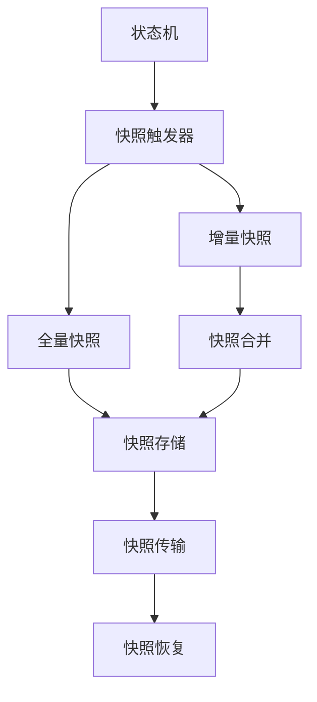
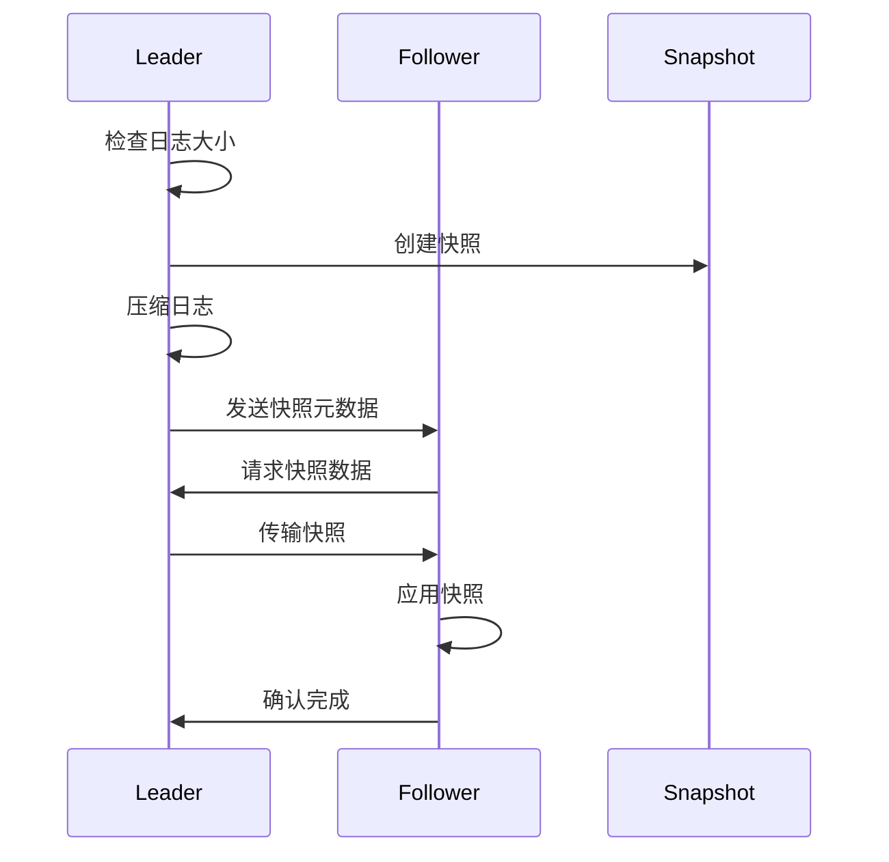

## 引言

Hashicorp Raft是一个高度优化的Raft算法实现，被广泛应用于Consul、Nomad、Vault等生产级分布式系统中。相比于标准Raft算法，Hashicorp Raft在性能、可靠性和可观测性方面做了大量优化，特别是在快照机制、日志压缩、网络优化等方面有显著改进。

本文将深入解析Hashicorp Raft的核心特性，并提供完整的Java实现示例。

## Hashicorp Raft核心特性

### 1. 增强的快照机制



### 2. 优化的日志压缩



### 3. 网络传输优化


## 核心组件详解

### 1. Raft节点实现

```java
import java.util.*;
import java.util.concurrent.*;
import java.util.concurrent.atomic.*;
import java.time.Instant;
import java.nio.ByteBuffer;
import java.util.logging.Logger;

public class HashicorpRaft {
    private static final Logger logger = Logger.getLogger(HashicorpRaft.class.getName());

    // 节点状态
    public enum NodeState {
        FOLLOWER, CANDIDATE, LEADER, SHUTDOWN
    }

    // 配置参数
    public static class Config {
        public final Duration heartbeatTimeout = Duration.ofMillis(150);
        public final Duration electionTimeout = Duration.ofMillis(300);
        public final Duration leaderLeaseTimeout = Duration.ofMillis(500);
        public final Duration commitTimeout = Duration.ofSeconds(5);
        public final int snapshotThreshold = 1024;
        public final int maxAppendEntries = 64;
        public final boolean enablePreVote = true;
        public final boolean enableLearner = true;
    }

    // 日志条目
    public static class LogEntry {
        public final long term;
        public final long index;
        public final byte[] data;
        public final EntryType type;
        public final Instant timestamp;

        public enum EntryType {
            NORMAL, CONFIGURATION, NOOP, BARRIER
        }

        public LogEntry(long term, long index, byte[] data, EntryType type) {
            this.term = term;
            this.index = index;
            this.data = data != null ? data.clone() : new byte[0];
            this.type = type;
            this.timestamp = Instant.now();
        }
    }

    // 快照元数据
    public static class SnapshotMeta {
        public final String id;
        public final long index;
        public final long term;
        public final Set<String> peers;
        public final long size;
        public final Instant timestamp;

        public SnapshotMeta(String id, long index, long term, Set<String> peers, long size) {
            this.id = id;
            this.index = index;
            this.term = term;
            this.peers = new HashSet<>(peers);
            this.size = size;
            this.timestamp = Instant.now();
        }
    }

    private final String nodeId;
    private final Config config;
    private final RaftStorage storage;
    private final Transport transport;
    private final StateMachine stateMachine;
    private final ScheduledExecutorService scheduler;

    // Raft状态
    private volatile NodeState state = NodeState.FOLLOWER;
    private volatile long currentTerm = 0;
    private volatile String votedFor = null;
    private volatile String leaderId = null;
    private volatile long commitIndex = 0;
    private volatile long lastApplied = 0;

    // Leader状态
    private final Map<String, Long> nextIndex = new ConcurrentHashMap<>();
    private final Map<String, Long> matchIndex = new ConcurrentHashMap<>();
    private final Map<String, Boolean> replicationState = new ConcurrentHashMap<>();

    // 性能统计
    private final AtomicLong totalRequests = new AtomicLong();
    private final AtomicLong successfulRequests = new AtomicLong();
    private final AtomicLong leadershipChanges = new AtomicLong();

    public HashicorpRaft(String nodeId, Config config, RaftStorage storage,
                         Transport transport, StateMachine stateMachine) {
        this.nodeId = nodeId;
        this.config = config;
        this.storage = storage;
        this.transport = transport;
        this.stateMachine = stateMachine;
        this.scheduler = Executors.newScheduledThreadPool(4);

        initializeFromStorage();
        startPeriodicTasks();
    }

    private void initializeFromStorage() {
        try {
            this.currentTerm = storage.getCurrentTerm();
            this.votedFor = storage.getVotedFor();
            this.commitIndex = storage.getCommitIndex();
            this.lastApplied = storage.getLastApplied();

            // 恢复配置
            LogEntry lastConfig = storage.getLastConfigurationEntry();
            if (lastConfig != null) {
                updateConfiguration(parseConfiguration(lastConfig.data));
            }

        } catch (Exception e) {
            logger.severe("Failed to initialize from storage: " + e.getMessage());
            throw new RuntimeException(e);
        }
    }

    // 启动周期性任务
    private void startPeriodicTasks() {
        // 选举超时检查
        scheduler.scheduleWithFixedDelay(this::checkElectionTimeout,
            50, 50, TimeUnit.MILLISECONDS);

        // 心跳发送
        scheduler.scheduleWithFixedDelay(this::sendHeartbeats,
            config.heartbeatTimeout.toMillis() / 3,
            config.heartbeatTimeout.toMillis() / 3, TimeUnit.MILLISECONDS);

        // 日志压缩
        scheduler.scheduleWithFixedDelay(this::compactLogs,
            5, 5, TimeUnit.SECONDS);

        // 性能统计
        scheduler.scheduleWithFixedDelay(this::logPerformanceMetrics,
            30, 30, TimeUnit.SECONDS);
    }
}
```

### 2. 增强的AppendEntries实现

```java
public class AppendEntriesHandler {
    private final HashicorpRaft raft;
    private final BatchProcessor batchProcessor;

    // 批量处理器
    public static class BatchProcessor {
        private final Queue<AppendEntriesRequest> pendingRequests = new ConcurrentLinkedQueue<>();
        private final ScheduledExecutorService executor = Executors.newSingleThreadScheduledExecutor();
        private volatile boolean processingBatch = false;

        public void addRequest(AppendEntriesRequest request) {
            pendingRequests.offer(request);
            if (!processingBatch) {
                scheduleProcessing();
            }
        }

        private void scheduleProcessing() {
            processingBatch = true;
            executor.schedule(() -> {
                processBatch();
                processingBatch = false;
                if (!pendingRequests.isEmpty()) {
                    scheduleProcessing();
                }
            }, 1, TimeUnit.MILLISECONDS);
        }

        private void processBatch() {
            List<AppendEntriesRequest> batch = new ArrayList<>();
            AppendEntriesRequest request;
            while ((request = pendingRequests.poll()) != null && batch.size() < 64) {
                batch.add(request);
            }

            if (!batch.isEmpty()) {
                processBatchedRequests(batch);
            }
        }

        private void processBatchedRequests(List<AppendEntriesRequest> requests) {
            // 批量处理请求以提高性能
            for (AppendEntriesRequest request : requests) {
                processAppendEntries(request);
            }
        }
    }

    // AppendEntries请求
    public static class AppendEntriesRequest {
        public final long term;
        public final String leaderId;
        public final long prevLogIndex;
        public final long prevLogTerm;
        public final List<LogEntry> entries;
        public final long leaderCommit;
        public final CompletableFuture<AppendEntriesResponse> future;

        public AppendEntriesRequest(long term, String leaderId, long prevLogIndex,
                                  long prevLogTerm, List<LogEntry> entries,
                                  long leaderCommit) {
            this.term = term;
            this.leaderId = leaderId;
            this.prevLogIndex = prevLogIndex;
            this.prevLogTerm = prevLogTerm;
            this.entries = new ArrayList<>(entries);
            this.leaderCommit = leaderCommit;
            this.future = new CompletableFuture<>();
        }
    }

    // AppendEntries响应
    public static class AppendEntriesResponse {
        public final long term;
        public final boolean success;
        public final long lastLogIndex;
        public final long conflictIndex;
        public final long conflictTerm;

        public AppendEntriesResponse(long term, boolean success, long lastLogIndex,
                                   long conflictIndex, long conflictTerm) {
            this.term = term;
            this.success = success;
            this.lastLogIndex = lastLogIndex;
            this.conflictIndex = conflictIndex;
            this.conflictTerm = conflictTerm;
        }
    }

    public AppendEntriesHandler(HashicorpRaft raft) {
        this.raft = raft;
        this.batchProcessor = new BatchProcessor();
    }

    public CompletableFuture<AppendEntriesResponse> handleAppendEntries(AppendEntriesRequest request) {
        batchProcessor.addRequest(request);
        return request.future;
    }

    private void processAppendEntries(AppendEntriesRequest request) {
        try {
            AppendEntriesResponse response = doAppendEntries(request);
            request.future.complete(response);
        } catch (Exception e) {
            request.future.completeExceptionally(e);
        }
    }

    private AppendEntriesResponse doAppendEntries(AppendEntriesRequest request) {
        // 1. 检查term
        if (request.term < raft.getCurrentTerm()) {
            return new AppendEntriesResponse(raft.getCurrentTerm(), false,
                raft.getLastLogIndex(), 0, 0);
        }

        // 2. 更新term和leader
        if (request.term > raft.getCurrentTerm()) {
            raft.setCurrentTerm(request.term);
            raft.setVotedFor(null);
            raft.becomeFollower();
        }

        raft.setLeaderId(request.leaderId);
        raft.resetElectionTimeout();

        // 3. 检查日志一致性
        if (request.prevLogIndex > 0) {
            LogEntry prevEntry = raft.getStorage().getLogEntry(request.prevLogIndex);
            if (prevEntry == null || prevEntry.term != request.prevLogTerm) {
                // 查找冲突点
                long conflictIndex = Math.min(request.prevLogIndex, raft.getLastLogIndex());
                long conflictTerm = 0;
                if (conflictIndex > 0) {
                    LogEntry conflictEntry = raft.getStorage().getLogEntry(conflictIndex);
                    if (conflictEntry != null) {
                        conflictTerm = conflictEntry.term;
                        // 查找该term的第一个条目
                        while (conflictIndex > 1) {
                            LogEntry entry = raft.getStorage().getLogEntry(conflictIndex - 1);
                            if (entry == null || entry.term != conflictTerm) {
                                break;
                            }
                            conflictIndex--;
                        }
                    }
                }

                return new AppendEntriesResponse(raft.getCurrentTerm(), false,
                    raft.getLastLogIndex(), conflictIndex, conflictTerm);
            }
        }

        // 4. 删除冲突的条目并追加新条目
        if (!request.entries.isEmpty()) {
            long appendStartIndex = request.prevLogIndex + 1;
            raft.getStorage().deleteLogEntriesFrom(appendStartIndex);

            for (LogEntry entry : request.entries) {
                raft.getStorage().appendLogEntry(entry);
            }
        }

        // 5. 更新commit index
        if (request.leaderCommit > raft.getCommitIndex()) {
            long newCommitIndex = Math.min(request.leaderCommit, raft.getLastLogIndex());
            raft.setCommitIndex(newCommitIndex);
            raft.applyLogEntries();
        }

        return new AppendEntriesResponse(raft.getCurrentTerm(), true,
            raft.getLastLogIndex(), 0, 0);
    }
}
```

### 3. 智能快照管理

```java
public class SnapshotManager {
    private final HashicorpRaft raft;
    private final SnapshotStorage snapshotStorage;
    private final ScheduledExecutorService executor;
    private volatile boolean snapshotInProgress = false;

    // 快照存储接口
    public interface SnapshotStorage {
        void saveSnapshot(SnapshotMeta meta, byte[] data) throws Exception;
        byte[] loadSnapshot(String snapshotId) throws Exception;
        List<SnapshotMeta> listSnapshots() throws Exception;
        void deleteSnapshot(String snapshotId) throws Exception;
    }

    // 快照任务
    public static class SnapshotTask {
        public final CompletableFuture<SnapshotMeta> future = new CompletableFuture<>();
        public final long index;
        public final long term;
        public final boolean forced;

        public SnapshotTask(long index, long term, boolean forced) {
            this.index = index;
            this.term = term;
            this.forced = forced;
        }
    }

    // 增量快照信息
    public static class IncrementalSnapshot {
        public final SnapshotMeta baseMeta;
        public final List<LogEntry> incrementalEntries;
        public final long newIndex;
        public final long newTerm;

        public IncrementalSnapshot(SnapshotMeta baseMeta, List<LogEntry> incrementalEntries,
                                 long newIndex, long newTerm) {
            this.baseMeta = baseMeta;
            this.incrementalEntries = new ArrayList<>(incrementalEntries);
            this.newIndex = newIndex;
            this.newTerm = newTerm;
        }
    }

    public SnapshotManager(HashicorpRaft raft, SnapshotStorage snapshotStorage) {
        this.raft = raft;
        this.snapshotStorage = snapshotStorage;
        this.executor = Executors.newSingleThreadScheduledExecutor();
    }

    // 检查是否需要创建快照
    public boolean shouldCreateSnapshot() {
        long lastSnapshotIndex = raft.getLastSnapshotIndex();
        long currentIndex = raft.getLastLogIndex();

        return (currentIndex - lastSnapshotIndex) >= raft.getConfig().snapshotThreshold;
    }

    // 异步创建快照
    public CompletableFuture<SnapshotMeta> createSnapshotAsync() {
        if (snapshotInProgress) {
            return CompletableFuture.failedFuture(
                new IllegalStateException("Snapshot already in progress"));
        }

        SnapshotTask task = new SnapshotTask(raft.getLastApplied(),
            raft.getCurrentTerm(), false);

        executor.submit(() -> performSnapshot(task));
        return task.future;
    }

    // 强制创建快照
    public CompletableFuture<SnapshotMeta> forceSnapshot() {
        SnapshotTask task = new SnapshotTask(raft.getLastApplied(),
            raft.getCurrentTerm(), true);

        executor.submit(() -> performSnapshot(task));
        return task.future;
    }

    private void performSnapshot(SnapshotTask task) {
        try {
            snapshotInProgress = true;

            // 1. 检查是否可以创建增量快照
            SnapshotMeta incrementalBase = findIncrementalBase(task.index);
            SnapshotMeta newSnapshot;

            if (incrementalBase != null && !task.forced) {
                newSnapshot = createIncrementalSnapshot(incrementalBase, task);
            } else {
                newSnapshot = createFullSnapshot(task);
            }

            // 2. 清理旧快照
            cleanupOldSnapshots();

            // 3. 压缩日志
            if (newSnapshot != null) {
                raft.getStorage().compactLogs(newSnapshot.index);
            }

            task.future.complete(newSnapshot);

        } catch (Exception e) {
            task.future.completeExceptionally(e);
        } finally {
            snapshotInProgress = false;
        }
    }

    // 查找增量快照基础
    private SnapshotMeta findIncrementalBase(long targetIndex) {
        try {
            List<SnapshotMeta> snapshots = snapshotStorage.listSnapshots();
            return snapshots.stream()
                .filter(s -> s.index <= targetIndex)
                .max(Comparator.comparing(s -> s.index))
                .orElse(null);
        } catch (Exception e) {
            logger.warning("Failed to find incremental base: " + e.getMessage());
            return null;
        }
    }

    // 创建增量快照
    private SnapshotMeta createIncrementalSnapshot(SnapshotMeta base, SnapshotTask task) {
        try {
            // 获取增量数据
            List<LogEntry> incrementalEntries = raft.getStorage()
                .getLogEntries(base.index + 1, task.index);

            if (incrementalEntries.size() > raft.getConfig().snapshotThreshold / 2) {
                // 增量太大，创建全量快照
                return createFullSnapshot(task);
            }

            // 序列化增量数据
            IncrementalSnapshot incremental = new IncrementalSnapshot(
                base, incrementalEntries, task.index, task.term);

            byte[] data = serializeIncrementalSnapshot(incremental);

            String snapshotId = generateSnapshotId(task.index, task.term, true);
            SnapshotMeta meta = new SnapshotMeta(snapshotId, task.index, task.term,
                raft.getCurrentPeers(), data.length);

            snapshotStorage.saveSnapshot(meta, data);

            logger.info(String.format("Created incremental snapshot %s (base: %s, entries: %d)",
                snapshotId, base.id, incrementalEntries.size()));

            return meta;

        } catch (Exception e) {
            logger.warning("Failed to create incremental snapshot: " + e.getMessage());
            return createFullSnapshot(task);
        }
    }

    // 创建全量快照
    private SnapshotMeta createFullSnapshot(SnapshotTask task) {
        try {
            // 获取状态机快照
            byte[] stateMachineData = raft.getStateMachine().createSnapshot();

            // 获取配置信息
            Set<String> peers = raft.getCurrentPeers();

            // 创建快照数据
            FullSnapshot fullSnapshot = new FullSnapshot(stateMachineData, peers,
                task.index, task.term);

            byte[] data = serializeFullSnapshot(fullSnapshot);

            String snapshotId = generateSnapshotId(task.index, task.term, false);
            SnapshotMeta meta = new SnapshotMeta(snapshotId, task.index, task.term,
                peers, data.length);

            snapshotStorage.saveSnapshot(meta, data);

            logger.info(String.format("Created full snapshot %s (size: %d bytes)",
                snapshotId, data.length));

            return meta;

        } catch (Exception e) {
            logger.severe("Failed to create full snapshot: " + e.getMessage());
            throw new RuntimeException(e);
        }
    }

    // 清理旧快照
    private void cleanupOldSnapshots() {
        try {
            List<SnapshotMeta> snapshots = snapshotStorage.listSnapshots();

            // 保留最新的3个快照
            snapshots.stream()
                .sorted(Comparator.comparing((SnapshotMeta s) -> s.index).reversed())
                .skip(3)
                .forEach(snapshot -> {
                    try {
                        snapshotStorage.deleteSnapshot(snapshot.id);
                        logger.info("Deleted old snapshot: " + snapshot.id);
                    } catch (Exception e) {
                        logger.warning("Failed to delete snapshot " + snapshot.id + ": " + e.getMessage());
                    }
                });

        } catch (Exception e) {
            logger.warning("Failed to cleanup old snapshots: " + e.getMessage());
        }
    }

    // 恢复快照
    public void restoreSnapshot(SnapshotMeta meta) {
        try {
            byte[] data = snapshotStorage.loadSnapshot(meta.id);

            if (meta.id.contains("incremental")) {
                restoreIncrementalSnapshot(data, meta);
            } else {
                restoreFullSnapshot(data, meta);
            }

            raft.setLastSnapshotIndex(meta.index);
            raft.setLastSnapshotTerm(meta.term);

            logger.info("Successfully restored snapshot: " + meta.id);

        } catch (Exception e) {
            logger.severe("Failed to restore snapshot " + meta.id + ": " + e.getMessage());
            throw new RuntimeException(e);
        }
    }

    private void restoreIncrementalSnapshot(byte[] data, SnapshotMeta meta) throws Exception {
        IncrementalSnapshot incremental = deserializeIncrementalSnapshot(data);

        // 1. 恢复基础快照
        restoreSnapshot(incremental.baseMeta);

        // 2. 应用增量数据
        for (LogEntry entry : incremental.incrementalEntries) {
            raft.getStateMachine().apply(entry);
        }
    }

    private void restoreFullSnapshot(byte[] data, SnapshotMeta meta) throws Exception {
        FullSnapshot fullSnapshot = deserializeFullSnapshot(data);

        // 恢复状态机
        raft.getStateMachine().restoreSnapshot(fullSnapshot.stateMachineData);

        // 更新配置
        raft.updateConfiguration(fullSnapshot.peers);
    }

    // 序列化和反序列化方法
    private byte[] serializeIncrementalSnapshot(IncrementalSnapshot snapshot) {
        // 实现序列化逻辑
        ByteBuffer buffer = ByteBuffer.allocate(8192);
        // ... 序列化实现
        return buffer.array();
    }

    private IncrementalSnapshot deserializeIncrementalSnapshot(byte[] data) {
        // 实现反序列化逻辑
        ByteBuffer buffer = ByteBuffer.wrap(data);
        // ... 反序列化实现
        return null; // 示例返回
    }

    private byte[] serializeFullSnapshot(FullSnapshot snapshot) {
        // 实现序列化逻辑
        return new byte[0]; // 示例返回
    }

    private FullSnapshot deserializeFullSnapshot(byte[] data) {
        // 实现反序列化逻辑
        return null; // 示例返回
    }

    private String generateSnapshotId(long index, long term, boolean incremental) {
        String type = incremental ? "incremental" : "full";
        return String.format("%s_%d_%d_%d", type, index, term, System.currentTimeMillis());
    }

    // 全量快照数据结构
    private static class FullSnapshot {
        public final byte[] stateMachineData;
        public final Set<String> peers;
        public final long index;
        public final long term;

        public FullSnapshot(byte[] stateMachineData, Set<String> peers, long index, long term) {
            this.stateMachineData = stateMachineData.clone();
            this.peers = new HashSet<>(peers);
            this.index = index;
            this.term = term;
        }
    }
}
```

### 4. 网络传输优化

```java
public class OptimizedTransport {
    private final String nodeId;
    private final Map<String, Connection> connections = new ConcurrentHashMap<>();
    private final ScheduledExecutorService executor;
    private final ByteBuffer sendBuffer = ByteBuffer.allocateDirect(64 * 1024);
    private final ByteBuffer receiveBuffer = ByteBuffer.allocateDirect(64 * 1024);

    // 连接对象
    public static class Connection {
        public final String peerId;
        public final SocketChannel channel;
        public final AtomicLong lastUsed = new AtomicLong(System.currentTimeMillis());
        public final Queue<Message> sendQueue = new ConcurrentLinkedQueue<>();
        public final AtomicBoolean sending = new AtomicBoolean(false);

        public Connection(String peerId, SocketChannel channel) {
            this.peerId = peerId;
            this.channel = channel;
        }
    }

    // 消息类型
    public static class Message {
        public final MessageType type;
        public final byte[] payload;
        public final CompletableFuture<byte[]> response;

        public enum MessageType {
            APPEND_ENTRIES, REQUEST_VOTE, INSTALL_SNAPSHOT, HEARTBEAT
        }

        public Message(MessageType type, byte[] payload) {
            this.type = type;
            this.payload = payload.clone();
            this.response = new CompletableFuture<>();
        }
    }

    // 批量发送器
    public static class BatchSender {
        private final Queue<Message> batchQueue = new ConcurrentLinkedQueue<>();
        private final ScheduledExecutorService batchExecutor;
        private volatile boolean batchInProgress = false;

        public BatchSender() {
            this.batchExecutor = Executors.newSingleThreadScheduledExecutor();
            startBatchProcessing();
        }

        public void addMessage(Message message) {
            batchQueue.offer(message);
        }

        private void startBatchProcessing() {
            batchExecutor.scheduleWithFixedDelay(() -> {
                if (!batchInProgress && !batchQueue.isEmpty()) {
                    processBatch();
                }
            }, 1, 1, TimeUnit.MILLISECONDS);
        }

        private void processBatch() {
            batchInProgress = true;
            try {
                List<Message> batch = new ArrayList<>();
                Message message;
                while ((message = batchQueue.poll()) != null && batch.size() < 32) {
                    batch.add(message);
                }

                if (!batch.isEmpty()) {
                    sendBatch(batch);
                }
            } finally {
                batchInProgress = false;
            }
        }

        private void sendBatch(List<Message> messages) {
            // 批量发送消息
            for (Message message : messages) {
                // 实际发送逻辑
                try {
                    sendMessage(message);
                } catch (Exception e) {
                    message.response.completeExceptionally(e);
                }
            }
        }

        private void sendMessage(Message message) throws Exception {
            // 实现消息发送逻辑
        }
    }

    // 压缩器
    public static class MessageCompressor {
        public static byte[] compress(byte[] data) {
            if (data.length < 1024) {
                return data; // 小消息不压缩
            }

            try {
                ByteArrayOutputStream baos = new ByteArrayOutputStream();
                try (java.util.zip.GZIPOutputStream gzos = new java.util.zip.GZIPOutputStream(baos)) {
                    gzos.write(data);
                    gzos.finish();
                }
                return baos.toByteArray();
            } catch (Exception e) {
                return data; // 压缩失败返回原数据
            }
        }

        public static byte[] decompress(byte[] compressedData) {
            try {
                ByteArrayInputStream bais = new ByteArrayInputStream(compressedData);
                try (java.util.zip.GZIPInputStream gzis = new java.util.zip.GZIPInputStream(bais);
                     ByteArrayOutputStream baos = new ByteArrayOutputStream()) {

                    byte[] buffer = new byte[4096];
                    int bytesRead;
                    while ((bytesRead = gzis.read(buffer)) != -1) {
                        baos.write(buffer, 0, bytesRead);
                    }
                    return baos.toByteArray();
                }
            } catch (Exception e) {
                return compressedData; // 解压缩失败返回原数据
            }
        }
    }

    public OptimizedTransport(String nodeId) {
        this.nodeId = nodeId;
        this.executor = Executors.newScheduledThreadPool(4);
        startConnectionMaintenance();
    }

    // 发送AppendEntries请求（带优化）
    public CompletableFuture<AppendEntriesResponse> sendAppendEntries(
            String peerId, AppendEntriesRequest request) {

        return CompletableFuture.supplyAsync(() -> {
            try {
                // 1. 获取或创建连接
                Connection conn = getOrCreateConnection(peerId);

                // 2. 序列化请求
                byte[] payload = serializeAppendEntries(request);

                // 3. 压缩消息
                byte[] compressedPayload = MessageCompressor.compress(payload);

                // 4. 创建消息
                Message message = new Message(Message.MessageType.APPEND_ENTRIES, compressedPayload);

                // 5. 发送消息
                sendMessage(conn, message);

                // 6. 等待响应
                byte[] responseData = message.response.get(5, TimeUnit.SECONDS);

                // 7. 解压并反序列化响应
                byte[] decompressed = MessageCompressor.decompress(responseData);
                return deserializeAppendEntriesResponse(decompressed);

            } catch (Exception e) {
                throw new RuntimeException("Failed to send AppendEntries", e);
            }
        }, executor);
    }

    // 获取或创建连接
    private Connection getOrCreateConnection(String peerId) throws Exception {
        return connections.computeIfAbsent(peerId, id -> {
            try {
                SocketChannel channel = SocketChannel.open();
                channel.configureBlocking(false);
                channel.connect(new InetSocketAddress(getPeerAddress(id), getPeerPort(id)));

                // 等待连接完成
                while (!channel.finishConnect()) {
                    Thread.sleep(10);
                }

                return new Connection(id, channel);
            } catch (Exception e) {
                throw new RuntimeException("Failed to create connection to " + id, e);
            }
        });
    }

    // 异步发送消息
    private void sendMessage(Connection conn, Message message) {
        conn.sendQueue.offer(message);

        if (conn.sending.compareAndSet(false, true)) {
            executor.submit(() -> {
                try {
                    processMessageQueue(conn);
                } finally {
                    conn.sending.set(false);
                }
            });
        }
    }

    // 处理消息队列
    private void processMessageQueue(Connection conn) {
        while (!conn.sendQueue.isEmpty()) {
            Message message = conn.sendQueue.poll();
            if (message != null) {
                try {
                    sendMessageDirectly(conn, message);
                    conn.lastUsed.set(System.currentTimeMillis());
                } catch (Exception e) {
                    message.response.completeExceptionally(e);
                }
            }
        }
    }

    // 直接发送消息
    private void sendMessageDirectly(Connection conn, Message message) throws Exception {
        // 构造消息头
        synchronized (sendBuffer) {
            sendBuffer.clear();
            sendBuffer.putInt(message.type.ordinal());
            sendBuffer.putInt(message.payload.length);
            sendBuffer.put(message.payload);
            sendBuffer.flip();

            // 写入通道
            while (sendBuffer.hasRemaining()) {
                conn.channel.write(sendBuffer);
            }
        }

        // 异步等待响应
        executor.submit(() -> {
            try {
                byte[] response = readResponse(conn);
                message.response.complete(response);
            } catch (Exception e) {
                message.response.completeExceptionally(e);
            }
        });
    }

    // 读取响应
    private byte[] readResponse(Connection conn) throws Exception {
        synchronized (receiveBuffer) {
            receiveBuffer.clear();

            // 读取消息头
            while (receiveBuffer.position() < 8) {
                int bytesRead = conn.channel.read(receiveBuffer);
                if (bytesRead == -1) {
                    throw new IOException("Connection closed");
                }
                if (bytesRead == 0) {
                    Thread.sleep(1);
                }
            }

            receiveBuffer.flip();
            int messageType = receiveBuffer.getInt();
            int payloadLength = receiveBuffer.getInt();

            // 读取消息体
            byte[] payload = new byte[payloadLength];
            ByteBuffer payloadBuffer = ByteBuffer.wrap(payload);

            while (payloadBuffer.hasRemaining()) {
                int bytesRead = conn.channel.read(payloadBuffer);
                if (bytesRead == -1) {
                    throw new IOException("Connection closed");
                }
                if (bytesRead == 0) {
                    Thread.sleep(1);
                }
            }

            return payload;
        }
    }

    // 连接维护
    private void startConnectionMaintenance() {
        executor.scheduleWithFixedDelay(() -> {
            long now = System.currentTimeMillis();
            connections.entrySet().removeIf(entry -> {
                Connection conn = entry.getValue();
                if (now - conn.lastUsed.get() > 300000) { // 5分钟超时
                    try {
                        conn.channel.close();
                    } catch (Exception e) {
                        // 忽略关闭错误
                    }
                    return true;
                }
                return false;
            });
        }, 60, 60, TimeUnit.SECONDS);
    }

    // 序列化和反序列化方法
    private byte[] serializeAppendEntries(AppendEntriesRequest request) {
        // 实现序列化
        return new byte[0];
    }

    private AppendEntriesResponse deserializeAppendEntriesResponse(byte[] data) {
        // 实现反序列化
        return null;
    }

    private String getPeerAddress(String peerId) {
        // 获取节点地址
        return "localhost";
    }

    private int getPeerPort(String peerId) {
        // 获取节点端口
        return 8080;
    }
}
```

## 性能测试与比较

```java
public class HashicorpRaftBenchmark {

    public static void main(String[] args) throws Exception {
        // 性能测试
        runThroughputTest();
        runLatencyTest();
        runScalabilityTest();
        runSnapshotPerformanceTest();
    }

    // 吞吐量测试
    private static void runThroughputTest() throws Exception {
        System.out.println("=== Hashicorp Raft吞吐量测试 ===");

        // 创建3节点集群
        List<HashicorpRaft> cluster = createCluster(3);
        HashicorpRaft leader = electLeader(cluster);

        int requestCount = 10000;
        byte[] testData = "test data".getBytes();

        long startTime = System.currentTimeMillis();

        List<CompletableFuture<Boolean>> futures = new ArrayList<>();
        for (int i = 0; i < requestCount; i++) {
            futures.add(leader.propose(testData));
        }

        // 等待所有请求完成
        CompletableFuture.allOf(futures.toArray(new CompletableFuture[0])).join();

        long endTime = System.currentTimeMillis();
        long duration = endTime - startTime;

        double throughput = (double) requestCount / duration * 1000;
        System.out.printf("请求总数: %d\n", requestCount);
        System.out.printf("总耗时: %d ms\n", duration);
        System.out.printf("吞吐量: %.2f requests/sec\n", throughput);

        shutdownCluster(cluster);
    }

    // 延迟测试
    private static void runLatencyTest() throws Exception {
        System.out.println("\n=== Hashicorp Raft延迟测试 ===");

        List<HashicorpRaft> cluster = createCluster(3);
        HashicorpRaft leader = electLeader(cluster);

        int requestCount = 1000;
        byte[] testData = "test data".getBytes();
        List<Long> latencies = new ArrayList<>();

        for (int i = 0; i < requestCount; i++) {
            long startTime = System.nanoTime();
            leader.propose(testData).join();
            long endTime = System.nanoTime();

            latencies.add((endTime - startTime) / 1_000_000); // 转换为毫秒
        }

        Collections.sort(latencies);

        double avgLatency = latencies.stream().mapToLong(Long::longValue).average().orElse(0);
        long p50Latency = latencies.get(latencies.size() / 2);
        long p95Latency = latencies.get((int) (latencies.size() * 0.95));
        long p99Latency = latencies.get((int) (latencies.size() * 0.99));

        System.out.printf("平均延迟: %.2f ms\n", avgLatency);
        System.out.printf("P50延迟: %d ms\n", p50Latency);
        System.out.printf("P95延迟: %d ms\n", p95Latency);
        System.out.printf("P99延迟: %d ms\n", p99Latency);

        shutdownCluster(cluster);
    }

    // 可扩展性测试
    private static void runScalabilityTest() throws Exception {
        System.out.println("\n=== Hashicorp Raft可扩展性测试 ===");

        int[] clusterSizes = {3, 5, 7, 9};
        int requestCount = 1000;
        byte[] testData = "test data".getBytes();

        for (int size : clusterSizes) {
            List<HashicorpRaft> cluster = createCluster(size);
            HashicorpRaft leader = electLeader(cluster);

            long startTime = System.currentTimeMillis();

            List<CompletableFuture<Boolean>> futures = new ArrayList<>();
            for (int i = 0; i < requestCount; i++) {
                futures.add(leader.propose(testData));
            }

            CompletableFuture.allOf(futures.toArray(new CompletableFuture[0])).join();

            long endTime = System.currentTimeMillis();
            long duration = endTime - startTime;
            double throughput = (double) requestCount / duration * 1000;

            System.out.printf("集群大小: %d, 吞吐量: %.2f requests/sec\n", size, throughput);

            shutdownCluster(cluster);
        }
    }

    // 快照性能测试
    private static void runSnapshotPerformanceTest() throws Exception {
        System.out.println("\n=== Hashicorp Raft快照性能测试 ===");

        List<HashicorpRaft> cluster = createCluster(3);
        HashicorpRaft leader = electLeader(cluster);

        // 生成大量数据
        int dataCount = 10000;
        byte[] testData = new byte[1024]; // 1KB数据
        new Random().nextBytes(testData);

        System.out.println("生成测试数据...");
        List<CompletableFuture<Boolean>> futures = new ArrayList<>();
        for (int i = 0; i < dataCount; i++) {
            futures.add(leader.propose(testData));
        }
        CompletableFuture.allOf(futures.toArray(new CompletableFuture[0])).join();

        // 测试全量快照
        System.out.println("测试全量快照性能...");
        long startTime = System.currentTimeMillis();
        leader.getSnapshotManager().forceSnapshot().join();
        long fullSnapshotTime = System.currentTimeMillis() - startTime;

        // 添加更多数据
        for (int i = 0; i < 1000; i++) {
            leader.propose(testData).join();
        }

        // 测试增量快照
        System.out.println("测试增量快照性能...");
        startTime = System.currentTimeMillis();
        leader.getSnapshotManager().createSnapshotAsync().join();
        long incrementalSnapshotTime = System.currentTimeMillis() - startTime;

        System.out.printf("全量快照耗时: %d ms\n", fullSnapshotTime);
        System.out.printf("增量快照耗时: %d ms\n", incrementalSnapshotTime);
        System.out.printf("增量快照性能提升: %.2fx\n",
            (double) fullSnapshotTime / incrementalSnapshotTime);

        shutdownCluster(cluster);
    }

    // 辅助方法
    private static List<HashicorpRaft> createCluster(int size) {
        List<HashicorpRaft> cluster = new ArrayList<>();

        for (int i = 0; i < size; i++) {
            String nodeId = "node" + i;
            HashicorpRaft.Config config = new HashicorpRaft.Config();
            RaftStorage storage = new InMemoryRaftStorage();
            Transport transport = new OptimizedTransport(nodeId);
            StateMachine stateMachine = new TestStateMachine();

            HashicorpRaft node = new HashicorpRaft(nodeId, config, storage, transport, stateMachine);
            cluster.add(node);
        }

        return cluster;
    }

    private static HashicorpRaft electLeader(List<HashicorpRaft> cluster) throws Exception {
        // 启动所有节点
        for (HashicorpRaft node : cluster) {
            node.start();
        }

        // 等待leader选举
        Thread.sleep(1000);

        return cluster.stream()
            .filter(node -> node.getState() == HashicorpRaft.NodeState.LEADER)
            .findFirst()
            .orElseThrow(() -> new IllegalStateException("No leader elected"));
    }

    private static void shutdownCluster(List<HashicorpRaft> cluster) {
        for (HashicorpRaft node : cluster) {
            node.shutdown();
        }
    }

    // 测试状态机
    private static class TestStateMachine implements StateMachine {
        private final AtomicLong counter = new AtomicLong(0);

        @Override
        public void apply(LogEntry entry) {
            counter.incrementAndGet();
        }

        @Override
        public byte[] createSnapshot() {
            return ByteBuffer.allocate(8).putLong(counter.get()).array();
        }

        @Override
        public void restoreSnapshot(byte[] snapshot) {
            counter.set(ByteBuffer.wrap(snapshot).getLong());
        }
    }
}
```

## 实际应用场景

### 1. 分布式配置管理

```java
public class DistributedConfigManager {
    private final HashicorpRaft raft;
    private final Map<String, String> configStore = new ConcurrentHashMap<>();

    public DistributedConfigManager(HashicorpRaft raft) {
        this.raft = raft;
    }

    // 设置配置
    public CompletableFuture<Boolean> setConfig(String key, String value) {
        ConfigOperation op = new ConfigOperation(ConfigOperation.Type.SET, key, value);
        byte[] data = serializeOperation(op);
        return raft.propose(data);
    }

    // 获取配置
    public String getConfig(String key) {
        return configStore.get(key);
    }

    // 删除配置
    public CompletableFuture<Boolean> deleteConfig(String key) {
        ConfigOperation op = new ConfigOperation(ConfigOperation.Type.DELETE, key, null);
        byte[] data = serializeOperation(op);
        return raft.propose(data);
    }

    private static class ConfigOperation {
        enum Type { SET, DELETE }

        public final Type type;
        public final String key;
        public final String value;

        public ConfigOperation(Type type, String key, String value) {
            this.type = type;
            this.key = key;
            this.value = value;
        }
    }

    private byte[] serializeOperation(ConfigOperation op) {
        // 序列化操作
        return new byte[0];
    }
}
```

### 2. 分布式锁服务

```java
public class DistributedLockService {
    private final HashicorpRaft raft;
    private final Map<String, LockInfo> locks = new ConcurrentHashMap<>();

    public static class LockInfo {
        public final String owner;
        public final long acquiredTime;
        public final long ttl;

        public LockInfo(String owner, long acquiredTime, long ttl) {
            this.owner = owner;
            this.acquiredTime = acquiredTime;
            this.ttl = ttl;
        }

        public boolean isExpired() {
            return System.currentTimeMillis() > acquiredTime + ttl;
        }
    }

    public DistributedLockService(HashicorpRaft raft) {
        this.raft = raft;
        startLockCleaner();
    }

    // 获取锁
    public CompletableFuture<Boolean> acquireLock(String lockName, String owner, long ttl) {
        LockOperation op = new LockOperation(LockOperation.Type.ACQUIRE, lockName, owner, ttl);
        byte[] data = serializeLockOperation(op);
        return raft.propose(data);
    }

    // 释放锁
    public CompletableFuture<Boolean> releaseLock(String lockName, String owner) {
        LockOperation op = new LockOperation(LockOperation.Type.RELEASE, lockName, owner, 0);
        byte[] data = serializeLockOperation(op);
        return raft.propose(data);
    }

    // 检查锁状态
    public boolean isLocked(String lockName) {
        LockInfo lock = locks.get(lockName);
        return lock != null && !lock.isExpired();
    }

    private void startLockCleaner() {
        ScheduledExecutorService cleaner = Executors.newSingleThreadScheduledExecutor();
        cleaner.scheduleWithFixedDelay(() -> {
            locks.entrySet().removeIf(entry -> entry.getValue().isExpired());
        }, 1, 1, TimeUnit.SECONDS);
    }

    private static class LockOperation {
        enum Type { ACQUIRE, RELEASE }

        public final Type type;
        public final String lockName;
        public final String owner;
        public final long ttl;

        public LockOperation(Type type, String lockName, String owner, long ttl) {
            this.type = type;
            this.lockName = lockName;
            this.owner = owner;
            this.ttl = ttl;
        }
    }

    private byte[] serializeLockOperation(LockOperation op) {
        // 序列化操作
        return new byte[0];
    }
}
```

## 总结

Hashicorp Raft作为一个生产级的Raft实现，在以下方面有显著优势：

### 性能优化
- **批量处理**: 提高消息处理吞吐量
- **管道化传输**: 减少网络延迟
- **智能快照**: 增量快照减少IO开销
- **连接复用**: 减少连接建立开销

### 可靠性增强
- **Pre-Vote机制**: 避免不必要的选举
- **Learner节点**: 支持只读副本
- **配置变更**: 安全的集群成员变更
- **故障检测**: 快速检测和处理节点故障

### 可观测性
- **丰富的指标**: 延迟、吞吐量、选举次数等
- **日志记录**: 详细的操作日志
- **健康检查**: 节点和集群健康状态
- **调试工具**: 便于问题诊断

Hashicorp Raft已经在Consul、Nomad、Vault等大规模生产环境中得到验证，是构建分布式系统的可靠选择。通过合理的配置和优化，可以在保证一致性的同时获得优异的性能表现。