三阶段提交协议（Three-Phase Commit Protocol，简称3PC）是对二阶段提交协议的重要改进，由Dale Skeen在1981年提出。3PC的核心目标是解决2PC的阻塞问题，通过引入额外的预提交阶段，使得系统在面对协调者故障时能够继续运行，避免无限期等待。

## 🎯 3PC协议概述

### 📝 设计初衷与改进目标

#### 🚀 3PC的诞生背景

##### ❌ 2PC存在的核心问题

**阻塞问题（Blocking Problem）**：
- 协调者在第二阶段故障时，参与者可能无限期阻塞
- 已经投票YES的参与者无法确定最终决策
- 资源被长时间锁定，严重影响系统可用性

**具体场景**：
```
时间线分析：
T1: 协调者发送Prepare，所有参与者回复YES
T2: 协调者决定COMMIT，开始发送Commit消息
T3: 协调者在发送过程中崩溃
T4: 部分参与者收到Commit，部分未收到
结果: 系统状态不一致，未收到的参与者永久阻塞
```

##### ✅ 3PC的解决思路

**核心改进策略**：
1. **增加预提交阶段**：在准备和提交之间插入预提交阶段
2. **引入超时机制**：每个阶段都有明确的超时处理
3. **非阻塞设计**：参与者能够在协调者故障时自主决策
4. **状态机优化**：更精细的状态转换控制

**理论基础**：
- 基于**FLP不可能定理**的深入理解
- 引入**故障检测器**概念
- 采用**最终同步**模型假设

## 🏗️ 3PC协议架构设计

### 🎯 核心设计理念

#### 🌟 设计思想与目标

- 🚫 **消除阻塞**：通过引入预提交阶段和超时机制，彻底解决2PC的参与者阻塞问题
- 🔄 **提高可用性**：即使协调者故障，系统仍能继续运行，不会无限期等待
- 🛡️ **增强容错**：分阶段确认机制减少失败概率，提升事务成功率

### 🏛️ 系统架构总览

#### 🎯 协调者层（Transaction Coordinator）

- 事务管理器
- 状态跟踪器
- 超时控制器
- 故障检测器

#### 🎲 参与者层（Resource Managers）

- 本地事务管理
- 资源锁控制
- 日志记录
- 恢复机制

#### 核心特性

- 🔗 **分布式协调**：通过三阶段协议实现跨节点的事务协调
- ⏰ **超时机制**：每个阶段都有超时设置，避免无限等待
- 🔄 **自动恢复**：参与者可根据状态自主决策提交或中止

### 🎭 核心组件详解

#### 🎯 协调者（Transaction Coordinator）

##### 📋 核心职责

- **事务初始化**：创建全局事务ID，准备三阶段流程
- **阶段协调**：依次执行CanCommit、PreCommit、DoCommit三个阶段
- **决策制定**：根据参与者响应决定事务最终结果
- **故障处理**：处理网络分区、节点故障等异常情况

##### 🔧 核心模块

- **状态管理器**：跟踪事务状态变化
- **超时控制器**：管理各阶段超时设置
- **消息路由器**：处理与参与者的通信
- **恢复引擎**：协调者重启后的状态恢复

#### 🎲 参与者（Resource Manager）

##### 📋 核心职责

- **资源评估**：在CanCommit阶段评估本地资源可用性
- **事务执行**：在PreCommit阶段执行本地事务操作
- **状态维护**：维护本地事务状态和日志
- **自主决策**：在协调者故障时能够自主判断和恢复

##### 🔧 核心模块

- **资源管理器**：管理本地数据库资源
- **事务引擎**：执行本地事务操作
- **日志系统**：记录事务状态变化
- **故障检测器**：检测协调者故障状态

### 🔄 三阶段详细设计

#### 1. CanCommit（询问阶段）

**🎯 目标**：确认所有参与者是否具备执行事务的能力

**执行流程**：

1. **协调者**：发送 CanCommit? 询问
   - 检查事务参数、评估系统负载

2. **参与者**：评估本地资源
   - 检查锁状态、内存、磁盘空间等

3. **参与者**：返回 Yes/No 响应
   - 根据评估结果回复协调者

**阶段特征**：

- ⚡ **轻量级检查**：不执行实际事务操作
- 🚫 **无资源锁定**：仅做可行性评估
- ⏰ **超时保护**：避免长时间等待响应

#### 2. PreCommit（预提交阶段）

**🎯 目标**：执行事务操作但不最终提交，为提交做准备

**执行流程**：

1. **协调者**：发送 PreCommit 指令
   - 基于第一阶段结果决定继续或中止

2. **参与者**：执行事务操作
   - 写入数据、加锁、记录Undo/Redo日志

3. **参与者**：返回 ACK 确认
   - 确认事务操作执行完成

**阶段特征**：

- 🔒 **资源锁定**：锁定相关资源但不释放
- 📝 **日志记录**：记录完整的事务操作日志
- 🔄 **可撤销**：操作可以通过日志回滚

#### 3. DoCommit（最终提交阶段）

**🎯 目标**：最终提交或中止事务，释放所有资源

**执行流程**：

1. **协调者**：发送 DoCommit/DoAbort
   - 基于第二阶段结果做最终决策

2. **参与者**：提交或回滚事务
   - 释放锁、清理日志、更新状态

3. **参与者**：返回最终状态
   - 确认事务完成或中止

**阶段特征**：

- 🏁 **最终决策**：不可逆的提交或中止操作
- 🔓 **资源释放**：释放所有锁定的资源
- 🗑️ **清理工作**：清理临时数据和日志

### 🔄 状态机详细设计

#### 🎯 协调者状态机

状态转换流程：
```
INITIAL → WAIT_CAN_COMMIT → WAIT_PRE_COMMIT → COMMITTED
```

状态说明：
- **INITIAL**：初始状态，准备启动三阶段协议
- **WAIT_CAN_COMMIT**：等待所有参与者的CanCommit响应
- **WAIT_PRE_COMMIT**：等待所有参与者的PreCommit确认
- **COMMITTED**：事务成功提交或中止

异常转换：
- 任一阶段收到NO/超时 → **ABORTED**

#### 🎲 参与者状态机

状态转换流程：
```
INITIAL → UNCERTAIN → PREPARED → COMMITTED
```

状态说明：
- **INITIAL**：等待协调者的指令
- **UNCERTAIN**：已响应CanCommit，等待PreCommit指令
- **PREPARED**：已执行事务操作，等待最终指令
- **COMMITTED**：事务最终完成

#### 🔄 自动提交规则

在**PREPARED**状态下，如果超时未收到DoCommit指令，参与者将**自动提交**事务，这是3PC解决阻塞问题的关键机制。

### ⚡ 核心优势与创新

#### 🚫 非阻塞设计

通过引入PreCommit阶段和超时自动提交机制，彻底解决了2PC的参与者阻塞问题

- 参与者在PREPARED状态可自主决策
- 协调者故障不会导致无限等待
- 系统整体可用性显著提升

#### 🛡️ 增强容错性

分阶段确认机制减少了事务失败的概率，提高了系统的鲁棒性

- CanCommit阶段预先过滤不可行的事务
- 降低PreCommit阶段的失败率
- 减少资源浪费和回滚开销

#### 🔄 智能恢复

基于状态和超时的智能恢复机制，确保系统在各种故障场景下的正确性

- 状态驱动的恢复逻辑
- 协调者选举和接管机制
- 数据一致性保证

### 📊 3PC vs 2PC 深度对比

| 对比维度 | 2PC | 3PC |
|---------|-----|-----|
| 协议复杂度 | 简单 ★★★★☆ | 较复杂 ★★★☆☆ |
| 阻塞风险 | 高风险 ★★☆☆☆ | 低风险 ★★★★☆ |
| 故障恢复 | 被动等待 ★★☆☆☆ | 主动恢复 ★★★★★ |
| 网络开销 | 较低 ★★★★☆ | 较高 ★★★☆☆ |
| 性能延迟 | 较低 ★★★★☆ | 较高 ★★★☆☆ |
| 系统可用性 | 一般 ★★★☆☆ | 优秀 ★★★★★ |

#### 💡 选择建议

**适合2PC的场景**：网络稳定、对性能要求高、故障率低的环境

**适合3PC的场景**：高可用性要求、复杂分布式环境、容错性优先的系统
## 🔬 3PC协议详细流程

### 📋 三阶段完整执行流程

#### 第一阶段：CanCommit（询问阶段）

**🎯 目标**：确定所有参与者是否具备提交能力

**协调者行为**：
1. 向所有参与者发送 `CanCommit?` 查询
2. 等待所有参与者响应
3. 设置超时机制（通常15-30秒）

**参与者行为**：
1. 检查本地资源状态和约束条件
2. 评估事务提交的可行性
3. 回复 `Yes` 或 `No`，不执行实际操作
4. 进入 `CAN_COMMIT` 状态

**关键特点**：
- 不锁定任何资源
- 仅进行可行性检查
- 快速响应，降低系统延迟

#### 第二阶段：PreCommit（预提交阶段）

**🎯 目标**：让所有参与者进入预提交状态，为最终提交做准备

**如果第一阶段全部回复Yes**：
- 协调者发送 `PreCommit` 指令
- 参与者执行事务操作并锁定资源
- 参与者回复 `Ack`，进入 `PRE_COMMIT` 状态

**如果第一阶段有No回复或超时**：
- 协调者发送 `Abort` 指令
- 参与者直接中止，进入 `ABORT` 状态

**超时处理**：
- 参与者等待PreCommit超时后，自动中止事务

#### 第三阶段：DoCommit（执行阶段）

**🎯 目标**：执行最终的提交或中止操作

**如果第二阶段全部成功**：
- 协调者发送 `DoCommit` 指令
- 参与者提交事务，释放锁
- 参与者回复 `Ack`，进入 `COMMIT` 状态

**如果第二阶段失败**：
- 协调者发送 `Abort` 指令
- 参与者回滚事务，释放锁
- 参与者回复 `Ack`，进入 `ABORT` 状态

**超时处理**：
- 参与者等待DoCommit超时后，**自动提交事务**（关键改进！）

### 🎬 成功场景：完整提交流程
✅ 场景一：3PC成功提交流程

T1

🔍 第一阶段：CanCommit（询问阶段）

协调者向所有参与者询问提交可行性：

**🔄 消息格式**：
```
Message: CAN_COMMIT?
TransactionID: TXN_3PC_001
Query: "Can you commit this transaction?"
RequireResponse: true
```

**🔍 参与者检查项**：
- ✅ 资源可用性（内存、存储空间）
- ✅ 约束条件验证（业务规则）
- ✅ 系统负载状态（当前压力）
- ✅ 数据完整性检查

**⚡ 关键特点**：
- **无需锁定资源**（这是与2PC的重要区别）
- 快速响应，通常在50ms内完成
- 仅做可行性评估，不执行实际操作

T2

🗳️ 参与者响应CanCommit

各参与者快速评估并响应：
- **DB1**: 检查约束和资源 → 回复 `YES`
- **DB2**: 验证数据完整性 → 回复 `YES`
- **DB3**: 确认存储空间 → 回复 `YES`

```
响应时间：通常 < 50ms（无实际操作）
系统状态：所有参与者进入 CAN_COMMIT 状态
```

T3

📤 第二阶段：PreCommit（预提交）指令

协调者收到全部YES响应后，发送预提交指令：

**🔄 消息格式**：
```
Message: PRE_COMMIT
TransactionID: TXN_3PC_001
Instruction: "Prepare to commit - lock resources"
Timeout: 30 seconds
```

**🧠 协调者决策逻辑**：
```java
// 根据第一阶段的投票结果决定下一步操作
if (allParticipantsVotedYes()) {
    // 所有参与者都同意，发送预提交指令
    sendPreCommitToAllParticipants();
    setCoordinatorState(State.PRE_COMMIT_SENT);
} else {
    // 有参与者拒绝，直接中止事务
    sendAbortToAllParticipants();
    setCoordinatorState(State.ABORTED);
}
```

**📝 预提交阶段说明**：
- 参与者接到PreCommit后，进行**实际的事务操作**
- 锁定所需资源，执行业务逻辑
- 但**暂不释放锁**，等待最终提交指令
- 如果超时未收到DoCommit，自动提交（这是3PC的关键改进）

T4

🔄 参与者执行PreCommit

各参与者执行实际的事务操作：
- **DB1**: 执行SQL，写redo/undo日志，锁定资源
- **DB2**: 执行SQL，写redo/undo日志，锁定资源
- **DB3**: 执行SQL，写redo/undo日志，锁定资源

```
状态转换：CAN_COMMIT → PRE_COMMIT
资源状态：已锁定，事务已执行但未提交
回复：所有参与者发送 ACK
```

T5

📤 第三阶段：DoCommit（最终提交）指令

协调者发送最终提交指令：

**🔄 消息格式**：
```
Message: DO_COMMIT
TransactionID: TXN_3PC_001
Instruction: "Commit the transaction"
Final: true
```

**🎯 执行结果**：
- 所有参与者已在PRE_COMMIT状态
- 执行最终提交操作
- 释放所有锁定的资源
- 事务成功完成

**📝 关键特点**：
- 此阶段不再有投票，直接执行
- 即使网络分区，参与者也会**自动提交**
- 这是3PC相比2PC的最大优势：**非阻塞性**

T6

✅ 参与者执行DoCommit

各参与者完成最终提交：
- **DB1**: 提交事务，释放锁，持久化数据
- **DB2**: 提交事务，释放锁，持久化数据
- **DB3**: 提交事务，释放锁，持久化数据

```
状态转换：PRE_COMMIT → COMMITTED
最终状态：事务成功提交，所有数据已持久化
总耗时：约 150-300ms（比2PC多一轮消息）
```
### ❌ 故障场景：非阻塞恢复
🛡️ 3PC故障处理场景分析
💥 协调者故障：第二阶段后崩溃

**故障场景**：协调者在发送PreCommit后，发送DoCommit前崩溃

T1-T4
正常执行到PreCommit阶段，所有参与者进入PRE_COMMIT状态

T5
协调者准备发送DoCommit时崩溃

T6
参与者等待DoCommit超时（假设30秒）

T7
🚀 **关键改进**：参与者自动提交事务！

**3PC的非阻塞机制**：
```java
// 参与者的超时处理逻辑
public class ThreePCParticipant {

    public void handleDoCommitTimeout() {
        if (currentState == PRE_COMMIT) {
            // 3PC的关键改进：默认提交
            logger.info("DoCommit timeout in PRE_COMMIT state, auto committing");

            // 自动提交事务
            commitTransaction();
            currentState = COMMITTED;

            // 通知其他参与者（可选）
            notifyOtherParticipants(COMMITTED);
        }
    }
}
```

**为什么能安全自动提交？**
1. 所有参与者都已进入PRE_COMMIT状态
2. 证明协调者已经决定提交
3. 系统达成了提交的共识
🌐 网络分区：参与者协商机制

**故障场景**：网络分区导致参与者间失去联系

**分区场景**：
```
分区A: 协调者 + 参与者1
分区B: 参与者2 + 参与者3
```

**协商恢复机制**：
```java
public class PartitionRecovery {

    public void handleNetworkPartition() {
        // 1. 检测到网络分区
        if (detectPartition()) {

            // 2. 尝试联系其他参与者
            List<ParticipantState> otherStates = queryOtherParticipants();

            // 3. 基于状态协商决策
            Decision decision = makeConsensusDecision(otherStates);

            // 4. 执行决策
            executeDecision(decision);
        }
    }

    private Decision makeConsensusDecision(List<ParticipantState> states) {
        // 如果大多数在PRE_COMMIT状态，则提交
        long preCommitCount = states.stream()
            .filter(s -> s == PRE_COMMIT)
            .count();

        if (preCommitCount > states.size() / 2) {
            return Decision.COMMIT;
        } else {
            return Decision.ABORT;
        }
    }
}
```

**恢复策略**：
1. **状态收集**：收集所有可达参与者的状态
2. **多数决策**：基于多数派原则决定提交或回滚
3. **状态同步**：确保所有参与者最终状态一致
## 💻 3PC实战代码实现

### 🏗️ 核心类设计
🎯 3PC Java实现架构

#### 1️⃣ 状态定义和基础接口

```java
/**
 * 三阶段提交状态枚举
 */
public enum ThreePCState {
    INIT,           // 初始状态
    CAN_COMMIT,     // 可以提交状态（第一阶段后）
    PRE_COMMIT,     // 预提交状态（第二阶段后）
    COMMITTED,      // 已提交状态
    ABORTED;        // 已中止状态

    /**
     * 检查状态转换是否合法
     */
    public boolean canTransitionTo(ThreePCState newState) {
        switch (this) {
            case INIT:
                return newState == CAN_COMMIT || newState == ABORTED;
            case CAN_COMMIT:
                return newState == PRE_COMMIT || newState == ABORTED;
            case PRE_COMMIT:
                return newState == COMMITTED || newState == ABORTED;
            case COMMITTED:
            case ABORTED:
                return false; // 终态，不能再转换
            default:
                return false;
        }
    }
}

/**
 * 三阶段提交参与者接口
 */
public interface ThreePCParticipant {

    /**
     * 第一阶段：询问是否可以提交
     * @param transactionId 事务ID
     * @return 投票结果
     */
    Vote canCommit(String transactionId);

    /**
     * 第二阶段：预提交
     * @param transactionId 事务ID
     * @return 执行结果
     */
    boolean preCommit(String transactionId);

    /**
     * 第三阶段：执行提交
     * @param transactionId 事务ID
     * @return 执行结果
     */
    boolean doCommit(String transactionId);

    /**
     * 中止事务
     * @param transactionId 事务ID
     * @return 执行结果
     */
    boolean abort(String transactionId);

    /**
     * 获取当前状态
     */
    ThreePCState getCurrentState(String transactionId);

    /**
     * 处理超时情况
     */
    void handleTimeout(String transactionId, ThreePCState expectedState);
}

/**
 * 事务操作接口
 */
@FunctionalInterface
public interface TransactionOperation {
    void execute(ThreePCParticipant participant, String transactionId) throws Exception;
}
```

#### 2️⃣ 协调者实现

```java
/**
 * 三阶段提交协调者实现
 */
public class ThreePCCoordinator {
    private final Logger logger = LoggerFactory.getLogger(ThreePCCoordinator.class);
    private final ExecutorService executorService;
    private final TransactionLogger transactionLogger;
    private final TimeoutConfiguration timeoutConfig;

    // 超时配置
    public static class TimeoutConfiguration {
        public final int canCommitTimeoutMs;
        public final int preCommitTimeoutMs;
        public final int doCommitTimeoutMs;

        public TimeoutConfiguration(int canCommitTimeout, int preCommitTimeout, int doCommitTimeout) {
            this.canCommitTimeoutMs = canCommitTimeout;
            this.preCommitTimeoutMs = preCommitTimeout;
            this.doCommitTimeoutMs = doCommitTimeout;
        }
    }

    public ThreePCCoordinator(TimeoutConfiguration timeoutConfig) {
        this.timeoutConfig = timeoutConfig;
        this.executorService = Executors.newCachedThreadPool();
        this.transactionLogger = new TransactionLogger();
    }

    /**
     * 执行三阶段提交事务
     */
    public TransactionResult executeTransaction(String transactionId,
                                              List<ThreePCParticipant> participants,
                                              TransactionOperation operation) {

        logger.info("Starting 3PC transaction: {}", transactionId);
        transactionLogger.logTransactionStart(transactionId, participants);

        try {
            // 第一阶段：CanCommit
            if (!canCommitPhase(transactionId, participants, operation)) {
                abortTransaction(transactionId, participants);
                return TransactionResult.ABORTED;
            }

            // 第二阶段：PreCommit
            if (!preCommitPhase(transactionId, participants)) {
                abortTransaction(transactionId, participants);
                return TransactionResult.ABORTED;
            }

            // 记录提交决策
            transactionLogger.logDecision(transactionId, "COMMIT");

            // 第三阶段：DoCommit
            if (doCommitPhase(transactionId, participants)) {
                transactionLogger.logTransactionComplete(transactionId, ThreePCState.COMMITTED);
                logger.info("3PC transaction committed successfully: {}", transactionId);
                return TransactionResult.COMMITTED;
            } else {
                logger.warn("DoCommit phase had issues for transaction: {}", transactionId);
                return TransactionResult.COMMIT_FAILED_NEED_RETRY;
            }

        } catch (Exception e) {
            logger.error("3PC transaction failed: {}", transactionId, e);
            abortTransaction(transactionId, participants);
            return TransactionResult.ABORTED;
        }
    }

    /**
     * 第一阶段：CanCommit
     */
    private boolean canCommitPhase(String transactionId,
                                  List<ThreePCParticipant> participants,
                                  TransactionOperation operation) {

        logger.info("Starting CanCommit phase for transaction: {}", transactionId);
        transactionLogger.logPhaseStart(transactionId, "CAN_COMMIT");

        // 并发询问所有参与者
        Map<ThreePCParticipant, Future<Vote>> futures = new HashMap<>();

        for (ThreePCParticipant participant : participants) {
            Future<Vote> future = executorService.submit(() -> {
                try {
                    // 先执行操作检查（但不实际执行）
                    return participant.canCommit(transactionId);
                } catch (Exception e) {
                    logger.error("CanCommit failed for participant: {}", participant, e);
                    return Vote.NO;
                }
            });
            futures.put(participant, future);
        }

        // 收集投票结果
        boolean allCanCommit = true;
        for (Map.Entry<ThreePCParticipant, Future<Vote>> entry : futures.entrySet()) {
            try {
                Vote vote = entry.getValue().get(timeoutConfig.canCommitTimeoutMs, TimeUnit.MILLISECONDS);
                if (vote != Vote.YES) {
                    allCanCommit = false;
                    logger.warn("Participant {} voted NO in CanCommit phase", entry.getKey());
                    break;
                }
            } catch (TimeoutException e) {
                logger.warn("CanCommit timeout for participant: {}", entry.getKey());
                allCanCommit = false;
                break;
            } catch (Exception e) {
                logger.error("CanCommit error for participant: {}", entry.getKey(), e);
                allCanCommit = false;
                break;
            }
        }

        transactionLogger.logPhaseComplete(transactionId, "CAN_COMMIT", allCanCommit);
        return allCanCommit;
    }

    /**
     * 第二阶段：PreCommit
     */
    private boolean preCommitPhase(String transactionId, List<ThreePCParticipant> participants) {
        logger.info("Starting PreCommit phase for transaction: {}", transactionId);
        transactionLogger.logPhaseStart(transactionId, "PRE_COMMIT");

        List<Future<Boolean>> futures = new ArrayList<>();

        for (ThreePCParticipant participant : participants) {
            Future<Boolean> future = executorService.submit(() -> {
                try {
                    return participant.preCommit(transactionId);
                } catch (Exception e) {
                    logger.error("PreCommit failed for participant: {}", participant, e);
                    return false;
                }
            });
            futures.add(future);
        }

        // 收集PreCommit结果
        boolean allPreCommitted = true;
        for (Future<Boolean> future : futures) {
            try {
                boolean result = future.get(timeoutConfig.preCommitTimeoutMs, TimeUnit.MILLISECONDS);
                if (!result) {
                    allPreCommitted = false;
                    break;
                }
            } catch (Exception e) {
                logger.error("PreCommit phase error", e);
                allPreCommitted = false;
                break;
            }
        }

        transactionLogger.logPhaseComplete(transactionId, "PRE_COMMIT", allPreCommitted);
        return allPreCommitted;
    }

    /**
     * 第三阶段：DoCommit
     */
    private boolean doCommitPhase(String transactionId, List<ThreePCParticipant> participants) {
        logger.info("Starting DoCommit phase for transaction: {}", transactionId);
        transactionLogger.logPhaseStart(transactionId, "DO_COMMIT");

        List<Future<Boolean>> futures = new ArrayList<>();

        for (ThreePCParticipant participant : participants) {
            Future<Boolean> future = executorService.submit(() -> {
                try {
                    return participant.doCommit(transactionId);
                } catch (Exception e) {
                    logger.error("DoCommit failed for participant: {}", participant, e);
                    return false;
                }
            });
            futures.add(future);
        }

        // 收集DoCommit结果
        boolean allCommitted = true;
        for (Future<Boolean> future : futures) {
            try {
                boolean result = future.get(timeoutConfig.doCommitTimeoutMs, TimeUnit.MILLISECONDS);
                if (!result) {
                    allCommitted = false;
                    // 注意：这里即使失败也要继续，因为已经决定提交
                    logger.warn("DoCommit failed for a participant, but continuing");
                }
            } catch (Exception e) {
                logger.error("DoCommit phase error", e);
                allCommitted = false;
            }
        }

        transactionLogger.logPhaseComplete(transactionId, "DO_COMMIT", allCommitted);
        return allCommitted;
    }

    /**
     * 中止事务
     */
    private void abortTransaction(String transactionId, List<ThreePCParticipant> participants) {
        logger.info("Aborting transaction: {}", transactionId);

        for (ThreePCParticipant participant : participants) {
            try {
                participant.abort(transactionId);
            } catch (Exception e) {
                logger.error("Abort failed for participant: {}", participant, e);
            }
        }

        transactionLogger.logTransactionComplete(transactionId, ThreePCState.ABORTED);
    }
}
```

#### 3️⃣ 参与者实现

```java
/**
 * 数据库参与者的3PC实现
 */
public class DatabaseThreePCParticipant implements ThreePCParticipant {
    private final Logger logger = LoggerFactory.getLogger(DatabaseThreePCParticipant.class);
    private final String participantId;
    private final DataSource dataSource;
    private final Map<String, TransactionContext> transactions;
    private final ScheduledExecutorService timeoutExecutor;

    // 事务上下文
    private static class TransactionContext {
        Connection connection;
        ThreePCState state;
        long lastUpdateTime;
        ScheduledFuture<?> timeoutTask;

        TransactionContext(Connection conn) {
            this.connection = conn;
            this.state = ThreePCState.INIT;
            this.lastUpdateTime = System.currentTimeMillis();
        }
    }

    public DatabaseThreePCParticipant(String participantId, DataSource dataSource) {
        this.participantId = participantId;
        this.dataSource = dataSource;
        this.transactions = new ConcurrentHashMap<>();
        this.timeoutExecutor = Executors.newScheduledThreadPool(2);
    }

    @Override
    public Vote canCommit(String transactionId) {
        try {
            logger.info("Participant {} checking canCommit for transaction {}",
                       participantId, transactionId);

            TransactionContext ctx = transactions.get(transactionId);
            if (ctx == null) {
                // 创建新的事务上下文
                Connection conn = dataSource.getConnection();
                conn.setAutoCommit(false);
                ctx = new TransactionContext(conn);
                transactions.put(transactionId, ctx);
            }

            // 检查是否可以提交（业务逻辑验证）
            if (canPerformTransaction(ctx.connection, transactionId)) {
                ctx.state = ThreePCState.CAN_COMMIT;
                ctx.lastUpdateTime = System.currentTimeMillis();

                // 设置超时任务
                scheduleTimeoutTask(transactionId, ThreePCState.CAN_COMMIT);

                logger.info("Participant {} voted YES for transaction {}",
                           participantId, transactionId);
                return Vote.YES;
            } else {
                logger.warn("Participant {} voted NO for transaction {}",
                           participantId, transactionId);
                return Vote.NO;
            }

        } catch (Exception e) {
            logger.error("CanCommit failed for transaction {}", transactionId, e);
            return Vote.NO;
        }
    }

    @Override
    public boolean preCommit(String transactionId) {
        try {
            logger.info("Participant {} executing preCommit for transaction {}",
                       participantId, transactionId);

            TransactionContext ctx = transactions.get(transactionId);
            if (ctx == null || ctx.state != ThreePCState.CAN_COMMIT) {
                logger.error("Invalid state for preCommit: {}",
                           ctx != null ? ctx.state : "null");
                return false;
            }

            // 执行实际的事务操作（但不提交）
            executeTransactionOperations(ctx.connection, transactionId);

            // 状态转换
            ctx.state = ThreePCState.PRE_COMMIT;
            ctx.lastUpdateTime = System.currentTimeMillis();

            // 取消之前的超时任务，设置新的超时任务
            cancelTimeoutTask(ctx);
            scheduleTimeoutTask(transactionId, ThreePCState.PRE_COMMIT);

            logger.info("Participant {} successfully preCommitted transaction {}",
                       participantId, transactionId);
            return true;

        } catch (Exception e) {
            logger.error("PreCommit failed for transaction {}", transactionId, e);
            return false;
        }
    }

    @Override
    public boolean doCommit(String transactionId) {
        try {
            logger.info("Participant {} executing doCommit for transaction {}",
                       participantId, transactionId);

            TransactionContext ctx = transactions.get(transactionId);
            if (ctx == null || ctx.state != ThreePCState.PRE_COMMIT) {
                logger.error("Invalid state for doCommit: {}",
                           ctx != null ? ctx.state : "null");
                return false;
            }

            // 提交事务
            ctx.connection.commit();

            // 状态转换
            ctx.state = ThreePCState.COMMITTED;
            ctx.lastUpdateTime = System.currentTimeMillis();

            // 清理资源
            cleanupTransaction(transactionId);

            logger.info("Participant {} successfully committed transaction {}",
                       participantId, transactionId);
            return true;

        } catch (Exception e) {
            logger.error("DoCommit failed for transaction {}", transactionId, e);
            return false;
        }
    }

    @Override
    public boolean abort(String transactionId) {
        try {
            logger.info("Participant {} aborting transaction {}",
                       participantId, transactionId);

            TransactionContext ctx = transactions.get(transactionId);
            if (ctx != null) {
                // 回滚事务
                ctx.connection.rollback();
                ctx.state = ThreePCState.ABORTED;

                // 清理资源
                cleanupTransaction(transactionId);
            }

            logger.info("Participant {} successfully aborted transaction {}",
                       participantId, transactionId);
            return true;

        } catch (Exception e) {
            logger.error("Abort failed for transaction {}", transactionId, e);
            return false;
        }
    }

    @Override
    public ThreePCState getCurrentState(String transactionId) {
        TransactionContext ctx = transactions.get(transactionId);
        return ctx != null ? ctx.state : null;
    }

    @Override
    public void handleTimeout(String transactionId, ThreePCState expectedState) {
        TransactionContext ctx = transactions.get(transactionId);
        if (ctx == null || ctx.state != expectedState) {
            return;
        }

        logger.warn("Timeout occurred for transaction {} in state {}",
                   transactionId, expectedState);

        switch (expectedState) {
            case CAN_COMMIT:
                // CanCommit超时，自动中止
                logger.info("CanCommit timeout, auto aborting transaction {}", transactionId);
                abort(transactionId);
                break;

            case PRE_COMMIT:
                // PreCommit超时，自动提交（3PC的关键特性！）
                logger.info("PreCommit timeout, auto committing transaction {}", transactionId);
                doCommit(transactionId);
                break;

            default:
                logger.warn("Unexpected timeout state: {}", expectedState);
                break;
        }
    }

    /**
     * 设置超时任务
     */
    private void scheduleTimeoutTask(String transactionId, ThreePCState state) {
        TransactionContext ctx = transactions.get(transactionId);
        if (ctx == null) return;

        long timeoutMs = getTimeoutForState(state);

        ScheduledFuture<?> timeoutTask = timeoutExecutor.schedule(() -> {
            handleTimeout(transactionId, state);
        }, timeoutMs, TimeUnit.MILLISECONDS);

        ctx.timeoutTask = timeoutTask;
    }

    /**
     * 取消超时任务
     */
    private void cancelTimeoutTask(TransactionContext ctx) {
        if (ctx.timeoutTask != null && !ctx.timeoutTask.isDone()) {
            ctx.timeoutTask.cancel(false);
        }
    }

    /**
     * 获取状态对应的超时时间
     */
    private long getTimeoutForState(ThreePCState state) {
        switch (state) {
            case CAN_COMMIT:
                return 30000; // 30秒
            case PRE_COMMIT:
                return 60000; // 60秒
            default:
                return 30000;
        }
    }

    /**
     * 检查是否可以执行事务
     */
    private boolean canPerformTransaction(Connection conn, String transactionId) {
        // 实现具体的业务检查逻辑
        try {
            // 检查连接状态
            if (conn.isClosed()) {
                return false;
            }

            // 可以添加更多的业务检查
            // 例如：资源可用性、约束条件验证等

            return true;
        } catch (SQLException e) {
            logger.error("Error checking transaction capability", e);
            return false;
        }
    }

    /**
     * 执行事务操作
     */
    private void executeTransactionOperations(Connection conn, String transactionId) throws SQLException {
        // 实现具体的事务操作
        // 这里只是示例，实际应该根据业务需求实现

        try (PreparedStatement stmt = conn.prepareStatement(
             "UPDATE account SET balance = balance + ? WHERE id = ?")) {
            stmt.setDouble(1, 100.0);
            stmt.setString(2, "test_account");
            stmt.executeUpdate();
        }

        logger.debug("Transaction operations executed for {}", transactionId);
    }

    /**
     * 清理事务资源
     */
    private void cleanupTransaction(String transactionId) {
        TransactionContext ctx = transactions.remove(transactionId);
        if (ctx != null) {
            cancelTimeoutTask(ctx);

            try {
                if (ctx.connection != null && !ctx.connection.isClosed()) {
                    ctx.connection.close();
                }
            } catch (SQLException e) {
                logger.error("Error closing connection for transaction {}", transactionId, e);
            }
        }
    }
}
```

#### 4️⃣ 使用示例

```java
/**
 * 3PC使用示例
 */
public class ThreePCExample {

    public static void main(String[] args) {
        // 创建超时配置
        ThreePCCoordinator.TimeoutConfiguration timeoutConfig =
            new ThreePCCoordinator.TimeoutConfiguration(15000, 30000, 45000);

        // 创建协调者
        ThreePCCoordinator coordinator = new ThreePCCoordinator(timeoutConfig);

        // 创建参与者
        ThreePCParticipant db1 = new DatabaseThreePCParticipant("DB1", createDataSource("db1"));
        ThreePCParticipant db2 = new DatabaseThreePCParticipant("DB2", createDataSource("db2"));
        ThreePCParticipant db3 = new DatabaseThreePCParticipant("DB3", createDataSource("db3"));

        List<ThreePCParticipant> participants = Arrays.asList(db1, db2, db3);

        // 执行分布式事务
        String transactionId = "3PC_TXN_" + System.currentTimeMillis();

        // 定义事务操作
        TransactionOperation operation = (participant, txnId) -> {
            if (participant instanceof DatabaseThreePCParticipant) {
                // 这里定义具体的业务操作
                logger.info("Executing business operation for participant {} in transaction {}",
                           participant, txnId);
            }
        };

        // 执行事务
        TransactionResult result = coordinator.executeTransaction(
            transactionId, participants, operation);

        // 处理结果
        handleTransactionResult(result, transactionId);
    }

    private static void handleTransactionResult(TransactionResult result, String transactionId) {
        switch (result) {
            case COMMITTED:
                System.out.println("✅ 3PC Transaction committed successfully: " + transactionId);
                break;
            case ABORTED:
                System.out.println("❌ 3PC Transaction aborted: " + transactionId);
                break;
            case COMMIT_FAILED_NEED_RETRY:
                System.out.println("⚠️ 3PC Transaction commit failed, need retry: " + transactionId);
                // 实现重试逻辑
                break;
        }
    }

    private static DataSource createDataSource(String dbName) {
        HikariConfig config = new HikariConfig();
        config.setJdbcUrl("jdbc:mysql://localhost:3306/" + dbName);
        config.setUsername("username");
        config.setPassword("password");
        config.setMaximumPoolSize(10);
        return new HikariDataSource(config);
    }
}
```
## ⚖️ 2PC vs 3PC 终极对决

### 🥊 协议大比拼：谁是分布式事务之王？
在分布式事务的世界里，2PC和3PC就像是两位武功高手，各有所长。让我们通过一场精彩的对决来深入了解它们的优势和劣势。

🥋
二阶段提交 (2PC)
"经典武者"
经验值
★★★★★
速度
★★★★☆
复杂度
★★☆☆☆
VS
🥷
三阶段提交 (3PC)
"革新忍者"
容错性
★★★★★
可用性
★★★★★
复杂度
★★★★☆
🏟️ 对战项目

第一回合
⚡ 性能速度比拼

在高并发事务处理中，哪个协议能够更快地完成事务？

平均延迟
111ms ✅
吞吐量
450 TPS ✅
网络消息
3n ✅

**优势：**阶段少，消息传递次数少，网络开销低

⚔️
平均延迟
167ms
吞吐量
300 TPS
网络消息
4n

**特点：**额外的阶段带来了更高的延迟和网络开销
🏆
2PC 获胜！在性能方面具有明显优势
第二回合
🛡️ 容错能力对决

当系统遇到故障时，哪个协议能够更好地处理和恢复？

协调者故障
❌ 参与者可能永久阻塞
网络分区
❌ 可能导致数据不一致
故障恢复
❌ 需要人工干预

**弱点：**在故障场景下容易出现阻塞和数据不一致

⚔️
协调者故障
✅ 参与者可自主决策
网络分区
✅ 智能分区处理
故障恢复
✅ 自动恢复机制

**优势：**非阻塞设计，故障时系统仍可继续运行
🏆
3PC 获胜！在容错方面表现卓越
第三回合
🔧 实施难度较量

在实际工程项目中，哪个协议更容易实施和维护？

开发复杂度
★★☆☆☆ ✅
测试难度
★★☆☆☆ ✅
运维复杂度
★★☆☆☆ ✅
团队技能要求
★★★☆☆ ✅

**优势：**实现简单，生态成熟，团队容易掌握

⚔️
开发复杂度
★★★★☆
测试难度
★★★★★
运维复杂度
★★★★☆
团队技能要求
★★★★★

**挑战：**状态机复杂，需要高级技能和专业工具
🏆
2PC 获胜！实施门槛更低，更适合大多数项目
第四回合
🌍 应用生态竞争

在实际生产环境中，哪个协议有更广泛的应用和支持？

工业应用
MySQL、PostgreSQL、Oracle等主流数据库
✅ 广泛支持
标准协议
XA事务标准、JTA规范
✅ 标准化
生态成熟度
丰富的工具链、监控方案、最佳实践
✅ 非常成熟
⚔️
工业应用
主要用于研究领域和特殊场景
⚠️ 应用有限
标准协议
理论完善但缺乏统一标准
⚠️ 标准化不足
生态成熟度
工具链不完善，实践案例较少
⚠️ 生态发展中

🏆
2PC 获胜！在应用生态方面占据绝对优势
📊 最终战况总结

2PC得分
3胜1负

⚡ 性能速度
🔧 实施难度
🌍 应用生态

VS
3PC得分
1胜3负

🛡️ 容错能力
🎯 深度分析
📈

**2PC的主导地位**：在性能、实施复杂度和生态成熟度方面的优势，使其成为工业界的主流选择
🛡️

**3PC的独特价值**：在高可用性要求极高的关键系统中，其非阻塞特性具有不可替代的价值
⚖️

**选择权衡**：没有绝对的胜者，选择哪个协议取决于具体的业务需求和技术约束
💡 选择建议

🥋
推荐使用 2PC
🚀 性能优先项目
👥 中小型团队
💰 预算有限项目
⏰ 快速交付需求
🔧 运维资源有限

🥷
推荐使用 3PC
🏥 高可用性要求
💰 金融交易系统
🚀 航空航天系统
👨‍💻 技术实力强团队
🔬 技术创新项目

### 📊 性能对比分析
⚡ 2PC vs 3PC 全方位性能对比
⏱️

延迟影响
+50%
3PC比2PC延迟增加约50%
🚀

吞吐量
-33%
吞吐量降低约1/3
🛡️

可用性
+200%
故障恢复能力显著提升
⏱️
响应延迟对比
2PC延迟构成

阶段1：协调者发送Prepare → 参与者响应Vote
阶段2：协调者发送Commit → 参与者确认完成
总时间 = 2次网络往返 + 处理时间
3PC延迟构成

阶段1：协调者发送CanCommit → 参与者响应Yes/No
阶段2：协调者发送PreCommit → 参与者响应Ack
阶段3：协调者发送DoCommit → 参与者确认完成
总时间 = 3次网络往返 + 处理时间
| 网络环境 | 单次往返时间 | 2PC总延迟 | 3PC总延迟 | 性能差异 |
|---------|------------|----------|----------|---------|
| 🏠 局域网(LAN) | 1ms | **50ms** | **75ms** | ⚠️ +25ms (+50%) |
| 🌐 城域网(WAN) | 50ms | **200ms** | **300ms** | ⚠️ +100ms (+50%) |
| 🌍 跨洲网络 | 200ms | **600ms** | **900ms** | ⚠️ +300ms (+50%) |

> 💡 **关键发现**：
> - **固定比例增长**：无论网络环境如何，3PC的延迟都比2PC增加约50%
> - **网络敏感性**：网络延迟越高，绝对差异越大
> - **实际影响**：在高延迟网络环境下，性能差异会更加明显

🚀
吞吐量与并发性能

🧪 测试环境配置
参与者数量：
5个分布式节点
并发事务：
100个同时进行
测试时长：
连续60秒压测
网络环境：
局域网(RTT=10ms)

📊 性能测试结果
事务吞吐量
2PC
450 TPS

→

3PC
300 TPS

-33%
平均响应时间
2PC
111ms

→

3PC
167ms

+50%
95%分位延迟
2PC
220ms

→

3PC
340ms

+55%
99%分位延迟
2PC
450ms

→

3PC
680ms

+51%

📈 性能分析结论
📉
**吞吐量下降**：3PC的额外阶段导致整体吞吐量下降约33%
⏰
**延迟影响**：所有延迟指标都增加约50%，高分位数延迟影响更大
🔄
**并发影响**：高并发场景下，资源锁定时间延长，性能差距进一步扩大
💾
资源占用对比
🔒 资源锁定时间
2PC

Prepare
Commit/Abort

锁定时长：100-200ms

3PC

CanCommit
PreCommit
DoCommit

锁定时长：150-300ms
影响分析：
3PC资源锁定时间增加50%，可能影响系统并发性能
🧠 内存使用对比
2PC内存占用

• 状态信息：2个主要状态(PREPARED, COMMITTED)
• 日志记录：准备日志 + 决策日志
• 超时任务：1个超时检查任务
3PC内存占用

• 状态信息：4个主要状态(UNCERTAIN, PREPARED, COMMITTED, ABORTED)
• 日志记录：CanCommit + PreCommit + DoCommit日志
• 超时任务：3个独立的超时检查任务
• 状态管理：额外的状态转换逻辑
额外开销：
约增加30-40%的内存使用

🎯 性能对比总结

❌ 性能代价


-延迟增加50%
-吞吐量下降33%
-资源占用增加30-40%


⚖️
✅ 可靠性收益


-消除阻塞问题
-自动故障恢复
-提高系统可用性


💡 选择建议
**适合3PC：**高可用性要求 > 性能要求的场景
**适合2PC：**性能要求 > 可用性要求的场景
### 🛡️ 可靠性对比
🔒 可靠性与故障处理对比
💥 协调者故障处理
场景：协调者在第二阶段崩溃
💥

**故障场景：**协调者在第二阶段向参与者发送指令后突然崩溃，参与者已经准备就绪但不知道最终决策

2PC
二阶段提交响应
参与者当前状态：
PREPARED（已准备，等待最终指令）

🚨 面临的困境
❓
**信息不足**：不知道协调者的最终决策是提交还是中止
⏳
**无限等待**：只能持续等待协调者恢复或人工干预
🔒
**资源锁定**：数据库资源被长时间锁定，影响其他事务

代码示例：2PC故障处理逻辑
```java
public class TwoPCParticipant {
    private TransactionState currentState;
    private final Object lock = new Object();

    public void handleCoordinatorFailure() {
        synchronized(lock) {
            if (currentState == TransactionState.PREPARED) {
                logger.warn("协调者故障，当前处于PREPARED状态");

                // 选项1：无限等待（风险高）
                waitForCoordinatorRecovery();

                // 选项2：超时后人工决策（一致性风险）
                if (isTimeout()) {
                    // 危险：可能与协调者恢复后的决策冲突
                    boolean decision = requestManualDecision();
                    if (decision) {
                        commitLocalTransaction();
                    } else {
                        abortLocalTransaction();
                    }
                }
            }
        }
    }

    private void waitForCoordinatorRecovery() {
        // 可能永久阻塞的等待
        while (!coordinatorAvailable() && !isTimeout()) {
            try {
                Thread.sleep(1000);
                logger.info("等待协调者恢复...");
            } catch (InterruptedException e) {
                Thread.currentThread().interrupt();
                break;
            }
        }
    }
}
```

⚠️ 严重后果
系统阻塞
系统可能长时间无法响应
资源浪费
数据库连接和锁被占用
运维成本
需要7×24小时人工监控
一致性风险
人工决策可能导致不一致

3PC
三阶段提交响应
参与者当前状态：
PRE_COMMIT（预提交完成，等待最终确认）

✅ 智能解决方案
🧠
**智能推断**：基于PRE_COMMIT状态推断协调者已决定提交
⚡
**自动处理**：超时后自动提交，无需人工干预
🔓
**资源释放**：快速释放锁定资源，恢复系统可用性

代码示例：3PC智能故障处理
```java
public class ThreePCParticipant {
    private TransactionState currentState;
    private final ScheduledExecutorService scheduler;
    private final AtomicBoolean autoCommitEnabled = new AtomicBoolean(true);

    public void handleCoordinatorFailure() {
        synchronized(stateLock) {
            switch(currentState) {
                case PRE_COMMIT:
                    handlePreCommitTimeout();
                    break;
                case UNCERTAIN:
                    handleUncertainTimeout();
                    break;
                default:
                    logger.info("当前状态无需特殊处理: {}", currentState);
            }
        }
    }

    private void handlePreCommitTimeout() {
        logger.info("协调者故障，基于PRE_COMMIT状态自动提交事务");

        // 安全推断：协调者已决定提交
        // 因为如果协调者要中止，不会进入PRE_COMMIT阶段
        try {
            commitLocalTransaction();
            currentState = TransactionState.COMMITTED;

            // 通知其他参与者（可选）
            notifyOtherParticipants(TransactionState.COMMITTED);

            logger.info("事务自动提交成功，事务ID: {}", transactionId);

        } catch (Exception e) {
            logger.error("自动提交失败", e);
            // 即使失败也不会导致系统阻塞
            handleCommitFailure(e);
        }
    }

    private void handleUncertainTimeout() {
        // 在UNCERTAIN状态下，协调者还未决策，安全选择是中止
        logger.info("协调者故障，基于UNCERTAIN状态自动中止事务");
        abortLocalTransaction();
        currentState = TransactionState.ABORTED;
    }

    private void notifyOtherParticipants(TransactionState decision) {
        // 选举新的临时协调者，同步最终状态
        electTemporaryCoordinator();
        broadcastDecision(decision);
    }
}
```

🎯 核心优势
自动恢复
系统自动恢复，无需人工干预
决策安全
基于状态的推断保证一致性
快速响应
超时后立即处理，避免长时间阻塞
高可用性
系统整体可用性显著提升

📊 故障处理对比总结
对比项
2PC
3PC
故障检测
依赖外部监控
内置超时机制
自动恢复
无法自动恢复
智能自动恢复
人工干预
必需
不需要
系统可用性
可能长时间不可用
快速恢复可用性
运维成本
高（需要24小时监控）
低（自动化处理）

🌐 网络分区处理

🌐
真实案例：网络分区导致的系统挑战
**背景故事**：某电商平台在促销高峰期，机房间网络链路突然中断，导致分布式事务系统被分割成两个独立的网络区域，协调者与部分参与者失去联系。
📅 故障发生时间线
14:30:00
促销活动开始，事务量急剧增加
正常
14:45:12
机房A与机房B之间网络链路中断
告警
14:45:15
协调者无法联系到机房B的参与者
故障
14:45:20
部分订单事务被阻塞，等待响应
严重

🏗️ 网络拓扑结构
故障前：网络正常

机房A

🎯 协调者
📦 订单服务
💳 支付服务

高速专线
✅ 正常
机房B

📦 库存服务
🚚 物流服务
⬇️
网络链路故障

故障后：网络分区
分区A（主控区域）
3个节点
🎯 协调者
📦 订单服务
💳 支付服务

✅ 可相互通信

🚫
网络隔离
分区B（隔离区域）
2个节点
📦 库存服务
🚚 物流服务

❌ 无法联系协调者
💥 分区影响分析
🛒 用户下单场景
1. 用户点击"立即购买"
✅ 订单服务正常创建订单
2. 系统扣减库存
❌ 库存服务在分区B，无法响应
3. 处理支付请求
✅ 支付服务正常处理
4. 安排物流配送
❌ 物流服务在分区B，无法响应

**结果**：事务无法完成，订单处于待处理状态，用户体验严重受影响
📊 业务影响评估
订单处理能力
故障前：1000订单/分钟
故障后：200订单/分钟
↓ 80%
事务成功率
故障前：99.5%
故障后：45%
↓ 54.5%
用户体验评分
故障前：4.8/5.0
故障后：2.1/5.0
↓ 2.7分
预估损失
正常收入：50万/小时
故障期间：10万/小时
损失40万/小时

❓ 紧急问题
🤔
分区B的服务如何知道协调者的决策？
⏰
已经开始的事务应该等待多长时间？
🎯
协调者应该继续处理新事务还是等待网络恢复？
🔄
网络恢复后如何保证数据一致性？

💡 解决方案预告

接下来我们将看到2PC和3PC在面对这种网络分区场景时的不同表现，以及它们各自的处理策略和优缺点。

2PC
二阶段提交处理方案
🚨 问题分析
情况1：分区B参与者处于PREPARED状态

如果分区B的参与者已经投票YES并进入PREPARED状态，它们将：

-无法得知协调者的最终决策
-必须持续等待网络恢复
-锁定本地资源直到分区修复

情况2：协调者在分区A继续决策

分区A的协调者可能：

-等待分区B响应（无限等待）
-或者超时后单方面决策（风险高）
-导致分区间数据不一致

2PC网络分区处理代码
```java
public class TwoPCNetworkPartitionHandler {
    private final Set<String> reachableParticipants;
    private final TransactionState currentState;

    public void handleNetworkPartition() {
        logger.warn("检测到网络分区");

        if (currentState == TransactionState.PREPARED) {
            // 危险：参与者无法确定最终决策
            handlePreparedStateDuringPartition();
        }
    }

    private void handlePreparedStateDuringPartition() {
        // 选项1：无限等待网络恢复（系统阻塞）
        waitForNetworkRecovery();

        // 选项2：超时后强制决策（一致性风险）
        if (isPartitionTimeout()) {
            // 风险：可能与其他分区的决策冲突
            boolean forceCommit = shouldForceCommit();
            if (forceCommit) {
                logger.warn("强制提交事务，存在一致性风险");
                forceCommitTransaction();
            } else {
                logger.warn("强制中止事务，可能丢失已提交数据");
                forceAbortTransaction();
            }
        }
    }

    private void waitForNetworkRecovery() {
        while (isNetworkPartitioned()) {
            try {
                Thread.sleep(5000);
                logger.info("等待网络分区恢复...");
                // 系统可能长时间阻塞
            } catch (InterruptedException e) {
                Thread.currentThread().interrupt();
                break;
            }
        }
    }
}
```

⚠️ 严重后果
数据一致性风险

分区间可能产生不同的事务决策
网络恢复后需要复杂的数据修复
可能出现脏读、幻读等问题
系统可用性问题

整个系统可能长时间不可用
资源被无限期锁定
新事务无法正常处理
运维复杂度

需要复杂的分区检测机制
要求7×24小时人工监控
网络恢复后需要手动数据校验
3PC
三阶段提交处理方案
✅ 智能解决方案
策略1：状态驱动的决策机制

基于参与者的当前状态智能推断协调者的意图：

-PRE_COMMIT状态 → 协调者已决定提交
-UNCERTAIN状态 → 协调者尚未决策，安全中止
-COMMITTED状态 → 事务已完成

策略2：多数派决策机制

在分区环境中，采用多数派决策保证一致性：

-收集可达参与者的状态信息
-基于多数派状态做决策
-少数派分区暂停决策等待恢复

策略3：自动状态同步机制

网络恢复后自动同步状态：

-检测分区恢复
-交换状态信息
-解决状态冲突

3PC智能分区处理代码
```java
public class ThreePCPartitionHandler {
    private final PartitionDetector detector;
    private final StateManager stateManager;
    private final ConflictResolver resolver;

    public void handleNetworkPartition() {
        logger.info("检测到网络分区，启动智能处理机制");

        PartitionInfo partition = detector.analyzePartition();
        handlePartitionBasedOnState(partition);
    }

    private void handlePartitionBasedOnState(PartitionInfo partition) {
        TransactionState currentState = stateManager.getCurrentState();

        switch(currentState) {
            case PRE_COMMIT:
                handlePreCommitPartition(partition);
                break;
            case UNCERTAIN:
                handleUncertainPartition(partition);
                break;
            case COMMITTED:
                handleCommittedPartition(partition);
                break;
            default:
                logger.info("当前状态无需特殊分区处理: {}", currentState);
        }
    }

    private void handlePreCommitPartition(PartitionInfo partition) {
        if (partition.isMajorityPartition()) {
            // 在多数派分区，可以安全提交
            logger.info("多数派分区，基于PRE_COMMIT状态自动提交");
            autoCommitWithPartition(partition);
        } else {
            // 在少数派分区，等待网络恢复
            logger.info("少数派分区，等待网络恢复后同步状态");
            waitForPartitionRecovery();
        }
    }

    private void handleUncertainPartition(PartitionInfo partition) {
        // UNCERTAIN状态下，安全选择是中止
        logger.info("UNCERTAIN状态下发生分区，安全中止事务");
        abortTransactionSafely();
    }

    private void autoCommitWithPartition(PartitionInfo partition) {
        try {
            // 1. 提交本地事务
            commitLocalTransaction();

            // 2. 记录分区期间的决策
            recordPartitionDecision(TransactionState.COMMITTED);

            // 3. 通知同分区的其他参与者
            notifyPartitionPeers(TransactionState.COMMITTED);

            logger.info("分区期间事务自动提交成功");

        } catch (Exception e) {
            logger.error("分区期间自动提交失败", e);
            handlePartitionCommitFailure(e);
        }
    }

    @Async
    public void onPartitionRecovery() {
        logger.info("网络分区恢复，开始状态同步");

        try {
            // 1. 收集所有参与者状态
            Map<String, TransactionState> allStates =
                collectAllParticipantStates();

            // 2. 检测状态冲突
            ConflictDetectionResult conflicts =
                resolver.detectConflicts(allStates);

            // 3. 解决冲突并同步状态
            if (conflicts.hasConflicts()) {
                resolver.resolveConflicts(conflicts);
            }

            // 4. 广播最终一致状态
            broadcastFinalState(conflicts.getResolvedState());

            logger.info("分区恢复后状态同步完成");

        } catch (Exception e) {
            logger.error("状态同步失败", e);
            escalateToManualIntervention(e);
        }
    }

    private void waitForPartitionRecovery() {
        // 与2PC不同，这里不会无限阻塞
        ScheduledFuture<?> recoveryTask = scheduler.scheduleWithFixedDelay(
            this::checkPartitionRecovery,
            10, 10, TimeUnit.SECONDS
        );

        // 设置最大等待时间，避免无限等待
        scheduler.schedule(() -> {
            recoveryTask.cancel(false);
            handlePartitionTimeout();
        }, 30, TimeUnit.MINUTES);
    }
}
```

🎯 核心优势
智能决策

基于状态的安全推断
多数派决策机制
避免盲目等待
高可用性

分区期间系统继续可用
自动故障恢复
最小化服务中断
数据一致性

状态驱动的一致性保证
冲突自动检测和解决
分区恢复后自动同步
📊 网络分区处理对比
分区检测
依赖外部监控系统
内置智能检测机制

决策能力
分区期间无法决策
基于状态智能决策

系统可用性
分区期间不可用
分区期间保持可用

恢复复杂度
需要复杂的人工干预
自动检测和修复

一致性保证
分区恢复后需要检查
状态驱动的一致性

**结论：**3PC通过状态驱动的智能决策机制，能够在网络分区场景下保持系统可用性，同时通过多数派决策和自动状态同步确保数据一致性，显著降低了运维复杂度。
## 🏭 3PC的实际应用考虑

### 💼 适用场景分析
🎯 3PC适用场景评估
✅ 适合使用3PC的场景

🏦 高可用金融系统

**场景特点**：
- 对系统可用性要求极高（99.99%+）
- 能够容忍稍高的延迟
- 网络环境相对稳定
- 有充足的技术团队支持

**3PC优势**：
- 避免因协调者故障导致的系统停机
- 减少人工干预需求
- 提高系统整体可用性

**实施建议**：
```java
// 金融系统3PC配置
ThreePCConfig config = ThreePCConfig.builder()
    .canCommitTimeout(10_000)      // 10秒
    .preCommitTimeout(30_000)      // 30秒
    .doCommitTimeout(60_000)       // 60秒
    .enableAutomaticRecovery(true)
    .enableStateSync(true)
    .build();
```
📡 电信计费系统

**场景特点**：
- 7×24小时连续运行
- 事务频率适中
- 对数据一致性要求高
- 不能容忍长时间阻塞

**3PC优势**：
- 减少因网络故障导致的计费中断
- 提高系统自愈能力
- 降低运维成本

**关键配置**：
- 参与者数量控制在5个以内
- 网络监控和自动故障切换
- 定期的一致性检查
🏥 医疗信息系统

**场景特点**：
- 涉及多个医疗系统集成
- 对可用性要求高
- 数据一致性至关重要
- 故障影响面大

**实施考虑**：
- 详细的故障恢复流程
- 完善的审计日志
- 多层备份机制
❌ 不适合使用3PC的场景

🛒 高并发电商系统

**问题分析**：
- 对延迟极度敏感（< 100ms）
- 并发量巨大（万级TPS）
- 3PC的额外开销难以接受

**推荐方案**：
- 使用最终一致性（Saga、TCC）
- 异步消息机制
- 分层事务处理
📱 移动互联网应用

**问题分析**：
- 网络环境不稳定
- 参与者数量多且分布广
- 3PC的假设条件难以满足

**更好选择**：
- 最终一致性方案
- 补偿事务模式
- 事件驱动架构
🎮 实时游戏系统

**问题分析**：
- 对延迟极度敏感（< 50ms）
- 事务频率极高
- 用户体验优先于强一致性

**替代方案**：
- 最终一致性
- 冲突检测和解决
- 客户端预测机制
### 🔧 工程实施挑战

### 🚧 3PC工程实施挑战深度分析

⚠️ 挑战概览

虽然3PC在理论上解决了2PC的阻塞问题，但在实际工程实施中面临多重挑战。理解并克服这些挑战是成功部署3PC的关键。
🧩
系统复杂度挑战
严重程度：高
📊 复杂度对比分析

状态数量

2PC: 4个状态
→
3PC: 6个状态
+50%
状态转换

2PC: 8种转换
→
3PC: 15种转换
+88%
超时策略

2PC: 2种策略
→
3PC: 5种策略
+150%
监控指标

2PC: 15个指标
→
3PC: 35个指标
+133%
💥 复杂度带来的具体问题
开发难度

状态机设计复杂，容易出错
超时处理逻辑错综复杂
测试用例覆盖困难
调试困难

故障定位路径复杂
多状态并发竞争条件
分布式环境下难以复现
运维挑战

参数调优需要专业知识
故障处理需要深度理解
监控告警规则复杂
代码复杂度示例：状态管理
```java
public class ThreePCStateManager {
    // 3PC需要处理更多复杂的状态转换
    public enum State {
        INITIAL, CAN_COMMIT, PRE_COMMIT, COMMITTED, ABORTED, UNCERTAIN
    }

    // 每个状态都有不同的超时和恢复策略
    private final Map<State, TimeoutStrategy> timeoutStrategies;
    private final Map<State, RecoveryStrategy> recoveryStrategies;

    public void handleStateTransition(State currentState, Event event) {
        switch (currentState) {
            case CAN_COMMIT:
                handleCanCommitState(event);
                break;
            case PRE_COMMIT:
                handlePreCommitState(event);
                break;
            case UNCERTAIN:
                // 3PC特有的复杂状态处理
                handleUncertainState(event);
                break;
            // ... 更多复杂的状态处理逻辑
        }
    }

    private void handleUncertainState(Event event) {
        // 复杂的不确定状态处理逻辑
        if (event instanceof TimeoutEvent) {
            // 需要智能推断协调者意图
            boolean shouldCommit = inferCoordinatorDecision();
            if (shouldCommit) {
                transitionToPreCommit();
            } else {
                transitionToAborted();
            }
        } else if (event instanceof NetworkPartitionEvent) {
            // 网络分区期间的状态处理
            handlePartitionInUncertainState();
        }
        // ... 更多边界情况处理
    }
}
```
🌐
网络环境挑战
严重程度：中
🎯 理论假设 vs 现实环境

理论假设
网络最终同步，消息最终送达
现实挑战
消息可能永久丢失，网络分区可能持续数小时

理论假设
故障检测器完全可靠
现实挑战
故障检测器可能误报或漏报

理论假设
时钟同步误差可控
现实挑战
分布式环境时钟漂移难以完全避免

🔌 长期网络分区

当网络分区持续时间超过预期时，3PC的自动恢复机制可能失效：
```java
public class LongPartitionHandler {
    private static final Duration MAX_PARTITION_TOLERANCE = Duration.ofMinutes(30);

    public void handleExtendedPartition(Duration partitionDuration) {
        if (partitionDuration.compareTo(MAX_PARTITION_TOLERANCE) > 0) {
            logger.warn("网络分区持续时间超过阈值: {}，3PC优势可能失效",
                       partitionDuration);

            // 可能需要回退到人工干预
            if (requiresManualIntervention()) {
                escalateToOperations("Extended network partition detected");
            }

            // 或者实施额外的分区容忍策略
            implementExtendedPartitionStrategy();
        }
    }
}
```
📨 消息丢失处理

在不可靠的网络环境中，消息丢失会影响3PC的正确性：
```java
public class ReliableMessaging {
    public void ensureMessageDelivery(Message message, String targetNode) {
        // 需要实现可靠消息传递机制
        int retryCount = 0;
        boolean delivered = false;

        while (!delivered && retryCount < MAX_RETRIES) {
            try {
                sendMessage(message, targetNode);
                delivered = waitForAcknowledgment(message.getId());
            } catch (NetworkException e) {
                retryCount++;
                // 指数退避重试
                waitBeforeRetry(retryCount);
            }
        }

        if (!delivered) {
            // 消息传递失败，需要特殊处理
            handlePermanentMessageLoss(message, targetNode);
        }
    }
}
```
🔧
运维复杂性挑战
严重程度：高
🎛️ 运维复杂度分析
配置管理

高复杂度
**配置参数数量**：3PC需要配置20+个参数，而2PC只需要8个
**参数依赖关系**：超时参数之间存在复杂的依赖关系
**环境适配**：不同网络环境需要不同的配置策略
故障诊断

高复杂度
**故障类型**：协调者故障、参与者故障、网络分区、时钟偏差等
**诊断工具**：需要专门的状态一致性检查工具
**恢复策略**：不同故障类型需要不同的恢复方案
性能调优

中等复杂度
**超时参数调优**：需要在性能和可靠性间平衡
**负载均衡**：协调者负载分配策略复杂
**监控指标**：需要监控更多的系统指标
🛠️ 必需的运维工具
监控工具

分布式事务状态监控
网络分区检测器
超时事件追踪器
状态一致性验证器
诊断工具

事务执行路径追踪
故障根因分析器
性能瓶颈定位器
配置参数验证器
恢复工具

自动状态同步器
手动干预界面
数据一致性修复器
回滚机制管理器
🎭 运维场景示例

**场景**：生产环境中3PC协调者在PreCommit阶段故障，需要快速诊断和恢复

1

**故障检测**：监控系统发现协调者响应超时

2

**状态收集**：自动收集所有参与者的当前状态

3

**决策分析**：基于收集的状态信息进行决策推断

4

**自动恢复**：启动自动恢复流程或提醒运维人员

5

**一致性验证**：验证恢复后的数据一致性

🎓
技能要求挑战
严重程度：高
👨‍💻 团队技能要求
高级工程师（必需）

深度理解分布式系统一致性理论
丰富的故障处理和恢复经验
精通并发编程和状态机设计
熟悉网络编程和超时机制
运维工程师（必需）

分布式系统监控和调试能力
复杂配置管理经验
故障诊断和应急响应能力
性能调优和容量规划能力
架构师（推荐）

系统架构设计和权衡决策
技术选型和风险评估
团队技术培训和知识传承
与业务团队的沟通协调
📚 培训需求分析
分布式事务理论基础
1-2周
必需
3PC协议深度理解
1周
必需
故障处理和恢复机制
1-2周
必需
监控和运维工具使用
1周
重要
📋 挑战总结与建议
⚠️

**关键认知**：3PC虽然理论上优越，但实施复杂度显著高于2PC，需要团队具备相应的技术能力和运维经验
🎯

**成功要素**：充分的前期准备、完善的工具链、专业的团队技能，以及渐进式的部署策略
💡

**建议做法**：从非核心业务开始试点，积累经验后再推广到核心系统，同时建立完善的监控和应急响应机制
### 📈 成本效益分析：3PC投资决策全攻略

> 💡 **投资智慧**：每一分钱的技术投入，都应该有清晰的回报预期

```mermaid
graph TB
    subgraph "💰 3PC投资分析框架"
        A[实施成本] --> D[投资回报]
        B[运营成本] --> D
        C[机会成本] --> D

        A --> A1[🏗️ 开发投入]
        A --> A2[🎓 培训成本]
        A --> A3[⚙️ 工具采购]

        B --> B1[📊 运维开销]
        B --> B2[🔧 维护成本]
        B --> B3[⚡ 性能开销]

        C --> C1[⏱️ 时间窗口]
        C --> C2[🎯 市场机会]
        C --> C3[🏃 竞争优势]

        D --> E[💎 ROI决策]
    end
```

## 🏗️ 实施成本深度分析

### 💻 开发成本详细评估

| 📋 开发项目 | 💰 成本估算 | ⏰ 时间周期 | 🎯 关键风险 | 💡 优化建议 |
|-------------|-------------|-------------|-------------|-------------|
| **核心协议实现** | 12人天 | 2-3周 | 复杂状态机设计 | 采用成熟框架 |
| **超时处理机制** | 5人天 | 1周 | 边界条件处理 | 大量单元测试 |
| **故障恢复逻辑** | 8人天 | 1.5周 | 数据一致性风险 | 故障注入测试 |
| **监控与日志** | 6人天 | 1周 | 性能影响 | 异步日志处理 |
| **集成测试** | 10人天 | 2周 | 环境复杂度 | 容器化测试 |
| **文档与培训** | 4人天 | 1周 | 知识传递效果 | 实战演练 |
| **🎯 总计** | **45人天** | **8-9周** | **$22,500** | **渐进实施** |

```mermaid
gantt
    title 3PC开发项目时间线
    dateFormat  YYYY-MM-DD
    section 核心开发
    协议实现     :done, impl, 2024-01-01, 15d
    超时机制     :done, timeout, after impl, 7d
    故障恢复     :active, recovery, after timeout, 10d
    section 质量保证
    监控日志     :monitor, after recovery, 7d
    集成测试     :test, after monitor, 14d
    section 部署准备
    文档培训     :doc, after test, 7d
```

### 🎓 人才培养投资

| 👥 培训对象 | 📚 培训内容 | ⏰ 培训周期 | 💰 人均成本 | 🎯 预期效果 |
|-------------|-------------|-------------|-------------|-------------|
| **架构师(2人)** | 分布式理论深度训练 | 5天 | $2,000 | 设计能力提升80% |
| **高级开发(4人)** | 3PC实现与调优 | 3天 | $1,200 | 开发效率提升60% |
| **测试工程师(2人)** | 分布式系统测试 | 3天 | $1,000 | 测试覆盖率95%+ |
| **运维工程师(3人)** | 3PC运维与故障排查 | 4天 | $1,500 | 故障响应时间减半 |
| **项目经理(1人)** | 分布式项目管理 | 2天 | $800 | 项目成功率提升40% |

**💡 培训优化策略**：
- 📖 理论学习 + 🛠️ 实战演练 = 最佳效果
- 🔄 定期复训，确保知识不断更新
- 🏆 建立认证体系，激励持续学习

### 🛠️ 工具与基础设施

```mermaid
mindmap
  root)3PC工具生态系统(
    开发工具
      IDE插件
      调试工具
      性能分析器
    测试工具
      压力测试
      故障注入
      自动化测试
    运维工具
      监控平台
      告警系统
      日志分析
    管理工具
      配置管理
      版本控制
      文档系统
```

| 🔧 工具类别 | 📦 推荐产品 | 💰 年度成本 | 🎯 核心价值 |
|-------------|-------------|-------------|-------------|
| **监控平台** | Prometheus + Grafana | $3,000 | 全方位系统可观测性 |
| **APM工具** | SkyWalking / Zipkin | $5,000 | 分布式链路追踪 |
| **测试平台** | Chaos Monkey | $2,000 | 故障注入与演练 |
| **日志系统** | ELK Stack | $4,000 | 集中化日志分析 |
| **配置中心** | Nacos / Consul | $1,000 | 动态配置管理 |

## 📊 运营成本全景分析

### ⚡ 性能开销量化评估

```mermaid
graph LR
    subgraph "🔋 资源消耗对比"
        A[2PC基准] --> B[CPU: 100%]
        A --> C[内存: 100%]
        A --> D[网络: 100%]
        A --> E[磁盘: 100%]

        F[3PC实际] --> G[CPU: 125%]
        F --> H[内存: 140%]
        F --> I[网络: 150%]
        F --> J[磁盘: 130%]
    end
```

| 📈 性能指标 | 2️⃣ 2PC基准 | 3️⃣ 3PC实际 | 📊 增长幅度 | 💰 成本影响 |
|-------------|-------------|-------------|-------------|-------------|
| **CPU使用率** | 45% | 56% | +25% | 每月$200额外成本 |
| **内存占用** | 2GB | 2.8GB | +40% | 每月$120额外成本 |
| **网络带宽** | 100Mbps | 150Mbps | +50% | 每月$300额外成本 |
| **存储空间** | 50GB | 65GB | +30% | 每月$80额外成本 |
| **事务延迟** | 15ms | 23ms | +53% | 用户体验影响 |

### 🚨 运维复杂度评估

```mermaid
pie title 运维工作量分布
    "监控告警" : 35
    "故障处理" : 25
    "性能调优" : 20
    "文档维护" : 10
    "培训支持" : 10
```

| 🔧 运维活动 | 📅 频率 | ⏰ 平均耗时 | 👥 人员需求 | 💰 月度成本 |
|-------------|---------|-------------|-------------|-------------|
| **监控巡检** | 每日 | 30分钟 | 运维工程师 | $1,200 |
| **告警处理** | 20次/月 | 45分钟/次 | 值班工程师 | $800 |
| **性能调优** | 每周 | 2小时 | 高级工程师 | $2,000 |
| **故障演练** | 每月 | 4小时 | 技术团队 | $1,500 |
| **知识更新** | 每季度 | 8小时 | 全体成员 | $3,000 |

## 💎 收益价值深度挖掘

### 🎯 可用性收益量化

```mermaid
graph TB
    subgraph "💼 业务连续性价值链"
        A[系统可用性] --> B[用户体验]
        B --> C[客户满意度]
        C --> D[业务收入]
        D --> E[竞争优势]

        A1[99.9% → 99.95%] --> B1[响应时间优化]
        B1 --> C1[客户投诉减少80%]
        C1 --> D1[客户流失率降低40%]
        D1 --> E1[市场份额提升15%]
    end
```

| 📊 可用性指标 | 2️⃣ 2PC现状 | 3️⃣ 3PC目标 | 📈 改善幅度 | 💰 年度价值 |
|---------------|-------------|-------------|-------------|-------------|
| **系统可用性** | 99.9% (8.76h停机) | 99.95% (4.38h停机) | **+50%** | $2,190,000 |
| **故障恢复时间** | 30分钟 | 3分钟 | **-90%** | $850,000 |
| **自动化率** | 60% | 85% | **+25%** | $420,000 |
| **用户满意度** | 4.2/5.0 | 4.7/5.0 | **+12%** | $650,000 |

### 🏆 运维效率提升

| 🎯 效率指标 | 📉 改善前 | 📈 改善后 | 🚀 提升比例 | 💰 年度节约 |
|-------------|-----------|-----------|-------------|-------------|
| **故障处理次数** | 36次/月 | 12次/月 | **-67%** | $288,000 |
| **紧急响应时间** | 24×7待命 | 工作时间响应 | **-40%** | $180,000 |
| **人工干预率** | 80% | 30% | **-63%** | $320,000 |
| **知识传递效率** | 15天培训 | 5天培训 | **-67%** | $120,000 |

## 📊 ROI综合决策模型

### 💰 三年期投资回报分析

```mermaid
graph LR
    subgraph "📈 ROI趋势分析"
        A[Year 1: 初始投入期] --> B[Year 2: 平衡点]
        B --> C[Year 3: 收益期]

        A1[-$150K] --> B1[Break Even]
        B1 --> C1[+$500K ROI]
    end
```

| 📅 年度 | 💸 投资成本 | 💰 运营收益 | 📊 净现金流 | 📈 累计ROI |
|---------|-------------|-------------|-------------|-------------|
| **第1年** | $150,000 | $120,000 | **-$30,000** | -20% |
| **第2年** | $50,000 | $380,000 | **+$330,000** | +220% |
| **第3年** | $30,000 | $420,000 | **+$390,000** | +480% |

### 🎯 不同场景下的ROI预测

```mermaid
graph TB
    subgraph "🏢 企业规模与ROI关系"
        A[初创企业<br/>📊 ROI: -50%] --> A1[技术债务风险]
        B[中型企业<br/>📊 ROI: +120%] --> B1[平衡点最佳]
        C[大型企业<br/>📊 ROI: +350%] --> C1[规模效应显著]
        D[超大型企业<br/>📊 ROI: +500%] --> D1[战略必需品]
    end
```

| 🏢 企业类型 | 💼 业务特征 | 🎯 适用场景 | 📊 预期ROI | 🚀 推荐度 |
|-------------|-------------|-------------|-------------|-----------|
| **金融银行** | 高可用性要求 | 核心交易系统 | **+400%** | ⭐⭐⭐⭐⭐ |
| **电商平台** | 流量峰值明显 | 订单处理系统 | **+250%** | ⭐⭐⭐⭐⭐ |
| **制造业** | 稳定性优先 | ERP集成系统 | **+180%** | ⭐⭐⭐⭐ |
| **初创公司** | 成本敏感 | MVP快速验证 | **-30%** | ⭐⭐ |
| **政府机构** | 合规要求高 | 公共服务系统 | **+300%** | ⭐⭐⭐⭐⭐ |

## 🎯 投资决策建议框架

### ✅ 3PC投资"绿灯"指标

```mermaid
radar
    title 3PC适用性雷达图
    options
        scale: [0, 5]
    data
        datasets
            label: "理想场景"
            data: [5, 5, 4, 5, 4, 3]
            backgroundColor: "rgba(34, 197, 94, 0.2)"
            borderColor: "rgb(34, 197, 94)"
        datasets
            label: "最低要求"
            data: [3, 3, 2, 3, 2, 2]
            backgroundColor: "rgba(239, 68, 68, 0.2)"
            borderColor: "rgb(239, 68, 68)"
    labels
        ["可用性要求", "技术团队能力", "预算充足度", "业务关键性", "扩展需求", "时间紧迫性"]
```

| ✅ 推荐投资条件 | 🎯 评估标准 | ⭐ 权重 |
|-----------------|-------------|--------|
| **可用性要求** | SLA > 99.9% | 25% |
| **团队技术能力** | 高级工程师占比 > 30% | 20% |
| **预算充足性** | 年度技术预算 > $500K | 20% |
| **业务关键性** | 核心业务系统 | 15% |
| **扩展计划** | 3年内业务增长 > 100% | 10% |
| **竞争压力** | 行业技术领先需求 | 10% |

### ⚠️ 投资风险预警

| 🚨 风险类别 | 📊 风险等级 | 🎯 影响因素 | 💡 缓解策略 |
|-------------|-------------|-------------|-------------|
| **技术风险** | 🔴 高 | 团队能力不足 | 外部咨询 + 培训 |
| **进度风险** | 🟡 中 | 复杂度超预期 | 分阶段实施 |
| **成本风险** | 🟡 中 | 隐性成本增加 | 详细预算规划 |
| **业务风险** | 🔴 高 | 迁移过程中断 | 充分测试 + 回滚计划 |

## 💡 最终投资建议

### 🎯 决策矩阵

```mermaid
graph TB
    subgraph "🤔 3PC投资决策树"
        A{业务是否关键？} --> B[是]
        A --> C[否]

        B --> D{预算是否充足？}
        D --> E[是] --> F{团队能力是否足够？}
        D --> G[否] --> H[延迟投资]

        F --> I[是] --> J[🟢 强烈推荐]
        F --> K[否] --> L[🟡 谨慎投资]

        C --> M[🔴 不推荐]
    end
```

### 🏆 成功实施的关键要素

| 🎯 成功要素 | 📊 重要性 | 💡 实施建议 |
|-------------|-----------|-------------|
| **🧠 技术能力** | ⭐⭐⭐⭐⭐ | 核心团队至少2名分布式专家 |
| **💰 预算规划** | ⭐⭐⭐⭐ | 预留30%应急预算 |
| **⏰ 时间安排** | ⭐⭐⭐⭐ | 分3期逐步实施 |
| **🎓 培训计划** | ⭐⭐⭐⭐ | 全员培训 + 认证考核 |
| **🔧 工具支持** | ⭐⭐⭐ | 完善的开发运维工具链 |
| **📈 监控体系** | ⭐⭐⭐⭐⭐ | 从第一天开始建立监控 |

**🎯 投资建议总结**：
- 💎 **高价值场景**：金融、电商等高可用性要求的核心系统
- ⚖️ **平衡考虑**：技术能力、预算约束、时间窗口的综合平衡
- 🚀 **渐进实施**：从非关键系统开始，积累经验后推广
- 📊 **持续监控**：建立ROI跟踪机制，及时调整投资策略
## 🚀 3PC的改进方向和未来发展

### 🔬 理论改进研究
🧬 3PC理论层面的改进方向
⚡ 快速3PC（Fast 3PC）

**核心思想**：在网络条件良好时，跳过某些阶段以提高性能

**优化策略**：
```java
public class Fast3PC extends ThreePCCoordinator {

    public TransactionResult fastExecuteTransaction(String txnId,
                                                   List<ThreePCParticipant> participants,
                                                   TransactionOperation operation) {

        // 快速路径检测
        if (isNetworkStable() && allParticipantsReliable()) {
            // 合并CanCommit和PreCommit阶段
            return executeOptimizedFlow(txnId, participants, operation);
        } else {
            // 回退到标准3PC
            return executeTransaction(txnId, participants, operation);
        }
    }

    private TransactionResult executeOptimizedFlow(String txnId,
                                                  List<ThreePCParticipant> participants,
                                                  TransactionOperation operation) {
        // 第一阶段：CanCommit + PreCommit
        if (canCommitAndPreCommit(txnId, participants, operation)) {
            // 第二阶段：DoCommit
            return doCommitPhase(txnId, participants) ?
                   TransactionResult.COMMITTED : TransactionResult.ABORTED;
        }

        return TransactionResult.ABORTED;
    }
}
```

**性能提升**：
- 正常情况下延迟减少33%
- 网络异常时自动回退
- 保持3PC的非阻塞特性
🔄 自适应3PC（Adaptive 3PC）

**核心思想**：根据网络状况和系统负载动态调整协议参数

**实现机制**：
```java
public class Adaptive3PC {
    private final NetworkMonitor networkMonitor;
    private final LoadMonitor loadMonitor;
    private final TimeoutCalculator timeoutCalculator;

    public void adaptToConditions() {
        // 网络延迟监控
        double avgLatency = networkMonitor.getAverageLatency();
        double latencyVariance = networkMonitor.getLatencyVariance();

        // 系统负载监控
        double cpuUsage = loadMonitor.getCpuUsage();
        double memoryUsage = loadMonitor.getMemoryUsage();

        // 动态调整超时时间
        TimeoutConfiguration newConfig = timeoutCalculator.calculate(
            avgLatency, latencyVariance, cpuUsage, memoryUsage);

        updateTimeoutConfiguration(newConfig);
    }

    private TimeoutConfiguration calculateOptimalTimeouts(double latency,
                                                         double variance,
                                                         double cpuUsage,
                                                         double memoryUsage) {
        // 基于网络条件调整超时
        int baseTimeout = (int) (latency * 3 + variance * 2);

        // 基于系统负载调整
        double loadFactor = 1.0 + (cpuUsage + memoryUsage) / 2;

        return new TimeoutConfiguration(
            (int) (baseTimeout * loadFactor),           // canCommit
            (int) (baseTimeout * loadFactor * 1.5),     // preCommit
            (int) (baseTimeout * loadFactor * 2)        // doCommit
        );
    }
}
```

**适应能力**：
- 网络延迟变化自动调整
- 系统负载高峰期延长超时
- 历史性能数据指导参数优化
🤝 协商式3PC（Consensus-based 3PC）

**核心思想**：结合现代共识算法（如Raft）的优势

**设计理念**：
```java
public class Consensus3PC {
    private final RaftConsensus raftCluster;

    // 使用Raft选举协调者
    public Coordinator electCoordinator() {
        return raftCluster.getLeader();
    }

    // 决策通过Raft达成共识
    public Decision makeConsensusDecision(String txnId, List<Vote> votes) {
        // 将决策提交到Raft集群
        Decision decision = votes.stream().allMatch(v -> v == Vote.YES) ?
                           Decision.COMMIT : Decision.ABORT;

        // 通过Raft确保决策一致性
        raftCluster.propose(new DecisionEntry(txnId, decision));

        return decision;
    }
}
```

**优势结合**：
- Raft的强一致性保证
- 3PC的非阻塞特性
- 更好的故障恢复能力
### 🏗️ 工程实践优化：从理论到生产的全方位指南

> 💡 **实践智慧**：优秀的3PC实现不仅要理论正确，更要在生产环境中稳定高效

```mermaid
graph TB
    subgraph "🎯 3PC工程实践全景图"
        A[理论基础] --> B[架构设计]
        B --> C[性能优化]
        C --> D[可观测性]
        D --> E[运维自动化]
        E --> F[生产部署]

        A --> A1[协议理解]
        A --> A2[场景分析]
        A --> A3[风险评估]

        B --> B1[模块化设计]
        B --> B2[容错架构]
        B --> B3[扩展性设计]

        C --> C1[批量处理]
        C --> C2[连接优化]
        C --> C3[缓存策略]

        D --> D1[指标体系]
        D --> D2[链路追踪]
        D --> D3[智能告警]

        E --> E1[自动部署]
        E --> E2[故障自愈]
        E --> E3[弹性伸缩]

        F --> F1[灰度发布]
        F --> F2[生产监控]
        F --> F3[应急响应]
    end
```

## 🏛️ 企业级架构设计模式

### 🎨 模块化架构设计

```mermaid
graph TB
    subgraph "🏗️ 3PC企业级架构"
        A[API Gateway] --> B[协调者集群]
        B --> C[状态管理]
        B --> D[通信层]
        B --> E[监控层]

        C --> C1[内存状态]
        C --> C2[持久化]
        C --> C3[状态同步]

        D --> D1[消息队列]
        D --> D2[连接池]
        D --> D3[负载均衡]

        E --> E1[指标收集]
        E --> E2[链路追踪]
        E --> E3[日志聚合]

        F[参与者集群] --> D
        G[配置中心] --> B
        H[服务发现] --> B
    end
```

| 🏗️ 架构层次 | 🎯 核心职责 | 💼 关键技术 | 📊 性能指标 |
|-------------|-------------|-------------|-------------|
| **API层** | 请求路由、限流、认证 | Spring Gateway, Zuul | 延迟 < 10ms |
| **协调层** | 事务协调、状态管理 | Akka, Vert.x | 吞吐 > 1000 TPS |
| **通信层** | 可靠消息传递 | Netty, gRPC | 丢包率 < 0.01% |
| **存储层** | 状态持久化 | Redis, PostgreSQL | 可用性 > 99.99% |
| **监控层** | 全链路可观测 | Prometheus, Jaeger | 采样率 100% |

### 🛡️ 容错与恢复机制

```java
@Component
public class EnterpriseThreePCCoordinator {

    @Autowired
    private CircuitBreakerRegistry circuitBreakerRegistry;

    @Autowired
    private RetryRegistry retryRegistry;

    @Autowired
    private BulkheadRegistry bulkheadRegistry;

    public TransactionResult executeWithResilience(String txnId,
                                                  List<ThreePCParticipant> participants,
                                                  TransactionOperation operation) {

        // 1. 断路器保护
        CircuitBreaker circuitBreaker = circuitBreakerRegistry
            .circuitBreaker("3pc-transaction");

        // 2. 重试机制
        Retry retry = retryRegistry.retry("3pc-retry");

        // 3. 舱壁隔离
        Bulkhead bulkhead = bulkheadRegistry.bulkhead("3pc-bulkhead");

        // 4. 组合容错机制
        Supplier<TransactionResult> decoratedSupplier = Decorators
            .ofSupplier(() -> executeTransaction(txnId, participants, operation))
            .withCircuitBreaker(circuitBreaker)
            .withRetry(retry)
            .withBulkhead(bulkhead)
            .withFallback(Arrays.asList(
                Exception.class),
                throwable -> handleFallback(txnId, throwable)
            );

        return decoratedSupplier.get();
    }

    private TransactionResult handleFallback(String txnId, Throwable throwable) {
        log.error("事务{}执行失败，触发降级处理", txnId, throwable);

        // 降级策略
        if (throwable instanceof TimeoutException) {
            return TransactionResult.timeout(txnId);
        } else if (throwable instanceof NetworkException) {
            return TransactionResult.networkError(txnId);
        } else {
            return TransactionResult.unknownError(txnId);
        }
    }
}
```

## 🚀 极致性能优化策略

### ⚡ 批量处理增强版

```mermaid
sequenceDiagram
    participant C as 协调者
    participant P1 as 参与者1
    participant P2 as 参与者2
    participant P3 as 参与者3

    Note over C: 收集100个事务请求
    Note over C: 智能分组优化

    C->>+P1: 批量CanCommit(25个事务)
    C->>+P2: 批量CanCommit(25个事务)
    C->>+P3: 批量CanCommit(50个事务)

    P1-->>-C: 批量投票结果
    P2-->>-C: 批量投票结果
    P3-->>-C: 批量投票结果

    Note over C: 过滤可提交事务(85个)

    C->>+P1: 批量PreCommit(20个)
    C->>+P2: 批量PreCommit(20个)
    C->>+P3: 批量PreCommit(45个)

    P1-->>-C: 批量准备完成
    P2-->>-C: 批量准备完成
    P3-->>-C: 批量准备完成

    C->>P1: 批量DoCommit
    C->>P2: 批量DoCommit
    C->>P3: 批量DoCommit
```

```java
@Service
public class UltraBatchOptimized3PC {

    private final TransactionBatcher batcher;
    private final LoadBalancer loadBalancer;

    public BatchExecutionResult executeBatchWithOptimization(
            List<Transaction> transactions) {

        // 1. 智能分组策略
        BatchGroupingResult grouping = optimizedGrouping(transactions);

        // 2. 并行执行批量操作
        List<CompletableFuture<BatchResult>> futures = grouping.getGroups()
            .parallelStream()
            .map(group -> CompletableFuture.supplyAsync(() ->
                executeSingleBatch(group), executorService))
            .collect(toList());

        // 3. 收集结果并优化
        return BatchExecutionResult.of(
            futures.stream()
                .map(CompletableFuture::join)
                .collect(toList())
        );
    }

    private BatchGroupingResult optimizedGrouping(List<Transaction> transactions) {
        return BatchGroupingStrategy.builder()
            // 按参与者相似度分组
            .participantSimilarity(0.8)
            // 按资源依赖分组
            .resourceDependency(true)
            // 按优先级分组
            .priorityAware(true)
            // 批量大小优化
            .optimalBatchSize(50)
            .group(transactions);
    }

    private BatchResult executeSingleBatch(TransactionGroup group) {
        try {
            // 第一阶段：智能CanCommit
            BatchVoteResult voteResult = executeSmartCanCommit(group);

            // 动态调整：根据投票结果优化
            if (voteResult.getSuccessRate() < 0.7) {
                // 拆分大批量为小批量
                return splitAndRetry(group);
            }

            // 第二阶段：并行PreCommit
            BatchPreCommitResult preCommitResult =
                executeParallelPreCommit(voteResult.getPassedTransactions());

            // 第三阶段：最终提交
            return executeFinalCommit(preCommitResult);

        } catch (Exception e) {
            return handleBatchFailure(group, e);
        }
    }
}
```

### 🔗 智能连接管理

```java
@Component
public class IntelligentConnectionManager {

    private final Map<Participant, SmartConnectionPool> pools;
    private final ConnectionPredictor predictor;
    private final HealthMonitor healthMonitor;

    @EventListener
    public void onSystemLoad(SystemLoadEvent event) {
        // 动态调整连接池配置
        adjustConnectionPools(event.getLoadMetrics());
    }

    private void adjustConnectionPools(LoadMetrics metrics) {
        pools.forEach((participant, pool) -> {
            // 基于机器学习预测连接需求
            ConnectionDemandPrediction prediction =
                predictor.predict(participant, metrics);

            // 动态调整池大小
            pool.adjustSize(
                prediction.getMinConnections(),
                prediction.getMaxConnections(),
                prediction.getOptimalConnections()
            );

            // 预热连接
            if (prediction.shouldPreWarm()) {
                pool.preWarmConnections(prediction.getPreWarmCount());
            }
        });
    }

    public Connection getOptimalConnection(Participant participant,
                                         TransactionPriority priority) {
        SmartConnectionPool pool = pools.get(participant);

        // 基于事务优先级选择连接
        return pool.getConnection(
            ConnectionSelectionStrategy.builder()
                .priority(priority)
                .latencyRequirement(priority.getMaxLatency())
                .reliabilityRequirement(priority.getMinReliability())
                .build()
        );
    }
}
```

## 📊 智能监控与可观测性

### 🎯 全维度指标体系

```mermaid
mindmap
  root)3PC监控指标体系(
    业务指标
      事务成功率
      平均延迟
      吞吐量
      错误率
    系统指标
      CPU使用率
      内存占用
      网络延迟
      磁盘I/O
    协议指标
      阶段耗时
      投票成功率
      超时频率
      状态转换
    质量指标
      可用性
      一致性
      分区容忍性
      恢复时间
```

| 📈 指标类别 | 🎯 关键指标 | 📊 正常范围 | ⚠️ 告警阈值 | 🚨 严重阈值 |
|-------------|-------------|-------------|-------------|-------------|
| **性能指标** | 事务延迟 | < 100ms | > 500ms | > 1000ms |
| **性能指标** | 吞吐量 | > 1000 TPS | < 500 TPS | < 100 TPS |
| **可靠性** | 成功率 | > 99.9% | < 99% | < 95% |
| **可用性** | 系统可用性 | > 99.95% | < 99.9% | < 99% |
| **资源指标** | CPU使用率 | < 70% | > 80% | > 95% |
| **资源指标** | 内存使用率 | < 80% | > 90% | > 95% |

### 🔍 AI驱动的异常检测

```java
@Service
public class AIAnomalyDetector {

    @Autowired
    private MachineLearningService mlService;

    @Autowired
    private TimeSeriesAnalyzer timeSeriesAnalyzer;

    public AnomalyDetectionResult detectAnomalies(TransactionMetrics metrics) {

        // 1. 时间序列异常检测
        TimeSeriesAnomaly timeSeriesAnomaly =
            timeSeriesAnalyzer.detectAnomaly(metrics.getTimeSeries());

        // 2. 多维度特征分析
        FeatureVector features = extractFeatures(metrics);
        MLAnomalyResult mlResult = mlService.detectAnomaly(features);

        // 3. 规则引擎检测
        RuleBasedResult ruleResult = applyBusinessRules(metrics);

        // 4. 综合分析
        return AnomalyDetectionResult.builder()
            .timeSeriesAnomaly(timeSeriesAnomaly)
            .mlAnomaly(mlResult)
            .ruleBasedAnomaly(ruleResult)
            .confidence(calculateConfidence(timeSeriesAnomaly, mlResult, ruleResult))
            .recommendation(generateRecommendation(metrics))
            .build();
    }

    private FeatureVector extractFeatures(TransactionMetrics metrics) {
        return FeatureVector.builder()
            // 性能特征
            .latencyPercentiles(metrics.getLatencyPercentiles())
            .throughputTrend(metrics.getThroughputTrend())
            // 错误特征
            .errorRateByType(metrics.getErrorRateByType())
            .timeoutFrequency(metrics.getTimeoutFrequency())
            // 参与者特征
            .participantHealthScore(metrics.getParticipantHealthScore())
            .networkQualityScore(metrics.getNetworkQualityScore())
            // 业务特征
            .transactionComplexity(metrics.getTransactionComplexity())
            .peakTrafficRatio(metrics.getPeakTrafficRatio())
            .build();
    }
}
```

### 📊 实时大屏监控

```java
@RestController
@RequestMapping("/api/monitoring")
public class MonitoringDashboardController {

    @GetMapping("/dashboard")
    public DashboardData getRealTimeDashboard() {
        return DashboardData.builder()
            // 核心KPI
            .coreKPIs(buildCoreKPIs())
            // 实时流量
            .realTimeTraffic(buildTrafficMetrics())
            // 系统健康度
            .systemHealth(buildHealthMetrics())
            // 告警统计
            .alertsSummary(buildAlertsSummary())
            // 性能趋势
            .performanceTrends(buildTrends())
            .build();
    }

    private CoreKPIs buildCoreKPIs() {
        return CoreKPIs.builder()
            .totalTransactions(transactionCounter.getCount())
            .successRate(calculateSuccessRate())
            .averageLatency(latencyTracker.getAverage())
            .currentTPS(tpsCalculator.getCurrentTPS())
            .systemUptime(uptimeTracker.getUptime())
            .build();
    }
}
```

## 🤖 运维自动化与智能化

### 🎯 自动故障检测与恢复

```mermaid
graph LR
    subgraph "🔄 自动化运维流程"
        A[异常检测] --> B[故障诊断]
        B --> C[自动恢复]
        C --> D[效果验证]
        D --> E[经验学习]
        E --> A

        B --> B1[根因分析]
        B --> B2[影响评估]
        B --> B3[修复策略]

        C --> C1[自动重启]
        C --> C2[流量切换]
        C --> C3[资源扩容]
    end
```

```java
@Component
public class AutoHealingSystem {

    @EventListener
    public void onAnomalyDetected(AnomalyDetectedEvent event) {

        AnomalyType type = event.getAnomalyType();
        Severity severity = event.getSeverity();

        // 根据异常类型选择恢复策略
        RecoveryStrategy strategy = selectRecoveryStrategy(type, severity);

        // 执行自动恢复
        RecoveryResult result = strategy.execute(event.getContext());

        // 验证恢复效果
        if (result.isSuccessful()) {
            log.info("自动恢复成功: {}", result.getDescription());
            sendRecoveryNotification(event, result);
        } else {
            log.error("自动恢复失败，升级人工处理: {}", result.getFailureReason());
            escalateToHuman(event, result);
        }
    }

    private RecoveryStrategy selectRecoveryStrategy(AnomalyType type, Severity severity) {

        return switch (type) {
            case HIGH_LATENCY -> new LatencyRecoveryStrategy();
            case LOW_THROUGHPUT -> new ThroughputRecoveryStrategy();
            case PARTICIPANT_FAILURE -> new ParticipantRecoveryStrategy();
            case NETWORK_PARTITION -> new NetworkRecoveryStrategy();
            case RESOURCE_EXHAUSTION -> new ResourceRecoveryStrategy();
            default -> new GenericRecoveryStrategy();
        };
    }
}

@Component
public class LatencyRecoveryStrategy implements RecoveryStrategy {

    @Override
    public RecoveryResult execute(RecoveryContext context) {

        // 1. 分析延迟根因
        LatencyAnalysisResult analysis = analyzeLatencyIssue(context);

        // 2. 执行针对性恢复
        return switch (analysis.getRootCause()) {
            case CONNECTION_POOL_EXHAUSTION -> scaleConnectionPools();
            case PARTICIPANT_OVERLOAD -> redistributeLoad();
            case NETWORK_CONGESTION -> activateQosControl();
            case GC_PRESSURE -> optimizeMemoryUsage();
            default -> RecoveryResult.failure("未知延迟原因");
        };
    }

    private RecoveryResult scaleConnectionPools() {
        try {
            connectionManager.scaleAllPools(1.5); // 扩容50%
            Thread.sleep(10000); // 等待10秒观察效果

            if (isLatencyImproved()) {
                return RecoveryResult.success("连接池扩容恢复延迟问题");
            } else {
                return RecoveryResult.failure("连接池扩容无效");
            }
        } catch (Exception e) {
            return RecoveryResult.failure("连接池扩容失败: " + e.getMessage());
        }
    }
}
```

### 🚀 弹性伸缩策略

```java
@Component
public class ElasticScalingManager {

    @Scheduled(fixedRate = 30000) // 每30秒检查一次
    public void checkScalingNeed() {

        ScalingMetrics metrics = collectScalingMetrics();
        ScalingDecision decision = makeScalingDecision(metrics);

        if (decision.shouldScale()) {
            executeScaling(decision);
        }
    }

    private ScalingDecision makeScalingDecision(ScalingMetrics metrics) {

        // CPU基础扩缩容
        if (metrics.getAvgCpuUsage() > 80) {
            return ScalingDecision.scaleOut("CPU使用率过高");
        }

        if (metrics.getAvgCpuUsage() < 30 && metrics.getInstanceCount() > 2) {
            return ScalingDecision.scaleIn("CPU使用率过低");
        }

        // 事务量预测扩缩容
        TransactionPrediction prediction = predictTransactionLoad();
        if (prediction.getExpectedLoad() > metrics.getCurrentCapacity() * 0.8) {
            return ScalingDecision.scaleOut("预测流量峰值");
        }

        // 延迟响应扩缩容
        if (metrics.getP99Latency() > Duration.ofMillis(500)) {
            return ScalingDecision.scaleOut("响应延迟过高");
        }

        return ScalingDecision.noAction();
    }

    private void executeScaling(ScalingDecision decision) {

        switch (decision.getType()) {
            case SCALE_OUT:
                kubernetesClient.scaleDeployment(
                    "three-pc-coordinator",
                    decision.getTargetReplicas()
                );
                break;

            case SCALE_IN:
                // 优雅缩容：等待事务完成
                gracefulScaleIn(decision.getTargetReplicas());
                break;
        }

        // 记录扩缩容决策用于机器学习
        scalingHistoryRepository.save(
            ScalingHistoryRecord.of(decision, System.currentTimeMillis())
        );
    }
}
```

## 📦 云原生部署最佳实践

### ☸️ Kubernetes部署优化

```yaml
# 高可用3PC协调者部署
apiVersion: apps/v1
kind: Deployment
metadata:
  name: three-pc-coordinator
  labels:
    app: three-pc-coordinator
    version: v1.0.0
spec:
  replicas: 3
  strategy:
    type: RollingUpdate
    rollingUpdate:
      maxSurge: 1
      maxUnavailable: 0
  selector:
    matchLabels:
      app: three-pc-coordinator
  template:
    metadata:
      labels:
        app: three-pc-coordinator
        version: v1.0.0
      annotations:
        prometheus.io/scrape: "true"
        prometheus.io/port: "8080"
        prometheus.io/path: "/actuator/prometheus"
    spec:
      # 亲和性配置：确保副本分散到不同节点
      affinity:
        podAntiAffinity:
          requiredDuringSchedulingIgnoredDuringExecution:
          - labelSelector:
              matchExpressions:
              - key: app
                operator: In
                values:
                - three-pc-coordinator
            topologyKey: kubernetes.io/hostname

      # 容器配置
      containers:
      - name: coordinator
        image: three-pc-coordinator:v1.0.0
        ports:
        - containerPort: 8080
          name: http
        - containerPort: 9090
          name: grpc

        # 资源限制
        resources:
          requests:
            memory: "512Mi"
            cpu: "0.5"
          limits:
            memory: "2Gi"
            cpu: "2.0"

        # 环境变量
        env:
        - name: SPRING_PROFILES_ACTIVE
          value: "kubernetes"
        - name: JVM_OPTS
          value: "-XX:+UseG1GC -XX:MaxGCPauseMillis=100 -Xms512m -Xmx1g"

        # 健康检查
        livenessProbe:
          httpGet:
            path: /actuator/health/liveness
            port: 8080
          initialDelaySeconds: 45
          periodSeconds: 10
          timeoutSeconds: 5
          failureThreshold: 3

        readinessProbe:
          httpGet:
            path: /actuator/health/readiness
            port: 8080
          initialDelaySeconds: 15
          periodSeconds: 5
          timeoutSeconds: 3
          failureThreshold: 3

        # 优雅停机
        lifecycle:
          preStop:
            exec:
              command: ["/bin/sh", "-c", "sleep 15"]

---
# 服务配置
apiVersion: v1
kind: Service
metadata:
  name: three-pc-coordinator-service
  labels:
    app: three-pc-coordinator
spec:
  type: ClusterIP
  ports:
  - port: 8080
    targetPort: 8080
    name: http
  - port: 9090
    targetPort: 9090
    name: grpc
  selector:
    app: three-pc-coordinator

---
# HPA自动扩缩容
apiVersion: autoscaling/v2
kind: HorizontalPodAutoscaler
metadata:
  name: three-pc-coordinator-hpa
spec:
  scaleTargetRef:
    apiVersion: apps/v1
    kind: Deployment
    name: three-pc-coordinator
  minReplicas: 3
  maxReplicas: 10
  metrics:
  - type: Resource
    resource:
      name: cpu
      target:
        type: Utilization
        averageUtilization: 70
  - type: Resource
    resource:
      name: memory
      target:
        type: Utilization
        averageUtilization: 80
  behavior:
    scaleDown:
      stabilizationWindowSeconds: 300
      policies:
      - type: Percent
        value: 10
        periodSeconds: 60
    scaleUp:
      stabilizationWindowSeconds: 60
      policies:
      - type: Percent
        value: 50
        periodSeconds: 60
```

### 🌐 服务网格集成

```java
@Component
public class ServiceMeshIntegration {

    @Autowired
    private TracingManager tracingManager;

    @Autowired
    private CircuitBreakerManager circuitBreakerManager;

    public TransactionResult executeWithServiceMesh(String txnId,
                                                   List<ThreePCParticipant> participants,
                                                   TransactionOperation operation) {

        // 1. 分布式链路追踪
        Span span = tracingManager.startSpan("3pc-transaction")
            .setTag("transaction.id", txnId)
            .setTag("participants.count", participants.size())
            .setTag("operation.type", operation.getType());

        try {
            // 2. 服务发现与负载均衡
            List<ThreePCParticipant> optimizedParticipants =
                serviceDiscovery.discoverAndBalance(participants);

            // 3. 断路器保护
            TransactionResult result = circuitBreakerManager
                .executeWithBreaker("3pc-execution", () ->
                    executeTransaction(txnId, optimizedParticipants, operation));

            // 4. 记录成功指标
            span.setTag("result.status", result.getStatus());
            span.setTag("result.duration", result.getDuration());

            return result;

        } catch (Exception e) {
            // 5. 记录错误指标
            span.setTag("error", true);
            span.setTag("error.message", e.getMessage());
            span.log(Map.of("event", "error", "message", e.getMessage()));

            throw e;
        } finally {
            span.finish();
        }
    }
}
```

## 🎯 生产部署检查清单

### ✅ 部署前检查

| 📋 检查项目 | 🎯 检查要点 | ✅ 状态 | 📝 备注 |
|-------------|-------------|---------|---------|
| **代码质量** | 单元测试覆盖率 > 80% | ☐ | 使用JaCoCo检查 |
| **集成测试** | 端到端测试通过 | ☐ | 包含异常场景 |
| **性能测试** | 压力测试达标 | ☐ | TPS > 1000 |
| **安全扫描** | 无高危漏洞 | ☐ | SonarQube扫描 |
| **配置检查** | 生产配置就绪 | ☐ | 敏感信息加密 |
| **监控配置** | 指标采集配置 | ☐ | Prometheus配置 |
| **告警配置** | 告警规则设置 | ☐ | 多级告警机制 |
| **备份方案** | 数据备份策略 | ☐ | 自动备份配置 |

### 🚀 灰度发布策略

```yaml
# Argo Rollouts灰度发布配置
apiVersion: argoproj.io/v1alpha1
kind: Rollout
metadata:
  name: three-pc-coordinator-rollout
spec:
  replicas: 10
  strategy:
    canary:
      steps:
      - setWeight: 10      # 10%流量
      - pause: {duration: 300s}  # 等待5分钟
      - setWeight: 30      # 30%流量
      - pause: {duration: 600s}  # 等待10分钟
      - setWeight: 50      # 50%流量
      - pause: {duration: 900s}  # 等待15分钟
      - setWeight: 100     # 100%流量

      # 自动回滚条件
      analysis:
        templates:
        - templateName: success-rate-analysis
        args:
        - name: service-name
          value: three-pc-coordinator-service

      # 流量分割
      trafficRouting:
        istio:
          virtualService:
            name: three-pc-coordinator-vs
          destinationRule:
            name: three-pc-coordinator-dr
            canarySubsetName: canary
            stableSubsetName: stable

  selector:
    matchLabels:
      app: three-pc-coordinator
  template:
    metadata:
      labels:
        app: three-pc-coordinator
    spec:
      containers:
      - name: coordinator
        image: three-pc-coordinator:latest
        # ... 其他配置
```

**🎯 工程实践总结**：
- 🏛️ **架构先行**：模块化、容错性、可扩展性三位一体
- 🚀 **性能至上**：批量处理、智能连接、缓存优化全方位提升
- 📊 **可观测性**：指标、追踪、日志、告警形成闭环
- 🤖 **自动化**：从部署到运维的全链路自动化
- ☁️ **云原生**：拥抱Kubernetes和服务网格生态
### ☁️ 云原生适配：3PC的现代化转型

> 💡 **云原生理念**：3PC在云原生环境中不仅是技术选择，更是构建弹性分布式系统的核心基石

```mermaid
graph TB
    subgraph "☁️ 云原生3PC生态系统"
        A[容器化部署] --> B[服务网格]
        B --> C[微服务架构]
        C --> D[可观测性]
        D --> E[CI/CD管道]
        E --> F[云平台集成]

        A --> A1[Docker容器]
        A --> A2[Kubernetes编排]
        A --> A3[Helm包管理]

        B --> B1[Istio服务网格]
        B --> B2[流量管理]
        B --> B3[安全策略]

        C --> C1[API网关]
        C --> C2[配置中心]
        C --> C3[服务发现]

        D --> D1[分布式追踪]
        D --> D2[指标监控]
        D --> D3[日志聚合]

        E --> E1[GitOps工作流]
        E --> E2[自动化测试]
        E --> E3[蓝绿部署]

        F --> F1[多云支持]
        F --> F2[边缘计算]
        F --> F3[Serverless]
    end
```

## 🐳 容器化与编排进阶

### 📦 多阶段构建优化

```dockerfile
# 多阶段构建：优化镜像大小和安全性
FROM maven:3.8.6-openjdk-17 AS build-stage

# 设置工作目录
WORKDIR /app

# 复制依赖文件（利用Docker层缓存）
COPY pom.xml .
COPY src/main/resources/dependencies.xml .
RUN mvn dependency:go-offline -B

# 复制源码并构建
COPY src ./src
RUN mvn clean package -DskipTests=true

# 运行时镜像：最小化生产镜像
FROM openjdk:17-jre-alpine AS runtime-stage

# 安装必要工具
RUN apk add --no-cache \
    curl \
    jq \
    netcat-openbsd \
    && rm -rf /var/cache/apk/*

# 创建非特权用户
RUN addgroup -g 1001 threepс && \
    adduser -D -s /bin/sh -u 1001 -G threepс threepс

# 设置JVM参数
ENV JAVA_OPTS="-XX:+UseContainerSupport \
               -XX:MaxRAMPercentage=75.0 \
               -XX:+UseG1GC \
               -XX:MaxGCPauseMillis=100 \
               -XX:+ExitOnOutOfMemoryError \
               -Djava.security.egd=file:/dev/./urandom"

# 复制应用文件
COPY --from=build-stage /app/target/three-pc-coordinator.jar /app/app.jar
COPY --chown=threepс:threepс scripts/healthcheck.sh /app/
COPY --chown=threepс:threepс config/ /app/config/

# 设置工作目录和用户
WORKDIR /app
USER threepс

# 健康检查
HEALTHCHECK --interval=30s --timeout=10s --start-period=60s --retries=3 \
    CMD ./healthcheck.sh

# 暴露端口
EXPOSE 8080 9090

# 启动命令
ENTRYPOINT ["sh", "-c", "java $JAVA_OPTS -jar app.jar"]
```

### 🎛️ Kubernetes CRD自定义资源

```yaml
# 3PC事务自定义资源定义
apiVersion: apiextensions.k8s.io/v1
kind: CustomResourceDefinition
metadata:
  name: threepcconfigs.distributed.io
spec:
  group: distributed.io
  versions:
  - name: v1
    served: true
    storage: true
    schema:
      openAPIV3Schema:
        type: object
        properties:
          spec:
            type: object
            properties:
              coordinatorConfig:
                type: object
                properties:
                  replicas:
                    type: integer
                    minimum: 1
                    maximum: 10
                  timeout:
                    type: string
                    pattern: '^[0-9]+[smh]$'
                  retryPolicy:
                    type: object
                    properties:
                      maxRetries:
                        type: integer
                      backoffMultiplier:
                        type: number
              participantConfig:
                type: object
                properties:
                  autoDiscovery:
                    type: boolean
                  healthCheckInterval:
                    type: string
          status:
            type: object
            properties:
              phase:
                type: string
                enum: ["Pending", "Running", "Failed"]
              coordinatorStatus:
                type: string
              participantCount:
                type: integer
              lastUpdated:
                type: string
  scope: Namespaced
  names:
    plural: threepcconfigs
    singular: threepcconfig
    kind: ThreePCConfig

---
# 3PC配置实例
apiVersion: distributed.io/v1
kind: ThreePCConfig
metadata:
  name: production-3pc-config
  namespace: transaction-system
spec:
  coordinatorConfig:
    replicas: 5
    timeout: "30s"
    retryPolicy:
      maxRetries: 3
      backoffMultiplier: 2.0
  participantConfig:
    autoDiscovery: true
    healthCheckInterval: "10s"
```

### 🔧 Operator模式实现

```java
@Component
@Slf4j
public class ThreePCOperator {

    @Autowired
    private KubernetesClient kubernetesClient;

    @Autowired
    private ThreePCConfigRepository configRepository;

    @EventListener
    public void onConfigChange(ThreePCConfigChangedEvent event) {
        ThreePCConfig config = event.getConfig();
        log.info("处理3PC配置变更: {}", config.getMetadata().getName());

        try {
            // 1. 验证配置
            validateConfig(config);

            // 2. 更新协调者部署
            updateCoordinatorDeployment(config);

            // 3. 更新参与者配置
            updateParticipantConfig(config);

            // 4. 更新网络策略
            updateNetworkPolicies(config);

            // 5. 更新状态
            updateConfigStatus(config, "Running");

        } catch (Exception e) {
            log.error("配置更新失败", e);
            updateConfigStatus(config, "Failed");
            sendAlert(config, e);
        }
    }

    private void updateCoordinatorDeployment(ThreePCConfig config) {
        String deploymentName = "three-pc-coordinator";

        Deployment deployment = kubernetesClient.apps().deployments()
            .inNamespace(config.getMetadata().getNamespace())
            .withName(deploymentName)
            .get();

        if (deployment != null) {
            // 更新副本数
            deployment.getSpec().setReplicas(
                config.getSpec().getCoordinatorConfig().getReplicas()
            );

            // 更新环境变量
            updateEnvironmentVariables(deployment, config);

            // 应用更新
            kubernetesClient.apps().deployments()
                .inNamespace(config.getMetadata().getNamespace())
                .withName(deploymentName)
                .replace(deployment);

            log.info("协调者部署更新完成");
        }
    }

    private void updateNetworkPolicies(ThreePCConfig config) {
        NetworkPolicy policy = new NetworkPolicyBuilder()
            .withNewMetadata()
                .withName("three-pc-network-policy")
                .withNamespace(config.getMetadata().getNamespace())
            .endMetadata()
            .withNewSpec()
                .addNewPodSelector()
                    .addToMatchLabels("app", "three-pc-coordinator")
                .endPodSelector()
                .addNewIngress()
                    .addNewFrom()
                        .withNewPodSelector()
                            .addToMatchLabels("role", "three-pc-participant")
                        .endPodSelector()
                    .endFrom()
                    .addNewPort()
                        .withProtocol("TCP")
                        .withNewPort(8080)
                    .endPort()
                .endIngress()
            .endSpec()
            .build();

        kubernetesClient.network().v1().networkPolicies()
            .inNamespace(config.getMetadata().getNamespace())
            .createOrReplace(policy);
    }
}
```

## 🌐 服务网格深度集成

### 🔄 Istio流量管理

```yaml
# Istio虚拟服务：智能流量分配
apiVersion: networking.istio.io/v1beta1
kind: VirtualService
metadata:
  name: three-pc-coordinator-vs
spec:
  hosts:
  - three-pc-coordinator
  http:
  - match:
    - headers:
        transaction-priority:
          exact: "high"
    route:
    - destination:
        host: three-pc-coordinator
        subset: high-performance
      weight: 100
    timeout: 10s
    retries:
      attempts: 2
      perTryTimeout: 5s
  - route:
    - destination:
        host: three-pc-coordinator
        subset: standard
      weight: 80
    - destination:
        host: three-pc-coordinator
        subset: high-performance
      weight: 20
    timeout: 30s

---
# 目标规则：定义服务子集
apiVersion: networking.istio.io/v1beta1
kind: DestinationRule
metadata:
  name: three-pc-coordinator-dr
spec:
  host: three-pc-coordinator
  trafficPolicy:
    connectionPool:
      tcp:
        maxConnections: 100
      http:
        http1MaxPendingRequests: 50
        maxRequestsPerConnection: 10
    circuitBreaker:
      consecutiveErrors: 3
      interval: 30s
      baseEjectionTime: 30s
      maxEjectionPercent: 50
  subsets:
  - name: standard
    labels:
      version: v1.0
    trafficPolicy:
      connectionPool:
        tcp:
          maxConnections: 50
  - name: high-performance
    labels:
      version: v1.1
      performance: high
    trafficPolicy:
      connectionPool:
        tcp:
          maxConnections: 200
```

### 🔐 安全策略配置

```yaml
# mTLS策略：强制双向TLS
apiVersion: security.istio.io/v1beta1
kind: PeerAuthentication
metadata:
  name: three-pc-mtls-policy
spec:
  selector:
    matchLabels:
      app: three-pc-coordinator
  mtls:
    mode: STRICT

---
# 授权策略：细粒度访问控制
apiVersion: security.istio.io/v1beta1
kind: AuthorizationPolicy
metadata:
  name: three-pc-authorization
spec:
  selector:
    matchLabels:
      app: three-pc-coordinator
  rules:
  - from:
    - source:
        principals: ["cluster.local/ns/transaction-system/sa/three-pc-participant"]
  - to:
    - operation:
        methods: ["POST"]
        paths: ["/api/v1/transactions/*"]
  - when:
    - key: request.headers[transaction-id]
      values: ["*"]
    - key: request.headers[content-type]
      values: ["application/json"]

---
# 请求认证：JWT验证
apiVersion: security.istio.io/v1beta1
kind: RequestAuthentication
metadata:
  name: three-pc-jwt-auth
spec:
  selector:
    matchLabels:
      app: three-pc-coordinator
  jwtRules:
  - issuer: "https://auth.company.com"
    jwksUri: "https://auth.company.com/.well-known/jwks.json"
    audiences:
    - "three-pc-service"
    forwardOriginalToken: true
```

## 📊 云原生可观测性

### 🔍 OpenTelemetry集成

```java
@Configuration
@EnableAutoConfiguration
public class ObservabilityConfig {

    @Bean
    public OpenTelemetry openTelemetry() {
        return OpenTelemetrySdk.builder()
            .setTracerProvider(
                SdkTracerProvider.builder()
                    .addSpanProcessor(BatchSpanProcessor.builder(
                        OtlpGrpcSpanExporter.builder()
                            .setEndpoint("http://jaeger-collector:14250")
                            .build())
                        .build())
                    .setResource(Resource.getDefault()
                        .merge(Resource.builder()
                            .put(ResourceAttributes.SERVICE_NAME, "three-pc-coordinator")
                            .put(ResourceAttributes.SERVICE_VERSION, "1.0.0")
                            .put(ResourceAttributes.DEPLOYMENT_ENVIRONMENT,
                                 System.getenv("ENV"))
                            .build()))
                    .build())
            .setMeterProvider(
                SdkMeterProvider.builder()
                    .registerMetricReader(
                        PeriodicMetricReader.builder(
                            OtlpGrpcMetricExporter.builder()
                                .setEndpoint("http://prometheus-gateway:4317")
                                .build())
                            .setInterval(Duration.ofSeconds(30))
                            .build())
                    .build())
            .buildAndRegisterGlobal();
    }

    @Bean
    public ThreePCInstrumentation threePCInstrumentation() {
        return new ThreePCInstrumentation();
    }
}

@Component
public class ThreePCInstrumentation {

    private final Tracer tracer = GlobalOpenTelemetry.getTracer("three-pc");
    private final Meter meter = GlobalOpenTelemetry.getMeter("three-pc");

    // 定义指标
    private final LongCounter transactionCounter = meter
        .counterBuilder("three_pc_transactions_total")
        .setDescription("Total number of 3PC transactions")
        .build();

    private final LongHistogram transactionDuration = meter
        .histogramBuilder("three_pc_transaction_duration_ms")
        .setDescription("3PC transaction duration in milliseconds")
        .setUnit("ms")
        .build();

    private final LongUpDownCounter activeTransactions = meter
        .upDownCounterBuilder("three_pc_active_transactions")
        .setDescription("Number of active 3PC transactions")
        .build();

    public void recordTransactionStart(String transactionId, String phase) {
        Span span = tracer.spanBuilder("3pc-" + phase)
            .setAttribute("transaction.id", transactionId)
            .setAttribute("transaction.phase", phase)
            .startSpan();

        // 记录指标
        transactionCounter.add(1,
            Attributes.of(
                AttributeKey.stringKey("phase"), phase,
                AttributeKey.stringKey("status"), "started"
            ));

        activeTransactions.add(1);

        span.addEvent("Transaction started",
            Attributes.of(
                AttributeKey.stringKey("transaction.id"), transactionId
            ));
    }

    public void recordTransactionEnd(String transactionId, String phase,
                                   String result, long duration) {
        Span span = Span.current();

        span.setAttribute("transaction.result", result);
        span.setAttribute("transaction.duration.ms", duration);

        // 记录指标
        transactionDuration.record(duration,
            Attributes.of(
                AttributeKey.stringKey("phase"), phase,
                AttributeKey.stringKey("result"), result
            ));

        transactionCounter.add(1,
            Attributes.of(
                AttributeKey.stringKey("phase"), phase,
                AttributeKey.stringKey("status"), "completed",
                AttributeKey.stringKey("result"), result
            ));

        activeTransactions.add(-1);

        span.setStatus(
            "success".equals(result) ?
                StatusCode.OK : StatusCode.ERROR
        );

        span.end();
    }
}
```

### 📈 Prometheus自定义指标

```yaml
# ServiceMonitor：Prometheus监控配置
apiVersion: monitoring.coreos.com/v1
kind: ServiceMonitor
metadata:
  name: three-pc-coordinator-metrics
  labels:
    app: three-pc-coordinator
spec:
  selector:
    matchLabels:
      app: three-pc-coordinator
  endpoints:
  - port: metrics
    interval: 15s
    path: /actuator/prometheus
    metricRelabelings:
    - sourceLabels: [__name__]
      regex: 'three_pc_.*'
      targetLabel: __name__
      replacement: '${1}'

---
# PrometheusRule：告警规则
apiVersion: monitoring.coreos.com/v1
kind: PrometheusRule
metadata:
  name: three-pc-alerts
spec:
  groups:
  - name: three-pc-coordinator.rules
    rules:
    - alert: ThreePCHighLatency
      expr: histogram_quantile(0.95, three_pc_transaction_duration_ms_bucket) > 1000
      for: 2m
      labels:
        severity: warning
      annotations:
        summary: "3PC transaction latency too high"
        description: "95th percentile latency is {{ $value }}ms"

    - alert: ThreePCLowSuccessRate
      expr: |
        (
          sum(rate(three_pc_transactions_total{result="success"}[5m])) /
          sum(rate(three_pc_transactions_total[5m]))
        ) < 0.95
      for: 3m
      labels:
        severity: critical
      annotations:
        summary: "3PC transaction success rate below threshold"
        description: "Success rate is {{ $value | humanizePercentage }}"

    - alert: ThreePCCoordinatorDown
      expr: up{job="three-pc-coordinator"} == 0
      for: 1m
      labels:
        severity: critical
      annotations:
        summary: "3PC Coordinator is down"
        description: "3PC Coordinator instance {{ $labels.instance }} is down"
```

## 🚀 GitOps与CI/CD集成

### 🔄 ArgoCD应用配置

```yaml
# ArgoCD应用定义
apiVersion: argoproj.io/v1alpha1
kind: Application
metadata:
  name: three-pc-coordinator
  namespace: argocd
spec:
  project: distributed-systems
  source:
    repoURL: https://github.com/company/three-pc-coordinator-config
    targetRevision: HEAD
    path: overlays/production
  destination:
    server: https://kubernetes.default.svc
    namespace: transaction-system
  syncPolicy:
    automated:
      prune: true
      selfHeal: true
      allowEmpty: false
    syncOptions:
    - CreateNamespace=true
    - PrunePropagationPolicy=foreground
    retry:
      limit: 3
      backoff:
        duration: 5s
        factor: 2
        maxDuration: 3m

---
# AppProject：项目配置
apiVersion: argoproj.io/v1alpha1
kind: AppProject
metadata:
  name: distributed-systems
  namespace: argocd
spec:
  description: "分布式系统项目"
  sourceRepos:
  - 'https://github.com/company/*'
  destinations:
  - namespace: 'transaction-*'
    server: https://kubernetes.default.svc
  - namespace: 'monitoring'
    server: https://kubernetes.default.svc
  clusterResourceWhitelist:
  - group: ''
    kind: Namespace
  - group: 'rbac.authorization.k8s.io'
    kind: ClusterRole
  - group: 'rbac.authorization.k8s.io'
    kind: ClusterRoleBinding
  namespaceResourceWhitelist:
  - group: 'apps'
    kind: Deployment
  - group: ''
    kind: Service
  - group: 'networking.k8s.io'
    kind: NetworkPolicy
```

### 🧪 Cloud Native测试策略

```yaml
# Tekton Pipeline：云原生CI/CD
apiVersion: tekton.dev/v1beta1
kind: Pipeline
metadata:
  name: three-pc-coordinator-pipeline
spec:
  params:
  - name: git-url
    type: string
    description: Git repository URL
  - name: git-revision
    type: string
    description: Git revision
    default: main
  - name: image-url
    type: string
    description: Container image URL

  workspaces:
  - name: source-workspace
  - name: cache-workspace

  tasks:
  # 源码检出
  - name: git-clone
    taskRef:
      name: git-clone
    workspaces:
    - name: output
      workspace: source-workspace
    params:
    - name: url
      value: $(params.git-url)
    - name: revision
      value: $(params.git-revision)

  # 单元测试
  - name: unit-tests
    taskRef:
      name: maven
    runAfter:
    - git-clone
    workspaces:
    - name: source
      workspace: source-workspace
    - name: maven-cache
      workspace: cache-workspace
    params:
    - name: GOALS
      value: ["test", "-DfailIfNoTests=false"]

  # 集成测试
  - name: integration-tests
    taskRef:
      name: maven
    runAfter:
    - unit-tests
    workspaces:
    - name: source
      workspace: source-workspace
    - name: maven-cache
      workspace: cache-workspace
    params:
    - name: GOALS
      value: ["verify", "-Dskip.unit.tests=true"]

  # 安全扫描
  - name: security-scan
    taskRef:
      name: trivy-scanner
    runAfter:
    - integration-tests
    workspaces:
    - name: source
      workspace: source-workspace

  # 构建镜像
  - name: build-image
    taskRef:
      name: kaniko
    runAfter:
    - security-scan
    workspaces:
    - name: source
      workspace: source-workspace
    params:
    - name: IMAGE
      value: $(params.image-url)

  # 部署到测试环境
  - name: deploy-test
    taskRef:
      name: argocd-task-sync-and-wait
    runAfter:
    - build-image
    params:
    - name: application-name
      value: three-pc-coordinator-test
    - name: argocd-version
      value: v2.8.0

  # 端到端测试
  - name: e2e-tests
    taskRef:
      name: three-pc-e2e-tests
    runAfter:
    - deploy-test

  # 生产部署
  - name: deploy-production
    taskRef:
      name: argocd-task-sync-and-wait
    runAfter:
    - e2e-tests
    params:
    - name: application-name
      value: three-pc-coordinator-prod
```

## 🌍 多云与边缘计算

### ☁️ 多云部署策略

```java
@Configuration
public class MultiCloudConfig {

    @Bean
    @Profile("aws")
    public CloudProvider awsProvider() {
        return new AWSCloudProvider(
            AwsCloudConfig.builder()
                .region("us-west-2")
                .serviceDiscovery("aws-cloud-map")
                .loadBalancer("application-load-balancer")
                .build()
        );
    }

    @Bean
    @Profile("azure")
    public CloudProvider azureProvider() {
        return new AzureCloudProvider(
            AzureCloudConfig.builder()
                .region("West US 2")
                .serviceDiscovery("azure-service-fabric")
                .loadBalancer("azure-load-balancer")
                .build()
        );
    }

    @Bean
    @Profile("gcp")
    public CloudProvider gcpProvider() {
        return new GCPCloudProvider(
            GCPCloudConfig.builder()
                .region("us-west1")
                .serviceDiscovery("google-service-directory")
                .loadBalancer("google-cloud-load-balancer")
                .build()
        );
    }

    @Bean
    public MultiCloudCoordinator multiCloudCoordinator(List<CloudProvider> providers) {
        return new MultiCloudCoordinator(providers);
    }
}

@Service
public class MultiCloudCoordinator {

    private final List<CloudProvider> cloudProviders;
    private final LoadBalancer crossCloudLoadBalancer;

    public TransactionResult executeAcrossClouds(String txnId,
                                               List<ThreePCParticipant> participants,
                                               TransactionOperation operation) {

        // 1. 按云提供商分组参与者
        Map<CloudProvider, List<ThreePCParticipant>> groupedParticipants =
            groupParticipantsByCloud(participants);

        // 2. 检查跨云网络连接
        validateCrossCloudConnectivity(groupedParticipants.keySet());

        // 3. 调整超时设置（跨云延迟更高）
        TransactionConfig crossCloudConfig = operation.getConfig()
            .withTimeout(operation.getConfig().getTimeout().multipliedBy(2))
            .withRetryCount(operation.getConfig().getRetryCount() + 1);

        // 4. 执行跨云3PC事务
        return executeWithCloudAwareness(txnId, groupedParticipants,
                                       operation.withConfig(crossCloudConfig));
    }

    private void validateCrossCloudConnectivity(Set<CloudProvider> clouds) {
        for (CloudProvider cloud1 : clouds) {
            for (CloudProvider cloud2 : clouds) {
                if (!cloud1.equals(cloud2)) {
                    NetworkLatency latency = measureLatency(cloud1, cloud2);
                    if (latency.getAverageMs() > 100) {
                        log.warn("跨云延迟较高: {} -> {} = {}ms",
                               cloud1.getName(), cloud2.getName(), latency.getAverageMs());
                    }
                }
            }
        }
    }
}
```

### 🌐 边缘计算适配

```yaml
# K3s边缘节点部署
apiVersion: v1
kind: ConfigMap
metadata:
  name: three-pc-edge-config
data:
  application.yml: |
    three-pc:
      coordinator:
        # 边缘环境优化配置
        edge-mode: true
        # 更短的超时时间
        timeout: 15s
        # 本地优先策略
        participant-selection-strategy: LOCAL_FIRST
        # 离线容错模式
        offline-tolerance: true
        # 数据同步策略
        sync-strategy: EVENTUAL_CONSISTENCY

---
apiVersion: apps/v1
kind: DaemonSet
metadata:
  name: three-pc-edge-coordinator
spec:
  selector:
    matchLabels:
      app: three-pc-edge-coordinator
  template:
    metadata:
      labels:
        app: three-pc-edge-coordinator
    spec:
      # 节点选择器：只部署到边缘节点
      nodeSelector:
        node-type: edge

      # 容忍边缘节点的污点
      tolerations:
      - key: edge-node
        operator: Equal
        value: "true"
        effect: NoSchedule

      containers:
      - name: coordinator
        image: three-pc-coordinator:edge-v1.0.0
        resources:
          requests:
            memory: "128Mi"
            cpu: "100m"
          limits:
            memory: "256Mi"
            cpu: "500m"
        env:
        - name: EDGE_MODE
          value: "true"
        - name: CENTRAL_COORDINATOR
          value: "three-pc-coordinator.default.svc.cluster.local"
        volumeMounts:
        - name: config
          mountPath: /app/config
        - name: local-storage
          mountPath: /app/data

      volumes:
      - name: config
        configMap:
          name: three-pc-edge-config
      - name: local-storage
        hostPath:
          path: /var/lib/three-pc
          type: DirectoryOrCreate
```

## 🔮 Serverless与事件驱动

### ⚡ Knative集成

```yaml
# Knative服务：无服务器3PC协调者
apiVersion: serving.knative.dev/v1
kind: Service
metadata:
  name: three-pc-serverless-coordinator
spec:
  template:
    metadata:
      annotations:
        # 自动扩缩容配置
        autoscaling.knative.dev/minScale: "1"
        autoscaling.knative.dev/maxScale: "100"
        autoscaling.knative.dev/target: "100"
        # 冷启动优化
        autoscaling.knative.dev/scaleDownDelay: "10s"
        autoscaling.knative.dev/scaleToZeroGracePeriod: "30s"
    spec:
      containers:
      - image: three-pc-coordinator:serverless-v1.0.0
        ports:
        - containerPort: 8080
        resources:
          requests:
            memory: "64Mi"
            cpu: "50m"
          limits:
            memory: "512Mi"
            cpu: "1000m"
        env:
        - name: SERVERLESS_MODE
          value: "true"
        - name: STATELESS_COORDINATOR
          value: "true"
        # 快速启动配置
        - name: SPRING_MAIN_LAZY_INITIALIZATION
          value: "true"
        - name: JAVA_OPTS
          value: "-XX:+TieredCompilation -XX:TieredStopAtLevel=1"

---
# EventSource：事件源配置
apiVersion: sources.knative.dev/v1
kind: ApiServerSource
metadata:
  name: three-pc-event-source
spec:
  serviceAccountName: three-pc-event-source-sa
  mode: Resource
  resources:
  - apiVersion: distributed.io/v1
    kind: ThreePCTransaction
  sink:
    ref:
      apiVersion: serving.knative.dev/v1
      kind: Service
      name: three-pc-serverless-coordinator
```

**🎯 云原生适配总结**：
- 🐳 **容器优化**：多阶段构建、安全加固、资源优化
- ☸️ **Kubernetes增强**：CRD、Operator、自动化运维
- 🌐 **服务网格**：流量管理、安全策略、可观测性
- 📊 **可观测性**：分布式追踪、指标监控、智能告警
- 🚀 **DevOps集成**：GitOps、CI/CD、自动化测试
- 🌍 **多云边缘**：跨云部署、边缘计算、混合架构
- ⚡ **现代化架构**：Serverless、事件驱动、弹性伸缩
## 🎯 总结与建议

### ✅ 核心要点回顾
🎯 3PC核心知识点总结

🧠 协议本质

**设计目标**：
- 解决2PC的阻塞问题
- 提高系统可用性
- 实现非阻塞分布式事务

**核心机制**：
- 三阶段设计
- 超时自动决策
- 状态机驱动
💻 实现要点

**技术关键**：
- 精确的状态管理
- 合理的超时配置
- 可靠的故障检测
- 完善的恢复机制

**工程考虑**：
- 网络条件假设
- 性能开销权衡
- 运维复杂度管理
🎯 应用指导

**适用场景**：
- 高可用性要求
- 网络相对稳定
- 容忍性能开销
- 有技术能力支撑

**不适用场景**：
- 高并发系统
- 延迟敏感应用
- 网络不稳定环境

### 📋 实施决策指南
🧭 3PC vs 2PC 选择决策树

系统对可用性的要求如何？
高可用性要求（99.9%+）

能否容忍50%的性能开销？
可接受性能开销
网络环境是否稳定？
网络稳定
✅ **推荐使用3PC**

- 显著提高可用性
- 减少人工干预
- 适合关键业务系统
**网络不稳定**：
⚠️ **谨慎考虑3PC**

- 网络分区可能导致3PC失效
- 考虑其他方案（如Saga）

**不可接受性能开销**：
❌ **不推荐3PC**

- 考虑优化后的2PC
- 或采用最终一致性方案

**一般可用性要求（99%）**：
✅ **推荐使用2PC**

- 实现简单
- 性能更好
- 成熟度高

### 🚀 未来发展建议

#### 🔬 理论研究方向

1. **混合协议研究**：结合2PC和3PC优势的新协议
2. **机器学习优化**：AI驱动的参数自调优
3. **量子通信适配**：面向量子网络的分布式事务
4. **边缘计算优化**：适应边缘环境的轻量级3PC

#### 🏗️ 工程实践方向

1. **云原生框架**：Kubernetes原生的3PC实现
2. **智能运维**：自动化的故障检测和恢复
3. **性能优化**：基于新硬件的加速方案
4. **标准化推进**：制定行业标准和最佳实践

#### 🌐 生态建设方向

1. **开源框架**：成熟的3PC开源实现
2. **工具链完善**：监控、调试、测试工具
3. **社区建设**：知识分享和经验交流
4. **人才培养**：相关技能的教育和培训

## 总结
---

三阶段提交协议作为二阶段提交的重要改进，在理论上解决了阻塞问题，为高可用性系统提供了新的选择。虽然在工程实践中面临诸多挑战，但在特定场景下仍具有重要价值。

随着分布式系统的不断发展，3PC的理念和技术将继续在新的协议和框架中发挥作用，推动分布式事务技术的进步。

*💡 希望本文能够帮助您全面理解三阶段提交协议的原理、实现和应用。分布式事务的世界还有更多精彩内容等待探索！*
