## 🌐 引言：网络世界的语言

想象一下，当你在浏览器中输入`www.google.com`并按下回车的那一刻，一场精彩的网络"接力赛"就开始了！这场接力赛涉及多个层次的协议配合，而TCP/IP协议栈就是这场比赛的规则手册。

> 💡 **趣味类比**：如果把网络通信比作寄快递，TCP/IP就像是一套完整的快递规范 - 从包装规则、地址格式、运输方式到派送流程，每一步都有严格的标准！

## 1. TCP/IP协议栈概述

### 1.1 什么是TCP/IP协议栈？

TCP/IP（Transmission Control Protocol/Internet Protocol）是互联网的基础协议套件，它定义了计算机如何连接到网络以及如何在网络间交换数据。

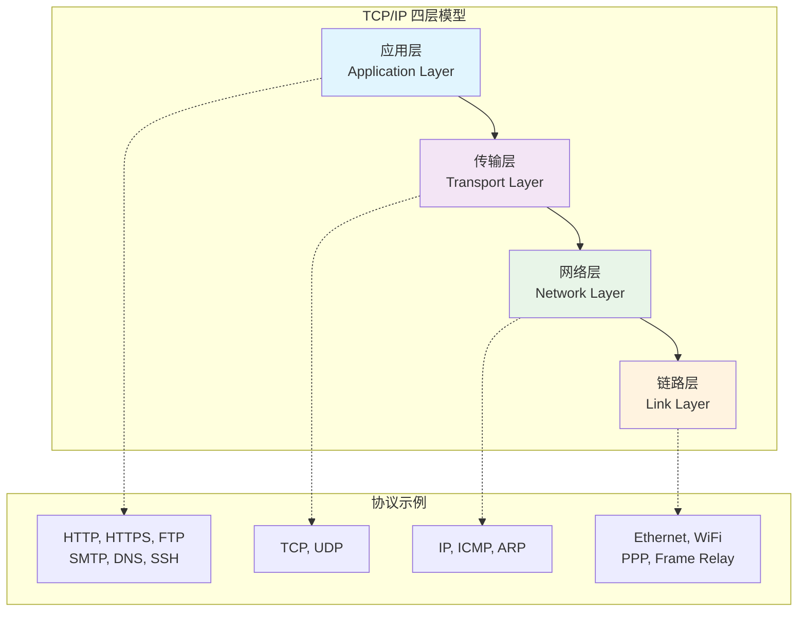

### 1.2 TCP/IP vs OSI七层模型对比

| OSI七层模型 | TCP/IP四层模型 | 主要功能 | 常见协议 | 数据单位 |
|------------|---------------|---------|---------|---------|
| **应用层** | 🔵 **应用层** | 用户接口，网络服务 | HTTP, HTTPS, FTP, SMTP | 数据 |
| **表示层** | ↗️ | 数据加密、压缩、格式转换 | SSL/TLS, JPEG, GIF | 数据 |
| **会话层** | ↗️ | 建立、管理、终止会话 | NetBIOS, RPC | 数据 |
| **传输层** | 🟣 **传输层** | 端到端的数据传输 | TCP, UDP | 段(Segment) |
| **网络层** | 🟢 **网络层** | 路由选择，逻辑寻址 | IP, ICMP, ARP | 包(Packet) |
| **数据链路层** | 🟠 **链路层** | 物理寻址，错误检测 | Ethernet, WiFi | 帧(Frame) |
| **物理层** | ↗️ | 物理连接，电信号传输 | 双绞线, 光纤 | 比特(Bit) |

> 📝 **记忆技巧**：TCP/IP把OSI的上三层(应用、表示、会话)合并为应用层，下两层(数据链路、物理)合并为链路层

### 1.3 数据封装与解封装过程

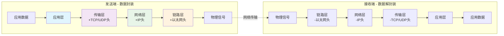

## 2. 链路层详解 🟠

### 2.1 链路层的职责

链路层是TCP/IP协议栈的最底层，负责在**直接相连**的两个网络节点之间传输数据。

#### 🎯 主要功能

1. **物理寻址**：使用MAC地址标识网络设备
2. **帧定界**：确定数据帧的开始和结束
3. **错误检测**：检测传输过程中的错误
4. **流量控制**：防止发送方过快发送数据

### 2.2 以太网帧结构

```
📦 以太网帧结构 (1518字节)
┌─────────────┬──────────────┬──────────┬─────────────────┬─────┐
│前导码(8字节) │目标MAC(6字节) │源MAC(6字节)│类型/长度(2字节) │数据  │CRC(4字节)
└─────────────┴──────────────┴──────────┴─────────────────┴─────┘
              ↑                         ↑                ↑
              物理地址                   协议类型          错误检测
```

### 2.3 MAC地址详解

#### MAC地址格式

| 组成部分 | 位数 | 示例 | 说明 |
|---------|-----|------|------|
| **OUI** | 24位 | `00:1B:44` | 组织唯一标识符(厂商代码) |
| **设备标识** | 24位 | `11:3A:B7` | 厂商分配的设备唯一编号 |
| **完整地址** | 48位 | `00:1B:44:11:3A:B7` | 全球唯一的硬件地址 |

#### 特殊MAC地址

```
🔹 广播地址：FF:FF:FF:FF:FF:FF (所有设备都会接收)
🔹 组播地址：01:00:5E:xx:xx:xx (特定组的设备接收)
🔹 单播地址：具体的设备MAC地址
```

### 2.4 ARP协议工作原理

ARP (Address Resolution Protocol) 用于将IP地址转换为MAC地址。

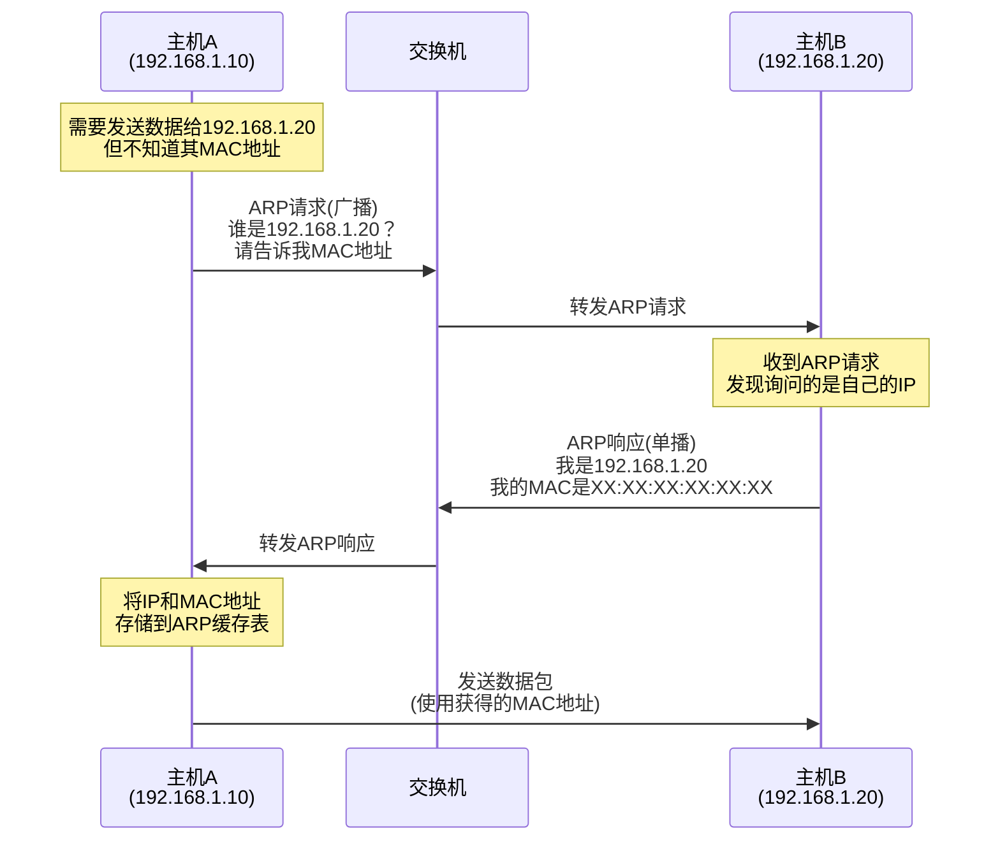

### 2.5 交换机工作原理

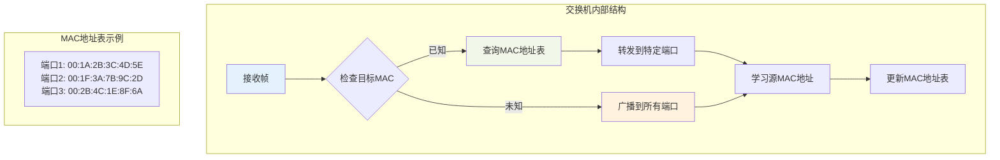

## 3. 网络层详解 🟢

### 3.1 IP协议核心功能

网络层的核心是IP协议，负责在不同网络间进行**路由选择**和**逻辑寻址**。

#### 🎯 主要职责

1. **逻辑寻址**：使用IP地址标识网络中的设备
2. **路由选择**：决定数据包从源到目标的最佳路径
3. **分片与重组**：处理不同网络间的MTU差异
4. **生存时间控制**：防止数据包在网络中无限循环

### 3.2 IPv4地址详解

#### IPv4地址结构

```
📍 IPv4地址格式 (32位)
┌─────────┬─────────┬─────────┬─────────┐
│  8位    │  8位    │  8位    │  8位    │
│ 192     │ 168     │  1      │  100    │
└─────────┴─────────┴─────────┴─────────┘
    ↓         ↓         ↓         ↓
 11000000  10101000  00000001  01100100
```

#### IP地址分类

| 类别 | 地址范围 | 网络位 | 主机位 | 默认子网掩码 | 用途 | 示例 |
|-----|----------|-------|-------|-------------|-----|------|
| **A类** | 1.0.0.0 - 126.255.255.255 | 8位 | 24位 | 255.0.0.0 (/8) | 大型网络 | 10.0.0.1 |
| **B类** | 128.0.0.0 - 191.255.255.255 | 16位 | 16位 | 255.255.0.0 (/16) | 中型网络 | 172.16.1.1 |
| **C类** | 192.0.0.0 - 223.255.255.255 | 24位 | 8位 | 255.255.255.0 (/24) | 小型网络 | 192.168.1.1 |
| **D类** | 224.0.0.0 - 239.255.255.255 | - | - | - | 多播 | 224.0.0.1 |
| **E类** | 240.0.0.0 - 255.255.255.255 | - | - | - | 保留 | - |

#### 私有IP地址范围

```
🏠 私有IP地址 (RFC 1918)
┌─ A类私有: 10.0.0.0/8      (10.0.0.0 - 10.255.255.255)
├─ B类私有: 172.16.0.0/12   (172.16.0.0 - 172.31.255.255)
└─ C类私有: 192.168.0.0/16  (192.168.0.0 - 192.168.255.255)

🌐 特殊地址
├─ 环回地址: 127.0.0.0/8    (本机测试)
├─ 链路本地: 169.254.0.0/16 (APIPA自动配置)
├─ 广播地址: 255.255.255.255 (本地网络广播)
└─ 0.0.0.0              (表示本网络)
```

### 3.3 子网划分详解

#### CIDR表示法

```
📊 CIDR (Classless Inter-Domain Routing) 示例
192.168.1.0/24 表示：
├─ 网络地址: 192.168.1.0
├─ 子网掩码: 255.255.255.0 (24个1)
├─ 广播地址: 192.168.1.255
├─ 可用主机: 192.168.1.1 - 192.168.1.254
└─ 主机数量: 2^(32-24) - 2 = 254台
```

#### 子网划分实例

**场景**：将192.168.1.0/24网络划分为4个子网

| 子网 | 网络地址 | CIDR | 子网掩码 | 可用IP范围 | 广播地址 | 主机数 |
|------|----------|------|----------|------------|----------|--------|
| **子网1** | 192.168.1.0 | /26 | 255.255.255.192 | .1 - .62 | 192.168.1.63 | 62 |
| **子网2** | 192.168.1.64 | /26 | 255.255.255.192 | .65 - .126 | 192.168.1.127 | 62 |
| **子网3** | 192.168.1.128 | /26 | 255.255.255.192 | .129 - .190 | 192.168.1.191 | 62 |
| **子网4** | 192.168.1.192 | /26 | 255.255.255.192 | .193 - .254 | 192.168.1.255 | 62 |

### 3.4 IP数据包结构

```
📦 IPv4 数据包头部 (20-60字节)
┌─────┬─────┬─────────────┬─────────────────┬─────────────────┐
│版本 │头长度│服务类型(ToS) │      总长度      │     标识符      │
│4位  │4位   │   8位      │     16位       │     16位       │
├─────┴─────┼─────────────┼─────────────────┼─────────────────┤
│    标志    │           片偏移量           │  TTL  │协议类型 │
│   3位     │            13位            │  8位  │  8位   │
├───────────┼─────────────────────────────┼───────┴─────────┤
│           │          头部校验和          │  源IP地址       │
│           │            16位            │     32位       │
├───────────┴─────────────────────────────┼─────────────────┤
│                目标IP地址                │    选项(可选)    │
│                 32位                   │   0-40字节     │
└─────────────────────────────────────────┴─────────────────┘
```

#### 重要字段说明

| 字段 | 大小 | 作用 | 示例值 |
|------|------|------|--------|
| **版本** | 4位 | IP版本号 | 4 (IPv4) |
| **头长度** | 4位 | 头部长度/4 | 5 (20字节) |
| **总长度** | 16位 | 整个IP包长度 | 1500 |
| **标识符** | 16位 | 分片重组标识 | 12345 |
| **TTL** | 8位 | 生存时间(跳数) | 64 |
| **协议类型** | 8位 | 上层协议 | 6(TCP), 17(UDP) |
| **源IP** | 32位 | 发送方IP | 192.168.1.10 |
| **目标IP** | 32位 | 接收方IP | 192.168.1.20 |

### 3.5 路由工作原理

#### 路由表结构

```
🗺️ 路由表示例 (Linux: route -n)
目标网络        网关          子网掩码       接口    跃点数
0.0.0.0        192.168.1.1   0.0.0.0       eth0     1     ← 默认路由
192.168.1.0    0.0.0.0       255.255.255.0 eth0     0     ← 直连网络
10.0.0.0       192.168.1.254 255.0.0.0     eth0     2     ← 静态路由
172.16.0.0     192.168.1.253 255.240.0.0   eth0     3     ← 静态路由
```

#### 路由选择过程

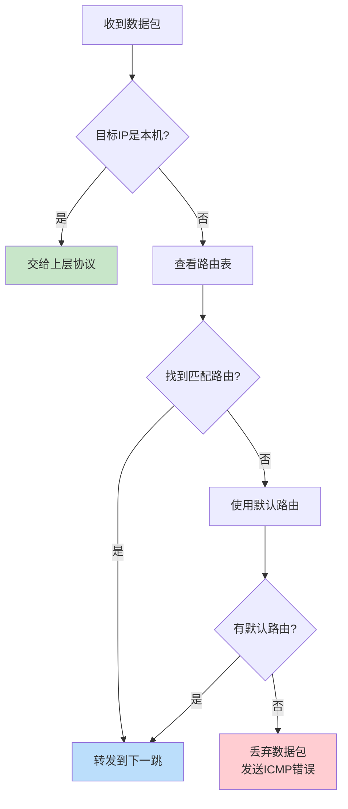

### 3.6 ICMP协议详解

ICMP (Internet Control Message Protocol) 用于网络诊断和错误报告。

#### 常见ICMP消息类型

| 类型 | 代码 | 消息名称 | 用途 | 工具 |
|------|------|----------|------|------|
| **0** | 0 | Echo Reply | ping响应 | ping |
| **8** | 0 | Echo Request | ping请求 | ping |
| **3** | 0 | 网络不可达 | 路由错误 | traceroute |
| **3** | 1 | 主机不可达 | 主机离线 | - |
| **3** | 3 | 端口不可达 | 端口关闭 | - |
| **11** | 0 | TTL超时 | 时间超限 | traceroute |

#### Ping工作流程

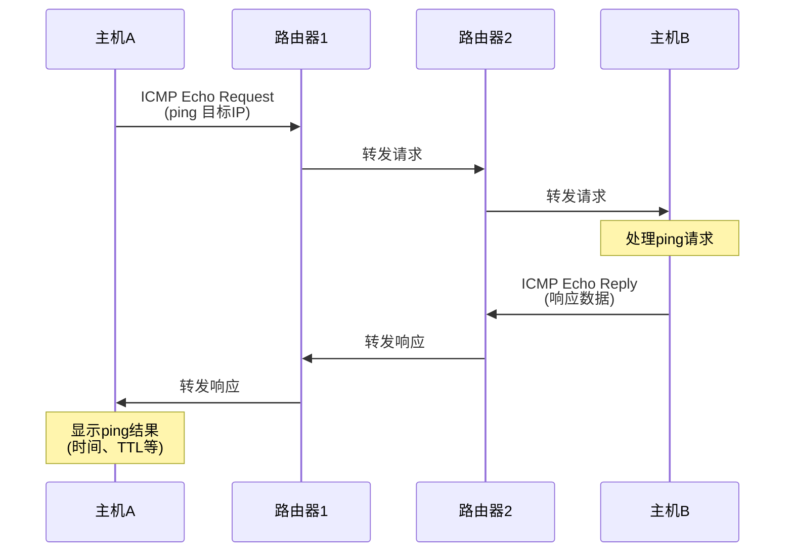

## 4. 传输层详解 🟣

### 4.1 传输层的作用

传输层提供**端到端**的数据传输服务，是应用程序之间通信的桥梁。

#### 🎯 核心功能

1. **端口管理**：区分同一主机上的不同应用程序
2. **数据分段**：将大数据切分为小段传输
3. **可靠传输**：提供错误检测、重传等机制
4. **流量控制**：防止发送方过快发送数据
5. **拥塞控制**：避免网络拥塞

### 4.2 端口号详解

#### 端口号分类

| 端口范围 | 分类 | 用途 | 示例 |
|----------|------|------|------|
| **0-1023** | 知名端口(Well-known) | 系统服务 | 80(HTTP), 443(HTTPS), 22(SSH) |
| **1024-49151** | 注册端口(Registered) | 用户应用 | 3306(MySQL), 5432(PostgreSQL) |
| **49152-65535** | 动态端口(Dynamic) | 临时连接 | 客户端随机分配 |

#### 常用端口号

```
🌐 Web服务
├─ HTTP:  80    ← 网页浏览
├─ HTTPS: 443   ← 加密网页
└─ FTP:   21    ← 文件传输

📧 邮件服务
├─ SMTP:  25    ← 发送邮件
├─ POP3:  110   ← 接收邮件
└─ IMAP:  143   ← 邮件管理

🛠️ 远程管理
├─ SSH:   22    ← 安全Shell
├─ Telnet: 23   ← 远程登录
└─ RDP:   3389  ← 远程桌面

💾 数据库
├─ MySQL:    3306
├─ PostgreSQL: 5432
└─ MongoDB:   27017
```

### 4.3 TCP协议详解

#### TCP连接建立 - 三次握手

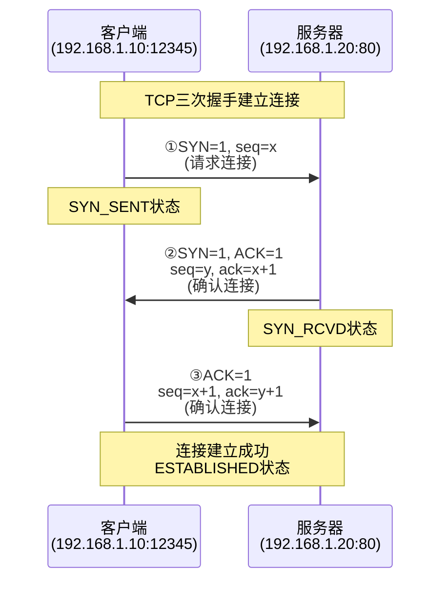

#### TCP连接断开 - 四次挥手

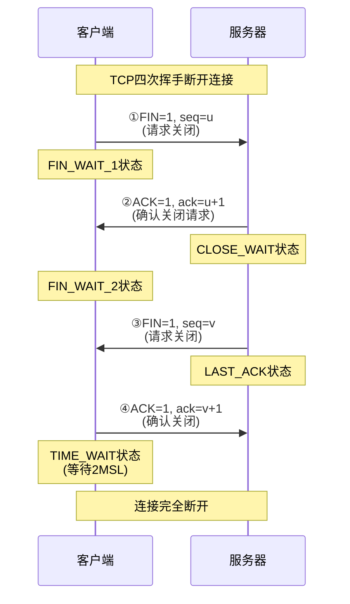

#### TCP报文段结构

```
📦 TCP 报文段头部 (20-60字节)
┌─────────────────┬─────────────────┬─────────────────┬─────────────────┐
│    源端口号      │    目标端口号    │                │                │
│     16位        │     16位        │    序列号 (32位)  │                │
├─────────────────┼─────────────────┼─────────────────┼─────────────────┤
│                │                │    确认号 (32位)  │                │
│                │                │                │                │
├─────┬───┬───────┼─────────────────┼─────────────────┼─────────────────┤
│头长度│保留│  标志   │    窗口大小      │     校验和       │    紧急指针      │
│4位  │3位│ 9位   │     16位       │     16位       │     16位       │
├─────┴───┴───────┼─────────────────┼─────────────────┼─────────────────┤
│    选项(可选)    │                │     数据         │                │
│   0-40字节      │                │                │                │
└─────────────────┴─────────────────┴─────────────────┴─────────────────┘
```

#### TCP标志位详解

| 标志位 | 全称 | 作用 | 示例场景 |
|--------|------|------|----------|
| **URG** | Urgent | 紧急数据 | 中断信号(Ctrl+C) |
| **ACK** | Acknowledge | 确认应答 | 所有数据传输 |
| **PSH** | Push | 立即发送 | 交互式应用 |
| **RST** | Reset | 连接重置 | 连接错误 |
| **SYN** | Synchronize | 同步序号 | 建立连接 |
| **FIN** | Finish | 结束连接 | 关闭连接 |

#### TCP可靠性机制

##### 1. 确认应答与重传

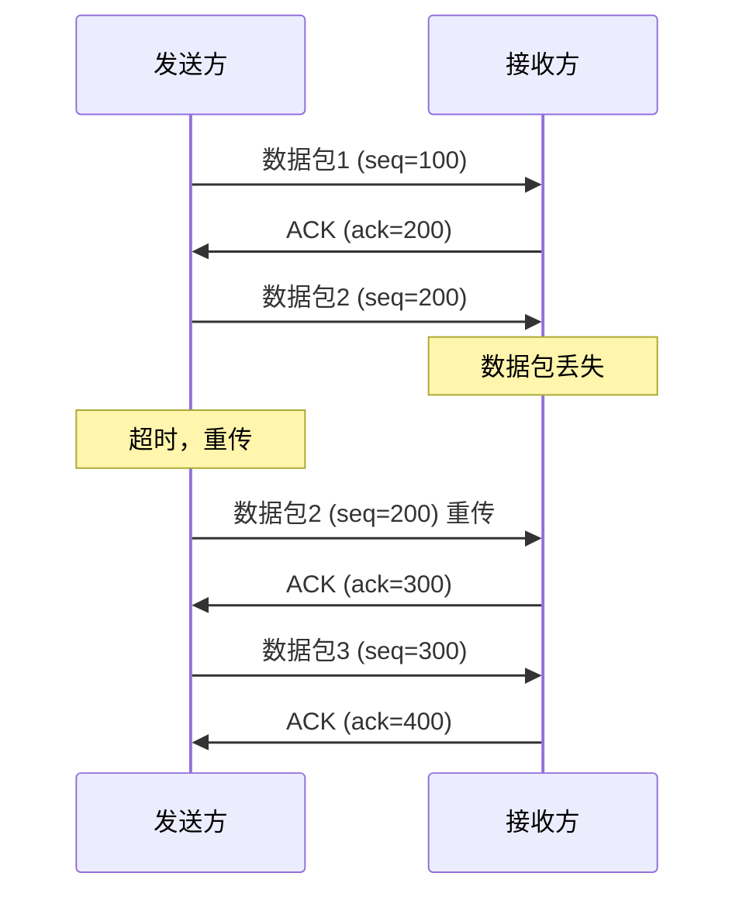

##### 2. 滑动窗口机制

```
📊 滑动窗口示例 (窗口大小=4)

发送方缓冲区：
[已发送已确认][已发送未确认][可发送][不可发送]
   1  2  3     4  5  6  7     8  9     10 11 12
               ←─────────→
                发送窗口

接收方缓冲区：
[已接收][可接收][不可接收]
 1 2 3   4 5 6    7 8 9
         ←───→
         接收窗口
```

##### 3. 拥塞控制算法

| 阶段 | 算法 | 特点 | 窗口变化 |
|------|------|------|----------|
| **慢启动** | Slow Start | 指数增长 | cwnd = cwnd × 2 |
| **拥塞避免** | Congestion Avoidance | 线性增长 | cwnd = cwnd + 1 |
| **快重传** | Fast Retransmit | 立即重传 | 收到3个重复ACK |
| **快恢复** | Fast Recovery | 快速恢复 | cwnd = ssthresh |

### 4.4 UDP协议详解

UDP (User Datagram Protocol) 是一种**无连接**、**不可靠**但**高效**的传输协议。

#### UDP vs TCP 对比

| 特性 | TCP | UDP | 适用场景 |
|------|-----|-----|----------|
| **连接性** | 面向连接 | 无连接 | TCP:文件传输 / UDP:实时游戏 |
| **可靠性** | 可靠传输 | 不可靠 | TCP:网页浏览 / UDP:视频流 |
| **顺序性** | 保证顺序 | 不保证 | TCP:邮件发送 / UDP:DNS查询 |
| **重传机制** | 自动重传 | 无重传 | TCP:数据库 / UDP:广播 |
| **头部开销** | 20-60字节 | 8字节 | TCP:稳定性 / UDP:效率 |
| **传输速度** | 较慢 | 较快 | TCP:准确性 / UDP:实时性 |

#### UDP报文结构

```
📦 UDP 数据报头部 (8字节)
┌─────────────────┬─────────────────┐
│    源端口号      │   目标端口号     │
│     16位        │     16位        │
├─────────────────┼─────────────────┤
│     长度        │     校验和       │
│     16位        │     16位        │
├─────────────────┴─────────────────┤
│              数据                │
│                                 │
└─────────────────────────────────┘
```

#### UDP应用场景

```
🎮 实时应用
├─ 在线游戏    ← 延迟敏感
├─ 视频直播    ← 丢包可接受
└─ 语音通话    ← 实时性重要

🌐 网络服务
├─ DNS查询     ← 简单快速
├─ DHCP分配    ← 广播特性
└─ SNMP监控    ← 轻量级

📺 多媒体传输
├─ 流媒体      ← 连续播放
├─ 在线电视    ← 实时传输
└─ 音频流      ← 时间敏感
```

## 5. 应用层详解 🔵

### 5.1 应用层协议概述

应用层是TCP/IP协议栈的最高层，直接为用户应用程序提供网络服务。

#### 主要应用层协议分类

| 协议类别 | 协议名称 | 端口 | 传输层协议 | 主要功能 |
|----------|----------|------|------------|----------|
| **Web服务** | HTTP | 80 | TCP | 网页传输 |
| | HTTPS | 443 | TCP | 加密网页 |
| **文件传输** | FTP | 21,20 | TCP | 文件上传下载 |
| | SFTP | 22 | TCP | 安全文件传输 |
| **邮件服务** | SMTP | 25 | TCP | 发送邮件 |
| | POP3 | 110 | TCP | 接收邮件 |
| | IMAP | 143 | TCP | 邮件管理 |
| **远程访问** | SSH | 22 | TCP | 安全Shell |
| | Telnet | 23 | TCP | 远程登录 |
| **域名解析** | DNS | 53 | UDP/TCP | 域名转IP |
| **网络管理** | SNMP | 161 | UDP | 设备监控 |

### 5.2 HTTP协议详解

HTTP (HyperText Transfer Protocol) 是Web通信的基础协议。

#### HTTP请求格式

```
📤 HTTP请求示例
GET /index.html HTTP/1.1          ← 请求行
Host: www.example.com              ← 必需头部
User-Agent: Mozilla/5.0...         ← 客户端信息
Accept: text/html,application/*    ← 接受类型
Accept-Language: zh-CN,en          ← 语言偏好
Connection: keep-alive             ← 连接控制
                                  ← 空行
[请求体 - GET通常为空]             ← 消息体
```

#### HTTP响应格式

```
📥 HTTP响应示例
HTTP/1.1 200 OK                   ← 状态行
Content-Type: text/html            ← 内容类型
Content-Length: 1234               ← 内容长度
Server: Apache/2.4.41              ← 服务器信息
Date: Mon, 23 Jan 2025 10:00:00    ← 响应时间
                                  ← 空行
<!DOCTYPE html>                    ← 响应体
<html>
<head><title>网页</title></head>
...
```

#### HTTP状态码分类

| 状态码范围 | 类别 | 含义 | 常见示例 |
|------------|------|------|----------|
| **1xx** | 信息性 | 请求已接收，继续处理 | 100 Continue |
| **2xx** | 成功 | 请求已成功处理 | 200 OK, 201 Created |
| **3xx** | 重定向 | 需要进一步操作 | 301 Moved, 302 Found |
| **4xx** | 客户端错误 | 请求有语法错误 | 404 Not Found, 403 Forbidden |
| **5xx** | 服务器错误 | 服务器处理错误 | 500 Internal Error, 503 Unavailable |

#### HTTP方法详解

| 方法 | 用途 | 幂等性 | 安全性 | 示例 |
|------|------|--------|--------|------|
| **GET** | 获取资源 | ✅ | ✅ | 获取网页内容 |
| **POST** | 创建资源 | ❌ | ❌ | 提交表单数据 |
| **PUT** | 更新资源 | ✅ | ❌ | 上传文件 |
| **DELETE** | 删除资源 | ✅ | ❌ | 删除文件 |
| **HEAD** | 获取头部 | ✅ | ✅ | 检查资源状态 |
| **PATCH** | 部分更新 | ❌ | ❌ | 更新部分数据 |

### 5.3 HTTPS协议详解

HTTPS = HTTP + SSL/TLS，提供加密、身份验证和数据完整性保护。

#### HTTPS握手过程

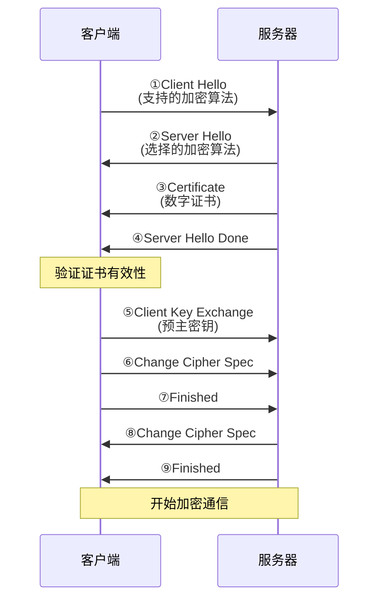

#### 对称加密 vs 非对称加密

| 特性 | 对称加密 | 非对称加密 | HTTPS使用 |
|------|----------|------------|-----------|
| **密钥** | 同一个密钥 | 公钥+私钥 | 混合使用 |
| **速度** | 快 | 慢 | 数据用对称 |
| **安全性** | 密钥分发困难 | 更安全 | 握手用非对称 |
| **示例** | AES, DES | RSA, ECC | TLS结合两者 |

### 5.4 DNS协议详解

DNS (Domain Name System) 将域名转换为IP地址。

#### DNS查询过程

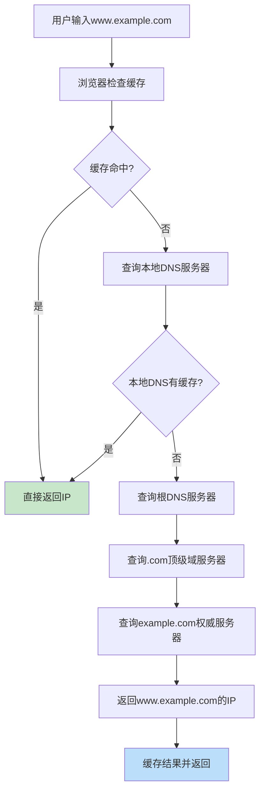

#### DNS记录类型

| 记录类型 | 全称 | 作用 | 示例 |
|----------|------|------|------|
| **A** | Address | 域名→IPv4 | www.example.com → 192.168.1.100 |
| **AAAA** | IPv6 Address | 域名→IPv6 | www.example.com → 2001:db8::1 |
| **CNAME** | Canonical Name | 域名别名 | blog.example.com → www.example.com |
| **MX** | Mail Exchange | 邮件服务器 | example.com → mail.example.com |
| **NS** | Name Server | 域名服务器 | example.com → ns1.example.com |
| **TXT** | Text | 文本信息 | SPF, DKIM等验证信息 |

## 6. 网络通信完整流程

### 6.1 一次HTTP请求的完整过程

当你在浏览器输入`http://www.example.com/index.html`时：

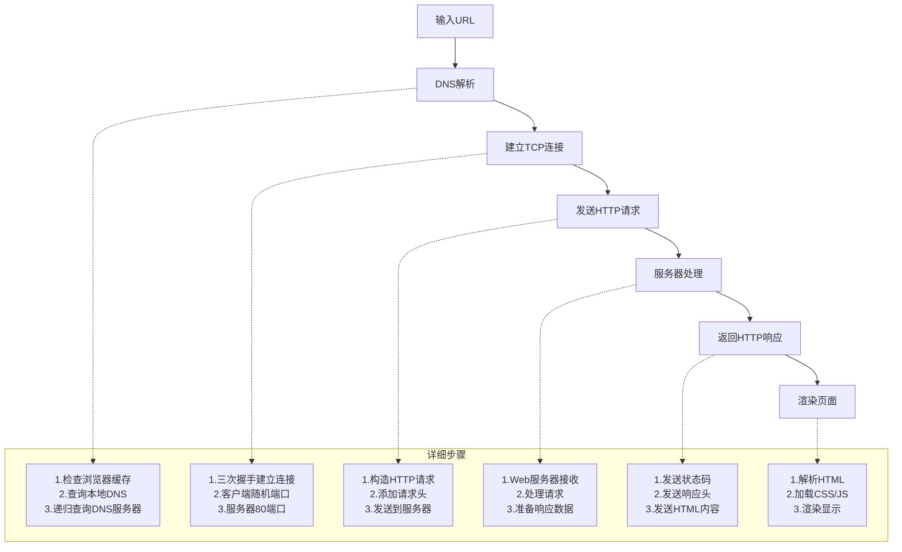

### 6.2 数据包在网络中的旅程

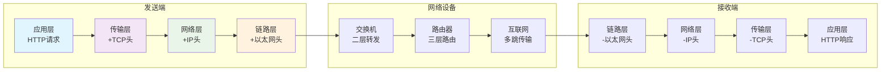

### 6.3 网络性能指标

#### 重要性能参数

| 指标 | 定义 | 影响因素 | 优化方法 | 典型值 |
|------|------|----------|----------|--------|
| **带宽** | 最大传输速率 | 物理介质 | 升级线路 | 100Mbps |
| **延迟** | 数据传输时间 | 距离、设备 | 优化路由 | 50ms |
| **吞吐量** | 实际传输速率 | 网络状况 | 拥塞控制 | 80Mbps |
| **丢包率** | 数据包丢失比例 | 网络拥塞 | 流量控制 | <0.1% |
| **抖动** | 延迟变化幅度 | 网络稳定性 | QoS保证 | <10ms |

## 7. 常用网络工具与命令

### 7.1 网络诊断工具

#### Ping - 连通性测试

```bash
# 基本ping测试
ping www.baidu.com

# 指定次数
ping -c 4 192.168.1.1

# 设置包大小
ping -s 1000 www.google.com

# 输出示例
PING www.baidu.com (14.215.177.38): 56 data bytes
64 bytes from 14.215.177.38: icmp_seq=0 ttl=55 time=23.456 ms
64 bytes from 14.215.177.38: icmp_seq=1 ttl=55 time=24.123 ms
```

#### Traceroute - 路径追踪

```bash
# 追踪到目标的路径
traceroute www.baidu.com

# 输出示例 (显示每一跳)
traceroute to www.baidu.com (14.215.177.38), 30 hops max, 60 byte packets
 1  192.168.1.1 (192.168.1.1)  1.234 ms  1.456 ms  1.678 ms
 2  10.0.0.1 (10.0.0.1)  12.34 ms  12.56 ms  12.78 ms
 3  * * *  (超时)
 4  14.215.177.38 (14.215.177.38)  23.45 ms  24.56 ms  25.67 ms
```

#### Netstat - 网络连接状态

```bash
# 显示所有网络连接
netstat -an

# 显示监听端口
netstat -tuln

# 显示进程信息
netstat -tulnp

# 输出示例
Proto Recv-Q Send-Q Local Address    Foreign Address  State    PID/Program
tcp   0      0      0.0.0.0:22       0.0.0.0:*        LISTEN   1234/sshd
tcp   0      0      192.168.1.10:80  192.168.1.20:12345 ESTABLISHED 5678/apache2
```

### 7.2 抓包分析工具

#### Wireshark过滤器

```bash
# 协议过滤
http                    # 只显示HTTP流量
tcp.port == 80          # 端口80的TCP流量
ip.addr == 192.168.1.1  # 特定IP的流量

# 组合过滤
tcp.port == 80 and ip.src == 192.168.1.10
http.request.method == "GET"
dns.qry.name contains "google"
```

### 7.3 网络配置命令

#### IP地址配置

```bash
# 查看网络接口
ip addr show
ifconfig

# 配置IP地址
ip addr add 192.168.1.100/24 dev eth0
ifconfig eth0 192.168.1.100 netmask 255.255.255.0

# 启用/禁用接口
ip link set eth0 up
ip link set eth0 down
```

#### 路由配置

```bash
# 查看路由表
ip route show
route -n

# 添加路由
ip route add 10.0.0.0/8 via 192.168.1.1
route add -net 10.0.0.0/8 gw 192.168.1.1

# 添加默认路由
ip route add default via 192.168.1.1
```

## 8. 网络安全基础

### 8.1 常见网络攻击

#### 攻击类型分类

| 攻击类型 | 攻击方式 | 影响 | 防护措施 |
|----------|----------|------|----------|
| **DDoS** | 大量请求耗尽资源 | 服务不可用 | 限流、CDN |
| **中间人** | 截获并修改数据 | 数据泄露 | HTTPS、VPN |
| **端口扫描** | 探测开放端口 | 信息泄露 | 防火墙、隐藏服务 |
| **DNS劫持** | 重定向DNS解析 | 钓鱼攻击 | DNS over HTTPS |
| **ARP欺骗** | 伪造MAC地址 | 流量劫持 | 静态ARP、交换机安全 |

### 8.2 防护技术

#### 防火墙规则示例

```bash
# iptables防火墙规则
# 允许SSH连接
iptables -A INPUT -p tcp --dport 22 -j ACCEPT

# 允许HTTP/HTTPS
iptables -A INPUT -p tcp --dport 80 -j ACCEPT
iptables -A INPUT -p tcp --dport 443 -j ACCEPT

# 阻止特定IP
iptables -A INPUT -s 192.168.1.100 -j DROP

# 限制连接速率
iptables -A INPUT -p tcp --dport 80 -m limit --limit 25/minute --limit-burst 100 -j ACCEPT
```

## 9. 实战案例分析

### 9.1 网络故障排查流程

#### 故障排查步骤

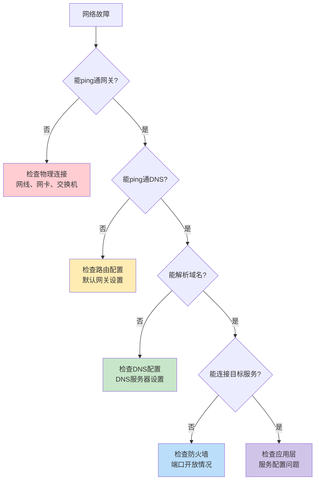

### 9.2 性能优化案例

#### Web服务器优化

```bash
# 1. TCP参数优化
echo 'net.core.somaxconn = 65535' >> /etc/sysctl.conf
echo 'net.ipv4.tcp_max_tw_buckets = 6000' >> /etc/sysctl.conf
echo 'net.ipv4.tcp_tw_reuse = 1' >> /etc/sysctl.conf

# 2. 连接数优化
ulimit -n 65535

# 3. Apache配置优化
<VirtualHost *:80>
    KeepAlive On
    MaxKeepAliveRequests 100
    KeepAliveTimeout 15
</VirtualHost>
```

## 10. 未来发展趋势

### 10.1 IPv6技术

#### IPv4 vs IPv6对比

| 特性 | IPv4 | IPv6 | 优势 |
|------|------|------|------|
| **地址长度** | 32位 | 128位 | 地址空间巨大 |
| **地址数量** | 43亿 | 3.4×10³⁸ | 几乎无限 |
| **表示方法** | 点分十进制 | 冒号十六进制 | 层次化结构 |
| **自动配置** | DHCP | SLAAC | 即插即用 |
| **安全性** | 可选 | 内置IPSec | 原生安全 |

#### IPv6地址格式

```
📍 IPv6地址示例
完整格式: 2001:0db8:85a3:0000:0000:8a2e:0370:7334
压缩格式: 2001:db8:85a3::8a2e:370:7334

🏠 特殊地址
环回地址: ::1
链路本地: fe80::/10
组播地址: ff00::/8
全球单播: 2000::/3
```

### 10.2 新兴网络技术

#### SDN (软件定义网络)

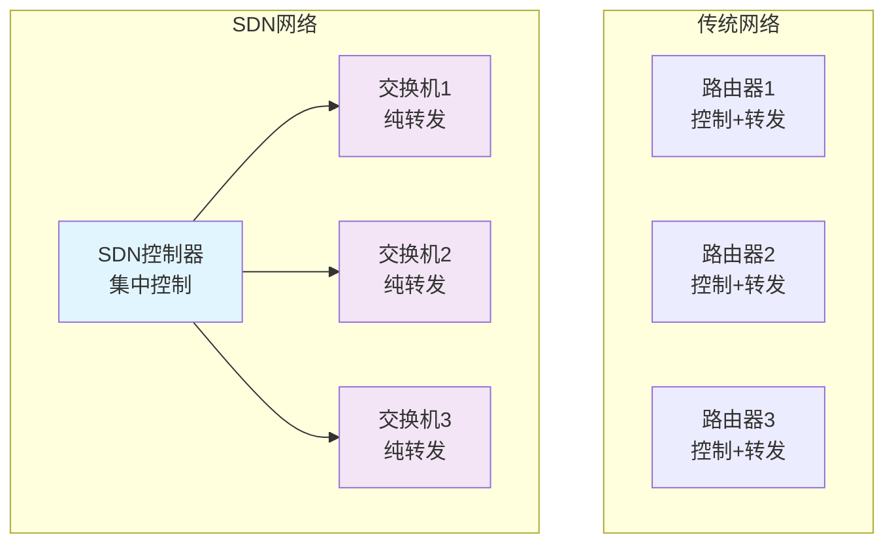

## 11. 总结与学习建议

### 11.1 TCP/IP学习路径

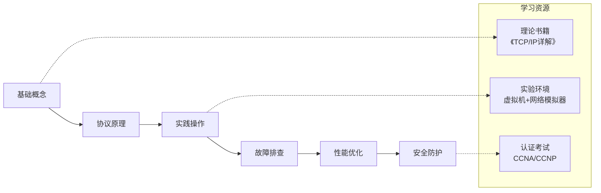

### 11.2 实践建议

#### 🎯 动手实验

1. **搭建实验环境**
   - 使用VirtualBox/VMware创建多个虚拟机
   - 配置不同的网络拓扑
   - 模拟各种网络场景

2. **抓包分析练习**
   - 使用Wireshark分析HTTP、TCP、DNS流量
   - 观察三次握手、四次挥手过程
   - 分析网络性能问题

3. **网络编程实践**
   - 编写Socket程序理解TCP/UDP
   - 实现简单的HTTP服务器
   - 学习网络编程API

#### 📚 进阶学习

| 阶段 | 学习重点 | 推荐资源 |
|------|----------|----------|
| **初级** | 协议基础、基本概念 | 《图解TCP/IP》 |
| **中级** | 协议细节、故障排查 | 《TCP/IP详解》 |
| **高级** | 性能优化、安全防护 | RFC文档、实际项目 |

---

## 🎉 结语

TCP/IP协议栈是现代网络通信的基石，理解它的工作原理对于网络工程师、软件开发者和系统管理员都至关重要。通过本文的图解和实例，相信你已经对TCP/IP有了更深入的理解。

> 💡 **学习建议**：网络知识需要理论与实践相结合，建议多动手搭建实验环境，通过实际操作加深理解！

记住：**网络世界虽然复杂，但每个数据包都在严格按照协议规则进行有序的"旅行"**！

---

**延伸阅读**：
- [HTTP协议深度解析](./http-protocol-deep-dive.md)
- [网络安全防护指南](./network-security-guide.md)
- [高性能网络编程实践](./high-performance-network-programming.md)