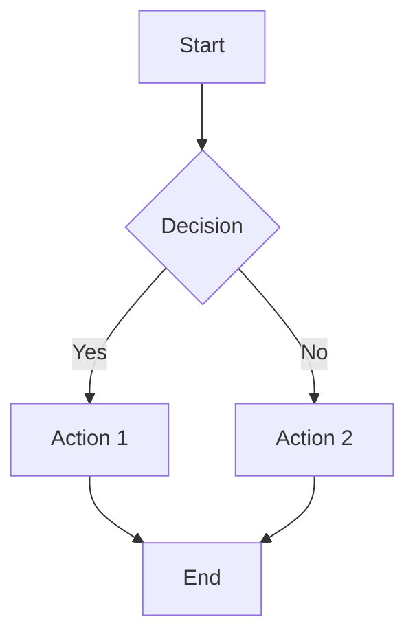
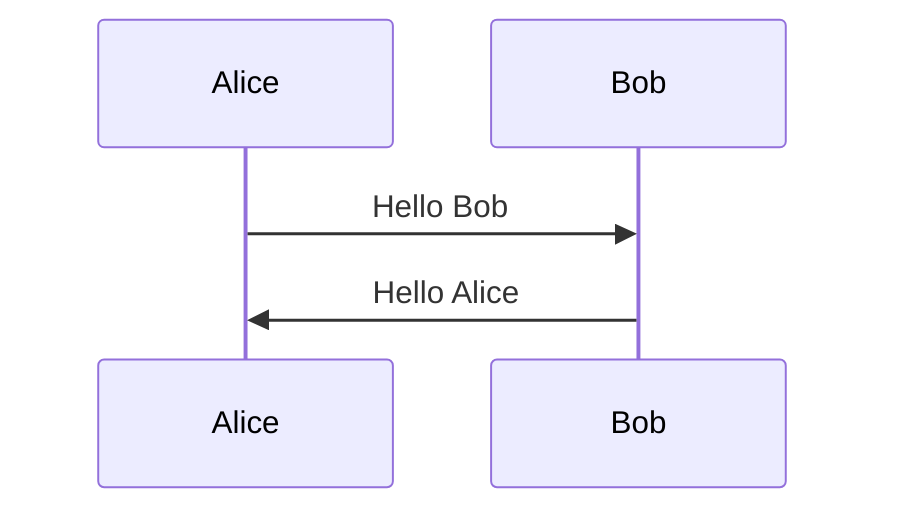
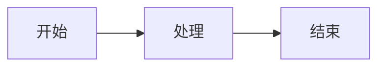

# Mermaid 图表测试

## 简单流程图

```mermaid
flowchart TD
    A[Start] --> B{Decision}
    B -->|Yes| C[Action 1]
    B -->|No| D[Action 2]
    C --> E[End]
    D --> E
```

## 序列图

```mermaid
sequenceDiagram
    participant A as Alice
    participant B as Bob
    A->>B: Hello Bob
    B->>A: Hello Alice
```

## 带中文的流程图

```mermaid
flowchart LR
    A["开始"] --> B["处理"]
    B --> C["结束"]
```